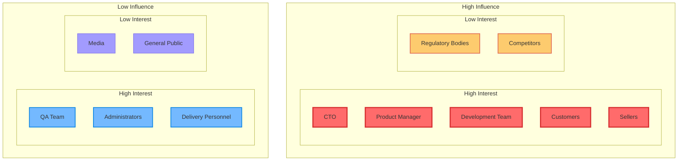

# Stakeholder Analysis

## Overview

This document provides detailed analysis of all stakeholders in the GenAI Demo system, including their needs, expectations, influence, and engagement strategies.

## Stakeholder Classification

### Primary Stakeholders

#### 1. End Users

##### Customers
- **Role Description**: Consumers who use the platform to purchase products
- **Primary Needs**:
  - Intuitive and user-friendly shopping interface
  - Secure and reliable payment experience
  - Fast and accurate product search
  - Transparent order tracking
  - Quality customer service
- **Expectations**:
  - 24/7 system availability
  - Personalized recommendations
  - Multiple payment options
  - Fast delivery service
- **Interaction Method**: Web App, Mobile App
- **Impact Level**: 🔴 Very High
- **Engagement Strategy**: User experience research, A/B testing, customer feedback collection

##### Sellers
- **Role Description**: Merchants and suppliers selling products on the platform
- **Primary Needs**:
  - Efficient product management tools
  - Real-time order processing system
  - Detailed sales analytics reports
  - Flexible promotional campaign settings
  - Stable payment collection mechanism
- **Expectations**:
  - Low transaction fees
  - Fast fund settlement
  - Rich marketing tools
  - Professional technical support
- **Interaction Method**: Seller Portal, API Integration
- **Impact Level**: 🔴 Very High
- **Engagement Strategy**: Seller training, regular communication meetings, feature requirement collection

#### 2. Business Stakeholders

##### Product Manager
- **Role Description**: Responsible for product strategy and feature planning
- **Primary Concerns**:
  - Market demand analysis
  - Feature priority ranking
  - User experience optimization
  - Competitive analysis
  - ROI evaluation
- **Decision Impact**: 🔴 Very High
- **Engagement Method**: Product planning meetings, requirement reviews, user research
- **Success Metrics**: User satisfaction, feature adoption rate, market share

##### CTO (Chief Technology Officer)
- **Role Description**: Technical strategy and architecture decision maker
- **Primary Concerns**:
  - Technical architecture selection
  - System scalability
  - Security and compliance
  - Technical debt management
  - Team technical capabilities
- **Decision Impact**: 🔴 Very High
- **Engagement Method**: Architecture reviews, technology selection, risk assessment
- **Success Metrics**: System stability, development efficiency, technical innovation

#### 3. Technical Stakeholders

##### Development Team
- **Role Description**: Technical personnel responsible for system development and maintenance
- **Primary Needs**:
  - Clear technical specifications
  - Efficient development tools
  - Stable development environment
  - Complete technical documentation
  - Continuous learning opportunities
- **Concerns**:
  - Code quality
  - Development efficiency
  - Technical debt
  - Tools and processes
- **Impact Level**: 🔴 Very High
- **Engagement Strategy**: Technical sharing, code reviews, tool improvement

##### DevOps Team
- **Role Description**: Responsible for deployment, monitoring, and infrastructure management
- **Primary Needs**:
  - Automated deployment processes
  - Comprehensive monitoring systems
  - Efficient incident handling
  - Reliable backup and recovery
  - Secure access control
- **Concerns**:
  - System stability
  - Deployment efficiency
  - Monitoring coverage
  - Security compliance
- **Impact Level**: 🔴 Very High
- **Engagement Strategy**: Automation improvement, monitoring optimization, incident reviews

### Secondary Stakeholders

#### 1. External Partners

##### Payment Providers
- **Representatives**: Stripe, PayPal
- **Relationship Type**: Service Provider
- **Primary Concerns**:
  - API usage compliance
  - Transaction volume and revenue
  - Security standard adherence
  - Technical support requirements
- **Impact Scope**: Payment processing, fund security
- **Management Strategy**: 
  - Regular technical coordination
  - SLA monitoring and evaluation
  - Backup plan preparation
  - Contract term optimization

##### Cloud Service Providers
- **Representatives**: Amazon Web Services (AWS)
- **Relationship Type**: Infrastructure Provider
- **Primary Concerns**:
  - Service usage volume
  - Technical support requirements
  - Security compliance requirements
  - Cost optimization opportunities
- **Impact Scope**: System availability, data security
- **Management Strategy**:
  - Multi-cloud strategy planning
  - Cost monitoring and optimization
  - Disaster recovery preparation
  - Technology roadmap alignment

#### 2. Regulatory Bodies

##### Data Protection Authorities
- **Representatives**: Various national data protection committees
- **Relationship Type**: Regulatory Oversight
- **Primary Concerns**:
  - GDPR compliance
  - Data processing transparency
  - User rights protection
  - Data breach handling
- **Impact Scope**: Data processing, privacy protection
- **Management Strategy**:
  - Proactive compliance measures
  - Regular compliance audits
  - Privacy by design principles
  - Incident response plans

## Stakeholder Influence Analysis

### Influence-Interest Matrix

### Engagement Strategies

#### High Influence + High Interest (Manage Closely)
- **Stakeholders**: CTO, Product Manager, Development Team, Customers, Sellers
- **Strategy**: 
  - Regular communication and negotiation
  - Deep involvement in decision-making process
  - Continuous requirement collection and feedback
  - Build long-term partnerships

#### High Influence + Low Interest (Keep Satisfied)
- **Stakeholders**: Regulatory Bodies, Competitors
- **Strategy**:
  - Proactive compliance and transparent communication
  - Monitor their dynamics and policy changes
  - Build positive public relations
  - Preventive risk management

## Communication Plan

### Communication Frequency and Methods

| Stakeholder | Frequency | Method | Main Content |
|-------------|-----------|--------|--------------|
| **Customers** | Real-time | App notifications, Email, SMS | Order status, promotions, system announcements |
| **Sellers** | Daily | Seller portal, Email | Order notifications, sales reports, policy updates |
| **Development Team** | Daily | Slack, Meetings | Technical discussions, progress updates, problem solving |
| **Product Manager** | Weekly | Meetings, Reports | Feature planning, market analysis, user feedback |
| **CTO** | Monthly | Meetings, Reports | Architecture decisions, technology roadmap, risk assessment |

## Success Metrics

### Stakeholder Satisfaction Metrics

| Stakeholder | Key Metric | Target Value | Measurement Method |
|-------------|------------|--------------|-------------------|
| **Customers** | Customer Satisfaction Score | ≥ 4.5/5.0 | Regular surveys |
| **Sellers** | Seller Retention Rate | ≥ 90% | Monthly statistics |
| **Development Team** | Developer Satisfaction | ≥ 4.0/5.0 | Quarterly surveys |
| **Management** | Business Goal Achievement Rate | ≥ 95% | Monthly evaluation |

---

**Last Updated**: January 22, 2025  
**Maintainer**: Product Management Team  
**Reviewers**: Business Team, Technical Team  
**Language**: English  
**Status**: Active