# Deployment

## Overview

Deployment Viewpoint關注系統的Deployment和Environment配置，包括基礎設施、Containerization、雲端架構和DeploymentPolicy。

## Stakeholders

- **Primary Stakeholder**: DevOps 工程師、運維人員、Deployment管理員
- **Secondary Stakeholder**: Developer、Architect、Project Manager

## Concerns

1. **基礎設施管理**: 雲端Resource配置和管理
2. **ContainerizationPolicy**: Docker 和 Kubernetes Deployment
3. **Environment配置**: 開發、測試、生產Environment設定
4. **Deployment自動化**: CI/CD 流程和自動化Deployment
5. **Monitoring和Observability**: Deployment後的系統Monitoring

## Architectural Elements

### Deployment

- **開發Environment**: 本地 Docker Compose
- **測試Environment**: Kubernetes 集群
- **生產Environment**: AWS EKS + Graviton3

#### 多Environment架構圖



*開發、測試、預生產和生產Environment的完整配置，包括Resource規格、成本優化和Environment間的Deployment流程*

### 基礎設施組件

- **容器平台**: Docker + Kubernetes
- **雲端服務**: AWS (EKS, RDS, MSK, ElastiCache)
- **負載均衡**: Application Load Balancer
- **CDN**: CloudFront (前端Resource)

#### AWS 基礎設施架構圖



*完整的 AWS 基礎設施架構，包括 CDK Stack、網路安全、容器平台、資料服務和Observability組件*

### Deployment

- **Containerization**: Docker + Docker Compose
- **編排**: Kubernetes + Helm
- **Infrastructure as Code**: AWS CDK
- **CI/CD**: GitHub Actions + ArgoCD

### Monitoring和Observability

- **Metrics收集**: CloudWatch + Prometheus
- **Logging管理**: CloudWatch Logs + ELK Stack
- **Tracing**: AWS X-Ray + Jaeger
- **Alerting**: CloudWatch Alarms + SNS

## Quality Attributes考量

> 📋 **完整交叉引用**: 查看 [Viewpoint-Perspective 交叉引用矩陣](../../viewpoint-perspective-matrix.md#Deployment Viewpoint-deployment-viewpoint) 了解所有觀點的詳細影響分析

### 🔴 高影響觀點

#### [Security Perspective](../../perspectives/security/README.md)
- **基礎設施安全**: 雲端Resource的安全配置和存取控制
- **容器安全**: Docker 映像的安全掃描和漏洞檢測
- **網路安全**: VPC、安全群組和網路 ACL 的配置
- **憑證管理**: SSL/TLS 憑證和密鑰的安全管理
- **相關實現**: \1 | \1

#### [Performance & Scalability Perspective](../../perspectives/performance/README.md)
- **Resource配置**: CPU、記憶體和存儲Resource的最佳化配置
- **負載均衡**: 流量分散和負載均衡Policy
- **Auto Scaling**: 水平和垂直Auto Scaling機制
- **網路優化**: CDN、快取和網路延遲優化
- **相關實現**: \1 | \1

#### [Availability & Resilience Perspective](../../perspectives/availability/README.md)
- **高Availability**: 多可用區和多地區DeploymentPolicy
- **災難恢復**: 備份、恢復和業務連續性計畫
- **Health Check**: 服務健康Monitoring和自動故障轉移
- **零停機Deployment**: 滾動更新和藍綠DeploymentPolicy
- **相關實現**: \1 | \1

#### [Location Perspective](../../perspectives/location/README.md)
- **地理分佈**: 多地區Deployment和全球負載均衡
- **邊緣運算**: CDN 和邊緣節點的DeploymentPolicy
- **資料本地化**: 資料存儲的地理位置和合規要求
- **網路延遲**: 地理位置對Performance的影響和優化
- **相關實現**: \1 | \1

#### [Cost Perspective](../../perspectives/cost/README.md)
- **Resource成本**: 雲端Resource的成本優化和預算控制
- **運營成本**: Deployment和維護的運營成本管理
- **成本Monitoring**: 實時成本Monitoring和預算告警
- **Resource效率**: Resource使用率的Monitoring和優化
- **相關實現**: \1 | \1

### 🟡 中影響觀點

#### [Evolution Perspective](../../perspectives/evolution/README.md)
- **DeploymentPolicy演進**: 從藍綠Deployment到金絲雀Deployment的Policy升級
- **版本管理**: 應用和基礎設施版本的管理和回滾
- **技術棧升級**: Kubernetes、Docker 等技術棧的升級路徑
- **相關實現**: \1 | \1

#### [Regulation Perspective](../../perspectives/regulation/README.md)
- **合規Deployment**: DeploymentEnvironment的法規合規要求
- **資料主權**: 資料存儲和處理的法律管轄權
- **稽核軌跡**: Deployment活動的完整記錄和稽核
- **相關實現**: \1 | \1

### 🟢 低影響觀點

#### [Usability Perspective](../../perspectives/usability/README.md)
- **Deployment介面**: Deployment工具和Dashboard的易用性
- **Monitoring可視化**: Deployment狀態和Metrics的可視化展示
- **相關實現**: \1

## Related Diagrams

### AWS 基礎設施架構
- **[AWS 基礎設施架構](../../diagrams/aws-infrastructure.md)** - 完整的 AWS CDK 基礎設施概覽
- **## AWS 基礎設施圖表

```mermaid
graph TB
    subgraph "AWS Infrastructure"
        EKS[EKS Cluster]
        RDS[RDS Database]
        S3[S3 Storage]
        CloudWatch[CloudWatch]
        ALB[Application Load Balancer]
    end
    
    ALB --> EKS
    EKS --> RDS
    EKS --> S3
    EKS --> CloudWatch
```** - AWS 服務架構 Mermaid 圖表

### Deployment
- ## 基礎設施架構

```mermaid
graph TB
    subgraph "雲端基礎設施" ["雲端基礎設施 (Cloud Infrastructure)"]
        subgraph "AWS 區域" ["AWS Region (us-east-1)"]
            subgraph "可用區 A" ["Availability Zone A"]
                EKS_A[EKS 節點群組 A<br/>Kubernetes Nodes]
                RDS_PRIMARY[(RDS 主資料庫<br/>PostgreSQL Primary)]
                REDIS_A[(Redis 主節點<br/>ElastiCache Primary)]
            end
            
            subgraph "可用區 B" ["Availability Zone B"]
                EKS_B[EKS 節點群組 B<br/>Kubernetes Nodes]
                RDS_STANDBY[(RDS 備用資料庫<br/>PostgreSQL Standby)]
                REDIS_B[(Redis 副本節點<br/>ElastiCache Replica)]
            end
            
            subgraph "可用區 C" ["Availability Zone C"]
                EKS_C[EKS 節點群組 C<br/>Kubernetes Nodes]
                OPENSEARCH[(OpenSearch 集群<br/>Search & Analytics)]
            end
        end
        
        subgraph "全球服務" ["Global Services"]
            CLOUDFRONT[CloudFront<br/>全球 CDN]
            ROUTE53[Route 53<br/>DNS 服務]
            WAF[AWS WAF<br/>Web 應用防火牆]
        end
        
        subgraph "區域服務" ["Regional Services"]
            ALB[Application Load Balancer<br/>應用負載均衡器]
            API_GW[API Gateway<br/>API 管理]
            S3[(S3 存儲桶<br/>檔案存儲)]
            MSK[MSK Kafka<br/>事件流]
            EVENT_BRIDGE[EventBridge<br/>事件路由]
        end
    end
    
    subgraph "容器化平台" ["容器化平台 (Container Platform)"]
        subgraph "EKS 集群" ["EKS Cluster"]
            subgraph "系統命名空間" ["System Namespaces"]
                KUBE_SYSTEM[kube-system<br/>Kubernetes 系統組件]
                AWS_LOAD_BALANCER[aws-load-balancer-controller<br/>負載均衡控制器]
                CLUSTER_AUTOSCALER[cluster-autoscaler<br/>集群自動擴展]
                METRICS_SERVER[metrics-server<br/>指標服務器]
            end
            
            subgraph "應用命名空間" ["Application Namespaces"]
                PROD_NS[production<br/>生產環境]
                STAGING_NS[staging<br/>測試環境]
                MONITORING_NS[monitoring<br/>監控系統]
            end
            
            subgraph "微服務部署" ["Microservices Deployment"]
                CUSTOMER_SVC[customer-service<br/>客戶服務]
                ORDER_SVC[order-service<br/>訂單服務]
                PRODUCT_SVC[product-service<br/>產品服務]
                PAYMENT_SVC[payment-service<br/>支付服務]
                INVENTORY_SVC[inventory-service<br/>庫存服務]
                NOTIFICATION_SVC[notification-service<br/>通知服務]
            end
        end
        
        subgraph "容器註冊表" ["Container Registry"]
            ECR[AWS ECR<br/>容器映像註冊表]
            IMAGE_SCANNING[映像安全掃描<br/>Image Security Scanning]
            LIFECYCLE_POLICY[生命週期政策<br/>Lifecycle Policy]
        end
    end
    
    subgraph "CI/CD 管道" ["CI/CD Pipeline"]
        subgraph "源代碼管理" ["Source Code Management"]
            GITHUB[GitHub<br/>源代碼倉庫]
            GITHUB_ACTIONS[GitHub Actions<br/>CI/CD 工作流程]
        end
        
        subgraph "建置和測試" ["Build & Test"]
            BUILD_STAGE[建置階段<br/>Build Stage]
            TEST_STAGE[測試階段<br/>Test Stage]
            SECURITY_SCAN[安全掃描<br/>Security Scan]
            QUALITY_GATE[品質閘道<br/>Quality Gate]
        end
        
        subgraph "部署自動化" ["Deployment Automation"]
            CDK_DEPLOY[CDK 部署<br/>Infrastructure Deployment]
            K8S_DEPLOY[Kubernetes 部署<br/>Application Deployment]
            ROLLBACK[回滾機制<br/>Rollback Mechanism]
        end
    end
    
    subgraph "基礎設施即代碼" ["基礎設施即代碼 (IaC)"]
        subgraph "AWS CDK" ["AWS CDK"]
            NETWORK_STACK[網路堆疊<br/>Network Stack]
            SECURITY_STACK[安全堆疊<br/>Security Stack]
            DATABASE_STACK[資料庫堆疊<br/>Database Stack]
            APPLICATION_STACK[應用堆疊<br/>Application Stack]
            MONITORING_STACK[監控堆疊<br/>Monitoring Stack]
        end
        
        subgraph "Kubernetes 配置" ["Kubernetes Configuration"]
            HELM_CHARTS[Helm Charts<br/>應用程式包管理]
            KUSTOMIZE[Kustomize<br/>配置管理]
            ARGOCD[ArgoCD<br/>GitOps 部署]
        end
    end
    
    subgraph "監控和可觀測性" ["監控和可觀測性 (Observability)"]
        subgraph "指標監控" ["Metrics Monitoring"]
            PROMETHEUS[Prometheus<br/>指標收集]
            GRAFANA[Grafana<br/>視覺化儀表板]
            CLOUDWATCH[CloudWatch<br/>AWS 原生監控]
        end
        
        subgraph "日誌管理" ["Log Management"]
            FLUENTD[Fluentd<br/>日誌收集器]
            CLOUDWATCH_LOGS[CloudWatch Logs<br/>日誌存儲]
            OPENSEARCH_LOGS[OpenSearch<br/>日誌搜尋分析]
        end
        
        subgraph "分散式追蹤" ["Distributed Tracing"]
            XRAY[AWS X-Ray<br/>分散式追蹤]
            JAEGER[Jaeger<br/>追蹤收集器]
            OTEL[OpenTelemetry<br/>可觀測性框架]
        end
        
        subgraph "告警系統" ["Alerting System"]
            SNS[SNS<br/>通知服務]
            PAGERDUTY[PagerDuty<br/>事件管理]
            SLACK[Slack<br/>團隊通知]
        end
    end
    
    subgraph "安全和合規" ["安全和合規 (Security & Compliance)"]
        subgraph "身份和存取管理" ["Identity & Access Management"]
            IAM[AWS IAM<br/>身份管理]
            RBAC[Kubernetes RBAC<br/>角色存取控制]
            SERVICE_ACCOUNT[Service Account<br/>服務帳戶]
        end
        
        subgraph "網路安全" ["Network Security"]
            VPC[VPC<br/>虛擬私有雲]
            SECURITY_GROUP[Security Groups<br/>安全群組]
            NACL[Network ACLs<br/>網路存取控制清單]
            NAT_GW[NAT Gateway<br/>網路位址轉換]
        end
        
        subgraph "資料保護" ["Data Protection"]
            KMS[AWS KMS<br/>金鑰管理服務]
            SECRETS_MANAGER[Secrets Manager<br/>機密管理]
            ENCRYPTION[資料加密<br/>Data Encryption]
        end
    end
    
    %% 流量路由
    ROUTE53 -->|DNS 解析| CLOUDFRONT
    CLOUDFRONT -->|快取| WAF
    WAF -->|過濾| ALB
    ALB -->|負載均衡| API_GW
    API_GW -->|路由| EKS_A
    API_GW -->|路由| EKS_B
    API_GW -->|路由| EKS_C
    
    %% EKS 集群內部
    EKS_A -->|運行| CUSTOMER_SVC
    EKS_A -->|運行| ORDER_SVC
    EKS_B -->|運行| PRODUCT_SVC
    EKS_B -->|運行| PAYMENT_SVC
    EKS_C -->|運行| INVENTORY_SVC
    EKS_C -->|運行| NOTIFICATION_SVC
    
    %% 資料庫連接
    CUSTOMER_SVC -->|讀寫| RDS_PRIMARY
    ORDER_SVC -->|讀寫| RDS_PRIMARY
    PRODUCT_SVC -->|快取| REDIS_A
    PAYMENT_SVC -->|搜尋| OPENSEARCH
    
    %% 高可用性
    RDS_PRIMARY -.->|複製| RDS_STANDBY
    REDIS_A -.->|複製| REDIS_B
    
    %% 事件處理
    ORDER_SVC -->|發布事件| MSK
    PAYMENT_SVC -->|發布事件| EVENT_BRIDGE
    MSK -->|消費事件| NOTIFICATION_SVC
    
    %% CI/CD 流程
    GITHUB -->|觸發| GITHUB_ACTIONS
    GITHUB_ACTIONS -->|建置| BUILD_STAGE
    BUILD_STAGE -->|測試| TEST_STAGE
    TEST_STAGE -->|掃描| SECURITY_SCAN
    SECURITY_SCAN -->|檢查| QUALITY_GATE
    QUALITY_GATE -->|通過| CDK_DEPLOY
    CDK_DEPLOY -->|部署基礎設施| NETWORK_STACK
    QUALITY_GATE -->|通過| K8S_DEPLOY
    K8S_DEPLOY -->|部署應用| HELM_CHARTS
    
    %% 容器映像管理
    BUILD_STAGE -->|推送映像| ECR
    ECR -->|掃描| IMAGE_SCANNING
    ECR -->|拉取映像| EKS_A
    
    %% 監控連接
    CUSTOMER_SVC -->|指標| PROMETHEUS
    ORDER_SVC -->|日誌| FLUENTD
    PAYMENT_SVC -->|追蹤| XRAY
    PROMETHEUS -->|視覺化| GRAFANA
    FLUENTD -->|轉發| CLOUDWATCH_LOGS
    XRAY -->|分析| JAEGER
    
    %% 告警
    PROMETHEUS -->|告警| SNS
    CLOUDWATCH -->|告警| SNS
    SNS -->|通知| PAGERDUTY
    SNS -->|通知| SLACK
    
    %% 安全
    EKS_A -->|使用| IAM
    CUSTOMER_SVC -->|RBAC| SERVICE_ACCOUNT
    RDS_PRIMARY -->|加密| KMS
    PAYMENT_SVC -->|機密| SECRETS_MANAGER
    
    classDef cloud fill:#fff3e0,stroke:#f57c00,stroke-width:2px
    classDef container fill:#e3f2fd,stroke:#1565c0,stroke-width:2px
    classDef cicd fill:#f3e5f5,stroke:#7b1fa2,stroke-width:2px
    classDef iac fill:#e8f5e8,stroke:#2e7d32,stroke-width:2px
    classDef observability fill:#fff8e1,stroke:#ff8f00,stroke-width:2px
    classDef security fill:#ffebee,stroke:#c62828,stroke-width:2px
    
    class EKS_A,EKS_B,EKS_C,RDS_PRIMARY,RDS_STANDBY,REDIS_A,REDIS_B,OPENSEARCH,CLOUDFRONT,ROUTE53,WAF,ALB,API_GW,S3,MSK,EVENT_BRIDGE cloud
    class KUBE_SYSTEM,AWS_LOAD_BALANCER,CLUSTER_AUTOSCALER,METRICS_SERVER,PROD_NS,STAGING_NS,MONITORING_NS,CUSTOMER_SVC,ORDER_SVC,PRODUCT_SVC,PAYMENT_SVC,INVENTORY_SVC,NOTIFICATION_SVC,ECR,IMAGE_SCANNING,LIFECYCLE_POLICY container
    class GITHUB,GITHUB_ACTIONS,BUILD_STAGE,TEST_STAGE,SECURITY_SCAN,QUALITY_GATE,CDK_DEPLOY,K8S_DEPLOY,ROLLBACK cicd
    class NETWORK_STACK,SECURITY_STACK,DATABASE_STACK,APPLICATION_STACK,MONITORING_STACK,HELM_CHARTS,KUSTOMIZE,ARGOCD iac
    class PROMETHEUS,GRAFANA,CLOUDWATCH,FLUENTD,CLOUDWATCH_LOGS,OPENSEARCH_LOGS,XRAY,JAEGER,OTEL,SNS,PAGERDUTY,SLACK observability
    class IAM,RBAC,SERVICE_ACCOUNT,VPC,SECURITY_GROUP,NACL,NAT_GW,KMS,SECRETS_MANAGER,ENCRYPTION security
```
- \1
- \1

## Relationships with Other Viewpoints

- **[Development Viewpoint](../development/README.md)**: 建置產物和 CI/CD 整合
- **[Operational Viewpoint](../operational/README.md)**: Monitoring、Logging和維護
- **[Concurrency Viewpoint](../concurrency/README.md)**: 分散式Deployment和負載處理
- **[Functional Viewpoint](../functional/README.md)**: 業務功能的Deployment需求

## Guidelines

### Deployment

1. **Containerization優先**: 所有服務都採用ContainerizationDeployment
2. **Infrastructure as Code**: 使用 CDK 管理雲端Resource
3. **自動化Deployment**: 完整的 CI/CD 流程
4. **Environment一致性**: 開發、測試、生產Environment配置一致
5. **Monitoring整合**: Deployment過程包含Monitoring和Alerting配置

### Best Practices

- 使用多階段 Docker 建置優化映像大小
- 實施滾動更新和Health Check
- 配置適當的Resource限制和請求
- 實現Auto Scaling和負載均衡
- 建立完整的災難恢復計劃

## Standards

- 所有EnvironmentDeployment成功率 > 99%
- Deployment時間 < 15 分鐘
- 零停機時間Deployment
- 自動回滾機制正常運作
- Monitoring和Alerting配置完整

## 文件列表

- [Docker Deployment指南](docker-guide.md) - ContainerizationDeployment詳細說明
- [ObservabilityDeployment](observability-deployment.md) - Monitoring系統Deployment指南
- [生產Deployment檢查清單](production-deployment-checklist.md) - 生產EnvironmentDeployment檢查
- [Infrastructure as Code](infrastructure-as-code.md) - AWS CDK 實踐指南
- \1 - ContainerizationBest Practice
- \1 - AWS 雲端Architecture Design
- \1 - 多Environment配置管理
- \1 - Deployment模式和Policy

## Port配置

- **後端**: 8080
- **CMC 前端**: 3002
- **Consumer 前端**: 3001
- **Monitoring**: 9090 (Prometheus), 3000 (Grafana)

## 適用對象

- DevOps 工程師和運維人員
- Deployment管理員和發布經理
- 雲端Architect和平台工程師
- 開發團隊和技術主管