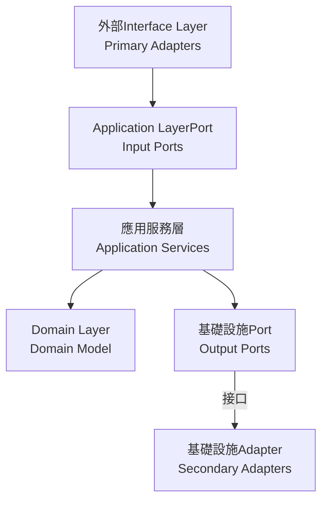

# Guidelines

## Overview

Hexagonal Architecture（又稱Port與Adapter架構）將應用程序分為三個主要部分：

1. **核心域（內部）**：包含業務邏輯和領域模型
2. **Port（中間層）**：定義與外部世界交互的接口
3. **Adapter（外部）**：連接外部世界與應用程序核心

## Bounded Context (Bounded Contexts)

系統被劃分為六個主要的Bounded Context，每個上下文專注於特定的業務領域：

1. **訂單上下文 (Order Context)**
   - 負責訂單的創建、修改和生命週期管理
   - 核心Aggregate Root：`Order`
   - 主要Value Object：`OrderId`、`OrderItem`、`OrderStatus`

2. **支付上下文 (Payment Context)**
   - 處理訂單支付、退款和支付狀態管理
   - 核心Aggregate Root：`Payment`
   - 主要Value Object：`PaymentId`、`PaymentMethod`、`PaymentStatus`

3. **庫存上下文 (Inventory Context)**
   - 管理產品庫存、預留和釋放
   - 核心Aggregate Root：`Inventory`
   - 主要Value Object：`InventoryId`、`ReservationId`、`InventoryStatus`

4. **配送上下文 (Delivery Context)**
   - 處理訂單配送和物流
   - 核心Aggregate Root：`Delivery`
   - 主要Value Object：`DeliveryId`、`DeliveryStatus`

5. **通知上下文 (Notification Context)**
   - 管理系統通知的發送和狀態
   - 核心Aggregate Root：`Notification`
   - 主要Value Object：`NotificationId`、`NotificationType`、`NotificationChannel`、`NotificationStatus`

6. **工作流上下文 (Workflow Context)**
   - 協調訂單從創建到完成的整個生命週期
   - 核心Aggregate Root：`OrderWorkflow`
   - 主要Value Object：`WorkflowId`、`WorkflowStatus`

## 實現細節

### Domain Layer（Domain Layer）

領域模型實現了核心業務邏輯，完全獨立於外部依賴：

- **Aggregate Root**：
  - `Order`：訂單Aggregate Root，包含訂單狀態控制和業務規則
  - `Inventory`：庫存Aggregate Root，管理產品庫存和預留
  - `Delivery`：配送Aggregate Root，管理訂單的配送流程
  - `Payment`：支付Aggregate Root，處理訂單支付和退款
  - `Notification`：通知Aggregate Root，管理系統通知的發送和狀態
  - `OrderWorkflow`：工作流Aggregate Root，協調訂單處理流程

- **Value Object**：
  - `OrderId`、`CustomerId`：唯一標識符
  - `Money`：金額Value Object，封裝金額和貨幣
  - `OrderItem`：訂單項Value Object
  - `OrderStatus`、`DeliveryStatus`、`PaymentStatus`、`NotificationStatus`、`WorkflowStatus`：狀態枚舉及其轉換規則
  - `PaymentMethod`、`NotificationChannel`、`NotificationType`：業務概念Value Object

- **Factory**：
  - `OrderFactory`：負責訂單的創建和重建
  - `DomainFactory`：通用Factory接口

- **Domain Event**：
  - `OrderCreatedEvent`：訂單創建事件
  - `OrderItemAddedEvent`：訂單項添加事件
  - `PaymentRequestedEvent`：支付請求事件
  - `PaymentCompletedEvent`：支付完成事件
  - `PaymentFailedEvent`：支付失敗事件

### Port層（Ports Layer）

定義了應用程序與外部世界交互的接口：

- **輸入Port（Primary Ports）**：
  - `OrderManagementUseCase`：定義系統對外提供的所有訂單管理功能
  - `PaymentManagementUseCase`：定義支付管理功能

- **輸出Port（Secondary Ports）**：
  - `OrderPersistencePort`：定義訂單持久化操作的接口
  - `OrderRepository`：Domain Layer定義的儲存庫接口
  - `PaymentServicePort`：定義支付服務的接口
  - `LogisticsServicePort`：定義物流服務的接口

### 應用服務層（Application Layer）

協調領域對象和外部Resource的交互：

- **應用服務**：
  - `OrderApplicationService`：實現訂單管理用例，協調各個Port之間的交互
  - `PaymentApplicationService`：實現支付管理用例

- **DTO**：
  - `CreateOrderRequestDto`：創建訂單的請求數據
  - `AddOrderItemRequestDto`：添加訂單項的請求數據
  - `OrderResponse`：訂單操作的響應數據
  - `PaymentRequestDto`、`PaymentResponseDto`：支付相關的數據傳輸對象

- **Command**：
  - `CreateOrderCommand`：創建訂單Command
  - `AddOrderItemCommand`：添加訂單項Command
  - `ProcessPaymentCommand`：處理支付Command

### Adapter層（Adapters Layer）

連接外部世界與Application Core：

- **主級Adapter（Primary/Driving Adapters）**：
  - `OrderController`：處理HTTP請求，並轉發給應用服務
  - `PaymentController`：處理支付相關的HTTP請求

- **次級Adapter（Secondary/Driven Adapters）**：
  - `OrderRepositoryAdapter`：實現訂單持久化操作
  - `JpaOrderRepository`：Spring Data JPA 儲存庫
  - `ExternalPaymentAdapter`：實現支付服務整合
  - `ExternalLogisticsAdapter`：實現物流服務整合

- **Anti-Corruption Layer（Anti-Corruption Layer）**：
  - `LogisticsAntiCorruptionLayer`：隔離外部物流系統的差異

### Infrastructure Layer（Infrastructure Layer）

提供技術實現和跨切面Concern：

- **持久化**：
  - `JpaOrderEntity`、`JpaOrderItemEntity`：JPA Entity類
  - `OrderMapper`：領域模型和 JPA Entity之間的轉換

- **事件處理**：
  - `SimpleEventBus`：簡單的事件總線實現

- **Saga 協調器**：
  - `OrderProcessingSaga`：協調訂單處理的各個步驟
  - `SagaDefinition`：Saga 定義接口

## 上下文間的集成

Bounded Context之間通過以下方式進行集成：

1. **Domain Event**：
   - 訂單上下文發布 `OrderCreatedEvent`，支付上下文訂閱並處理
   - 支付上下文發布 `PaymentCompletedEvent`，訂單上下文訂閱並更新訂單狀態

2. **Saga 協調器**：
   - `OrderProcessingSaga` 協調訂單、支付、庫存和配送上下文之間的交互
   - 實現跨上下文的業務流程和補償邏輯

3. **工作流上下文**：
   - `OrderWorkflow` Aggregate Root管理訂單從創建到完成的整個生命週期
   - 協調不同上下文之間的狀態轉換

4. **共享內核**：
   - `common` 包中的Value Object（如 `Money`、`OrderId`）被多個上下文共享
   - 提供統一的基礎設施服務（如事件發布）

## 依賴方向

Hexagonal Architecture中的一個核心原則是依賴方向始終指向內部：



## 實現優勢

1. **業務邏輯獨立性**：
   - 領域模型不依賴任何外部技術或框架
   - 可以獨立測試核心業務邏輯
   - 例如：`Order` Aggregate Root不依賴於 Spring 或 JPA

2. **Testability**：
   - 通過依賴倒置原則，可以輕鬆地模擬外部依賴
   - 可以為每個組件編寫Unit Test
   - 例如：可以使用模擬的 `PaymentServicePort` 測試 `OrderApplicationService`

3. **靈活的技術選擇**：
   - 可以替換任何外部依賴而不影響核心業務邏輯
   - 例如：可以從 JPA 切換到 MongoDB，只需實現新的Adapter

4. **明確的責任邊界**：
   - 每個組件都有明確定義的職責
   - 簡化系統的理解和維護
   - 例如：`OrderController` 只負責處理 HTTP 請求，不包含業務邏輯

## Design

1. **Factory模式**：
   - `OrderFactory` 負責創建和重建訂單Aggregate Root
   - 封裝了複雜的對象創建邏輯

2. **Adapter模式**：
   - `OrderRepositoryAdapter` 將領域儲存庫接口適配到 JPA 實現
   - `ExternalPaymentAdapter` 將外部支付系統適配到內部接口

3. **Command模式**：
   - 使用Command對象（如 `CreateOrderCommand`）封裝請求
   - 支持操作的參數化和序列化

4. **觀察者模式**：
   - 通過Domain Event實現組件間的鬆耦合通信
   - 例如：`OrderCreatedEvent` 通知其他組件訂單已創建

5. **Saga 模式**：
   - `OrderProcessingSaga` 協調跨多個Aggregate Root的複雜業務流程
   - 提供補償機制處理失敗情況

## Design

### 套件組織原則

```
src/main/java/
├── domain/                          # Domain Layer
│   ├── order/                      # 訂單Bounded Context
│   │   ├── model/                  # 領域模型
│   │   │   ├── aggregate/          # Aggregate Root
│   │   │   ├── entity/             # Entity
│   │   │   └── valueobject/        # Value Object
│   │   ├── events/                 # Domain Event
│   │   ├── repository/             # 儲存庫接口
│   │   └── service/                # Domain Service
│   └── common/                     # 共享內核
├── application/                     # Application Layer
│   ├── order/                      # 訂單應用服務
│   │   ├── command/                # Command
│   │   ├── dto/                    # 數據傳輸對象
│   │   └── service/                # 應用服務
│   └── port/                       # Port定義
│       ├── input/                  # 輸入Port
│       └── output/                 # 輸出Port
├── infrastructure/                  # Infrastructure Layer
│   ├── persistence/                # 持久化Adapter
│   ├── messaging/                  # 消息Adapter
│   ├── external/                   # 外部服務Adapter
│   └── configuration/              # 配置
└── interfaces/                     # Interface Layer
    ├── rest/                       # REST 控制器
    ├── graphql/                    # GraphQL Adapter
    └── messaging/                  # 消息監聽器
```

### 依賴管理

```java
// Domain Layer - 不依賴任何外部框架
public interface OrderRepository {
    Order save(Order order);
    Optional<Order> findById(OrderId orderId);
}

// Application Layer - 依賴Domain Layer接口
@Service
@Transactional
public class OrderApplicationService {
    private final OrderRepository orderRepository;
    private final PaymentServicePort paymentService;
    
    // 使用依賴注入，但不依賴具體實現
}

// Infrastructure Layer - 實現Domain Layer接口
@Repository
public class JpaOrderRepositoryAdapter implements OrderRepository {
    private final JpaOrderRepository jpaRepository;
    private final OrderMapper mapper;
    
    @Override
    public Order save(Order order) {
        JpaOrderEntity entity = mapper.toEntity(order);
        JpaOrderEntity saved = jpaRepository.save(entity);
        return mapper.toDomain(saved);
    }
}
```

## Testing

### Testing

```java
@ExtendWith(MockitoExtension.class)
class OrderTest {
    
    @Test
    void should_create_order_with_valid_items() {
        // Given
        OrderId orderId = OrderId.generate();
        CustomerId customerId = CustomerId.of("CUST-001");
        
        // When
        Order order = new Order(orderId, customerId);
        order.addItem(ProductId.of("PROD-001"), 2, Money.of(100));
        
        // Then
        assertThat(order.getItems()).hasSize(1);
        assertThat(order.getTotalAmount()).isEqualTo(Money.of(200));
    }
}
```

### Testing

```java
@SpringBootTest
@Transactional
class OrderApplicationServiceIntegrationTest {
    
    @Autowired
    private OrderApplicationService orderService;
    
    @MockBean
    private PaymentServicePort paymentService;
    
    @Test
    void should_create_order_and_process_payment() {
        // Given
        CreateOrderCommand command = new CreateOrderCommand(
            CustomerId.of("CUST-001"),
            List.of(new OrderItemDto("PROD-001", 2, Money.of(100)))
        );
        
        when(paymentService.processPayment(any())).thenReturn(PaymentResult.success());
        
        // When
        OrderResponse response = orderService.createOrder(command);
        
        // Then
        assertThat(response.getOrderId()).isNotNull();
        verify(paymentService).processPayment(any());
    }
}
```

### Testing

```java
@ArchTest
static final ArchRule domainLayerRules = classes()
    .that().resideInAPackage("..domain..")
    .should().onlyDependOnClassesThat()
    .resideInAnyPackage("..domain..", "java..", "org.springframework..");

@ArchTest
static final ArchRule applicationLayerRules = classes()
    .that().resideInAPackage("..application..")
    .should().onlyDependOnClassesThat()
    .resideInAnyPackage("..application..", "..domain..", "java..", "org.springframework..");
```

## Related Diagrams

- [Hexagonal Architecture概覽圖 (PlantUML)](../../../diagrams/viewpoints/functional/hexagonal-architecture-overview.puml)
- [Hexagonal Architecture概覽圖 (Mermaid)](../../../diagrams/viewpoints/development/hexagonal-architecture.mmd)
- [系統整體架構圖](../../../diagrams/viewpoints/functional/system-overview.mmd)
- [DDDLayered Architecture圖](../../../diagrams/viewpoints/development/ddd-layered-architecture.mmd)
- [多Environment配置圖](../../../diagrams/multi_environment.mmd)
- [Observability架構圖](../../../diagrams/observability_architecture.mmd)

## Relationships with Other Viewpoints

- **[Functional Viewpoint](../functional/README.md)**: 領域模型設計和Aggregate Root定義
- **[Information Viewpoint](../information/README.md)**: 資料流和Event-Driven Architecture
- **[Concurrency Viewpoint](../concurrency/README.md)**: 交易邊界和並發處理
- **[Deployment Viewpoint](../deployment/README.md)**: 模組化Deployment和ContainerizationPolicy

## 進一步改進

以下是可能的後續改進方向：

1. **實現Event-Driven Architecture**：
   - 完善Domain Event的發布和訂閱機制
   - 實現基於事件的跨界上下文通信
   - 考慮使用 Apache Kafka 或 RabbitMQ 進行事件傳遞

2. **微服務拆分**：
   - 考慮將訂單、支付、物流等領域拆分為獨立微服務
   - 定義服務間的契約和通信模式
   - 使用 API 網關統一對外接口

3. **Command Query Responsibility Segregation (Command Query Responsibility Segregation (CQRS))模式引入**：
   - 分離Command和查詢職責
   - 為複雜查詢創建專用的Read Model
   - 優化讀寫Performance

4. **添加跨切面Concern**：
   - 實現統一的Logging記錄和Monitoring機制
   - 增強安全控制和認證授權
   - 實現分佈式Tracing，提高系統Observability

5. **增強錯誤處理**：
   - 實現更細粒度的業務異常
   - 統一異常處理機制
   - 提供更友好的錯誤響應

6. **優化 Saga 實現**：
   - 實現持久化 Saga 狀態
   - 支持 Saga 恢復和重試
   - 增強補償邏輯的健壯性