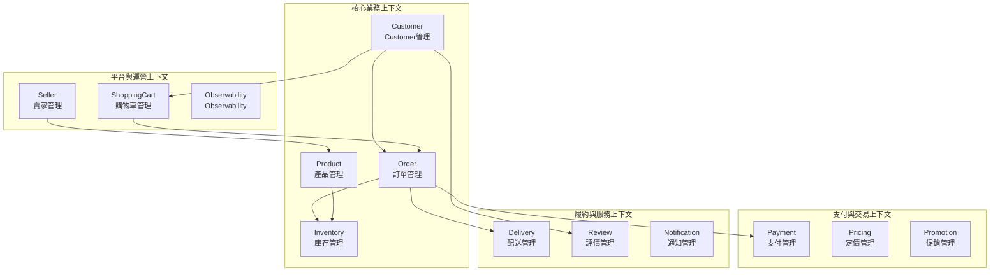
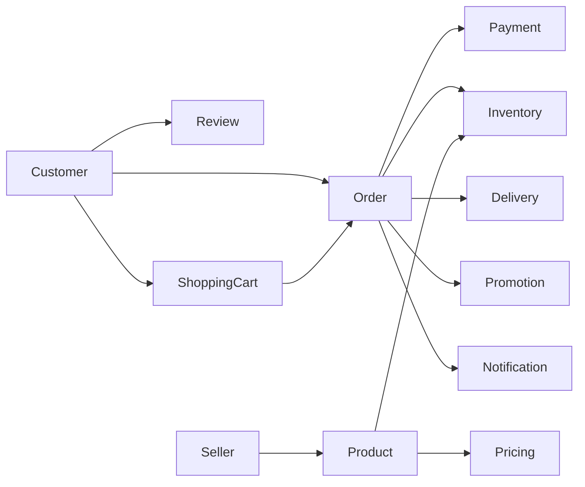

# Design

## Overview

This project實現了 13 個Bounded Context，每個上下文都有明確的業務邊界和職責劃分。Bounded Context的設計遵循 DDD 戰略模式，確保高內聚、低耦合的領域模型。

## Bounded Context架構圖

## Bounded Context詳細說明

### 1. Customer Context (Customer上下文)

**職責**: 管理Customer生命週期、會員等級、個人資料和偏好設定

**Aggregate Root**: 
- `Customer` (v2.0) - 增強的CustomerAggregate Root，支援完整的消費者功能

**核心Entity**:
- `DeliveryAddress` - 配送地址
- `PaymentMethod` - 支付方式配置
- `CustomerPreferences` - Customer偏好設定

**主要業務能力**:
- Customer註冊與認證
- 會員等級管理 (STANDARD, PREMIUM, VIP)
- 個人資料維護
- 配送地址管理
- 通知偏好設定
- 紅利點數累積與兌換

**Domain Service**:
- `RewardPointsService` - 紅利點數服務
- `CustomerDiscountService` - Customer折扣服務

### 2. Order Context (訂單上下文)

**職責**: 管理訂單生命週期、訂單處理流程和工作流狀態

**Aggregate Root**:
- `Order` (v1.0) - 訂單Aggregate Root，封裝訂單相關的業務規則和行為
- `OrderWorkflow` (v1.0) - 訂單工作流Aggregate Root，管理訂單從創建到完成的整個生命週期

**核心Entity**:
- `OrderItem` - 訂單項目
- `OrderStatus` - 訂單狀態
- `WorkflowStep` - 工作流步驟

**主要業務能力**:
- 訂單創建與確認
- 訂單項目管理
- 訂單狀態Tracing
- 工作流程控制
- 訂單取消與退款

### 3. Product Context (產品上下文)

**職責**: 管理產品資訊、產品分類和產品生命週期

**Aggregate Root**:
- `Product` (v1.0) - 產品Aggregate Root，管理產品信息和庫存

**核心Entity**:
- `ProductCategory` - 產品分類
- `ProductSpecification` - 產品規格
- `ProductImage` - 產品圖片

**主要業務能力**:
- 產品資訊管理
- 產品分類維護
- 產品上下架控制
- 產品規格管理
- 產品圖片管理

**Domain Service**:
- `BundleService` - 捆綁銷售服務

### 4. Inventory Context (庫存上下文)

**職責**: 管理產品庫存、庫存預留和庫存調整

**Aggregate Root**:
- `Inventory` (v1.0) - 庫存Aggregate Root，管理產品庫存和預留

**核心Entity**:
- `StockReservation` - 庫存預留
- `StockMovement` - 庫存異動記錄

**主要業務能力**:
- 庫存數量管理
- 庫存預留與釋放
- 庫存調整記錄
- 安全庫存Monitoring

**Domain Service**:
- `InventoryService` - 庫存服務介面
- `InventoryDomainService` - 庫存Domain Service

### 5. Payment Context (支付上下文)

**職責**: 管理支付流程、支付方式和支付狀態

**Aggregate Root**:
- `Payment` (v1.0) - 支付Aggregate Root，管理支付流程和狀態
- `PaymentMethod` (v1.0) - 支付方式Aggregate Root，管理Customer的支付方式配置

**核心Entity**:
- `PaymentTransaction` - 支付交易
- `PaymentStatus` - 支付狀態
- `RefundRecord` - 退款記錄

**主要業務能力**:
- 支付處理流程
- 多種支付方式支援
- 支付狀態Tracing
- 退款處理
- 支付安全驗證

**Domain Service**:
- `PaymentDomainService` - 支付Domain Service

### 6. Delivery Context (配送上下文)

**職責**: 管理配送流程、配送狀態和配送Tracing

**Aggregate Root**:
- `Delivery` (v1.0) - 配送Aggregate Root，管理訂單的配送流程和狀態

**核心Entity**:
- `DeliveryRoute` - 配送路線
- `DeliveryStatus` - 配送狀態
- `TrackingInfo` - Tracing資訊

**主要業務能力**:
- 配送任務創建
- 配送狀態Tracing
- 配送路線規劃
- 配送完成確認

**Domain Service**:
- `DeliveryManagementService` - 配送管理服務

### 7. Review Context (評價上下文)

**職責**: 管理商品評價、評價審核和評價展示

**Aggregate Root**:
- `ProductReview` (v2.0) - 商品評價Aggregate Root，管理消費者的商品評價和評分

**核心Entity**:
- `ReviewImage` - 評價圖片
- `ModerationRecord` - 審核記錄
- `ReviewRating` - 評價評分

**主要業務能力**:
- 商品評價創建
- 評價內容審核
- 評價圖片管理
- 評價統計分析

**Domain Service**:
- `ReviewModerationService` - 評價審核Domain Service

### 8. Seller Context (賣家上下文)

**職責**: 管理賣家資訊、賣家認證和賣家評級

**Aggregate Root**:
- `Seller` (v2.0) - 賣家Aggregate Root，管理賣家基本資訊和狀態

**核心Entity**:
- `SellerProfile` - 賣家檔案
- `SellerRating` - 賣家評級
- `SellerVerification` - 賣家認證
- `ContactInfo` - 聯絡資訊

**主要業務能力**:
- 賣家註冊與認證
- 賣家檔案管理
- 賣家評級系統
- 賣家狀態管理

**Domain Service**:
- `SellerDomainService` - 賣家Domain Service

### 9. ShoppingCart Context (購物車上下文)

**職責**: 管理購物車狀態、購物車項目和購物車操作

**Aggregate Root**:
- `ShoppingCart` (v1.0) - 購物車Aggregate Root，管理消費者的購物車狀態和商品項目

**核心Entity**:
- `CartItem` - 購物車項目
- `CartStatus` - 購物車狀態

**主要業務能力**:
- 購物車項目管理
- 購物車狀態維護
- 購物車結算處理
- 購物車持久化

**Domain Service**:
- `ShoppingCartDomainService` - 購物車Domain Service

### 10. Promotion Context (促銷上下文)

**職責**: 管理促銷活動、優惠券和促銷規則

**Aggregate Root**:
- `Promotion` (v1.0) - 促銷Aggregate Root，管理各種促銷活動規則
- `Voucher` (v1.0) - 超商優惠券Aggregate Root，管理優惠券的完整生命週期

**核心Entity**:
- `PromotionRule` - 促銷規則
- `VoucherCode` - 優惠券代碼
- `DiscountCalculation` - 折扣計算

**主要業務能力**:
- 促銷活動管理
- 優惠券發放與使用
- 折扣規則計算
- 促銷效果Tracing

### 11. Pricing Context (定價上下文)

**職責**: 管理產品定價、折扣規則和佣金計算

**Aggregate Root**:
- `PricingRule` (v1.0) - 定價規則Aggregate Root，負責管理產品定價、折扣和佣金費率

**核心Entity**:
- `PriceRule` - 價格規則
- `DiscountRule` - 折扣規則
- `CommissionRate` - 佣金費率

**主要業務能力**:
- 動態定價管理
- 折扣規則配置
- 佣金費率計算
- 價格Policy執行

**Domain Service**:
- `CommissionService` - 佣金服務

### 12. Notification Context (通知上下文)

**職責**: 管理系統通知、通知模板和通知發送

**Aggregate Root**:
- `Notification` (v1.0) - 通知Aggregate Root，管理系統通知的發送和狀態
- `NotificationTemplate` (v1.0) - 通知模板Aggregate Root，管理通知模板的內容和格式

**核心Entity**:
- `NotificationChannel` - 通知渠道
- `NotificationStatus` - 通知狀態
- `TemplateVariable` - 模板變數

**主要業務能力**:
- 多渠道通知發送
- 通知模板管理
- 通知狀態Tracing
- 通知偏好設定

**Domain Service**:
- `NotificationService` - 通知服務

### 13. Observability Context (Observability上下文)

**職責**: 管理系統Monitoring、分析數據和Observability會話

**Aggregate Root**:
- `ObservabilitySession` (v1.0) - Observability會話Aggregate Root
- `AnalyticsSession` (v1.0) - 分析會話Aggregate Root

**核心Entity**:
- `MetricData` - Metrics數據
- `TraceInfo` - Tracing資訊
- `LogEntry` - Logging條目

**主要業務能力**:
- 系統Monitoring數據收集
- 業務分析數據處理
- Observability會話管理
- PerformanceMetricsTracing

## 上下文間關係

### 核心依賴關係

### 事件驅動通信

各Bounded Context通過Domain Event進行異步通信：

- **Customer Context** 發布Customer相關事件 (CustomerCreated, CustomerProfileUpdated 等)
- **Order Context** 發布訂單相關事件 (OrderCreated, OrderConfirmed 等)
- **Payment Context** 發布支付相關事件 (PaymentProcessed, PaymentFailed 等)
- **Inventory Context** 發布庫存相關事件 (StockReserved, StockAdded 等)

## 上下文演進Policy

### 版本管理

- **v1.0**: 基礎功能實現
- **v2.0**: 增強功能和優化 (Customer, ProductReview, Seller)

### 未來演進方向

1. **微服務拆分**: 每個Bounded Context可獨立Deployment為微服務
2. **Event Sourcing**: 關鍵上下文 (Order, Payment) 可引入Event Sourcing
3. **Command Query Responsibility Segregation (Command Query Responsibility Segregation (CQRS))**: 讀寫分離優化查詢Performance
4. **新上下文**: 根據業務發展需要添加新的Bounded Context

## Related Diagrams

- [Bounded Context概念圖](../../../diagrams/viewpoints/functional/bounded-contexts-concept.puml) - **New**: Comprehensive bounded contexts concept diagram showing all 13 contexts with their relationships, responsibilities, and domain events
- [Bounded Context概覽圖](../../../diagrams/viewpoints/functional/bounded-contexts-overview.puml)
- [Event Storming Big Picture](../../../diagrams/viewpoints/functional/event-storming-big-picture.puml)
- [Event Storming Process Level](../../../diagrams/viewpoints/functional/event-storming-process-level.puml)
- [業務流程圖](../../../diagrams/viewpoints/functional/business-process-flows.puml) - **Recently Updated**: Comprehensive e-commerce core processes including customer shopping journey, order processing workflow, coupon management, inventory management, and customer notifications
- [User旅程概覽圖](../../../diagrams/viewpoints/functional/user-journey-overview.puml)

## Relationships with Other Viewpoints

- **[Information Viewpoint](../information/README.md)**: 上下文間的事件通信和資料流
- **[Development Viewpoint](../development/README.md)**: 模組化架構和程式碼組織
- **[Deployment Viewpoint](../deployment/README.md)**: 微服務DeploymentPolicy

## Design

1. **高內聚**: 每個上下文內部功能緊密相關
2. **低耦合**: 上下文間通過事件和介面通信
3. **業務導向**: 上下文劃分基於業務能力而非技術考量
4. **演進友好**: 支援獨立演進和版本管理
5. **測試隔離**: 每個上下文可獨立Testing and Verification

這種Bounded Context設計確保了系統的Maintainability、Scalability和業務對齊性。