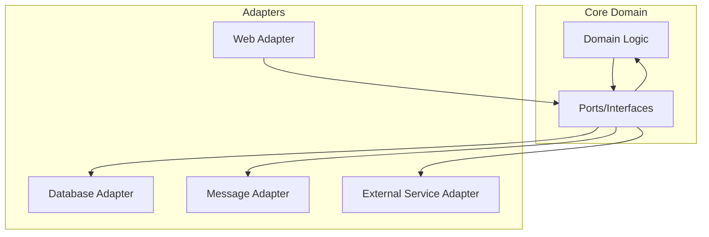

# Design

## 概述

本指南提供了在專案中設計和實作 DDD 領域模型的Best Practice，基於當前專案的實際實現經驗summary。專案採用完整的 DDD 戰術模式，包含 17 個Aggregate Root分佈在 13 個Bounded Context中，實現了現代化的Domain-Driven Design架構。

## Overview

### Aggregate Root分佈統計

| Bounded Context | Aggregate Root數量 | 主要Aggregate Root | 版本 |
|-----------|-----------|-----------|------|
| Customer | 1 | Customer | 2.0 |
| Order | 2 | Order, OrderWorkflow | 1.0 |
| Product | 1 | Product | 1.0 |
| Inventory | 1 | Inventory | 1.0 |
| Payment | 2 | Payment, PaymentMethod | 1.0 |
| Delivery | 1 | Delivery | 1.0 |
| Review | 1 | ProductReview | 2.0 |
| Seller | 1 | Seller | 2.0 |
| ShoppingCart | 1 | ShoppingCart | 1.0 |
| Promotion | 2 | Promotion, Voucher | 1.0 |
| Pricing | 1 | PricingRule | 1.0 |
| Notification | 2 | Notification, NotificationTemplate | 1.0 |
| Observability | 2 | ObservabilitySession, AnalyticsSession | 1.0 |

**總計**: 17 個Aggregate Root，13 個Bounded Context

## Design

### 1. 混合實現模式

專案採用兩種Aggregate Root實現模式：

#### 模式 A: 註解 + 介面模式 (推薦)
```java
@AggregateRoot(name = "Customer", description = "增強的CustomerAggregate Root，支援完整的消費者功能", 
               boundedContext = "Customer", version = "2.0")
public class Customer implements AggregateRootInterface {
    // 零 override 實現，所有方法都有 default 實作
    // 自動事件收集和Aggregate Root元數據管理
}
```

#### 模式 B: 繼承基類模式
```java
@AggregateRoot(name = "Product", description = "產品Aggregate Root，管理產品信息和庫存", 
               boundedContext = "Product", version = "1.0")
public class Product extends solid.humank.genaidemo.domain.common.aggregate.AggregateRoot {
    // 繼承基類實現
}
```

### Standards

所有Aggregate Root必須使用 `@AggregateRoot` 註解：

```java
@AggregateRoot(
    name = "Aggregate Root名稱",           // 必填：Aggregate Root識別名稱
    description = "Aggregate Root描述",     // 必填：業務描述
    boundedContext = "上下文名稱", // 必填：所屬Bounded Context
    version = "版本號"            // 必填：Aggregate Root版本
)
```

## Design

### Design

Entity 應該專注於領域邏輯而非技術抽象：

```java
@Entity(name = "SellerRating", description = "賣家評級Entity")
public class SellerRating {
    // 業務邏輯方法
    public boolean isPositive() {
        return rating >= 4; // 4分以上視為正面評價
    }
    
    public boolean isRecent() {
        return ChronoUnit.DAYS.between(ratedAt, LocalDateTime.now()) <= 30;
    }
    
    public void hide() {
        this.status = RatingStatus.HIDDEN;
    }
}
```

### 2. 強型別 ID

每個 Entity 都應該有強型別的 ID Value Object：

```java
@ValueObject(name = "SellerRatingId", description = "賣家評級ID")
public record SellerRatingId(UUID value) {
    public SellerRatingId {
        Objects.requireNonNull(value, "SellerRating ID cannot be null");
    }
    
    public static SellerRatingId generate() {
        return new SellerRatingId(UUID.randomUUID());
    }
    
    public static SellerRatingId of(UUID uuid) {
        return new SellerRatingId(uuid);
    }
}
```

### 3. 狀態管理

使用 Enum Value Object 管理 Entity 狀態：

```java
@ValueObject(name = "RatingStatus", description = "評級狀態")
public enum RatingStatus {
    ACTIVE("活躍"),
    HIDDEN("隱藏"),
    DELETED("已刪除");
    
    private final String description;
    
    RatingStatus(String description) {
        this.description = description;
    }
    
    public String getDescription() {
        return description;
    }
}
```

## Entity 實作模式

### 1. 基本結構

```java
@Entity(name = "EntityName", description = "Entity描述")
public class EntityName {
    private final EntityNameId id;
    private String businessField;
    private EntityStatus status;
    private LocalDateTime createdAt;
    private LocalDateTime updatedAt;
    
    // 建構子
    public EntityName(EntityNameId id, String businessField) {
        this.id = Objects.requireNonNull(id);
        this.businessField = Objects.requireNonNull(businessField);
        this.status = EntityStatus.ACTIVE;
        this.createdAt = LocalDateTime.now();
        this.updatedAt = LocalDateTime.now();
    }
    
    // 業務邏輯方法
    public void updateBusinessField(String newValue) {
        this.businessField = newValue;
        this.updatedAt = LocalDateTime.now();
    }
    
    public boolean isValid() {
        return status == EntityStatus.ACTIVE && businessField != null;
    }
    
    // Getters
    public EntityNameId getId() { return id; }
    public String getBusinessField() { return businessField; }
    public EntityStatus getStatus() { return status; }
    
    // equals 和 hashCode 基於 ID
    @Override
    public boolean equals(Object obj) {
        if (this == obj) return true;
        if (obj == null || getClass() != obj.getClass()) return false;
        EntityName that = (EntityName) obj;
        return Objects.equals(id, that.id);
    }
    
    @Override
    public int hashCode() {
        return Objects.hash(id);
    }
}
```

### 2. 生命週期管理

```java
public class ContactInfo {
    private boolean emailVerified;
    private boolean phoneVerified;
    private LocalDateTime lastUpdated;
    
    public void verifyEmail() {
        this.emailVerified = true;
        this.lastUpdated = LocalDateTime.now();
    }
    
    public void verifyPhone() {
        this.phoneVerified = true;
        this.lastUpdated = LocalDateTime.now();
    }
    
    public boolean isFullyVerified() {
        return emailVerified && phoneVerified;
    }
    
    public void updateContactInfo(String email, String phone) {
        this.email = email;
        this.phone = phone;
        this.lastUpdated = LocalDateTime.now();
        // 重新驗證
        this.emailVerified = false;
        this.phoneVerified = false;
    }
}
```

### 3. 狀態轉換

```java
public class StockReservation {
    private ReservationStatus status;
    private LocalDateTime expiresAt;
    
    public void confirm() {
        if (status != ReservationStatus.ACTIVE) {
            throw new IllegalStateException("只有活躍的預留可以確認");
        }
        this.status = ReservationStatus.CONFIRMED;
    }
    
    public void release() {
        if (status == ReservationStatus.RELEASED) {
            throw new IllegalStateException("預留已經被釋放");
        }
        this.status = ReservationStatus.RELEASED;
    }
    
    public boolean isExpired() {
        return LocalDateTime.now().isAfter(expiresAt);
    }
    
    public void extend(Duration duration) {
        if (status != ReservationStatus.ACTIVE) {
            throw new IllegalStateException("只有活躍的預留可以延期");
        }
        this.expiresAt = this.expiresAt.plus(duration);
    }
}
```

## Aggregate內 Entity 關係

### 1. 一對多關係

```java
@AggregateRoot(name = "Seller", description = "賣家Aggregate Root")
public class Seller implements AggregateRootInterface {
    private final SellerId sellerId;
    private final List<SellerRating> ratings;
    
    public void addRating(CustomerId customerId, int rating, String comment) {
        SellerRating newRating = new SellerRating(
            SellerRatingId.generate(),
            customerId,
            rating,
            comment
        );
        this.ratings.add(newRating);
        
        // 收集Domain Event
        collectEvent(SellerRatingAddedEvent.create(sellerId, newRating.getId(), rating));
    }
    
    public double calculateAverageRating() {
        return ratings.stream()
            .filter(SellerRating::isVisible)
            .mapToInt(SellerRating::getRating)
            .average()
            .orElse(0.0);
    }
}
```

### 2. 一對一關係

```java
@AggregateRoot(name = "Seller", description = "賣家Aggregate Root")
public class Seller implements AggregateRootInterface {
    private SellerProfile profile;
    private ContactInfo contactInfo;
    private SellerVerification verification;
    
    public void updateContactInfo(String email, String phone) {
        this.contactInfo.updateContactInfo(email, phone);
        collectEvent(SellerContactInfoUpdatedEvent.create(sellerId, email, phone));
    }
    
    public boolean canAcceptOrders() {
        return isActive() && 
               contactInfo.isFullyVerified() && 
               verification.isVerified() &&
               profile.isProfileComplete();
    }
}
```

## 驗證和業務規則

### 1. 輸入驗證

```java
public class SellerRating {
    public SellerRating(SellerRatingId id, CustomerId customerId, int rating, String comment) {
        this.id = Objects.requireNonNull(id, "ID cannot be null");
        this.customerId = Objects.requireNonNull(customerId, "Customer ID cannot be null");
        this.rating = validateRating(rating);
        this.comment = comment;
        this.ratedAt = LocalDateTime.now();
        this.status = RatingStatus.ACTIVE;
    }
    
    private int validateRating(int rating) {
        if (rating < 1 || rating > 5) {
            throw new IllegalArgumentException("評級必須在1-5之間");
        }
        return rating;
    }
}
```

### 2. 業務規則檢查

```java
public class SellerVerification {
    private static final Set<String> REQUIRED_DOCUMENTS = Set.of(
        "business_license", "tax_certificate", "identity_document"
    );
    
    public void approve(String verifierUserId, LocalDateTime expiresAt) {
        if (!hasAllRequiredDocuments()) {
            throw new IllegalStateException("必須提交所有必要文件才能通過驗證");
        }
        
        this.status = VerificationStatus.APPROVED;
        this.verifierUserId = verifierUserId;
        this.approvedAt = LocalDateTime.now();
        this.expiresAt = expiresAt;
    }
    
    public boolean hasAllRequiredDocuments() {
        return submittedDocuments.containsAll(REQUIRED_DOCUMENTS);
    }
}
```

## Testing

### Testing

所有 Entity 的業務邏輯都應該由 BDD 測試覆蓋：

```gherkin
Scenario: 賣家評級狀態管理
  Given 一個活躍的賣家評級
  When 管理員隱藏該評級
  Then 評級狀態應該變為隱藏
  And 評級不應該在公開列表中顯示
```

### Testing

使用 ArchUnit 確保 Entity 設計合規：

```java
@Test
void entitiesShouldBeProperlyAnnotatedAndLocated() {
    ArchRule rule = classes()
        .that().areAnnotatedWith(Entity.class)
        .should().resideInAPackage("..domain.*.model.entity..")
        .because("Entity 必須位於 entity 套件中");
    
    rule.check(classes);
}
```

## Best Practices

### 1. Factory方法

```java
public class ReviewImage {
    public static ReviewImage createFromUpload(String originalUrl, String fileName, long fileSize) {
        ReviewImage image = new ReviewImage(
            ReviewImageId.generate(),
            originalUrl,
            fileName,
            fileSize
        );
        
        if (!image.isValidImage()) {
            throw new IllegalArgumentException("無效的圖片格式");
        }
        
        return image;
    }
}
```

### 2. 查詢方法

```java
public class Seller {
    public List<SellerRating> getRecentRatings(int days) {
        LocalDateTime cutoff = LocalDateTime.now().minusDays(days);
        return ratings.stream()
            .filter(rating -> rating.getRatedAt().isAfter(cutoff))
            .filter(SellerRating::isVisible)
            .sorted((r1, r2) -> r2.getRatedAt().compareTo(r1.getRatedAt()))
            .toList();
    }
    
    public Optional<SellerRating> findRatingByCustomer(CustomerId customerId) {
        return ratings.stream()
            .filter(rating -> rating.getCustomerId().equals(customerId))
            .filter(SellerRating::isVisible)
            .findFirst();
    }
}
```

### 3. Aggregate操作

```java
public class ProductReview {
    public void addModerationRecord(String moderatorId, ModerationAction action, String reason) {
        ModerationRecord record = new ModerationRecord(
            ModerationRecordId.generate(),
            moderatorId,
            action,
            reason
        );
        
        this.moderations.add(record);
        
        // 根據審核結果更新評價狀態
        if (action == ModerationAction.APPROVE) {
            this.status = ReviewStatus.APPROVED;
        } else if (action == ModerationAction.REJECT) {
            this.status = ReviewStatus.REJECTED;
        }
        
        collectEvent(ReviewModerationCompletedEvent.create(this.id, action, reason));
    }
}
```

## 效能考量

### 1. 延遲載入

```java
public class Seller {
    // 避免一次載入所有評級
    public List<SellerRating> getTopRatings(int limit) {
        return ratings.stream()
            .filter(SellerRating::isVisible)
            .sorted((r1, r2) -> Integer.compare(r2.getRating(), r1.getRating()))
            .limit(limit)
            .toList();
    }
}
```

### Design

```java
public class SellerProfile {
    private String businessInfoSummary; // 快取計算結果
    
    public String getBusinessInfoSummary() {
        if (businessInfoSummary == null) {
            businessInfoSummary = calculateBusinessInfoSummary();
        }
        return businessInfoSummary;
    }
    
    public void updateBusinessInfo(String name, String address, String description) {
        this.businessName = name;
        this.businessAddress = address;
        this.description = description;
        this.businessInfoSummary = null; // 清除快取
        this.lastProfileUpdate = LocalDateTime.now();
    }
}
```

## Related Diagrams

- [領域模型概覽圖](../../../diagrams/viewpoints/functional/domain-model-overview.puml)
- [Bounded Context概覽圖](../../../diagrams/viewpoints/functional/bounded-contexts-overview.puml)
- [Hexagonal Architecture概覽圖](../../../diagrams/viewpoints/functional/hexagonal-architecture-overview.puml)
- [應用服務概覽圖](../../../diagrams/viewpoints/functional/application-services-overview.puml)
- ## Hexagonal Architecture圖



## Relationships with Other Viewpoints

- **[Information Viewpoint](../information/README.md)**: Domain Event設計和資料一致性Policy
- **[Development Viewpoint](../development/README.md)**: 測試Policy和程式碼組織
- **[Concurrency Viewpoint](../concurrency/README.md)**: Aggregate Root的交易邊界設計

## summary

良好的 Entity 設計應該：

1. **業務導向**: 專注於領域邏輯而非技術實作
2. **類型安全**: 使用強型別 ID 和狀態 Enum
3. **封裝良好**: 透過方法而非直接屬性存取來維護不變性
4. **測試友好**: 設計易於測試的介面和行為
5. **效能考量**: 避免不必要的資料載入和計算

遵循這些原則可以創建出可維護、可測試且符合 DDD 原則的 Entity 設計。