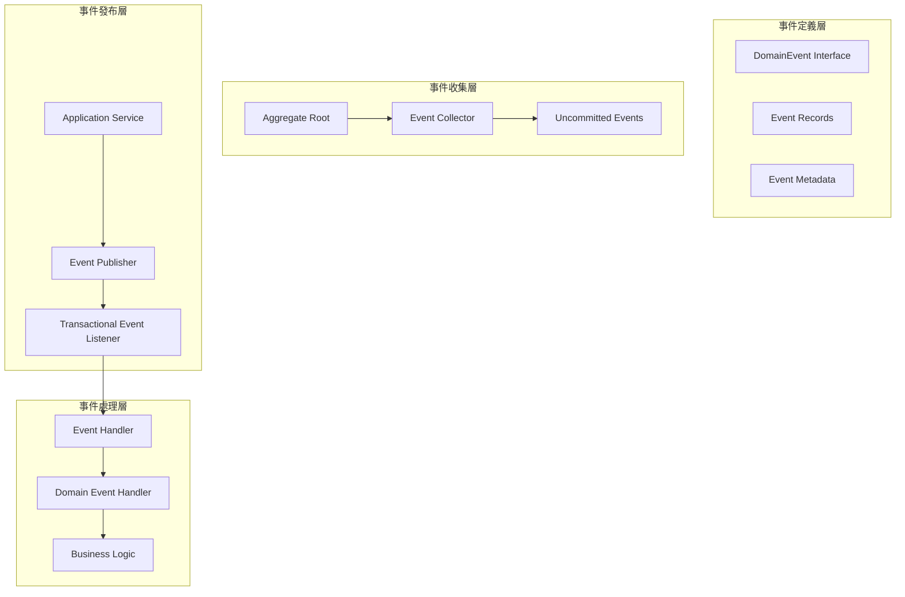
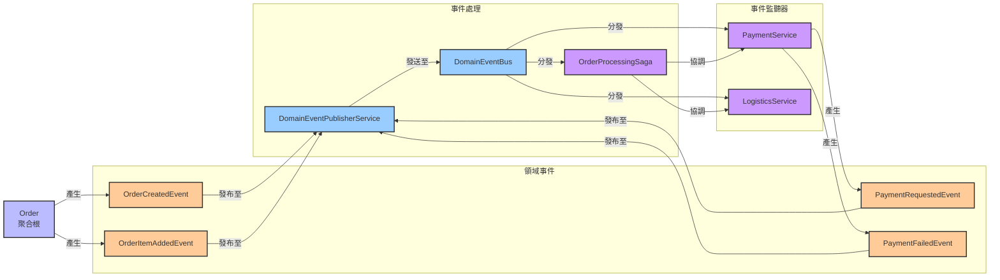

# Design

## Overview

This project實現了完整的Domain Event系統，包含 40+ 個Domain Event，涵蓋所有 13 個Bounded Context。Domain Event採用 Record 實現，遵循不可變性原則，並通過Event-Driven Architecture實現上下文間的解耦通信。

## Domain Event架構

### Design



## Standards

### 1. 事件定義 (Record 模式)

所有Domain Event都使用 Java Record 實現，確保不可變性：

```java
public record CustomerCreatedEvent(
    CustomerId customerId,
    CustomerName customerName,
    Email email,
    MembershipLevel membershipLevel,
    UUID eventId,
    LocalDateTime occurredOn
) implements DomainEvent {
    
    /**
     * Factory方法，自動生成 eventId 和 occurredOn
     */
    public static CustomerCreatedEvent create(
        CustomerId customerId, 
        CustomerName customerName, 
        Email email,
        MembershipLevel membershipLevel
    ) {
        DomainEvent.EventMetadata metadata = DomainEvent.createEventMetadata();
        return new CustomerCreatedEvent(
            customerId, customerName, email, membershipLevel,
            metadata.eventId(), metadata.occurredOn()
        );
    }
    
    @Override
    public String getEventType() {
        return DomainEvent.getEventTypeFromClass(this.getClass());
    }
    
    @Override
    public String getAggregateId() { 
        return customerId.getValue(); 
    }
}
```

### 2. 事件收集機制

Aggregate Root通過 `AggregateRootInterface` 收集事件：

```java
@AggregateRoot(name = "Customer", boundedContext = "Customer", version = "2.0")
public class Customer implements AggregateRootInterface {
    
    public void updateProfile(CustomerName newName, Email newEmail, Phone newPhone) {
        // 1. 執行業務邏輯
        validateProfileUpdate(newName, newEmail, newPhone);
        
        // 2. 更新狀態
        this.name = newName;
        this.email = newEmail;
        this.phone = newPhone;
        
        // 3. 收集Domain Event
        collectEvent(CustomerProfileUpdatedEvent.create(this.id, newName, newEmail, newPhone));
    }
}
```

### 3. 事件發布流程

應用服務負責發布Aggregate Root收集的事件：

```java
@Service
@Transactional
public class CustomerApplicationService {
    
    public void updateCustomerProfile(UpdateProfileCommand command) {
        // 1. 載入Aggregate Root
        Customer customer = customerRepository.findById(command.customerId())
            .orElseThrow(() -> new CustomerNotFoundException(command.customerId()));
        
        // 2. 執行業務操作 (事件被收集)
        customer.updateProfile(command.name(), command.email(), command.phone());
        
        // 3. 保存Aggregate Root
        customerRepository.save(customer);
        
        // 4. 發布收集的事件
        domainEventService.publishEventsFromAggregate(customer);
    }
}
```

## 事件分類與統計

### 按Bounded Context分類

| Bounded Context | 事件數量 | 主要事件類型 |
|-----------|---------|-------------|
| Customer | 9 | CustomerCreated, CustomerProfileUpdated, MembershipLevelUpgraded |
| Order | 5 | OrderCreated, OrderSubmitted, OrderConfirmed |
| Product | 5 | ProductCreated, ProductPriceChanged, ProductActivated |
| Inventory | 3 | InventoryCreated, StockReserved, StockAdded |
| Payment | 2 | PaymentProcessed, PaymentFailed |
| Review | 5 | ReviewCreated, ReviewApproved, ReviewRejected |
| ShoppingCart | 6 | CartCreated, CartItemAdded, CartItemRemoved |
| Delivery | 3 | DeliveryCreated, DeliveryStatusChanged, DeliveryCompleted |
| Notification | 2 | NotificationSent, NotificationDelivered |
| 其他 | 5+ | 各種業務事件 |

### 事件類型分類

#### 1. 生命週期事件
- **Created 事件**: Aggregate Root創建時發布
- **Updated 事件**: Aggregate Root狀態變更時發布
- **Deleted 事件**: Aggregate Root刪除時發布

#### 2. 狀態轉換事件
- **Status Changed 事件**: 狀態機轉換時發布
- **Workflow 事件**: 工作流步驟完成時發布

#### 3. 業務規則事件
- **Validation 事件**: 業務規則驗證時發布
- **Calculation 事件**: 計算完成時發布

## 主要Domain Event詳解

### Customer Context 事件

```java
// Customer創建事件
public record CustomerCreatedEvent(
    CustomerId customerId,
    CustomerName customerName,
    Email email,
    MembershipLevel membershipLevel,
    UUID eventId,
    LocalDateTime occurredOn
) implements DomainEvent { }

// Customer資料更新事件
public record CustomerProfileUpdatedEvent(
    CustomerId customerId,
    CustomerName newName,
    Email newEmail,
    Phone newPhone,
    UUID eventId,
    LocalDateTime occurredOn
) implements DomainEvent { }

// 會員等級升級事件
public record MembershipLevelUpgradedEvent(
    CustomerId customerId,
    MembershipLevel oldLevel,
    MembershipLevel newLevel,
    UUID eventId,
    LocalDateTime occurredOn
) implements DomainEvent { }

// 紅利點數相關事件
public record RewardPointsEarnedEvent(
    CustomerId customerId,
    int pointsEarned,
    String reason,
    UUID eventId,
    LocalDateTime occurredOn
) implements DomainEvent { }

public record RewardPointsRedeemedEvent(
    CustomerId customerId,
    int pointsRedeemed,
    String reason,
    UUID eventId,
    LocalDateTime occurredOn
) implements DomainEvent { }
```

### Order Context 事件

```java
// 訂單創建事件
public record OrderCreatedEvent(
    OrderId orderId,
    CustomerId customerId,
    List<String> items,
    UUID eventId,
    LocalDateTime occurredOn
) implements DomainEvent { }

// 訂單提交事件
public record OrderSubmittedEvent(
    OrderId orderId,
    CustomerId customerId,
    Money totalAmount,
    int itemCount,
    UUID eventId,
    LocalDateTime occurredOn
) implements DomainEvent { }

// 訂單確認事件
public record OrderConfirmedEvent(
    OrderId orderId,
    CustomerId customerId,
    OrderStatus status,
    Money totalAmount,
    UUID eventId,
    LocalDateTime occurredOn
) implements DomainEvent { }

// 庫存預留請求事件
public record OrderInventoryReservationRequestedEvent(
    OrderId orderId,
    CustomerId customerId,
    List<OrderItem> items,
    UUID eventId,
    LocalDateTime occurredOn
) implements DomainEvent { }

// 支付請求事件
public record OrderPaymentRequestedEvent(
    OrderId orderId,
    CustomerId customerId,
    PaymentMethodId paymentMethodId,
    Money paymentAmount,
    UUID eventId,
    LocalDateTime occurredOn
) implements DomainEvent { }
```

### Product Context 事件

```java
// 產品創建事件
public record ProductCreatedEvent(
    ProductId productId,
    ProductName productName,
    ProductCategory category,
    Money price,
    UUID eventId,
    LocalDateTime occurredOn
) implements DomainEvent { }

// 產品價格變更事件
public record ProductPriceChangedEvent(
    ProductId productId,
    Money oldPrice,
    Money newPrice,
    UUID eventId,
    LocalDateTime occurredOn
) implements DomainEvent { }

// 產品庫存更新事件
public record ProductStockUpdatedEvent(
    ProductId productId,
    int oldQuantity,
    int newQuantity,
    UUID eventId,
    LocalDateTime occurredOn
) implements DomainEvent { }
```

### Inventory Context 事件

```java
// 庫存創建事件
public record InventoryCreatedEvent(
    ProductId productId,
    int initialQuantity,
    UUID eventId,
    LocalDateTime occurredOn
) implements DomainEvent { }

// 庫存預留事件
public record StockReservedEvent(
    ProductId productId,
    OrderId orderId,
    int reservedQuantity,
    int remainingQuantity,
    UUID eventId,
    LocalDateTime occurredOn
) implements DomainEvent { }

// 庫存補充事件
public record StockAddedEvent(
    ProductId productId,
    int addedQuantity,
    int newTotalQuantity,
    UUID eventId,
    LocalDateTime occurredOn
) implements DomainEvent { }
```

### Review Context 事件

```java
// 評價創建事件
public record ReviewCreatedEvent(
    ReviewId reviewId,
    ProductId productId,
    CustomerId customerId,
    ReviewRating rating,
    UUID eventId,
    LocalDateTime occurredOn
) implements DomainEvent { }

// 評價審核通過事件
public record ReviewApprovedEvent(
    ReviewId reviewId,
    ProductId productId,
    CustomerId reviewerId,
    UUID eventId,
    LocalDateTime occurredOn
) implements DomainEvent { }

// 評價審核拒絕事件
public record ReviewRejectedEvent(
    ReviewId reviewId,
    ProductId productId,
    CustomerId reviewerId,
    String reason,
    UUID eventId,
    LocalDateTime occurredOn
) implements DomainEvent { }
```

### ShoppingCart Context 事件

```java
// 購物車創建事件
public record CartCreatedEvent(
    CartId cartId,
    CustomerId customerId,
    UUID eventId,
    LocalDateTime occurredOn
) implements DomainEvent { }

// 購物車項目添加事件
public record CartItemAddedEvent(
    CartId cartId,
    CustomerId customerId,
    ProductId productId,
    int quantity,
    Money unitPrice,
    UUID eventId,
    LocalDateTime occurredOn
) implements DomainEvent { }

// 購物車項目數量更新事件
public record CartItemQuantityUpdatedEvent(
    CartId cartId,
    CustomerId customerId,
    ProductId productId,
    int oldQuantity,
    int newQuantity,
    Money unitPrice,
    UUID eventId,
    LocalDateTime occurredOn
) implements DomainEvent { }
```

## 事件處理機制

### 1. 事件處理器基類

```java
@Component
public abstract class AbstractDomainEventHandler<T extends DomainEvent> 
    implements DomainEventHandler<T> {
    
    @Override
    @TransactionalEventListener(phase = TransactionPhase.AFTER_COMMIT)
    public void handle(T event) {
        // 實現冪等性檢查
        if (isEventAlreadyProcessed(event.getEventId())) {
            return;
        }
        
        try {
            // 執行業務邏輯
            handleEvent(event);
            
            // 標記事件已處理
            markEventAsProcessed(event.getEventId());
            
        } catch (Exception e) {
            logger.error("處理事件失敗: {}", event, e);
            throw new DomainEventProcessingException("事件處理失敗", e);
        }
    }
    
    protected abstract void handleEvent(T event);
    protected abstract Class<T> getSupportedEventType();
}
```

### Examples

```java
@Component
public class CustomerCreatedEventHandler extends AbstractDomainEventHandler<CustomerCreatedEvent> {
    
    private final EmailService emailService;
    private final CustomerStatsService customerStatsService;
    
    @Override
    protected void handleEvent(CustomerCreatedEvent event) {
        // 發送歡迎郵件
        emailService.sendWelcomeEmail(event.email(), event.customerName());
        
        // 創建Customer統計記錄
        customerStatsService.createStatsRecord(event.customerId());
        
        // 初始化Customer偏好設定
        customerPreferencesService.initializeDefaultPreferences(event.customerId());
    }
    
    @Override
    protected Class<CustomerCreatedEvent> getSupportedEventType() {
        return CustomerCreatedEvent.class;
    }
}
```

### 3. 跨上下文事件處理

```java
@Component
public class OrderCreatedEventHandler extends AbstractDomainEventHandler<OrderCreatedEvent> {
    
    @Override
    protected void handleEvent(OrderCreatedEvent event) {
        // 預留庫存
        inventoryService.reserveStock(event.orderId(), event.items());
        
        // 更新Customer統計
        customerStatsService.updateOrderCount(event.customerId());
        
        // 發送訂單確認通知
        notificationService.sendOrderConfirmation(event);
    }
}
```

## 事件發布Policy

### 1. 事務性事件發布

```java
@Component
public class TransactionalDomainEventPublisher implements DomainEventPublisher {
    
    @Override
    @Transactional
    public void publish(DomainEvent event) {
        // 在事務內發布事件
        applicationEventPublisher.publishEvent(
            new DomainEventWrapper(event)
        );
    }
    
    @Override
    @Transactional
    public void publishAll(List<DomainEvent> events) {
        events.forEach(this::publish);
    }
}
```

### 2. 事件發布Adapter

```java
@Component
public class DomainEventPublisherAdapter implements DomainEventPublisher {
    
    private final ApplicationEventPublisher eventPublisher;
    
    @Override
    public void publish(DomainEvent event) {
        // 包裝Domain Event為 Spring 應用事件
        DomainEventWrapper wrapper = new DomainEventWrapper(event);
        eventPublisher.publishEvent(wrapper);
    }
    
    public static class DomainEventWrapper {
        private final DomainEvent source;
        
        public DomainEventWrapper(DomainEvent source) {
            this.source = source;
        }
        
        public DomainEvent getSource() {
            return source;
        }
    }
}
```

## 事件Monitoring與Observability

### 1. 事件Metrics收集

```java
@Component
public class DomainEventMetrics {
    
    private final MeterRegistry meterRegistry;
    
    @TransactionalEventListener
    public void recordEventPublished(DomainEventWrapper wrapper) {
        DomainEvent event = wrapper.getSource();
        
        Counter.builder("domain.events.published")
            .tag("event.type", event.getEventType())
            .tag("aggregate.type", getAggregateType(event))
            .register(meterRegistry)
            .increment();
    }
    
    @TransactionalEventListener
    public void recordEventProcessed(DomainEventProcessedEvent event) {
        Timer.builder("domain.events.processing.time")
            .tag("event.type", event.getEventType())
            .tag("handler", event.getHandlerName())
            .register(meterRegistry)
            .record(event.getProcessingTime(), TimeUnit.MILLISECONDS);
    }
}
```

### 2. 事件Tracing

```java
@Component
public class EventTracingHandler {
    
    @TransactionalEventListener
    public void trace(DomainEventWrapper wrapper) {
        DomainEvent event = wrapper.getSource();
        
        Span span = tracer.nextSpan()
            .name("domain-event-processing")
            .tag("event.type", event.getEventType())
            .tag("event.id", event.getEventId().toString())
            .tag("aggregate.id", event.getAggregateId())
            .start();
            
        try (Tracer.SpanInScope ws = tracer.withSpanInScope(span)) {
            // 事件處理被Tracing
        } finally {
            span.end();
        }
    }
}
```

## 事件版本管理

### 1. 事件版本演進

```java
// V1 版本事件
public record CustomerCreatedEventV1(
    CustomerId customerId,
    CustomerName customerName,
    Email email,
    UUID eventId,
    LocalDateTime occurredOn
) implements DomainEvent { }

// V2 版本事件 - 向後相容
public record CustomerCreatedEvent(
    CustomerId customerId,
    CustomerName customerName,
    Email email,
    MembershipLevel membershipLevel, // 新增欄位
    Optional<LocalDate> birthDate,   // 可選欄位
    UUID eventId,
    LocalDateTime occurredOn
) implements DomainEvent {
    
    // 向後相容的Factory方法
    public static CustomerCreatedEvent fromV1(CustomerCreatedEventV1 v1Event) {
        return new CustomerCreatedEvent(
            v1Event.customerId(),
            v1Event.customerName(),
            v1Event.email(),
            MembershipLevel.STANDARD, // 預設值
            Optional.empty(),         // 預設值
            v1Event.eventId(),
            v1Event.occurredOn()
        );
    }
}
```

### 2. 事件升級處理

```java
@Component
public class EventUpcaster {
    
    public DomainEvent upcast(StoredEvent storedEvent) {
        return switch (storedEvent.eventType()) {
            case "CustomerCreated" -> upcastCustomerCreatedEvent(storedEvent);
            default -> deserializeEvent(storedEvent);
        };
    }
    
    private CustomerCreatedEvent upcastCustomerCreatedEvent(StoredEvent storedEvent) {
        // 處理版本升級邏輯
        JsonNode eventData = parseJson(storedEvent.eventData());
        
        if (!eventData.has("membershipLevel")) {
            // V1 事件升級為 V2
            return CustomerCreatedEvent.fromV1(
                deserializeAsV1(storedEvent)
            );
        }
        
        return deserializeAsV2(storedEvent);
    }
}
```

## 錯誤處理與重試

### 1. 重試機制

```java
@Component
public class ResilientEventHandler extends AbstractDomainEventHandler<CustomerCreatedEvent> {
    
    @Retryable(
        value = {TransientException.class},
        maxAttempts = 3,
        backoff = @Backoff(delay = 1000, multiplier = 2)
    )
    @Override
    protected void handleEvent(CustomerCreatedEvent event) {
        // 事件處理邏輯，支援重試
    }
    
    @Recover
    public void recover(TransientException ex, CustomerCreatedEvent event) {
        // 重試失敗後的處理
        deadLetterService.send(event, ex);
    }
}
```

### 2. 死信佇列

```java
@Component
public class DeadLetterService {
    
    public void send(DomainEvent event, Exception cause) {
        DeadLetterEvent deadLetter = new DeadLetterEvent(
            event.getEventId(),
            event.getClass().getSimpleName(),
            serializeEvent(event),
            cause.getMessage(),
            Instant.now()
        );
        
        deadLetterRepository.save(deadLetter);
        
        // 可選：發送到外部死信佇列
        messageQueue.send("dead-letter-queue", deadLetter);
    }
}
```

## Testing

### Testing

```java
@Test
void should_collect_customer_created_event_when_customer_is_created() {
    // Given
    CustomerId customerId = CustomerId.generate();
    CustomerName name = new CustomerName("John Doe");
    Email email = new Email("john@example.com");
    
    // When
    Customer customer = new Customer(customerId, name, email, MembershipLevel.STANDARD);
    
    // Then
    assertThat(customer.hasUncommittedEvents()).isTrue();
    List<DomainEvent> events = customer.getUncommittedEvents();
    assertThat(events).hasSize(1);
    assertThat(events.get(0)).isInstanceOf(CustomerCreatedEvent.class);
    
    CustomerCreatedEvent event = (CustomerCreatedEvent) events.get(0);
    assertThat(event.customerId()).isEqualTo(customerId);
    assertThat(event.customerName()).isEqualTo(name);
    assertThat(event.email()).isEqualTo(email);
}
```

### Testing

```java
@Test
void should_send_welcome_email_when_customer_created() {
    // Given
    CustomerCreatedEvent event = CustomerCreatedEvent.create(
        CustomerId.of("CUST-001"),
        new CustomerName("John Doe"),
        new Email("john@example.com"),
        MembershipLevel.STANDARD
    );
    
    // When
    customerCreatedEventHandler.handle(event);
    
    // Then
    verify(emailService).sendWelcomeEmail(event.email(), event.customerName());
    verify(customerStatsService).createStatsRecord(event.customerId());
}
```

## Related Diagrams

- [Event Storming Big Picture](../../../diagrams/viewpoints/functional/event-storming-big-picture.puml)
- [Event Storming Process Level](../../../diagrams/viewpoints/functional/event-storming-process-level.puml)
- [Domain Event流程圖](../../../diagrams/viewpoints/functional/domain-events-flow.puml)
- ## Event-Driven Architecture圖


- [應用服務概覽圖](../../../diagrams/viewpoints/functional/application-services-overview.puml)

## Relationships with Other Viewpoints

- **[Functional Viewpoint](../functional/README.md)**: Aggregate Root設計和業務邏輯
- **[Concurrency Viewpoint](../concurrency/README.md)**: 異步事件處理和交易邊界
- **[Operational Viewpoint](../operational/README.md)**: 事件Monitoring和Observability

## Best Practices

1. **不可變性**: 使用 Record 確保事件不可變
2. **語義化**: 事件名稱使用過去式，清楚表達已發生的業務事實
3. **完整性**: 事件包含處理所需的所有資訊
4. **冪等性**: 事件處理器必須支援重複處理
5. **可Tracing**: 每個事件都有唯一 ID 和時間戳
6. **版本管理**: 支援事件結構的向後相容演進
7. **Monitoring**: 完整的事件發布和處理Monitoring
8. **錯誤處理**: 完善的重試和死信機制

這套Domain Event系統為專案提供了強大的解耦能力和擴展性，支援複雜的業務流程和跨上下文協作。