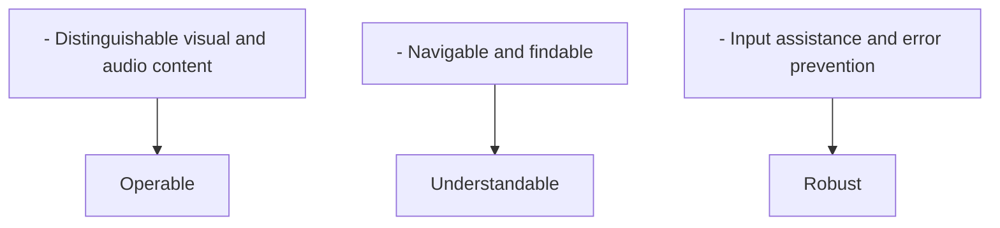
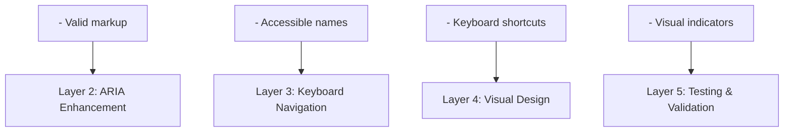

# Accessibility Perspective

> **Last Updated**: 2025-10-24
> **Status**: Active
> **Owner**: UX & Development Team

## Purpose

The Accessibility Perspective ensures that the Enterprise E-Commerce Platform is usable by all people, including those with disabilities. Accessibility is not just a legal requirement but a fundamental aspect of inclusive design that expands our market reach and improves user experience for everyone.

## Scope

This perspective addresses accessibility across three dimensions:

1. **User Interface Accessibility**: Web and mobile interfaces for all users
2. **API Usability**: Developer-friendly APIs for integration partners
3. **Documentation Clarity**: Clear, understandable documentation for all stakeholders

## Stakeholders

### Primary Stakeholders

| Stakeholder | Concerns | Success Criteria |
|-------------|----------|------------------|
| **End Users with Disabilities** | Can use all features independently | WCAG 2.1 AA compliance |
| **Developers** | Easy API integration | Clear API docs, good error messages |
| **Content Creators** | Accessible content management | Accessible CMC interface |
| **Legal/Compliance** | Regulatory compliance | ADA, Section 508 compliance |
| **Business** | Market reach, brand reputation | Increased user base, positive reviews |

## Accessibility Principles

### POUR Principles (WCAG 2.1)



## Accessibility Standards

### Compliance Targets

| Standard | Level | Target Date | Status |
|----------|-------|-------------|--------|
| **WCAG 2.1** | AA | 2025-12-31 | In Progress |
| **ADA** | Title III | 2025-12-31 | In Progress |
| **Section 508** | - | 2026-06-30 | Planned |
| **EN 301 549** | - | 2026-12-31 | Planned |

### WCAG 2.1 Level AA Requirements

#### Level A (Must Have)

- ✅ Text alternatives for images
- ✅ Captions for audio/video
- ✅ Keyboard accessible
- ✅ No keyboard traps
- ✅ Adjustable time limits
- ✅ Pause, stop, hide for moving content
- ✅ No flashing content
- ✅ Skip navigation links
- ✅ Page titles
- ✅ Focus order
- ✅ Link purpose
- ✅ Language of page
- ✅ On focus behavior
- ✅ On input behavior
- ✅ Error identification
- ✅ Labels or instructions
- ✅ Parsing (valid HTML)
- ✅ Name, role, value

#### Level AA (Should Have)

- ✅ Captions for live audio
- ✅ Audio description for video
- ✅ Contrast ratio 4.5:1 (text)
- ✅ Contrast ratio 3:1 (large text)
- ✅ Resize text to 200%
- ✅ Images of text (avoid)
- ✅ Multiple ways to find pages
- ✅ Headings and labels
- ✅ Focus visible
- ✅ Language of parts
- ✅ Consistent navigation
- ✅ Consistent identification
- ✅ Error suggestion
- ✅ Error prevention (legal, financial)
- ✅ Status messages

## Accessibility Approach

### Multi-Layered Strategy



## Accessibility Features

### User Interface Features

| Feature | Implementation | Benefit |
|---------|----------------|---------|
| **Keyboard Navigation** | Full keyboard support | Users without mouse can navigate |
| **Screen Reader Support** | ARIA labels, semantic HTML | Blind users can use the site |
| **High Contrast Mode** | CSS custom properties | Low vision users can see content |
| **Text Resizing** | Relative units (rem, em) | Users can adjust text size |
| **Focus Indicators** | Visible focus styles | Users know where they are |
| **Skip Links** | Skip to main content | Faster navigation |
| **Alt Text** | Descriptive image alternatives | Screen reader users understand images |
| **Captions** | Video captions | Deaf users can access video content |

### API Accessibility Features

| Feature | Implementation | Benefit |
|---------|----------------|---------|
| **Clear Error Messages** | Descriptive, actionable errors | Developers understand issues quickly |
| **Consistent Naming** | RESTful conventions | Predictable API structure |
| **Comprehensive Docs** | OpenAPI, examples | Easy integration |
| **Versioning** | URL-based versioning | Backward compatibility |
| **Rate Limiting Info** | Headers with limits | Developers can manage usage |

## Assistive Technologies Support

### Supported Technologies

| Technology | Type | Support Level | Testing Frequency |
|------------|------|---------------|-------------------|
| **JAWS** | Screen Reader | Full | Monthly |
| **NVDA** | Screen Reader | Full | Monthly |
| **VoiceOver** | Screen Reader | Full | Monthly |
| **TalkBack** | Screen Reader (Mobile) | Full | Monthly |
| **Dragon NaturallySpeaking** | Voice Control | Full | Quarterly |
| **ZoomText** | Screen Magnifier | Full | Quarterly |
| **Windows High Contrast** | Visual Enhancement | Full | Monthly |

## Accessibility Testing

### Testing Strategy

```text
┌─────────────────────────────────────────────────────────┐
│           Accessibility Testing Pyramid                 │
├─────────────────────────────────────────────────────────┤
│                                                         │
│                    ┌─────────────┐                      │
│                    │   Manual    │                      │
│                    │   Testing   │                      │
│                    │   (10%)     │                      │
│                    └─────────────┘                      │
│                  ┌─────────────────┐                    │
│                  │  Screen Reader  │                    │
│                  │    Testing      │                    │
│                  │     (20%)       │                    │
│                  └─────────────────┘                    │
│              ┌───────────────────────┐                  │
│              │   Keyboard Testing    │                  │
│              │       (30%)           │                  │
│              └───────────────────────┘                  │
│          ┌───────────────────────────────┐              │
│          │    Automated Testing          │              │
│          │         (40%)                 │              │
│          └───────────────────────────────┘              │
│                                                         │
└─────────────────────────────────────────────────────────┘
```

### Testing Tools

| Tool | Purpose | Frequency |
|------|---------|-----------|
| **axe DevTools** | Automated accessibility testing | Every build |
| **WAVE** | Visual accessibility evaluation | Weekly |
| **Lighthouse** | Performance and accessibility audit | Every build |
| **Pa11y** | CI/CD accessibility testing | Every commit |
| **Screen Readers** | Manual testing | Monthly |
| **Keyboard Only** | Navigation testing | Weekly |

## Metrics and Monitoring

### Accessibility Metrics

| Metric | Target | Current | Trend |
|--------|--------|---------|-------|
| **WCAG 2.1 AA Compliance** | 100% | 85% | ↗️ |
| **Automated Test Pass Rate** | 100% | 95% | ↗️ |
| **Keyboard Accessibility** | 100% | 90% | ↗️ |
| **Color Contrast Ratio** | 4.5:1 | 4.8:1 | → |
| **Alt Text Coverage** | 100% | 98% | ↗️ |
| **Focus Indicator Visibility** | 100% | 100% | → |

### User Feedback

- **Accessibility Feedback Form**: Dedicated form for accessibility issues
- **User Testing**: Monthly sessions with users with disabilities
- **Support Tickets**: Track accessibility-related support requests
- **Satisfaction Score**: Target 4.5/5.0 for users with disabilities

## Quality Attribute Scenarios

### Scenario 1: Screen Reader Navigation

- **Source**: Visually impaired user
- **Stimulus**: Navigate checkout process using screen reader
- **Environment**: Web browser with screen reader enabled
- **Artifact**: Checkout UI
- **Response**: All elements properly labeled, logical navigation order
- **Response Measure**: Task completion without assistance

## Related Documentation

### Viewpoints

- [Functional Viewpoint](../../viewpoints/functional/overview.md) - User interface capabilities
- [Development Viewpoint](../../viewpoints/development/overview.md) - Development practices

### Other Perspectives

- [Evolution Perspective](../evolution/README.md) - Maintaining accessibility during changes
- [Performance Perspective](../performance/overview.md) - Performance for assistive technologies

### Implementation Guides

- [UI Accessibility](ui-accessibility.md) - WCAG compliance and implementation
- [API Usability](api-usability.md) - Developer-friendly API design
- [Documentation Clarity](documentation.md) - Clear documentation standards

## Document Structure

This perspective is organized into the following documents:

1. **[Overview](README.md)** (this document) - Purpose, scope, and approach
2. **[UI Accessibility](ui-accessibility.md)** - WCAG 2.1 compliance, keyboard navigation, screen readers
3. **[API Usability](api-usability.md)** - RESTful design, error messages, documentation
4. **[Documentation Clarity](documentation.md)** - Writing standards, examples, clarity

## Implementation Examples

### Semantic HTML

**Good Example**:
```html
<!-- Proper semantic structure -->
<header>
  <nav aria-label="Main navigation">
    <ul>
      <li><a href="/">Home</a></li>
      <li><a href="#products">Products</a></li>
      <li><a href="#cart">Cart</a></li>
    </ul>
  </nav>
</header>

<main>
  <h1>Product Catalog</h1>
  <section aria-labelledby="featured-heading">
    <h2 id="featured-heading">Featured Products</h2>
    <article>
      <h3>Product Name</h3>
      
      <p>Description of the product...</p>
      <button type="button">Add to Cart</button>
    </article>
  </section>
</main>
```

**Bad Example**:
```html
<!-- Avoid divs for everything -->
<div class="header">
  <div class="nav">
    <div class="link"><a href="/">Home</a></div>
    <div class="link"><a href="#products">Products</a></div>
  </div>
</div>

<div class="content">
  <div class="title">Product Catalog</div>
  <div class="product">
      <!-- Missing alt text -->
    <div class="button" onclick="addToCart()">Add to Cart</div>  <!-- Not keyboard accessible -->
  </div>
</div>
```

### ARIA Labels

**Form Accessibility**:
```html
<form>
  <label for="email">Email Address</label>
  <input
    type="email"
    id="email"
    name="email"
    aria-required="true"
    aria-describedby="email-help"
    aria-invalid="false">
  <span id="email-help" class="help-text">
    We'll never share your email with anyone else.
  </span>

  <!-- Error state -->
  <input
    type="email"
    id="email-error"
    name="email"
    aria-required="true"
    aria-describedby="email-error-msg"
    aria-invalid="true">
  <span id="email-error-msg" class="error-text" role="alert">
    Please enter a valid email address.
  </span>
</form>
```

### Keyboard Navigation

**React Component Example**:
```typescript
// Accessible dropdown menu
const DropdownMenu: React.FC = () => {
  const [isOpen, setIsOpen] = useState(false);
  const menuRef = useRef<HTMLDivElement>(null);

  const handleKeyDown = (e: KeyboardEvent) => {
    switch (e.key) {
      case 'Escape':
        setIsOpen(false);
        break;
      case 'ArrowDown':
        e.preventDefault();
        // Focus next item
        break;
      case 'ArrowUp':
        e.preventDefault();
        // Focus previous item
        break;
      case 'Home':
        e.preventDefault();
        // Focus first item
        break;
      case 'End':
        e.preventDefault();
        // Focus last item
        break;
    }
  };

  return (
    <div ref={menuRef}>
      <button
        aria-haspopup="true"
        aria-expanded={isOpen}
        onClick={() => setIsOpen(!isOpen)}
        onKeyDown={handleKeyDown}>
        Menu
      </button>
      {isOpen && (
        <ul role="menu" aria-label="Options">
          <li role="menuitem" tabIndex={0}>Option 1</li>
          <li role="menuitem" tabIndex={0}>Option 2</li>
          <li role="menuitem" tabIndex={0}>Option 3</li>
        </ul>
      )}
    </div>
  );
};
```

### Focus Management

**Modal Dialog Example**:
```typescript
const Modal: React.FC<{isOpen: boolean, onClose: () => void}> = ({isOpen, onClose, children}) => {
  const modalRef = useRef<HTMLDivElement>(null);
  const previousFocusRef = useRef<HTMLElement | null>(null);

  useEffect(() => {
    if (isOpen) {
      // Save current focus
      previousFocusRef.current = document.activeElement as HTMLElement;

      // Focus first focusable element in modal
      const firstFocusable = modalRef.current?.querySelector<HTMLElement>(
        'button, [href], input, select, textarea, [tabindex]:not([tabindex="-1"])'
      );
      firstFocusable?.focus();

      // Trap focus within modal
      const handleTabKey = (e: KeyboardEvent) => {
        if (e.key === 'Tab') {
          // Focus trap logic
        }
      };
      document.addEventListener('keydown', handleTabKey);

      return () => {
        document.removeEventListener('keydown', handleTabKey);
        // Restore focus when modal closes
        previousFocusRef.current?.focus();
      };
    }
  }, [isOpen]);

  if (!isOpen) return null;

  return (
    <div
      ref={modalRef}
      role="dialog"
      aria-modal="true"
      aria-labelledby="modal-title">
      <h2 id="modal-title">Modal Title</h2>
      {children}
      <button onClick={onClose}>Close</button>
    </div>
  );
};
```

## Continuous Improvement

### Regular Activities

**Daily**:
- Automated accessibility tests in CI/CD
- axe-core integration in build pipeline
- Lighthouse accessibility score check
- Pa11y CI tests on every commit

**Weekly**:
- Manual keyboard navigation testing
- Focus indicator verification
- Color contrast spot checks
- Accessibility issue triage

**Monthly**:
- Screen reader testing with real users
- User testing sessions with people with disabilities
- Accessibility metrics review
- Team accessibility training

**Quarterly**:
- Comprehensive accessibility audit
- Third-party accessibility assessment
- Assistive technology compatibility testing
- Accessibility roadmap review

**Annually**:
- Third-party accessibility certification
- Legal compliance review
- Accessibility strategy update
- Major assistive technology updates

### Accessibility Champions

**Accessibility Team**:
- Dedicated team for accessibility initiatives
- Cross-functional (UX, Dev, QA, Legal)
- Accessibility standards ownership
- Training and education

**Champions Network**:
- One accessibility champion per team
- Monthly champion meetings
- Share best practices and learnings
- First point of contact for accessibility questions

**Training Program**:
- Quarterly accessibility training for all developers
- Onboarding accessibility module
- Specialized training for UX designers
- Annual refresher courses

**Code Reviews**:
- Accessibility checks in every code review
- Automated accessibility linting
- Manual accessibility verification
- Accessibility checklist for reviewers

### Accessibility Checklist

**Before Merge**:
- [ ] Automated accessibility tests pass
- [ ] Keyboard navigation works
- [ ] Focus indicators visible
- [ ] Color contrast meets 4.5:1 ratio
- [ ] Alt text provided for images
- [ ] ARIA labels where needed
- [ ] Semantic HTML used
- [ ] Screen reader tested (if UI change)

## Legal and Compliance

### Regulatory Requirements

**ADA (Americans with Disabilities Act)**:
- Title III compliance for public accommodations
- Applies to e-commerce websites
- Requires equal access for people with disabilities
- Penalties: $75,000 first violation, $150,000 subsequent

**Section 508**:
- Federal accessibility standards
- Required for government contracts
- Based on WCAG 2.0 Level AA
- Applies to federal agencies and contractors

**EN 301 549**:
- European accessibility standard
- Harmonized across EU member states
- Based on WCAG 2.1 Level AA
- Required for public sector websites

**AODA (Accessibility for Ontarians with Disabilities Act)**:
- Canadian accessibility law (Ontario)
- WCAG 2.0 Level AA compliance required
- Applies to organizations with 50+ employees
- Penalties up to $100,000 per day

### Risk Mitigation

**Legal Review**:
- Annual legal review of accessibility compliance
- Quarterly compliance status reports
- Risk assessment and mitigation planning
- Legal counsel consultation

**Documentation**:
- Maintain accessibility compliance documentation
- Accessibility conformance reports (VPAT)
- Testing results and remediation plans
- Training records and certifications

**Remediation Plan**:
- Clear plan for addressing accessibility issues
- Prioritization based on severity and impact
- Timeline for remediation
- Regular progress tracking

**Insurance**:
- Cyber liability insurance covering accessibility claims
- D&O insurance for leadership protection
- Legal defense coverage
- Settlement and judgment coverage

### Accessibility Statement

**Public Commitment**:
```markdown
# Accessibility Statement

We are committed to ensuring digital accessibility for people with disabilities.
We continually improve the user experience for everyone and apply relevant
accessibility standards.

## Conformance Status
The Web Content Accessibility Guidelines (WCAG) defines requirements for
designers and developers to improve accessibility for people with disabilities.
It defines three levels of conformance: Level A, Level AA, and Level AAA.
Our website is partially conformant with WCAG 2.1 level AA.

## Feedback
We welcome your feedback on the accessibility of our website. Please contact us:
- Email: accessibility@ecommerce.com
- Phone: 1-800-XXX-XXXX
- Mail: Accessibility Team, [Address]

We aim to respond to accessibility feedback within 2 business days.

## Date
This statement was created on [Date] and last reviewed on [Date].
```

---

**Next Steps**:
- Review [UI Accessibility](ui-accessibility.md) for detailed WCAG 2.1 implementation guidelines
- See [API Usability](api-usability.md) for developer-friendly API design
- Consult [Documentation Clarity](documentation.md) for clear documentation standards
