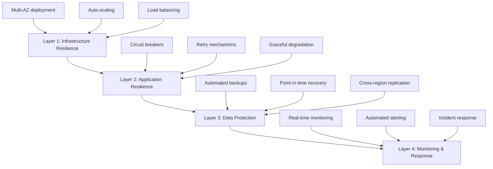

# Availability & Resilience Perspective

> **Last Updated**: 2025-10-24  
> **Status**: Active  
> **Owner**: Operations & Architecture Team

## Purpose

The Availability & Resilience Perspective addresses the system's ability to remain operational and recover from failures. For an e-commerce platform, high availability is critical as downtime directly impacts revenue, customer trust, and brand reputation. This perspective ensures the system can:

- Maintain service availability during component failures
- Recover quickly from unexpected incidents
- Minimize data loss during failures
- Provide consistent user experience under various failure scenarios

## Scope

This perspective applies to all system components and addresses:

- **Availability**: The proportion of time the system is operational and accessible
- **Resilience**: The system's ability to withstand and recover from failures
- **Fault Tolerance**: The system's capability to continue operating despite component failures
- **Disaster Recovery**: The system's ability to recover from catastrophic events

## Stakeholders

### Primary Stakeholders

| Stakeholder | Concerns | Success Criteria |
|-------------|----------|------------------|
| **Business Leadership** | Revenue protection, brand reputation | 99.9% uptime, minimal customer impact |
| **Operations Team** | System reliability, incident response | Fast recovery, clear procedures |
| **Development Team** | Resilient architecture, fault handling | Robust error handling, automated recovery |
| **Customers** | Service availability, data integrity | Seamless experience, no data loss |
| **Support Team** | Issue resolution, customer communication | Clear status information, quick resolution |

## Availability Targets

### Service Level Objectives (SLO)

- **Overall System Availability**: 99.9% uptime
  - Maximum downtime: 8.76 hours per year
  - Maximum downtime per month: 43.8 minutes
  - Maximum downtime per week: 10.1 minutes

- **Critical Services Availability**: 99.95% uptime
  - Order processing
  - Payment processing
  - Customer authentication

- **Non-Critical Services Availability**: 99.5% uptime
  - Product recommendations
  - Review system
  - Analytics

### Recovery Objectives

- **RTO (Recovery Time Objective)**: 5 minutes
  - Time to restore service after failure
  
- **RPO (Recovery Point Objective)**: 1 minute
  - Maximum acceptable data loss

## Approach

### Multi-Layered Resilience Strategy

Our availability and resilience approach follows a defense-in-depth strategy with four complementary layers:



#### Layer 1: Infrastructure Resilience

**Multi-AZ Deployment**:
- All critical services deployed across 3 availability zones
- Automatic failover between zones (< 60 seconds)
- No single point of failure in infrastructure

**Auto-Scaling**:
- Horizontal pod autoscaling (HPA) for application tier
- Cluster autoscaling for Kubernetes nodes
- Database read replica scaling based on load

**Load Balancing**:
- Application Load Balancer (ALB) with health checks
- Automatic traffic distribution across healthy targets
- Connection draining during deployments

#### Layer 2: Application Resilience

**Circuit Breakers**:
- Prevent cascading failures across services
- Automatic circuit opening on failure threshold
- Half-open state for recovery testing

**Retry Mechanisms**:
- Exponential backoff for transient failures
- Maximum retry attempts to prevent infinite loops
- Idempotent operations for safe retries

**Graceful Degradation**:
- Core functionality maintained during partial failures
- Non-critical features disabled automatically
- User-friendly error messages and fallback content

#### Layer 3: Data Protection

**Automated Backups**:
- Continuous database snapshots (every 5 minutes)
- Automated backup verification and testing
- Multi-tier storage with lifecycle policies

**Point-in-Time Recovery**:
- 5-minute recovery granularity
- 30-day retention period
- Tested monthly for reliability

**Cross-Region Replication**:
- Asynchronous replication to DR region
- Read replicas for disaster recovery
- Automated failover procedures

#### Layer 4: Monitoring & Response

**Real-Time Monitoring**:
- Comprehensive metrics collection (Prometheus)
- Distributed tracing (AWS X-Ray)
- Log aggregation and analysis (CloudWatch)

**Automated Alerting**:
- Proactive alerts before SLO breach
- Escalation policies for critical incidents
- Integration with PagerDuty for on-call

**Incident Response**:
- Documented runbooks for common scenarios
- Automated remediation where possible
- Post-incident reviews and improvements

### Key Principles

1. **Design for Failure**: Assume components will fail and design accordingly
   - Every component has a failure mode analysis
   - Redundancy at every layer
   - No single points of failure

2. **Fail Fast**: Detect failures quickly and respond immediately
   - Health checks every 10-30 seconds
   - Automatic removal of unhealthy instances
   - Circuit breakers trip within 3 failed attempts

3. **Isolate Failures**: Prevent cascading failures across system boundaries
   - Bulkhead pattern for resource isolation
   - Separate thread pools for different services
   - Timeout policies on all external calls

4. **Automate Recovery**: Minimize manual intervention through automation
   - Automatic failover for databases (60-120 seconds)
   - Self-healing Kubernetes pods
   - Automated rollback on deployment failures

5. **Test Regularly**: Conduct regular DR drills and chaos engineering exercises
   - Monthly chaos engineering tests
   - Quarterly full DR drills
   - Annual surprise failover tests

### Failure Scenarios and Responses

| Failure Scenario | Detection Time | Recovery Action | RTO | Impact |
|------------------|----------------|-----------------|-----|--------|
| Pod failure | 10-30 seconds | Kubernetes restarts pod | < 1 min | None (other pods handle traffic) |
| Node failure | 30-60 seconds | Pods rescheduled to healthy nodes | < 2 min | Minimal (brief capacity reduction) |
| AZ failure | 1-2 minutes | Traffic routed to other AZs | < 5 min | Reduced capacity, no downtime |
| Database primary failure | 30-60 seconds | Automatic failover to standby | < 2 min | Brief read-only mode |
| Region failure | 5-10 minutes | Manual failover to DR region | < 15 min | Service interruption |
| Cache failure | 10-20 seconds | Rebuild cache from database | < 1 min | Performance degradation |

## Architecture Overview

### High Availability Components

```text
┌──────────────────────────────────────────────────────────┐
│                    Route 53 (DNS)                        │
│              Global Load Balancing                       │
└────────────────────┬─────────────────────────────────────┘
                     │
        ┌────────────┴────────────┐
        │                         │
┌───────▼────────┐       ┌───────▼────────┐
│   Region 1     │       │   Region 2     │
│   (Primary)    │       │   (DR)         │
│                │       │                │
│  ┌──────────┐  │       │  ┌──────────┐  │
│  │   ALB    │  │       │  │   ALB    │  │
│  └────┬─────┘  │       │  └────┬─────┘  │
│       │        │       │       │        │
│  ┌────▼─────┐  │       │  ┌────▼─────┐  │
│  │   EKS    │  │       │  │   EKS    │  │
│  │ Multi-AZ │  │       │  │ Multi-AZ │  │
│  └────┬─────┘  │       │  └────┬─────┘  │
│       │        │       │       │        │
│  ┌────▼─────┐  │       │  ┌────▼─────┐  │
│  │   RDS    │  │       │  │   RDS    │  │
│  │ Multi-AZ │◄─┼───────┼──┤  Replica │  │
│  └──────────┘  │       │  └──────────┘  │
└────────────────┘       └────────────────┘
```

## Related Documentation

### Viewpoints

- [Deployment Viewpoint](../../viewpoints/deployment/overview.md) - Infrastructure architecture
- [Operational Viewpoint](../../viewpoints/operational/overview.md) - Monitoring and incident response
- [Concurrency Viewpoint](../../viewpoints/concurrency/overview.md) - State management and synchronization

### Other Perspectives

- [Performance & Scalability Perspective](../performance/overview.md) - Performance under failure scenarios
- [Security Perspective](../security/overview.md) - Security during incidents

### Implementation Guides

- [Fault Tolerance Patterns](fault-tolerance.md) - Circuit breakers, retries, fallbacks
- [Disaster Recovery](disaster-recovery.md) - Backup, restore, and failover procedures

## Document Structure

This perspective is organized into the following documents:

1. **[Overview](overview.md)** (this document) - Purpose, scope, and approach
2. **[Requirements](requirements.md)** - SLOs, quality attribute scenarios, measurable targets
3. **[Fault Tolerance](fault-tolerance.md)** - Patterns for handling failures
5. **[Disaster Recovery](disaster-recovery.md)** - DR strategy, backup, and restore procedures

## Metrics and Monitoring

### Key Availability Metrics

- **Uptime Percentage**: Actual uptime vs. target SLO
- **MTBF (Mean Time Between Failures)**: Average time between system failures
- **MTTR (Mean Time To Recovery)**: Average time to recover from failures
- **Error Rate**: Percentage of failed requests
- **Incident Count**: Number of availability incidents per month

### Monitoring Approach

See [Operational Viewpoint - Monitoring](../../viewpoints/operational/monitoring-alerting.md) for detailed monitoring implementation.

## Implementation Patterns

### Circuit Breaker Pattern

**Purpose**: Prevent cascading failures by stopping calls to failing services

**Implementation**:
```java
@Service
public class OrderService {
    
    @CircuitBreaker(name = "paymentService", fallbackMethod = "paymentFallback")
    public PaymentResponse processPayment(PaymentRequest request) {
        return paymentClient.process(request);
    }
    
    private PaymentResponse paymentFallback(PaymentRequest request, Exception ex) {
        // Queue for later processing
        paymentQueue.enqueue(request);
        return PaymentResponse.queued("Payment queued for processing");
    }
}
```

**Configuration**:
```yaml
resilience4j:
  circuitbreaker:
    instances:
      paymentService:
        slidingWindowSize: 10
        failureRateThreshold: 50
        waitDurationInOpenState: 10s
```

### Retry Pattern

**Purpose**: Handle transient failures with exponential backoff

**Implementation**:
```java
@Retryable(
    value = {TransientException.class},
    maxAttempts = 3,
    backoff = @Backoff(delay = 1000, multiplier = 2, maxDelay = 10000)
)
public Order createOrder(CreateOrderCommand command) {
    return orderRepository.save(command.toOrder());
}
```

### Health Check Pattern

**Purpose**: Enable automatic detection and removal of unhealthy instances

**Implementation**:
```java
@Component
public class DatabaseHealthIndicator implements HealthIndicator {
    
    @Override
    public Health health() {
        try {
            // Check database connectivity
            jdbcTemplate.queryForObject("SELECT 1", Integer.class);
            return Health.up()
                .withDetail("database", "responsive")
                .build();
        } catch (Exception e) {
            return Health.down()
                .withDetail("database", "unreachable")
                .withException(e)
                .build();
        }
    }
}
```

**Kubernetes Configuration**:
```yaml
livenessProbe:
  httpGet:
    path: /actuator/health/liveness
    port: 8080
  initialDelaySeconds: 30
  periodSeconds: 10
  failureThreshold: 3

readinessProbe:
  httpGet:
    path: /actuator/health/readiness
    port: 8080
  initialDelaySeconds: 10
  periodSeconds: 5
  failureThreshold: 3
```

## Testing and Validation

### Availability Testing Strategy

**Unit Tests**:
- Test failure handling in individual components
- Verify circuit breaker behavior
- Validate retry logic

**Integration Tests**:
- Test failover between database replicas
- Verify load balancer health check behavior
- Test graceful degradation scenarios

**Chaos Engineering Tests**:
- Random pod termination
- Network partition simulation
- Resource exhaustion scenarios
- Database failover testing

### Monthly Testing Schedule

```yaml
Week 1: Infrastructure Resilience
  - Pod failure recovery
  - Node failure handling
  - Auto-scaling behavior

Week 2: Application Resilience
  - Circuit breaker functionality
  - Retry mechanism validation
  - Graceful degradation testing

Week 3: Data Protection
  - Backup verification
  - Point-in-time recovery
  - Cross-region replication lag

Week 4: End-to-End Scenarios
  - Full failover drill
  - Multi-component failure
  - Performance under failure
```

### Quarterly DR Drills

**Q1 (January)**: Tabletop Exercise
- Review procedures with team
- Identify gaps in documentation
- Update runbooks

**Q2 (April)**: Partial Failover
- Test database failover
- Verify application recovery
- Measure actual RTO/RPO

**Q3 (July)**: Full DR Simulation
- Complete region failover
- All services in DR region
- Customer-facing validation

**Q4 (October)**: Surprise Drill
- Unannounced failover test
- Test on-call response
- Validate escalation procedures

## Continuous Improvement

### Regular Activities

**Monthly**:
- Review availability metrics and incident reports
- Analyze SLO compliance and trends
- Update failure scenario documentation
- Conduct chaos engineering tests

**Quarterly**:
- Conduct disaster recovery drills
- Review and update runbooks
- Analyze incident patterns
- Update availability targets if needed

**Bi-annually**:
- Update and test failover procedures
- Review and optimize auto-scaling policies
- Audit backup and recovery processes
- Conduct architecture review

**Annually**:
- Review and update availability targets
- Comprehensive DR plan review
- Team training and certification
- Third-party availability audit

### Chaos Engineering Program

We practice chaos engineering to proactively identify weaknesses:

**Infrastructure Chaos**:
- Random pod termination in Kubernetes
- Node failure simulation
- AZ failure scenarios
- Network partition testing

**Application Chaos**:
- Service dependency failures
- API timeout injection
- Memory pressure simulation
- CPU throttling

**Data Chaos**:
- Database failover simulation
- Cache failure scenarios
- Replication lag injection
- Backup corruption testing

**Chaos Testing Tools**:
- Chaos Mesh for Kubernetes
- AWS Fault Injection Simulator
- Custom chaos scripts
- Gremlin (for advanced scenarios)

### Incident Response Process

**Detection** (0-5 minutes):
- Automated monitoring alerts
- Customer reports
- Internal team discovery

**Assessment** (5-10 minutes):
- Determine severity and impact
- Identify affected services
- Estimate recovery time

**Response** (10-30 minutes):
- Execute appropriate runbook
- Communicate with stakeholders
- Implement workarounds if needed

**Recovery** (varies by scenario):
- Restore normal operations
- Verify system health
- Monitor for recurrence

**Post-Incident** (within 48 hours):
- Conduct blameless post-mortem
- Document lessons learned
- Create action items for improvements
- Update runbooks and procedures

## Success Metrics

### Availability Metrics

**Primary Metrics**:
- **Uptime Percentage**: 99.9% target (measured monthly)
- **MTBF**: > 720 hours (30 days)
- **MTTR**: < 15 minutes
- **Incident Count**: < 2 per month (P0/P1)

**Secondary Metrics**:
- **Failed Health Checks**: < 0.1% of total checks
- **Failover Success Rate**: > 99%
- **Backup Success Rate**: 100%
- **DR Drill Success Rate**: > 95%

### Quality Indicators

**Leading Indicators** (predict future issues):
- Increasing error rates
- Growing replication lag
- Rising resource utilization
- Increasing incident frequency

**Lagging Indicators** (measure past performance):
- Actual uptime vs. target
- Customer-reported incidents
- SLO compliance percentage
- Mean time to recovery

### Reporting

**Daily**: Automated availability dashboard
**Weekly**: Availability summary email
**Monthly**: Detailed availability report with trends
**Quarterly**: Executive summary with recommendations

---

**Next Steps**: 
- Review [Requirements](requirements.md) for detailed availability targets and quality attribute scenarios
- See [High Availability Design](high-availability-design.md) for comprehensive HA architecture
- Consult [Disaster Recovery](disaster-recovery.md) for DR procedures and runbooks
