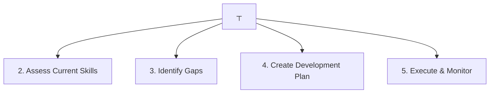

# Required Skills

> **Last Updated**: 2025-10-24  
> **Status**: Active  
> **Owner**: Engineering Management & HR

## Overview

This document provides a comprehensive breakdown of technical and soft skills required for each role in the engineering organization, along with skill development paths and training resources.

## Skill Proficiency Levels

| Level | Description | Indicators |
|-------|-------------|------------|
| **Beginner** | Basic understanding, requires guidance | Can follow tutorials, needs supervision |
| **Intermediate** | Can work independently on standard tasks | Solves common problems, occasional guidance needed |
| **Advanced** | Expert level, can handle complex scenarios | Designs solutions, mentors others |
| **Expert** | Industry-recognized expertise | Innovates, sets standards, thought leader |

## Backend Development Skills

### Core Java Skills

| Skill | Junior | Mid-level | Senior | Training Resources |
|-------|--------|-----------|--------|-------------------|
| **Java Language (21)** | Intermediate | Advanced | Expert | Oracle Java Tutorials, Effective Java book |
| **Object-Oriented Programming** | Intermediate | Advanced | Expert | Head First Design Patterns |
| **Functional Programming** | Beginner | Intermediate | Advanced | Java 8+ Streams, Lambdas courses |
| **Concurrency & Multithreading** | Beginner | Intermediate | Advanced | Java Concurrency in Practice |
| **JVM Internals** | Beginner | Intermediate | Advanced | Understanding the JVM book |
| **Memory Management** | Beginner | Intermediate | Advanced | JVM performance tuning courses |
| **Generics & Collections** | Intermediate | Advanced | Expert | Effective Java, Collections framework |

### Spring Framework Skills

| Skill | Junior | Mid-level | Senior | Training Resources |
|-------|--------|-----------|--------|-------------------|
| **Spring Boot 3.x** | Intermediate | Advanced | Expert | Spring Boot official docs, Baeldung |
| **Spring Core (DI/IoC)** | Intermediate | Advanced | Expert | Spring Framework documentation |
| **Spring Data JPA** | Intermediate | Advanced | Expert | Spring Data JPA tutorials |
| **Spring Security** | Beginner | Intermediate | Advanced | Spring Security in Action book |
| **Spring Cloud** | Beginner | Intermediate | Advanced | Spring Cloud documentation |
| **Spring WebFlux** | Beginner | Intermediate | Advanced | Reactive Spring course |
| **Spring Actuator** | Intermediate | Advanced | Expert | Production-ready Spring Boot |

### Architecture & Design Skills

| Skill | Junior | Mid-level | Senior | Training Resources |
|-------|--------|-----------|--------|-------------------|
| **Domain-Driven Design** | Beginner | Intermediate | Advanced | DDD by Eric Evans, Implementing DDD |
| **Hexagonal Architecture** | Beginner | Intermediate | Advanced | Hexagonal Architecture articles |
| **Event-Driven Architecture** | Beginner | Intermediate | Advanced | Event-Driven Microservices book |
| **Microservices Patterns** | Beginner | Intermediate | Advanced | Microservices Patterns by Chris Richardson |
| **SOLID Principles** | Intermediate | Advanced | Expert | Clean Code, Clean Architecture |
| **Design Patterns** | Intermediate | Advanced | Expert | Gang of Four, Head First Design Patterns |
| **API Design** | Intermediate | Advanced | Expert | RESTful Web Services, API Design Patterns |

### Database Skills

| Skill | Junior | Mid-level | Senior | Training Resources |
|-------|--------|-----------|--------|-------------------|
| **SQL** | Intermediate | Advanced | Expert | SQL Performance Explained |
| **PostgreSQL** | Intermediate | Advanced | Expert | PostgreSQL documentation, High Performance PostgreSQL |
| **Database Design** | Intermediate | Advanced | Expert | Database Design for Mere Mortals |
| **Query Optimization** | Beginner | Intermediate | Advanced | SQL Tuning book |
| **Indexing Strategies** | Beginner | Intermediate | Advanced | Database indexing courses |
| **Transactions & ACID** | Intermediate | Advanced | Expert | Transaction Processing book |
| **NoSQL Concepts** | Beginner | Intermediate | Advanced | NoSQL Distilled |

### Messaging & Event Streaming

| Skill | Junior | Mid-level | Senior | Training Resources |
|-------|--------|-----------|--------|-------------------|
| **Apache Kafka** | Beginner | Intermediate | Advanced | Kafka: The Definitive Guide |
| **Event Sourcing** | Beginner | Intermediate | Advanced | Event Sourcing patterns |
| **CQRS** | Beginner | Intermediate | Advanced | CQRS Journey by Microsoft |
| **Message Patterns** | Beginner | Intermediate | Advanced | Enterprise Integration Patterns |
| **Redis Pub/Sub** | Beginner | Intermediate | Advanced | Redis documentation |

### Testing Skills

| Skill | Junior | Mid-level | Senior | Training Resources |
|-------|--------|-----------|--------|-------------------|
| **JUnit 5** | Intermediate | Advanced | Expert | JUnit 5 User Guide |
| **Mockito** | Intermediate | Advanced | Expert | Mockito documentation |
| **AssertJ** | Intermediate | Advanced | Expert | AssertJ documentation |
| **Test-Driven Development** | Intermediate | Advanced | Expert | TDD by Example by Kent Beck |
| **Behavior-Driven Development** | Intermediate | Advanced | Expert | BDD in Action |
| **Cucumber / Gherkin** | Intermediate | Advanced | Expert | Cucumber documentation |
| **Integration Testing** | Intermediate | Advanced | Expert | Spring Boot Testing |
| **Performance Testing** | Beginner | Intermediate | Advanced | JMeter, Gatling courses |

## Frontend Development Skills

### Core Frontend Skills

| Skill | Junior | Mid-level | Senior | Training Resources |
|-------|--------|-----------|--------|-------------------|
| **HTML5** | Intermediate | Advanced | Expert | MDN Web Docs |
| **CSS3** | Intermediate | Advanced | Expert | CSS: The Definitive Guide |
| **JavaScript (ES6+)** | Intermediate | Advanced | Expert | You Don't Know JS series |
| **TypeScript** | Intermediate | Advanced | Expert | TypeScript Handbook |
| **Responsive Design** | Intermediate | Advanced | Expert | Responsive Web Design courses |
| **CSS Preprocessors (Sass)** | Intermediate | Advanced | Advanced | Sass documentation |
| **CSS-in-JS** | Beginner | Intermediate | Advanced | Styled Components, Emotion |

### React Ecosystem

| Skill | Junior | Mid-level | Senior | Training Resources |
|-------|--------|-----------|--------|-------------------|
| **React 18** | Intermediate | Advanced | Expert | React official documentation |
| **React Hooks** | Intermediate | Advanced | Expert | React Hooks documentation |
| **Next.js 14** | Intermediate | Advanced | Expert | Next.js documentation |
| **State Management (Redux)** | Beginner | Intermediate | Advanced | Redux Toolkit documentation |
| **React Router** | Intermediate | Advanced | Advanced | React Router documentation |
| **React Query** | Beginner | Intermediate | Advanced | TanStack Query documentation |
| **Server Components** | Beginner | Intermediate | Advanced | Next.js Server Components |

### Angular Ecosystem

| Skill | Junior | Mid-level | Senior | Training Resources |
|-------|--------|-----------|--------|-------------------|
| **Angular 18** | Intermediate | Advanced | Expert | Angular official documentation |
| **RxJS** | Intermediate | Advanced | Expert | RxJS documentation, Learn RxJS |
| **NgRx** | Beginner | Intermediate | Advanced | NgRx documentation |
| **Angular Material** | Intermediate | Advanced | Advanced | Material Design documentation |
| **Angular Forms** | Intermediate | Advanced | Advanced | Angular Forms guide |
| **Angular Router** | Intermediate | Advanced | Advanced | Angular Router documentation |

### Frontend Testing

| Skill | Junior | Mid-level | Senior | Training Resources |
|-------|--------|-----------|--------|-------------------|
| **Jest** | Intermediate | Advanced | Expert | Jest documentation |
| **React Testing Library** | Intermediate | Advanced | Expert | Testing Library documentation |
| **Cypress** | Intermediate | Advanced | Expert | Cypress documentation |
| **Playwright** | Beginner | Intermediate | Advanced | Playwright documentation |
| **Visual Regression Testing** | Beginner | Intermediate | Advanced | Percy, Chromatic |

### UI/UX Skills

| Skill | Junior | Mid-level | Senior | Training Resources |
|-------|--------|-----------|--------|-------------------|
| **Accessibility (WCAG 2.1)** | Intermediate | Advanced | Expert | Web Accessibility courses |
| **Design Systems** | Beginner | Intermediate | Advanced | Design Systems handbook |
| **Performance Optimization** | Intermediate | Advanced | Expert | Web Performance courses |
| **Browser DevTools** | Intermediate | Advanced | Expert | Chrome DevTools documentation |
| **SEO Basics** | Beginner | Intermediate | Advanced | SEO fundamentals courses |

## Infrastructure & DevOps Skills

### Cloud Platform Skills (AWS)

| Skill | Junior | Mid-level | Senior | Training Resources |
|-------|--------|-----------|--------|-------------------|
| **AWS Core Services** | Beginner | Intermediate | Advanced | AWS Training and Certification |
| **EC2 & EKS** | Beginner | Intermediate | Advanced | AWS EKS Workshop |
| **RDS & Database Services** | Beginner | Intermediate | Advanced | AWS Database courses |
| **ElastiCache (Redis)** | Beginner | Intermediate | Advanced | ElastiCache documentation |
| **MSK (Kafka)** | Beginner | Intermediate | Advanced | MSK documentation |
| **S3 & Storage** | Intermediate | Advanced | Advanced | S3 best practices |
| **CloudWatch & X-Ray** | Intermediate | Advanced | Expert | Observability on AWS |
| **IAM & Security** | Intermediate | Advanced | Expert | AWS Security courses |
| **VPC & Networking** | Beginner | Intermediate | Advanced | AWS Networking courses |
| **Route 53** | Beginner | Intermediate | Advanced | DNS and Route 53 |

### Infrastructure as Code

| Skill | Junior | Mid-level | Senior | Training Resources |
|-------|--------|-----------|--------|-------------------|
| **AWS CDK** | Beginner | Intermediate | Advanced | AWS CDK Workshop |
| **Terraform** | Beginner | Intermediate | Advanced | Terraform Up & Running |
| **CloudFormation** | Beginner | Intermediate | Advanced | CloudFormation documentation |
| **IaC Best Practices** | Beginner | Intermediate | Advanced | Infrastructure as Code book |

### Container & Orchestration

| Skill | Junior | Mid-level | Senior | Training Resources |
|-------|--------|-----------|--------|-------------------|
| **Docker** | Intermediate | Advanced | Expert | Docker Deep Dive |
| **Kubernetes** | Beginner | Intermediate | Advanced | Kubernetes in Action |
| **Helm** | Beginner | Intermediate | Advanced | Helm documentation |
| **Container Security** | Beginner | Intermediate | Advanced | Container Security book |

### CI/CD Skills

| Skill | Junior | Mid-level | Senior | Training Resources |
|-------|--------|-----------|--------|-------------------|
| **GitHub Actions** | Intermediate | Advanced | Expert | GitHub Actions documentation |
| **GitOps** | Beginner | Intermediate | Advanced | GitOps principles |
| **ArgoCD** | Beginner | Intermediate | Advanced | ArgoCD documentation |
| **Pipeline Design** | Beginner | Intermediate | Advanced | Continuous Delivery book |

### Monitoring & Observability

| Skill | Junior | Mid-level | Senior | Training Resources |
|-------|--------|-----------|--------|-------------------|
| **CloudWatch** | Intermediate | Advanced | Expert | CloudWatch documentation |
| **Grafana** | Intermediate | Advanced | Expert | Grafana tutorials |
| **Prometheus** | Beginner | Intermediate | Advanced | Prometheus documentation |
| **Distributed Tracing** | Beginner | Intermediate | Advanced | X-Ray, Jaeger documentation |
| **Log Aggregation** | Intermediate | Advanced | Advanced | ELK Stack, CloudWatch Logs |

## Quality Assurance Skills

### Test Automation

| Skill | Junior | Mid-level | Senior | Training Resources |
|-------|--------|-----------|--------|-------------------|
| **Selenium WebDriver** | Intermediate | Advanced | Expert | Selenium documentation |
| **Playwright** | Intermediate | Advanced | Expert | Playwright documentation |
| **API Testing (Postman)** | Intermediate | Advanced | Expert | Postman learning center |
| **REST Assured** | Intermediate | Advanced | Advanced | REST Assured documentation |
| **Test Framework Design** | Beginner | Intermediate | Advanced | Test Automation University |

### Testing Methodologies

| Skill | Junior | Mid-level | Senior | Training Resources |
|-------|--------|-----------|--------|-------------------|
| **Test Planning** | Intermediate | Advanced | Expert | ISTQB certification |
| **Test Case Design** | Intermediate | Advanced | Expert | Test design techniques |
| **Exploratory Testing** | Intermediate | Advanced | Advanced | Exploratory Testing book |
| **Performance Testing** | Beginner | Intermediate | Advanced | JMeter, Gatling courses |
| **Security Testing** | Beginner | Intermediate | Advanced | OWASP testing guide |
| **Accessibility Testing** | Intermediate | Advanced | Advanced | A11y testing tools |

## Soft Skills

### Communication Skills

| Skill | Junior | Mid-level | Senior | Development Approach |
|-------|--------|-----------|--------|---------------------|
| **Written Communication** | Intermediate | Advanced | Expert | Documentation practice, tech writing |
| **Verbal Communication** | Intermediate | Advanced | Expert | Presentations, tech talks |
| **Active Listening** | Intermediate | Advanced | Expert | 1-on-1s, feedback sessions |
| **Technical Presentation** | Beginner | Intermediate | Advanced | Demo days, conference talks |
| **Cross-team Collaboration** | Intermediate | Advanced | Expert | Cross-functional projects |
| **Stakeholder Management** | Beginner | Intermediate | Advanced | Product meetings, demos |

### Problem-Solving Skills

| Skill | Junior | Mid-level | Senior | Development Approach |
|-------|--------|-----------|--------|---------------------|
| **Analytical Thinking** | Intermediate | Advanced | Expert | Code reviews, design discussions |
| **Debugging** | Intermediate | Advanced | Expert | Production troubleshooting |
| **System Design** | Beginner | Intermediate | Advanced | Architecture reviews |
| **Trade-off Analysis** | Beginner | Intermediate | Advanced | ADR discussions |
| **Root Cause Analysis** | Intermediate | Advanced | Expert | Incident retrospectives |

### Leadership Skills

| Skill | Junior | Mid-level | Senior | Development Approach |
|-------|--------|-----------|--------|---------------------|
| **Mentoring** | Beginner | Intermediate | Advanced | Pair programming, code reviews |
| **Technical Leadership** | Beginner | Intermediate | Advanced | Leading projects, ADRs |
| **Decision Making** | Intermediate | Advanced | Expert | Architecture decisions |
| **Conflict Resolution** | Intermediate | Advanced | Expert | Team facilitation |
| **Influence** | Beginner | Intermediate | Advanced | Cross-team initiatives |

### Time Management

| Skill | Junior | Mid-level | Senior | Development Approach |
|-------|--------|-----------|--------|---------------------|
| **Task Prioritization** | Intermediate | Advanced | Expert | Sprint planning |
| **Estimation** | Intermediate | Advanced | Expert | Story pointing |
| **Focus & Productivity** | Intermediate | Advanced | Advanced | Time blocking, deep work |
| **Meeting Management** | Beginner | Intermediate | Advanced | Facilitation training |

## Skill Development Paths

### Backend Engineer Career Path

```text
Junior Backend Engineer
├─ Focus: Java fundamentals, Spring Boot basics, SQL
├─ Timeline: 0-2 years
└─ Key Skills: OOP, REST APIs, Unit testing

Mid-level Backend Engineer
├─ Focus: DDD, Hexagonal Architecture, Event-Driven
├─ Timeline: 2-5 years
└─ Key Skills: System design, Kafka, Advanced testing

Senior Backend Engineer
├─ Focus: Architecture, Mentoring, Technical leadership
├─ Timeline: 5+ years
└─ Key Skills: Distributed systems, Performance, Team leadership
```

### Frontend Engineer Career Path

```text
Junior Frontend Engineer
├─ Focus: HTML/CSS/JS, React or Angular basics
├─ Timeline: 0-2 years
└─ Key Skills: Component development, Responsive design

Mid-level Frontend Engineer
├─ Focus: State management, Performance, Testing
├─ Timeline: 2-5 years
└─ Key Skills: Complex UIs, Accessibility, Build tools

Senior Frontend Engineer
├─ Focus: Architecture, Design systems, Mentoring
├─ Timeline: 5+ years
└─ Key Skills: Frontend architecture, Performance optimization, Leadership
```

### DevOps Engineer Career Path

```text
Junior DevOps Engineer
├─ Focus: Linux, Docker, Basic AWS
├─ Timeline: 0-2 years
└─ Key Skills: CI/CD basics, Monitoring, Scripting

Mid-level DevOps Engineer
├─ Focus: Kubernetes, IaC, Advanced AWS
├─ Timeline: 2-5 years
└─ Key Skills: Container orchestration, Automation, Security

Senior DevOps Engineer
├─ Focus: Platform architecture, SRE practices, Leadership
├─ Timeline: 5+ years
└─ Key Skills: Infrastructure design, Cost optimization, Team leadership
```

## Training Programs

### Onboarding Training (First 3 Months)

| Week | Focus Area | Activities |
|------|-----------|------------|
| **Week 1** | Setup & Orientation | Environment setup, tool training, team introductions |
| **Week 2** | Architecture Overview | System architecture, bounded contexts, DDD principles |
| **Week 3** | Development Practices | Coding standards, testing practices, Git workflow |
| **Week 4** | First Feature | Small feature implementation with mentorship |
| **Month 2** | Domain Knowledge | Business domain, use cases, event storming |
| **Month 3** | Independent Work | Feature development, code reviews, team collaboration |

### Continuous Learning Programs

| Program | Frequency | Duration | Target Audience |
|---------|-----------|----------|-----------------|
| **Tech Talks** | Weekly | 1 hour | All engineers |
| **Code Review Sessions** | Weekly | 1 hour | All engineers |
| **Architecture Reviews** | Bi-weekly | 2 hours | Senior+ engineers |
| **Pair Programming** | Daily | 2-4 hours | All engineers |
| **Book Club** | Monthly | 1 hour | Interested engineers |
| **Hackathons** | Quarterly | 2 days | All engineers |
| **Conference Attendance** | Annual | 2-3 days | Selected engineers |

### Certification Support

We support and reimburse the following certifications:

**AWS Certifications**:

- AWS Certified Solutions Architect (Associate/Professional)
- AWS Certified Developer (Associate)
- AWS Certified DevOps Engineer (Professional)
- AWS Certified Security (Specialty)

**Other Certifications**:

- Certified Kubernetes Administrator (CKA)
- Certified Kubernetes Application Developer (CKAD)
- ISTQB Test Automation Engineer
- Professional Scrum Master (PSM)

**Reimbursement**: 100% for passed exams, 50% for failed first attempts

## Skill Assessment

### Assessment Methods

1. **Self-Assessment**: Quarterly skill self-evaluation
2. **Peer Review**: 360-degree feedback from team members
3. **Manager Assessment**: Performance review discussions
4. **Technical Interview**: For promotions and role changes
5. **Project Outcomes**: Delivery quality and impact

### Skill Gap Analysis Process



## Related Documentation

- [Overview](overview.md) - Development Resource Perspective overview
- [Team Structure](team-structure.md) - Team organization and roles
- [Development Toolchain](toolchain.md) - Tools and infrastructure

---

**Next Steps**: Review [Development Toolchain](toolchain.md) for detailed tool information and setup guides.
