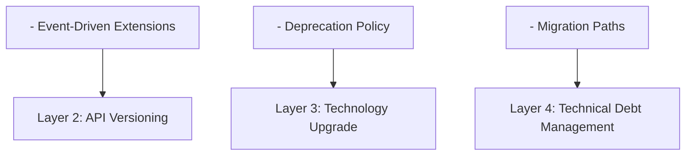
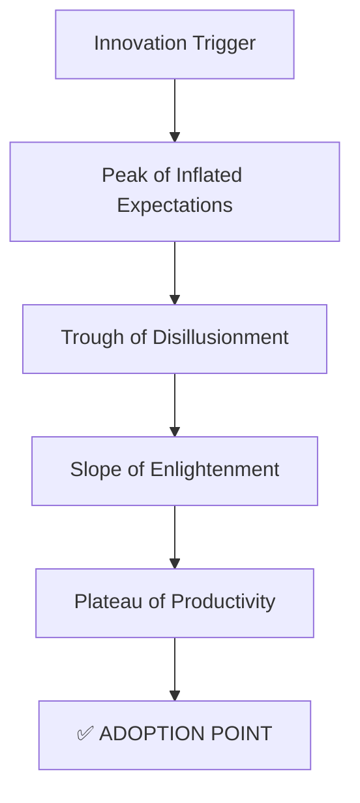
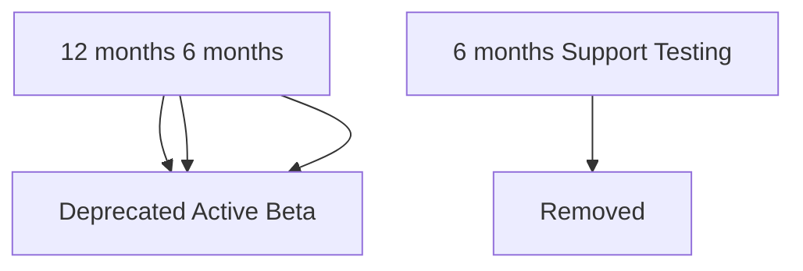

# Evolution Perspective

> **Status**: ✅ Active  
> **Last Updated**: 2025-12-14  
> **Owner**: Architecture Team

## Overview

The Evolution Perspective addresses the system's ability to adapt to changing requirements, technologies, and business needs over time. For an e-commerce platform operating in a rapidly evolving market, the ability to extend functionality, adopt new technologies, and maintain backward compatibility is critical for long-term success.

## Key Concerns

- **Extensibility**: Adding new features without major architectural changes
- **Technology Adoption**: Safely upgrading frameworks and libraries
- **Backward Compatibility**: Supporting existing integrations during evolution
- **Technical Debt Management**: Balancing new development with code quality
- **API Versioning**: Managing API lifecycle and deprecation
- **Migration Strategies**: Safe database and service migrations

## Purpose

The Evolution Perspective addresses the system's ability to adapt to changing requirements, technologies, and business needs over time. For an e-commerce platform operating in a rapidly evolving market, the ability to extend functionality, adopt new technologies, and maintain backward compatibility is critical for long-term success.

## Scope

This perspective ensures the system can:

- **Extend Functionality**: Add new features without major architectural changes
- **Adopt New Technologies**: Upgrade frameworks and libraries safely
- **Maintain Compatibility**: Support existing integrations during evolution
- **Manage Technical Debt**: Balance new development with code quality
- **Scale Complexity**: Handle growing codebase and team size

## Stakeholders

### Primary Stakeholders

| Stakeholder | Concerns | Success Criteria |
|-------------|----------|------------------|
| **Product Management** | Feature velocity, time-to-market | New features delivered in < 2 weeks |
| **Development Team** | Code maintainability, technical debt | Code quality metrics maintained |
| **Architecture Team** | System extensibility, technology evolution | Clean architecture preserved |
| **Business Leadership** | ROI on technology investments | Reduced development costs over time |
| **Operations Team** | Deployment safety, rollback capability | Zero-downtime deployments |

## Evolution Principles

### Core Principles

1. **Open/Closed Principle**: Open for extension, closed for modification
2. **Loose Coupling**: Minimize dependencies between components
3. **High Cohesion**: Keep related functionality together
4. **Interface Stability**: Maintain stable public interfaces
5. **Incremental Change**: Evolve through small, safe steps

### Evolution Strategy



## Extensibility Architecture

### Hexagonal Architecture Benefits

Our hexagonal architecture provides natural extension points:

```text
┌─────────────────────────────────────────────────────────┐
│                    Domain Core                          │
│              (Stable, Rarely Changes)                   │
│                                                         │
│  ┌─────────────────────────────────────────────┐       │
│  │  Business Logic & Domain Models             │       │
│  │  - Aggregates                               │       │
│  │  - Domain Events                            │       │
│  │  - Value Objects                            │       │
│  └─────────────────────────────────────────────┘       │
│                        ↑                                │
│                        │ Ports (Interfaces)             │
│                        │                                │
├────────────────────────┼────────────────────────────────┤
│                        │                                │
│  ┌─────────────────────┴─────────────────────┐         │
│  │         Adapters (Pluggable)              │         │
│  │                                           │         │
│  │  Infrastructure    │    Interfaces        │         │
│  │  - Database        │    - REST API        │         │
│  │  - Cache           │    - GraphQL         │         │
│  │  - Message Queue   │    - gRPC            │         │
│  │  - External APIs   │    - Web UI          │         │
│  └───────────────────────────────────────────┘         │
│                                                         │
│         Easy to Replace or Add New Adapters            │
└─────────────────────────────────────────────────────────┘
```

### Extension Mechanisms

1. **Domain Events**: Add new event handlers without modifying existing code
2. **Strategy Pattern**: Plug in new algorithms (pricing, shipping, payment)
3. **Repository Pattern**: Switch data sources without changing business logic
4. **Dependency Injection**: Configure different implementations at runtime

## Technology Evolution Strategy

### Current Technology Stack

| Layer | Technology | Version | Upgrade Cycle |
|-------|------------|---------|---------------|
| **Backend Framework** | Spring Boot | 3.4.5 | Every 6 months |
| **Language** | Java | 21 | Every 12 months |
| **Build Tool** | Gradle | 8.x | Every 6 months |
| **Database** | PostgreSQL | 15.3 | Every 12 months |
| **Cache** | Redis | 7.x | Every 12 months |
| **Message Queue** | Kafka | 3.x | Every 12 months |
| **Frontend (CMC)** | Next.js | 14 | Every 6 months |
| **Frontend (Consumer)** | Angular | 18 | Every 6 months |
| **Infrastructure** | AWS CDK | 2.x | Every 3 months |

### Technology Maturity Model

We adopt technologies based on maturity:



**Adoption Criteria**:

- Technology reaches "Slope of Enlightenment" or "Plateau of Productivity"
- Active community and commercial support
- Clear migration path from current technology
- Team has or can acquire necessary skills
- ROI justifies adoption cost

## Backward Compatibility Strategy

### API Versioning



### Deprecation Policy

1. **Announcement**: 6 months advance notice
2. **Documentation**: Clear migration guide provided
3. **Warning Headers**: `Deprecation: true` in API responses
4. **Sunset Header**: `Sunset: 2026-04-24T00:00:00Z`
5. **Support**: Bug fixes only during deprecation period
6. **Removal**: After 6 months deprecation period

## Change Management

### Change Categories

| Category | Impact | Approval Required | Testing Required |
|----------|--------|-------------------|------------------|
| **Breaking Change** | High | Architecture review + Leadership | Full regression |
| **Major Feature** | Medium | Product + Architecture review | Integration + E2E |
| **Minor Enhancement** | Low | Team lead approval | Unit + Integration |
| **Bug Fix** | Low | Code review | Unit tests |
| **Refactoring** | Low | Code review | Existing tests pass |

### Feature Flags

```java
@Service
public class OrderService {

    private final FeatureFlagService featureFlags;

    public Order createOrder(CreateOrderCommand command) {
        if (featureFlags.isEnabled("new-pricing-engine")) {
            return createOrderWithNewPricing(command);
        } else {
            return createOrderWithLegacyPricing(command);
        }
    }

    private Order createOrderWithNewPricing(CreateOrderCommand command) {
        // New implementation - can be toggled on/off
        return newPricingEngine.calculateAndCreateOrder(command);
    }

    private Order createOrderWithLegacyPricing(CreateOrderCommand command) {
        // Legacy implementation - fallback
        return legacyPricingEngine.calculateAndCreateOrder(command);
    }
}
```

## Metrics and Monitoring

### Evolution Metrics

| Metric | Target | Current | Trend |
|--------|--------|---------|-------|
| **Code Coverage** | > 80% | 85% | ↗️ |
| **Technical Debt Ratio** | < 5% | 4.2% | ↘️ |
| **Cyclomatic Complexity** | < 10 | 8.5 | → |
| **Dependency Freshness** | < 6 months old | 3 months | ↗️ |
| **API Deprecation Lead Time** | > 6 months | 8 months | ↗️ |
| **Feature Flag Cleanup** | < 30 days after rollout | 25 days | ↗️ |

### Quality Gates

Before merging changes:

- ✅ All tests pass
- ✅ Code coverage maintained or improved
- ✅ No new critical security vulnerabilities
- ✅ Architecture compliance verified (ArchUnit)
- ✅ Performance benchmarks met
- ✅ Documentation updated

## Quality Attribute Scenarios

### Scenario 1: Adding New Payment Method

- **Source**: Product owner
- **Stimulus**: Request to add new payment provider
- **Environment**: Production system with existing payment methods
- **Artifact**: Payment processing module
- **Response**: New payment method added via plugin interface
- **Response Measure**: Implementation time ≤ 2 days, no changes to existing code, 0 regression test failures

### Scenario 2: Framework Version Upgrade

- **Source**: Development team
- **Stimulus**: Spring Boot major version upgrade (e.g., 3.3 to 3.4)
- **Environment**: Production system with existing codebase
- **Artifact**: Application framework and dependencies
- **Response**: Framework upgraded with minimal code changes
- **Response Measure**: Upgrade completed within 1 week, ≤ 5% of codebase modified, 100% test pass rate

### Scenario 3: API Deprecation and Migration

- **Source**: Architecture team
- **Stimulus**: Deprecate API v1 in favor of v2
- **Environment**: Production system with active API consumers
- **Artifact**: REST API endpoints
- **Response**: Graceful deprecation with migration support
- **Response Measure**: 6-month deprecation notice, ≥ 95% of consumers migrated before sunset, 0 service disruptions

## Affected Viewpoints

- [Development Viewpoint](../../viewpoints/development/README.md) - Module organization, dependencies, and build processes
- [Functional Viewpoint](../../viewpoints/functional/README.md) - System capabilities and extension points
- [Deployment Viewpoint](../../viewpoints/deployment/README.md) - Deployment strategies for evolution
- [Information Viewpoint](../../viewpoints/information/README.md) - Data migration and schema evolution

## Related Documentation

### Viewpoints

- [Development Viewpoint](../../viewpoints/development/README.md) - Module organization and dependencies
- [Functional Viewpoint](../../viewpoints/functional/README.md) - System capabilities and extension points

### Other Perspectives

- [Performance & Scalability Perspective](../performance/README.md) - Performance during evolution
- [Security Perspective](../security/README.md) - Security during changes

## Document Structure

This perspective is organized into the following documents:

1. **[Overview](README.md)** (this document) - Purpose, scope, and approach
2. **[Extensibility](extensibility.md)** - Extension points and plugin architecture
3. **[Technology Evolution](technology-evolution.md)** - Framework and library upgrade strategies
4. **[API Versioning](api-versioning.md)** - Versioning, compatibility, and deprecation
5. **[Refactoring](refactoring.md)** - Technical debt management and code quality

## Migration Strategies

### Database Schema Evolution

**Approach**: Expand-Contract Pattern

**Phase 1: Expand** (Add new schema alongside old):
```sql
-- Add new column without removing old one
ALTER TABLE orders ADD COLUMN customer_email VARCHAR(255);

-- Dual-write to both old and new columns
UPDATE orders SET customer_email = (
    SELECT email FROM customers WHERE customers.id = orders.customer_id
);
```

**Phase 2: Migrate** (Update application to use new schema):
```java
// Application reads from new column, falls back to old
public String getCustomerEmail(Order order) {
    if (order.getCustomerEmail() != null) {
        return order.getCustomerEmail();  // New column
    }
    return customerRepository.findById(order.getCustomerId())
        .map(Customer::getEmail)
        .orElse(null);  // Old approach
}
```

**Phase 3: Contract** (Remove old schema after migration):
```sql
-- After all data migrated and application updated
ALTER TABLE orders DROP COLUMN customer_id;
```

### Service Decomposition

**Strangler Fig Pattern**: Gradually replace monolith with microservices

```text
Phase 1: Identify Bounded Context
┌─────────────────────────────┐
│       Monolith              │
│  ┌──────────────────────┐   │
│  │  Order Context       │   │ ← Target for extraction
│  │  (Well-defined)      │   │
│  └──────────────────────┘   │
│  │  Other Contexts      │   │
│  └──────────────────────┘   │
└─────────────────────────────┘

Phase 2: Create Facade
┌─────────────────────────────┐
│       Monolith              │
│  ┌──────────────────────┐   │
│  │  Order Facade        │   │ ← Routes to new or old
│  └──────────────────────┘   │
└─────────────────────────────┘
         │
         ├─→ New Order Service (for new orders)
         └─→ Old Order Code (for existing orders)

Phase 3: Complete Migration
┌─────────────────────────────┐
│    Order Microservice       │ ← Fully independent
└─────────────────────────────┘
```

### Framework Upgrade Process

**Example: Spring Boot 3.3 → 3.4 Upgrade**

**Step 1: Preparation**
```bash
# Check compatibility
./gradlew dependencyUpdates

# Review release notes
# https://github.com/spring-projects/spring-boot/wiki/Spring-Boot-3.4-Release-Notes
```

**Step 2: Update Dependencies**
```gradle
// build.gradle
plugins {
    id 'org.springframework.boot' version '3.4.5'
}

dependencies {
    // Update Spring dependencies
    implementation 'org.springframework.boot:spring-boot-starter-web'
    implementation 'org.springframework.boot:spring-boot-starter-data-jpa'
}
```

**Step 3: Fix Breaking Changes**
```java
// Example: Update deprecated APIs
// Old (Spring Boot 3.3)
@Bean
public SecurityFilterChain filterChain(HttpSecurity http) {
    http.authorizeRequests()
        .antMatchers("/api/**").authenticated();
    return http.build();
}

// New (Spring Boot 3.4)
@Bean
public SecurityFilterChain filterChain(HttpSecurity http) {
    http.authorizeHttpRequests(auth -> auth
        .requestMatchers("/api/**").authenticated());
    return http.build();
}
```

**Step 4: Test Thoroughly**
```bash
# Run all tests
./gradlew test

# Run integration tests
./gradlew integrationTest

# Performance benchmarks
./gradlew performanceTest
```

**Step 5: Gradual Rollout**
```yaml
# Deploy to staging first
kubectl apply -f k8s/overlays/staging/

# Canary deployment to production (10% traffic)
kubectl apply -f k8s/overlays/production/canary/

# Full production rollout
kubectl apply -f k8s/overlays/production/
```

## Continuous Improvement

### Regular Activities

**Weekly**:
- Code quality metrics review
- Dependency vulnerability scan
- Feature flag cleanup review
- Technical debt tracking

**Monthly**:
- Dependency update review and planning
- Architecture decision records (ADR) review
- Refactoring backlog grooming
- Code quality trend analysis

**Quarterly**:
- Architecture review and refactoring sprint
- Major dependency upgrades
- Technical debt reduction sprint
- Team retrospective on evolution practices

**Bi-annually**:
- Technology stack evaluation
- Framework upgrade planning
- Architecture fitness function review
- Third-party library audit

**Annually**:
- Major framework upgrades (Spring Boot, Angular, etc.)
- Programming language version upgrade (Java)
- Infrastructure platform updates (AWS, Kubernetes)
- Comprehensive architecture review

### Innovation Time

**20% Time**:
- Developers can spend 20% time on technical improvements
- Focus on reducing technical debt
- Experiment with new technologies
- Improve developer tooling

**Hackathons**:
- Quarterly hackathons for innovation
- Cross-team collaboration
- Prototype new features or technologies
- Present results to leadership

**Tech Talks**:
- Monthly tech talks on new technologies
- Internal knowledge sharing
- External speaker sessions
- Conference attendance and sharing

**Proof of Concepts**:
- Evaluate new technologies through POCs
- Time-boxed experiments (1-2 weeks)
- Document findings and recommendations
- Present to architecture team

### Technical Debt Management

**Debt Classification**:

| Type | Priority | Action |
|------|----------|--------|
| **Critical Debt** | P0 | Fix immediately (blocks new features) |
| **High Debt** | P1 | Address in next sprint |
| **Medium Debt** | P2 | Schedule in quarterly refactoring sprint |
| **Low Debt** | P3 | Address during 20% time |

**Debt Tracking**:
```yaml
Technical Debt Item:
  ID: TD-2024-001
  Title: "Replace legacy pricing engine"
  Type: Code Quality
  Priority: P1
  Estimated Effort: 3 weeks
  Business Impact: Blocks new pricing features
  Created: 2024-10-01
  Target Resolution: 2024-12-01
  Owner: Pricing Team
```

**Debt Reduction Goals**:
- Reduce technical debt ratio by 1% per quarter
- No new critical debt introduced
- All P0/P1 debt resolved within 2 sprints
- Quarterly refactoring sprint dedicated to debt reduction

---

**Next Steps**:
- Review [Extensibility](extensibility.md) for detailed extension mechanisms and plugin architecture
- See [Technology Evolution](technology-evolution.md) for framework upgrade strategies
- Consult [API Versioning](api-versioning.md) for versioning and deprecation policies
