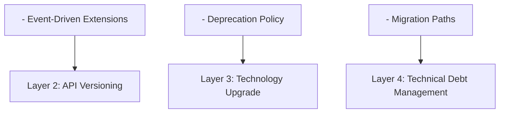
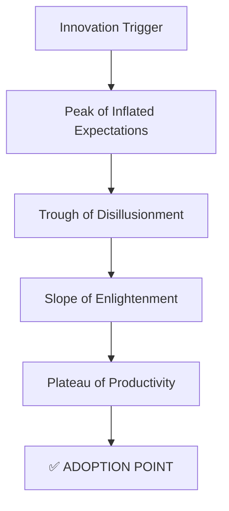
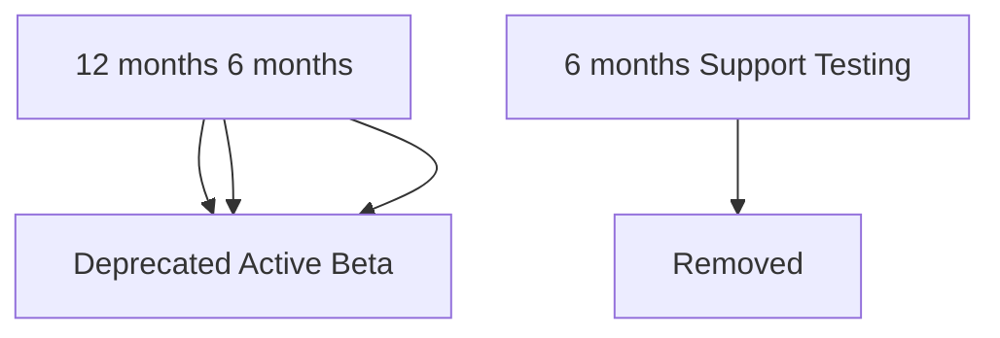

# Evolution Perspective

> **Last Updated**: 2025-10-24  
> **Status**: Active  
> **Owner**: Architecture & Development Team

## Purpose

The Evolution Perspective addresses the system's ability to adapt to changing requirements, technologies, and business needs over time. For an e-commerce platform operating in a rapidly evolving market, the ability to extend functionality, adopt new technologies, and maintain backward compatibility is critical for long-term success.

## Scope

This perspective ensures the system can:

- **Extend Functionality**: Add new features without major architectural changes
- **Adopt New Technologies**: Upgrade frameworks and libraries safely
- **Maintain Compatibility**: Support existing integrations during evolution
- **Manage Technical Debt**: Balance new development with code quality
- **Scale Complexity**: Handle growing codebase and team size

## Stakeholders

### Primary Stakeholders

| Stakeholder | Concerns | Success Criteria |
|-------------|----------|------------------|
| **Product Management** | Feature velocity, time-to-market | New features delivered in < 2 weeks |
| **Development Team** | Code maintainability, technical debt | Code quality metrics maintained |
| **Architecture Team** | System extensibility, technology evolution | Clean architecture preserved |
| **Business Leadership** | ROI on technology investments | Reduced development costs over time |
| **Operations Team** | Deployment safety, rollback capability | Zero-downtime deployments |

## Evolution Principles

### Core Principles

1. **Open/Closed Principle**: Open for extension, closed for modification
2. **Loose Coupling**: Minimize dependencies between components
3. **High Cohesion**: Keep related functionality together
4. **Interface Stability**: Maintain stable public interfaces
5. **Incremental Change**: Evolve through small, safe steps

### Evolution Strategy



## Extensibility Architecture

### Hexagonal Architecture Benefits

Our hexagonal architecture provides natural extension points:

```text
┌─────────────────────────────────────────────────────────┐
│                    Domain Core                          │
│              (Stable, Rarely Changes)                   │
│                                                         │
│  ┌─────────────────────────────────────────────┐       │
│  │  Business Logic & Domain Models             │       │
│  │  - Aggregates                               │       │
│  │  - Domain Events                            │       │
│  │  - Value Objects                            │       │
│  └─────────────────────────────────────────────┘       │
│                        ↑                                │
│                        │ Ports (Interfaces)             │
│                        │                                │
├────────────────────────┼────────────────────────────────┤
│                        │                                │
│  ┌─────────────────────┴─────────────────────┐         │
│  │         Adapters (Pluggable)              │         │
│  │                                           │         │
│  │  Infrastructure    │    Interfaces        │         │
│  │  - Database        │    - REST API        │         │
│  │  - Cache           │    - GraphQL         │         │
│  │  - Message Queue   │    - gRPC            │         │
│  │  - External APIs   │    - Web UI          │         │
│  └───────────────────────────────────────────┘         │
│                                                         │
│         Easy to Replace or Add New Adapters            │
└─────────────────────────────────────────────────────────┘
```

### Extension Mechanisms

1. **Domain Events**: Add new event handlers without modifying existing code
2. **Strategy Pattern**: Plug in new algorithms (pricing, shipping, payment)
3. **Repository Pattern**: Switch data sources without changing business logic
4. **Dependency Injection**: Configure different implementations at runtime

## Technology Evolution Strategy

### Current Technology Stack

| Layer | Technology | Version | Upgrade Cycle |
|-------|------------|---------|---------------|
| **Backend Framework** | Spring Boot | 3.4.5 | Every 6 months |
| **Language** | Java | 21 | Every 12 months |
| **Build Tool** | Gradle | 8.x | Every 6 months |
| **Database** | PostgreSQL | 15.3 | Every 12 months |
| **Cache** | Redis | 7.x | Every 12 months |
| **Message Queue** | Kafka | 3.x | Every 12 months |
| **Frontend (CMC)** | Next.js | 14 | Every 6 months |
| **Frontend (Consumer)** | Angular | 18 | Every 6 months |
| **Infrastructure** | AWS CDK | 2.x | Every 3 months |

### Technology Maturity Model

We adopt technologies based on maturity:



**Adoption Criteria**:

- Technology reaches "Slope of Enlightenment" or "Plateau of Productivity"
- Active community and commercial support
- Clear migration path from current technology
- Team has or can acquire necessary skills
- ROI justifies adoption cost

## Backward Compatibility Strategy

### API Versioning



### Deprecation Policy

1. **Announcement**: 6 months advance notice
2. **Documentation**: Clear migration guide provided
3. **Warning Headers**: `Deprecation: true` in API responses
4. **Sunset Header**: `Sunset: 2026-04-24T00:00:00Z`
5. **Support**: Bug fixes only during deprecation period
6. **Removal**: After 6 months deprecation period

## Change Management

### Change Categories

| Category | Impact | Approval Required | Testing Required |
|----------|--------|-------------------|------------------|
| **Breaking Change** | High | Architecture review + Leadership | Full regression |
| **Major Feature** | Medium | Product + Architecture review | Integration + E2E |
| **Minor Enhancement** | Low | Team lead approval | Unit + Integration |
| **Bug Fix** | Low | Code review | Unit tests |
| **Refactoring** | Low | Code review | Existing tests pass |

### Feature Flags

```java
@Service
public class OrderService {
    
    private final FeatureFlagService featureFlags;
    
    public Order createOrder(CreateOrderCommand command) {
        if (featureFlags.isEnabled("new-pricing-engine")) {
            return createOrderWithNewPricing(command);
        } else {
            return createOrderWithLegacyPricing(command);
        }
    }
    
    private Order createOrderWithNewPricing(CreateOrderCommand command) {
        // New implementation - can be toggled on/off
        return newPricingEngine.calculateAndCreateOrder(command);
    }
    
    private Order createOrderWithLegacyPricing(CreateOrderCommand command) {
        // Legacy implementation - fallback
        return legacyPricingEngine.calculateAndCreateOrder(command);
    }
}
```

## Metrics and Monitoring

### Evolution Metrics

| Metric | Target | Current | Trend |
|--------|--------|---------|-------|
| **Code Coverage** | > 80% | 85% | ↗️ |
| **Technical Debt Ratio** | < 5% | 4.2% | ↘️ |
| **Cyclomatic Complexity** | < 10 | 8.5 | → |
| **Dependency Freshness** | < 6 months old | 3 months | ↗️ |
| **API Deprecation Lead Time** | > 6 months | 8 months | ↗️ |
| **Feature Flag Cleanup** | < 30 days after rollout | 25 days | ↗️ |

### Quality Gates

Before merging changes:

- ✅ All tests pass
- ✅ Code coverage maintained or improved
- ✅ No new critical security vulnerabilities
- ✅ Architecture compliance verified (ArchUnit)
- ✅ Performance benchmarks met
- ✅ Documentation updated

## Related Documentation

### Viewpoints

- [Development Viewpoint](../../viewpoints/development/overview.md) - Module organization and dependencies
- [Functional Viewpoint](../../viewpoints/functional/overview.md) - System capabilities and extension points

### Other Perspectives

- [Performance & Scalability Perspective](../performance/overview.md) - Performance during evolution
- [Security Perspective](../security/overview.md) - Security during changes

### Implementation Guides

- [Extensibility Points](extensibility.md) - Plugin architecture and extension mechanisms
- [Technology Evolution](technology-evolution.md) - Framework upgrade strategies
- [API Versioning](api-versioning.md) - Versioning and deprecation policies
- [Refactoring Strategy](refactoring.md) - Technical debt management

## Document Structure

This perspective is organized into the following documents:

1. **[Overview](overview.md)** (this document) - Purpose, scope, and approach
2. **[Extensibility](extensibility.md)** - Extension points and plugin architecture
3. **[Technology Evolution](technology-evolution.md)** - Framework and library upgrade strategies
4. **[API Versioning](api-versioning.md)** - Versioning, compatibility, and deprecation
5. **[Refactoring](refactoring.md)** - Technical debt management and code quality

## Continuous Improvement

### Regular Activities

- **Weekly**: Code quality metrics review
- **Monthly**: Dependency update review
- **Quarterly**: Architecture review and refactoring sprint
- **Bi-annually**: Technology stack evaluation
- **Annually**: Major framework upgrades

### Innovation Time

- **20% Time**: Developers can spend 20% time on technical improvements
- **Hackathons**: Quarterly hackathons for innovation
- **Tech Talks**: Monthly tech talks on new technologies
- **Proof of Concepts**: Evaluate new technologies through POCs

---

**Next Steps**: Review [Extensibility](extensibility.md) for detailed extension mechanisms and plugin architecture.
