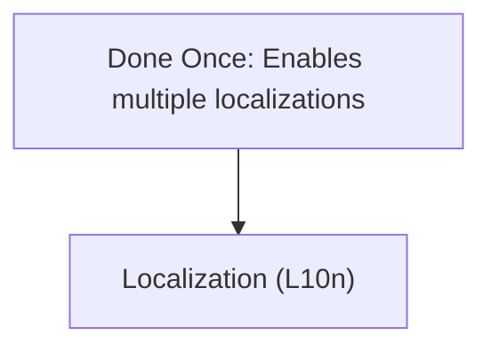
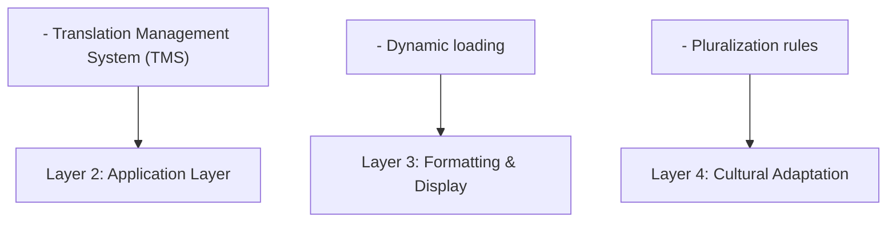
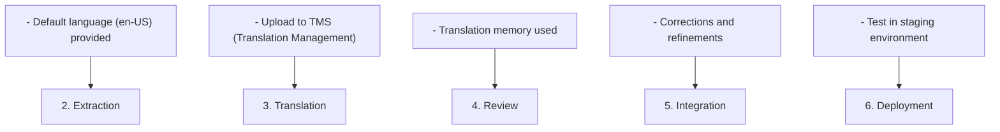

# Internationalization Perspective

> **Last Updated**: 2025-10-24
> **Status**: Active
> **Owner**: Product & Engineering Team

## Purpose

The Internationalization (i18n) Perspective addresses the system's ability to support multiple languages, locales, and cultural contexts. For an e-commerce platform with global ambitions, proper internationalization is essential for market expansion, user experience, and competitive advantage.

## Scope

This perspective ensures the system can:

- **Support Multiple Languages**: Display content in user's preferred language
- **Handle Locale-Specific Formatting**: Dates, times, numbers, currencies
- **Adapt to Cultural Contexts**: Content, imagery, payment methods
- **Scale Internationally**: Add new languages and regions efficiently
- **Maintain Consistency**: Unified experience across all locales

## Stakeholders

### Primary Stakeholders

| Stakeholder | Concerns | Success Criteria |
|-------------|----------|------------------|
| **Business Leadership** | Market expansion, revenue growth | Successful launches in target markets |
| **Product Management** | Feature parity across locales | Consistent user experience |
| **Marketing Team** | Localized content, campaigns | Effective local marketing |
| **Development Team** | i18n implementation, maintenance | Efficient translation workflow |
| **Customers** | Native language support | Seamless localized experience |
| **Translators** | Translation workflow, context | Accurate, contextual translations |

## Internationalization Principles

### Core Principles

1. **Separation of Concerns**: Separate translatable content from code
2. **Unicode Support**: Use UTF-8 encoding throughout the system
3. **Locale-Aware**: Respect user's locale preferences
4. **Culturally Appropriate**: Adapt to local customs and preferences
5. **Scalable**: Easy to add new languages and regions

### i18n vs L10n



## Supported Languages and Regions

### Current Support (Phase 1)

| Language | Region | Locale Code | Status | Launch Date |
|----------|--------|-------------|--------|-------------|
| **English** | United States | en-US | ✅ Active | 2024-01-01 |
| **Traditional Chinese** | Taiwan | zh-TW | ✅ Active | 2024-06-01 |
| **Simplified Chinese** | China | zh-CN | 🚧 In Progress | 2025-Q2 |

### Planned Support (Phase 2)

| Language | Region | Locale Code | Priority | Target Date |
|----------|--------|-------------|----------|-------------|
| **Japanese** | Japan | ja-JP | High | 2025-Q3 |
| **Korean** | South Korea | ko-KR | High | 2025-Q4 |
| **Spanish** | Spain | es-ES | Medium | 2026-Q1 |
| **Spanish** | Latin America | es-MX | Medium | 2026-Q2 |
| **French** | France | fr-FR | Medium | 2026-Q3 |
| **German** | Germany | de-DE | Low | 2026-Q4 |

### Language Selection Criteria

- **Market Size**: Population and e-commerce market size
- **Business Opportunity**: Revenue potential and competition
- **Strategic Importance**: Long-term business goals
- **Resource Availability**: Translation and localization resources
- **Technical Complexity**: RTL support, character sets, etc.

## Internationalization Architecture

### Multi-Layer i18n Strategy



## Language Support Implementation

### Backend i18n (Spring Boot)

**Message Source Configuration**:

```java
@Configuration
public class I18nConfiguration {

    @Bean
    public MessageSource messageSource() {
        ResourceBundleMessageSource messageSource = new ResourceBundleMessageSource();
        messageSource.setBasename("i18n/messages");
        messageSource.setDefaultEncoding("UTF-8");
        messageSource.setFallbackToSystemLocale(false);
        messageSource.setCacheSeconds(3600);
        return messageSource;
    }

    @Bean
    public LocaleResolver localeResolver() {
        AcceptHeaderLocaleResolver localeResolver = new AcceptHeaderLocaleResolver();
        localeResolver.setDefaultLocale(Locale.US);
        localeResolver.setSupportedLocales(Arrays.asList(
            Locale.US,
            Locale.TRADITIONAL_CHINESE,
            Locale.SIMPLIFIED_CHINESE,
            Locale.JAPAN,
            Locale.KOREA
        ));
        return localeResolver;
    }
}
```

**Message Files Structure**:

```text
src/main/resources/i18n/
├── messages.properties           # Default (English)
├── messages_en_US.properties     # English (US)
├── messages_zh_TW.properties     # Traditional Chinese (Taiwan)
├── messages_zh_CN.properties     # Simplified Chinese (China)
├── messages_ja_JP.properties     # Japanese (Japan)
└── messages_ko_KR.properties     # Korean (South Korea)
```

**Usage Example**:

```java
@Service
public class OrderService {

    private final MessageSource messageSource;

    public String getOrderConfirmationMessage(Order order, Locale locale) {
        return messageSource.getMessage(
            "order.confirmation",
            new Object[]{order.getId(), order.getTotalAmount()},
            locale
        );
    }
}
```

### Frontend i18n (React with i18next)

**Configuration**:

```typescript
import i18n from 'i18next';
import { initReactI18next } from 'react-i18next';
import Backend from 'i18next-http-backend';
import LanguageDetector from 'i18next-browser-languagedetector';

i18n
  .use(Backend)
  .use(LanguageDetector)
  .use(initReactI18next)
  .init({
    fallbackLng: 'en-US',
    supportedLngs: ['en-US', 'zh-TW', 'zh-CN', 'ja-JP', 'ko-KR'],
    debug: false,
    interpolation: {
      escapeValue: false,
    },
    backend: {
      loadPath: '/locales/{{lng}}/{{ns}}.json',
    },
  });

export default i18n;
```

**Translation Files Structure**:

```text
public/locales/
├── en-US/
│   ├── common.json
│   ├── product.json
│   ├── checkout.json
│   └── account.json
├── zh-TW/
│   ├── common.json
│   ├── product.json
│   ├── checkout.json
│   └── account.json
└── zh-CN/
    ├── common.json
    ├── product.json
    ├── checkout.json
    └── account.json
```

**Usage Example**:

```typescript
import { useTranslation } from 'react-i18next';

function ProductCard({ product }) {
  const { t } = useTranslation('product');

  return (
    <div>
      <h2>{product.name}</h2>
      <p>{t('price', { amount: product.price })}</p>
      <button>{t('addToCart')}</button>
    </div>
  );
}
```

### Frontend i18n (Angular)

**Configuration**:

```typescript
import { LOCALE_ID, NgModule } from '@angular/core';
import { registerLocaleData } from '@angular/common';
import localeEnUS from '@angular/common/locales/en';
import localeZhTW from '@angular/common/locales/zh-Hant';
import localeZhCN from '@angular/common/locales/zh';

registerLocaleData(localeEnUS, 'en-US');
registerLocaleData(localeZhTW, 'zh-TW');
registerLocaleData(localeZhCN, 'zh-CN');

@NgModule({
  providers: [
    {
      provide: LOCALE_ID,
      useFactory: () => {
        return localStorage.getItem('locale') || 'en-US';
      }
    }
  ]
})
export class AppModule { }
```

## Locale-Specific Formatting

### Date and Time Formatting

| Locale | Date Format | Time Format | Example |
|--------|-------------|-------------|---------|
| **en-US** | MM/DD/YYYY | 12-hour (AM/PM) | 10/24/2025 2:30 PM |
| **zh-TW** | YYYY/MM/DD | 24-hour | 2025/10/24 14:30 |
| **zh-CN** | YYYY年MM月DD日 | 24-hour | 2025年10月24日 14:30 |
| **ja-JP** | YYYY年MM月DD日 | 24-hour | 2025年10月24日 14:30 |
| **ko-KR** | YYYY.MM.DD | 12-hour (오전/오후) | 2025.10.24 오후 2:30 |

**Implementation**:

```typescript
// Using Intl.DateTimeFormat
const formatDate = (date: Date, locale: string) => {
  return new Intl.DateTimeFormat(locale, {
    year: 'numeric',
    month: 'long',
    day: 'numeric',
    hour: '2-digit',
    minute: '2-digit'
  }).format(date);
};

// Examples
formatDate(new Date(), 'en-US');  // October 24, 2025, 02:30 PM
formatDate(new Date(), 'zh-TW');  // 2025年10月24日 下午2:30
formatDate(new Date(), 'ja-JP');  // 2025年10月24日 14:30
```

### Number and Currency Formatting

| Locale | Number Format | Currency | Currency Format |
|--------|---------------|----------|-----------------|
| **en-US** | 1,234.56 | USD ($) | $1,234.56 |
| **zh-TW** | 1,234.56 | TWD (NT$) | NT$1,234.56 |
| **zh-CN** | 1,234.56 | CNY (¥) | ¥1,234.56 |
| **ja-JP** | 1,234.56 | JPY (¥) | ¥1,235 |
| **ko-KR** | 1,234.56 | KRW (₩) | ₩1,235 |

**Implementation**:

```typescript
// Using Intl.NumberFormat
const formatCurrency = (amount: number, locale: string, currency: string) => {
  return new Intl.NumberFormat(locale, {
    style: 'currency',
    currency: currency
  }).format(amount);
};

// Examples
formatCurrency(1234.56, 'en-US', 'USD');  // $1,234.56
formatCurrency(1234.56, 'zh-TW', 'TWD');  // NT$1,234.56
formatCurrency(1234.56, 'ja-JP', 'JPY');  // ¥1,235
```

## Translation Workflow

### Translation Process



### Translation Management System (TMS)

**Recommended Tools**:

- **Crowdin**: Cloud-based TMS with GitHub integration
- **Lokalise**: Developer-friendly TMS with API
- **Phrase**: Enterprise TMS with advanced features

**Key Features Needed**:

- GitHub/GitLab integration
- Translation memory
- Context and screenshots
- Glossary management
- Collaboration tools
- Quality checks
- API access

## Cultural Adaptation

### Payment Methods by Region

| Region | Primary Payment Methods | Notes |
|--------|------------------------|-------|
| **US** | Credit Card, PayPal, Apple Pay | Credit cards dominant |
| **Taiwan** | Credit Card, ATM Transfer, CVS Payment | Convenience store payment popular |
| **China** | Alipay, WeChat Pay, UnionPay | Mobile payments dominant |
| **Japan** | Credit Card, Konbini, Bank Transfer | Convenience store payment common |
| **Korea** | Credit Card, Naver Pay, Kakao Pay | Local payment platforms |

### Shipping and Logistics

| Region | Carriers | Delivery Options | Notes |
|--------|----------|------------------|-------|
| **US** | USPS, FedEx, UPS | Standard, Express, Same-day | Address validation important |
| **Taiwan** | 7-11, FamilyMart, Hi-Life | Store pickup, Home delivery | CVS pickup very popular |
| **China** | SF Express, JD Logistics | Standard, Express | Real-name verification required |
| **Japan** | Yamato, Sagawa, Japan Post | Standard, Time-slot delivery | Precise delivery times |
| **Korea** | CJ Logistics, Hanjin | Standard, Express | Apartment complex delivery |

### Legal and Compliance

| Region | Key Requirements | Implementation |
|--------|------------------|----------------|
| **US** | ADA, CCPA | Accessibility, Privacy policy |
| **Taiwan** | Personal Data Protection Act | Data protection, Cookie consent |
| **China** | Cybersecurity Law, ICP License | Data localization, Content filtering |
| **Japan** | Act on Protection of Personal Information | Privacy policy, Data handling |
| **Korea** | Personal Information Protection Act | Strong data protection |

## Content Strategy

### Content Types

1. **Static Content**: UI labels, buttons, navigation
2. **Dynamic Content**: Product descriptions, blog posts
3. **User-Generated Content**: Reviews, comments
4. **Marketing Content**: Campaigns, promotions
5. **Legal Content**: Terms, privacy policy

### Translation Priority

| Priority | Content Type | Translation Method | Update Frequency |
|----------|--------------|-------------------|------------------|
| **Critical** | UI strings, Checkout flow | Professional translation | Every release |
| **High** | Product categories, Help docs | Professional translation | Monthly |
| **Medium** | Product descriptions | Machine + Review | Weekly |
| **Low** | Blog posts, News | Machine translation | As needed |

## Metrics and Monitoring

### i18n Metrics

| Metric | Target | Current | Trend |
|--------|--------|---------|-------|
| **Translation Coverage** | 100% | 95% | ↗️ |
| **Translation Quality Score** | > 4.5/5.0 | 4.3 | ↗️ |
| **Time to Translate** | < 5 days | 7 days | ↘️ |
| **Locale-Specific Conversion Rate** | Varies | Tracking | - |
| **User Language Preference Match** | > 95% | 92% | ↗️ |

### Quality Assurance

- **Linguistic QA**: Native speaker review
- **Functional QA**: Test in each locale
- **Visual QA**: Check layout and formatting
- **Cultural QA**: Verify cultural appropriateness

## Related Documentation

### Viewpoints

- [Functional Viewpoint](../../viewpoints/functional/overview.md) - Localized features
- [Development Viewpoint](../../viewpoints/development/overview.md) - i18n implementation

### Other Perspectives

- [Accessibility Perspective](../accessibility/README.md) - Accessible in all languages
- [Location Perspective](../location/overview.md) - Geographic distribution

### Implementation Guides

- [Language Support](language-support.md) - Supported languages and implementation
- [Localization Strategy](localization.md) - Content localization approach
- [Cultural Adaptation](cultural-adaptation.md) - Region-specific customization

## Document Structure

This perspective is organized into the following documents:

1. **[Overview](overview.md)** (this document) - Purpose, scope, and approach
2. **[Language Support](language-support.md)** - Supported languages and translation workflow
3. **[Localization Strategy](localization.md)** - Content localization and formatting
4. **[Cultural Adaptation](cultural-adaptation.md)** - Region-specific customization

## Continuous Improvement

### Regular Activities

- **Weekly**: Review new strings for translation
- **Monthly**: Translation quality review
- **Quarterly**: Add new language support
- **Bi-annually**: Cultural adaptation review
- **Annually**: i18n strategy review

### Expansion Strategy

**Phase 1 (2024-2025)**: English, Traditional Chinese, Simplified Chinese
**Phase 2 (2025-2026)**: Japanese, Korean, Spanish
**Phase 3 (2026+)**: French, German, additional languages

---

**Next Steps**: Review [Language Support](language-support.md) for detailed implementation of multi-language support.
