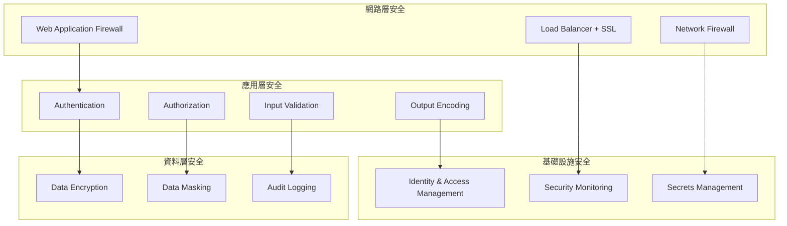

# 安全性觀點跨視點應用

## 概覽

安全性觀點是一個橫切關注點，影響系統架構的所有視點。本文件詳細說明安全性考量如何在各個架構視點中體現和實現。

## 跨視點安全性應用

### 功能視點中的安全性考量

#### 1. 業務邏輯安全

```java
@AggregateRoot
public class Customer {
    
    // 敏感操作需要安全上下文驗證
    public void updateSensitiveInformation(
            CustomerName newName, 
            Email newEmail, 
            SecurityContext securityContext) {
        
        // 安全檢查：只有客戶本人或管理員可以修改
        if (!securityContext.isOwnerOrAdmin(this.id)) {
            throw new UnauthorizedOperationException("無權限修改客戶資訊");
        }
        
        // 記錄安全審計事件
        collectEvent(CustomerSensitiveDataAccessedEvent.create(
            this.id, 
            securityContext.getUserId(), 
            "UPDATE_PROFILE"
        ));
        
        // 執行業務邏輯
        this.name = newName;
        this.email = newEmail;
    }
    
    // 資料存取控制
    public CustomerSummary getSummary(SecurityContext securityContext) {
        if (securityContext.isOwner(this.id) || securityContext.hasRole("ADMIN")) {
            return CustomerSummary.full(this);
        } else if (securityContext.hasRole("CUSTOMER_SERVICE")) {
            return CustomerSummary.limited(this);
        } else {
            throw new UnauthorizedAccessException("無權限查看客戶資訊");
        }
    }
}
```

#### 2. 領域服務安全

```java
@DomainService
public class PaymentProcessingService {
    
    @PreAuthorize("hasRole('PAYMENT_PROCESSOR') or hasRole('ADMIN')")
    public PaymentResult processPayment(ProcessPaymentCommand command, SecurityContext context) {
        // 多重安全驗證
        validatePaymentPermissions(command, context);
        validatePaymentLimits(command, context);
        
        // 敏感操作審計
        auditService.logSensitiveOperation(
            "PAYMENT_PROCESSING", 
            command, 
            context.getUserId()
        );
        
        return executePaymentProcessing(command);
    }
    
    private void validatePaymentPermissions(ProcessPaymentCommand command, SecurityContext context) {
        // 檢查使用者是否有權限處理此支付
        if (!context.canProcessPaymentForCustomer(command.getCustomerId())) {
            throw new InsufficientPermissionException("無權限處理此客戶的支付");
        }
        
        // 檢查支付金額限制
        Money userLimit = context.getPaymentLimit();
        if (command.getAmount().isGreaterThan(userLimit)) {
            throw new PaymentLimitExceededException("支付金額超過使用者限制");
        }
    }
}
```

#### 3. 應用服務安全

```java
@Service
@Transactional
public class CustomerApplicationService {
    
    @PreAuthorize("hasRole('CUSTOMER_MANAGER') or #command.customerId == authentication.principal.customerId")
    public Customer updateCustomerProfile(UpdateProfileCommand command) {
        // 載入聚合根
        Customer customer = customerRepository.findById(command.getCustomerId())
            .orElseThrow(() -> new CustomerNotFoundException(command.getCustomerId()));
        
        // 獲取安全上下文
        SecurityContext securityContext = SecurityContextHolder.getContext();
        
        // 執行安全的業務操作
        customer.updateSensitiveInformation(
            command.getName(), 
            command.getEmail(), 
            securityContext
        );
        
        // 保存變更
        Customer updatedCustomer = customerRepository.save(customer);
        
        // 發布事件（包含安全資訊）
        domainEventService.publishEventsFromAggregate(updatedCustomer);
        
        return updatedCustomer;
    }
}
```

### 資訊視點中的安全性考量

#### 1. 資料加密

```java
// 敏感資料加密存儲
@Entity
@Table(name = "customers")
public class CustomerEntity {
    
    @Id
    private String id;
    
    private String name;
    
    // 電子郵件加密存儲
    @Convert(converter = EncryptedStringConverter.class)
    @Column(name = "email_encrypted")
    private String email;
    
    // 電話號碼加密存儲
    @Convert(converter = EncryptedStringConverter.class)
    @Column(name = "phone_encrypted")
    private String phoneNumber;
    
    // 密碼雜湊存儲
    @Column(name = "password_hash")
    private String passwordHash;
    
    // 敏感資料存取記錄
    @OneToMany(mappedBy = "customer", cascade = CascadeType.ALL)
    private List<DataAccessLogEntity> accessLogs = new ArrayList<>();
}

@Converter
public class EncryptedStringConverter implements AttributeConverter<String, String> {
    
    private final AESEncryptionService encryptionService;
    
    @Override
    public String convertToDatabaseColumn(String attribute) {
        if (attribute == null) return null;
        return encryptionService.encrypt(attribute);
    }
    
    @Override
    public String convertToEntityAttribute(String dbData) {
        if (dbData == null) return null;
        return encryptionService.decrypt(dbData);
    }
}
```

#### 2. 領域事件安全

```java
public record CustomerSensitiveDataAccessedEvent(
    CustomerId customerId,
    String accessedBy,
    String operation,
    String dataFields,
    String ipAddress,
    String userAgent,
    UUID eventId,
    LocalDateTime occurredOn
) implements DomainEvent, SensitiveEvent {
    
    @Override
    public SecurityClassification getSecurityClassification() {
        return SecurityClassification.CONFIDENTIAL;
    }
    
    @Override
    public boolean requiresEncryption() {
        return true;
    }
    
    @Override
    public Set<String> getAuthorizedRoles() {
        return Set.of("SECURITY_OFFICER", "AUDIT_MANAGER", "ADMIN");
    }
}

@Component
public class SecureEventPublisher {
    
    public void publishSecureEvent(DomainEvent event) {
        if (event instanceof SensitiveEvent sensitiveEvent) {
            // 加密敏感事件
            EncryptedEvent encryptedEvent = encryptionService.encrypt(sensitiveEvent);
            
            // 記錄安全審計
            auditService.logSensitiveEventPublication(
                event.getEventType(),
                event.getAggregateId(),
                getCurrentUserId()
            );
            
            eventBus.publish(encryptedEvent);
        } else {
            eventBus.publish(event);
        }
    }
}
```

#### 3. 資料存取控制

```java
@Repository
public class SecureCustomerRepository implements CustomerRepository {
    
    private final CustomerJpaRepository jpaRepository;
    private final DataAccessAuditor auditor;
    
    @Override
    @PostFilter("hasPermission(filterObject, 'READ')")
    public List<Customer> findBySegment(CustomerSegment segment) {
        // 記錄資料存取
        auditor.logDataAccess(
            "Customer", 
            "findBySegment", 
            Map.of("segment", segment.name())
        );
        
        return jpaRepository.findBySegment(segment)
            .stream()
            .map(this::maskSensitiveData)
            .collect(Collectors.toList());
    }
    
    @Override
    @PreAuthorize("hasPermission(#customerId, 'Customer', 'READ')")
    public Optional<Customer> findById(CustomerId customerId) {
        // 記錄個別客戶資料存取
        auditor.logSensitiveDataAccess(
            "Customer", 
            customerId.value(), 
            "READ"
        );
        
        return jpaRepository.findById(customerId.value())
            .map(this::applyDataMasking);
    }
    
    private Customer applyDataMasking(CustomerEntity entity) {
        SecurityContext context = SecurityContextHolder.getContext();
        
        if (context.hasRole("ADMIN") || context.isOwner(entity.getId())) {
            return mapper.toDomain(entity); // 完整資料
        } else if (context.hasRole("CUSTOMER_SERVICE")) {
            return mapper.toDomainWithMasking(entity); // 部分遮罩
        } else {
            return mapper.toDomainMinimal(entity); // 最小資料
        }
    }
}
```

### 並發視點中的安全性考量

#### 1. 安全的非同步處理

```java
@Component
public class SecureAsyncEventProcessor {
    
    @Async("secureTaskExecutor")
    @PreAuthorize("hasRole('EVENT_PROCESSOR')")
    public CompletableFuture<Void> processSecureEvent(SensitiveEvent event) {
        return CompletableFuture.runAsync(() -> {
            try {
                // 設定安全上下文
                SecurityContext originalContext = SecurityContextHolder.getContext();
                SecurityContext eventContext = createEventProcessingContext(event);
                SecurityContextHolder.setContext(eventContext);
                
                // 處理事件
                processEvent(event);
                
                // 記錄處理成功
                auditService.logEventProcessingSuccess(event.getEventId());
                
            } catch (Exception e) {
                // 記錄處理失敗
                auditService.logEventProcessingFailure(event.getEventId(), e);
                throw e;
            } finally {
                // 清理安全上下文
                SecurityContextHolder.clearContext();
            }
        }, secureExecutor);
    }
}

@Configuration
@EnableAsync
public class SecureAsyncConfiguration {
    
    @Bean(name = "secureTaskExecutor")
    public TaskExecutor secureTaskExecutor() {
        ThreadPoolTaskExecutor executor = new ThreadPoolTaskExecutor();
        executor.setCorePoolSize(5);
        executor.setMaxPoolSize(10);
        executor.setQueueCapacity(25);
        executor.setThreadNamePrefix("secure-async-");
        
        // 設定安全的任務裝飾器
        executor.setTaskDecorator(new SecurityContextPropagatingTaskDecorator());
        
        executor.initialize();
        return executor;
    }
}
```

#### 2. 交易安全

```java
@Service
@Transactional
public class SecureTransactionService {
    
    public void executeSecureTransaction(SecureTransactionCommand command) {
        // 交易前安全檢查
        validateTransactionSecurity(command);
        
        try {
            // 開始安全交易
            TransactionSecurity.beginSecureTransaction(command.getSecurityContext());
            
            // 執行業務邏輯
            executeBusinessLogic(command);
            
            // 記錄交易成功
            auditService.logSecureTransactionSuccess(command.getTransactionId());
            
        } catch (Exception e) {
            // 記錄交易失敗
            auditService.logSecureTransactionFailure(command.getTransactionId(), e);
            
            // 安全回滾
            performSecureRollback(command);
            
            throw e;
        } finally {
            // 清理交易安全上下文
            TransactionSecurity.clearSecurityContext();
        }
    }
    
    private void validateTransactionSecurity(SecureTransactionCommand command) {
        // 驗證交易權限
        if (!command.getSecurityContext().hasTransactionPermission(command.getTransactionType())) {
            throw new InsufficientTransactionPermissionException();
        }
        
        // 驗證交易限制
        if (exceedsTransactionLimits(command)) {
            throw new TransactionLimitExceededException();
        }
        
        // 驗證交易時間窗口
        if (!isWithinAllowedTimeWindow(command)) {
            throw new TransactionTimeWindowException();
        }
    }
}
```

### 開發視點中的安全性考量

#### 1. 安全編碼標準

```java
// 安全的輸入驗證
@RestController
@RequestMapping("/api/v1/customers")
@Validated
public class CustomerController {
    
    @PostMapping
    @PreAuthorize("hasRole('CUSTOMER_MANAGER')")
    public ResponseEntity<CustomerResponse> createCustomer(
            @Valid @RequestBody CreateCustomerRequest request,
            HttpServletRequest httpRequest) {
        
        // 輸入清理和驗證
        CreateCustomerRequest sanitizedRequest = sanitizeInput(request);
        
        // 記錄API存取
        auditService.logApiAccess(
            "CREATE_CUSTOMER",
            getCurrentUserId(),
            httpRequest.getRemoteAddr(),
            httpRequest.getHeader("User-Agent")
        );
        
        // 執行業務邏輯
        CreateCustomerCommand command = new CreateCustomerCommand(
            sanitizedRequest.getName(),
            sanitizedRequest.getEmail(),
            getCurrentUserId()
        );
        
        Customer customer = customerApplicationService.createCustomer(command);
        
        // 返回清理後的回應
        return ResponseEntity.ok(sanitizeOutput(CustomerResponse.from(customer)));
    }
    
    private CreateCustomerRequest sanitizeInput(CreateCustomerRequest request) {
        return CreateCustomerRequest.builder()
            .name(htmlSanitizer.sanitize(request.getName()))
            .email(emailSanitizer.sanitize(request.getEmail()))
            .build();
    }
    
    private CustomerResponse sanitizeOutput(CustomerResponse response) {
        // 移除敏感資訊
        return response.withMaskedSensitiveData();
    }
}
```

#### 2. 安全測試

```java
@SpringBootTest
@WithMockUser(roles = "CUSTOMER_MANAGER")
class CustomerSecurityTest {
    
    @Test
    void should_allow_authorized_user_to_create_customer() throws Exception {
        CreateCustomerRequest request = new CreateCustomerRequest("John Doe", "john@example.com");
        
        mockMvc.perform(post("/api/v1/customers")
                .contentType(MediaType.APPLICATION_JSON)
                .content(objectMapper.writeValueAsString(request)))
            .andExpect(status().isOk())
            .andExpect(jsonPath("$.name").value("John Doe"));
    }
    
    @Test
    @WithAnonymousUser
    void should_deny_anonymous_user_access() throws Exception {
        CreateCustomerRequest request = new CreateCustomerRequest("John Doe", "john@example.com");
        
        mockMvc.perform(post("/api/v1/customers")
                .contentType(MediaType.APPLICATION_JSON)
                .content(objectMapper.writeValueAsString(request)))
            .andExpected(status().isUnauthorized());
    }
    
    @Test
    void should_sanitize_malicious_input() throws Exception {
        CreateCustomerRequest request = new CreateCustomerRequest(
            "<script>alert('XSS')</script>John",
            "john@example.com"
        );
        
        mockMvc.perform(post("/api/v1/customers")
                .contentType(MediaType.APPLICATION_JSON)
                .content(objectMapper.writeValueAsString(request)))
            .andExpect(status().isOk())
            .andExpect(jsonPath("$.name").value("John")); // 腳本已被清理
    }
}
```

### 部署視點中的安全性考量

#### 1. 基礎設施安全

```yaml
# Kubernetes 安全配置
apiVersion: apps/v1
kind: Deployment
metadata:
  name: customer-service
spec:
  template:
    spec:
      # 安全上下文
      securityContext:
        runAsNonRoot: true
        runAsUser: 1000
        fsGroup: 2000
      
      containers:
      - name: customer-service
        image: customer-service:latest
        
        # 容器安全設定
        securityContext:
          allowPrivilegeEscalation: false
          readOnlyRootFilesystem: true
          capabilities:
            drop:
            - ALL
        
        # 資源限制
        resources:
          limits:
            memory: "512Mi"
            cpu: "500m"
          requests:
            memory: "256Mi"
            cpu: "250m"
        
        # 環境變數（使用 Secret）
        env:
        - name: DATABASE_PASSWORD
          valueFrom:
            secretKeyRef:
              name: database-secret
              key: password
        - name: JWT_SECRET
          valueFrom:
            secretKeyRef:
              name: jwt-secret
              key: secret
        
        # 健康檢查
        livenessProbe:
          httpGet:
            path: /actuator/health
            port: 8080
          initialDelaySeconds: 30
          periodSeconds: 10
        
        readinessProbe:
          httpGet:
            path: /actuator/health/readiness
            port: 8080
          initialDelaySeconds: 5
          periodSeconds: 5

---
# 網路政策
apiVersion: networking.k8s.io/v1
kind: NetworkPolicy
metadata:
  name: customer-service-netpol
spec:
  podSelector:
    matchLabels:
      app: customer-service
  policyTypes:
  - Ingress
  - Egress
  ingress:
  - from:
    - podSelector:
        matchLabels:
          app: api-gateway
    ports:
    - protocol: TCP
      port: 8080
  egress:
  - to:
    - podSelector:
        matchLabels:
          app: database
    ports:
    - protocol: TCP
      port: 5432
```

#### 2. CDK 安全配置

```typescript
// AWS CDK 安全配置
export class SecureCustomerServiceStack extends Stack {
  
  constructor(scope: Construct, id: string, props?: StackProps) {
    super(scope, id, props);
    
    // VPC 安全配置
    const vpc = new Vpc(this, 'SecureVPC', {
      maxAzs: 2,
      natGateways: 2,
      subnetConfiguration: [
        {
          cidrMask: 24,
          name: 'Public',
          subnetType: SubnetType.PUBLIC,
        },
        {
          cidrMask: 24,
          name: 'Private',
          subnetType: SubnetType.PRIVATE_WITH_EGRESS,
        },
        {
          cidrMask: 24,
          name: 'Database',
          subnetType: SubnetType.PRIVATE_ISOLATED,
        }
      ]
    });
    
    // 安全群組
    const appSecurityGroup = new SecurityGroup(this, 'AppSecurityGroup', {
      vpc,
      description: 'Security group for customer service',
      allowAllOutbound: false
    });
    
    // 只允許來自 ALB 的流量
    appSecurityGroup.addIngressRule(
      Peer.securityGroupId(albSecurityGroup.securityGroupId),
      Port.tcp(8080),
      'Allow traffic from ALB'
    );
    
    // 只允許到資料庫的出站流量
    appSecurityGroup.addEgressRule(
      Peer.securityGroupId(dbSecurityGroup.securityGroupId),
      Port.tcp(5432),
      'Allow traffic to database'
    );
    
    // RDS 安全配置
    const database = new DatabaseInstance(this, 'CustomerDatabase', {
      engine: DatabaseInstanceEngine.postgres({
        version: PostgresEngineVersion.VER_14
      }),
      vpc,
      vpcSubnets: {
        subnetType: SubnetType.PRIVATE_ISOLATED
      },
      securityGroups: [dbSecurityGroup],
      storageEncrypted: true,
      backupRetention: Duration.days(7),
      deletionProtection: true,
      monitoringInterval: Duration.minutes(1),
      enablePerformanceInsights: true
    });
    
    // ECS 服務安全配置
    const taskDefinition = new FargateTaskDefinition(this, 'TaskDef', {
      memoryLimitMiB: 512,
      cpu: 256
    });
    
    const container = taskDefinition.addContainer('CustomerService', {
      image: ContainerImage.fromRegistry('customer-service:latest'),
      logging: LogDrivers.awsLogs({
        streamPrefix: 'customer-service',
        logRetention: RetentionDays.ONE_MONTH
      }),
      secrets: {
        DATABASE_PASSWORD: Secret.fromSecretsManager(dbSecret),
        JWT_SECRET: Secret.fromSecretsManager(jwtSecret)
      },
      healthCheck: {
        command: ['CMD-SHELL', 'curl -f http://localhost:8080/actuator/health || exit 1'],
        interval: Duration.seconds(30),
        timeout: Duration.seconds(5),
        retries: 3
      }
    });
    
    // WAF 配置
    const webAcl = new CfnWebACL(this, 'CustomerServiceWAF', {
      scope: 'REGIONAL',
      defaultAction: { allow: {} },
      rules: [
        {
          name: 'RateLimitRule',
          priority: 1,
          statement: {
            rateBasedStatement: {
              limit: 2000,
              aggregateKeyType: 'IP'
            }
          },
          action: { block: {} },
          visibilityConfig: {
            sampledRequestsEnabled: true,
            cloudWatchMetricsEnabled: true,
            metricName: 'RateLimitRule'
          }
        }
      ]
    });
  }
}
```

### 運營視點中的安全性考量

#### 1. 安全監控

```java
@Component
public class SecurityMonitoringService {
    
    private final MeterRegistry meterRegistry;
    private final AlertService alertService;
    
    @EventListener
    public void handleSecurityEvent(SecurityEvent event) {
        // 記錄安全指標
        Counter.builder("security.events")
            .tag("event.type", event.getType())
            .tag("severity", event.getSeverity().name())
            .register(meterRegistry)
            .increment();
        
        // 高嚴重性事件立即告警
        if (event.getSeverity() == SecuritySeverity.HIGH || 
            event.getSeverity() == SecuritySeverity.CRITICAL) {
            alertService.sendImmediateAlert(event);
        }
        
        // 檢查是否為攻擊模式
        if (isAttackPattern(event)) {
            triggerSecurityResponse(event);
        }
    }
    
    @Scheduled(fixedRate = 60000) // 每分鐘檢查
    public void monitorSecurityMetrics() {
        // 檢查失敗登入率
        double failedLoginRate = getFailedLoginRate();
        if (failedLoginRate > 0.1) { // 超過10%
            alertService.sendAlert("登入失敗率異常: " + failedLoginRate);
        }
        
        // 檢查異常存取模式
        List<AnomalousAccess> anomalies = detectAnomalousAccess();
        if (!anomalies.isEmpty()) {
            alertService.sendAlert("檢測到異常存取模式", anomalies);
        }
        
        // 檢查權限提升嘗試
        long privilegeEscalationAttempts = countPrivilegeEscalationAttempts();
        if (privilegeEscalationAttempts > 0) {
            alertService.sendCriticalAlert("檢測到權限提升嘗試: " + privilegeEscalationAttempts);
        }
    }
}
```

#### 2. 安全審計

```java
@Component
public class SecurityAuditService {
    
    private final AuditLogRepository auditLogRepository;
    
    public void logSecurityEvent(SecurityAuditEvent event) {
        AuditLogEntry entry = AuditLogEntry.builder()
            .eventType(event.getEventType())
            .userId(event.getUserId())
            .resourceType(event.getResourceType())
            .resourceId(event.getResourceId())
            .action(event.getAction())
            .result(event.getResult())
            .ipAddress(event.getIpAddress())
            .userAgent(event.getUserAgent())
            .timestamp(Instant.now())
            .additionalData(event.getAdditionalData())
            .build();
        
        auditLogRepository.save(entry);
        
        // 敏感操作需要額外記錄
        if (event.isSensitiveOperation()) {
            logSensitiveOperation(event);
        }
    }
    
    @Scheduled(cron = "0 0 2 * * ?") // 每天凌晨2點
    public void generateSecurityReport() {
        LocalDate yesterday = LocalDate.now().minusDays(1);
        
        SecurityReport report = SecurityReport.builder()
            .reportDate(yesterday)
            .totalSecurityEvents(countSecurityEvents(yesterday))
            .failedLoginAttempts(countFailedLogins(yesterday))
            .privilegeEscalationAttempts(countPrivilegeEscalations(yesterday))
            .dataAccessViolations(countDataAccessViolations(yesterday))
            .topRiskyUsers(getTopRiskyUsers(yesterday))
            .securityRecommendations(generateSecurityRecommendations(yesterday))
            .build();
        
        securityReportService.saveAndDistribute(report);
    }
}
```

## 安全性整合策略

### 1. 深度防禦策略



### 2. 零信任架構

```java
@Component
public class ZeroTrustSecurityService {
    
    public boolean validateAccess(AccessRequest request) {
        // 1. 驗證身份
        if (!authenticateUser(request.getUserCredentials())) {
            return false;
        }
        
        // 2. 驗證設備
        if (!validateDevice(request.getDeviceFingerprint())) {
            return false;
        }
        
        // 3. 驗證網路位置
        if (!validateNetworkLocation(request.getSourceIP())) {
            return false;
        }
        
        // 4. 驗證行為模式
        if (!validateBehaviorPattern(request.getUserId(), request.getAccessPattern())) {
            return false;
        }
        
        // 5. 動態風險評估
        RiskScore riskScore = calculateRiskScore(request);
        if (riskScore.isHigh()) {
            requireAdditionalVerification(request);
        }
        
        // 6. 最小權限授權
        return authorizeMinimalAccess(request);
    }
}
```

## 安全性驗證檢查清單

### 功能視點安全檢查

- [ ] 所有敏感業務操作都有適當的授權檢查
- [ ] 業務規則包含安全驗證邏輯
- [ ] 領域事件包含安全審計資訊
- [ ] 聚合根保護敏感資料存取

### 資訊視點安全檢查

- [ ] 敏感資料在資料庫中加密存儲
- [ ] 資料存取有適當的權限控制
- [ ] 領域事件包含安全分類
- [ ] 查詢結果根據權限進行資料遮罩

### 並發視點安全檢查

- [ ] 非同步處理保持安全上下文
- [ ] 交易處理包含安全驗證
- [ ] 並發存取有適當的安全控制
- [ ] 事件處理包含安全審計

### 開發視點安全檢查

- [ ] 輸入驗證和清理完整
- [ ] 輸出編碼防止XSS攻擊
- [ ] API端點有適當的安全註解
- [ ] 安全測試覆蓋主要場景

### 部署視點安全檢查

- [ ] 容器使用非特權使用者運行
- [ ] 網路政策限制不必要的通信
- [ ] 敏感配置使用Secrets管理
- [ ] 基礎設施啟用加密和監控

### 運營視點安全檢查

- [ ] 安全事件監控和告警配置
- [ ] 安全審計日誌完整記錄
- [ ] 定期安全報告生成
- [ ] 事件回應程序建立

---

**相關文件**:
- [安全性設計策略](design-strategies.md)
- [安全性實現技術](implementation-techniques.md)
- [安全性測試驗證](testing-verification.md)
- [安全性監控指南](../operational/security-monitoring.md)