# Rozanski & Woods Architecture Methodology Guide

> **Complete Guide to Viewpoints and Perspectives for Software Architecture Documentation**

## 📚 Table of Contents

- [Introduction](#introduction)
- [Methodology Overview](#methodology-overview)
- [Viewpoints (System Structure)](#viewpoints-system-structure)
- [Perspectives (Quality Attributes)](#perspectives-quality-attributes)
- [How to Use This Guide](#how-to-use-this-guide)
- [Practical Examples](#practical-examples)
- [References](#references)

---

## Introduction

### What is Rozanski & Woods Methodology

The Rozanski & Woods methodology is a comprehensive approach to software architecture documentation that separates concerns into:

1. **Viewpoints** - Describe **WHAT** the system is and **HOW** it's structured
2. **Perspectives** - Describe **QUALITY ATTRIBUTES** that cut across multiple viewpoints

### Why Use This Methodology

**Benefits:**

- ✅ **Systematic Coverage**: Ensures no architectural aspect is overlooked
- ✅ **Stakeholder Communication**: Different viewpoints for different audiences
- ✅ **Quality Focus**: Perspectives ensure quality attributes are addressed
- ✅ **Maintainability**: Clear structure makes documentation easier to maintain
- ✅ **Traceability**: Links requirements to architecture decisions

**When to Use:**

- Designing new systems
- Documenting existing systems
- Architecture reviews
- Stakeholder communication
- Compliance and audit requirements

---

## Methodology Overview

### The Two-Dimensional Model

The Rozanski & Woods methodology uses a two-dimensional model to comprehensively describe software architecture:

```mermaid
graph LR
    subgraph VIEWPOINTS["📐 VIEWPOINTS - Structure Dimension"]
        direction TB
        V1["Functional Viewpoint<br/><br/>What the system does<br/>Functional capabilities"]
        V2["Information Viewpoint<br/><br/>Data organization<br/>Information flow"]
        V3["Concurrency Viewpoint<br/><br/>Parallel processing<br/>Thread management"]
        V4["Development Viewpoint<br/><br/>Code organization<br/>Module structure"]
        V5["Deployment Viewpoint<br/><br/>How to deploy<br/>Infrastructure"]
        V6["Operational Viewpoint<br/><br/>How to operate<br/>Monitoring & maintenance"]
    end
    
    subgraph PERSPECTIVES["🎯 PERSPECTIVES - Quality Dimension"]
        direction TB
        P1["Security Perspective<br/><br/>Protection & Authentication<br/>Data encryption"]
        P2["Performance Perspective<br/><br/>Speed & Throughput<br/>Response time"]
        P3["Availability Perspective<br/><br/>Reliability & Uptime<br/>Fault tolerance"]
        P4["Evolution Perspective<br/><br/>Changeability<br/>Maintainability"]
        P5["Scalability Perspective<br/><br/>Growth capability<br/>Load handling"]
    end
    
    P1 -.->|"Applied across all viewpoints"| V1
    P1 -.-> V2
    P1 -.-> V3
    P1 -.-> V4
    P1 -.-> V5
    P1 -.-> V6
    
    P2 -.->|"Applied to relevant viewpoints"| V1
    P2 -.-> V2
    P2 -.-> V3
    
    P3 -.->|"Applied to operational aspects"| V5
    P3 -.-> V6
    
    P4 -.->|"Applied to development aspects"| V4
    P4 -.-> V1
    
    P5 -.->|"Applied to deployment aspects"| V5
    P5 -.-> V3
    
    style VIEWPOINTS fill:#e1f5ff,stroke:#0066cc,stroke-width:3px
    style PERSPECTIVES fill:#fff4e1,stroke:#ff9900,stroke-width:3px
    style V1 fill:#b3d9ff,stroke:#0066cc,stroke-width:2px
    style V2 fill:#b3d9ff,stroke:#0066cc,stroke-width:2px
    style V3 fill:#b3d9ff,stroke:#0066cc,stroke-width:2px
    style V4 fill:#b3d9ff,stroke:#0066cc,stroke-width:2px
    style V5 fill:#b3d9ff,stroke:#0066cc,stroke-width:2px
    style V6 fill:#b3d9ff,stroke:#0066cc,stroke-width:2px
    style P1 fill:#ffe6cc,stroke:#ff9900,stroke-width:2px
    style P2 fill:#ffe6cc,stroke:#ff9900,stroke-width:2px
    style P3 fill:#ffe6cc,stroke:#ff9900,stroke-width:2px
    style P4 fill:#ffe6cc,stroke:#ff9900,stroke-width:2px
    style P5 fill:#ffe6cc,stroke:#ff9900,stroke-width:2px
```



### Viewpoints vs Perspectives: Core Differences

#### 📐 Viewpoints - "Structure Dimension"

**Definition**: Describes the **structure and organization** of the system, answering "what the system is" and "how it's built"

**Characteristics**:
- 🏗️ **Structural**: Focuses on static and dynamic structure of the system
- 📦 **Modular**: Each viewpoint independently describes one aspect of the system
- 👥 **Stakeholder-oriented**: Different viewpoints serve different stakeholders
- 🎯 **Concrete**: Describes specific components, interfaces, deployments, etc.

**Questions Answered**:
- **Functional**: What capabilities does the system provide?
- **Information**: How is data stored and flows?
- **Concurrency**: How is concurrency handled?
- **Development**: How is code organized?
- **Deployment**: How is it deployed to environments?
- **Operational**: How is it monitored and operated?

**Example**:
```
Functional Viewpoint describes:
- Customer Management module provides registration, login, profile management
- Order module provides order placement, query, cancellation
- These modules interact via REST APIs
```

---

#### 🎯 Perspectives - "Quality Dimension"

**Definition**: Describes **quality attributes** of the system, answering "how good the system is" and "how to ensure quality"

**Characteristics**:
- 🌐 **Cross-cutting**: Spans across all viewpoints, affecting the entire system
- 📊 **Quality-oriented**: Focuses on non-functional requirements
- 🎚️ **Measurable**: Usually has clear metrics and targets
- 🔄 **Continuous**: Requires continuous attention throughout development

**Questions Answered**:
- **Security**: Is the system secure enough? How to protect it?
- **Performance**: Is the system fast enough? How much load can it handle?
- **Availability**: Is the system stable enough? How to recover from failures?
- **Evolution**: Is the system easy to modify? How to evolve?
- **Scalability**: Can the system scale? How to scale?

**Example**:
```
Security Perspective applied to:
- Functional: Implement authentication and authorization
- Information: Encrypt sensitive data
- Deployment: Configure firewalls and network isolation
- Operational: Monitor security events and anomalous logins
```

---

### Complementary Relationship: How They Work Together

#### 🔄 Viewpoints Provide Structure, Perspectives Ensure Quality

```mermaid
graph LR
    A["📐 Functional Viewpoint<br/><br/>Define login feature<br/>User authentication flow<br/>Session management"] 
    B["🎯 Security Perspective<br/><br/>Ensure login security<br/>Protect credentials<br/>Prevent attacks"]
    C["✅ Implementation Solution<br/><br/>JWT tokens for sessions<br/>Multi-Factor Authentication<br/>Password encryption bcrypt<br/>Rate limiting"]
    
    D["📐 Deployment Viewpoint<br/><br/>Define deployment architecture<br/>Infrastructure setup<br/>Service distribution"]
    E["🎯 Availability Perspective<br/><br/>Ensure high availability<br/>Minimize downtime<br/>Fault tolerance"]
    F["✅ Implementation Solution<br/><br/>Multi-region deployment<br/>Load balancing ALB/NLB<br/>Auto-scaling groups<br/>Health checks"]
    
    A -->|"Apply quality concerns"| B
    B -->|"Results in"| C
    D -->|"Apply quality concerns"| E
    E -->|"Results in"| F
    
    style A fill:#e1f5ff,stroke:#0066cc,stroke-width:3px
    style D fill:#e1f5ff,stroke:#0066cc,stroke-width:3px
    style B fill:#fff4e1,stroke:#ff9900,stroke-width:3px
    style E fill:#fff4e1,stroke:#ff9900,stroke-width:3px
    style C fill:#d4edda,stroke:#28a745,stroke-width:3px
    style F fill:#d4edda,stroke:#28a745,stroke-width:3px
```



#### 📋 Complementary Examples

| Viewpoint | + Perspective | = Implementation Decision |
|-----------|---------------|---------------------------|
| **Functional**<br/>Customer registration | **Security**<br/>Protect personal data | Password encryption (bcrypt)<br/>Email verification<br/>CAPTCHA anti-bot |
| **Information**<br/>Order data model | **Performance**<br/>Fast queries | Database indexing<br/>Caching strategy<br/>Read-write separation |
| **Deployment**<br/>Containerized deployment | **Scalability**<br/>Auto-scaling | Kubernetes HPA<br/>Service mesh<br/>Stateless design |
| **Concurrency**<br/>Concurrent processing | **Availability**<br/>Fault tolerance | Optimistic locking<br/>Retry mechanism<br/>Circuit breaker pattern |

#### 🎯 Practical Application Flow

```mermaid
sequenceDiagram
    participant A as 👤 Architect
    participant V as 📐 Viewpoints<br/>Structure Design
    participant P as 🎯 Perspectives<br/>Quality Check
    participant D as ✅ Design Decisions
    
    A->>V: Step 1: Design system structure
    Note over V: Define functional modules<br/>Create data models<br/>Plan deployment architecture<br/>Organize code structure
    
    A->>P: Step 2: Apply quality perspectives
    Note over P: Check security requirements<br/>Validate performance targets<br/>Ensure availability goals<br/>Assess scalability needs
    
    P->>V: Step 3: Identify issues and gaps
    Note over P,V: Performance bottlenecks found<br/>Security vulnerabilities detected<br/>Scalability limits identified<br/>Availability risks discovered
    
    V->>D: Step 4: Adjust design based on findings
    Note over D: Add caching layer for performance<br/>Implement encryption mechanisms<br/>Configure load balancing<br/>Add circuit breakers
    
    D->>P: Step 5: Validate quality improvements
    Note over P: Confirm quality targets met<br/>Verify security measures<br/>Test performance benchmarks<br/>Validate availability SLAs
    
    P->>A: Step 6: Complete architectural design
    Note over A: Architecture documented<br/>Quality goals achieved<br/>Ready for implementation
```



---

### Why Two Dimensions Are Needed

#### ❌ Problems with Only Viewpoints

```
Only describing structure → May overlook quality attributes
- Complete functionality but poor performance
- Clear deployment architecture but insecure
- Well-organized code but difficult to scale
```

#### ❌ Problems with Only Perspectives

```
Only focusing on quality → Lacks concrete implementation guidance
- Know need security but not how to implement
- Know need high performance but not how to design architecture
- Know need scalability but not how to deploy
```

#### ✅ Benefits of Combining Both

```
Structure + Quality = Complete architectural design
- Clear system structure
- Explicit quality goals
- Concrete implementation solutions
- Verifiable design decisions
```

---

### Practical Recommendations

#### 📝 Documentation Organization

```
docs/
├── viewpoints/
│   ├── functional.md          # Functional viewpoint
│   ├── information.md         # Information viewpoint
│   ├── deployment.md          # Deployment viewpoint
│   └── ...
├── perspectives/
│   ├── security.md            # Security perspective
│   ├── performance.md         # Performance perspective
│   └── ...
└── decisions/
    ├── ADR-001-auth.md        # Decisions combining both
    └── ADR-002-cache.md
```

#### 🔍 Review Checklist

**Viewpoint Checks**:
- [ ] All major functions documented?
- [ ] Data models completely defined?
- [ ] Deployment architecture clear?
- [ ] Development guidelines explicit?

**Perspective Checks**:
- [ ] Security requirements satisfied?
- [ ] Performance targets achieved?
- [ ] Availability requirements implemented?
- [ ] System evolvable and scalable?

**Integration Checks**:
- [ ] Each Viewpoint considers relevant Perspectives?
- [ ] Each Perspective applied to relevant Viewpoints?
- [ ] Design decisions have clear quality goals?

---

## Viewpoints (System Structure)

Viewpoints describe the **structure and organization** of the system from different angles.

### 1. Functional Viewpoint

**Purpose:** Describes the system's functional elements, their responsibilities, and interactions

**Key Questions:**

- What are the main functional capabilities?
- How do functional elements interact?
- What are the key use cases?
- What interfaces does the system expose?

**What to Document:**

#### 1.1 Functional Elements

```markdown
## Example Structure

### Customer Management Module

- **Responsibilities**: 
  - Customer registration and authentication
  - Profile management
  - Membership level tracking
  
- **Provided Services**:
  - `POST /api/v1/customers` - Create customer
  - `GET /api/v1/customers/{id}` - Retrieve customer
  - `PUT /api/v1/customers/{id}` - Update customer
  
- **Dependencies**:
  - Email Service (for notifications)
  - Authentication Service (for login)
  - Payment Service (for membership upgrades)

```

#### 1.2 System Capabilities

- Core business functions
- Supporting functions
- Integration points with external systems

#### 1.3 Use Cases & Scenarios

```gherkin
Feature: Customer Registration
  Scenario: Successful registration
    Given a new customer with valid email
    When they submit registration form
    Then account should be created
    And welcome email should be sent
```

#### 1.4 Functional Architecture Diagram

- Component diagram showing functional modules
- Sequence diagrams for key workflows
- Use case diagrams

**Stakeholders:** Business analysts, product managers, developers

---

### 2. Information Viewpoint

**Purpose:** Describes how the system stores, manages, and distributes information

**Key Questions:**

- What data does the system manage?
- How is data structured and related?
- How does data flow through the system?
- Who owns which data?

**What to Document:**

#### 2.1 Data Models

```markdown
## Domain Model Example

### Customer Entity

- CustomerId (PK)
- Name
- Email (unique)
- MembershipLevel
- RegistrationDate

### Relationships

- Customer 1 ──── * Order
- Order 1 ──── * OrderItem
- Order 1 ──── 1 Payment

```

#### 2.2 Data Ownership

```markdown
## Data Ownership by Bounded Context

### Customer Context (Owner)

- Customer profile data
- Authentication credentials
- Membership information

### Order Context (Owner)

- Order details and status
- Order history

### Shared Data (Read-only copies)

- Order Context maintains customer name/email (eventual consistency)

```

#### 2.3 Data Flow

- How data moves between components
- Data transformation points
- Data validation rules

#### 2.4 Data Lifecycle

- Creation, update, deletion policies
- Archival and retention policies
- GDPR compliance (right to be forgotten)

#### 2.5 Data Quality & Integrity

- Validation rules
- Consistency guarantees
- Conflict resolution strategies

**Stakeholders:** Database administrators, data architects, developers

---

### 3. Concurrency Viewpoint

**Purpose:** Describes how the system handles concurrent and parallel operations

**Key Questions:**

- What operations can run in parallel?
- How is concurrency managed?
- What are the synchronization mechanisms?
- How are race conditions prevented?

**What to Document:**

#### 3.1 Concurrency Model

```markdown
## Concurrency Strategy

### Synchronous Operations

- Customer registration (immediate response)
- Payment processing (transactional)
- Order validation (must complete before payment)

### Asynchronous Operations

- Email notifications (fire-and-forget)
- Analytics collection (eventual consistency)
- Report generation (background jobs)

### Parallel Operations

- Product search across categories
- Inventory check across warehouses

```

#### 3.2 Process/Thread Structure

- Application processes and their responsibilities
- Thread pools and their configurations
- Message consumers and their concurrency

#### 3.3 Synchronization Mechanisms

```java
// Example: Distributed locking
@Transactional
public void reserveInventory(String productId, int quantity) {
    RLock lock = redissonClient.getLock("inventory:lock:" + productId);
    try {
        if (lock.tryLock(10, 30, TimeUnit.SECONDS)) {
            // Critical section
        }
    } finally {
        lock.unlock();
    }
}
```

#### 3.4 State Management

- Stateless vs stateful components
- Shared state management
- State consistency strategies

#### 3.5 Deadlock Prevention

- Lock ordering rules
- Timeout mechanisms
- Deadlock detection strategies

**Stakeholders:** Developers, performance engineers, architects

---

### 4. Development Viewpoint

**Purpose:** Describes the code organization, build process, and development environment

**Key Questions:**

- How is the code organized?
- What are the module dependencies?
- How is the system built and tested?
- What tools do developers need?

**What to Document:**

#### 4.1 Module Organization

```text
app/
├── domain/              # Domain layer (no external dependencies)
│   ├── customer/       # Customer bounded context
│   ├── order/          # Order bounded context
│   └── product/        # Product bounded context
├── application/        # Application services (use cases)
├── infrastructure/     # Infrastructure adapters
└── interfaces/         # API controllers, event handlers
```

#### 4.2 Dependency Rules

```markdown
## Layer Dependencies

- Domain layer: No dependencies on other layers
- Application layer: Depends only on domain
- Infrastructure layer: Depends on domain (via interfaces)
- Interface layer: Depends on application

## Prohibited Dependencies

- ❌ Domain → Infrastructure
- ❌ Domain → Application
- ❌ Circular dependencies between modules

```

#### 4.3 Build Process

```bash
# Build pipeline
./gradlew clean build          # Compile and package
./gradlew test                 # Run unit tests
./gradlew integrationTest      # Run integration tests
./gradlew bootJar              # Create executable JAR
./gradlew bootBuildImage       # Create Docker image
```

#### 4.4 Code Standards

- Naming conventions
- Code style guidelines
- Code review checklist
- Quality gates (coverage, complexity)

#### 4.5 Development Environment

- Required tools and versions
- Local setup instructions
- Debugging configuration

**Stakeholders:** Developers, build engineers, DevOps

---

### 5. Deployment Viewpoint

**Purpose:** Describes how the system is deployed to hardware and network infrastructure

**Key Questions:**

- What hardware/cloud resources are needed?
- How is the network configured?
- What is the deployment process?
- How does the system scale?

**What to Document:**

#### 5.1 Physical Architecture

```markdown
## AWS Infrastructure

### Compute

- EKS Cluster (Kubernetes 1.28)
- Node Group: t3.large (2 vCPU, 8 GB RAM)
- Auto-scaling: 3-10 nodes

### Database

- RDS PostgreSQL 15
- Instance: db.r6g.xlarge (4 vCPU, 32 GB RAM)
- Multi-AZ: Yes

### Cache

- ElastiCache Redis 7
- Node: cache.r6g.large (2 vCPU, 13 GB RAM)

```

#### 5.2 Network Architecture

```text
VPC: 10.0.0.0/16
├── Public Subnets (ALB, NAT Gateway)
│   ├── 10.0.1.0/24 (AZ-1)
│   ├── 10.0.2.0/24 (AZ-2)
│   └── 10.0.3.0/24 (AZ-3)
├── Private Subnets (Application)
│   ├── 10.0.11.0/24 (AZ-1)
│   ├── 10.0.12.0/24 (AZ-2)
│   └── 10.0.13.0/24 (AZ-3)
└── Private Subnets (Data)
    ├── 10.0.21.0/24 (AZ-1)
    ├── 10.0.22.0/24 (AZ-2)
    └── 10.0.23.0/24 (AZ-3)
```

#### 5.3 Deployment Process

- CI/CD pipeline
- Deployment strategy (rolling, blue-green, canary)
- Rollback procedures

#### 5.4 Environment Configuration

- Development, staging, production environments
- Configuration management
- Secrets management

#### 5.5 Scaling Strategy

- Horizontal pod autoscaling
- Cluster autoscaling
- Database scaling (read replicas)

**Stakeholders:** DevOps engineers, infrastructure architects, operations

---

### 6. Operational Viewpoint

**Purpose:** Describes how the system is installed, migrated, operated, and supported

**Key Questions:**

- How is the system installed?
- How is it monitored?
- How are backups performed?
- What are the operational procedures?

**What to Document:**

#### 6.1 Installation & Configuration

```bash
# Installation steps

1. Deploy infrastructure (CDK)
2. Configure kubectl
3. Install application (Helm)
4. Verify installation (smoke tests)

```

#### 6.2 Monitoring & Alerting

```markdown
## Key Metrics

### Business Metrics

- Orders per minute
- Revenue per hour
- Conversion rate

### Technical Metrics

- API response time (p50, p95, p99)
- Error rate (4xx, 5xx)
- Database query time
- Cache hit rate

### Alerts

- High error rate (> 10 errors in 5 min) → Critical
- High response time (p95 > 2s for 5 min) → Warning
- Database connections (> 90) → Critical

```

#### 6.3 Backup & Recovery

- Backup schedule and retention
- Recovery procedures
- RTO (Recovery Time Objective)
- RPO (Recovery Point Objective)

#### 6.4 Operational Procedures

- Startup and shutdown procedures
- Upgrade procedures
- Incident response runbooks
- Troubleshooting guides

#### 6.5 Support & Maintenance

- Log aggregation and analysis
- Performance tuning
- Capacity planning
- Patch management

**Stakeholders:** Operations team, SRE, support engineers

---

### 7. Context Viewpoint

**Purpose:** Describes the system's relationships with its environment

**Key Questions:**

- What are the system boundaries?
- What external systems does it interact with?
- Who are the stakeholders?
- What are the external constraints?

**What to Document:**

#### 7.1 System Scope & Boundaries

```markdown
## System Context

### In Scope

- Customer management
- Order processing
- Payment processing
- Inventory management

### Out of Scope

- Warehouse management (external system)
- Shipping logistics (third-party)
- Accounting (separate system)

```

#### 7.2 External Entities

```markdown
## External Systems

### Payment Gateway (Stripe)

- Protocol: REST API over HTTPS
- Authentication: API Key
- Data Exchange: JSON
- SLA: 99.9% uptime

### Email Service (SendGrid)

- Protocol: SMTP / REST API
- Authentication: API Key
- Rate Limit: 100 emails/second

### Shipping Provider (FedEx)

- Protocol: SOAP Web Service
- Authentication: OAuth 2.0
- Data Exchange: XML

```

#### 7.3 Stakeholders

```markdown
## Stakeholder Map

### Business Stakeholders

- Product Owner: Feature prioritization
- Marketing Team: Campaign requirements
- Finance Team: Reporting requirements

### Technical Stakeholders

- Development Team: Implementation
- Operations Team: Deployment and monitoring
- Security Team: Security compliance

### External Stakeholders

- Customers: End users
- Partners: Integration requirements
- Regulators: Compliance requirements

```

#### 7.4 External Constraints

- Regulatory requirements (GDPR, PCI-DSS)
- Organizational policies
- Technology standards
- Budget constraints

#### 7.5 Integration Patterns

- API integration (REST, GraphQL)
- Event-driven integration (Kafka)
- Batch integration (file transfer)
- Database integration (shared database)

**Stakeholders:** Business analysts, architects, compliance officers

---

## Perspectives (Quality Attributes)

Perspectives describe **quality attributes** that cut across multiple viewpoints.

### 1. Security Perspective

**Purpose:** Ensure the system is protected from malicious attacks and unauthorized access

**Key Questions:**

- How is authentication handled?
- How is authorization enforced?
- How is sensitive data protected?
- How are security threats mitigated?

**What to Document:**

#### 1.1 Authentication & Authorization

```markdown
## Authentication Strategy

### JWT-Based Authentication

- Token validity: 1 hour
- Refresh token: 24 hours
- Algorithm: HS512

### Authorization Model

- Role-Based Access Control (RBAC)
- Roles: ADMIN, USER, GUEST
- Permissions: READ, WRITE, DELETE

```

#### 1.2 Data Protection

```markdown
## Encryption

### Data in Transit

- TLS 1.3 for all external communication
- mTLS for service-to-service communication

### Data at Rest

- Database: AES-256 encryption
- Sensitive fields: Application-level encryption
- Secrets: AWS Secrets Manager

```

#### 1.3 Security Controls

- Input validation and sanitization
- SQL injection prevention
- XSS prevention
- CSRF protection
- Rate limiting

#### 1.4 Security Monitoring

- Failed login attempts tracking
- Suspicious activity detection
- Security event logging
- Vulnerability scanning

#### 1.5 Compliance

- GDPR compliance (data privacy)
- PCI-DSS compliance (payment data)
- SOC 2 compliance (security controls)

**Applied to Viewpoints:**

- Functional: Authentication/authorization features
- Information: Data encryption, access control
- Deployment: Network security, firewalls
- Operational: Security monitoring, incident response

---

### 2. Performance & Scalability Perspective

**Purpose:** Ensure the system meets performance requirements and can scale

**Key Questions:**

- What are the response time requirements?
- How many concurrent users can it support?
- How does it scale under load?
- What are the bottlenecks?

**What to Document:**

#### 2.1 Performance Requirements

```markdown
## Performance Targets

### API Response Time

- Critical APIs: ≤ 500ms (p95)
- Business APIs: ≤ 1000ms (p95)
- Reporting APIs: ≤ 3000ms (p95)

### Throughput

- Peak load: 1000 requests/second
- Sustained load: 500 requests/second

### Database

- Simple queries: ≤ 10ms (p95)
- Complex queries: ≤ 100ms (p95)

```

#### 2.2 Scalability Strategy

```markdown
## Horizontal Scaling

### Application Tier

- Min replicas: 3
- Max replicas: 10
- Scale trigger: CPU > 70%

### Database Tier

- Read replicas: 2
- Connection pooling: 20 connections per instance

```

#### 2.3 Performance Optimization

- Caching strategy (Redis)
- Database indexing
- Query optimization
- Asynchronous processing
- CDN for static content

#### 2.4 Performance Testing

- Load testing scenarios
- Stress testing limits
- Performance benchmarks
- Capacity planning

**Applied to Viewpoints:**

- Functional: Async operations, caching
- Information: Database optimization, indexing
- Concurrency: Parallel processing
- Deployment: Auto-scaling configuration

---

### 3. Availability & Resilience Perspective

**Purpose:** Ensure the system remains operational and recovers from failures

**Key Questions:**

- What is the uptime requirement?
- How does it handle component failures?
- What is the disaster recovery plan?
- How quickly can it recover?

**What to Document:**

#### 3.1 Availability Requirements

```markdown
## Availability Targets

### Service Level Objectives (SLO)

- Availability: 99.9% (8.76 hours downtime/year)
- RTO (Recovery Time Objective): 5 minutes
- RPO (Recovery Point Objective): 1 minute

```

#### 3.2 Fault Tolerance

```markdown
## Resilience Patterns

### Circuit Breaker

- Failure threshold: 5 failures in 10 seconds
- Open state duration: 30 seconds
- Half-open test requests: 3

### Retry Mechanism

- Max retries: 3
- Backoff: Exponential (1s, 2s, 4s)
- Retry on: Transient errors only

```

#### 3.3 High Availability Design

- Multi-AZ deployment
- Load balancing
- Health checks
- Graceful degradation
- Fallback mechanisms

#### 3.4 Disaster Recovery

```markdown
## DR Strategy

### Backup

- Database: Automated daily backups
- Retention: 30 days
- Cross-region replication: Yes

### Recovery Procedures

1. Detect failure (monitoring alerts)
2. Assess impact (runbook)
3. Execute recovery (automated failover)
4. Verify recovery (smoke tests)

```

**Applied to Viewpoints:**

- Deployment: Multi-AZ, redundancy
- Operational: Monitoring, alerting, runbooks
- Concurrency: Timeout handling, retries

---

### 4. Evolution Perspective

**Purpose:** Ensure the system can adapt to future changes

**Key Questions:**

- How easy is it to add new features?
- How can technology be upgraded?
- How is backward compatibility maintained?
- How is technical debt managed?

**What to Document:**

#### 4.1 Extensibility

```markdown
## Extension Points

### Plugin Architecture

- New payment methods via PaymentProvider interface
- New notification channels via NotificationChannel interface
- New pricing strategies via PricingStrategy interface

```

#### 4.2 Technology Evolution

```markdown
## Upgrade Strategy

### Framework Upgrades

- Spring Boot: Upgrade every 6 months
- Java: Upgrade every 2 years
- Dependencies: Monthly security updates

### Migration Path

1. Test in development environment
2. Deploy to staging
3. Run regression tests
4. Gradual rollout to production

```

#### 4.3 API Versioning

```markdown
## API Version Management

### Versioning Strategy

- URL versioning: /api/v1/, /api/v2/
- Maintain 2 versions simultaneously
- Deprecation period: 6 months

### Backward Compatibility

- Additive changes only in minor versions
- Breaking changes require new major version

```

#### 4.4 Refactoring Strategy

- Technical debt tracking
- Refactoring priorities
- Code quality metrics
- Continuous improvement

**Applied to Viewpoints:**

- Development: Modular architecture, clean code
- Functional: Plugin architecture, extension points
- Information: Schema evolution, data migration

---

### 5. Accessibility Perspective

**Purpose:** Ensure the system is usable by all users, including those with disabilities

**Key Questions:**

- Can users with disabilities use the system?
- Does it meet accessibility standards?
- Is the API easy to use?
- Is documentation clear?

**What to Document:**

#### 5.1 UI Accessibility

```markdown
## WCAG 2.1 Compliance

### Level AA Requirements

- Color contrast ratio: ≥ 4.5:1
- Keyboard navigation: Full support
- Screen reader: ARIA labels
- Focus indicators: Visible

```

#### 5.2 API Usability

```markdown
## API Design Principles

### RESTful Design

- Consistent naming conventions
- Proper HTTP methods and status codes
- Clear error messages
- Comprehensive documentation

### Error Handling
```json
{
  "errorCode": "CUSTOMER_NOT_FOUND",
  "message": "Customer with ID 123 not found",
  "timestamp": "2024-01-15T10:30:00Z",
  "path": "/api/v1/customers/123"
}
```text

```

#### 5.3 Documentation

- API documentation (OpenAPI/Swagger)
- User guides
- Developer guides
- Troubleshooting guides

**Applied to Viewpoints:**

- Functional: User interface design
- Operational: Clear error messages, logs

---

### 6. Development Resource Perspective

**Purpose:** Ensure efficient use of development resources

**Key Questions:**

- What skills are required?
- What tools are needed?
- How is knowledge transferred?
- How is productivity measured?

**What to Document:**

#### 6.1 Team Structure
```markdown
## Team Organization

### Backend Team (5 developers)

- Skills: Java, Spring Boot, PostgreSQL, AWS
- Responsibilities: API development, business logic

### Frontend Team (3 developers)

- Skills: React, TypeScript, Next.js
- Responsibilities: UI/UX implementation

### DevOps Team (2 engineers)

- Skills: AWS, Kubernetes, Terraform, CI/CD
- Responsibilities: Infrastructure, deployment

```

#### 6.2 Required Skills

- Programming languages (Java 21, TypeScript)
- Frameworks (Spring Boot, React)
- Cloud platforms (AWS)
- Tools (Git, Docker, Kubernetes)

#### 6.3 Development Tools

```markdown
## Toolchain

### Development

- IDE: IntelliJ IDEA / VS Code
- Version Control: Git + GitHub
- Build: Gradle 8.x

### Testing

- Unit: JUnit 5, Mockito
- Integration: Testcontainers
- BDD: Cucumber

### CI/CD

- Pipeline: GitHub Actions
- Deployment: ArgoCD
- Monitoring: CloudWatch, Grafana

```

#### 6.4 Knowledge Management

- Code documentation
- Architecture decision records (ADRs)
- Onboarding guides
- Pair programming
- Code reviews

**Applied to Viewpoints:**

- Development: Build tools, code standards
- Operational: Runbooks, troubleshooting guides

---

### 7. Internationalization Perspective

**Purpose:** Ensure the system supports multiple languages and regions

**Key Questions:**

- What languages are supported?
- How are dates/times/currencies handled?
- How is content localized?
- What are the cultural considerations?

**What to Document:**

#### 7.1 Language Support

```markdown
## Supported Languages

### Phase 1 (Launch)

- English (US)
- Traditional Chinese (Taiwan)
- Simplified Chinese (China)

### Phase 2 (6 months)

- Japanese
- Korean

```

#### 7.2 Localization

```markdown
## Localization Strategy

### Text Translation

- i18n framework: Spring MessageSource
- Translation files: messages_en.properties, messages_zh_TW.properties
- Fallback: English

### Date/Time

- Format: ISO 8601
- Timezone: User's local timezone
- Display: Localized format (MM/DD/YYYY vs DD/MM/YYYY)

### Currency

- Storage: USD (base currency)
- Display: User's local currency
- Exchange rates: Daily update

```

#### 7.3 Cultural Adaptation

- Color meanings (red = luck in China, danger in US)
- Icon appropriateness
- Content sensitivity
- Legal requirements per region

**Applied to Viewpoints:**

- Functional: Multi-language UI
- Information: Unicode support, locale data
- Deployment: Region-specific deployments

---

### 8. Location Perspective

**Purpose:** Ensure the system serves users across different geographic locations

**Key Questions:**

- Where are users located?
- How is latency minimized?
- Where is data stored?
- How is data replicated?

**What to Document:**

#### 8.1 Geographic Distribution

```markdown
## Multi-Region Deployment

### Primary Region: US East (N. Virginia)

- Application servers
- Primary database
- Main user base: North America

### Secondary Region: EU West (Ireland)

- Application servers
- Read replica database
- Main user base: Europe

### Tertiary Region: AP Southeast (Singapore)

- Application servers
- Read replica database
- Main user base: Asia Pacific

```

#### 8.2 Data Residency

```markdown
## Data Location Requirements

### GDPR Compliance

- EU customer data: Stored in EU region only
- Data transfer: Prohibited outside EU

### China Data Localization

- China customer data: Stored in China region
- Separate deployment in China cloud

```

#### 8.3 Latency Optimization

```markdown
## Performance by Region

### CDN Strategy

- Static content: CloudFront edge locations
- API Gateway: Regional endpoints
- Database: Read replicas in each region

### Target Latency

- Same region: < 50ms
- Cross region: < 200ms
- Global average: < 150ms

```

#### 8.4 Disaster Recovery

- Cross-region replication
- Failover procedures
- Data consistency across regions

**Applied to Viewpoints:**

- Deployment: Multi-region infrastructure
- Information: Data replication, consistency
- Operational: Regional monitoring

---

## How to Use This Guide

### For New Projects

**Step 1: Start with Context Viewpoint**

- Define system boundaries
- Identify stakeholders
- Document external systems

**Step 2: Define Functional Viewpoint**

- Identify bounded contexts
- Define use cases
- Design functional architecture

**Step 3: Design Information Viewpoint**

- Create domain model
- Define data ownership
- Plan data flow

**Step 4: Address Other Viewpoints**

- Concurrency (if needed)
- Development (always)
- Deployment (always)
- Operational (always)

**Step 5: Apply Perspectives**

- Security (always)
- Performance (always)
- Availability (always)
- Evolution (always)
- Others (as needed)

### For Existing Projects

**Step 1: Assess Current Documentation**

- What viewpoints are covered?
- What perspectives are addressed?
- What gaps exist?

**Step 2: Prioritize Gaps**

- Critical: Security, Availability
- Important: Performance, Evolution
- Nice-to-have: Accessibility, Internationalization

**Step 3: Document Incrementally**

- Start with most critical viewpoint/perspective
- Add one section at a time
- Review and refine

### Documentation Templates

Each viewpoint/perspective document should include:

```markdown
# [Viewpoint/Perspective Name]

## Overview

- Purpose of this viewpoint/perspective
- Key stakeholders

## Current State

- What exists today

## Concerns & Requirements

- What needs to be addressed

## Design Decisions

- How concerns are addressed
- Rationale for decisions

## Diagrams

- Visual representations

## Risks & Trade-offs

- Known limitations
- Mitigation strategies

## Related Documents

- Links to other viewpoints/perspectives

```

---

## Practical Examples

### Example 1: E-Commerce Platform

**Functional Viewpoint:**

- Customer Management
- Product Catalog
- Order Processing
- Payment Processing

**Security Perspective Applied:**

- Customer Management: JWT authentication, password hashing
- Payment Processing: PCI-DSS compliance, encryption
- All modules: HTTPS, input validation

### Example 2: Microservices Architecture

**Development Viewpoint:**

- Service per bounded context
- Shared libraries for common code
- Independent deployment

**Evolution Perspective Applied:**

- API versioning strategy
- Service contract testing
- Backward compatibility rules

### Example 3: Global SaaS Application

**Deployment Viewpoint:**

- Multi-region AWS deployment
- Regional databases
- Global load balancing

**Location Perspective Applied:**

- Data residency compliance
- CDN for static content
- Regional failover

---

## References

### Books

- **"Software Systems Architecture"** by Nick Rozanski and Eoin Woods (2nd Edition)
  - The definitive guide to this methodology

### Online Resources

- [Rozanski & Woods Website](http://www.viewpoints-and-perspectives.info/)
- [Architecture Viewpoints](https://en.wikipedia.org/wiki/4%2B1_architectural_view_model)

### Related Methodologies

- **C4 Model**: Complementary approach for diagrams
- **Arc42**: Alternative documentation template
- **ISO/IEC/IEEE 42010**: International standard for architecture description

### Project-Specific Documents

- [Development Standards](../.kiro/steering/development-standards.md)
- [Security Standards](../.kiro/steering/security-standards.md)
- [Performance Standards](../.kiro/steering/performance-standards.md)
- [Rozanski & Woods Architecture Methodology](../.kiro/steering/rozanski-woods-architecture-methodology.md)

---

## Conclusion

The Rozanski & Woods methodology provides a comprehensive framework for documenting software architecture. By systematically addressing all viewpoints and perspectives, you ensure:

✅ **Complete Coverage**: No architectural aspect is overlooked  
✅ **Stakeholder Alignment**: Each stakeholder gets relevant information  
✅ **Quality Assurance**: Quality attributes are explicitly addressed  
✅ **Maintainability**: Clear structure makes updates easier  
✅ **Traceability**: Links requirements to architecture to implementation  

**Remember:**

- Not every project needs all viewpoints/perspectives
- Start with the most critical ones
- Document incrementally
- Keep documentation up-to-date
- Use diagrams to complement text

**Next Steps:**

1. Identify which viewpoints/perspectives are most critical for your project
2. Create documentation structure
3. Start documenting incrementally
4. Review and refine regularly

---

*Last Updated: 2025-01-17*  
*Version: 1.0*  
*Maintained by: Architecture Team*
