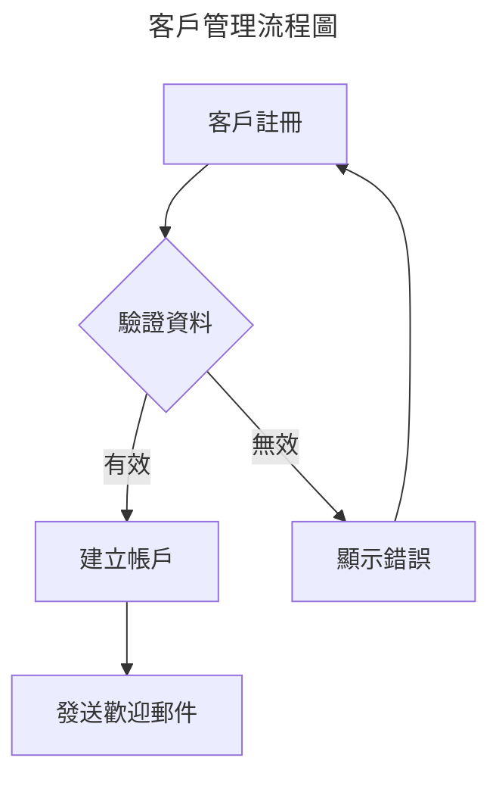

<!-- 
注意：Mermaid 圖表格式更新
- 舊格式：.mmd 文件引用
- 新格式：.md 文件中的 ```mermaid 代碼塊
- 原因：GitHub 原生支援，更好的可讀性和維護性
-->

# 圖表元資料標準格式

## 概覽

本文件定義了專案中所有圖表檔案的元資料標準格式，包括 Mermaid、PlantUML 和 Excalidraw 圖表的元資料規範，確保圖表的可追蹤性、自動化處理和一致性管理。

## 通用圖表元資料標準

### 基本 Front Matter 格式

```yaml
---
title: "圖表標題"
type: "mermaid|plantuml|excalidraw"
format: "mmd|puml|excalidraw|png|svg|pdf"
viewpoint: "functional|information|concurrency|development|deployment|operational|context"
perspective: ["security", "performance", "availability", "evolution", "usability", "regulation", "location", "cost"]
diagram_level: "overview|detailed|conceptual|implementation"
target_audience: ["architect", "developer", "stakeholder", "business", "operator"]
description: "圖表的詳細描述和用途"
related_documents: ["../viewpoints/functional/domain-model.md", "../perspectives/security/authentication.md"]
source_file: "diagram-source.mmd"  # 注意：現在使用包含 Mermaid 代碼塊的 .md 文件
generated_files: ["diagram.svg"]
dependencies: ["other-diagram.mmd", "reference-model.puml"]
last_updated: "YYYY-MM-DD"
version: "1.0"
author: "Architecture Team"
auto_generated: true|false
generation_source: "code|manual|template|ai-assisted"
generation_trigger: "code-change|manual-update|scheduled"
update_frequency: "on-demand|daily|weekly|monthly"
complexity: "low|medium|high"
maintenance_priority: "low|medium|high|critical"
maintenance_notes: "維護說明和注意事項"
review_status: "draft|reviewed|approved|deprecated"
tags: ["tag1", "tag2", "tag3"]
---
```

### 欄位詳細說明

#### 必填欄位

- **title**: 圖表標題，應該清楚描述圖表內容
- **type**: 圖表類型 (mermaid, plantuml, excalidraw)
- **format**: 檔案格式 (mmd, puml, excalidraw, png, svg, pdf)
- **description**: 圖表的詳細描述和用途
- **last_updated**: 最後更新日期，格式為 YYYY-MM-DD
- **version**: 圖表版本號，使用語意化版本控制
- **author**: 圖表作者或負責團隊

#### 選填欄位

- **viewpoint**: 所屬的架構視點
- **perspective**: 相關的架構觀點陣列
- **diagram_level**: 圖表詳細程度
- **target_audience**: 目標受眾陣列
- **related_documents**: 相關文件的相對路徑
- **source_file**: 原始圖表檔案
- **generated_files**: 從原始檔案生成的其他格式檔案
- **dependencies**: 依賴的其他圖表或檔案
- **auto_generated**: 是否為自動生成
- **generation_source**: 生成來源
- **generation_trigger**: 生成觸發條件
- **update_frequency**: 更新頻率
- **complexity**: 圖表複雜度
- **maintenance_priority**: 維護優先級
- **maintenance_notes**: 維護說明
- **review_status**: 審查狀態
- **tags**: 自由標籤

## Mermaid 圖表元資料標準

### 標準格式

```yaml
---
title: "系統架構概覽圖"
type: "mermaid"
format: "mmd"
viewpoint: "functional"
perspective: ["security", "performance"]
diagram_level: "overview"
target_audience: ["architect", "stakeholder"]
description: "展示系統的整體架構和主要組件之間的關係"
mermaid_type: "graph|flowchart|sequence|class|state|pie|journey|gantt|gitgraph"
direction: "TD|LR|BT|RL"
theme: "default|dark|forest|neutral"
related_documents: ["../viewpoints/functional/system-overview.md"]
source_file: "system-architecture.mmd"  # 注意：現在使用包含 Mermaid 代碼塊的 .md 文件
generated_files: ["system-architecture.svg"]
last_updated: "2025-01-21"
version: "1.2"
author: "Architecture Team"
auto_generated: false
generation_source: "manual"
update_frequency: "monthly"
complexity: "medium"
maintenance_priority: "high"
github_integration: true
live_editor_url: "https://mermaid.live/edit#..."
tags: ["architecture", "overview", "system"]
---
```

### Mermaid 特定欄位

- **mermaid_type**: Mermaid 圖表類型
- **direction**: 圖表方向 (Top-Down, Left-Right, Bottom-Top, Right-Left)
- **theme**: Mermaid 主題
- **github_integration**: 是否在 GitHub 中直接顯示
- **live_editor_url**: Mermaid Live Editor 連結

### 範例檔案結構



## PlantUML 圖表元資料標準

### 標準格式

```yaml
---
title: "領域模型類圖"
type: "plantuml"
format: "puml"
viewpoint: "functional"
perspective: ["evolution", "security"]
diagram_level: "detailed"
target_audience: ["architect", "developer"]
description: "展示領域模型的詳細設計，包括聚合根、實體和值對象"
plantuml_type: "class|sequence|usecase|activity|component|deployment|state|object"
style_theme: "plain|blueprint|sketchy|black-and-white"
include_files: ["common-styles.puml", "color-scheme.puml"]
related_documents: ["../viewpoints/functional/domain-model.md"]
source_file: "domain-model.puml"
generated_files: ["domain-model.svg"]
dependencies: ["value-objects.puml", "aggregates.puml"]
last_updated: "2025-01-21"
version: "3.1"
author: "Domain Modeling Team"
auto_generated: false
generation_source: "code"
generation_trigger: "code-change"
update_frequency: "on-demand"
complexity: "high"
maintenance_priority: "critical"
plantuml_server: "https://www.plantuml.com/plantuml"
tags: ["domain-model", "class-diagram", "ddd"]
---
```

### PlantUML 特定欄位

- **plantuml_type**: PlantUML 圖表類型
- **style_theme**: 樣式主題
- **include_files**: 包含的樣式或共用檔案
- **plantuml_server**: 使用的 PlantUML 伺服器

### 範例檔案結構

```plantuml
---
title: "訂單聚合根設計"
type: "plantuml"
format: "puml"
viewpoint: "functional"
perspective: ["performance", "evolution"]
diagram_level: "detailed"
target_audience: ["developer"]
description: "展示訂單聚合根的詳細設計，包括實體關係和業務方法"
plantuml_type: "class"
style_theme: "plain"
include_files: ["../styles/ddd-colors.puml"]
related_documents: ["../viewpoints/functional/order-management.md"]
source_file: "order-aggregate.puml"
generated_files: ["order-aggregate.svg"]
last_updated: "2025-01-21"
version: "2.3"
author: "Development Team"
auto_generated: true
generation_source: "code"
generation_trigger: "code-change"
update_frequency: "on-demand"
complexity: "high"
maintenance_priority: "high"
tags: ["order", "aggregate", "ddd", "domain-model"]
---
@startuml
!include ../styles/ddd-colors.puml

class Order <<AggregateRoot>> {
    -orderId: OrderId
    -customerId: CustomerId
    -orderItems: List<OrderItem>
    -status: OrderStatus
    --
    +addItem(item: OrderItem): void
    +removeItem(itemId: OrderItemId): void
    +calculateTotal(): Money
    +confirm(): void
}

class OrderItem <<Entity>> {
    -itemId: OrderItemId
    -productId: ProductId
    -quantity: Quantity
    -price: Money
}

Order ||--o{ OrderItem
@enduml
```

## Excalidraw 圖表元資料標準

### 標準格式

```yaml
---
title: "系統架構概念圖"
type: "excalidraw"
format: "excalidraw"
viewpoint: "functional"
perspective: ["usability", "evolution"]
diagram_level: "conceptual"
target_audience: ["stakeholder", "business"]
description: "以手繪風格展示系統架構的概念設計，便於溝通和理解"
excalidraw_version: "0.17.0"
canvas_size: "1920x1080"
background_color: "#ffffff"
grid_enabled: true
collaboration_enabled: false
related_documents: ["../viewpoints/functional/system-concept.md"]
source_file: "system-concept.excalidraw"
generated_files: ["system-concept.svg"]
mcp_generated: true
mcp_prompt: "Create a conceptual diagram showing the main system components and their relationships"
last_updated: "2025-01-21"
version: "1.0"
author: "Architecture Team"
auto_generated: true
generation_source: "ai-assisted"
generation_trigger: "manual-update"
update_frequency: "monthly"
complexity: "low"
maintenance_priority: "medium"
excalidraw_url: "https://excalidraw.com/#json=..."
tags: ["concept", "architecture", "hand-drawn"]
---
```

### Excalidraw 特定欄位

- **excalidraw_version**: Excalidraw 版本
- **canvas_size**: 畫布大小
- **background_color**: 背景顏色
- **grid_enabled**: 是否啟用網格
- **collaboration_enabled**: 是否啟用協作功能
- **mcp_generated**: 是否透過 MCP 生成
- **mcp_prompt**: MCP 生成時使用的提示
- **excalidraw_url**: Excalidraw 線上編輯連結

## 圖表生成和轉換元資料

### 自動生成配置

```yaml
---
title: "自動生成配置"
generation_config:
  triggers:
    - type: "file_change"
      patterns: ["**/*.java", "**/*.ts"]
      target_diagrams: ["class-diagram.puml", "component-diagram.mmd"  # 注意：現在使用包含 Mermaid 代碼塊的 .md 文件]
    
    - type: "scheduled"
      cron: "0 2 * * 1"  # 每週一凌晨2點
      target_diagrams: ["architecture-overview.mmd"  # 注意：現在使用包含 Mermaid 代碼塊的 .md 文件]
    
    - type: "manual"
      command: "generate-diagrams"
      target_diagrams: ["all"]
  
  output_formats:
    - format: "png"
      resolution: "300dpi"
      background: "white"
    
    - format: "svg"
      optimize: true
      embed_fonts: true
  
  post_processing:
    - action: "optimize_images"
      tools: ["optipng", "svgo"]
    
    - action: "update_references"
      scan_patterns: ["**/*.md"]
---
```

### 版本控制元資料

```yaml
---
title: "圖表版本控制"
version_control:
  versioning_strategy: "semantic"  # semantic|timestamp|sequential
  
  change_tracking:
    - field: "content_hash"
      algorithm: "sha256"
    
    - field: "visual_diff"
      enabled: true
      threshold: 0.1
  
  backup_strategy:
    - frequency: "daily"
      retention: "30 days"
      location: "backups/diagrams/"
    
    - frequency: "major_version"
      retention: "1 year"
      location: "archives/diagrams/"
  
  approval_workflow:
    - stage: "draft"
      auto_approve: false
    
    - stage: "review"
      reviewers: ["architect", "domain-expert"]
      approval_threshold: 2
    
    - stage: "approved"
      auto_publish: true
---
```

## 圖表品質和維護元資料

### 品質指標

```yaml
---
title: "圖表品質指標"
quality_metrics:
  readability:
    font_size_min: 12
    contrast_ratio_min: 4.5
    element_spacing_min: 10
  
  complexity:
    max_elements: 50
    max_connections: 100
    max_nesting_levels: 5
  
  consistency:
    color_palette: "standard"
    naming_convention: "camelCase"
    style_guide: "corporate"
  
  accessibility:
    alt_text_required: true
    color_blind_friendly: true
    screen_reader_compatible: true
---
```

### 維護排程

```yaml
---
title: "圖表維護排程"
maintenance_schedule:
  regular_review:
    frequency: "quarterly"
    checklist:
      - "Check accuracy against current implementation"
      - "Verify all references are valid"
      - "Update styling to current standards"
      - "Validate accessibility compliance"
  
  dependency_check:
    frequency: "monthly"
    automated: true
    actions:
      - "Scan for broken references"
      - "Check file existence"
      - "Validate metadata consistency"
  
  performance_optimization:
    frequency: "bi-annually"
    targets:
      - "Reduce file sizes"
      - "Optimize rendering performance"
      - "Update to latest tool versions"
---
```

## 圖表索引和搜尋元資料

### 搜尋索引配置

```yaml
---
title: "圖表搜尋索引"
search_index:
  indexable_fields:
    - "title"
    - "description"
    - "tags"
    - "viewpoint"
    - "perspective"
    - "target_audience"
  
  search_weights:
    title: 3.0
    description: 2.0
    tags: 1.5
    viewpoint: 1.0
    perspective: 1.0
  
  faceted_search:
    - field: "viewpoint"
      display_name: "架構視點"
    
    - field: "perspective"
      display_name: "架構觀點"
    
    - field: "type"
      display_name: "圖表類型"
    
    - field: "complexity"
      display_name: "複雜度"
---
```

### 關聯性分析

```yaml
---
title: "圖表關聯性分析"
relationship_analysis:
  similarity_metrics:
    - type: "content_similarity"
      algorithm: "cosine"
      threshold: 0.7
    
    - type: "structural_similarity"
      algorithm: "graph_edit_distance"
      threshold: 0.8
  
  clustering:
    - method: "hierarchical"
      distance_metric: "euclidean"
      linkage: "ward"
    
    - method: "k_means"
      k: "auto"
      max_k: 10
  
  recommendation_engine:
    - strategy: "collaborative_filtering"
      weight: 0.4
    
    - strategy: "content_based"
      weight: 0.6
---
```

## 工具整合和自動化

### CI/CD 整合

```yaml
---
title: "CI/CD 圖表處理"
cicd_integration:
  validation_pipeline:
    - stage: "metadata_validation"
      tools: ["yaml-lint", "custom-validator"]
    
    - stage: "diagram_compilation"
      tools: ["plantuml", "mermaid-cli", "excalidraw-cli"]
    
    - stage: "quality_check"
      tools: ["image-optimizer", "accessibility-checker"]
    
    - stage: "deployment"
      actions: ["upload-to-cdn", "update-references"]
  
  automation_triggers:
    - event: "pull_request"
      actions: ["validate", "preview_generation"]
    
    - event: "merge_to_main"
      actions: ["full_generation", "deployment"]
    
    - event: "scheduled"
      cron: "0 3 * * *"
      actions: ["maintenance_check", "optimization"]
---
```

### 監控和告警

```yaml
---
title: "圖表監控配置"
monitoring:
  health_checks:
    - metric: "generation_success_rate"
      threshold: 0.95
      alert_level: "warning"
    
    - metric: "file_size_growth"
      threshold: "20%"
      period: "monthly"
      alert_level: "info"
    
    - metric: "broken_references"
      threshold: 0
      alert_level: "critical"
  
  performance_metrics:
    - metric: "generation_time"
      target: "< 30s"
    
    - metric: "file_size"
      target: "< 1MB"
    
    - metric: "load_time"
      target: "< 3s"
  
  alerting:
    channels: ["slack", "email"]
    escalation_policy: "standard"
    notification_frequency: "immediate"
---
```

這個標準格式確保了圖表的一致性管理、自動化處理和品質控制，同時支援不同類型圖表工具的特定需求。