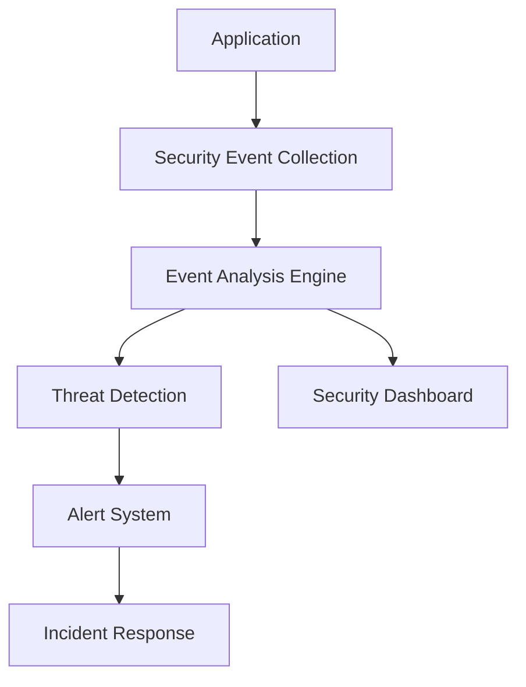

# Security Perspective - Authentication and Authorization

---
title: "Security Perspective - Authentication and Authorization"
perspective_type: "security"
applicable_viewpoints: ["functional", "information", "development", "deployment", "operational"]
quality_attributes: ["confidentiality", "integrity", "availability", "accountability"]
stakeholders: ["security-engineer", "architect", "developer", "operator"]
related_perspectives: ["performance", "usability", "regulation"]
related_documents: ["../viewpoints/functional/user-management.md", "../viewpoints/deployment/security-configuration.md"]
patterns: ["oauth2", "jwt", "rbac", "zero-trust"]
tools: ["spring-security", "keycloak", "vault"]
metrics: ["authentication-success-rate", "authorization-latency", "security-incidents"]
last_updated: "2025-01-21"
version: "1.3"
author: "Security Team"
review_status: "approved"
impact_level: "critical"
implementation_difficulty: "medium"
tags: ["authentication", "authorization", "oauth2", "jwt", "security"]
---

## Overview

The security perspective focuses on the system's authentication and authorization mechanisms, ensuring that only verified users can access appropriate resources, and all security operations can be tracked and audited.

### Perspective Purpose
- Establish robust identity verification mechanisms
- Implement fine-grained authorization controls
- Ensure traceability and compliance of security operations

### Core Values
- Protect systems and data from unauthorized access
- Meet regulatory compliance requirements
- Build user trust and system reliability

## Quality Attributes

### Primary Quality Attributes

#### Confidentiality
**Definition**: Ensure sensitive information can only be accessed by authorized entities

**Measurement Methods**:
- **Quantitative Metrics**: Blocking rate of unauthorized access attempts
- **Measurement Tools**: Security monitoring systems, audit logs
- **Measurement Frequency**: Real-time monitoring
- **Baseline Value**: 99.9% blocking rate

**Target Values**:
- **Minimum Requirement**: 99.5% blocking rate
- **Target Value**: 99.9% blocking rate
- **Excellence Value**: 99.99% blocking rate

#### Integrity
**Definition**: Ensure data is not modified without authorization during transmission and storage

**Measurement Methods**:
- **Quantitative Metrics**: Data integrity verification success rate
- **Measurement Tools**: Hash verification, digital signatures
- **Measurement Frequency**: Every data operation
- **Baseline Value**: 100% verification success

**Target Values**:
- **Minimum Requirement**: 99.99% verification success
- **Target Value**: 100% verification success
- **Excellence Value**: 100% verification success + real-time anomaly detection

#### Accountability
**Definition**: Ensure all security-related operations can be traced to specific users or systems

**Measurement Methods**:
- **Quantitative Metrics**: Audit log completeness
- **Measurement Tools**: Log analysis systems
- **Measurement Frequency**: Continuous monitoring
- **Baseline Value**: 100% operation recording

## Cross-Viewpoint Applications

### Considerations in Functional Viewpoint

**Impact Level**: High

**Specific Considerations**:
- Business functions need to integrate authentication checks
- Sensitive business operations require additional authorization
- Business rules need to consider security constraints

**Design Guidelines**:
- Implement security verification in aggregate roots
- Use domain events to record security operations
- Implement role-based business rules

**Implementation Checkpoints**:
- [ ] All business operations have appropriate authorization checks
- [ ] Sensitive data is properly protected in domain models

### Considerations in Information Viewpoint

**Impact Level**: High

**Specific Considerations**:
- Sensitive data needs encrypted storage
- Data access requires authorization control
- Data transmission needs secure channels

**Design Guidelines**:
- Implement data classification and labeling
- Use encryption technology to protect sensitive data
- Establish data access audit mechanisms

**Implementation Checkpoints**:
- [ ] Sensitive data has been identified and classified
- [ ] Data encryption mechanisms have been implemented

### Considerations in Development Viewpoint

**Impact Level**: Medium

**Specific Considerations**:
- Development processes need security reviews
- Code needs security scanning
- Testing needs to include security testing

**Design Guidelines**:
- Implement secure coding standards
- Integrate security testing into CI/CD processes
- Establish security code review mechanisms

**Implementation Checkpoints**:
- [ ] Secure coding standards have been established
- [ ] Automated security testing has been integrated

### Considerations in Deployment Viewpoint

**Impact Level**: High

**Specific Considerations**:
- Deployment environments need security hardening
- Network communications need encryption
- Access control requires environment isolation

**Design Guidelines**:
- Implement zero-trust network architecture
- Use container security best practices
- Establish security isolation between environments

**Implementation Checkpoints**:
- [ ] Network security policies have been implemented
- [ ] Container security configuration has been completed

### Considerations in Operational Viewpoint

**Impact Level**: High

**Specific Considerations**:
- Security events need real-time monitoring
- Security metrics need continuous tracking
- Incident response needs standard procedures

**Design Guidelines**:
- Establish security monitoring dashboards
- Implement automated threat detection
- Establish incident response procedures

**Implementation Checkpoints**:
- [ ] Security monitoring systems have been deployed
- [ ] Incident response procedures have been established

## Design Strategies

### Core Strategies

#### OAuth 2.0 + JWT Strategy
**Description**: Use OAuth 2.0 for authorization and JWT for stateless authentication

**Applicable Scenarios**:
- Microservices architecture
- API-first applications
- Systems requiring cross-domain authentication

**Implementation Methods**:
1. Set up OAuth 2.0 authorization server
2. Configure JWT issuance and verification
3. Implement token refresh mechanisms
4. Establish scope and permission mapping

**Advantages**:
- Stateless authentication
- Standardized protocols
- Good scalability

**Disadvantages**:
- Complex token revocation
- Requires secure token storage

**Example**:
```java
@Configuration
@EnableWebSecurity
public class SecurityConfiguration {
    
    @Bean
    public SecurityFilterChain filterChain(HttpSecurity http) throws Exception {
        http.oauth2ResourceServer(oauth2 -> oauth2
            .jwt(jwt -> jwt
                .decoder(jwtDecoder())
                .jwtAuthenticationConverter(jwtAuthenticationConverter())
            )
        );
        return http.build();
    }
    
    @Bean
    public JwtDecoder jwtDecoder() {
        return NimbusJwtDecoder.withJwkSetUri(jwkSetUri)
            .cache(Duration.ofMinutes(5))
            .build();
    }
}
```

#### Role-Based Access Control (RBAC)
**Description**: Assign permissions based on user roles, simplifying permission management

**Applicable Scenarios**:
- Enterprise internal systems
- Applications with relatively stable permission structures
- Systems requiring centralized permission management

**Implementation Methods**:
1. Define role and permission models
2. Implement role assignment mechanisms
3. Establish permission checking logic
4. Implement dynamic permission updates

**Advantages**:
- Simplified permission management
- Easy to understand and maintain
- Supports permission inheritance

**Disadvantages**:
- Limited flexibility
- Role explosion problem
- Difficult fine-grained control

## Implementation Technologies

### Core Technologies

#### Spring Security
**Description**: The most mature security framework in the Java ecosystem

**Applicability**:
- **Advantages**: Complete functionality, active community, good integration
- **Limitations**: Steep learning curve, complex configuration
- **Maturity**: Very mature

**Implementation Complexity**: Medium

**Learning Curve**: Steep

**Community Support**: Strong

**Configuration Example**:
```java
@EnableGlobalMethodSecurity(prePostEnabled = true)
public class MethodSecurityConfiguration {
    
    @PreAuthorize("hasRole('ADMIN') or (hasRole('USER') and #customerId == authentication.principal.customerId)")
    public Customer getCustomer(@PathVariable String customerId) {
        return customerService.findById(customerId);
    }
}
```

#### Keycloak
**Description**: Open-source identity and access management solution

**Applicability**:
- **Advantages**: Feature-rich, standards support, user-friendly management interface
- **Limitations**: High resource consumption, complex customization
- **Maturity**: Mature

**Implementation Complexity**: Medium

**Learning Curve**: Moderate

**Community Support**: Strong

## Testing and Validation

### Testing Strategies

#### Security Function Testing
**Purpose**: Verify the correctness of authentication and authorization functions

**Test Scope**:
- Authentication process testing
- Authorization rule testing
- Token lifecycle testing

**Test Methods**:
1. Unit test security components
2. Integration test authentication processes
3. End-to-end test user scenarios

**Success Criteria**:
- All authentication scenarios pass tests
- Authorization rules execute correctly
- Security exceptions are handled properly

#### Penetration Testing
**Purpose**: Discover potential security vulnerabilities

**Test Scope**:
- Authentication bypass testing
- Privilege escalation testing
- Injection attack testing

**Test Methods**:
1. Automated security scanning
2. Manual penetration testing
3. Third-party security assessment

**Success Criteria**:
- No high-risk vulnerabilities
- Medium-risk vulnerabilities have mitigation measures
- Security controls operate effectively

## Monitoring and Metrics

### Key Performance Indicators (KPIs)

#### Authentication Success Rate
**Definition**: Proportion of successful authentication requests to total authentication requests

**Calculation Formula**: (Successful authentications / Total authentication requests) × 100%

**Target Values**:
- **Green Light**: ≥ 99%
- **Yellow Light**: 95-99%
- **Red Light**: < 95%

**Monitoring Frequency**: Real-time

**Data Source**: Authentication service logs

**Alert Conditions**: Success rate below 95%

#### Security Incident Count
**Definition**: Total number of detected security incidents

**Calculation Formula**: Daily/weekly/monthly security incident count

**Target Values**:
- **Green Light**: 0 high-risk incidents
- **Yellow Light**: 1-2 medium-risk incidents
- **Red Light**: > 2 medium-risk incidents or any high-risk incidents

**Monitoring Frequency**: Real-time

**Data Source**: Security monitoring systems

**Alert Conditions**: Any high-risk incidents or medium-risk incidents exceeding threshold

### Monitoring Implementation

#### Monitoring Architecture


#### Monitoring Tool Configuration
```yaml
# Prometheus security monitoring configuration
security_monitoring:
  authentication:
    success_rate:
      query: "rate(auth_success_total[5m]) / rate(auth_total[5m])"
      threshold: 0.95
    
    failure_rate:
      query: "rate(auth_failure_total[5m])"
      threshold: 0.05
  
  authorization:
    denied_requests:
      query: "rate(authz_denied_total[5m])"
      threshold: 0.01
```

## Risk Management

### Risk Identification

#### Authentication Bypass Risk
**Description**: Attackers may bypass authentication mechanisms to directly access the system

**Likelihood**: Medium

**Impact Level**: High

**Risk Level**: High

**Trigger Conditions**: Authentication logic vulnerabilities, configuration errors

**Impact Scope**: Entire system security

#### Token Leakage Risk
**Description**: JWT tokens may be stolen and used for unauthorized access

**Likelihood**: Medium

**Impact Level**: Medium

**Risk Level**: Medium

**Trigger Conditions**: Insecure token storage, network interception

**Impact Scope**: Specific user accounts

### Risk Mitigation Strategies

#### Preventive Measures
- Implement multi-layer security protection
- Regular security reviews and testing
- Use secure coding best practices

#### Detection Mechanisms
- Real-time security monitoring
- Anomaly behavior detection
- Automated threat intelligence

#### Response Plans
- Automated incident response
- Emergency access revocation
- Incident investigation and analysis

This example demonstrates how to use the Perspective template to create specific security perspective documents, covering complete content including cross-viewpoint applications, implementation technologies, and monitoring metrics.