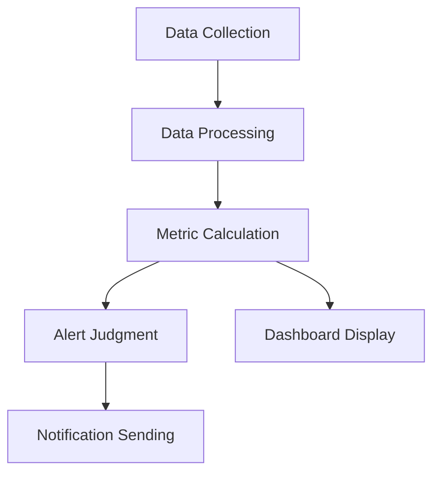

# [Perspective Name] Perspective

---
title: "[Perspective Name] Perspective"
perspective_type: "security|performance|availability|evolution|usability|regulation|location|cost"
applicable_viewpoints: ["functional", "information", "concurrency", "development", "deployment", "operational", "context"]
quality_attributes: ["attribute1", "attribute2", "attribute3"]
stakeholders: ["architect", "developer", "operator", "security-engineer", "business-analyst"]
related_perspectives: ["perspective1", "perspective2"]
related_documents: ["doc1.md", "doc2.md"]
patterns: ["pattern1", "pattern2"]
tools: ["tool1", "tool2"]
metrics: ["metric1", "metric2"]
last_updated: "YYYY-MM-DD"
version: "1.0"
author: "Architecture Team"
review_status: "draft|reviewed|approved"
---

## Overview

[Definition and importance of the perspective]

### Perspective Purpose
- [Purpose 1: Core quality issues this perspective addresses]
- [Purpose 2: This perspective's contribution to system quality]
- [Purpose 3: Scope and limitations of this perspective]

### Core Value
- [Value 1: Why this perspective is important]
- [Value 2: Risks of ignoring this perspective]
- [Value 3: Benefits of correctly applying this perspective]

### Applicability Assessment
- **High Applicability Scenarios**: [When this perspective is most important]
- **Medium Applicability Scenarios**: [When this perspective has some importance]
- **Low Applicability Scenarios**: [When this perspective is relatively unimportant]

## Quality Attributes

### Primary Quality Attributes

#### [Attribute 1 Name]
**Definition**: [Clear definition of the attribute]

**Measurement Methods**:
- **Quantitative Indicators**: [Specific numerical indicators]
- **Measurement Tools**: [Tools used for measurement]
- **Measurement Frequency**: [How often to measure]
- **Baseline Values**: [Acceptable baseline values]

**Target Values**:
- **Minimum Requirements**: [Minimum acceptable values]
- **Target Values**: [Expected values to achieve]
- **Excellence Values**: [Outstanding performance values]

#### [Attribute 2 Name]
**Definition**: [Clear definition of the attribute]

**Measurement Methods**:
- **Quantitative Indicators**: [Specific numerical indicators]
- **Measurement Tools**: [Tools used for measurement]
- **Measurement Frequency**: [How often to measure]
- **Baseline Values**: [Acceptable baseline values]

**Target Values**:
- **Minimum Requirements**: [Minimum acceptable values]
- **Target Values**: [Expected values to achieve]
- **Excellence Values**: [Outstanding performance values]

### Secondary Quality Attributes

#### [Attribute 3 Name]
**Definition**: [Clear definition of the attribute]

**Measurement Methods**:
- **Quantitative Indicators**: [Specific numerical indicators]
- **Measurement Tools**: [Tools used for measurement]

### Quality Attribute Relationship Diagram

| Quality Attribute | Importance | Measurement Difficulty | Impact Scope | Related Attributes |
|-------------------|------------|------------------------|--------------|---------------------|
| [Attribute 1] | High/Medium/Low | High/Medium/Low | System-wide/Local | [Related Attributes] |
| [Attribute 2] | High/Medium/Low | High/Medium/Low | System-wide/Local | [Related Attributes] |

## Cross-Viewpoint Application

### Considerations in Functional Viewpoint

**Impact Level**: High/Medium/Low

**Specific Considerations**:
- [How this perspective manifests in functional viewpoint]
- [Elements of this perspective to consider in functional design]
- [Impact of functional implementation on this perspective]

**Design Guidance**:
- [Specific design recommendations]
- [Design pitfalls to avoid]

**Implementation Checkpoints**:
- [ ] [Checkpoint 1]
- [ ] [Checkpoint 2]

### Considerations in Information Viewpoint

**Impact Level**: High/Medium/Low

**Specific Considerations**:
- [How this perspective manifests in information viewpoint]
- [Elements of this perspective to consider in data design]
- [Impact of information flow on this perspective]

**Design Guidance**:
- [Specific design recommendations]
- [Design pitfalls to avoid]

**Implementation Checkpoints**:
- [ ] [Checkpoint 1]
- [ ] [Checkpoint 2]

### Considerations in Concurrency Viewpoint

**Impact Level**: High/Medium/Low

**Specific Considerations**:
- [How this perspective manifests in concurrency viewpoint]
- [Elements of this perspective to consider in concurrency design]
- [Impact of concurrent processing on this perspective]

**Design Guidance**:
- [Specific design recommendations]
- [Design pitfalls to avoid]

**Implementation Checkpoints**:
- [ ] [Checkpoint 1]
- [ ] [Checkpoint 2]

### Considerations in Development Viewpoint

**Impact Level**: High/Medium/Low

**Specific Considerations**:
- [How this perspective manifests in development viewpoint]
- [Elements of this perspective to consider in development process]
- [Impact of development practices on this perspective]

**Design Guidance**:
- [Specific design recommendations]
- [Design pitfalls to avoid]

**Implementation Checkpoints**:
- [ ] [Checkpoint 1]
- [ ] [Checkpoint 2]

### Considerations in Deployment Viewpoint

**Impact Level**: High/Medium/Low

**Specific Considerations**:
- [How this perspective manifests in deployment viewpoint]
- [Elements of this perspective to consider in deployment design]
- [Impact of deployment strategy on this perspective]

**Design Guidance**:
- [Specific design recommendations]
- [Design pitfalls to avoid]

**Implementation Checkpoints**:
- [ ] [Checkpoint 1]
- [ ] [Checkpoint 2]

### Considerations in Operational Viewpoint

**Impact Level**: High/Medium/Low

**Specific Considerations**:
- [How this perspective manifests in operational viewpoint]
- [Elements of this perspective to consider in operational process]
- [Impact of operational practices on this perspective]

**Design Guidance**:
- [Specific design recommendations]
- [Design pitfalls to avoid]

**Implementation Checkpoints**:
- [ ] [Checkpoint 1]
- [ ] [Checkpoint 2]

### Cross-Viewpoint Impact Matrix

| Viewpoint | Impact Level | Main Considerations | Key Decision Points | Risk Level |
|-----------|--------------|---------------------|---------------------|------------|
| Functional Viewpoint | High/Medium/Low | [Main considerations] | [Decision points] | High/Medium/Low |
| Information Viewpoint | High/Medium/Low | [Main considerations] | [Decision points] | High/Medium/Low |
| Concurrency Viewpoint | High/Medium/Low | [Main considerations] | [Decision points] | High/Medium/Low |
| Development Viewpoint | High/Medium/Low | [Main considerations] | [Decision points] | High/Medium/Low |
| Deployment Viewpoint | High/Medium/Low | [Main considerations] | [Decision points] | High/Medium/Low |
| Operational Viewpoint | High/Medium/Low | [Main considerations] | [Decision points] | High/Medium/Low |

## Design Strategies

### Core Strategies

#### [Strategy 1 Name]
**Description**: [Detailed description of the strategy]

**Applicable Scenarios**:
- [Scenario 1]
- [Scenario 2]
- [Scenario 3]

**Implementation Methods**:
1. [Step 1]
2. [Step 2]
3. [Step 3]

**Advantages**:
- [Advantage 1]
- [Advantage 2]

**Disadvantages**:
- [Disadvantage 1]
- [Disadvantage 2]

**Example**:
```[language]
// Implementation example
[Code or configuration example]
```

#### [Strategy 2 Name]
**Description**: [Detailed description of the strategy]

**Applicable Scenarios**:
- [Scenario 1]
- [Scenario 2]

**Implementation Methods**:
1. [Step 1]
2. [Step 2]

**Advantages**:
- [Advantage 1]
- [Advantage 2]

**Disadvantages**:
- [Disadvantage 1]
- [Disadvantage 2]

### Supporting Strategies

#### [Strategy 3 Name]
**Description**: [Detailed description of the strategy]

**Applicable Scenarios**: [Applicable scenarios]

**Implementation Methods**: [Brief implementation methods]

### Strategy Selection Guide

| Scenario Characteristics | Recommended Strategy | Alternative Strategy | Unsuitable Strategy |
|--------------------------|---------------------|---------------------|---------------------|
| [Characteristic 1] | [Strategy A] | [Strategy B] | [Strategy C] |
| [Characteristic 2] | [Strategy B] | [Strategy A] | [Strategy D] |

## Implementation Technologies

### Core Technologies

#### [Technology 1 Name]
**Description**: [Detailed description of the technology]

**Applicability**:
- **Advantages**: [Technology advantages]
- **Limitations**: [Technology limitations]
- **Maturity**: [Technology maturity assessment]

**Implementation Complexity**: High/Medium/Low

**Learning Curve**: Steep/Moderate/Gentle

**Community Support**: Strong/Medium/Weak

**Configuration Example**:
```[language]
// Configuration or usage example
[Example content]
```

#### [Technology 2 Name]
**Description**: [Detailed description of the technology]

**Applicability**:
- **Advantages**: [Technology advantages]
- **Limitations**: [Technology limitations]
- **Maturity**: [Technology maturity assessment]

**Implementation Complexity**: High/Medium/Low

**Learning Curve**: Steep/Moderate/Gentle

**Community Support**: Strong/Medium/Weak

### Supporting Tools

#### [Tool 1 Name]
**Purpose**: [Main purpose of the tool]

**Key Features**:
- [Feature 1]
- [Feature 2]
- [Feature 3]

**Usage Scenarios**: [When to use this tool]

**Integration Method**: [How to integrate into the system]

#### [Tool 2 Name]
**Purpose**: [Main purpose of the tool]

**Key Features**:
- [Feature 1]
- [Feature 2]

**Usage Scenarios**: [When to use this tool]

### Technology Selection Matrix

| Technology/Tool | Applicable Scenarios | Implementation Cost | Maintenance Cost | Recommendation |
|-----------------|---------------------|---------------------|------------------|----------------|
| [Technology 1] | [Scenarios] | High/Medium/Low | High/Medium/Low | ⭐⭐⭐⭐⭐ |
| [Technology 2] | [Scenarios] | High/Medium/Low | High/Medium/Low | ⭐⭐⭐⭐ |

## Testing and Validation

### Testing Strategies

#### [Test Type 1]
**Purpose**: [Testing purpose]

**Test Scope**:
- [Scope 1]
- [Scope 2]
- [Scope 3]

**Test Methods**:
1. [Method 1]
2. [Method 2]
3. [Method 3]

**Success Criteria**:
- [Criteria 1]
- [Criteria 2]

**Testing Tools**: [Recommended testing tools]

#### [Test Type 2]
**Purpose**: [Testing purpose]

**Test Scope**:
- [Scope 1]
- [Scope 2]

**Test Methods**:
1. [Method 1]
2. [Method 2]

**Success Criteria**:
- [Criteria 1]
- [Criteria 2]

### Validation Checklist

#### Design Phase Validation
- [ ] [Check item 1]
- [ ] [Check item 2]
- [ ] [Check item 3]
- [ ] [Check item 4]

#### Implementation Phase Validation
- [ ] [Check item 1]
- [ ] [Check item 2]
- [ ] [Check item 3]
- [ ] [Check item 4]

#### Deployment Phase Validation
- [ ] [Check item 1]
- [ ] [Check item 2]
- [ ] [Check item 3]

#### Operational Phase Validation
- [ ] [Check item 1]
- [ ] [Check item 2]
- [ ] [Check item 3]

### Validation Tools and Techniques

| Validation Phase | Validation Tools | Validation Techniques | Automation Level |
|------------------|------------------|----------------------|------------------|
| Design Phase | [Tools] | [Techniques] | High/Medium/Low |
| Implementation Phase | [Tools] | [Techniques] | High/Medium/Low |
| Deployment Phase | [Tools] | [Techniques] | High/Medium/Low |
| Operational Phase | [Tools] | [Techniques] | High/Medium/Low |

## Monitoring and Metrics

### Key Performance Indicators (KPIs)

#### [Indicator 1 Name]
**Definition**: [Clear definition of the indicator]

**Calculation Formula**: [How to calculate this indicator]

**Target Values**:
- **Green Light**: [Good range]
- **Yellow Light**: [Warning range]
- **Red Light**: [Danger range]

**Monitoring Frequency**: [Monitoring frequency]

**Data Source**: [Data source]

**Alert Conditions**: [When to trigger alerts]

#### [Indicator 2 Name]
**Definition**: [Clear definition of the indicator]

**Calculation Formula**: [How to calculate this indicator]

**Target Values**:
- **Green Light**: [Good range]
- **Yellow Light**: [Warning range]
- **Red Light**: [Danger range]

**Monitoring Frequency**: [Monitoring frequency]

**Data Source**: [Data source]

**Alert Conditions**: [When to trigger alerts]

### Monitoring Implementation

#### Monitoring Architecture


#### Monitoring Tool Configuration
```[language]
// Monitoring configuration example
[Configuration content]
```

### Metric Analysis

#### Trend Analysis
- **Short-term Trends** (Daily/Weekly): [Analysis focus]
- **Medium-term Trends** (Monthly/Quarterly): [Analysis focus]
- **Long-term Trends** (Yearly): [Analysis focus]

#### Correlation Analysis
- Correlation between [Metric A] and [Metric B]
- Correlation between [Metric C] and [Metric D]

#### Benchmark Comparison
- **Internal Benchmarks**: [Comparison with historical data]
- **External Benchmarks**: [Comparison with industry standards]
- **Target Benchmarks**: [Comparison with set targets]

### Monitoring Dashboard Design

| Dashboard Level | Target Audience | Main Metrics | Update Frequency |
|-----------------|-----------------|--------------|------------------|
| Executive Level | Senior Management | [Core KPIs] | Daily/Weekly |
| Management Level | Middle Management | [Management Metrics] | Hourly/Daily |
| Operational Level | Technical Staff | [Technical Metrics] | Minutes/Hourly |

## Risk Management

### Risk Identification

#### [Risk 1 Name]
**Description**: [Detailed description of the risk]

**Probability**: High/Medium/Low

**Impact Level**: High/Medium/Low

**Risk Level**: High/Medium/Low

**Trigger Conditions**: [When this risk will occur]

**Impact Scope**: [Scope of risk impact]

#### [Risk 2 Name]
**Description**: [Detailed description of the risk]

**Probability**: High/Medium/Low

**Impact Level**: High/Medium/Low

**Risk Level**: High/Medium/Low

**Trigger Conditions**: [When this risk will occur]

**Impact Scope**: [Scope of risk impact]

### Risk Mitigation Strategies

#### Preventive Measures
- [Measure 1]: [How to prevent risk occurrence]
- [Measure 2]: [How to prevent risk occurrence]
- [Measure 3]: [How to prevent risk occurrence]

#### Detection Mechanisms
- [Mechanism 1]: [How to detect risk early]
- [Mechanism 2]: [How to detect risk early]

#### Response Plans
- [Plan 1]: [How to respond when risk occurs]
- [Plan 2]: [How to respond when risk occurs]

#### Recovery Strategies
- [Strategy 1]: [How to recover from risk impact]
- [Strategy 2]: [How to recover from risk impact]

### Risk Monitoring

| Risk | Monitoring Indicators | Thresholds | Check Frequency | Responsible Person |
|------|----------------------|------------|-----------------|-------------------|
| [Risk 1] | [Indicators] | [Thresholds] | [Frequency] | [Responsible Person] |
| [Risk 2] | [Indicators] | [Thresholds] | [Frequency] | [Responsible Person] |

## Best Practices

### Design Best Practices
1. **[Practice 1]**: [Detailed explanation and application scenarios]
2. **[Practice 2]**: [Detailed explanation and application scenarios]
3. **[Practice 3]**: [Detailed explanation and application scenarios]

### Implementation Best Practices
1. **[Practice 1]**: [Detailed explanation and code examples]
2. **[Practice 2]**: [Detailed explanation and code examples]
3. **[Practice 3]**: [Detailed explanation and code examples]

### Operational Best Practices
1. **[Practice 1]**: [Detailed explanation and operational guidelines]
2. **[Practice 2]**: [Detailed explanation and operational guidelines]
3. **[Practice 3]**: [Detailed explanation and operational guidelines]

### Anti-patterns and Pitfalls
1. **[Anti-pattern 1]**: [Description and avoidance methods]
2. **[Anti-pattern 2]**: [Description and avoidance methods]
3. **[Anti-pattern 3]**: [Description and avoidance methods]

## Case Studies

### Success Cases

#### [Case 1 Title]
**Background**: [Case background]

**Challenges**: [Challenges faced]

**Solution**: [Solution adopted]

**Results**: [Results achieved]

**Lessons Learned**: [Lessons learned]

#### [Case 2 Title]
**Background**: [Case background]

**Challenges**: [Challenges faced]

**Solution**: [Solution adopted]

**Results**: [Results achieved]

**Lessons Learned**: [Lessons learned]

### Failure Cases

#### [Case 3 Title]
**Background**: [Case background]

**Problems**: [Problems encountered]

**Root Cause Analysis**: [Problem causes]

**Impact**: [Impact caused]

**Lessons Learned**: [Lessons learned]

## References

### Related Documents
- [Document 1]
- [Document 2]
- [Document 3]

### External References
- [Reference 1]
- [Reference 2]
- [Reference 3]

### Standards and Specifications
- [Standard 1]
- [Standard 2]
- [Standard 3]

### Tool and Technical Documentation
- [Tool 1 Documentation]
- [Tool 2 Documentation]
- [Technology 3 Documentation]

---

**Document Status**: [Draft/Under Review/Approved]  
**Last Updated**: [YYYY-MM-DD]  
**Next Review**: [YYYY-MM-DD]  
**Version**: [Version Number]

---

**Template Version**: 1.0  
**Based on**: Rozanski & Woods Architecture Methodology  
**Maintained by**: Architecture Team"