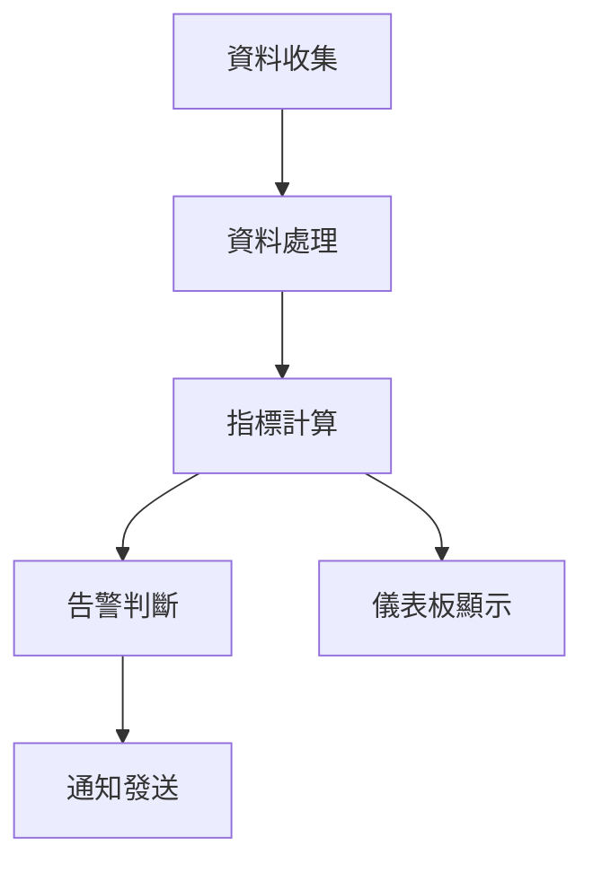

# [Perspective Name] 觀點

---
title: "[Perspective Name] 觀點"
perspective_type: "security|performance|availability|evolution|usability|regulation|location|cost"
applicable_viewpoints: ["functional", "information", "concurrency", "development", "deployment", "operational", "context"]
quality_attributes: ["attribute1", "attribute2", "attribute3"]
stakeholders: ["architect", "developer", "operator", "security-engineer", "business-analyst"]
related_perspectives: ["perspective1", "perspective2"]
related_documents: ["doc1.md", "doc2.md"]
patterns: ["pattern1", "pattern2"]
tools: ["tool1", "tool2"]
metrics: ["metric1", "metric2"]
last_updated: "YYYY-MM-DD"
version: "1.0"
author: "Architecture Team"
review_status: "draft|reviewed|approved"
---

## 概覽

[觀點的定義和重要性]

### 觀點目的
- [目的1：此觀點要解決的核心品質問題]
- [目的2：此觀點對系統品質的貢獻]
- [目的3：此觀點的適用範圍和限制]

### 核心價值
- [價值1：為什麼這個觀點很重要]
- [價值2：忽略此觀點的風險]
- [價值3：正確應用此觀點的收益]

### 適用性評估
- **高適用性場景**: [何時此觀點最重要]
- **中適用性場景**: [何時此觀點有一定重要性]
- **低適用性場景**: [何時此觀點相對不重要]

## 品質屬性

### 主要品質屬性

#### [屬性1名稱]
**定義**: [屬性的明確定義]

**測量方式**:
- **量化指標**: [具體的數值指標]
- **測量工具**: [使用的測量工具]
- **測量頻率**: [多久測量一次]
- **基準值**: [可接受的基準值]

**目標值**:
- **最低要求**: [最低可接受值]
- **目標值**: [期望達到的值]
- **優秀值**: [卓越的表現值]

#### [屬性2名稱]
**定義**: [屬性的明確定義]

**測量方式**:
- **量化指標**: [具體的數值指標]
- **測量工具**: [使用的測量工具]
- **測量頻率**: [多久測量一次]
- **基準值**: [可接受的基準值]

**目標值**:
- **最低要求**: [最低可接受值]
- **目標值**: [期望達到的值]
- **優秀值**: [卓越的表現值]

### 次要品質屬性

#### [屬性3名稱]
**定義**: [屬性的明確定義]

**測量方式**:
- **量化指標**: [具體的數值指標]
- **測量工具**: [使用的測量工具]

### 品質屬性關係圖

| 品質屬性 | 重要性 | 測量難度 | 影響範圍 | 相關屬性 |
|---------|-------|---------|---------|---------|
| [屬性1] | 高/中/低 | 高/中/低 | 全系統/局部 | [相關屬性] |
| [屬性2] | 高/中/低 | 高/中/低 | 全系統/局部 | [相關屬性] |

## 跨視點應用

### 功能視點中的考量

**影響程度**: 高/中/低

**具體考量**:
- [在功能視點中如何體現此觀點]
- [功能設計時需要考慮的此觀點要素]
- [功能實現對此觀點的影響]

**設計指導**:
- [具體的設計建議]
- [需要避免的設計陷阱]

**實現檢查點**:
- [ ] [檢查項目1]
- [ ] [檢查項目2]

### 資訊視點中的考量

**影響程度**: 高/中/低

**具體考量**:
- [在資訊視點中如何體現此觀點]
- [資料設計時需要考慮的此觀點要素]
- [資訊流對此觀點的影響]

**設計指導**:
- [具體的設計建議]
- [需要避免的設計陷阱]

**實現檢查點**:
- [ ] [檢查項目1]
- [ ] [檢查項目2]

### 並發視點中的考量

**影響程度**: 高/中/低

**具體考量**:
- [在並發視點中如何體現此觀點]
- [並發設計時需要考慮的此觀點要素]
- [並發處理對此觀點的影響]

**設計指導**:
- [具體的設計建議]
- [需要避免的設計陷阱]

**實現檢查點**:
- [ ] [檢查項目1]
- [ ] [檢查項目2]

### 開發視點中的考量

**影響程度**: 高/中/低

**具體考量**:
- [在開發視點中如何體現此觀點]
- [開發過程中需要考慮的此觀點要素]
- [開發實踐對此觀點的影響]

**設計指導**:
- [具體的設計建議]
- [需要避免的設計陷阱]

**實現檢查點**:
- [ ] [檢查項目1]
- [ ] [檢查項目2]

### 部署視點中的考量

**影響程度**: 高/中/低

**具體考量**:
- [在部署視點中如何體現此觀點]
- [部署設計時需要考慮的此觀點要素]
- [部署策略對此觀點的影響]

**設計指導**:
- [具體的設計建議]
- [需要避免的設計陷阱]

**實現檢查點**:
- [ ] [檢查項目1]
- [ ] [檢查項目2]

### 運營視點中的考量

**影響程度**: 高/中/低

**具體考量**:
- [在運營視點中如何體現此觀點]
- [運營過程中需要考慮的此觀點要素]
- [運營實踐對此觀點的影響]

**設計指導**:
- [具體的設計建議]
- [需要避免的設計陷阱]

**實現檢查點**:
- [ ] [檢查項目1]
- [ ] [檢查項目2]

### 跨視點影響矩陣

| 視點 | 影響程度 | 主要考量 | 關鍵決策點 | 風險等級 |
|------|---------|---------|-----------|---------|
| 功能視點 | 高/中/低 | [主要考量] | [決策點] | 高/中/低 |
| 資訊視點 | 高/中/低 | [主要考量] | [決策點] | 高/中/低 |
| 並發視點 | 高/中/低 | [主要考量] | [決策點] | 高/中/低 |
| 開發視點 | 高/中/低 | [主要考量] | [決策點] | 高/中/低 |
| 部署視點 | 高/中/低 | [主要考量] | [決策點] | 高/中/低 |
| 運營視點 | 高/中/低 | [主要考量] | [決策點] | 高/中/低 |

## 設計策略

### 核心策略

#### [策略1名稱]
**描述**: [策略的詳細描述]

**適用場景**:
- [場景1]
- [場景2]
- [場景3]

**實現方法**:
1. [步驟1]
2. [步驟2]
3. [步驟3]

**優點**:
- [優點1]
- [優點2]

**缺點**:
- [缺點1]
- [缺點2]

**範例**:
```[language]
// 實現範例
[程式碼或配置範例]
```

#### [策略2名稱]
**描述**: [策略的詳細描述]

**適用場景**:
- [場景1]
- [場景2]

**實現方法**:
1. [步驟1]
2. [步驟2]

**優點**:
- [優點1]
- [優點2]

**缺點**:
- [缺點1]
- [缺點2]

### 輔助策略

#### [策略3名稱]
**描述**: [策略的詳細描述]

**適用場景**: [適用場景]

**實現方法**: [簡要實現方法]

### 策略選擇指南

| 場景特徵 | 推薦策略 | 替代策略 | 不適用策略 |
|---------|---------|---------|-----------|
| [特徵1] | [策略A] | [策略B] | [策略C] |
| [特徵2] | [策略B] | [策略A] | [策略D] |

## 實現技術

### 核心技術

#### [技術1名稱]
**描述**: [技術的詳細描述]

**適用性**:
- **優勢**: [技術優勢]
- **限制**: [技術限制]
- **成熟度**: [技術成熟度評估]

**實現複雜度**: 高/中/低

**學習曲線**: 陡峭/適中/平緩

**社群支援**: 強/中/弱

**配置範例**:
```[language]
// 配置或使用範例
[範例內容]
```

#### [技術2名稱]
**描述**: [技術的詳細描述]

**適用性**:
- **優勢**: [技術優勢]
- **限制**: [技術限制]
- **成熟度**: [技術成熟度評估]

**實現複雜度**: 高/中/低

**學習曲線**: 陡峭/適中/平緩

**社群支援**: 強/中/弱

### 支援工具

#### [工具1名稱]
**用途**: [工具的主要用途]

**功能特點**:
- [特點1]
- [特點2]
- [特點3]

**使用場景**: [何時使用此工具]

**整合方式**: [如何整合到系統中]

#### [工具2名稱]
**用途**: [工具的主要用途]

**功能特點**:
- [特點1]
- [特點2]

**使用場景**: [何時使用此工具]

### 技術選型矩陣

| 技術/工具 | 適用場景 | 實現成本 | 維護成本 | 推薦度 |
|----------|---------|---------|---------|-------|
| [技術1] | [場景] | 高/中/低 | 高/中/低 | ⭐⭐⭐⭐⭐ |
| [技術2] | [場景] | 高/中/低 | 高/中/低 | ⭐⭐⭐⭐ |

## 測試和驗證

### 測試策略

#### [測試類型1]
**目的**: [測試目的]

**測試範圍**:
- [範圍1]
- [範圍2]
- [範圍3]

**測試方法**:
1. [方法1]
2. [方法2]
3. [方法3]

**成功標準**:
- [標準1]
- [標準2]

**測試工具**: [推薦的測試工具]

#### [測試類型2]
**目的**: [測試目的]

**測試範圍**:
- [範圍1]
- [範圍2]

**測試方法**:
1. [方法1]
2. [方法2]

**成功標準**:
- [標準1]
- [標準2]

### 驗證檢查清單

#### 設計階段驗證
- [ ] [檢查項目1]
- [ ] [檢查項目2]
- [ ] [檢查項目3]
- [ ] [檢查項目4]

#### 實現階段驗證
- [ ] [檢查項目1]
- [ ] [檢查項目2]
- [ ] [檢查項目3]
- [ ] [檢查項目4]

#### 部署階段驗證
- [ ] [檢查項目1]
- [ ] [檢查項目2]
- [ ] [檢查項目3]

#### 運營階段驗證
- [ ] [檢查項目1]
- [ ] [檢查項目2]
- [ ] [檢查項目3]

### 驗證工具和技術

| 驗證階段 | 驗證工具 | 驗證技術 | 自動化程度 |
|---------|---------|---------|-----------|
| 設計階段 | [工具] | [技術] | 高/中/低 |
| 實現階段 | [工具] | [技術] | 高/中/低 |
| 部署階段 | [工具] | [技術] | 高/中/低 |
| 運營階段 | [工具] | [技術] | 高/中/低 |

## 監控和度量

### 關鍵指標 (KPIs)

#### [指標1名稱]
**定義**: [指標的明確定義]

**計算公式**: [如何計算此指標]

**目標值**:
- **綠燈**: [良好範圍]
- **黃燈**: [警告範圍]
- **紅燈**: [危險範圍]

**監控頻率**: [監控頻率]

**資料來源**: [資料來源]

**告警條件**: [何時觸發告警]

#### [指標2名稱]
**定義**: [指標的明確定義]

**計算公式**: [如何計算此指標]

**目標值**:
- **綠燈**: [良好範圍]
- **黃燈**: [警告範圍]
- **紅燈**: [危險範圍]

**監控頻率**: [監控頻率]

**資料來源**: [資料來源]

**告警條件**: [何時觸發告警]

### 監控實現

#### 監控架構


#### 監控工具配置
```[language]
// 監控配置範例
[配置內容]
```

### 度量分析

#### 趨勢分析
- **短期趨勢** (日/週): [分析重點]
- **中期趨勢** (月/季): [分析重點]
- **長期趨勢** (年): [分析重點]

#### 相關性分析
- [指標A] 與 [指標B] 的相關性
- [指標C] 與 [指標D] 的相關性

#### 基準比較
- **內部基準**: [與歷史資料比較]
- **外部基準**: [與行業標準比較]
- **目標基準**: [與設定目標比較]

### 監控儀表板設計

| 儀表板層級 | 目標受眾 | 主要指標 | 更新頻率 |
|-----------|---------|---------|---------|
| 執行層 | 高階主管 | [核心KPI] | 日/週 |
| 管理層 | 中階主管 | [管理指標] | 小時/日 |
| 操作層 | 技術人員 | [技術指標] | 分鐘/小時 |

## 風險管理

### 風險識別

#### [風險1名稱]
**描述**: [風險的詳細描述]

**可能性**: 高/中/低

**影響程度**: 高/中/低

**風險等級**: 高/中/低

**觸發條件**: [何時會發生此風險]

**影響範圍**: [風險的影響範圍]

#### [風險2名稱]
**描述**: [風險的詳細描述]

**可能性**: 高/中/低

**影響程度**: 高/中/低

**風險等級**: 高/中/低

**觸發條件**: [何時會發生此風險]

**影響範圍**: [風險的影響範圍]

### 風險緩解策略

#### 預防措施
- [措施1]: [如何預防風險發生]
- [措施2]: [如何預防風險發生]
- [措施3]: [如何預防風險發生]

#### 檢測機制
- [機制1]: [如何及早發現風險]
- [機制2]: [如何及早發現風險]

#### 應對計畫
- [計畫1]: [風險發生時如何應對]
- [計畫2]: [風險發生時如何應對]

#### 恢復策略
- [策略1]: [如何從風險影響中恢復]
- [策略2]: [如何從風險影響中恢復]

### 風險監控

| 風險 | 監控指標 | 閾值 | 檢查頻率 | 負責人 |
|------|---------|------|---------|-------|
| [風險1] | [指標] | [閾值] | [頻率] | [負責人] |
| [風險2] | [指標] | [閾值] | [頻率] | [負責人] |

## 最佳實踐

### 設計最佳實踐
1. **[實踐1]**: [詳細說明和應用場景]
2. **[實踐2]**: [詳細說明和應用場景]
3. **[實踐3]**: [詳細說明和應用場景]

### 實現最佳實踐
1. **[實踐1]**: [詳細說明和程式碼範例]
2. **[實踐2]**: [詳細說明和程式碼範例]
3. **[實踐3]**: [詳細說明和程式碼範例]

### 運營最佳實踐
1. **[實踐1]**: [詳細說明和操作指南]
2. **[實踐2]**: [詳細說明和操作指南]
3. **[實踐3]**: [詳細說明和操作指南]

### 反模式和陷阱
1. **[反模式1]**: [描述和避免方法]
2. **[反模式2]**: [描述和避免方法]
3. **[反模式3]**: [描述和避免方法]

## 案例研究

### 成功案例

#### [案例1標題]
**背景**: [案例背景]

**挑戰**: [面臨的挑戰]

**解決方案**: [採用的解決方案]

**結果**: [取得的結果]

**經驗教訓**: [學到的經驗]

#### [案例2標題]
**背景**: [案例背景]

**挑戰**: [面臨的挑戰]

**解決方案**: [採用的解決方案]

**結果**: [取得的結果]

**經驗教訓**: [學到的經驗]

### 失敗案例

#### [案例3標題]
**背景**: [案例背景]

**問題**: [出現的問題]

**原因分析**: [問題原因]

**影響**: [造成的影響]

**經驗教訓**: [學到的教訓]

## 參考資料

### 相關文件
- \1
- \1
- \1

### 外部參考
- [參考資料1]
- [參考資料2]
- [參考資料3]

### 標準和規範
- [標準1]
- [標準2]
- [標準3]

### 工具和技術文件
- [工具1文件]
- [工具2文件]
- [技術3文件]

---

**文件狀態**: [草稿/審查中/已批准]  
**最後更新**: [YYYY-MM-DD]  
**下次審查**: [YYYY-MM-DD]  
**版本**: [版本號]
