# Runbook: {Issue Title}

> **Last Updated**: YYYY-MM-DD  
> **Owner**: Team/Person Name  
> **Severity**: Critical | High | Medium | Low

## Quick Reference

| Property | Value |
|----------|-------|
| **Issue Type** | Performance | Availability | Security | Data | Other |
| **Affected Service** | Service name |
| **Typical Duration** | X minutes/hours |
| **Frequency** | Rare | Occasional | Frequent |
| **Last Occurrence** | YYYY-MM-DD |

## Symptoms

### User-Visible Symptoms

- Symptom 1: Description
- Symptom 2: Description
- Symptom 3: Description

### System Symptoms

- Symptom 1: Description (e.g., High CPU usage > 90%)
- Symptom 2: Description (e.g., Error rate > 5%)
- Symptom 3: Description (e.g., Response time > 5s)

### Log Patterns

```text
Example log pattern to look for:
ERROR [timestamp] ServiceName: Error message pattern
```

## Impact

### Severity Level

**Severity**: Critical | High | Medium | Low

**Severity Criteria**:

- **Critical**: Complete service outage, data loss, security breach
- **High**: Major functionality unavailable, significant performance degradation
- **Medium**: Minor functionality affected, some users impacted
- **Low**: Minimal impact, workaround available

### Affected Users

- **User Group 1**: Impact description
- **User Group 2**: Impact description
- **Estimated Affected Users**: Number or percentage

### Business Impact

- **Revenue Impact**: Description and estimated amount
- **SLA Impact**: Which SLAs are at risk
- **Reputation Impact**: Description
- **Compliance Impact**: Any regulatory concerns

### Affected Components

- Component 1: Description of impact
- Component 2: Description of impact
- Component 3: Description of impact

## Detection

### Automated Detection

**Primary Alert**:

- **Alert Name**: Alert name from monitoring system
- **Alert Condition**: Condition that triggers the alert
- **Alert Channel**: Slack/PagerDuty/Email
- **Alert Link**: [Link to alert configuration]

**Secondary Alerts**:

- Alert 1: Description
- Alert 2: Description

### Monitoring Dashboards

- **Primary Dashboard**: [Dashboard Name](dashboard-link)
  - Key metrics to check: Metric 1, Metric 2, Metric 3
- **Secondary Dashboard**: [Dashboard Name](dashboard-link)
  - Key metrics to check: Metric 1, Metric 2

### Manual Detection

**How to manually verify the issue**:

1. Step 1: Description
2. Step 2: Description
3. Step 3: Description

**Commands to check**:

```bash
# Check service health
kubectl get pods -n production | grep service-name

# Check logs
kubectl logs -f deployment/service-name -n production --tail=100

# Check metrics
curl http://service-name:8080/actuator/metrics/http.server.requests
```

## Diagnosis

### Step 1: Verify the Issue

**Objective**: Confirm the issue is occurring

**Actions**:

```bash
# Command 1: Check service status
kubectl get pods -n production

# Command 2: Check recent logs
kubectl logs deployment/service-name -n production --since=10m

# Command 3: Check metrics
# Access monitoring dashboard and verify metrics
```

**Expected Results**:

- Result 1: Description
- Result 2: Description

**If issue confirmed**: Proceed to Step 2
**If issue not confirmed**: Check for false positive

### Step 2: Identify Root Cause

**Objective**: Determine what's causing the issue

**Common Causes**:

1. **Cause 1**: Description
   - How to verify: Commands or checks
   - Indicators: What to look for

2. **Cause 2**: Description
   - How to verify: Commands or checks
   - Indicators: What to look for

3. **Cause 3**: Description
   - How to verify: Commands or checks
   - Indicators: What to look for

**Diagnostic Commands**:

```bash
# Check resource usage
kubectl top pods -n production

# Check database connections
# Command to check DB connections

# Check external dependencies
# Command to check external services
```

**Decision Tree**:

```mermaid
graph LR
    N2["├ Yes"]
    N3["Check for memory leak (Go to Step 3A)"]
    N2 --> N3
    N4["No"]
    N5["Is error rate > 5%?"]
    N4 --> N5
    N6["Check application logs (Go to Step 3B)"]
    N2 --> N6
    N7["Check network latency (Go to Step 3C)"]
    N4 --> N7
```



### Step 3: Gather Additional Information

**Information to Collect**:

- [ ] Recent deployments (last 24 hours)
- [ ] Recent configuration changes
- [ ] Traffic patterns (current vs normal)
- [ ] Error logs (last 1 hour)
- [ ] Resource utilization trends
- [ ] External dependency status

**Commands**:

```bash
# Get recent deployments
kubectl rollout history deployment/service-name -n production

# Get configuration
kubectl get configmap service-config -n production -o yaml

# Get resource usage history
# Query from monitoring system
```

## Resolution

### Immediate Actions (First 5 Minutes)

**Priority**: Stop the bleeding

1. **Action 1**: Description

   ```bash
   # Command to execute
   ```

   **Expected Result**: Description
   **Verification**: How to verify it worked

2. **Action 2**: Description

   ```bash
   # Command to execute
   ```

   **Expected Result**: Description
   **Verification**: How to verify it worked

3. **Action 3**: Description

   ```bash
   # Command to execute
   ```

   **Expected Result**: Description
   **Verification**: How to verify it worked

### Short-term Fix (Next 30 Minutes)

**Priority**: Restore service to acceptable level

1. **Fix 1**: Description

   ```bash
   # Commands to execute
   ```

   **Expected Result**: Description
   **Rollback**: How to rollback if this doesn't work

2. **Fix 2**: Description

   ```bash
   # Commands to execute
   ```

   **Expected Result**: Description
   **Rollback**: How to rollback if this doesn't work

### Root Cause Fix (Next 1-2 Hours)

**Priority**: Permanently resolve the issue

1. **Permanent Fix 1**: Description
   - Implementation steps
   - Testing requirements
   - Deployment plan

2. **Permanent Fix 2**: Description
   - Implementation steps
   - Testing requirements
   - Deployment plan

### Resolution by Root Cause

#### If Root Cause is: High CPU Usage

**Resolution Steps**:

1. Step 1: Description
2. Step 2: Description
3. Step 3: Description

#### If Root Cause is: Database Connection Issues

**Resolution Steps**:

1. Step 1: Description
2. Step 2: Description
3. Step 3: Description

#### If Root Cause is: External Service Failure

**Resolution Steps**:

1. Step 1: Description
2. Step 2: Description
3. Step 3: Description

## Verification

### Verification Checklist

After implementing the fix, verify:

- [ ] **Metric 1**: Returns to normal range (< X)
- [ ] **Metric 2**: Returns to normal range (< Y)
- [ ] **Error Rate**: Below threshold (< Z%)
- [ ] **Response Time**: Below threshold (< N ms)
- [ ] **User Reports**: No new complaints
- [ ] **Alerts**: Cleared or acknowledged
- [ ] **Logs**: No error patterns

### Verification Commands

```bash
# Check service health
kubectl get pods -n production | grep service-name

# Check metrics
curl http://service-name:8080/actuator/health

# Check logs for errors
kubectl logs deployment/service-name -n production --since=5m | grep ERROR

# Run smoke tests
./scripts/smoke-test.sh production
```

### Verification Timeline

- **Immediate** (0-5 min): Service responding
- **Short-term** (5-15 min): Metrics returning to normal
- **Medium-term** (15-60 min): No recurrence of symptoms
- **Long-term** (1-24 hours): Sustained normal operation

## Prevention

### Immediate Prevention Measures

1. **Measure 1**: Description
   - Implementation: How to implement
   - Timeline: When to implement

2. **Measure 2**: Description
   - Implementation: How to implement
   - Timeline: When to implement

### Long-term Prevention Strategy

1. **Strategy 1**: Description
   - Owner: Team/Person
   - Timeline: Timeline
   - Success Criteria: How to measure success

2. **Strategy 2**: Description
   - Owner: Team/Person
   - Timeline: Timeline
   - Success Criteria: How to measure success

### Monitoring Improvements

- **Improvement 1**: Add alert for X
- **Improvement 2**: Add dashboard for Y
- **Improvement 3**: Add automated check for Z

### Process Improvements

- **Improvement 1**: Description
- **Improvement 2**: Description
- **Improvement 3**: Description

## Escalation

### Escalation Path

| Level | Contact | When to Escalate | Response Time SLA |
|-------|---------|------------------|-------------------|
| L1 | On-call engineer | Immediate | 5 minutes |
| L2 | Team lead | If L1 can't resolve in 15 min | 10 minutes |
| L3 | Engineering manager | If L2 can't resolve in 30 min | 15 minutes |
| L4 | CTO | Critical impact > 1 hour | 30 minutes |

### Contact Information

**On-Call Engineer**:

- PagerDuty: [Link to schedule]
- Slack: #oncall-channel

**Team Lead**:

- Name: Person Name
- Phone: +X-XXX-XXX-XXXX
- Slack: @username

**Subject Matter Experts**:

- **Expert 1** (Area): @username
- **Expert 2** (Area): @username

### Escalation Triggers

Escalate immediately if:

- Issue affects > X% of users
- Revenue impact > $Y
- Data loss or security breach
- Unable to diagnose within 15 minutes
- Unable to resolve within 30 minutes
- SLA breach imminent

## Communication

### Internal Communication

**Slack Channels**:

- **#incidents**: For incident updates
- **#engineering**: For technical discussion
- **#leadership**: For executive updates

**Update Frequency**:

- **Critical**: Every 15 minutes
- **High**: Every 30 minutes
- **Medium**: Every hour

**Update Template**:

```text
🚨 Incident Update - [Timestamp]
Status: Investigating | Identified | Monitoring | Resolved
Impact: [Description]
Current Actions: [What we're doing]
ETA: [Expected resolution time]
Next Update: [Time]
```

### External Communication

**Status Page**: [Link to status page]

**Customer Communication**:

- **When to communicate**: Criteria for customer notification
- **Communication channels**: Email, status page, social media
- **Message template**: [Link to template]

**Stakeholder Communication**:

- **Who to notify**: List of stakeholders
- **When to notify**: Criteria
- **Communication method**: Email, phone, Slack

## Post-Incident

### Post-Incident Review (PIR)

**Schedule PIR**: Within 48 hours of resolution

**PIR Attendees**:

- Incident responders
- Team lead
- Product manager
- Relevant stakeholders

**PIR Agenda**:

1. Timeline of events
2. Root cause analysis
3. What went well
4. What could be improved
5. Action items

### Documentation Updates

After resolution, update:

- [ ] This runbook with lessons learned
- [ ] Monitoring alerts if needed
- [ ] Architecture documentation if relevant
- [ ] Training materials if needed

### Follow-up Actions

- [ ] **Action 1**: Description - Owner - Due date
- [ ] **Action 2**: Description - Owner - Due date
- [ ] **Action 3**: Description - Owner - Due date

### Lessons Learned

**What Worked Well**:

- Item 1
- Item 2

**What Could Be Improved**:

- Item 1
- Item 2

**Action Items**:

- [ ] Action 1: Description
- [ ] Action 2: Description

## Related Documentation

- [Architecture Documentation](../../viewpoints/README.md)
- [Monitoring Guide](../monitoring/monitoring-strategy.md)
- [Deployment Guide](../deployment/deployment-process.md)
- [Related Runbook 1](./related-runbook-1.md)
- [Related Runbook 2](./related-runbook-2.md)

## Appendix

### Useful Commands Reference

```bash
# Kubernetes commands
kubectl get pods -n production
kubectl logs -f deployment/service-name -n production
kubectl describe pod pod-name -n production
kubectl top pods -n production

# Database commands
# Add relevant database commands

# Monitoring commands
# Add relevant monitoring commands
```

### Useful Links

- [Monitoring Dashboard](link)
- [Log Aggregation](link)
- [Deployment Pipeline](link)
- [Configuration Management](link)

### Change History

| Date | Version | Author | Changes |
|------|---------|--------|---------|
| YYYY-MM-DD | 1.0 | Name | Initial version |
| YYYY-MM-DD | 1.1 | Name | Updates based on incident |

---

**Runbook Template Version**: 1.0  
**Last Template Update**: 2025-01-17
