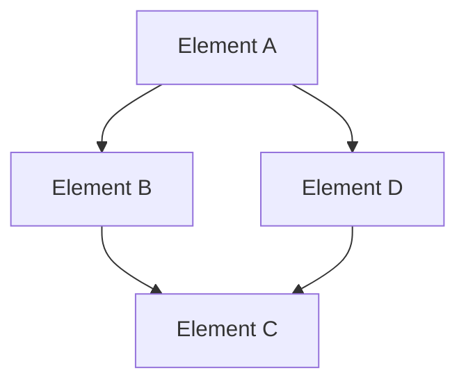

# [Viewpoint Name] Viewpoint

---
title: "[Viewpoint Name] Viewpoint"
viewpoint: "functional|information|concurrency|development|deployment|operational|context"
perspective: ["security", "performance", "availability", "evolution", "usability", "regulation", "location", "cost"]
stakeholders: ["architect", "developer", "operator", "security-engineer", "business-analyst"]
related_viewpoints: ["viewpoint1", "viewpoint2"]
related_documents: ["doc1.md", "doc2.md"]
diagrams: ["diagram1.md", "diagram2.puml"]
last_updated: "YYYY-MM-DD"
version: "1.0"
author: "Architecture Team"
review_status: "draft|reviewed|approved"
---

<!-- 
Note: Mermaid Diagram Format Update
- Old format: .mmd file references
- New format: .md files with ```mermaid code blocks
- Reason: GitHub native support, better readability and maintainability
-->

## Overview

[Definition and objectives of the viewpoint]

### Viewpoint Purpose
- [Purpose 1: Describe the core problem this viewpoint addresses]
- [Purpose 2: Explain the value and importance of this viewpoint]
- [Purpose 3: Define the scope and boundaries of this viewpoint]

### Applicable Scenarios
- [Scenario 1: When this viewpoint is needed]
- [Scenario 2: When this viewpoint is most valuable]
- [Scenario 3: Limitations and inapplicable scenarios]

## Stakeholders

### Primary Stakeholders
- **[Role 1]**: [Concerns and expectations]
- **[Role 2]**: [Concerns and expectations]
- **[Role 3]**: [Concerns and expectations]

### Secondary Stakeholders
- **[Role 4]**: [Concerns and expectations]
- **[Role 5]**: [Concerns and expectations]

### Stakeholder Mapping Table

| Stakeholder | Primary Concerns | Expected Outcomes | Impact Level |
|-------------|------------------|-------------------|-------------|
| [Role 1] | [Concerns] | [Outcomes] | High/Medium/Low |
| [Role 2] | [Concerns] | [Outcomes] | High/Medium/Low |
| [Role 3] | [Concerns] | [Outcomes] | High/Medium/Low |

## Concerns

### Core Concerns
1. **[Concern 1]**: [Detailed description]
2. **[Concern 2]**: [Detailed description]
3. **[Concern 3]**: [Detailed description]

### Secondary Concerns
1. **[Concern 4]**: [Detailed description]
2. **[Concern 5]**: [Detailed description]

### Concern Priority Matrix

| Concern | Importance | Urgency | Priority | Responsible Role |
|---------|------------|---------|----------|------------------|
| [Concern 1] | High/Medium/Low | High/Medium/Low | P1/P2/P3 | [Role] |
| [Concern 2] | High/Medium/Low | High/Medium/Low | P1/P2/P3 | [Role] |

## Architectural Elements

### [Element Type 1]
**Definition**: [Clear definition of the element]

**Characteristics**:
- [Characteristic 1]
- [Characteristic 2]
- [Characteristic 3]

**Implementation Approaches**:
- [Approach 1]: [Description]
- [Approach 2]: [Description]

**Examples**:
```[language]
// Code or configuration example
[Example content]
```

### [Element Type 2]
**Definition**: [Clear definition of the element]

**Characteristics**:
- [Characteristic 1]
- [Characteristic 2]

**Implementation Approaches**:
- [Approach 1]: [Description]
- [Approach 2]: [Description]

### Element Relationship Diagram



## Quality Attribute Considerations

### [Perspective 1] Perspective
**Impact Level**: High/Medium/Low

**Considerations**:
- [How this perspective manifests in this viewpoint]
- [Elements of this perspective to consider]
- [Impact of this viewpoint on the perspective]

**Implementation Guidelines**:
- [Guideline 1]
- [Guideline 2]
- [Guideline 3]

### [Perspective 2] Perspective
**Impact Level**: High/Medium/Low

**Considerations**:
- [How this perspective manifests in this viewpoint]
- [Elements of this perspective to consider]

**Implementation Guidelines**:
- [Guideline 1]
- [Guideline 2]

### Quality Attribute Impact Matrix

| Quality Attribute | Impact Level | Implementation Complexity | Risk Level | Mitigation Strategy |
|-------------------|--------------|---------------------------|------------|-------------------|
| [Attribute 1] | High/Medium/Low | High/Medium/Low | High/Medium/Low | [Strategy] |
| [Attribute 2] | High/Medium/Low | High/Medium/Low | High/Medium/Low | [Strategy] |

## Related Diagrams

### Overview Diagrams
- **[Diagram 1 Name]**: [Brief description]
  - File: [../diagrams/viewpoints/[viewpoint]/diagram1.md](../diagrams/viewpoints/[viewpoint]/diagram1.md)
  - Type: Mermaid
  - Update Frequency: [Frequency]

- **[Diagram 2 Name]**: [Brief description]
  - File: [../diagrams/viewpoints/[viewpoint]/diagram2.puml](../diagrams/viewpoints/[viewpoint]/diagram2.puml)
  - Type: PlantUML
  - Update Frequency: [Frequency]

### Detailed Diagrams
- **[Diagram 3 Name]**: [Brief description]
  - File: [../diagrams/viewpoints/[viewpoint]/diagram3.excalidraw](../diagrams/viewpoints/[viewpoint]/diagram3.excalidraw)
  - Type: Excalidraw
  - Update Frequency: [Frequency]

### Diagram Mapping Table

| Diagram Name | Type | Detail Level | Target Audience | Maintenance Responsibility |
|--------------|------|--------------|-------------|---------------------------|
| [Diagram 1] | Mermaid | Overview | [Audience] | [Role] |
| [Diagram 2] | PlantUML | Detailed | [Audience] | [Role] |
| [Diagram 3] | Excalidraw | Detailed | [Audience] | [Role] |

## Relationships with Other Viewpoints

### Direct Relationships
- **[Viewpoint 1]**: [Nature of relationship]
  - Dependency Type: [Strong/Weak/Mutual dependency]
  - Impact Level: [High/Medium/Low]
  - Coordination Mechanism: [How coordination is achieved]

- **[Viewpoint 2]**: [Nature of relationship]
  - Dependency Type: [Strong/Weak/Mutual dependency]
  - Impact Level: [High/Medium/Low]
  - Coordination Mechanism: [How coordination is achieved]

### Indirect Relationships
- **[Viewpoint 3]**: [Nature of relationship]
- **[Viewpoint 4]**: [Nature of relationship]

### Viewpoint Integration Strategy
1. **Integration Principles**: [Core principles for integration]
2. **Conflict Resolution**: [How to resolve conflicts between viewpoints]
3. **Coordination Mechanisms**: [Specific coordination methods]

## Implementation Guidelines

### Design Principles
1. **[Principle 1]**: [Description and rationale]
2. **[Principle 2]**: [Description and rationale]
3. **[Principle 3]**: [Description and rationale]

### Best Practices
1. **[Practice 1]**: [Description and application]
2. **[Practice 2]**: [Description and application]
3. **[Practice 3]**: [Description and application]

### Common Pitfalls
1. **[Pitfall 1]**: [Description and avoidance strategy]
2. **[Pitfall 2]**: [Description and avoidance strategy]
3. **[Pitfall 3]**: [Description and avoidance strategy]

### Implementation Checklist
- [ ] [Check item 1]
- [ ] [Check item 2]
- [ ] [Check item 3]
- [ ] [Check item 4]
- [ ] [Check item 5]

## Validation Criteria

### Completeness Validation
- [ ] [All required elements are documented]
- [ ] [All stakeholder concerns are addressed]
- [ ] [All relationships are identified]
- [ ] [All quality attributes are considered]

### Consistency Validation
- [ ] [Consistent with other viewpoints]
- [ ] [Consistent with architectural principles]
- [ ] [Consistent with quality requirements]

### Quality Validation
- [ ] [Clear and unambiguous documentation]
- [ ] [Appropriate level of detail]
- [ ] [Traceable to requirements]

### Traceability Validation
- [ ] [Traceable to business objectives]
- [ ] [Traceable to quality attributes]
- [ ] [Traceable to design decisions]

## Maintenance and Updates

### Update Trigger Conditions
- [Condition 1: When to update this viewpoint]
- [Condition 2: Regular review schedule]
- [Condition 3: Change-driven updates]

### Maintenance Responsibilities
- **Primary Owner**: [Role responsible for maintenance]
- **Reviewer**: [Role responsible for review]
- **Approver**: [Role responsible for approval]

### Version Control
- **Version Number Rules**: [Versioning scheme]
- **Change Records**: [How changes are documented]
- **Release Process**: [How updates are released]

## References

### Related Documents
- [Document 1]
- [Document 2]
- [Document 3]

### External References
- [Reference 1]
- [Reference 2]
- [Reference 3]

### Standards and Specifications
- [Standard 1]
- [Standard 2]
- [Standard 3]

---

**Document Status**: [Draft/Under Review/Approved]  
**Last Updated**: [YYYY-MM-DD]  
**Next Review**: [YYYY-MM-DD]  
**Version**: [Version Number]

---

**Template Version**: 1.0  
**Based on**: Rozanski & Woods Architecture Methodology  
**Maintained by**: Architecture Team"