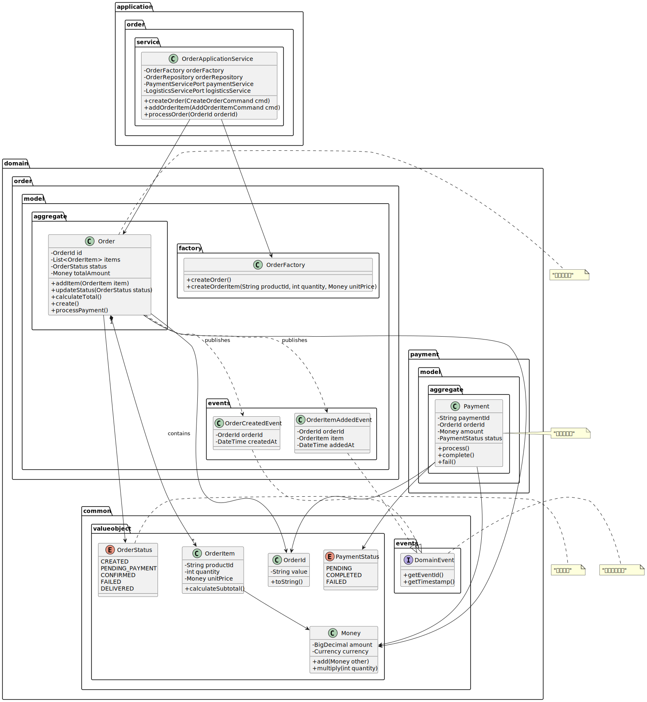

# 測試翻譯功能

這是一個測試檔案，用來驗證自動翻譯功能是否正常運作。

## 專案架構

本專案採用六角形架構，詳細說明請參考：

- [架構概覽](architecture-overview.md)
- [設計指南](DesignGuideline.MD#tell-dont-ask-原則)
- [發布說明](releases/README.md)

## 技術棧

- **核心框架**: Spring Boot 3.2.0
- **構建工具**: Gradle 8.x
- **測試框架**: JUnit 5

## 圖表範例



## 程式碼範例

```java
// 這是一個範例類別
public class Order {
    private OrderId id;
    private OrderStatus status;
    
    // 處理訂單
    public void process() {
        if (status == OrderStatus.CREATED) {
            status = OrderStatus.PROCESSING;
        }
    }
}
```

## 連結測試

- [根目錄 README](../README.md)
- [UML 文檔](uml/README.md)
- [外部連結](https://example.com)

這個檔案包含了各種需要翻譯和連結轉換的元素。