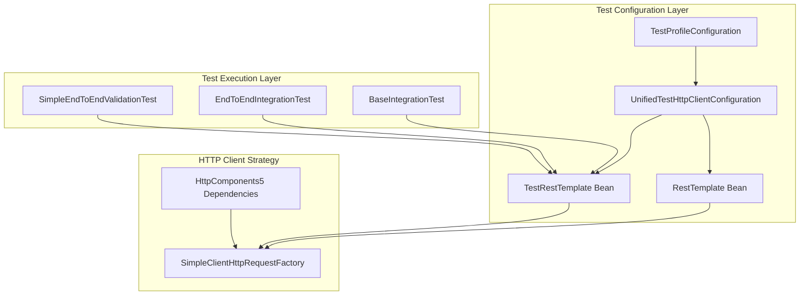

# HTTP Client Configuration Strategy for Integration Tests

## Overview

This document explains the unified HTTP client configuration strategy implemented to resolve TestRestTemplate dependency issues and ensure reliable integration test execution. The strategy eliminates HttpComponents dependency conflicts while maintaining comprehensive test coverage.

## Problem Background

### Previous Issues

The integration tests were disabled due to several interconnected problems:

1. **HttpComponents Dependency Conflicts**: Multiple versions and incomplete dependency sets causing `NoClassDefFoundError`
2. **Configuration Redundancy**: Multiple test configuration classes with overlapping responsibilities
3. **Test Environment Inconsistency**: Production and test HTTP client configurations interfering with each other
4. **Resource Management**: Insufficient memory allocation and cleanup for integration tests

### Impact

- `SimpleEndToEndValidationTest` was disabled
- `EndToEndIntegrationTest` was disabled
- Observability features could not be validated in integration tests
- CI/CD pipeline lacked comprehensive end-to-end validation

## Unified HTTP Client Strategy

### Architecture Overview



### Core Components

#### 1. UnifiedTestHttpClientConfiguration

**Location**: `src/test/java/solid/humank/genaidemo/infrastructure/config/UnifiedTestHttpClientConfiguration.java`

**Purpose**: Provides a single, authoritative HTTP client configuration for all tests.

```java
@TestConfiguration
@Profile("test")
public class UnifiedTestHttpClientConfiguration {
    
    @Bean
    @Primary
    public RestTemplate testRestTemplate() {
        RestTemplate restTemplate = new RestTemplate();
        restTemplate.setRequestFactory(clientHttpRequestFactory());
        return restTemplate;
    }
    
    @Bean
    @Primary
    public TestRestTemplate testRestTemplateForTesting(RestTemplate restTemplate) {
        return new TestRestTemplate(restTemplate);
    }
    
    @Bean
    public ClientHttpRequestFactory clientHttpRequestFactory() {
        SimpleClientHttpRequestFactory factory = new SimpleClientHttpRequestFactory();
        factory.setConnectTimeout(Duration.ofSeconds(10));
        factory.setReadTimeout(Duration.ofSeconds(30));
        return factory;
    }
}
```

**Key Features**:

- Uses `@Primary` annotation to override production configurations
- Implements `SimpleClientHttpRequestFactory` as the default HTTP client factory
- Provides consistent timeout configuration for test environments
- Eliminates HttpComponents dependency conflicts

#### 2. BaseIntegrationTest

**Location**: `src/test/java/solid/humank/genaidemo/BaseIntegrationTest.java`

**Purpose**: Provides consistent test setup and utilities for integration tests.

```java
@SpringBootTest(webEnvironment = SpringBootTest.WebEnvironment.RANDOM_PORT)
@ActiveProfiles("test")
@Import(UnifiedTestHttpClientConfiguration.class)
@TestPerformanceExtension(maxExecutionTimeMs = 10000, maxMemoryIncreaseMB = 100)
public abstract class BaseIntegrationTest {
    
    @Autowired
    protected TestRestTemplate restTemplate;
    
    @LocalServerPort
    protected int port;
    
    protected String baseUrl;
    
    @BeforeEach
    void setUpBaseTest() {
        baseUrl = "http://localhost:" + port;
    }
    
    protected void forceResourceCleanup() {
        // Implementation for resource cleanup
    }
    
    protected boolean isMemoryUsageAcceptable() {
        // Implementation for memory usage validation
    }
}
```

#### 3. Test Profile Configuration

**Location**: `src/test/resources/application-test.yml`

```yaml
spring:
  profiles:
    active: test
  
  # HTTP Client Configuration
  http:
    client:
      factory: simple  # Use SimpleClientHttpRequestFactory
      connection-timeout: 10s
      read-timeout: 30s
      max-connections: 20
  
  # Test-specific overrides
  main:
    lazy-initialization: true
  jmx:
    enabled: false
  
  # Observability configuration for tests
  management:
    endpoints:
      web:
        exposure:
          include: health,metrics,prometheus,info
    endpoint:
      health:
        show-details: always
    metrics:
      export:
        prometheus:
          enabled: true

# Logging configuration for tests
logging:
  level:
    root: ERROR
    solid.humank.genaidemo: INFO
    org.springframework.web: DEBUG
```

## Implementation Guidelines

### For New Integration Tests

1. **Extend BaseIntegrationTest**:

```java
@TestPerformanceExtension(maxExecutionTimeMs = 10000, maxMemoryIncreaseMB = 100)
class MyNewIntegrationTest extends BaseIntegrationTest {
    
    @Test
    void should_validate_my_endpoint() {
        // Given
        String endpoint = baseUrl + "/../api/v1/my-endpoint";
        
        // When
        ResponseEntity<String> response = restTemplate.getForEntity(endpoint, String.class);
        
        // Then
        assertThat(response.getStatusCode()).isEqualTo(HttpStatus.OK);
    }
}
```

2. **Use Provided TestRestTemplate**:
   - Always use the injected `restTemplate` field
   - Do not create new TestRestTemplate instances
   - Leverage the configured timeouts and connection settings

3. **Follow Performance Guidelines**:
   - Use `@TestPerformanceExtension` for automatic performance monitoring
   - Set appropriate thresholds based on test complexity
   - Monitor memory usage and execution time

### For Existing Tests Migration

1. **Remove Custom HTTP Client Configurations**:

```java
// ❌ Remove this
@TestConfiguration
static class TestConfig {
    @Bean
    @Primary
    TestRestTemplate testRestTemplate() {
        return new TestRestTemplate();
    }
}

// ✅ Use this instead
@Import(UnifiedTestHttpClientConfiguration.class)
```

2. **Update Test Class Structure**:

```java
// ❌ Old approach
@SpringBootTest(webEnvironment = SpringBootTest.WebEnvironment.RANDOM_PORT)
class MyTest {
    @Autowired TestRestTemplate restTemplate;
    // Custom setup code...
}

// ✅ New approach
class MyTest extends BaseIntegrationTest {
    // Inherits restTemplate and baseUrl setup
}
```

## Dependency Management

### Gradle Configuration

The unified strategy requires specific HttpComponents5 dependencies:

```gradle
dependencies {
    // Unified HttpComponents5 dependencies with consistent versions
    implementation 'org.apache.httpcomponents.client5:httpclient5:5.3.1'
    implementation 'org.apache.httpcomponents.core5:httpcore5:5.2.4'
    implementation 'org.apache.httpcomponents.core5:httpcore5-h2:5.2.4'
    
    // Test-specific HTTP client dependencies
    testImplementation 'org.apache.httpcomponents.client5:httpclient5:5.3.1'
    testImplementation 'org.apache.httpcomponents.core5:httpcore5:5.2.4'
    testImplementation 'org.apache.httpcomponents.client5:httpclient5-fluent:5.3.1'
}
```

### Test Task Optimization

```gradle
tasks.withType(Test) {
    // Increased memory allocation for integration tests
    maxHeapSize = '6g'
    minHeapSize = '2g'
    
    // JVM arguments for HttpComponents
    jvmArgs += [
        '-Dorg.apache.commons.logging.Log=org.apache.commons.logging.impl.SimpleLog',
        '-Dorg.apache.commons.logging.simplelog.showdatetime=true',
        '-Dorg.apache.commons.logging.simplelog.log.org.apache.http=DEBUG',
        '-Dsun.net.useExclusiveBind=false',
        '-Djava.net.preferIPv4Stack=true'
    ]
    
    // System properties for tests
    systemProperties = [
        'spring.profiles.active': 'test',
        'http.client.connection.timeout': '10000',
        'http.client.socket.timeout': '30000'
    ]
}
```

## Best Practices

### 1. HTTP Client Usage

**✅ Do**:

- Use the injected `TestRestTemplate` from `BaseIntegrationTest`
- Leverage the configured timeouts and connection settings
- Use structured assertions for HTTP responses
- Implement proper error handling for HTTP calls

**❌ Don't**:

- Create new `TestRestTemplate` instances in tests
- Override HTTP client configurations in individual tests
- Use raw `RestTemplate` for test HTTP calls
- Ignore HTTP response status codes in assertions

### 2. Test Configuration

**✅ Do**:

- Import `UnifiedTestHttpClientConfiguration` for HTTP client needs
- Use `@ActiveProfiles("test")` to ensure test profile activation
- Extend `BaseIntegrationTest` for consistent setup
- Use `@TestPerformanceExtension` for performance monitoring

**❌ Don't**:

- Create custom HTTP client configurations in tests
- Mix production and test HTTP client configurations
- Skip performance monitoring for integration tests
- Use different timeout configurations across tests

### 3. Resource Management

**✅ Do**:

- Use `forceResourceCleanup()` when memory usage is high
- Monitor memory usage with `isMemoryUsageAcceptable()`
- Set appropriate performance thresholds
- Clean up resources in test teardown methods

**❌ Don't**:

- Ignore memory usage warnings
- Skip resource cleanup in long-running tests
- Use excessive memory without monitoring
- Leave connections open after tests

## Performance Considerations

### Memory Management

- **Integration Tests**: Allocated 6GB heap, 2GB minimum
- **Performance Monitoring**: Automatic tracking with `@TestPerformanceExtension`
- **Resource Cleanup**: Automatic cleanup between tests
- **Memory Thresholds**: Warning at 80%, critical at 90%

### Execution Time Optimization

- **Connection Pooling**: Configured for test environments
- **Timeout Settings**: Optimized for test scenarios (10s connect, 30s read)
- **Parallel Execution**: Controlled to prevent resource conflicts
- **JVM Tuning**: Specialized parameters for HTTP client performance

### Test Task Performance

```bash
# Different test execution strategies
./gradlew unitTest               # Fast unit tests (~50ms each)
./gradlew integrationTest        # Integration tests (~500ms each)
./gradlew e2eTest               # End-to-end tests (~3s each)
```

## Migration Checklist

When migrating existing tests to the unified HTTP client strategy:

- [ ] Remove custom `TestRestTemplate` configurations
- [ ] Extend `BaseIntegrationTest` instead of direct `@SpringBootTest`
- [ ] Import `UnifiedTestHttpClientConfiguration` if needed
- [ ] Update HTTP client usage to use injected `restTemplate`
- [ ] Add `@TestPerformanceExtension` for performance monitoring
- [ ] Verify test execution with new configuration
- [ ] Update test documentation and comments
- [ ] Remove redundant HTTP client setup code

## Validation Steps

After implementing the unified HTTP client strategy:

1. **Verify Configuration Loading**:

```java
@Test
void should_load_unified_http_client_configuration() {
    assertThat(restTemplate).isNotNull();
    assertThat(restTemplate.getRestTemplate()).isNotNull();
}
```

2. **Test HTTP Connectivity**:

```java
@Test
void should_connect_to_health_endpoint() {
    ResponseEntity<String> response = restTemplate.getForEntity(
        baseUrl + "/actuator/health", String.class);
    assertThat(response.getStatusCode()).isEqualTo(HttpStatus.OK);
}
```

3. **Verify Performance Monitoring**:
   - Check that `@TestPerformanceExtension` is active
   - Verify performance reports are generated
   - Confirm memory usage is within acceptable limits

## Conclusion

The unified HTTP client configuration strategy provides:

- **Consistency**: Single configuration approach across all integration tests
- **Reliability**: Eliminates HttpComponents dependency conflicts
- **Performance**: Optimized for test environments with proper resource management
- **Maintainability**: Centralized configuration reduces duplication and maintenance overhead
- **Monitoring**: Integrated performance monitoring and resource management

This strategy ensures that integration tests can run reliably in CI/CD pipelines while providing comprehensive validation of application functionality and observability features.
