# Event Storming 三階段產出 PlantUML 指南

本文檔提供了使用 PlantUML 繪製 Event Storming 三個階段產出的指南，包括佈局、顏色規範、元素排序和最佳實踐。

## Event Storming 概述

Event Storming 是一種協作建模技術，由 Alberto Brandolini 創建，用於探索複雜業務領域。它通常分為三個主要階段：

1. **大圖探索階段 (Big Picture Exploration)**：快速了解整個業務領域
2. **流程建模階段 (Process Modeling)**：深入理解事件之間的因果關係
3. **設計級別階段 (Design Level)**：為軟體實現提供詳細設計

## 標準顏色規範

Event Storming 使用特定顏色來區分不同類型的元素：

| 元素類型 | 顏色代碼 | 說明 |
|---------|---------|------|
| 事件 (Events) | #FFA500 (橙色) | 系統中發生的事情 |
| 命令 (Commands) | #1E90FF (藍色) | 觸發事件的行為或意圖 |
| 聚合 (Aggregates) | #FFFF00 (黃色) | 確保業務規則的實體 |
| 策略/政策 (Policies) | #800080 (紫色) | 當事件發生時應執行的業務規則 |
| 讀模型 (Read Models) | #32CD32 (綠色) | 用戶查看的信息或視圖 |
| 外部系統 (External Systems) | #FF69B4 (粉色) | 與核心系統交互的外部系統 |
| 參與者 (Actors) | #FFD700 (金色) | 執行命令的人或系統 |
| 熱點/問題 (Hotspots/Issues) | #FF0000 (紅色) | 需要解決的問題或決策點 |
| 服務 (Services) | #ADD8E6 (淺藍色) | 協調聚合和處理業務邏輯 |

## 佈局原則

### 通用佈局原則

1. **時間流向**：從左到右表示時間流
2. **主流程居中**：主要流程（happy path）放在中間
3. **分支流程下方**：異常路徑或分支流程放在主流程下方
4. **垂直分層**：不同類型的元素按垂直層次排列
5. **相關元素分組**：使用 `together` 或 `package` 將相關元素分組

### 元素垂直排序（從上到下）

1. 參與者 (Actors)
2. 讀模型 (Read Models)
3. 命令 (Commands)
4. 聚合 (Aggregates)
5. 事件 (Events)
6. 問題/熱點 (Issues/Hotspots)
7. 策略 (Policies)
8. 外部系統 (External Systems)

## 三個階段的 PlantUML 實現

### 1. 大圖探索階段 (Big Picture Exploration)

#### 關注點
- 主要領域事件
- 事件之間的時間順序
- 關鍵問題和決策點

#### 元素類型
- 事件 (Events)
- 熱點/問題 (Hotspots/Issues)

#### PlantUML 示例

```puml
@startuml big-picture-exploration
left to right direction

skinparam rectangle {
    RoundCorner 25
    BorderColor black
    FontStyle bold
}

title 訂單系統事件風暴圖 - 大圖探索階段

' 只關注主要領域事件
rectangle "訂單已建立" as OrderCreatedEvent #FFA500
rectangle "訂單項目已添加" as OrderItemAddedEvent #FFA500
rectangle "訂單已提交" as OrderSubmittedEvent #FFA500
rectangle "庫存已檢查" as InventoryCheckedEvent #FFA500
rectangle "庫存已預留" as InventoryReservedEvent #FFA500
rectangle "支付已請求" as PaymentRequestedEvent #FFA500
rectangle "支付已完成" as PaymentCompletedEvent #FFA500
rectangle "訂單已確認" as OrderConfirmedEvent #FFA500
rectangle "配送已安排" as DeliveryArrangedEvent #FFA500
rectangle "配送已完成" as DeliveryCompletedEvent #FFA500
rectangle "訂單已取消" as OrderCancelledEvent #FFA500

' 熱點/問題
rectangle "庫存預留超時如何處理?" as InventoryTimeoutIssue #FF0000
rectangle "支付失敗後重試策略?" as PaymentRetryIssue #FF0000
rectangle "訂單取消後如何處理已預留庫存?" as InventoryReleaseIssue #FF0000
rectangle "如何處理配送失敗?" as DeliveryFailureIssue #FF0000

' 時間線連接
OrderCreatedEvent --> OrderItemAddedEvent
OrderItemAddedEvent --> OrderSubmittedEvent
OrderSubmittedEvent --> InventoryCheckedEvent
InventoryCheckedEvent --> InventoryReservedEvent
InventoryReservedEvent --> PaymentRequestedEvent
PaymentRequestedEvent --> PaymentCompletedEvent
PaymentCompletedEvent --> OrderConfirmedEvent
OrderConfirmedEvent --> DeliveryArrangedEvent
DeliveryArrangedEvent --> DeliveryCompletedEvent

' 分支路徑
InventoryCheckedEvent -[#red]-> OrderCancelledEvent : 庫存不足
PaymentRequestedEvent -[#red]-> OrderCancelledEvent : 支付失敗

' 熱點問題連接
InventoryTimeoutIssue -[#red,dashed]-> InventoryReservedEvent
PaymentRetryIssue -[#red,dashed]-> PaymentRequestedEvent
InventoryReleaseIssue -[#red,dashed]-> OrderCancelledEvent
DeliveryFailureIssue -[#red,dashed]-> DeliveryArrangedEvent
```

#### 佈局技巧
- 保持簡單，只關注主要事件流
- 使用紅色虛線連接問題和相關事件
- 使用紅色實線表示異常流程
- 事件按時間順序從左到右排列
- 問題放在相關事件的斜上方或斜下方

### 2. 流程建模階段 (Process Modeling)

#### 關注點
- 命令與事件的因果關係
- 聚合如何處理命令並產生事件
- 讀模型如何影響用戶決策
- 策略如何響應事件

#### 元素類型
- 參與者 (Actors)
- 讀模型 (Read Models)
- 命令 (Commands)
- 聚合 (Aggregates)
- 事件 (Events)
- 策略 (Policies)