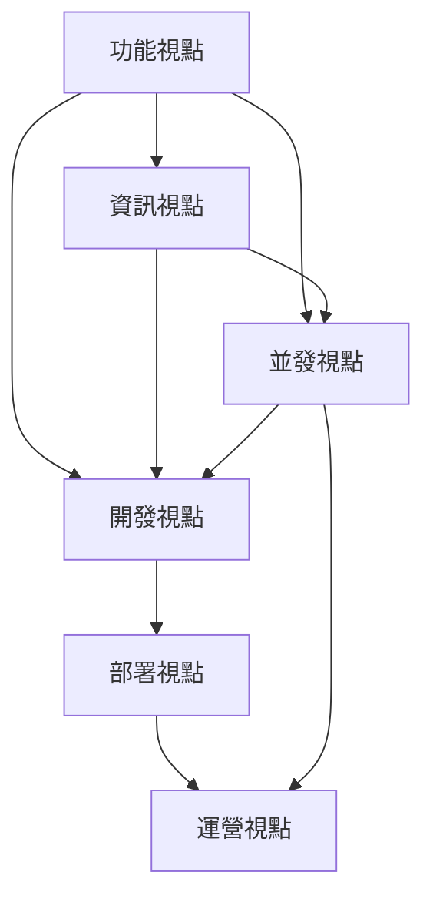

# Rozanski & Woods 七大架構視點 (Architectural Viewpoints)

> **基於 Rozanski & Woods 方法論的系統化架構文件**

## 概覽

本目錄包含基於 Rozanski & Woods 架構方法論的七大架構視點文件，每個視點從不同角度描述系統架構，為不同利害關係人提供所需的架構資訊。

## 七大架構視點

### 1. [功能視點 (Functional Viewpoint)](functional/README.md)
- **目的**: 描述系統的功能元素、職責和介面
- **利害關係人**: 業務分析師、系統分析師、開發者
- **關注點**: 功能需求、業務邏輯、系統邊界

### 2. [資訊視點 (Information Viewpoint)](information/README.md)
- **目的**: 描述系統如何儲存、操作、管理和分發資訊
- **利害關係人**: 資料架構師、資料庫管理員、開發者
- **關注點**: 資料模型、資訊流、資料一致性

### 3. [並發視點 (Concurrency Viewpoint)](concurrency/README.md)
- **目的**: 描述系統的並發結構和執行時行為
- **利害關係人**: 系統架構師、開發者、性能工程師
- **關注點**: 並發控制、同步機制、死鎖預防

### 4. [開發視點 (Development Viewpoint)](development/README.md)
- **目的**: 描述系統的開發環境和建置過程
- **利害關係人**: 開發者、建置工程師、配置管理員
- **關注點**: 模組結構、建置系統、開發工具

### 5. [部署視點 (Deployment Viewpoint)](deployment/README.md)
- **目的**: 描述系統的部署環境和運行時基礎設施
- **利害關係人**: 系統管理員、DevOps 工程師、運維團隊
- **關注點**: 硬體配置、網路拓撲、部署策略

### 6. [運營視點 (Operational Viewpoint)](operational/README.md)
- **目的**: 描述系統的運營和維護需求
- **利害關係人**: 運維工程師、系統管理員、支援團隊
- **關注點**: 監控、日誌、故障處理

## 視點間的關聯

各視點之間存在密切關聯，共同構成完整的系統架構描述：

## 使用指南

### 按角色導航
- **架構師**: 建議從功能視點開始，逐步深入其他視點
- **開發者**: 重點關注開發視點和功能視點
- **運維工程師**: 重點關注運營視點和部署視點
- **資料工程師**: 重點關注資訊視點

### 按關注點導航
- **系統設計**: 功能視點 → 資訊視點 → 並發視點
- **實現規劃**: 開發視點 → 部署視點
- **運營準備**: 運營視點

## 跨視點和觀點整合

### 📊 交叉引用資源
- **[Viewpoint-Perspective 交叉引用矩陣](../viewpoint-perspective-matrix.md)** - 完整的視點-觀點影響程度矩陣
- **[跨視點和觀點文件交叉引用連結](../cross-reference-links.md)** - 所有相關文件的連結索引

### 🎯 品質屬性觀點
- **[架構觀點 (Perspectives)](../perspectives/README.md)** - 八大跨視點的品質屬性考量
- **[安全性觀點](../perspectives/security/README.md)** - 影響所有視點的安全考量
- **[性能觀點](../perspectives/performance/README.md)** - 跨視點的性能和可擴展性
- **[可用性觀點](../perspectives/availability/README.md)** - 系統韌性和可用性保證

### 📈 視覺化和評估
- **[架構圖表](../diagrams/viewpoints/README.md)** - 視覺化架構表示
- **[Rozanski & Woods 方法論評估](../architecture/rozanski-woods-architecture-assessment.md)** - 架構成熟度評估

## 使用交叉引用的建議

### 🔍 快速查找影響關係
1. **查看矩陣**: 使用 [交叉引用矩陣](../viewpoint-perspective-matrix.md) 快速識別高影響觀點
2. **深入連結**: 使用 [交叉引用連結](../cross-reference-links.md) 導航到具體實現文件
3. **整合考量**: 在設計每個視點時，重點考慮 🔴 高影響觀點的要求

### 📋 架構設計工作流程
1. **需求分析**: 從功能視點開始，識別核心功能需求
2. **觀點檢查**: 對每個視點檢查相關的高影響觀點要求
3. **設計整合**: 確保觀點要求在視點設計中得到體現
4. **驗證合規**: 使用交叉引用驗證架構決策的完整性

---

**最後更新**: 2025年1月21日  
**維護者**: 架構團隊