# Rozanski & Woods Seven Architectural Viewpoints

> **Systematic Architecture Documentation Based on Rozanski & Woods Methodology**

## Overview

This directory contains documentation for the seven architectural viewpoints based on the Rozanski & Woods architecture methodology. Each viewpoint describes the system architecture from different perspectives, providing the necessary architectural information for different stakeholders.

## Seven Architectural Viewpoints

### 1. [Functional Viewpoint](functional/README.md)
- **Purpose**: Describe the system's functional elements, responsibilities, and interfaces
- **Stakeholders**: Business analysts, system analysts, developers
- **Concerns**: Functional requirements, business logic, system boundaries

### 2. [Information Viewpoint](information/README.md)
- **Purpose**: Describe how the system stores, manipulates, manages, and distributes information
- **Stakeholders**: Data architects, database administrators, developers
- **Concerns**: Data models, information flow, data consistency

### 3. [Concurrency Viewpoint](concurrency/README.md)
- **Purpose**: Describe the system's concurrent structure and runtime behavior
- **Stakeholders**: System architects, developers, performance engineers
- **Concerns**: Concurrency control, synchronization mechanisms, deadlock prevention

### 4. [Development Viewpoint](development/README.md)
- **Purpose**: Describe the system's development environment, build process, architectural patterns, and development best practices
- **Stakeholders**: Developers, architects, technical leads, build engineers, configuration managers
- **Concerns**: 
  - **Architectural Patterns**: DDD tactical patterns, hexagonal architecture, microservices patterns, Saga patterns
  - **Development Practices**: TDD/BDD practices, testing strategies, code quality assurance
  - **Technology Stack**: Spring Boot 3.4.5 + Java 21, frontend technology stack, testing frameworks
  - **Environment Management**: Three-stage Profile architecture (local, staging, production)
  - **Database Strategy**: JPA + Flyway integration, schema version management
  - **Toolchain**: Build systems, development tools, CI/CD integration, performance monitoring
  - **Workflows**: Development processes, code review, release management, team collaboration

### 5. [Deployment Viewpoint](deployment/README.md)
- **Purpose**: Describe the system's deployment environment and runtime infrastructure
- **Stakeholders**: System administrators, DevOps engineers, operations teams
- **Concerns**: Hardware configuration, network topology, deployment strategies

### 6. [Operational Viewpoint](operational/README.md)
- **Purpose**: Describe the system's operational and maintenance requirements
- **Stakeholders**: Operations engineers, system administrators, support teams
- **Concerns**: Monitoring, logging, incident handling

### 7. [Context Viewpoint](context/README.md)
- **Purpose**: Describe the relationships and interactions between the system and its environment
- **Stakeholders**: System architects, business analysts, compliance officers
- **Concerns**: System boundaries, external dependencies, stakeholders, regulatory compliance

## Relationships Between Viewpoints

The viewpoints are closely interconnected and together form a complete system architecture description:

```mermaid
graph TD
    Ctx[情境視點] --> F[功能視點]
    Ctx --> I[資訊視點]
    F --> I
    F --> C[並發視點]
    I --> C
    F --> Dev[開發視點]
    I --> Dev
    C --> Dev
    Ctx --> Dep[部署視點]
    Dev --> Dep
    Dep --> O[運營視點]
    C --> O
    Ctx --> O
    
    classDef contextViewpoint fill:#e1f5fe,stroke:#0277bd,stroke-width:3px
    classDef coreViewpoint fill:#f3e5f5,stroke:#7b1fa2,stroke-width:2px
    classDef implementationViewpoint fill:#e8f5e8,stroke:#388e3c,stroke-width:2px
    
    class Ctx contextViewpoint
    class F,I,C coreViewpoint
    class Dev,Dep,O implementationViewpoint
```

## Usage Guide

### Navigation by Role
- **Architects**: Recommended to start with the functional viewpoint and gradually delve into other viewpoints
- **Developers**: Focus on development viewpoint and functional viewpoint
- **Operations Engineers**: Focus on operational viewpoint and deployment viewpoint
- **Data Engineers**: Focus on information viewpoint

### Navigation by Concerns
- **System Design**: Context viewpoint → Functional viewpoint → Information viewpoint → Concurrency viewpoint
- **Implementation Planning**: Development viewpoint → Deployment viewpoint
- **Operations Preparation**: Operational viewpoint

## Cross-Viewpoint and Perspective Integration

### 📊 Cross-Reference Resources
- **[Viewpoint-Perspective Cross-Reference Matrix](../viewpoint-perspective-matrix.md)** - Complete viewpoint-perspective impact matrix
- **[Cross-Viewpoint and Perspective Document Cross-Reference Links](../cross-reference-links.md)** - Link index of all related documents

### 🎯 Quality Attribute Perspectives
- **[Architecture Perspectives](../perspectives/README.md)** - Eight cross-viewpoint quality attribute considerations
- **[Security Perspective](../perspectives/security/README.md)** - Security considerations affecting all viewpoints
- **[Performance Perspective](../perspectives/performance/README.md)** - Cross-viewpoint performance and scalability
- **[Availability Perspective](../perspectives/availability/README.md)** - System resilience and availability assurance

### 📈 Visualization and Assessment
- **[Architecture Diagrams](../diagrams/viewpoints/README.md)** - Visual architecture representations
- **[Rozanski & Woods Methodology Assessment](../architecture/rozanski-woods-architecture-assessment.md)** - Architecture maturity assessment

## Cross-Reference Usage Recommendations

### 🔍 Quick Impact Relationship Discovery
1. **View Matrix**: Use [Cross-Reference Matrix](../viewpoint-perspective-matrix.md) to quickly identify high-impact perspectives
2. **Deep Links**: Use [Cross-Reference Links](../cross-reference-links.md) to navigate to specific implementation documents
3. **Integration Considerations**: When designing each viewpoint, focus on 🔴 high-impact perspective requirements

### 📋 Architecture Design Workflow
1. **Requirements Analysis**: Start with functional viewpoint to identify core functional requirements
2. **Perspective Checks**: Check related high-impact perspective requirements for each viewpoint
3. **Design Integration**: Ensure perspective requirements are reflected in viewpoint design
4. **Compliance Verification**: Use cross-references to verify completeness of architectural decisions

---

**Last Updated**: September 24, 2025 11:28 PM (Taipei Time)  
**Maintainer**: Architecture Team
