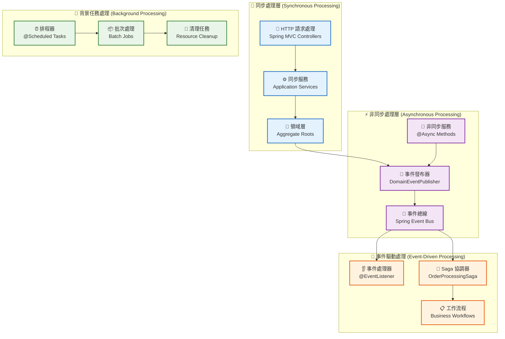

# 並發視點 (Concurrency Viewpoint)

## 概覽

並發視點描述系統的並發結構和執行時行為，關注多執行緒、非同步處理、同步機制和並發控制策略。

## 利害關係人

- **主要關注者**: 系統架構師、性能工程師、開發者
- **次要關注者**: 測試工程師、運維工程師

## 關注點

1. **並發控制**: 多執行緒和並發存取控制
2. **非同步處理**: 非同步任務和訊息處理
3. **同步機制**: 執行緒同步和協調
4. **交易邊界**: 分散式交易管理
5. **死鎖預防**: 死鎖檢測和預防機制

## 架構元素

### 非同步處理
- \1 - 非同步任務和執行緒池
- \1 - 事件驅動的並發模式

#### 非同步處理架構

*完整的非同步處理架構，包括同步處理層、非同步處理層、事件驅動處理和背景任務處理機制*

### 交易管理
- \1 - 交易範圍和邊界定義
- \1 - 並發設計模式

## 品質屬性考量

> 📋 **完整交叉引用**: 查看 [Viewpoint-Perspective 交叉引用矩陣](../../viewpoint-perspective-matrix.md#並發視點-concurrency-viewpoint) 了解所有觀點的詳細影響分析

### 🔴 高影響觀點

#### [性能觀點](../../perspectives/performance/README.md)
- **並發處理能力**: 多執行緒和並發請求的處理效率
- **執行緒池優化**: 核心執行緒數、最大執行緒數和佇列容量的配置
- **資源競爭**: 共享資源的競爭處理和鎖定策略
- **負載均衡**: 並發請求的負載分散和調度
- **相關實現**: \1 | \1

#### [可用性觀點](../../perspectives/availability/README.md)
- **死鎖預防**: 死鎖檢測、預防和自動恢復機制
- **資源隔離**: 並發資源的隔離保護，防止資源耗盡
- **故障隔離**: 並發故障的隔離處理，避免級聯失效
- **背壓處理**: 高負載情況下的流量控制和限流機制
- **相關實現**: \1 | \1

### 🟡 中影響觀點

#### [安全性觀點](../../perspectives/security/README.md)
- **執行緒安全**: 並發存取的安全控制和資料保護
- **競態條件**: 安全相關的競態條件預防和檢測
- **原子操作**: 關鍵安全操作的原子性保證
- **相關實現**: \1 | \1

#### [演進性觀點](../../perspectives/evolution/README.md)
- **並發模型演進**: 並發架構的升級和遷移策略
- **擴展性設計**: 並發處理能力的水平和垂直擴展
- **程式碼可維護性**: 並發程式碼的可讀性和可測試性
- **相關實現**: \1 | \1

#### [使用性觀點](../../perspectives/usability/README.md)
- **響應性**: 並發處理對用戶體驗的影響和優化
- **進度反饋**: 長時間並發操作的進度顯示和狀態更新
- **操作取消**: 用戶取消長時間運行操作的能力
- **相關實現**: \1 | \1

#### [成本觀點](../../perspectives/cost/README.md)
- **資源使用效率**: 並發處理的 CPU、記憶體資源使用優化
- **執行緒成本**: 執行緒創建和維護的成本控制
- **擴展成本**: 並發能力擴展的成本效益分析
- **相關實現**: \1 | \1

### 🟢 低影響觀點

#### [法規觀點](../../perspectives/regulation/README.md)
- **並發稽核**: 並發操作的稽核軌跡和合規記錄
- **相關實現**: \1

#### [位置觀點](../../perspectives/location/README.md)
- **分散式並發**: 跨地區並發處理的協調和同步
- **相關實現**: \1

## 相關圖表

- ## 事件驅動架構圖

```mermaid
graph TB
    subgraph "事件生產者" ["事件生產者 (Event Producers)"]
        subgraph "聚合根" ["Aggregate Roots"]
            ORDER_AGG[Order<br/>訂單聚合根]
            CUSTOMER_AGG[Customer<br/>客戶聚合根]
            PRODUCT_AGG[Product<br/>產品聚合根]
            PAYMENT_AGG[Payment<br/>支付聚合根]
            INVENTORY_AGG[Inventory<br/>庫存聚合根]
            NOTIFICATION_AGG[Notification<br/>通知聚合根]
            OBSERVABILITY_AGG[ObservabilityMetric<br/>可觀測性聚合根]
        end
    end
    
    subgraph "領域事件" ["領域事件 (Domain Events)"]
        subgraph "訂單事件" ["Order Events"]
            ORDER_CREATED[OrderCreatedEvent<br/>訂單已創建]
            ORDER_UPDATED[OrderUpdatedEvent<br/>訂單已更新]
            ORDER_CANCELLED[OrderCancelledEvent<br/>訂單已取消]
            ORDER_SHIPPED[OrderShippedEvent<br/>訂單已發貨]
            ORDER_DELIVERED[OrderDeliveredEvent<br/>訂單已送達]
        end
        
        subgraph "客戶事件" ["Customer Events"]
            CUSTOMER_REGISTERED[CustomerRegisteredEvent<br/>客戶已註冊]
            CUSTOMER_UPDATED[CustomerUpdatedEvent<br/>客戶已更新]
            CUSTOMER_DEACTIVATED[CustomerDeactivatedEvent<br/>客戶已停用]
        end
        
        subgraph "產品事件" ["Product Events"]
            PRODUCT_CREATED[ProductCreatedEvent<br/>產品已創建]
            PRODUCT_UPDATED[ProductUpdatedEvent<br/>產品已更新]
            PRODUCT_DISCONTINUED[ProductDiscontinuedEvent<br/>產品已停產]
        end
        
        subgraph "支付事件" ["Payment Events"]
            PAYMENT_INITIATED[PaymentInitiatedEvent<br/>支付已發起]
            PAYMENT_PROCESSED[PaymentProcessedEvent<br/>支付已處理]
            PAYMENT_FAILED[PaymentFailedEvent<br/>支付已失敗]
            PAYMENT_REFUNDED[PaymentRefundedEvent<br/>支付已退款]
        end
        
        subgraph "庫存事件" ["Inventory Events"]
            INVENTORY_ALLOCATED[InventoryAllocatedEvent<br/>庫存已分配]
            INVENTORY_RELEASED[InventoryReleasedEvent<br/>庫存已釋放]
            INVENTORY_UPDATED[InventoryUpdatedEvent<br/>庫存已更新]
            INVENTORY_LOW[InventoryLowEvent<br/>庫存不足]
        end
        
        subgraph "通知事件" ["Notification Events"]
            NOTIFICATION_SENT[NotificationSentEvent<br/>通知已發送]
            NOTIFICATION_FAILED[NotificationFailedEvent<br/>通知發送失敗]
            EMAIL_SENT[EmailSentEvent<br/>郵件已發送]
            SMS_SENT[SmsSentEvent<br/>簡訊已發送]
        end
        
        subgraph "可觀測性事件" ["Observability Events"]
            METRIC_RECORDED[MetricRecordedEvent<br/>指標已記錄]
            ALERT_TRIGGERED[AlertTriggeredEvent<br/>告警已觸發]
            TRACE_COMPLETED[TraceCompletedEvent<br/>追蹤已完成]
        end
    end
    
    subgraph "事件基礎設施" ["事件基礎設施 (Event Infrastructure)"]
        subgraph "事件發布" ["Event Publishing"]
            EVENT_COLLECTOR[DomainEventCollector<br/>領域事件收集器]
            EVENT_PUBLISHER[DomainEventPublisher<br/>領域事件發布器]
            EVENT_SERIALIZER[EventSerializer<br/>事件序列化器]
        end
        
        subgraph "事件傳輸" ["Event Transport"]
            MSK_BROKER[MSK Kafka Broker<br/>事件訊息代理]
            EVENT_BRIDGE[AWS EventBridge<br/>事件橋接器]
            SQS_QUEUE[SQS 佇列<br/>事件佇列]
            SNS_TOPIC[SNS 主題<br/>事件主題]
        end
        
        subgraph "事件存儲" ["Event Storage"]
            EVENT_STORE[EventStore DB<br/>事件存儲資料庫]
            EVENT_JOURNAL[Event Journal<br/>事件日誌]
            SNAPSHOT_STORE[Snapshot Store<br/>快照存儲]
        end
        
        subgraph "事件路由" ["Event Routing"]
            EVENT_ROUTER[EventRouter<br/>事件路由器]
            TOPIC_MANAGER[TopicManager<br/>主題管理器]
            PARTITION_STRATEGY[PartitionStrategy<br/>分區策略]
        end
    end
    
    subgraph "事件處理器" ["事件處理器 (Event Handlers)"]
        subgraph "業務流程處理器" ["Business Process Handlers"]
            ORDER_SAGA[OrderProcessingSaga<br/>訂單處理 Saga]
            PAYMENT_SAGA[PaymentProcessingSaga<br/>支付處理 Saga]
            FULFILLMENT_SAGA[FulfillmentSaga<br/>履約 Saga]
            CUSTOMER_ONBOARDING_SAGA[CustomerOnboardingSaga<br/>客戶入職 Saga]
        end
        
        subgraph "跨聚合事件處理器" ["Cross-Aggregate Handlers"]
            INVENTORY_HANDLER[InventoryEventHandler<br/>庫存事件處理器]
            NOTIFICATION_HANDLER[NotificationEventHandler<br/>通知事件處理器]
            ANALYTICS_HANDLER[AnalyticsEventHandler<br/>分析事件處理器]
            AUDIT_HANDLER[AuditEventHandler<br/>審計事件處理器]
        end
        
        subgraph "整合事件處理器" ["Integration Handlers"]
            PAYMENT_INTEGRATION_HANDLER[PaymentIntegrationHandler<br/>支付整合處理器]
            LOGISTICS_INTEGRATION_HANDLER[LogisticsIntegrationHandler<br/>物流整合處理器]
            EMAIL_INTEGRATION_HANDLER[EmailIntegrationHandler<br/>郵件整合處理器]
            SEARCH_INDEX_HANDLER[SearchIndexHandler<br/>搜尋索引處理器]
        end
        
        subgraph "可觀測性處理器" ["Observability Handlers"]
            METRICS_HANDLER[MetricsEventHandler<br/>指標事件處理器]
            LOGGING_HANDLER[LoggingEventHandler<br/>日誌事件處理器]
            TRACING_HANDLER[TracingEventHandler<br/>追蹤事件處理器]
            ALERTING_HANDLER[AlertingEventHandler<br/>告警事件處理器]
        end
    end
    
    subgraph "外部系統整合" ["外部系統整合 (External Integrations)"]
        STRIPE_API[Stripe API<br/>支付閘道]
        LOGISTICS_API[Logistics API<br/>物流系統]
        EMAIL_SERVICE[Email Service<br/>郵件服務]
        SMS_SERVICE[SMS Service<br/>簡訊服務]
        SEARCH_ENGINE[Search Engine<br/>搜尋引擎]
        ANALYTICS_PLATFORM[Analytics Platform<br/>分析平台]
        MONITORING_SYSTEM[Monitoring System<br/>監控系統]
    end
    
    subgraph "事件消費者" ["事件消費者 (Event Consumers)"]
        READ_MODEL_UPDATER[ReadModelUpdater<br/>讀模型更新器]
        PROJECTION_BUILDER[ProjectionBuilder<br/>投影構建器]
        REPORT_GENERATOR[ReportGenerator<br/>報告生成器]
        DASHBOARD_UPDATER[DashboardUpdater<br/>儀表板更新器]
    end
    
    %% 聚合根產生事件
    ORDER_AGG -->|產生| ORDER_CREATED
    ORDER_AGG -->|產生| ORDER_UPDATED
    ORDER_AGG -->|產生| ORDER_CANCELLED
    ORDER_AGG -->|產生| ORDER_SHIPPED
    ORDER_AGG -->|產生| ORDER_DELIVERED
    
    CUSTOMER_AGG -->|產生| CUSTOMER_REGISTERED
    CUSTOMER_AGG -->|產生| CUSTOMER_UPDATED
    CUSTOMER_AGG -->|產生| CUSTOMER_DEACTIVATED
    
    PRODUCT_AGG -->|產生| PRODUCT_CREATED
    PRODUCT_AGG -->|產生| PRODUCT_UPDATED
    PRODUCT_AGG -->|產生| PRODUCT_DISCONTINUED
    
    PAYMENT_AGG -->|產生| PAYMENT_INITIATED
    PAYMENT_AGG -->|產生| PAYMENT_PROCESSED
    PAYMENT_AGG -->|產生| PAYMENT_FAILED
    PAYMENT_AGG -->|產生| PAYMENT_REFUNDED
    
    INVENTORY_AGG -->|產生| INVENTORY_ALLOCATED
    INVENTORY_AGG -->|產生| INVENTORY_RELEASED
    INVENTORY_AGG -->|產生| INVENTORY_UPDATED
    INVENTORY_AGG -->|產生| INVENTORY_LOW
    
    NOTIFICATION_AGG -->|產生| NOTIFICATION_SENT
    NOTIFICATION_AGG -->|產生| NOTIFICATION_FAILED
    NOTIFICATION_AGG -->|產生| EMAIL_SENT
    NOTIFICATION_AGG -->|產生| SMS_SENT
    
    OBSERVABILITY_AGG -->|產生| METRIC_RECORDED
    OBSERVABILITY_AGG -->|產生| ALERT_TRIGGERED
    OBSERVABILITY_AGG -->|產生| TRACE_COMPLETED
    
    %% 事件收集和發布
    ORDER_CREATED -->|收集| EVENT_COLLECTOR
    CUSTOMER_REGISTERED -->|收集| EVENT_COLLECTOR
    PAYMENT_PROCESSED -->|收集| EVENT_COLLECTOR
    INVENTORY_UPDATED -->|收集| EVENT_COLLECTOR
    
    EVENT_COLLECTOR -->|發布| EVENT_PUBLISHER
    EVENT_PUBLISHER -->|序列化| EVENT_SERIALIZER
    EVENT_SERIALIZER -->|傳輸| MSK_BROKER
    EVENT_SERIALIZER -->|傳輸| EVENT_BRIDGE
    EVENT_SERIALIZER -->|佇列| SQS_QUEUE
    EVENT_SERIALIZER -->|主題| SNS_TOPIC
    
    %% 事件存儲
    EVENT_PUBLISHER -->|存儲| EVENT_STORE
    EVENT_STORE -->|日誌| EVENT_JOURNAL
    EVENT_STORE -->|快照| SNAPSHOT_STORE
    
    %% 事件路由
    MSK_BROKER -->|路由| EVENT_ROUTER
    EVENT_ROUTER -->|管理| TOPIC_MANAGER
    EVENT_ROUTER -->|分區| PARTITION_STRATEGY
    
    %% Saga 處理
    ORDER_CREATED -->|觸發| ORDER_SAGA
    PAYMENT_INITIATED -->|觸發| PAYMENT_SAGA
    ORDER_SHIPPED -->|觸發| FULFILLMENT_SAGA
    CUSTOMER_REGISTERED -->|觸發| CUSTOMER_ONBOARDING_SAGA
    
    %% 跨聚合處理
    INVENTORY_LOW -->|處理| INVENTORY_HANDLER
    ORDER_CREATED -->|處理| NOTIFICATION_HANDLER
    PAYMENT_PROCESSED -->|處理| ANALYTICS_HANDLER
    ORDER_UPDATED -->|處理| AUDIT_HANDLER
    
    %% 整合處理
    PAYMENT_INITIATED -->|處理| PAYMENT_INTEGRATION_HANDLER
    ORDER_SHIPPED -->|處理| LOGISTICS_INTEGRATION_HANDLER
    CUSTOMER_REGISTERED -->|處理| EMAIL_INTEGRATION_HANDLER
    PRODUCT_UPDATED -->|處理| SEARCH_INDEX_HANDLER
    
    %% 可觀測性處理
    METRIC_RECORDED -->|處理| METRICS_HANDLER
    ORDER_CREATED -->|處理| LOGGING_HANDLER
    PAYMENT_PROCESSED -->|處理| TRACING_HANDLER
    ALERT_TRIGGERED -->|處理| ALERTING_HANDLER
    
    %% 外部系統整合
    PAYMENT_INTEGRATION_HANDLER -->|調用| STRIPE_API
    LOGISTICS_INTEGRATION_HANDLER -->|調用| LOGISTICS_API
    EMAIL_INTEGRATION_HANDLER -->|調用| EMAIL_SERVICE
    NOTIFICATION_HANDLER -->|調用| SMS_SERVICE
    SEARCH_INDEX_HANDLER -->|更新| SEARCH_ENGINE
    ANALYTICS_HANDLER -->|發送| ANALYTICS_PLATFORM
    METRICS_HANDLER -->|發送| MONITORING_SYSTEM
    
    %% 事件消費
    ORDER_CREATED -->|更新| READ_MODEL_UPDATER
    CUSTOMER_REGISTERED -->|構建| PROJECTION_BUILDER
    PAYMENT_PROCESSED -->|生成| REPORT_GENERATOR
    INVENTORY_UPDATED -->|更新| DASHBOARD_UPDATER
    
    %% Saga 協調
    ORDER_SAGA -->|協調| PAYMENT_INITIATED
    ORDER_SAGA -->|協調| INVENTORY_ALLOCATED
    PAYMENT_SAGA -->|協調| PAYMENT_PROCESSED
    FULFILLMENT_SAGA -->|協調| ORDER_DELIVERED
    
    classDef producer fill:#e8f5e8,stroke:#2e7d32,stroke-width:2px
    classDef event fill:#fff3e0,stroke:#f57c00,stroke-width:2px
    classDef infrastructure fill:#e3f2fd,stroke:#1565c0,stroke-width:2px
    classDef handler fill:#f3e5f5,stroke:#7b1fa2,stroke-width:2px
    classDef external fill:#ffebee,stroke:#c62828,stroke-width:2px
    classDef consumer fill:#e0f2f1,stroke:#00695c,stroke-width:2px
    
    class ORDER_AGG,CUSTOMER_AGG,PRODUCT_AGG,PAYMENT_AGG,INVENTORY_AGG,NOTIFICATION_AGG,OBSERVABILITY_AGG producer
    class ORDER_CREATED,ORDER_UPDATED,ORDER_CANCELLED,ORDER_SHIPPED,ORDER_DELIVERED,CUSTOMER_REGISTERED,CUSTOMER_UPDATED,CUSTOMER_DEACTIVATED,PRODUCT_CREATED,PRODUCT_UPDATED,PRODUCT_DISCONTINUED,PAYMENT_INITIATED,PAYMENT_PROCESSED,PAYMENT_FAILED,PAYMENT_REFUNDED,INVENTORY_ALLOCATED,INVENTORY_RELEASED,INVENTORY_UPDATED,INVENTORY_LOW,NOTIFICATION_SENT,NOTIFICATION_FAILED,EMAIL_SENT,SMS_SENT,METRIC_RECORDED,ALERT_TRIGGERED,TRACE_COMPLETED event
    class EVENT_COLLECTOR,EVENT_PUBLISHER,EVENT_SERIALIZER,MSK_BROKER,EVENT_BRIDGE,SQS_QUEUE,SNS_TOPIC,EVENT_STORE,EVENT_JOURNAL,SNAPSHOT_STORE,EVENT_ROUTER,TOPIC_MANAGER,PARTITION_STRATEGY infrastructure
    class ORDER_SAGA,PAYMENT_SAGA,FULFILLMENT_SAGA,CUSTOMER_ONBOARDING_SAGA,INVENTORY_HANDLER,NOTIFICATION_HANDLER,ANALYTICS_HANDLER,AUDIT_HANDLER,PAYMENT_INTEGRATION_HANDLER,LOGISTICS_INTEGRATION_HANDLER,EMAIL_INTEGRATION_HANDLER,SEARCH_INDEX_HANDLER,METRICS_HANDLER,LOGGING_HANDLER,TRACING_HANDLER,ALERTING_HANDLER handler
    class STRIPE_API,LOGISTICS_API,EMAIL_SERVICE,SMS_SERVICE,SEARCH_ENGINE,ANALYTICS_PLATFORM,MONITORING_SYSTEM external
    class READ_MODEL_UPDATER,PROJECTION_BUILDER,REPORT_GENERATOR,DASHBOARD_UPDATER consumer
```

- ## 非同步處理流程

```mermaid
graph TB
    subgraph "同步處理層" ["同步處理層 (Synchronous Processing)"]
        WEB_REQUEST[Web 請求<br/>HTTP Request]
        API_CONTROLLER[API 控制器<br/>REST Controller]
        APP_SERVICE[應用服務<br/>Application Service]
        VALIDATION[輸入驗證<br/>Input Validation]
        IMMEDIATE_RESPONSE[即時響應<br/>Immediate Response]
    end
    
    subgraph "非同步處理層" ["非同步處理層 (Asynchronous Processing)"]
        subgraph "事件驅動處理" ["Event-Driven Processing"]
            EVENT_PUBLISHER[事件發布器<br/>Event Publisher]
            EVENT_BUS[事件匯流排<br/>Event Bus]
            EVENT_HANDLER[事件處理器<br/>Event Handler]
            SAGA_COORDINATOR[Saga 協調器<br/>Saga Coordinator]
        end
        
        subgraph "背景任務處理" ["Background Task Processing"]
            TASK_SCHEDULER[任務調度器<br/>Task Scheduler]
            ASYNC_EXECUTOR[非同步執行器<br/>Async Executor]
            BATCH_PROCESSOR[批次處理器<br/>Batch Processor]
            RETRY_MECHANISM[重試機制<br/>Retry Mechanism]
        end
        
        subgraph "訊息佇列處理" ["Message Queue Processing"]
            MESSAGE_PRODUCER[訊息生產者<br/>Message Producer]
            MESSAGE_QUEUE[訊息佇列<br/>Message Queue]
            MESSAGE_CONSUMER[訊息消費者<br/>Message Consumer]
            DLQ[死信佇列<br/>Dead Letter Queue]
        end
    end
    
    subgraph "並發控制" ["並發控制 (Concurrency Control)"]
        subgraph "鎖定機制" ["Locking Mechanisms"]
            OPTIMISTIC_LOCK[樂觀鎖<br/>Optimistic Locking]
            PESSIMISTIC_LOCK[悲觀鎖<br/>Pessimistic Locking]
            DISTRIBUTED_LOCK[分散式鎖<br/>Distributed Lock]
        end
        
        subgraph "線程池管理" ["Thread Pool Management"]
            WEB_THREAD_POOL[Web 線程池<br/>Web Thread Pool]
            ASYNC_THREAD_POOL[非同步線程池<br/>Async Thread Pool]
            SCHEDULED_THREAD_POOL[調度線程池<br/>Scheduled Thread Pool]
            VIRTUAL_THREAD_POOL[虛擬線程池<br/>Virtual Thread Pool]
        end
        
        subgraph "資源管理" ["Resource Management"]
            CONNECTION_POOL[連接池<br/>Connection Pool]
            CACHE_MANAGER[快取管理器<br/>Cache Manager]
            RATE_LIMITER[速率限制器<br/>Rate Limiter]
            CIRCUIT_BREAKER[斷路器<br/>Circuit Breaker]
        end
    end
    
    subgraph "非同步模式" ["非同步模式 (Async Patterns)"]
        subgraph "Future 模式" ["Future Pattern"]
            COMPLETABLE_FUTURE[CompletableFuture<br/>可完成的 Future]
            ASYNC_RESULT[非同步結果<br/>Async Result]
            CALLBACK_HANDLER[回調處理器<br/>Callback Handler]
        end
        
        subgraph "響應式模式" ["Reactive Pattern"]
            REACTIVE_STREAM[響應式流<br/>Reactive Stream]
            PUBLISHER[發布者<br/>Publisher]
            SUBSCRIBER[訂閱者<br/>Subscriber]
            BACKPRESSURE[背壓控制<br/>Backpressure]
        end
        
        subgraph "Actor 模式" ["Actor Pattern"]
            ACTOR_SYSTEM[Actor 系統<br/>Actor System]
            MESSAGE_PASSING[訊息傳遞<br/>Message Passing]
            MAILBOX[信箱<br/>Mailbox]
        end
    end
    
    subgraph "外部系統整合" ["外部系統整合 (External Integration)"]
        PAYMENT_API[支付 API<br/>Payment API]
        EMAIL_SERVICE[郵件服務<br/>Email Service]
        LOGISTICS_API[物流 API<br/>Logistics API]
        SEARCH_ENGINE[搜尋引擎<br/>Search Engine]
        ANALYTICS_SERVICE[分析服務<br/>Analytics Service]
    end
    
    subgraph "監控和可觀測性" ["監控和可觀測性 (Monitoring)"]
        ASYNC_METRICS[非同步指標<br/>Async Metrics]
        THREAD_MONITORING[線程監控<br/>Thread Monitoring]
        QUEUE_MONITORING[佇列監控<br/>Queue Monitoring]
        PERFORMANCE_TRACKING[性能追蹤<br/>Performance Tracking]
    end
    
    %% 同步處理流程
    WEB_REQUEST -->|HTTP| API_CONTROLLER
    API_CONTROLLER -->|調用| APP_SERVICE
    APP_SERVICE -->|驗證| VALIDATION
    VALIDATION -->|通過| IMMEDIATE_RESPONSE
    API_CONTROLLER -->|返回| IMMEDIATE_RESPONSE
    
    %% 非同步事件處理
    APP_SERVICE -->|發布事件| EVENT_PUBLISHER
    EVENT_PUBLISHER -->|發送| EVENT_BUS
    EVENT_BUS -->|分發| EVENT_HANDLER
    EVENT_HANDLER -->|協調| SAGA_COORDINATOR
    
    %% 背景任務處理
    APP_SERVICE -->|提交任務| TASK_SCHEDULER
    TASK_SCHEDULER -->|執行| ASYNC_EXECUTOR
    ASYNC_EXECUTOR -->|批次處理| BATCH_PROCESSOR
    BATCH_PROCESSOR -->|失敗重試| RETRY_MECHANISM
    
    %% 訊息佇列處理
    EVENT_PUBLISHER -->|生產訊息| MESSAGE_PRODUCER
    MESSAGE_PRODUCER -->|發送| MESSAGE_QUEUE
    MESSAGE_QUEUE -->|消費| MESSAGE_CONSUMER
    MESSAGE_CONSUMER -->|失敗| DLQ
    
    %% 並發控制
    APP_SERVICE -->|使用| OPTIMISTIC_LOCK
    SAGA_COORDINATOR -->|使用| DISTRIBUTED_LOCK
    ASYNC_EXECUTOR -->|管理| ASYNC_THREAD_POOL
    API_CONTROLLER -->|使用| WEB_THREAD_POOL
    TASK_SCHEDULER -->|使用| SCHEDULED_THREAD_POOL
    
    %% 資源管理
    APP_SERVICE -->|使用| CONNECTION_POOL
    EVENT_HANDLER -->|使用| CACHE_MANAGER
    API_CONTROLLER -->|限制| RATE_LIMITER
    MESSAGE_CONSUMER -->|保護| CIRCUIT_BREAKER
    
    %% 非同步模式
    ASYNC_EXECUTOR -->|返回| COMPLETABLE_FUTURE
    COMPLETABLE_FUTURE -->|完成| ASYNC_RESULT
    ASYNC_RESULT -->|回調| CALLBACK_HANDLER
    
    EVENT_BUS -->|流| REACTIVE_STREAM
    REACTIVE_STREAM -->|發布| PUBLISHER
    PUBLISHER -->|訂閱| SUBSCRIBER
    SUBSCRIBER -->|控制| BACKPRESSURE
    
    SAGA_COORDINATOR -->|使用| ACTOR_SYSTEM
    ACTOR_SYSTEM -->|傳遞| MESSAGE_PASSING
    MESSAGE_PASSING -->|存儲| MAILBOX
    
    %% 外部系統整合
    EVENT_HANDLER -->|調用| PAYMENT_API
    MESSAGE_CONSUMER -->|發送| EMAIL_SERVICE
    ASYNC_EXECUTOR -->|查詢| LOGISTICS_API
    BATCH_PROCESSOR -->|索引| SEARCH_ENGINE
    SAGA_COORDINATOR -->|報告| ANALYTICS_SERVICE
    
    %% 監控
    ASYNC_EXECUTOR -->|指標| ASYNC_METRICS
    ASYNC_THREAD_POOL -->|監控| THREAD_MONITORING
    MESSAGE_QUEUE -->|監控| QUEUE_MONITORING
    COMPLETABLE_FUTURE -->|追蹤| PERFORMANCE_TRACKING
    
    classDef sync fill:#e3f2fd,stroke:#1565c0,stroke-width:2px
    classDef async fill:#f3e5f5,stroke:#7b1fa2,stroke-width:2px
    classDef concurrency fill:#e8f5e8,stroke:#2e7d32,stroke-width:2px
    classDef pattern fill:#fff3e0,stroke:#f57c00,stroke-width:2px
    classDef external fill:#ffebee,stroke:#c62828,stroke-width:2px
    classDef monitoring fill:#f1f8e9,stroke:#33691e,stroke-width:2px
    
    class WEB_REQUEST,API_CONTROLLER,APP_SERVICE,VALIDATION,IMMEDIATE_RESPONSE sync
    class EVENT_PUBLISHER,EVENT_BUS,EVENT_HANDLER,SAGA_COORDINATOR,TASK_SCHEDULER,ASYNC_EXECUTOR,BATCH_PROCESSOR,RETRY_MECHANISM,MESSAGE_PRODUCER,MESSAGE_QUEUE,MESSAGE_CONSUMER,DLQ async
    class OPTIMISTIC_LOCK,PESSIMISTIC_LOCK,DISTRIBUTED_LOCK,WEB_THREAD_POOL,ASYNC_THREAD_POOL,SCHEDULED_THREAD_POOL,VIRTUAL_THREAD_POOL,CONNECTION_POOL,CACHE_MANAGER,RATE_LIMITER,CIRCUIT_BREAKER concurrency
    class COMPLETABLE_FUTURE,ASYNC_RESULT,CALLBACK_HANDLER,REACTIVE_STREAM,PUBLISHER,SUBSCRIBER,BACKPRESSURE,ACTOR_SYSTEM,MESSAGE_PASSING,MAILBOX pattern
    class PAYMENT_API,EMAIL_SERVICE,LOGISTICS_API,SEARCH_ENGINE,ANALYTICS_SERVICE external
    class ASYNC_METRICS,THREAD_MONITORING,QUEUE_MONITORING,PERFORMANCE_TRACKING monitoring
```

## 與其他視點的關聯

- **功能視點**: 業務功能的並發需求
- **資訊視點**: 資料存取的並發控制
- **開發視點**: 並發程式碼的實現
- **部署視點**: 並發資源的配置
- **運營視點**: 並發性能的監控

## 實現指南

### 非同步處理實現
1. **@Async 註解**: Spring 非同步方法
2. **CompletableFuture**: 非同步程式設計
3. **執行緒池配置**: TaskExecutor 配置
4. **異常處理**: 非同步異常處理

### 事件驅動並發
1. **領域事件**: 非同步事件處理
2. **訊息佇列**: 解耦和並發處理
3. **事件處理器**: 並發事件處理
4. **背壓處理**: 流量控制機制

### 交易邊界管理
1. **@Transactional**: 交易邊界定義
2. **傳播行為**: 交易傳播策略
3. **隔離級別**: 並發隔離控制
4. **分散式交易**: Saga 模式實現

## 驗證標準

- [ ] 並發存取安全性驗證
- [ ] 死鎖預防機制測試
- [ ] 非同步處理性能測試
- [ ] 交易一致性驗證
- [ ] 並發負載測試
- [ ] 資源競爭處理驗證

---

**相關文件**:
- \1
- \1
- \1