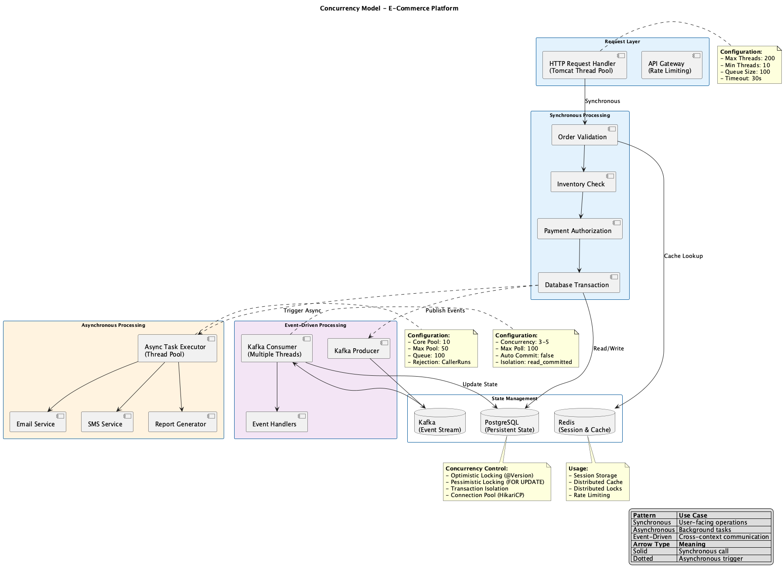
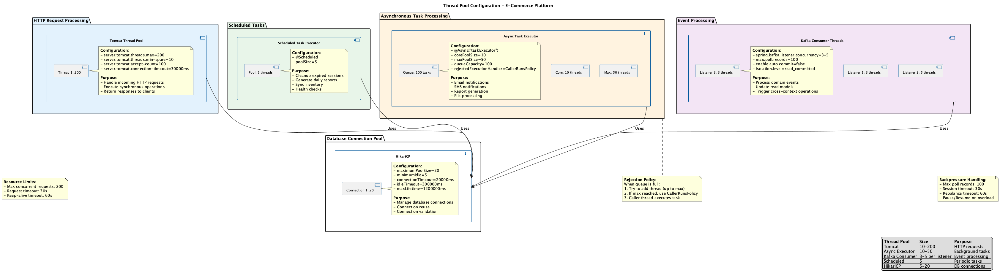
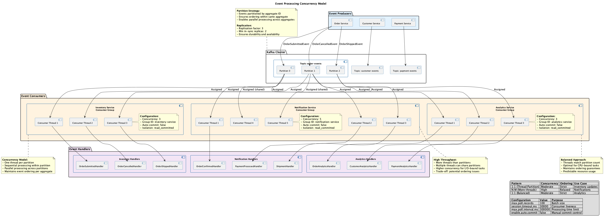

# Concurrency Viewpoint Overview

> **Viewpoint**: Concurrency  
> **Purpose**: Describe how the system handles concurrent operations and manages shared resources  
> **Audience**: Architects, Developers, Operations Team, Performance Engineers

## Purpose

The Concurrency Viewpoint describes how the E-Commerce Platform manages concurrent operations, handles multiple simultaneous requests, and ensures data consistency in a distributed environment. This viewpoint is critical for understanding system scalability, performance, and reliability.

## Key Concerns

This viewpoint addresses the following concerns:

1. **Concurrent Request Handling**: How the system processes multiple simultaneous user requests
2. **Data Consistency**: How the system maintains data integrity under concurrent access
3. **Resource Contention**: How the system manages access to shared resources
4. **Synchronization Mechanisms**: What techniques are used to coordinate concurrent operations
5. **State Management**: How the system manages state in a distributed environment
6. **Performance Under Load**: How concurrency affects system performance and scalability

## Concurrency Model Overview

### Event-Driven Architecture

The E-Commerce Platform uses an **event-driven architecture** as its primary concurrency model. This approach provides:

- **Loose Coupling**: Components communicate through events, reducing direct dependencies
- **Asynchronous Processing**: Non-critical operations are processed asynchronously
- **Scalability**: Event consumers can be scaled independently
- **Resilience**: Failures in one component don't cascade to others



*Figure 1: Overall concurrency model showing synchronous, asynchronous, and event-driven processing layers*

### Hybrid Synchronous-Asynchronous Model

The system employs a hybrid model that combines:

**Synchronous Operations** (Request-Response):

- User-facing API calls requiring immediate response
- Payment processing requiring real-time confirmation
- Inventory checks requiring immediate availability status
- Order submission requiring immediate validation

**Asynchronous Operations** (Event-Driven):

- Email and SMS notifications
- Analytics and reporting
- Inventory synchronization with external systems
- Background data processing

### Concurrency Levels

The system handles concurrency at multiple levels:

1. **Application Level**
   - Spring Boot thread pools for HTTP request handling
   - Async task executors for background processing
   - Kafka consumers for event processing

2. **Database Level**
   - Connection pooling (HikariCP)
   - Transaction isolation levels
   - Optimistic and pessimistic locking

3. **Distributed Level**
   - Redis distributed locks
   - Event-driven coordination via Kafka
   - API rate limiting and throttling

## Concurrency Challenges

### Challenge 1: Inventory Management

**Problem**: Multiple customers attempting to purchase the last item in stock simultaneously.

**Solution**:

- Distributed locking (Redis) for inventory reservation
- Optimistic locking with version numbers
- Inventory reservation timeout mechanism
- Compensation logic for failed orders

### Challenge 2: Order Processing

**Problem**: Ensuring order processing steps execute in correct sequence without race conditions.

**Solution**:

- Saga pattern for distributed transactions
- Event sourcing for order state tracking
- Idempotent event handlers
- Retry mechanisms with exponential backoff

### Challenge 3: Payment Processing

**Problem**: Preventing duplicate payment charges for the same order.

**Solution**:

- Idempotency keys for payment API calls
- Database unique constraints
- Distributed locks during payment processing
- Payment status reconciliation

### Challenge 4: Shopping Cart Consistency

**Problem**: Maintaining cart consistency across multiple user sessions and devices.

**Solution**:

- Redis-based session storage
- Optimistic locking for cart updates
- Cart merge strategy for multi-device access
- Periodic cart cleanup for abandoned carts

## Concurrency Strategies

### 1. Stateless Design

**Principle**: Application services are stateless to enable horizontal scaling.

**Implementation**:

- No in-memory session state in application servers
- JWT tokens for authentication (stateless)
- Redis for distributed session storage
- Database for persistent state

**Benefits**:

- Easy horizontal scaling
- No session affinity required
- Simplified deployment and rollback
- Better fault tolerance

### 2. Optimistic Concurrency Control

**Principle**: Assume conflicts are rare; detect and resolve when they occur.

**Implementation**:

- JPA `@Version` annotation for entity versioning
- Version checking before updates
- Retry logic for version conflicts
- User-friendly conflict resolution

**Use Cases**:

- Product catalog updates
- Customer profile updates
- Shopping cart modifications
- Non-critical inventory updates

### 3. Pessimistic Concurrency Control

**Principle**: Prevent conflicts by locking resources before access.

**Implementation**:

- Database row-level locks (`SELECT ... FOR UPDATE`)
- Redis distributed locks (Redisson)
- Lock timeout configuration
- Deadlock detection and prevention

**Use Cases**:

- Critical inventory operations
- Payment processing
- Order finalization
- High-contention resources

### 4. Event-Driven Coordination

**Principle**: Coordinate distributed operations through domain events.

**Implementation**:

- Kafka for event streaming
- Event sourcing for audit trail
- Idempotent event handlers
- Dead letter queues for failed events

**Use Cases**:

- Cross-context communication
- Asynchronous notifications
- Analytics and reporting
- Workflow orchestration

## Thread Management



*Figure 2: Thread pool configuration for different processing layers*

### HTTP Request Handling

**Configuration**:

```yaml
server:
  tomcat:
    threads:
      max: 200          # Maximum threads
      min-spare: 10     # Minimum idle threads
    accept-count: 100   # Queue size for pending requests
    max-connections: 10000
```

**Characteristics**:

- One thread per HTTP request
- Thread pool managed by Tomcat
- Blocking I/O for synchronous operations
- Non-blocking I/O for async operations

### Asynchronous Task Execution

**Configuration**:

```java
@Configuration
@EnableAsync
public class AsyncConfiguration {
    @Bean(name = "taskExecutor")
    public Executor taskExecutor() {
        ThreadPoolTaskExecutor executor = new ThreadPoolTaskExecutor();
        executor.setCorePoolSize(10);
        executor.setMaxPoolSize(50);
        executor.setQueueCapacity(100);
        executor.setThreadNamePrefix("async-task-");
        executor.initialize();
        return executor;
    }
}
```

**Use Cases**:

- Email sending
- SMS notifications
- Report generation
- Data export

### Kafka Event Processing



*Figure 3: Event processing concurrency model with partition assignment and consumer groups*

**Configuration**:

```yaml
spring:
  kafka:
    consumer:
      concurrency: 3    # Threads per consumer
      max-poll-records: 100
    listener:
      concurrency: 5    # Concurrent listeners
```

**Characteristics**:

- Multiple consumer threads per topic
- Parallel event processing
- Ordered processing within partition
- Automatic offset management

## Transaction Management

### Transaction Boundaries

**Principle**: Keep transactions short and focused.

**Implementation**:

- `@Transactional` at application service level
- Read-only transactions for queries
- Separate transactions for independent operations
- Avoid distributed transactions when possible

### Transaction Isolation Levels

**Default**: `READ_COMMITTED`

**Rationale**:

- Prevents dirty reads
- Allows concurrent reads
- Good balance between consistency and performance
- Suitable for most e-commerce operations

**Special Cases**:

- `SERIALIZABLE` for critical financial operations
- `READ_UNCOMMITTED` for analytics (read-only)

### Distributed Transaction Handling

**Approach**: Saga Pattern (Choreography-based)

**Implementation**:

1. Each service publishes domain events
2. Other services react to events
3. Compensation events for rollback
4. Eventual consistency across contexts

**Example**: Order Processing Saga

```text
OrderCreated → InventoryReserved → PaymentProcessed → OrderConfirmed
     ↓              ↓                    ↓                  ↓
  (Fail)    → InventoryReleased  → PaymentRefunded → OrderCancelled
```

## State Management

### Session State

**Storage**: Redis (distributed session store)

**Configuration**:

```yaml
spring:
  session:
    store-type: redis
    timeout: 30m
    redis:
      flush-mode: on-save
```

**Characteristics**:

- Shared across all application instances
- Automatic expiration
- Serializable session attributes
- High availability with Redis cluster

### Application State

**Principle**: Minimize mutable shared state.

**Guidelines**:

- Use immutable value objects
- Avoid static mutable fields
- Use thread-safe collections when needed
- Prefer stateless services

### Cache State

**Storage**: Redis (distributed cache)

**Strategy**:

- Cache-aside pattern
- TTL-based expiration
- Cache invalidation via events
- Fallback to database on cache miss

## Synchronization Mechanisms

### Distributed Locking

**Technology**: Redis with Redisson

**Use Cases**:

- Inventory reservation
- Order processing
- Payment processing
- Critical resource access

**Configuration**:

```java
@Configuration
public class RedissonConfiguration {
    @Bean
    public RedissonClient redissonClient() {
        Config config = new Config();
        config.useSingleServer()
            .setAddress("redis://localhost:6379")
            .setConnectionPoolSize(50)
            .setConnectionMinimumIdleSize(10);
        return Redisson.create(config);
    }
}
```

### Database Locking

**Optimistic Locking**:

```java
@Entity
public class Product {
    @Version
    private Long version;
    // ... other fields
}
```

**Pessimistic Locking**:

```java
@Lock(LockModeType.PESSIMISTIC_WRITE)
@Query("SELECT i FROM Inventory i WHERE i.productId = :productId")
Inventory findByProductIdForUpdate(@Param("productId") String productId);
```

### Event-Based Synchronization

**Mechanism**: Kafka topics with ordered partitions

**Guarantees**:

- Events in same partition are processed in order
- At-least-once delivery
- Idempotent event handlers
- Dead letter queue for failures

## Performance Considerations

### Concurrency vs. Performance Trade-offs

**High Concurrency Benefits**:

- Better resource utilization
- Higher throughput
- Improved scalability

**High Concurrency Costs**:

- Increased context switching
- Lock contention
- Memory overhead
- Complexity in debugging

### Optimization Strategies

1. **Minimize Lock Scope**
   - Lock only what's necessary
   - Release locks as soon as possible
   - Use fine-grained locking

2. **Reduce Lock Contention**
   - Partition data to reduce conflicts
   - Use optimistic locking when possible
   - Implement retry with backoff

3. **Asynchronous Processing**
   - Offload non-critical operations
   - Use message queues
   - Batch processing for efficiency

4. **Connection Pooling**
   - Reuse database connections
   - Configure appropriate pool sizes
   - Monitor pool utilization

## Monitoring and Observability

### Key Metrics

**Thread Pool Metrics**:

- Active threads
- Queue size
- Rejected tasks
- Average task execution time

**Lock Metrics**:

- Lock acquisition time
- Lock hold time
- Lock contention rate
- Deadlock occurrences

**Transaction Metrics**:

- Transaction duration
- Rollback rate
- Deadlock rate
- Connection pool usage

**Event Processing Metrics**:

- Event processing lag
- Event processing rate
- Failed event count
- Dead letter queue size

### Monitoring Tools

- **Micrometer**: Application metrics
- **CloudWatch**: AWS infrastructure metrics
- **X-Ray**: Distributed tracing
- **Grafana**: Visualization dashboards
- **Prometheus**: Metrics collection

## Related Documentation

### Detailed Documentation

- [Synchronous vs Asynchronous Operations](sync-async-operations.md) - Operation classification →
- [Synchronization Mechanisms](synchronization.md) - Detailed synchronization techniques →
- [State Management](state-management.md) - State handling strategies →

### Related Viewpoints

- [Functional Viewpoint](../functional/overview.md) - System capabilities
- [Information Viewpoint](../information/overview.md) - Data management
- [Deployment Viewpoint](../deployment/overview.md) - Infrastructure
- [Operational Viewpoint](../operational/overview.md) - Operations

### Related Perspectives

- [Performance Perspective](../../perspectives/performance/overview.md) - Performance requirements
- [Availability Perspective](../../perspectives/availability/overview.md) - Reliability requirements
- [Scalability Perspective](../../perspectives/performance/scalability.md) - Scaling strategies

---

**Document Status**: Active  
**Last Review**: 2025-10-23  
**Next Review**: 2025-11-23  
**Owner**: Architecture Team
