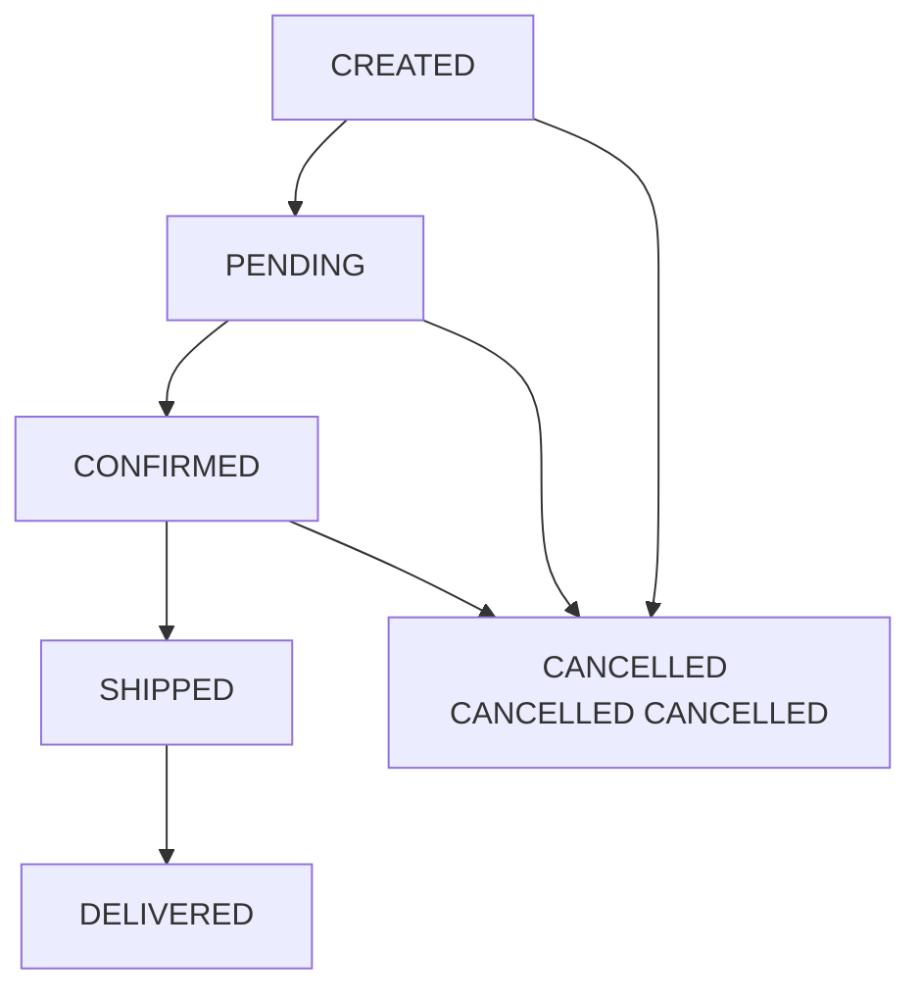

# State Management

> **Viewpoint**: Concurrency  
> **Purpose**: Document how the system manages state in a distributed environment  
> **Audience**: Architects, Developers, Operations Team

## Overview

This document describes how the E-Commerce Platform manages state across distributed components, ensuring consistency, scalability, and reliability in a concurrent environment.

## State Management Principles

### 1. Stateless by Default

**Principle**: Application services should be stateless to enable horizontal scaling.

**Benefits**:

- Easy horizontal scaling
- No session affinity required
- Simplified deployment and rollback
- Better fault tolerance
- Load balancing flexibility

**Implementation**:

- No in-memory session state in application servers
- All state stored in external systems (database, cache)
- JWT tokens for authentication (self-contained)
- Idempotent operations

### 2. Externalize State

**Principle**: Store state in dedicated, scalable storage systems.

**State Storage Options**:

- **Database (PostgreSQL)**: Persistent, transactional state
- **Cache (Redis)**: Temporary, fast-access state
- **Message Queue (Kafka)**: Event state and history
- **Object Storage (S3)**: File and media state

### 3. Eventual Consistency

**Principle**: Accept eventual consistency for non-critical state.

**Use Cases**:

- Analytics and reporting
- Search indexes
- Cache updates
- Cross-context data synchronization

## State Categories

### 1. User Session State

#### Authentication State

**Storage**: JWT Token (Stateless)

**Implementation**:

```java
@Component
public class JwtTokenProvider {
    
    private final String jwtSecret;
    private final long jwtExpirationMs = 86400000; // 24 hours
    
    public String generateToken(UserDetails userDetails) {
        Map<String, Object> claims = new HashMap<>();
        claims.put("userId", userDetails.getUsername());
        claims.put("roles", userDetails.getAuthorities());
        
        return Jwts.builder()
            .setClaims(claims)
            .setSubject(userDetails.getUsername())
            .setIssuedAt(new Date())
            .setExpiration(new Date(System.currentTimeMillis() + jwtExpirationMs))
            .signWith(SignatureAlgorithm.HS512, jwtSecret)
            .compact();
    }
    
    public boolean validateToken(String token) {
        try {
            Jwts.parser().setSigningKey(jwtSecret).parseClaimsJws(token);
            return true;
        } catch (JwtException e) {
            return false;
        }
    }
}
```

**Characteristics**:

- Self-contained (no server-side storage)
- Stateless authentication
- Cannot be revoked (until expiration)
- Includes user identity and roles

**Token Revocation Strategy**:

```java
@Component
public class TokenBlacklistService {
    
    private final RedisTemplate<String, String> redisTemplate;
    
    public void revokeToken(String token) {
        String tokenId = extractTokenId(token);
        long expirationTime = extractExpiration(token);
        long ttl = expirationTime - System.currentTimeMillis();
        
        if (ttl > 0) {
            redisTemplate.opsForValue().set(
                "blacklist:" + tokenId,
                "revoked",
                Duration.ofMillis(ttl)
            );
        }
    }
    
    public boolean isTokenRevoked(String token) {
        String tokenId = extractTokenId(token);
        return redisTemplate.hasKey("blacklist:" + tokenId);
    }
}
```

---

#### Shopping Cart State

**Storage**: Redis (Distributed Session)

**Configuration**:

```yaml
spring:
  session:
    store-type: redis
    timeout: 30m
    redis:
      flush-mode: on-save
      namespace: spring:session
```

**Implementation**:

```java
@Service
public class ShoppingCartService {
    
    private final RedisTemplate<String, ShoppingCart> cartTemplate;
    
    public ShoppingCart getCart(String sessionId) {
        String key = "cart:" + sessionId;
        ShoppingCart cart = cartTemplate.opsForValue().get(key);
        
        if (cart == null) {
            cart = new ShoppingCart(sessionId);
            saveCart(cart);
        }
        
        return cart;
    }
    
    public void saveCart(ShoppingCart cart) {
        String key = "cart:" + cart.getSessionId();
        cartTemplate.opsForValue().set(
            key,
            cart,
            Duration.ofMinutes(30)
        );
    }
    
    public void addItem(String sessionId, CartItem item) {
        ShoppingCart cart = getCart(sessionId);
        cart.addItem(item);
        saveCart(cart);
    }
}
```

**Characteristics**:

- Shared across all application instances
- Automatic expiration (30 minutes)
- Survives application restarts
- Supports multi-device access

**Cart Merge Strategy** (Multi-device):

```java
@Service
public class CartMergeService {
    
    public ShoppingCart mergeCart(String sessionId, String userId) {
        ShoppingCart sessionCart = getSessionCart(sessionId);
        ShoppingCart userCart = getUserCart(userId);
        
        if (userCart == null) {
            // First login, convert session cart to user cart
            userCart = sessionCart;
            userCart.setUserId(userId);
        } else {
            // Merge session cart into user cart
            for (CartItem item : sessionCart.getItems()) {
                userCart.addOrUpdateItem(item);
            }
        }
        
        saveUserCart(userCart);
        deleteSessionCart(sessionId);
        
        return userCart;
    }
}
```

---

### 2. Application State

#### Domain Entity State

**Storage**: PostgreSQL (Primary Database)

**State Transitions**:

```java
@Entity
@Table(name = "orders")
public class Order {
    
    @Id
    private String id;
    
    @Enumerated(EnumType.STRING)
    private OrderStatus status;
    
    @Version
    private Long version;  // Optimistic locking
    
    public void submit() {
        validateTransition(OrderStatus.CREATED, OrderStatus.PENDING);
        this.status = OrderStatus.PENDING;
        collectEvent(OrderSubmittedEvent.create(this.id));
    }
    
    public void confirm() {
        validateTransition(OrderStatus.PENDING, OrderStatus.CONFIRMED);
        this.status = OrderStatus.CONFIRMED;
        collectEvent(OrderConfirmedEvent.create(this.id));
    }
    
    public void cancel() {
        if (this.status == OrderStatus.SHIPPED) {
            throw new IllegalStateException("Cannot cancel shipped order");
        }
        this.status = OrderStatus.CANCELLED;
        collectEvent(OrderCancelledEvent.create(this.id));
    }
    
    private void validateTransition(OrderStatus from, OrderStatus to) {
        if (this.status != from) {
            throw new IllegalStateException(
                String.format("Cannot transition from %s to %s", this.status, to)
            );
        }
    }
}
```

**State Machine**:



---

#### Aggregate State

**Storage**: Database + Event Store

**Event Sourcing Pattern**:

```java
@Service
public class OrderEventSourcingService {
    
    private final EventStore eventStore;
    private final OrderRepository orderRepository;
    
    public Order rebuildFromEvents(String orderId) {
        List<DomainEvent> events = eventStore.getEventsForAggregate(orderId);
        
        Order order = new Order();
        for (DomainEvent event : events) {
            order.apply(event);
        }
        
        return order;
    }
    
    public void saveWithEvents(Order order) {
        // Save current state
        orderRepository.save(order);
        
        // Store events for audit trail
        for (DomainEvent event : order.getUncommittedEvents()) {
            eventStore.store(event);
        }
        
        order.markEventsAsCommitted();
    }
}
```

---

### 3. Cache State

#### Application-Level Cache

**Storage**: Redis (Distributed Cache)

**Configuration**:

```java
@Configuration
@EnableCaching
public class CacheConfiguration {
    
    @Bean
    public CacheManager cacheManager(RedisConnectionFactory connectionFactory) {
        RedisCacheConfiguration config = RedisCacheConfiguration.defaultCacheConfig()
            .entryTtl(Duration.ofMinutes(30))
            .serializeKeysWith(
                RedisSerializationContext.SerializationPair
                    .fromSerializer(new StringRedisSerializer())
            )
            .serializeValuesWith(
                RedisSerializationContext.SerializationPair
                    .fromSerializer(new GenericJackson2JsonRedisSerializer())
            );
        
        return RedisCacheManager.builder(connectionFactory)
            .cacheDefaults(config)
            .withCacheConfiguration("products", 
                config.entryTtl(Duration.ofHours(1)))
            .withCacheConfiguration("customers", 
                config.entryTtl(Duration.ofMinutes(15)))
            .build();
    }
}
```

**Cache Usage**:

```java
@Service
@CacheConfig(cacheNames = "products")
public class ProductService {
    
    @Cacheable(key = "#productId")
    public Product findById(String productId) {
        return productRepository.findById(productId)
            .orElseThrow(() -> new ProductNotFoundException(productId));
    }
    
    @CacheEvict(key = "#product.id")
    public Product updateProduct(Product product) {
        return productRepository.save(product);
    }
    
    @CacheEvict(allEntries = true)
    public void clearProductCache() {
        // Cache cleared automatically
    }
}
```

**Cache Invalidation Strategy**:

```java
@Component
public class CacheInvalidationHandler extends AbstractDomainEventHandler<ProductUpdatedEvent> {
    
    private final CacheManager cacheManager;
    
    @Override
    public void handle(ProductUpdatedEvent event) {
        Cache productCache = cacheManager.getCache("products");
        if (productCache != null) {
            productCache.evict(event.productId());
        }
    }
}
```

---

### 4. Temporary State

#### Request-Scoped State

**Storage**: Thread-Local Variables

**Implementation**:

```java
@Component
public class RequestContextHolder {
    
    private static final ThreadLocal<RequestContext> contextHolder = new ThreadLocal<>();
    
    public static void setContext(RequestContext context) {
        contextHolder.set(context);
    }
    
    public static RequestContext getContext() {
        return contextHolder.get();
    }
    
    public static void clear() {
        contextHolder.remove();
    }
}

@Component
public class RequestContextFilter implements Filter {
    
    @Override
    public void doFilter(ServletRequest request, ServletResponse response, FilterChain chain) 
            throws IOException, ServletException {
        try {
            RequestContext context = new RequestContext(
                extractUserId(request),
                extractTraceId(request),
                Instant.now()
            );
            RequestContextHolder.setContext(context);
            
            chain.doFilter(request, response);
        } finally {
            RequestContextHolder.clear();
        }
    }
}
```

---

#### Background Job State

**Storage**: Database (Job Status Table)

**Implementation**:

```java
@Entity
@Table(name = "background_jobs")
public class BackgroundJob {
    
    @Id
    private String id;
    
    @Enumerated(EnumType.STRING)
    private JobStatus status;
    
    private String jobType;
    private String parameters;
    private String result;
    private String errorMessage;
    
    private LocalDateTime createdAt;
    private LocalDateTime startedAt;
    private LocalDateTime completedAt;
    
    private int retryCount;
    private int maxRetries = 3;
}

@Service
public class BackgroundJobService {
    
    @Async("taskExecutor")
    public CompletableFuture<Void> executeJob(String jobId) {
        BackgroundJob job = jobRepository.findById(jobId).orElseThrow();
        
        try {
            job.setStatus(JobStatus.RUNNING);
            job.setStartedAt(LocalDateTime.now());
            jobRepository.save(job);
            
            // Execute job logic
            String result = processJob(job);
            
            job.setStatus(JobStatus.COMPLETED);
            job.setResult(result);
            job.setCompletedAt(LocalDateTime.now());
            jobRepository.save(job);
            
        } catch (Exception e) {
            handleJobFailure(job, e);
        }
        
        return CompletableFuture.completedFuture(null);
    }
    
    private void handleJobFailure(BackgroundJob job, Exception e) {
        job.setRetryCount(job.getRetryCount() + 1);
        
        if (job.getRetryCount() >= job.getMaxRetries()) {
            job.setStatus(JobStatus.FAILED);
            job.setErrorMessage(e.getMessage());
        } else {
            job.setStatus(JobStatus.PENDING);
        }
        
        jobRepository.save(job);
    }
}
```

---

## State Consistency Strategies

### 1. Strong Consistency

**Use Cases**: Financial transactions, inventory updates, order processing

**Implementation**: Database transactions with appropriate isolation levels

```java
@Transactional(isolation = Isolation.SERIALIZABLE)
public void processPayment(String orderId, PaymentDetails payment) {
    Order order = orderRepository.findById(orderId).orElseThrow();
    
    // Strong consistency required
    order.processPayment(payment);
    orderRepository.save(order);
}
```

---

### 2. Eventual Consistency

**Use Cases**: Analytics, search indexes, cache updates

**Implementation**: Event-driven updates

```java
@Component
public class SearchIndexUpdater extends AbstractDomainEventHandler<ProductUpdatedEvent> {
    
    @Override
    @Async
    public void handle(ProductUpdatedEvent event) {
        // Eventually consistent - search index updated asynchronously
        Product product = productRepository.findById(event.productId()).orElseThrow();
        searchIndexService.updateProduct(product);
    }
}
```

---

### 3. Causal Consistency

**Use Cases**: User activity feeds, notification ordering

**Implementation**: Sequence numbers and ordering

```java
@Component
public class ActivityFeedService {
    
    public void addActivity(String userId, Activity activity) {
        long sequence = getNextSequence(userId);
        activity.setSequence(sequence);
        
        activityRepository.save(activity);
    }
    
    public List<Activity> getActivities(String userId, long afterSequence) {
        return activityRepository.findByUserIdAndSequenceGreaterThan(
            userId, 
            afterSequence,
            Sort.by("sequence").ascending()
        );
    }
}
```

---

## State Synchronization Patterns

### 1. Read-Through Cache

```java
@Service
public class ProductCacheService {
    
    public Product getProduct(String productId) {
        // Try cache first
        Product product = cache.get(productId);
        
        if (product == null) {
            // Cache miss - read from database
            product = productRepository.findById(productId).orElseThrow();
            cache.put(productId, product);
        }
        
        return product;
    }
}
```

### 2. Write-Through Cache

```java
@Service
public class ProductCacheService {
    
    public Product updateProduct(Product product) {
        // Update database first
        Product saved = productRepository.save(product);
        
        // Then update cache
        cache.put(product.getId(), saved);
        
        return saved;
    }
}
```

### 3. Write-Behind Cache

```java
@Service
public class ProductCacheService {
    
    public void updateProduct(Product product) {
        // Update cache immediately
        cache.put(product.getId(), product);
        
        // Asynchronously update database
        asyncExecutor.execute(() -> {
            productRepository.save(product);
        });
    }
}
```

---

## State Migration and Versioning

### Entity Versioning

```java
@Entity
@Table(name = "customers")
public class Customer {
    
    @Id
    private String id;
    
    @Column(name = "schema_version")
    private int schemaVersion = 2;  // Current version
    
    // V1 fields
    private String name;
    private String email;
    
    // V2 fields (added later)
    @Column(name = "phone_number")
    private String phoneNumber;
    
    @Column(name = "preferred_language")
    private String preferredLanguage;
}
```

### State Migration

```java
@Component
public class CustomerStateMigration {
    
    public Customer migrateToV2(Customer customer) {
        if (customer.getSchemaVersion() < 2) {
            // Migrate from V1 to V2
            if (customer.getPhoneNumber() == null) {
                customer.setPhoneNumber("");  // Default value
            }
            if (customer.getPreferredLanguage() == null) {
                customer.setPreferredLanguage("en");  // Default value
            }
            customer.setSchemaVersion(2);
            customerRepository.save(customer);
        }
        return customer;
    }
}
```

---

## Monitoring and Observability

### State Metrics

**Key Metrics**:

- Cache hit/miss ratio
- Session count and duration
- State transition rates
- State consistency lag
- State storage size

**Implementation**:

```java
@Component
public class StateMetrics {
    
    private final MeterRegistry meterRegistry;
    
    @Scheduled(fixedRate = 60000)
    public void recordStateMetrics() {
        // Cache metrics
        meterRegistry.gauge("cache.size", cacheManager.getCache("products").size());
        
        // Session metrics
        meterRegistry.gauge("sessions.active", sessionRepository.countActiveSessions());
        
        // State storage metrics
        meterRegistry.gauge("state.database.size", getDatabaseSize());
        meterRegistry.gauge("state.redis.memory", getRedisMemoryUsage());
    }
}
```

---

## Best Practices

### 1. Minimize Stateful Components

- Prefer stateless services
- Externalize state to dedicated storage
- Use immutable data structures
- Avoid static mutable fields

### 2. Choose Appropriate Storage

- **Database**: Persistent, transactional state
- **Cache**: Temporary, fast-access state
- **Session Store**: User session state
- **Event Store**: Audit trail and history

### 3. Handle State Failures

- Implement retry logic
- Use circuit breakers
- Provide fallback mechanisms
- Monitor state consistency

### 4. Optimize State Access

- Use caching strategically
- Batch state updates
- Minimize state size
- Use appropriate data structures

---

## Related Documentation

- [Concurrency Viewpoint Overview](overview.md) - Overall concurrency model ←
- [Synchronous vs Asynchronous Operations](sync-async-operations.md) - Operation classification ←
- [Synchronization Mechanisms](synchronization.md) - Locking and coordination ←
- [Information Viewpoint](../information/README.md) - Data management
- [Performance Perspective](../../perspectives/performance/README.md) - Performance optimization

---

**Document Status**: Active  
**Last Review**: 2025-10-23  
**Next Review**: 2025-11-23  
**Owner**: Architecture Team
