# Synchronous vs Asynchronous Operations

> **Viewpoint**: Concurrency  
> **Purpose**: Define which operations are synchronous vs asynchronous and the decision criteria  
> **Audience**: Architects, Developers, Performance Engineers

## Overview

This document classifies all major system operations as either synchronous or asynchronous, explains the rationale for each classification, and provides guidelines for making these decisions in future development.

## Decision Criteria

### When to Use Synchronous Operations

Use synchronous (blocking) operations when:

1. **Immediate Response Required**
   - User is waiting for the result
   - Result affects next user action
   - Real-time validation needed

2. **Strong Consistency Required**
   - Operation must complete before proceeding
   - Data must be immediately consistent
   - Transaction boundaries must be maintained

3. **Simple Error Handling**
   - Errors can be immediately reported to user
   - No complex retry logic needed
   - Straightforward rollback possible

4. **Low Latency Operations**
   - Operation completes in < 500ms
   - No external service dependencies
   - Database operations only

### When to Use Asynchronous Operations

Use asynchronous (non-blocking) operations when:

1. **No Immediate Response Needed**
   - User doesn't need to wait
   - Result can be delivered later
   - Fire-and-forget acceptable

2. **Long-Running Operations**
   - Operation takes > 2 seconds
   - External service calls involved
   - Batch processing required

3. **Eventual Consistency Acceptable**
   - Data can be eventually consistent
   - No immediate consistency required
   - Compensating actions possible

4. **Scalability Benefits**
   - Offload work from request thread
   - Better resource utilization
   - Improved system throughput

## Synchronous Operations

### Customer Management

#### User Registration

**Type**: Synchronous  
**Rationale**: User needs immediate confirmation of account creation

**Flow**:

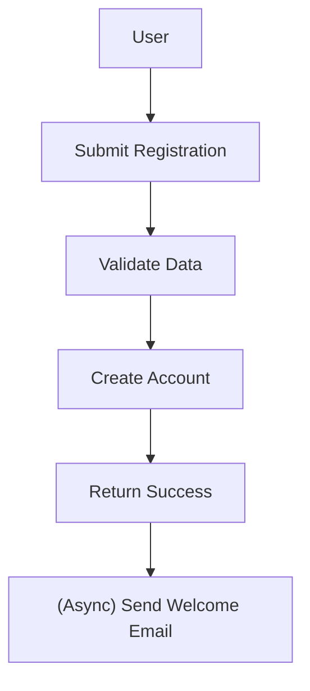

**Response Time**: < 1 second  
**Error Handling**: Immediate feedback to user

---

#### User Login

**Type**: Synchronous  
**Rationale**: User needs immediate authentication result

**Flow**:

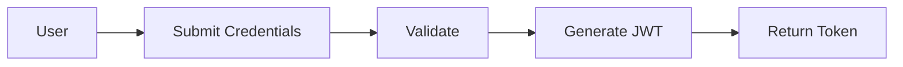

**Response Time**: < 500ms  
**Error Handling**: Immediate error message

---

#### Profile Update

**Type**: Synchronous  
**Rationale**: User expects immediate confirmation of changes

**Flow**:

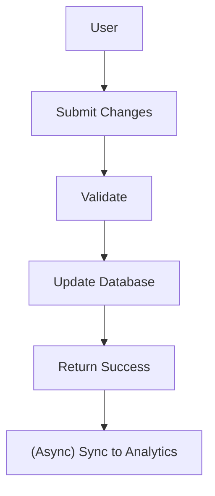

**Response Time**: < 1 second  
**Error Handling**: Immediate validation errors

---

### Product Catalog

#### Product Search

**Type**: Synchronous  
**Rationale**: User needs immediate search results

**Flow**:

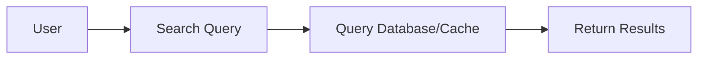

**Response Time**: < 500ms  
**Error Handling**: Empty results or error message

---

#### Product Details

**Type**: Synchronous  
**Rationale**: User needs immediate product information

**Flow**:

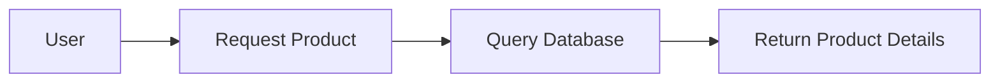

**Response Time**: < 300ms  
**Error Handling**: Product not found error

---

### Shopping Cart

#### Add to Cart

**Type**: Synchronous  
**Rationale**: User needs immediate confirmation

**Flow**:

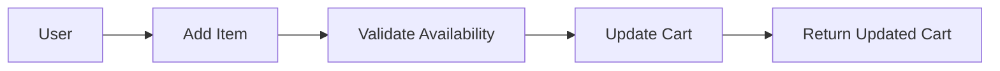

**Response Time**: < 500ms  
**Error Handling**: Out of stock error

---

#### Update Cart Quantity

**Type**: Synchronous  
**Rationale**: User needs immediate cart update

**Flow**:

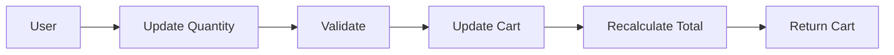

**Response Time**: < 500ms  
**Error Handling**: Invalid quantity error

---

### Order Management

#### Order Submission

**Type**: Synchronous (with async follow-up)  
**Rationale**: User needs immediate order confirmation

**Flow**:

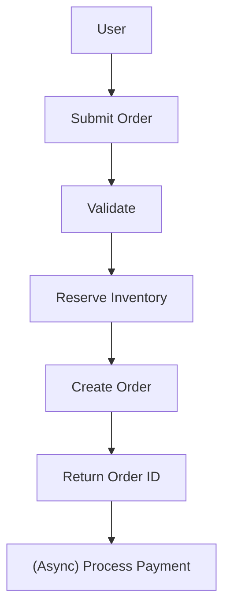

**Response Time**: < 2 seconds  
**Error Handling**: Validation errors, inventory errors

---

#### Order Status Query

**Type**: Synchronous  
**Rationale**: User needs current order status

**Flow**:

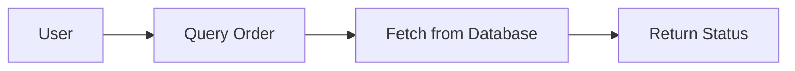

**Response Time**: < 500ms  
**Error Handling**: Order not found

---

### Payment Processing

#### Payment Authorization

**Type**: Synchronous  
**Rationale**: Must confirm payment before order completion

**Flow**:

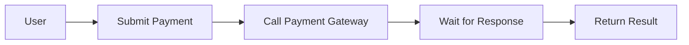

**Response Time**: < 3 seconds  
**Error Handling**: Payment declined, timeout errors

**Note**: This is synchronous from user perspective, but internally uses async callbacks from payment gateway.

---

#### Payment Status Check

**Type**: Synchronous  
**Rationale**: User needs current payment status

**Flow**:

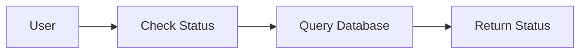

**Response Time**: < 500ms  
**Error Handling**: Payment not found

---

### Inventory Management

#### Inventory Check

**Type**: Synchronous  
**Rationale**: User needs immediate availability information

**Flow**:


**Response Time**: < 300ms  
**Error Handling**: Product not found

---

#### Inventory Reservation

**Type**: Synchronous  
**Rationale**: Must confirm reservation before order creation

**Flow**:

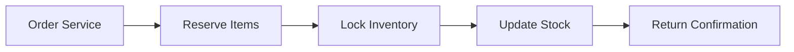

**Response Time**: < 1 second  
**Error Handling**: Insufficient stock error

---

## Asynchronous Operations

### Notification Services

#### Email Notifications

**Type**: Asynchronous  
**Rationale**: User doesn't need to wait for email delivery

**Flow**:

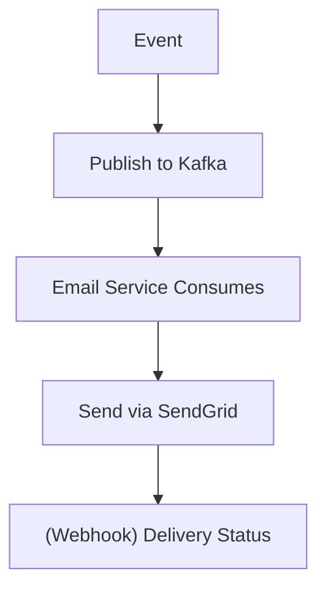

**Processing Time**: 1-5 seconds  
**Error Handling**: Retry with exponential backoff, dead letter queue

**Email Types**:

- Order confirmation
- Shipping notification
- Password reset
- Welcome email
- Promotional emails

---

#### SMS Notifications

**Type**: Asynchronous  
**Rationale**: User doesn't need to wait for SMS delivery

**Flow**:

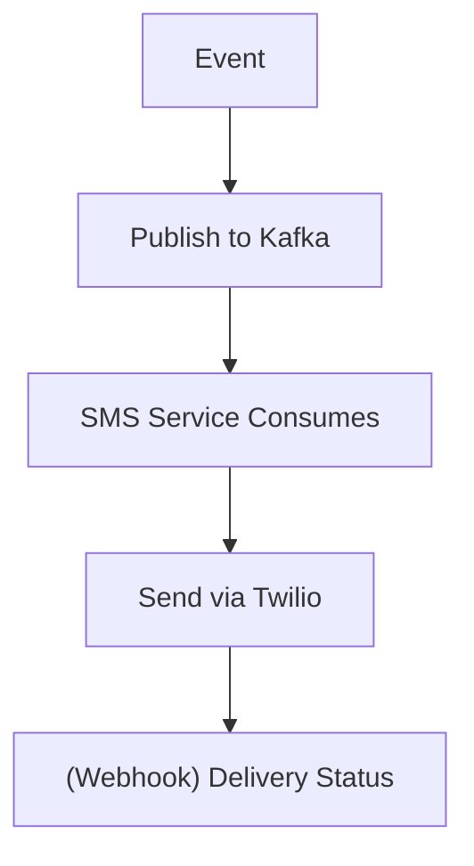

**Processing Time**: 1-3 seconds  
**Error Handling**: Retry 3 times, fallback to email

**SMS Types**:

- Order status updates
- Delivery notifications
- Verification codes (time-sensitive)

---

### Analytics and Reporting

#### User Behavior Tracking

**Type**: Asynchronous  
**Rationale**: Analytics don't affect user experience

**Flow**:

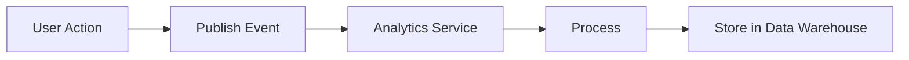

**Processing Time**: Minutes to hours  
**Error Handling**: Log and continue, no user impact

---

#### Sales Reports

**Type**: Asynchronous  
**Rationale**: Reports can be generated in background

**Flow**:

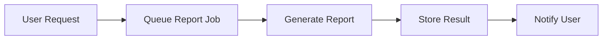

**Processing Time**: Minutes to hours  
**Error Handling**: Retry, notify user of failure

---

#### Business Intelligence

**Type**: Asynchronous (Batch)  
**Rationale**: BI processing is resource-intensive

**Flow**:

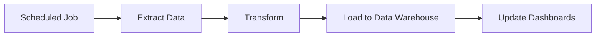

**Processing Time**: Hours  
**Error Handling**: Alert operations team

---

### Inventory Synchronization

#### Warehouse Inventory Sync

**Type**: Asynchronous  
**Rationale**: External system sync doesn't need to be immediate

**Flow**:

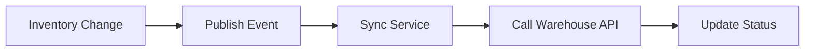

**Processing Time**: Seconds to minutes  
**Error Handling**: Retry with backoff, alert on repeated failures

---

#### Supplier Inventory Updates

**Type**: Asynchronous (Batch)  
**Rationale**: Supplier updates are periodic

**Flow**:

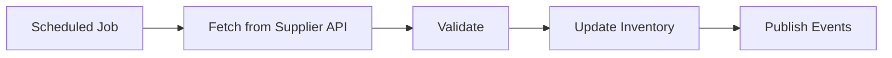

**Processing Time**: Minutes  
**Error Handling**: Log failures, retry next cycle

---

### Order Processing

#### Order Fulfillment Workflow

**Type**: Asynchronous (Event-Driven)  
**Rationale**: Multi-step process with external dependencies

**Flow**:

```mermaid
graph LR
    N1["OrderCreated"]
    N2["InventoryReserved"]
    N1 --> N2
    N3["PaymentProcessed"]
    N2 --> N3
    N4["OrderConfirmed"]
    N3 --> N4
    N5["ShippingScheduled"]
    N4 --> N5
```

**Processing Time**: Seconds to minutes  
**Error Handling**: Saga pattern with compensation

---

#### Shipping Label Generation

**Type**: Asynchronous  
**Rationale**: External shipping API call

**Flow**:

```mermaid
graph LR
    N1["OrderConfirmed"]
    N2["Queue Label Job"]
    N1 --> N2
    N3["Call Shipping API"]
    N2 --> N3
    N4["Generate Label"]
    N3 --> N4
    N5["Store PDF"]
    N4 --> N5
```

**Processing Time**: 5-30 seconds  
**Error Handling**: Retry 3 times, alert operations

---

### Data Processing

#### Image Processing

**Type**: Asynchronous  
**Rationale**: CPU-intensive operation

**Flow**:

```mermaid
graph LR
    N1["Image Upload"]
    N2["Queue Processing Job"]
    N1 --> N2
    N3["Resize/Optimize"]
    N2 --> N3
    N4["Store in S3"]
    N3 --> N4
    N5["Update Database"]
    N4 --> N5
```

**Processing Time**: Seconds to minutes  
**Error Handling**: Retry, use original if processing fails

---

#### Data Export

**Type**: Asynchronous  
**Rationale**: Large data volumes

**Flow**:

```mermaid
graph LR
    N1["User Request"]
    N2["Queue Export Job"]
    N1 --> N2
    N3["Generate CSV/Excel"]
    N2 --> N3
    N4["Upload to S3"]
    N3 --> N4
    N5["Send Download Link"]
    N4 --> N5
```

**Processing Time**: Minutes to hours  
**Error Handling**: Notify user of failure

---

#### Data Import

**Type**: Asynchronous (Batch)  
**Rationale**: Large data volumes, validation required

**Flow**:

```mermaid
graph LR
    N1["File Upload"]
    N2["Queue Import Job"]
    N1 --> N2
    N3["Validate"]
    N2 --> N3
    N4["Process"]
    N3 --> N4
    N5["Update Database"]
    N4 --> N5
    N6["Generate Report"]
    N5 --> N6
```

**Processing Time**: Minutes to hours  
**Error Handling**: Partial success handling, error report

---

### Cache Management

#### Cache Warming

**Type**: Asynchronous  
**Rationale**: Background optimization

**Flow**:

```mermaid
graph LR
    N1["Scheduled Job"]
    N2["Identify Popular Items"]
    N1 --> N2
    N3["Fetch from Database"]
    N2 --> N3
    N4["Populate Cache"]
    N3 --> N4
```

**Processing Time**: Minutes  
**Error Handling**: Log failures, retry next cycle

---

#### Cache Invalidation

**Type**: Asynchronous (Event-Driven)  
**Rationale**: Eventual consistency acceptable

**Flow**:

```mermaid
graph LR
    N1["Data Update"]
    N2["Publish Event"]
    N1 --> N2
    N3["Cache Service"]
    N2 --> N3
    N4["Invalidate Cache Keys"]
    N3 --> N4
```

**Processing Time**: Milliseconds to seconds  
**Error Handling**: TTL-based expiration as fallback

---

## Hybrid Operations

Some operations use both synchronous and asynchronous patterns:

### Order Submission (Hybrid)

**Synchronous Part**:

- Validate order data
- Check inventory availability
- Reserve inventory
- Create order record
- Return order ID to user

**Asynchronous Part**:

- Process payment
- Send confirmation email
- Notify warehouse
- Update analytics
- Sync to external systems

**Rationale**: User needs immediate order confirmation, but follow-up actions can be asynchronous.

---

### Product Review Submission (Hybrid)

**Synchronous Part**:

- Validate review data
- Check user eligibility
- Save review (pending approval)
- Return success to user

**Asynchronous Part**:

- Content moderation
- Spam detection
- Sentiment analysis
- Notification to seller
- Update product rating

**Rationale**: User needs immediate submission confirmation, but processing can be asynchronous.

---

### Password Reset (Hybrid)

**Synchronous Part**:

- Validate email
- Generate reset token
- Return success message

**Asynchronous Part**:

- Send reset email
- Log security event

**Rationale**: User needs immediate confirmation, but email delivery can be asynchronous.

---

## Implementation Patterns

### Synchronous Implementation

**Spring MVC Controller**:

```java
@RestController
@RequestMapping("/api/v1/products")
public class ProductController {
    
    @GetMapping("/{id}")
    public ResponseEntity<ProductResponse> getProduct(@PathVariable String id) {
        // Synchronous - blocks until complete
        Product product = productService.findById(id);
        return ResponseEntity.ok(ProductResponse.from(product));
    }
}
```

**Characteristics**:

- Request thread blocks until completion
- Direct return of result
- Immediate error handling
- Simple flow control

---

### Asynchronous Implementation

**Spring Async Method**:

```java
@Service
public class EmailService {
    
    @Async("taskExecutor")
    public CompletableFuture<Void> sendOrderConfirmation(String orderId) {
        // Asynchronous - returns immediately
        try {
            Order order = orderRepository.findById(orderId).orElseThrow();
            emailClient.send(order.getCustomerEmail(), "Order Confirmation", ...);
            return CompletableFuture.completedFuture(null);
        } catch (Exception e) {
            return CompletableFuture.failedFuture(e);
        }
    }
}
```

**Characteristics**:

- Returns immediately
- Executes in separate thread
- Result available via Future
- Requires error handling strategy

---

### Event-Driven Implementation

**Event Publisher**:

```java
@Service
@Transactional
public class OrderApplicationService {
    
    public void submitOrder(SubmitOrderCommand command) {
        // Synchronous part
        Order order = orderService.createOrder(command);
        orderRepository.save(order);
        
        // Asynchronous part - publish event
        domainEventService.publishEventsFromAggregate(order);
    }
}
```

**Event Consumer**:

```java
@Component
public class OrderConfirmationEmailHandler extends AbstractDomainEventHandler<OrderCreatedEvent> {
    
    @Override
    @Async
    public void handle(OrderCreatedEvent event) {
        // Asynchronous processing
        emailService.sendOrderConfirmation(event.orderId());
    }
}
```

**Characteristics**:

- Decoupled components
- Eventual consistency
- Scalable processing
- Resilient to failures

---

## Performance Implications

### Synchronous Operations

**Advantages**:

- Simple to understand and debug
- Immediate error feedback
- Strong consistency
- Predictable behavior

**Disadvantages**:

- Blocks request thread
- Limited scalability
- Timeout risks
- Resource contention

**Best For**:

- User-facing operations
- Critical path operations
- Operations requiring immediate feedback

---

### Asynchronous Operations

**Advantages**:

- Better resource utilization
- Higher throughput
- Non-blocking
- Improved scalability

**Disadvantages**:

- Complex error handling
- Eventual consistency
- Harder to debug
- Requires monitoring

**Best For**:

- Background processing
- External service calls
- Batch operations
- Non-critical operations

---

## Monitoring and Observability

### Synchronous Operation Metrics

- **Response Time**: p50, p95, p99 latencies
- **Error Rate**: 4xx and 5xx errors
- **Throughput**: Requests per second
- **Timeout Rate**: Operations exceeding timeout

### Asynchronous Operation Metrics

- **Queue Depth**: Pending tasks in queue
- **Processing Time**: Time from queue to completion
- **Success Rate**: Successful vs failed operations
- **Retry Rate**: Number of retries
- **Dead Letter Queue Size**: Failed operations

---

## Decision Matrix

| Criteria | Synchronous | Asynchronous |
|----------|-------------|--------------|
| User waiting for result | ✅ Yes | ❌ No |
| Response time < 2s | ✅ Yes | ❌ No |
| Strong consistency required | ✅ Yes | ❌ No |
| External service call | ❌ No | ✅ Yes |
| Long-running operation | ❌ No | ✅ Yes |
| Eventual consistency OK | ❌ No | ✅ Yes |
| Background processing | ❌ No | ✅ Yes |
| Batch operation | ❌ No | ✅ Yes |

---

## Related Documentation

- [Concurrency Viewpoint Overview](overview.md) - Overall concurrency model ←
- [Synchronization Mechanisms](synchronization.md) - Locking and coordination →
- [State Management](state-management.md) - State handling strategies →
- [Performance Perspective](../../perspectives/performance/README.md) - Performance requirements

---

**Document Status**: Active  
**Last Review**: 2025-10-23  
**Next Review**: 2025-11-23  
**Owner**: Architecture Team
