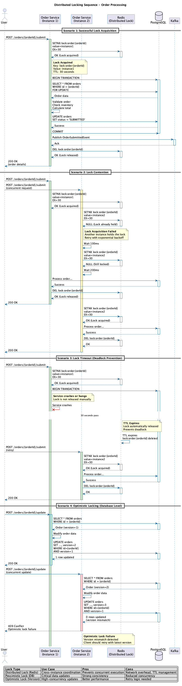

# Synchronization Mechanisms

> **Viewpoint**: Concurrency  
> **Purpose**: Document synchronization techniques for coordinating concurrent operations  
> **Audience**: Architects, Developers, Operations Team

## Overview

This document describes the synchronization mechanisms used to coordinate concurrent access to shared resources, maintain data consistency, and prevent race conditions in the E-Commerce Platform's distributed system.



*Figure 1: Distributed locking sequence diagram showing lock acquisition, contention, timeout, and optimistic locking scenarios*

## Synchronization Hierarchy

Our synchronization strategy operates at multiple levels:

```text
┌─────────────────────────────────────────────────────────────┐
│                    Distributed Level                        │
│  ├── Kafka Event Ordering (Partition-based)                │
│  ├── Distributed Locks (Redis-based)                       │
│  └── Database Cluster Coordination                         │
├─────────────────────────────────────────────────────────────┤
│                    Application Level                        │
│  ├── Database Transactions (ACID)                          │
│  ├── Optimistic Locking (JPA @Version)                     │
│  ├── Pessimistic Locking (SELECT FOR UPDATE)               │
│  └── Application-level Semaphores                          │
├─────────────────────────────────────────────────────────────┤
│                    JVM Level                                │
│  ├── Synchronized Methods/Blocks                           │
│  ├── ReentrantLock and ReadWriteLock                       │
│  ├── Atomic Classes (AtomicLong, etc.)                     │
│  └── Concurrent Collections                                 │
└─────────────────────────────────────────────────────────────┘
```

## Database Transaction Management

### 1. Transaction Boundaries

We use Spring's `@Transactional` annotation to define clear transaction boundaries:

```java
@Service
@Transactional
public class OrderApplicationService {
    
    // Read-only transactions for queries
    @Transactional(readOnly = true)
    public OrderSummary getOrderSummary(String orderId) {
        Order order = orderRepository.findById(orderId)
            .orElseThrow(() -> new OrderNotFoundException(orderId));
        return OrderSummary.from(order);
    }
    
    // Write transaction with proper isolation
    @Transactional(isolation = Isolation.READ_COMMITTED)
    public OrderResult submitOrder(SubmitOrderCommand command) {
        Order order = orderRepository.findById(command.orderId())
            .orElseThrow(() -> new OrderNotFoundException(command.orderId()));
        
        // Business logic within transaction boundary
        order.submit();
        Order savedOrder = orderRepository.save(order);
        
        // Events are published after transaction commit
        eventPublisher.publishEvent(new OrderSubmittedEvent(savedOrder));
        
        return OrderResult.success(savedOrder);
    }
    
    // New transaction for independent operations
    @Transactional(propagation = Propagation.REQUIRES_NEW)
    public void processPaymentCallback(PaymentCallbackEvent event) {
        // This runs in a separate transaction
        Payment payment = paymentRepository.findById(event.paymentId());
        payment.updateStatus(event.status());
        paymentRepository.save(payment);
    }
}
```

### 2. Optimistic Locking

Primary mechanism for handling concurrent updates:

```java
@Entity
@Table(name = "orders")
public class Order {
    @Id
    private String id;
    
    @Version
    private Long version;                   // Optimistic locking
    
    @Enumerated(EnumType.STRING)
    private OrderStatus status;
    
    private LocalDateTime lastModified;
    
    public void submit() {
        if (this.status != OrderStatus.CREATED) {
            throw new IllegalStateException("Order cannot be submitted in status: " + this.status);
        }
        this.status = OrderStatus.PENDING;
        this.lastModified = LocalDateTime.now();
        // Version will be automatically incremented by JPA
    }
}
```

**Handling Optimistic Lock Exceptions**:

```java
@Service
public class OrderService {
    
    @Retryable(
        value = {OptimisticLockingFailureException.class},
        maxAttempts = 3,
        backoff = @Backoff(delay = 100, multiplier = 2)
    )
    public OrderResult submitOrderWithRetry(SubmitOrderCommand command) {
        try {
            return submitOrder(command);
        } catch (OptimisticLockingFailureException e) {
            log.warn("Optimistic lock failure for order {}, retrying...", command.orderId());
            throw e; // Trigger retry
        }
    }
    
    @Recover
    public OrderResult recoverFromOptimisticLockFailure(
            OptimisticLockingFailureException ex, 
            SubmitOrderCommand command) {
        log.error("Failed to submit order {} after retries due to concurrent modification", 
            command.orderId());
        return OrderResult.failure("Order is being modified by another process. Please try again.");
    }
}
```

### 3. Distributed Locking

For operations requiring coordination across multiple application instances:

```java
@Component
public class DistributedLockService {
    
    private final RedisTemplate<String, String> redisTemplate;
    
    public <T> T executeWithLock(String lockKey, Duration timeout, Supplier<T> operation) {
        String lockValue = UUID.randomUUID().toString();
        String fullLockKey = "lock:" + lockKey;
        
        try {
            // Attempt to acquire lock
            Boolean acquired = redisTemplate.opsForValue()
                .setIfAbsent(fullLockKey, lockValue, timeout);
            
            if (!acquired) {
                throw new LockAcquisitionException("Failed to acquire lock: " + lockKey);
            }
            
            // Execute operation with lock held
            return operation.get();
        } finally {
            // Release lock atomically
            releaseLock(fullLockKey, lockValue);
        }
    }
    
    private void releaseLock(String lockKey, String lockValue) {
        // Lua script for atomic lock release
        String script = 
            "if redis.call('get', KEYS[1]) == ARGV[1] then " +
            "  return redis.call('del', KEYS[1]) " +
            "else " +
            "  return 0 " +
            "end";
        
        redisTemplate.execute(
            RedisScript.of(script, Boolean.class),
            Collections.singletonList(lockKey),
            lockValue
        );
    }
}
```

## Event Ordering and Consistency

### 1. Kafka Partition-based Ordering

Events for the same aggregate are guaranteed to be ordered:

```java
@Component
public class OrderedEventPublisher {
    
    private final KafkaTemplate<String, DomainEvent> kafkaTemplate;
    
    public void publishEvent(DomainEvent event) {
        // Use aggregate ID as partition key to ensure ordering
        String partitionKey = event.getAggregateId();
        
        ProducerRecord<String, DomainEvent> record = new ProducerRecord<>(
            "domain-events",
            partitionKey,  // Events for same aggregate go to same partition
            event
        );
        
        kafkaTemplate.send(record);
    }
}
```

### 2. Sequence Number Tracking

```java
@Component
public class OrderedEventProcessor {
    
    private final ConcurrentMap<String, Long> lastProcessedSequence = new ConcurrentHashMap<>();
    
    @KafkaListener(topics = "domain-events")
    public void processEvent(DomainEvent event) {
        String aggregateId = event.getAggregateId();
        long eventSequence = event.getSequenceNumber();
        
        synchronized (getLock(aggregateId)) {
            Long lastSequence = lastProcessedSequence.get(aggregateId);
            
            if (lastSequence == null || eventSequence == lastSequence + 1) {
                processEventInternal(event);
                lastProcessedSequence.put(aggregateId, eventSequence);
            } else {
                log.warn("Out-of-order event detected: {} for aggregate {}", 
                    eventSequence, aggregateId);
            }
        }
    }
    
    private Object getLock(String aggregateId) {
        return aggregateId.intern();
    }
}
```

## Deadlock Prevention

### 1. Lock Ordering

Always acquire locks in a consistent order:

```java
@Service
public class TransferService {
    
    public void transferFunds(String fromAccountId, String toAccountId, Money amount) {
        // Always lock accounts in alphabetical order to prevent deadlock
        String firstLock = fromAccountId.compareTo(toAccountId) < 0 ? fromAccountId : toAccountId;
        String secondLock = fromAccountId.compareTo(toAccountId) < 0 ? toAccountId : fromAccountId;
        
        distributedLockService.executeWithLock(firstLock, Duration.ofSeconds(5), () -> {
            return distributedLockService.executeWithLock(secondLock, Duration.ofSeconds(5), () -> {
                // Both accounts locked in consistent order
                Account fromAccount = accountRepository.findById(fromAccountId).orElseThrow();
                Account toAccount = accountRepository.findById(toAccountId).orElseThrow();
                
                fromAccount.debit(amount);
                toAccount.credit(amount);
                
                accountRepository.save(fromAccount);
                accountRepository.save(toAccount);
                
                return null;
            });
        });
    }
}
```

### 2. Deadlock Detection

```java
@Component
public class DeadlockDetector {
    
    private final ThreadMXBean threadBean = ManagementFactory.getThreadMXBean();
    
    @Scheduled(fixedRate = 30000) // Every 30 seconds
    public void detectDeadlocks() {
        long[] deadlockedThreads = threadBean.findDeadlockedThreads();
        
        if (deadlockedThreads != null && deadlockedThreads.length > 0) {
            ThreadInfo[] threadInfos = threadBean.getThreadInfo(deadlockedThreads, true, true);
            
            StringBuilder report = new StringBuilder("Deadlock detected:\n");
            for (ThreadInfo info : threadInfos) {
                report.append("Thread: ").append(info.getThreadName()).append("\n");
                report.append("  State: ").append(info.getThreadState()).append("\n");
                report.append("  Lock: ").append(info.getLockName()).append("\n");
            }
            
            log.error(report.toString());
            alertService.sendCriticalAlert("Deadlock Detected", report.toString());
        }
    }
}
```

## Best Practices

### 1. Minimize Lock Scope

```java
// ✅ GOOD: Lock only critical section
public void processOrder(Order order) {
    validateOrder(order);
    calculateTotal(order);
    
    synchronized(this) {
        updateInventory(order);     // Only this needs lock
    }
    
    sendNotification(order);
}
```

### 2. Use Appropriate Isolation Levels

```java
@Transactional(isolation = Isolation.READ_COMMITTED)  // Default
public void updateOrder(Order order) {
    // Standard update
}

@Transactional(isolation = Isolation.REPEATABLE_READ)  // For consistent reads
public OrderReport generateReport(String orderId) {
    // Multiple reads that must be consistent
}
```

## Monitoring and Troubleshooting

### Lock Metrics

**Key Metrics to Monitor**:

- Lock acquisition time
- Lock hold duration
- Lock contention rate
- Deadlock occurrences
- Lock timeout rate

**Monitoring Implementation**:

```java
@Aspect
@Component
public class LockMonitoringAspect {
    
    private final MeterRegistry meterRegistry;
    
    @Around("@annotation(DistributedLock)")
    public Object monitorLock(ProceedingJoinPoint joinPoint) throws Throwable {
        Timer.Sample sample = Timer.start(meterRegistry);
        String lockName = getLockName(joinPoint);
        
        try {
            Object result = joinPoint.proceed();
            sample.stop(Timer.builder("distributed.lock.acquisition")
                .tag("lock", lockName)
                .tag("status", "success")
                .register(meterRegistry));
            return result;
        } catch (LockAcquisitionException e) {
            sample.stop(Timer.builder("distributed.lock.acquisition")
                .tag("lock", lockName)
                .tag("status", "failure")
                .register(meterRegistry));
            throw e;
        }
    }
}
```

### Troubleshooting Common Issues

**Issue 1: High Lock Contention**

- **Symptom**: Slow response times, high lock wait times
- **Solution**: Reduce lock scope, use optimistic locking, partition data

**Issue 2: Deadlocks**

- **Symptom**: Threads blocked indefinitely
- **Solution**: Implement lock ordering, use timeouts, review lock acquisition patterns

**Issue 3: Lock Timeouts**

- **Symptom**: Frequent lock acquisition failures
- **Solution**: Increase timeout, optimize locked operations, scale horizontally

## Performance Considerations

### Lock Performance Comparison

| Mechanism | Overhead | Scalability | Use Case |
|-----------|----------|-------------|----------|
| Optimistic Locking | Low | High | Low contention scenarios |
| Pessimistic Locking | Medium | Medium | High contention scenarios |
| Distributed Locks | High | Low | Cross-instance coordination |
| Event Ordering | Low | High | Asynchronous operations |

### Optimization Strategies

1. **Minimize Lock Scope**: Lock only critical sections
2. **Use Read-Write Locks**: Allow concurrent reads
3. **Implement Lock Striping**: Partition locks by key
4. **Cache Lock Status**: Reduce lock acquisition attempts
5. **Use Optimistic Locking First**: Fall back to pessimistic only when needed

## Related Documentation

- [Concurrency Viewpoint Overview](overview.md) - Overall concurrency model ←
- [Synchronous vs Asynchronous Operations](sync-async-operations.md) - Operation classification ←
- [State Management](state-management.md) - State handling strategies →
- [Performance Perspective](../../perspectives/performance/overview.md) - Performance requirements

---

**Document Status**: Active  
**Last Review**: 2025-10-23  
**Next Review**: 2025-11-23  
**Owner**: Architecture Team
