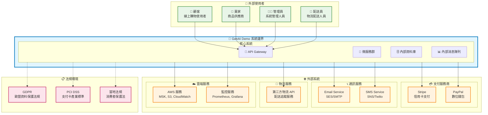
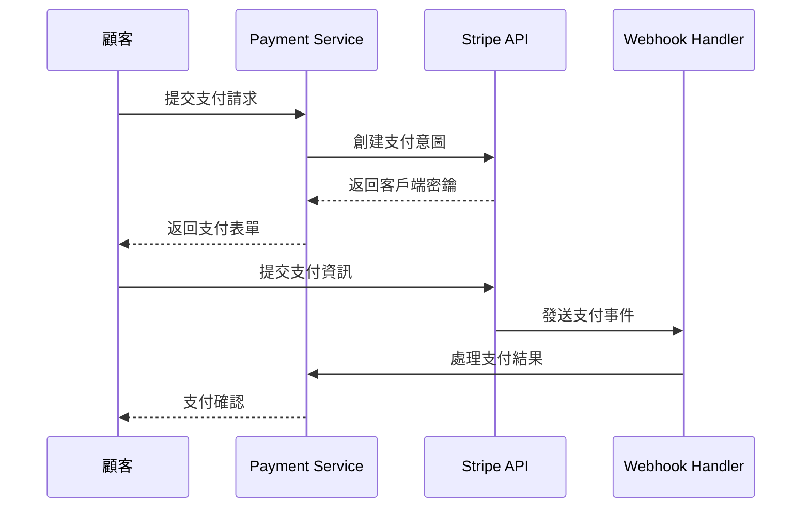
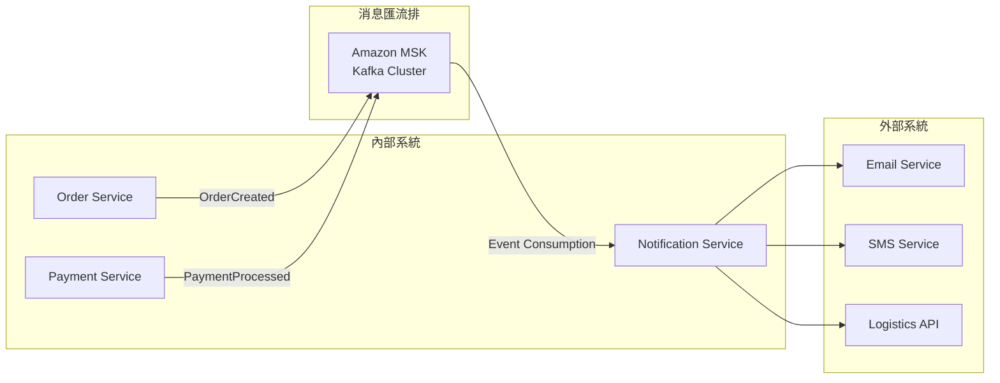

# 上下文視點 (Context Viewpoint)

## 概覽

上下文視點描述系統與其環境之間的關係，包括外部系統、利害關係人、組織約束和法規要求。這個視點定義了系統邊界，並說明系統如何與外部世界互動。

## 利害關係人

- **主要關注者**: 系統架構師、業務分析師、專案經理、合規官員
- **次要關注者**: 開發者、運維工程師、安全工程師、法務團隊

## 關注點

1. **系統邊界定義**: 明確系統的範圍和邊界
2. **外部依賴管理**: 識別和管理外部系統依賴
3. **利害關係人互動**: 定義各類使用者和系統的互動模式
4. **整合協議**: 規範與外部系統的整合方式
5. **組織約束**: 考慮組織結構和政策對系統的影響
6. **法規合規**: 確保系統符合相關法規要求

## 系統邊界和外部依賴

### 系統邊界圖



## 利害關係人分析

### 主要利害關係人

#### 1. 終端使用者

| 利害關係人 | 角色描述 | 主要需求 | 互動方式 | 影響程度 |
|-----------|---------|---------|---------|---------|
| **顧客** | 線上購物的消費者 | 便捷購物、安全支付、快速配送 | Web/Mobile App | 🔴 高 |
| **賣家** | 商品供應商和商家 | 商品管理、訂單處理、銷售分析 | 賣家門戶 | 🔴 高 |
| **管理員** | 系統管理和運營人員 | 系統監控、使用者管理、資料分析 | 管理面板 | 🟡 中 |
| **配送員** | 物流配送人員 | 配送任務管理、狀態更新 | Mobile App | 🟡 中 |

#### 2. 組織利害關係人

| 利害關係人 | 角色描述 | 主要關注點 | 決策影響 |
|-----------|---------|-----------|---------|
| **產品經理** | 產品策略和規劃 | 功能需求、使用者體驗、市場競爭力 | 🔴 高 |
| **技術長 (CTO)** | 技術策略決策 | 技術架構、安全性、可擴展性 | 🔴 高 |
| **合規官員** | 法規合規管理 | 資料保護、支付安全、法規遵循 | 🔴 高 |
| **財務長 (CFO)** | 財務和成本控制 | 運營成本、ROI、預算控制 | 🟡 中 |
| **法務團隊** | 法律風險管理 | 合約管理、智慧財產權、法律責任 | 🟡 中 |

### 外部利害關係人

| 利害關係人 | 關係類型 | 影響範圍 | 管理策略 |
|-----------|---------|---------|---------|
| **支付服務商** | 服務提供者 | 支付處理、資金安全 | SLA 管理、備援方案 |
| **物流合作夥伴** | 業務夥伴 | 配送服務、客戶滿意度 | 合約管理、績效監控 |
| **雲端服務商** | 基礎設施提供者 | 系統可用性、資料安全 | 多雲策略、災難復原 |
| **監管機構** | 法規監督 | 合規要求、營運許可 | 主動合規、定期審計 |

## 外部系統整合

### 支付系統整合

#### Stripe 整合
- **整合類型**: RESTful API
- **資料交換格式**: JSON over HTTPS
- **認證方式**: API Key + Webhook 簽名驗證
- **SLA 要求**: 99.9% 可用性，< 2秒響應時間
- **資料流向**: 雙向（支付請求 → 支付結果）
- **安全要求**: PCI DSS Level 1 合規



#### PayPal 整合
- **整合類型**: OAuth 2.0 + REST API
- **資料交換格式**: JSON over HTTPS
- **認證方式**: Client ID/Secret + Access Token
- **SLA 要求**: 99.5% 可用性，< 3秒響應時間
- **容錯機制**: 自動重試 + 降級到其他支付方式

### 通訊服務整合

#### Email 服務 (Amazon SES)
- **整合類型**: AWS SDK + SMTP
- **使用場景**: 訂單確認、密碼重置、行銷郵件
- **資料格式**: HTML/Text Email
- **發送限制**: 每日 200 封（可調整）
- **監控指標**: 發送成功率、退信率、投訴率

#### SMS 服務 (Amazon SNS/Twilio)
- **整合類型**: REST API
- **使用場景**: OTP 驗證、訂單狀態通知
- **資料格式**: 純文字訊息
- **地區支援**: 台灣、香港、新加坡
- **成本控制**: 每月 1000 則訊息限制

### 物流服務整合

#### 第三方物流 API
- **整合類型**: RESTful API
- **主要功能**: 
  - 配送地址驗證
  - 運費計算
  - 配送狀態追蹤
  - 配送時間預估
- **資料同步**: 每 30 分鐘同步配送狀態
- **備援策略**: 多家物流商支援

### 雲端服務整合

#### Amazon Web Services (AWS)
- **核心服務**:
  - **MSK (Kafka)**: 事件流處理
  - **S3**: 檔案和媒體存儲
  - **CloudWatch**: 監控和日誌
  - **Secrets Manager**: 密鑰管理
  - **IAM**: 身份和存取管理

- **整合模式**: AWS SDK + IAM 角色
- **安全配置**: 最小權限原則
- **成本優化**: 預留實例 + 自動擴縮

## 整合協議和資料交換

### API 整合標準

#### REST API 標準
```yaml
# API 整合規範
api_standards:
  protocol: HTTPS
  authentication: 
    - OAuth 2.0 (首選)
    - API Key (備選)
  data_format: JSON
  versioning: URL 路徑版本控制 (/v1/, /v2/)
  rate_limiting: 每分鐘 1000 請求
  timeout: 30 秒
  retry_policy: 指數退避，最多 3 次重試
```

#### 資料交換格式
```json
{
  "standard_response": {
    "success": true,
    "data": {},
    "error": null,
    "timestamp": "2025-01-22T10:00:00Z",
    "request_id": "uuid-v4"
  },
  "error_response": {
    "success": false,
    "data": null,
    "error": {
      "code": "ERROR_CODE",
      "message": "Human readable message",
      "details": {}
    },
    "timestamp": "2025-01-22T10:00:00Z",
    "request_id": "uuid-v4"
  }
}
```

### 事件驅動整合

#### 領域事件發布


## 組織約束

### 技術約束

#### 開發團隊結構
- **後端團隊**: 3-4 名 Java/Spring Boot 開發者
- **前端團隊**: 2-3 名 React/Angular 開發者
- **DevOps 團隊**: 1-2 名 AWS/Kubernetes 專家
- **QA 團隊**: 2 名測試工程師

#### 技術棧限制
- **程式語言**: Java 21, TypeScript, Python (限定)
- **框架**: Spring Boot 3.x, React 18, Angular 18
- **雲端平台**: AWS (主要), 避免供應商鎖定
- **資料庫**: PostgreSQL (主要), Redis (快取)

### 預算約束

#### 雲端服務成本
- **月度預算**: $2,000 USD
- **成本分配**:
  - 運算資源: 40% ($800)
  - 資料庫: 25% ($500)
  - 網路和 CDN: 15% ($300)
  - 監控和日誌: 10% ($200)
  - 其他服務: 10% ($200)

#### 第三方服務成本
- **支付處理費**: 2.9% + $0.30 per transaction
- **SMS 服務**: $0.05 per message
- **Email 服務**: $0.10 per 1000 emails
- **物流 API**: 按使用量計費

### 時程約束

#### 開發里程碑
- **MVP 版本**: 3 個月
- **Beta 測試**: 4 個月
- **正式上線**: 6 個月
- **功能擴展**: 持續迭代

#### 合規時程
- **GDPR 合規**: 上線前完成
- **PCI DSS 認證**: 支付功能上線前
- **安全審計**: 每季度一次

## 法規和合規要求

### 資料保護法規

#### GDPR (歐盟一般資料保護規範)
- **適用範圍**: 歐盟使用者資料處理
- **關鍵要求**:
  - 明確的資料收集同意
  - 資料可攜權 (Data Portability)
  - 被遺忘權 (Right to be Forgotten)
  - 資料外洩通知 (72 小時內)
- **技術實現**:
  - 資料加密存儲
  - 存取日誌記錄
  - 資料匿名化功能
  - 同意管理系統

#### 個人資料保護法 (台灣)
- **適用範圍**: 台灣使用者個人資料
- **關鍵要求**:
  - 告知義務
  - 當事人同意
  - 資料安全維護
  - 資料利用限制
- **技術實現**:
  - 隱私政策展示
  - 同意記錄保存
  - 資料存取控制
  - 定期安全檢查

### 支付安全標準

#### PCI DSS (支付卡產業資料安全標準)
- **適用等級**: Level 4 (年交易量 < 20,000)
- **關鍵要求**:
  - 不存儲敏感認證資料
  - 加密傳輸支付資料
  - 定期安全測試
  - 存取控制和監控
- **技術實現**:
  - 使用 Stripe/PayPal 代理處理
  - HTTPS 強制加密
  - 定期滲透測試
  - 存取日誌監控

### 消費者保護法規

#### 電子商務法規
- **適用範圍**: 線上交易和消費者權益
- **關鍵要求**:
  - 商品資訊透明
  - 退換貨政策
  - 消費者申訴機制
  - 交易記錄保存
- **技術實現**:
  - 詳細商品描述系統
  - 退換貨流程自動化
  - 客服系統整合
  - 交易資料備份

## 風險管理

### 外部依賴風險

#### 支付服務風險
- **風險**: 支付服務商故障或政策變更
- **影響**: 無法處理支付，直接影響營收
- **緩解措施**:
  - 多支付管道支援 (Stripe + PayPal)
  - 支付狀態監控和告警
  - 自動故障轉移機制
  - 定期備援測試

#### 雲端服務風險
- **風險**: AWS 服務中斷或成本暴增
- **影響**: 系統不可用或預算超支
- **緩解措施**:
  - 多可用區部署
  - 成本監控和預算告警
  - 災難復原計劃
  - 供應商多元化策略

### 合規風險

#### 資料保護風險
- **風險**: 資料外洩或合規違規
- **影響**: 法律責任和聲譽損害
- **緩解措施**:
  - 資料加密和存取控制
  - 定期安全審計
  - 員工安全培訓
  - 事件回應計劃

#### 支付安全風險
- **風險**: 支付資料外洩或詐欺
- **影響**: PCI DSS 違規和財務損失
- **緩解措施**:
  - 使用認證支付處理商
  - 不存儲敏感支付資料
  - 交易監控和風險評估
  - 定期安全測試

## 監控和治理

### 外部服務監控

#### 服務可用性監控
```yaml
monitoring_targets:
  stripe_api:
    endpoint: "https://api.stripe.com/v1/charges"
    check_interval: "1m"
    timeout: "10s"
    alert_threshold: "99.5%"
  
  paypal_api:
    endpoint: "https://api.paypal.com/v1/payments"
    check_interval: "1m" 
    timeout: "15s"
    alert_threshold: "99.0%"
    
  logistics_api:
    endpoint: "https://logistics-partner.com/api/v1/status"
    check_interval: "5m"
    timeout: "30s"
    alert_threshold: "95.0%"
```

#### 效能監控
- **響應時間**: P95 < 2秒
- **錯誤率**: < 1%
- **可用性**: > 99.5%
- **告警機制**: Slack + Email + SMS

### 合規監控

#### 資料保護合規
- **存取日誌**: 所有個人資料存取記錄
- **資料保留**: 按法規要求自動清理過期資料
- **同意管理**: 追蹤使用者同意狀態變更
- **資料外洩檢測**: 異常存取模式告警

#### 支付安全合規
- **交易監控**: 異常交易模式檢測
- **存取控制**: 支付相關功能的嚴格權限管理
- **安全測試**: 季度滲透測試和漏洞掃描
- **合規報告**: 自動生成 PCI DSS 合規報告

## 相關圖表

- [系統上下文圖](../../diagrams/generated/context/system-context-overview.png)
- [外部整合架構圖](../../diagrams/generated/context/external-integrations.png)
- [利害關係人互動圖](../../diagrams/generated/context/stakeholder-interactions.png)
- [合規架構圖](../../diagrams/generated/context/compliance-architecture.png)

## 與其他視點的關聯

- **[功能視點](../functional/README.md)**: 外部系統整合的功能需求
- **[資訊視點](../information/README.md)**: 外部資料交換和整合模式
- **[部署視點](../deployment/README.md)**: 外部服務的部署和配置
- **[運營視點](../operational/README.md)**: 外部依賴的監控和維護
- **[安全性觀點](../../perspectives/security/README.md)**: 外部整合的安全要求
- **[法規觀點](../../perspectives/regulation/README.md)**: 合規要求和實現策略

## 決策記錄

### ADR-001: 支付服務商選擇
- **決策**: 採用 Stripe 作為主要支付處理商，PayPal 作為備選
- **理由**: Stripe 提供更好的開發者體驗和 API 設計
- **影響**: 需要實現多支付管道支援

### ADR-002: 雲端服務商策略
- **決策**: 以 AWS 為主要雲端平台，避免深度供應商鎖定
- **理由**: 團隊 AWS 經驗豐富，服務生態完整
- **影響**: 需要設計可移植的架構模式

### ADR-003: 合規策略
- **決策**: 採用「隱私設計」原則，從架構層面確保合規
- **理由**: 降低合規風險和後續改造成本
- **影響**: 增加初期開發複雜度，但長期收益明顯

---

**最後更新**: 2025年1月22日  
**維護者**: 架構團隊  
**審核者**: 合規團隊、安全團隊