# Context Viewpoint

## Overview

The Context Viewpoint describes the relationships between the system and its environment, including external systems, stakeholders, organizational constraints, and regulatory requirements. This viewpoint defines system boundaries and explains how the system interacts with the external world.

## Stakeholders

- **Primary Stakeholders**: System architects, business analysts, project managers, compliance officers
- **Secondary Stakeholders**: Developers, operations engineers, security engineers, legal teams

## Concerns

1. **System Boundary Definition**: Clearly define the scope and boundaries of the system
2. **External Dependency Management**: Identify and manage external system dependencies
3. **Stakeholder Interactions**: Define interaction patterns between various users and systems
4. **Integration Protocols**: Standardize integration methods with external systems
5. **Organizational Constraints**: Consider the impact of organizational structure and policies on the system
6. **Regulatory Compliance**: Ensure the system complies with relevant regulatory requirements

## System Boundaries and External Dependencies

### System Boundary Diagram

```mermaid
graph TB
    subgraph SYSTEM_BOUNDARY ["🏢 GenAI Demo System Boundary"]
        subgraph CORE_SYSTEM ["Core System"]
            API_GATEWAY[🚪 API Gateway]
            MICROSERVICES[🔧 Microservices Cluster]
            DATABASES[🗄️ Internal Databases]
            MESSAGE_QUEUE[📊 Internal Message Queue]
        end
    end
    
    subgraph EXTERNAL_USERS ["👥 External Users"]
        CUSTOMERS[👤 Customers<br/>Online Shopping Users]
        SELLERS[🏪 Sellers<br/>Product Suppliers]
        ADMINS[👨‍💼 Administrators<br/>System Management Personnel]
        DELIVERY_STAFF[🚚 Delivery Staff<br/>Logistics Delivery Personnel]
    end
    
    subgraph EXTERNAL_SYSTEMS ["🌐 External Systems"]
        subgraph PAYMENT_PROVIDERS ["💳 Payment Providers"]
            STRIPE[Stripe<br/>Credit Card Payment]
            PAYPAL[PayPal<br/>Digital Wallet]
        end
        
        subgraph COMMUNICATION ["📞 Communication Services"]
            EMAIL_SERVICE[Email Service<br/>SES/SMTP]
            SMS_SERVICE[SMS Service<br/>SNS/Twilio]
        end
        
        subgraph LOGISTICS ["🚚 Logistics Services"]
            LOGISTICS_API[Third-party Logistics API<br/>Delivery Tracking Service]
        end
        
        subgraph CLOUD_SERVICES ["☁️ Cloud Services"]
            AWS_SERVICES[AWS Services<br/>MSK, S3, CloudWatch]
            MONITORING[Monitoring Services<br/>Prometheus, Grafana]
        end
    end
    
    subgraph REGULATORY ["📋 Regulatory Environment"]
        GDPR[GDPR<br/>EU Data Protection Regulation]
        PCI_DSS[PCI DSS<br/>Payment Card Industry Standard]
        LOCAL_LAWS[Local Regulations<br/>Consumer Protection Laws]
    end
    
    %% User Interactions
    CUSTOMERS --> API_GATEWAY
    SELLERS --> API_GATEWAY
    ADMINS --> API_GATEWAY
    DELIVERY_STAFF --> API_GATEWAY
    
    %% External System Integrations
    CORE_SYSTEM --> STRIPE
    CORE_SYSTEM --> PAYPAL
    CORE_SYSTEM --> EMAIL_SERVICE
    CORE_SYSTEM --> SMS_SERVICE
    CORE_SYSTEM --> LOGISTICS_API
    CORE_SYSTEM --> AWS_SERVICES
    CORE_SYSTEM --> MONITORING
    
    %% Regulatory Compliance
    CORE_SYSTEM -.-> GDPR
    CORE_SYSTEM -.-> PCI_DSS
    CORE_SYSTEM -.-> LOCAL_LAWS
    
    %% Styling
    classDef system fill:#e3f2fd,stroke:#1976d2,stroke-width:3px
    classDef external fill:#f3e5f5,stroke:#7b1fa2,stroke-width:2px
    classDef regulatory fill:#fff3e0,stroke:#f57c00,stroke-width:2px
    
    class CORE_SYSTEM system
    class EXTERNAL_USERS,EXTERNAL_SYSTEMS external
    class REGULATORY regulatory
```

## External Stakeholders

### Primary Users
- **Customers**: End users who browse products, place orders, and make payments
- **Sellers**: Vendors who manage product catalogs and fulfill orders
- **Administrators**: System operators who manage users, monitor performance, and handle support
- **Delivery Staff**: Logistics personnel who handle order fulfillment and delivery

### External Systems
- **Payment Gateways**: Stripe, PayPal for payment processing
- **Communication Services**: Email (SES/SMTP) and SMS (SNS/Twilio) for notifications
- **Logistics Partners**: Third-party delivery and tracking services
- **Cloud Infrastructure**: AWS services for hosting, storage, and monitoring

### Regulatory Bodies
- **GDPR Compliance**: European Union data protection requirements
- **PCI DSS**: Payment card industry security standards
- **Local Regulations**: Consumer protection and e-commerce laws

## Integration Patterns

### API Integration
- **RESTful APIs**: Standard HTTP-based integration for external services
- **Webhook Integration**: Event-driven notifications from external systems
- **GraphQL**: Flexible query interface for complex data requirements

### Message-Based Integration
- **Event Streaming**: Kafka-based event publishing for real-time updates
- **Queue-Based**: SQS for reliable asynchronous message processing
- **Pub/Sub**: SNS for broadcast notifications to multiple subscribers

### Data Integration
- **Batch Processing**: Scheduled data synchronization with external systems
- **Real-time Sync**: Immediate data updates for critical business processes
- **ETL Pipelines**: Data transformation and loading from external sources

## Quality Attribute Considerations

### 🔴 High Impact Perspectives

#### [Security Perspective](../../perspectives/security/README.md)
- **External API Security**: Secure integration with third-party services
- **Data Privacy**: Compliance with GDPR and other privacy regulations
- **Authentication**: Secure user authentication and authorization
- **Network Security**: Firewall rules and VPN connections for external integrations

#### [Availability Perspective](../../perspectives/availability/README.md)
- **External Dependency Resilience**: Fallback mechanisms for external service failures
- **Circuit Breaker Pattern**: Protection against cascading failures
- **Service Level Agreements**: SLA management with external providers
- **Disaster Recovery**: Cross-region failover capabilities

#### [Regulation Perspective](../../perspectives/regulation/README.md)
- **Compliance Monitoring**: Automated compliance checking and reporting
- **Data Governance**: Data handling policies for regulatory requirements
- **Audit Trails**: Complete audit logs for regulatory inspections
- **Privacy Controls**: User consent management and data subject rights

### 🟡 Medium Impact Perspectives

#### [Performance Perspective](../../perspectives/performance/README.md)
- **External Service Performance**: Monitoring and optimization of external API calls
- **Network Latency**: Geographic distribution for reduced latency
- **Caching Strategy**: Caching of external service responses

#### [Cost Perspective](../../perspectives/cost/README.md)
- **External Service Costs**: Monitoring and optimization of third-party service usage
- **Data Transfer Costs**: Optimization of data exchange with external systems
- **Infrastructure Costs**: Cost-effective cloud service utilization

#### [Location Perspective](../../perspectives/location/README.md)
- **Geographic Distribution**: Multi-region deployment for global users
- **Data Sovereignty**: Compliance with local data residency requirements
- **Latency Optimization**: Regional service endpoints for better performance

## Organizational Context

### Development Team Structure
- **Architecture Team**: System design and technical decision making
- **Development Teams**: Feature development and maintenance
- **DevOps Team**: Infrastructure management and deployment
- **QA Team**: Testing and quality assurance

### Business Context
- **Product Management**: Feature prioritization and business requirements
- **Marketing Team**: Customer acquisition and retention strategies
- **Customer Support**: User assistance and issue resolution
- **Legal Team**: Compliance and regulatory guidance

### Technology Constraints
- **Technology Stack**: Java 21, Spring Boot 3.4.5, AWS cloud services
- **Security Requirements**: Enterprise-grade security and compliance
- **Performance Requirements**: High availability and scalability
- **Budget Constraints**: Cost-effective solution within allocated budget

## Risk Assessment

### External Dependencies
- **Payment Gateway Outages**: Risk of payment processing failures
- **Communication Service Failures**: Risk of notification delivery issues
- **Logistics Partner Problems**: Risk of delivery tracking and fulfillment issues
- **Cloud Service Disruptions**: Risk of infrastructure service interruptions

### Mitigation Strategies
- **Multiple Payment Providers**: Redundancy in payment processing
- **Fallback Communication Channels**: Alternative notification methods
- **Multiple Logistics Partners**: Diversified delivery options
- **Multi-Region Deployment**: Geographic redundancy for cloud services

## Compliance Requirements

### Data Protection
- **GDPR Compliance**: Right to be forgotten, data portability, consent management
- **CCPA Compliance**: California Consumer Privacy Act requirements
- **Data Encryption**: End-to-end encryption for sensitive data

### Payment Security
- **PCI DSS Level 1**: Highest level of payment card security compliance
- **Tokenization**: Secure payment token management
- **Fraud Detection**: Real-time fraud monitoring and prevention

### Industry Standards
- **ISO 27001**: Information security management system
- **SOC 2 Type II**: Security, availability, and confidentiality controls
- **OWASP**: Web application security best practices

## Related Documentation

- [Stakeholder Analysis](stakeholder-analysis.md) - Detailed stakeholder requirements and interactions
- [External Integrations](external-integrations.md) - Technical integration specifications
- [IAM Permissions Relationships](iam-permissions-relationships.md) - Access control and permissions
- [Security Perspective](../../perspectives/security/README.md) - Security implementation details
- [Regulation Perspective](../../perspectives/regulation/README.md) - Compliance requirements and implementation

---

**Last Updated**: September 25, 2025  
**Maintainer**: Architecture Team