# Context Viewpoint

## Overview

The Context Viewpoint describes the relationships between the system and its environment, including external systems, stakeholders, organizational constraints, and regulatory requirements. This viewpoint defines system boundaries and explains how the system interacts with the external world.

## Stakeholders

- **Primary Stakeholders**: System architects, business analysts, project managers, compliance officers
- **Secondary Stakeholders**: Developers, operations engineers, security engineers, legal teams

## Concerns

1. **System Boundary Definition**: Clearly define the scope and boundaries of the system
2. **External Dependency Management**: Identify and manage external system dependencies
3. **Stakeholder Interactions**: Define interaction patterns between various users and systems
4. **Integration Protocols**: Standardize integration methods with external systems
5. **Organizational Constraints**: Consider the impact of organizational structure and policies on the system
6. **Regulatory Compliance**: Ensure the system complies with relevant regulatory requirements

## System Boundaries and External Dependencies

### System Boundary Diagram

```mermaid
graph TB
    subgraph SYSTEM_BOUNDARY ["🏢 GenAI Demo System Boundary"]
        subgraph CORE_SYSTEM ["Core System"]
            API_GATEWAY[🚪 API Gateway]
            MICROSERVICES[🔧 Microservices Cluster]
            DATABASES[🗄️ Internal Databases]
            MESSAGE_QUEUE[📊 Internal Message Queue]
        end
    end
    
    subgraph EXTERNAL_USERS ["👥 External Users"]
        CUSTOMERS[👤 Customers<br/>Online Shopping Users]
        SELLERS[🏪 Sellers<br/>Product Suppliers]
        ADMINS[👨‍💼 Administrators<br/>System Management Personnel]
        DELIVERY_STAFF[🚚 Delivery Staff<br/>Logistics Delivery Personnel]
    end
    
    subgraph EXTERNAL_SYSTEMS ["🌐 External Systems"]
        subgraph PAYMENT_PROVIDERS ["💳 Payment Providers"]
            STRIPE[Stripe<br/>Credit Card Payment]
            PAYPAL[PayPal<br/>Digital Wallet]
        end
        
        subgraph COMMUNICATION ["📞 Communication Services"]
            EMAIL_SERVICE[Email Service<br/>SES/SMTP]
            SMS_SERVICE[SMS Service<br/>SNS/Twilio]
        end
        
        subgraph LOGISTICS ["🚚 Logistics Services"]
            LOGISTICS_API[Third-party Logistics API<br/>Delivery Tracking Service]
        end
        
        subgraph CLOUD_SERVICES ["☁️ Cloud Services"]
            AWS_SERVICES[AWS Services<br/>MSK, S3, CloudWatch]
            MONITORING[Monitoring Services<br/>Prometheus, Grafana]
        end
    end
    
    subgraph REGULATORY ["📋 Regulatory Environment"]
        GDPR[GDPR<br/>EU Data Protection Regulation]
        PCI_DSS[PCI DSS<br/>Payment Card Industry Standard]
        LOCAL_LAWS[Local Regulations<br/>Consumer Protection Laws]
    end
    
    %% User Interactions
    CUSTOMERS --> API_GATEWAY
    SELLERS --> API_GATEWAY
    ADMINS --> API_GATEWAY
    DELIVERY_STAFF --> API_GATEWAY
    
    %% External System Integrations
    CORE_SYSTEM --> STRIPE
    CORE_SYSTEM --> PAYPAL
    CORE_SYSTEM --> EMAIL_SERVICE
    CORE_SYSTEM --> SMS_SERVICE
    CORE_SYSTEM --> LOGISTICS_API
    CORE_SYSTEM --> AWS_SERVICES
    CORE_SYSTEM --> MONITORING
    
    %% Regulatory Compliance
    CORE_SYSTEM -.-> GDPR
    CORE_SYSTEM -.-> PCI_DSS
    CORE_SYSTEM -.-> LOCAL_LAWS
    
    classDef systemBoundary fill:#e1f5fe,stroke:#0277bd,stroke-width:3px
    classDef externalUser fill:#e8f5e8,stroke:#388e3c,stroke-width:2px
    classDef externalSystem fill:#fff3e0,stroke:#f57c00,stroke-width:2px
    classDef regulatory fill:#fce4ec,stroke:#c2185b,stroke-width:2px
    
    class SYSTEM_BOUNDARY systemBoundary
    class CUSTOMERS,SELLERS,ADMINS,DELIVERY_STAFF externalUser
    class STRIPE,PAYPAL,EMAIL_SERVICE,SMS_SERVICE,LOGISTICS_API,AWS_SERVICES,MONITORING externalSystem
    class GDPR,PCI_DSS,LOCAL_LAWS regulatory
```



## 利害關係人分析

### 主要利害關係人

#### 1. 終端使用者

| 利害關係人 | 角色描述 | 主要需求 | 互動方式 | 影響程度 |
|-----------|---------|---------|---------|---------|
| **顧客** | 線上購物的消費者 | 便捷購物、安全支付、快速配送 | Web/Mobile App | 🔴 高 |
| **賣家** | 商品供應商和商家 | 商品管理、訂單處理、銷售分析 | 賣家門戶 | 🔴 高 |
| **管理員** | 系統管理和運營人員 | 系統監控、使用者管理、資料分析 | 管理面板 | 🟡 中 |
| **配送員** | 物流配送人員 | 配送任務管理、狀態更新 | Mobile App | 🟡 中 |

#### 2. 組織利害關係人

| 利害關係人 | 角色描述 | 主要關注點 | 決策影響 |
|-----------|---------|-----------|---------|
| **產品經理** | 產品策略和規劃 | 功能需求、使用者體驗、市場競爭力 | 🔴 高 |
| **技術長 (CTO)** | 技術策略決策 | 技術架構、安全性、可擴展性 | 🔴 高 |
| **合規官員** | 法規合規管理 | 資料保護、支付安全、法規遵循 | 🔴 高 |
| **財務長 (CFO)** | 財務和成本控制 | 運營成本、ROI、預算控制 | 🟡 中 |
| **法務團隊** | 法律風險管理 | 合約管理、智慧財產權、法律責任 | 🟡 中 |

### 外部利害關係人

| 利害關係人 | 關係類型 | 影響範圍 | 管理策略 |
|-----------|---------|---------|---------|
| **支付服務商** | 服務提供者 | 支付處理、資金安全 | SLA 管理、備援方案 |
| **物流合作夥伴** | 業務夥伴 | 配送服務、客戶滿意度 | 合約管理、績效監控 |
| **雲端服務商** | 基礎設施提供者 | 系統可用性、資料安全 | 多雲策略、災難復原 |
| **監管機構** | 法規監督 | 合規要求、營運許可 | 主動合規、定期審計 |

## 外部系統整合

### 實施狀態說明
- ✅ **已實現**: 功能已開發完成並在生產環境運行
- 🚧 **開發中**: 正在積極開發，部分功能可用
- 📋 **計劃中**: 需求已確認，尚未開始開發

### 整合狀態總覽

| 外部系統 | 狀態 | 優先級 | 預計完成時間 | 負責團隊 |
|---------|------|--------|-------------|---------|
| **支付系統** |  |  |  |  |
| Stripe | 📋 計劃中 | 高 | Q2 2025 | 後端團隊 |
| PayPal | 📋 計劃中 | 中 | Q3 2025 | 後端團隊 |
| **通訊服務** |  |  |  |  |
| Amazon SES | ✅ 已實現 | 高 | 已完成 | 後端團隊 |
| SMS 服務 | 📋 計劃中 | 中 | Q2 2025 | 後端團隊 |
| **物流服務** |  |  |  |  |
| 第三方物流 API | 📋 計劃中 | 高 | Q3 2025 | 後端團隊 |
| **雲端服務** |  |  |  |  |
| AWS S3 | ✅ 已實現 | 高 | 已完成 | DevOps 團隊 |
| AWS MSK (Kafka) | 📋 計劃中 | 中 | Q2 2025 | DevOps 團隊 |
| AWS CloudWatch | 🚧 開發中 | 高 | Q1 2025 | DevOps 團隊 |
| AWS Secrets Manager | 📋 計劃中 | 中 | Q2 2025 | DevOps 團隊 |

### 支付系統整合

#### Stripe 整合 📋 **計劃中**
- **整合類型**: RESTful API
- **資料交換格式**: JSON over HTTPS
- **認證方式**: API Key + Webhook 簽名驗證
- **SLA 要求**: 99.9% 可用性，< 2秒響應時間
- **資料流向**: 雙向（支付請求 → 支付結果）
- **安全要求**: PCI DSS Level 1 合規
- **實施狀態**: 架構設計完成，待開發實現

```mermaid
sequenceDiagram
    participant Customer as 顧客
    participant PaymentSvc as Payment Service
    participant Stripe as Stripe API
    participant Webhook as Webhook Handler
    
    Customer->>PaymentSvc: 提交支付請求
    PaymentSvc->>Stripe: 創建支付意圖
    Stripe-->>PaymentSvc: 返回客戶端密鑰
    PaymentSvc-->>Customer: 返回支付表單
    Customer->>Stripe: 提交支付資訊
    Stripe->>Webhook: 發送支付事件
    Webhook->>PaymentSvc: 處理支付結果
    PaymentSvc-->>Customer: 支付確認
```



#### PayPal 整合 📋 **計劃中**
- **整合類型**: OAuth 2.0 + REST API
- **資料交換格式**: JSON over HTTPS
- **認證方式**: Client ID/Secret + Access Token
- **SLA 要求**: 99.5% 可用性，< 3秒響應時間
- **容錯機制**: 自動重試 + 降級到其他支付方式
- **實施狀態**: 技術調研完成，等待商務談判結果

### 通訊服務整合

#### Email 服務 (Amazon SES) ✅ **已實現**
- **整合類型**: AWS SDK + SMTP
- **使用場景**: 訂單確認、密碼重置、行銷郵件
- **資料格式**: HTML/Text Email
- **發送限制**: 每日 200 封（可調整）
- **監控指標**: 發送成功率、退信率、投訴率
- **實施狀態**: 基本功能已實現，模板系統開發中

#### SMS 服務 (Amazon SNS/Twilio) 📋 **計劃中**
- **整合類型**: REST API
- **使用場景**: OTP 驗證、訂單狀態通知
- **資料格式**: 純文字訊息
- **地區支援**: 台灣、香港、新加坡
- **成本控制**: 每月 1000 則訊息限制
- **實施狀態**: 需求分析完成，技術選型進行中

### 物流服務整合

#### 第三方物流 API 📋 **計劃中**
- **整合類型**: RESTful API
- **主要功能**: 
  - 配送地址驗證
  - 運費計算
  - 配送狀態追蹤
  - 配送時間預估
- **資料同步**: 每 30 分鐘同步配送狀態
- **備援策略**: 多家物流商支援
- **實施狀態**: 物流合作夥伴評估中，API 規格設計階段

### 雲端服務整合

#### Amazon Web Services (AWS) 🚧 **開發中**
- **核心服務**:
  - **MSK (Kafka)**: 事件流處理 📋 計劃中
  - **S3**: 檔案和媒體存儲 ✅ 已實現
  - **CloudWatch**: 監控和日誌 🚧 開發中
  - **Secrets Manager**: 密鑰管理 📋 計劃中
  - **IAM**: 身份和存取管理 ✅ 已實現

- **整合模式**: AWS SDK + IAM 角色
- **安全配置**: 最小權限原則
- **成本優化**: 預留實例 + 自動擴縮
- **實施狀態**: 基礎服務已部署，進階功能逐步實現中

## 整合協議和資料交換

### API 整合標準

#### REST API 標準
```yaml
# API 整合規範
api_standards:
  protocol: HTTPS
  authentication: 
    - OAuth 2.0 (首選)
    - API Key (備選)
  data_format: JSON
  versioning: URL 路徑版本控制 (/v1/, /v2/)
  rate_limiting: 每分鐘 1000 請求
  timeout: 30 秒
  retry_policy: 指數退避，最多 3 次重試
```

#### 資料交換格式
```json
{
  "standard_response": {
    "success": true,
    "data": {},
    "error": null,
    "timestamp": "2025-01-22T10:00:00Z",
    "request_id": "uuid-v4"
  },
  "error_response": {
    "success": false,
    "data": null,
    "error": {
      "code": "ERROR_CODE",
      "message": "Human readable message",
      "details": {}
    },
    "timestamp": "2025-01-22T10:00:00Z",
    "request_id": "uuid-v4"
  }
}
```

### 事件驅動整合

#### 領域事件發布

```mermaid
graph LR
    subgraph INTERNAL ["內部系統"]
        ORDER_SVC[Order Service]
        PAYMENT_SVC[Payment Service]
        NOTIFICATION_SVC[Notification Service]
    end
    
    subgraph MESSAGE_BUS ["消息匯流排"]
        MSK[Amazon MSK<br/>Kafka Cluster]
    end
    
    subgraph EXTERNAL ["外部系統"]
        EMAIL[Email Service]
        SMS[SMS Service]
        LOGISTICS[Logistics API]
    end
    
    ORDER_SVC -->|OrderCreated| MSK
    PAYMENT_SVC -->|PaymentProcessed| MSK
    MSK -->|Event Consumption| NOTIFICATION_SVC
    NOTIFICATION_SVC --> EMAIL
    NOTIFICATION_SVC --> SMS
    NOTIFICATION_SVC --> LOGISTICS
```


## 組織約束

### 技術約束

#### 開發團隊結構
- **後端團隊**: 3-4 名 Java/Spring Boot 開發者
- **前端團隊**: 2-3 名 React/Angular 開發者
- **DevOps 團隊**: 1-2 名 AWS/Kubernetes 專家
- **QA 團隊**: 2 名測試工程師

#### 技術棧限制
- **程式語言**: Java 21, TypeScript, Python (限定)
- **框架**: Spring Boot 3.x, React 18, Angular 18
- **雲端平台**: AWS (主要), 避免供應商鎖定
- **資料庫**: PostgreSQL (主要), Redis (快取)

### 預算約束

#### 雲端服務成本
- **月度預算**: $2,000 USD
- **成本分配**:
  - 運算資源: 40% ($800)
  - 資料庫: 25% ($500)
  - 網路和 CDN: 15% ($300)
  - 監控和日誌: 10% ($200)
  - 其他服務: 10% ($200)

#### 第三方服務成本
- **支付處理費**: 2.9% + $0.30 per transaction
- **SMS 服務**: $0.05 per message
- **Email 服務**: $0.10 per 1000 emails
- **物流 API**: 按使用量計費

### 時程約束

#### 開發里程碑
- **MVP 版本**: 3 個月
- **Beta 測試**: 4 個月
- **正式上線**: 6 個月
- **功能擴展**: 持續迭代

#### 合規時程
- **GDPR 合規**: 上線前完成
- **PCI DSS 認證**: 支付功能上線前
- **安全審計**: 每季度一次

## 法規和合規要求

### 資料保護法規

#### GDPR (歐盟一般資料保護規範)
- **適用範圍**: 歐盟使用者資料處理
- **關鍵要求**:
  - 明確的資料收集同意
  - 資料可攜權 (Data Portability)
  - 被遺忘權 (Right to be Forgotten)
  - 資料外洩通知 (72 小時內)
- **技術實現**:
  - 資料加密存儲
  - 存取日誌記錄
  - 資料匿名化功能
  - 同意管理系統

#### 個人資料保護法 (台灣)
- **適用範圍**: 台灣使用者個人資料
- **關鍵要求**:
  - 告知義務
  - 當事人同意
  - 資料安全維護
  - 資料利用限制
- **技術實現**:
  - 隱私政策展示
  - 同意記錄保存
  - 資料存取控制
  - 定期安全檢查

### 支付安全標準

#### PCI DSS (支付卡產業資料安全標準)
- **適用等級**: Level 4 (年交易量 < 20,000)
- **關鍵要求**:
  - 不存儲敏感認證資料
  - 加密傳輸支付資料
  - 定期安全測試
  - 存取控制和監控
- **技術實現**:
  - 使用 Stripe/PayPal 代理處理
  - HTTPS 強制加密
  - 定期滲透測試
  - 存取日誌監控

### 消費者保護法規

#### 電子商務法規
- **適用範圍**: 線上交易和消費者權益
- **關鍵要求**:
  - 商品資訊透明
  - 退換貨政策
  - 消費者申訴機制
  - 交易記錄保存
- **技術實現**:
  - 詳細商品描述系統
  - 退換貨流程自動化
  - 客服系統整合
  - 交易資料備份

## 風險管理

### 外部依賴風險

#### 支付服務風險
- **風險**: 支付服務商故障或政策變更
- **影響**: 無法處理支付，直接影響營收
- **緩解措施**:
  - 多支付管道支援 (Stripe + PayPal)
  - 支付狀態監控和告警
  - 自動故障轉移機制
  - 定期備援測試

#### 雲端服務風險
- **風險**: AWS 服務中斷或成本暴增
- **影響**: 系統不可用或預算超支
- **緩解措施**:
  - 多可用區部署
  - 成本監控和預算告警
  - 災難復原計劃
  - 供應商多元化策略

### 合規風險

#### 資料保護風險
- **風險**: 資料外洩或合規違規
- **影響**: 法律責任和聲譽損害
- **緩解措施**:
  - 資料加密和存取控制
  - 定期安全審計
  - 員工安全培訓
  - 事件回應計劃

#### 支付安全風險
- **風險**: 支付資料外洩或詐欺
- **影響**: PCI DSS 違規和財務損失
- **緩解措施**:
  - 使用認證支付處理商
  - 不存儲敏感支付資料
  - 交易監控和風險評估
  - 定期安全測試

## 監控和治理

### 外部服務監控

#### 服務可用性監控
```yaml
monitoring_targets:
  stripe_api:
    endpoint: "https://api.stripe.com/v1/charges"
    check_interval: "1m"
    timeout: "10s"
    alert_threshold: "99.5%"
  
  paypal_api:
    endpoint: "https://api.paypal.com/v1/payments"
    check_interval: "1m" 
    timeout: "15s"
    alert_threshold: "99.0%"
    
  logistics_api:
    endpoint: "https://logistics-partner.com/../api/v1/status"
    check_interval: "5m"
    timeout: "30s"
    alert_threshold: "95.0%"
```

#### 效能監控
- **響應時間**: P95 < 2秒
- **錯誤率**: < 1%
- **可用性**: > 99.5%
- **告警機制**: Slack + Email + SMS

### 合規監控

#### 資料保護合規
- **存取日誌**: 所有個人資料存取記錄
- **資料保留**: 按法規要求自動清理過期資料
- **同意管理**: 追蹤使用者同意狀態變更
- **資料外洩檢測**: 異常存取模式告警

#### 支付安全合規
- **交易監控**: 異常交易模式檢測
- **存取控制**: 支付相關功能的嚴格權限管理
- **安全測試**: 季度滲透測試和漏洞掃描
- **合規報告**: 自動生成 PCI DSS 合規報告

## 相關圖表

- 
- 
- 
- 

## 與其他視點的關聯

- **[功能視點](../functional/README.md)**: 外部系統整合的功能需求
- **[資訊視點](../information/README.md)**: 外部資料交換和整合模式
- **[部署視點](../deployment/README.md)**: 外部服務的部署和配置
- **[運營視點](../operational/README.md)**: 外部依賴的監控和維護
- **[安全性觀點](../../perspectives/security/README.md)**: 外部整合的安全要求
- **[法規觀點](../../perspectives/regulation/README.md)**: 合規要求和實現策略

## 決策記錄

### ADR-001: 支付服務商選擇
- **決策**: 採用 Stripe 作為主要支付處理商，PayPal 作為備選
- **理由**: Stripe 提供更好的開發者體驗和 API 設計
- **影響**: 需要實現多支付管道支援

### ADR-002: 雲端服務商策略
- **決策**: 以 AWS 為主要雲端平台，避免深度供應商鎖定
- **理由**: 團隊 AWS 經驗豐富，服務生態完整
- **影響**: 需要設計可移植的架構模式

### ADR-003: 合規策略
- **決策**: 採用「隱私設計」原則，從架構層面確保合規
- **理由**: 降低合規風險和後續改造成本
- **影響**: 增加初期開發複雜度，但長期收益明顯

---

**最後更新**: 2025年1月22日  
**維護者**: 架構團隊  
**審核者**: 合規團隊、安全團隊  
**變更記錄**: 
- 2025-01-22: 加入外部系統整合實施狀態標註
- 2025-01-22: 新增整合狀態總覽表
