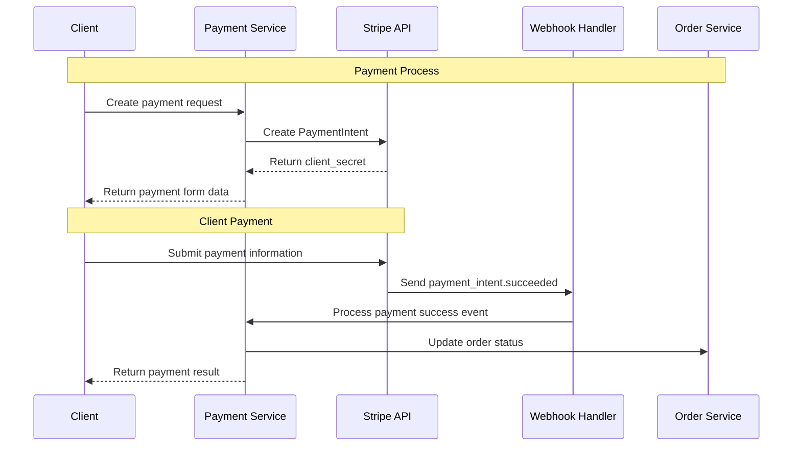
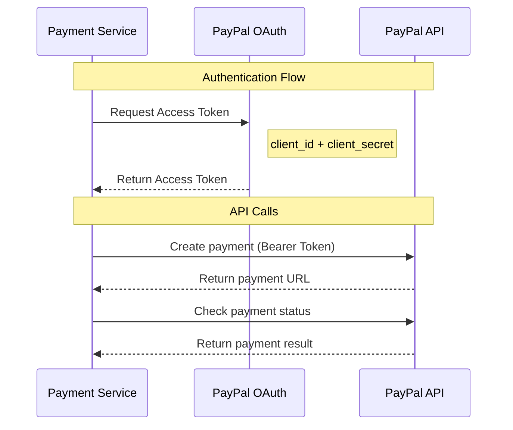
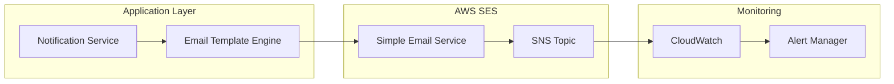
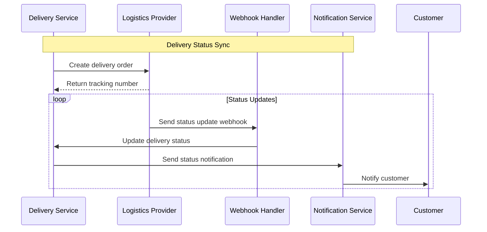

# External System Integration Detailed Design

## Overview

This document provides detailed design for GenAI Demo system integration with various external systems, including integration protocols, data exchange formats, error handling, and monitoring strategies.

## Payment System Integration

### Implementation Status Description
- ✅ **Implemented**: Features developed and running in production
- 🚧 **In Development**: Actively being developed, some features available
- 📋 **Planned**: Requirements confirmed, development not yet started

### Stripe Integration 📋 **Planned**

#### Integration Architecture


#### API Configuration
```yaml
stripe_integration:
  api_version: "2023-10-16"
  base_url: "https://api.stripe.com"
  endpoints:
    create_payment_intent: "/v1/payment_intents"
    retrieve_payment_intent: "/v1/payment_intents/{id}"
    confirm_payment_intent: "/v1/payment_intents/{id}/confirm"
  
  authentication:
    type: "Bearer Token"
    secret_key: "${STRIPE_SECRET_KEY}"
    publishable_key: "${STRIPE_PUBLISHABLE_KEY}"
  
  webhooks:
    endpoint: "/api/v1/webhooks/stripe"
    events:
      - "payment_intent.succeeded"
      - "payment_intent.payment_failed"
      - "charge.dispute.created"
    signature_verification: true
  
  retry_policy:
    max_attempts: 3
    backoff_strategy: "exponential"
    initial_delay: "1s"
    max_delay: "30s"
```

#### Error Handling
```java
@Component
public class StripeErrorHandler {
    
    public PaymentResult handleStripeException(StripeException e) {
        return switch (e.getCode()) {
            case "card_declined" -> PaymentResult.declined(
                "CARD_DECLINED", 
                "Your card was declined, please try another payment method"
            );
            case "insufficient_funds" -> PaymentResult.declined(
                "INSUFFICIENT_FUNDS", 
                "Insufficient funds, please check your account"
            );
            case "expired_card" -> PaymentResult.declined(
                "EXPIRED_CARD", 
                "Card has expired, please use a valid card"
            );
            case "rate_limit" -> PaymentResult.retry(
                "RATE_LIMITED", 
                "Too many requests, please try again later"
            );
            default -> PaymentResult.error(
                "PAYMENT_ERROR", 
                "Payment processing issue, please contact customer service"
            );
        };
    }
}
```

### PayPal Integration 📋 **Planned**

#### OAuth 2.0 Authentication Flow


#### Configuration Settings
```yaml
paypal_integration:
  environment: "sandbox" # sandbox | live
  base_url: "https://api.sandbox.paypal.com"
  
  oauth:
    token_url: "/v1/oauth2/token"
    client_id: "${PAYPAL_CLIENT_ID}"
    client_secret: "${PAYPAL_CLIENT_SECRET}"
    token_expiry: 32400 # 9 hours
  
  api_endpoints:
    create_order: "/v2/checkout/orders"
    capture_order: "/v2/checkout/orders/{id}/capture"
    get_order: "/v2/checkout/orders/{id}"
  
  webhooks:
    endpoint: "/api/v1/webhooks/paypal"
    events:
      - "CHECKOUT.ORDER.APPROVED"
      - "PAYMENT.CAPTURE.COMPLETED"
      - "PAYMENT.CAPTURE.DENIED"
```

## Communication Service Integration

### Amazon SES Integration ✅ **Implemented**

#### Email Sending Architecture


#### Email Template Management
```java
@Service
public class EmailTemplateService {
    
    private final Map<EmailType, EmailTemplate> templates = Map.of(
        EmailType.ORDER_CONFIRMATION, EmailTemplate.builder()
            .subject("Order Confirmation - Order #{{orderNumber}}")
            .templatePath("templates/order-confirmation.html")
            .requiredVariables(Set.of("customerName", "orderNumber", "orderItems"))
            .build(),
            
        EmailType.PASSWORD_RESET, EmailTemplate.builder()
            .subject("Password Reset Request")
            .templatePath("templates/password-reset.html")
            .requiredVariables(Set.of("customerName", "resetLink", "expiryTime"))
            .build()
    );
    
    public EmailContent generateEmail(EmailType type, Map<String, Object> variables) {
        EmailTemplate template = templates.get(type);
        validateRequiredVariables(template, variables);
        
        String subject = processTemplate(template.getSubject(), variables);
        String body = processTemplate(loadTemplate(template.getTemplatePath()), variables);
        
        return new EmailContent(subject, body);
    }
}
```

### SMS Service Integration 📋 **Planned**

#### Multi-Provider Support
```java
@Component
public class SmsServiceRouter {
    
    private final List<SmsProvider> providers = List.of(
        new AwsSnsProvider(),
        new TwilioProvider()
    );
    
    public SmsResult sendSms(String phoneNumber, String message) {
        for (SmsProvider provider : providers) {
            if (provider.isAvailable() && provider.supportsRegion(getRegion(phoneNumber))) {
                try {
                    return provider.sendSms(phoneNumber, message);
                } catch (SmsException e) {
                    logger.warn("SMS provider {} failed: {}", provider.getName(), e.getMessage());
                    // Continue to next provider
                }
            }
        }
        
        throw new AllSmsProvidersFailedException("All SMS providers are unavailable");
    }
}
```

## Logistics Service Integration

### Third-party Logistics API 📋 **Planned**

#### Unified Logistics Interface
```java
public interface LogisticsProvider {
    
    /**
     * Validate delivery address
     */
    AddressValidationResult validateAddress(Address address);
    
    /**
     * Calculate shipping cost
     */
    ShippingCost calculateShippingCost(ShippingRequest request);
    
    /**
     * Create delivery order
     */
    DeliveryOrder createDeliveryOrder(DeliveryRequest request);
    
    /**
     * Track delivery status
     */
    DeliveryStatus trackDelivery(String trackingNumber);
    
    /**
     * Cancel delivery
     */
    CancellationResult cancelDelivery(String deliveryId, String reason);
}
```

#### Delivery Status Synchronization


## Cloud Service Integration

### Amazon MSK (Kafka) Integration 📋 **Planned**

#### Event Publishing Configuration
```yaml
kafka_configuration:
  bootstrap_servers: "${MSK_BOOTSTRAP_SERVERS}"
  security_protocol: "SASL_SSL"
  sasl_mechanism: "AWS_MSK_IAM"
  
  producer:
    acks: "all"
    retries: 3
    batch_size: 16384
    linger_ms: 5
    buffer_memory: 33554432
    key_serializer: "org.apache.kafka.common.serialization.StringSerializer"
    value_serializer: "org.springframework.kafka.support.serializer.JsonSerializer"
  
  consumer:
    group_id: "genai-demo-consumer-group"
    auto_offset_reset: "earliest"
    enable_auto_commit: false
    key_deserializer: "org.apache.kafka.common.serialization.StringDeserializer"
    value_deserializer: "org.springframework.kafka.support.serializer.JsonDeserializer"
    
  topics:
    order_events: "order-events"
    payment_events: "payment-events"
    notification_events: "notification-events"
```

#### Event Handlers
```java
@Component
@KafkaListener(topics = "order-events")
public class OrderEventHandler {
    
    @KafkaHandler
    public void handleOrderCreated(OrderCreatedEvent event) {
        logger.info("Processing order created event: {}", event.getOrderId());
        
        // Trigger inventory reservation
        inventoryService.reserveStock(event.getOrderId(), event.getItems());
        
        // Send order confirmation email
        notificationService.sendOrderConfirmation(event.getCustomerId(), event.getOrderId());
    }
    
    @KafkaHandler
    public void handleOrderCancelled(OrderCancelledEvent event) {
        logger.info("Processing order cancelled event: {}", event.getOrderId());
        
        // Release inventory
        inventoryService.releaseStock(event.getOrderId());
        
        // Process refund
        if (event.getPaymentId() != null) {
            paymentService.processRefund(event.getPaymentId());
        }
    }
}
```

### AWS S3 Integration ✅ **Implemented**

#### File Upload Service
```java
@Service
public class FileStorageService {
    
    private final S3Client s3Client;
    private final String bucketName;
    
    public FileUploadResult uploadFile(MultipartFile file, FileCategory category) {
        try {
            // Generate unique filename
            String fileName = generateFileName(file.getOriginalFilename(), category);
            String key = category.getPath() + "/" + fileName;
            
            // Upload to S3
            PutObjectRequest request = PutObjectRequest.builder()
                .bucket(bucketName)
                .key(key)
                .contentType(file.getContentType())
                .contentLength(file.getSize())
                .build();
                
            s3Client.putObject(request, RequestBody.fromInputStream(
                file.getInputStream(), file.getSize()));
            
            // Generate presigned URL
            String presignedUrl = generatePresignedUrl(key, Duration.ofHours(1));
            
            return FileUploadResult.success(key, presignedUrl);
            
        } catch (Exception e) {
            logger.error("Failed to upload file: {}", file.getOriginalFilename(), e);
            return FileUploadResult.failure("File upload failed");
        }
    }
}
```

## Monitoring and Alerting

### External Service Health Checks

#### Health Check Configuration
```java
@Component
public class ExternalServiceHealthIndicator implements HealthIndicator {
    
    private final List<ExternalServiceChecker> checkers = List.of(
        new StripeHealthChecker(),
        new PayPalHealthChecker(),
        new SesHealthChecker(),
        new LogisticsHealthChecker()
    );
    
    @Override
    public Health health() {
        Health.Builder builder = Health.up();
        
        for (ExternalServiceChecker checker : checkers) {
            try {
                ServiceHealth health = checker.checkHealth();
                builder.withDetail(checker.getServiceName(), health);
                
                if (!health.isHealthy()) {
                    builder.down();
                }
            } catch (Exception e) {
                builder.down()
                    .withDetail(checker.getServiceName(), "Health check failed: " + e.getMessage());
            }
        }
        
        return builder.build();
    }
}
```

#### Alert Rules
```yaml
alerting_rules:
  - name: "external_service_availability"
    rules:
      - alert: "StripeServiceDown"
        expr: "stripe_api_success_rate < 0.95"
        for: "2m"
        labels:
          severity: "critical"
          service: "stripe"
        annotations:
          summary: "Stripe API availability below 95%"
          description: "Stripe API success rate is {{ $value }} in the past 2 minutes"
      
      - alert: "PaymentProcessingDelayed"
        expr: "payment_processing_duration_p95 > 10"
        for: "5m"
        labels:
          severity: "warning"
          service: "payment"
        annotations:
          summary: "Payment processing delayed"
          description: "Payment processing P95 latency is {{ $value }} seconds"
```

## Security Considerations

### API Security
- **Authentication**: OAuth 2.0, API Key, JWT Token
- **Authorization**: Role-Based Access Control (RBAC)
- **Encryption**: TLS 1.3 for data in transit
- **Signature Verification**: Webhook signature verification
- **Rate Limiting**: 1000 requests per minute limit

### Data Protection
- **Sensitive Data**: No credit card information stored
- **PII Encryption**: Personal identifiable information encrypted storage
- **Access Logs**: All API calls logged
- **Data Retention**: Automatic cleanup per regulatory requirements

### Network Security
- **VPC**: All services deployed in private network
- **Security Groups**: Minimum privilege network access
- **WAF**: Web Application Firewall protection
- **DDoS Protection**: CloudFlare + AWS Shield

---

**Last Updated**: January 22, 2025  
**Maintainer**: Architecture Team  
**Reviewer**: Security Team  
**Change Log**: 
- 2025-01-22: Added external system integration implementation status annotations