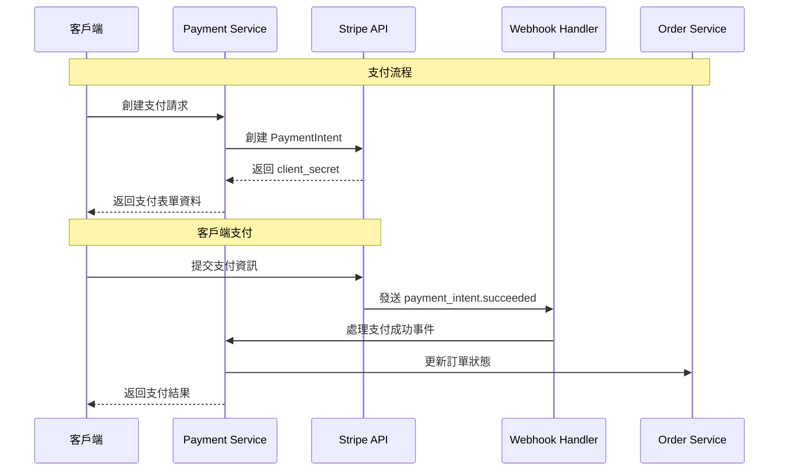
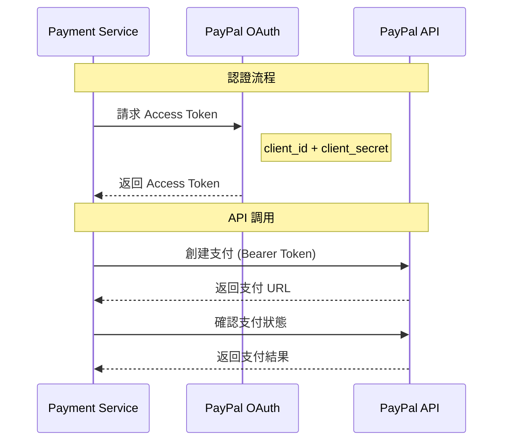
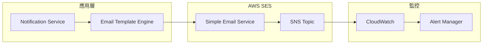
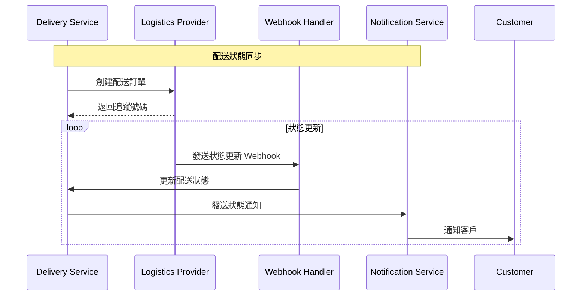

# 外部系統整合詳細設計

## 概覽

本文件詳細描述 GenAI Demo 系統與各外部系統的整合設計，包括整合協議、資料交換格式、錯誤處理和監控策略。

## 支付系統整合

### Stripe 整合

#### 整合架構


#### API 配置
```yaml
stripe_integration:
  api_version: "2023-10-16"
  base_url: "https://api.stripe.com"
  endpoints:
    create_payment_intent: "/v1/payment_intents"
    retrieve_payment_intent: "/v1/payment_intents/{id}"
    confirm_payment_intent: "/v1/payment_intents/{id}/confirm"
  
  authentication:
    type: "Bearer Token"
    secret_key: "${STRIPE_SECRET_KEY}"
    publishable_key: "${STRIPE_PUBLISHABLE_KEY}"
  
  webhooks:
    endpoint: "/../api/v1/webhooks/stripe"
    events:
      - "payment_intent.succeeded"
      - "payment_intent.payment_failed"
      - "charge.dispute.created"
    signature_verification: true
  
  retry_policy:
    max_attempts: 3
    backoff_strategy: "exponential"
    initial_delay: "1s"
    max_delay: "30s"
```

#### 錯誤處理
```java
@Component
public class StripeErrorHandler {
    
    public PaymentResult handleStripeException(StripeException e) {
        return switch (e.getCode()) {
            case "card_declined" -> PaymentResult.declined(
                "CARD_DECLINED", 
                "您的卡片被拒絕，請嘗試其他支付方式"
            );
            case "insufficient_funds" -> PaymentResult.declined(
                "INSUFFICIENT_FUNDS", 
                "餘額不足，請檢查您的帳戶"
            );
            case "expired_card" -> PaymentResult.declined(
                "EXPIRED_CARD", 
                "卡片已過期，請使用有效的卡片"
            );
            case "rate_limit" -> PaymentResult.retry(
                "RATE_LIMITED", 
                "請求過於頻繁，請稍後再試"
            );
            default -> PaymentResult.error(
                "PAYMENT_ERROR", 
                "支付處理出現問題，請聯繫客服"
            );
        };
    }
}
```

### PayPal 整合

#### OAuth 2.0 認證流程


#### 配置設定
```yaml
paypal_integration:
  environment: "sandbox" # sandbox | live
  base_url: "https://api.sandbox.paypal.com"
  
  oauth:
    token_url: "/v1/oauth2/token"
    client_id: "${PAYPAL_CLIENT_ID}"
    client_secret: "${PAYPAL_CLIENT_SECRET}"
    token_expiry: 32400 # 9 hours
  
  api_endpoints:
    create_order: "/v2/checkout/orders"
    capture_order: "/v2/checkout/orders/{id}/capture"
    get_order: "/v2/checkout/orders/{id}"
  
  webhooks:
    endpoint: "/../api/v1/webhooks/paypal"
    events:
      - "CHECKOUT.ORDER.APPROVED"
      - "PAYMENT.CAPTURE.COMPLETED"
      - "PAYMENT.CAPTURE.DENIED"
```

## 通訊服務整合

### Amazon SES 整合

#### Email 發送架構


#### Email 模板管理
```java
@Service
public class EmailTemplateService {
    
    private final Map<EmailType, EmailTemplate> templates = Map.of(
        EmailType.ORDER_CONFIRMATION, EmailTemplate.builder()
            .subject("訂單確認 - 訂單號 {{orderNumber}}")
            .templatePath("templates/order-confirmation.html")
            .requiredVariables(Set.of("customerName", "orderNumber", "orderItems"))
            .build(),
            
        EmailType.PASSWORD_RESET, EmailTemplate.builder()
            .subject("密碼重置請求")
            .templatePath("templates/password-reset.html")
            .requiredVariables(Set.of("customerName", "resetLink", "expiryTime"))
            .build()
    );
    
    public EmailContent generateEmail(EmailType type, Map<String, Object> variables) {
        EmailTemplate template = templates.get(type);
        validateRequiredVariables(template, variables);
        
        String subject = processTemplate(template.getSubject(), variables);
        String body = processTemplate(loadTemplate(template.getTemplatePath()), variables);
        
        return new EmailContent(subject, body);
    }
}
```

### SMS 服務整合

#### 多供應商支援
```java
@Component
public class SmsServiceRouter {
    
    private final List<SmsProvider> providers = List.of(
        new AwsSnsProvider(),
        new TwilioProvider()
    );
    
    public SmsResult sendSms(String phoneNumber, String message) {
        for (SmsProvider provider : providers) {
            if (provider.isAvailable() && provider.supportsRegion(getRegion(phoneNumber))) {
                try {
                    return provider.sendSms(phoneNumber, message);
                } catch (SmsException e) {
                    logger.warn("SMS provider {} failed: {}", provider.getName(), e.getMessage());
                    // 繼續嘗試下一個供應商
                }
            }
        }
        
        throw new AllSmsProvidersFailedException("所有 SMS 供應商都無法使用");
    }
}
```

## 物流服務整合

### 第三方物流 API

#### 統一物流介面
```java
public interface LogisticsProvider {
    
    /**
     * 驗證配送地址
     */
    AddressValidationResult validateAddress(Address address);
    
    /**
     * 計算運費
     */
    ShippingCost calculateShippingCost(ShippingRequest request);
    
    /**
     * 創建配送訂單
     */
    DeliveryOrder createDeliveryOrder(DeliveryRequest request);
    
    /**
     * 追蹤配送狀態
     */
    DeliveryStatus trackDelivery(String trackingNumber);
    
    /**
     * 取消配送
     */
    CancellationResult cancelDelivery(String deliveryId, String reason);
}
```

#### 配送狀態同步


## 雲端服務整合

### Amazon MSK (Kafka) 整合

#### 事件發布配置
```yaml
kafka_configuration:
  bootstrap_servers: "${MSK_BOOTSTRAP_SERVERS}"
  security_protocol: "SASL_SSL"
  sasl_mechanism: "AWS_MSK_IAM"
  
  producer:
    acks: "all"
    retries: 3
    batch_size: 16384
    linger_ms: 5
    buffer_memory: 33554432
    key_serializer: "org.apache.kafka.common.serialization.StringSerializer"
    value_serializer: "org.springframework.kafka.support.serializer.JsonSerializer"
  
  consumer:
    group_id: "genai-demo-consumer-group"
    auto_offset_reset: "earliest"
    enable_auto_commit: false
    key_deserializer: "org.apache.kafka.common.serialization.StringDeserializer"
    value_deserializer: "org.springframework.kafka.support.serializer.JsonDeserializer"
    
  topics:
    order_events: "order-events"
    payment_events: "payment-events"
    notification_events: "notification-events"
```

#### 事件處理器
```java
@Component
@KafkaListener(topics = "order-events")
public class OrderEventHandler {
    
    @KafkaHandler
    public void handleOrderCreated(OrderCreatedEvent event) {
        logger.info("Processing order created event: {}", event.getOrderId());
        
        // 觸發庫存預留
        inventoryService.reserveStock(event.getOrderId(), event.getItems());
        
        // 發送訂單確認郵件
        notificationService.sendOrderConfirmation(event.getCustomerId(), event.getOrderId());
    }
    
    @KafkaHandler
    public void handleOrderCancelled(OrderCancelledEvent event) {
        logger.info("Processing order cancelled event: {}", event.getOrderId());
        
        // 釋放庫存
        inventoryService.releaseStock(event.getOrderId());
        
        // 處理退款
        if (event.getPaymentId() != null) {
            paymentService.processRefund(event.getPaymentId());
        }
    }
}
```

### AWS S3 整合

#### 檔案上傳服務
```java
@Service
public class FileStorageService {
    
    private final S3Client s3Client;
    private final String bucketName;
    
    public FileUploadResult uploadFile(MultipartFile file, FileCategory category) {
        try {
            // 生成唯一檔案名
            String fileName = generateFileName(file.getOriginalFilename(), category);
            String key = category.getPath() + "/" + fileName;
            
            // 上傳到 S3
            PutObjectRequest request = PutObjectRequest.builder()
                .bucket(bucketName)
                .key(key)
                .contentType(file.getContentType())
                .contentLength(file.getSize())
                .build();
                
            s3Client.putObject(request, RequestBody.fromInputStream(
                file.getInputStream(), file.getSize()));
            
            // 生成預簽名 URL
            String presignedUrl = generatePresignedUrl(key, Duration.ofHours(1));
            
            return FileUploadResult.success(key, presignedUrl);
            
        } catch (Exception e) {
            logger.error("Failed to upload file: {}", file.getOriginalFilename(), e);
            return FileUploadResult.failure("檔案上傳失敗");
        }
    }
}
```

## 監控和告警

### 外部服務健康檢查

#### 健康檢查配置
```java
@Component
public class ExternalServiceHealthIndicator implements HealthIndicator {
    
    private final List<ExternalServiceChecker> checkers = List.of(
        new StripeHealthChecker(),
        new PayPalHealthChecker(),
        new SesHealthChecker(),
        new LogisticsHealthChecker()
    );
    
    @Override
    public Health health() {
        Health.Builder builder = Health.up();
        
        for (ExternalServiceChecker checker : checkers) {
            try {
                ServiceHealth health = checker.checkHealth();
                builder.withDetail(checker.getServiceName(), health);
                
                if (!health.isHealthy()) {
                    builder.down();
                }
            } catch (Exception e) {
                builder.down()
                    .withDetail(checker.getServiceName(), "Health check failed: " + e.getMessage());
            }
        }
        
        return builder.build();
    }
}
```

#### 告警規則
```yaml
alerting_rules:
  - name: "external_service_availability"
    rules:
      - alert: "StripeServiceDown"
        expr: "stripe_api_success_rate < 0.95"
        for: "2m"
        labels:
          severity: "critical"
          service: "stripe"
        annotations:
          summary: "Stripe API 可用性低於 95%"
          description: "Stripe API 在過去 2 分鐘內成功率為 {{ $value }}"
      
      - alert: "PaymentProcessingDelayed"
        expr: "payment_processing_duration_p95 > 10"
        for: "5m"
        labels:
          severity: "warning"
          service: "payment"
        annotations:
          summary: "支付處理延遲"
          description: "支付處理 P95 延遲為 {{ $value }} 秒"
```

## 安全考量

### API 安全
- **認證**: OAuth 2.0, API Key, JWT Token
- **授權**: 基於角色的存取控制 (RBAC)
- **加密**: TLS 1.3 for data in transit
- **簽名驗證**: Webhook 簽名驗證
- **速率限制**: 每分鐘 1000 請求限制

### 資料保護
- **敏感資料**: 不存儲信用卡資訊
- **PII 加密**: 個人識別資訊加密存儲
- **存取日誌**: 所有 API 調用記錄
- **資料保留**: 按法規要求自動清理

### 網路安全
- **VPC**: 所有服務部署在私有網路
- **Security Groups**: 最小權限網路存取
- **WAF**: Web Application Firewall 保護
- **DDoS 防護**: CloudFlare + AWS Shield

---

**最後更新**: 2025年1月22日  
**維護者**: 架構團隊  
**審核者**: 安全團隊