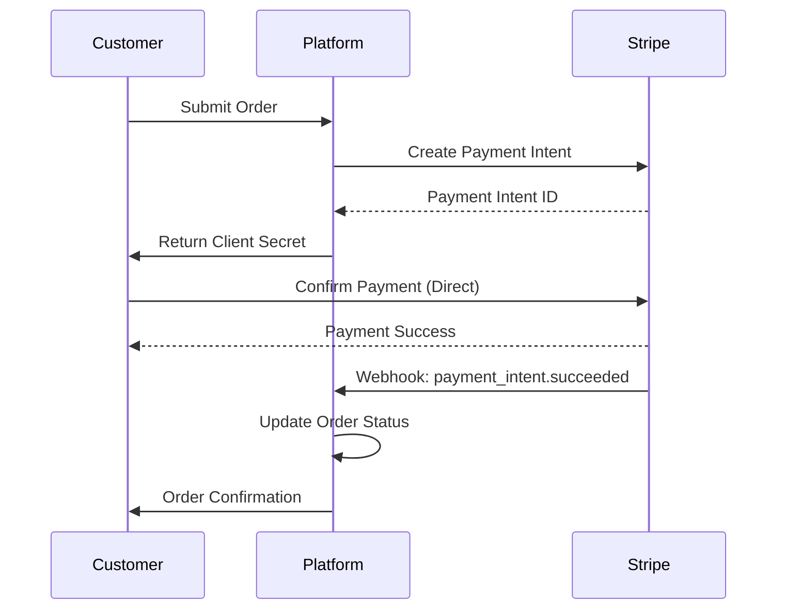
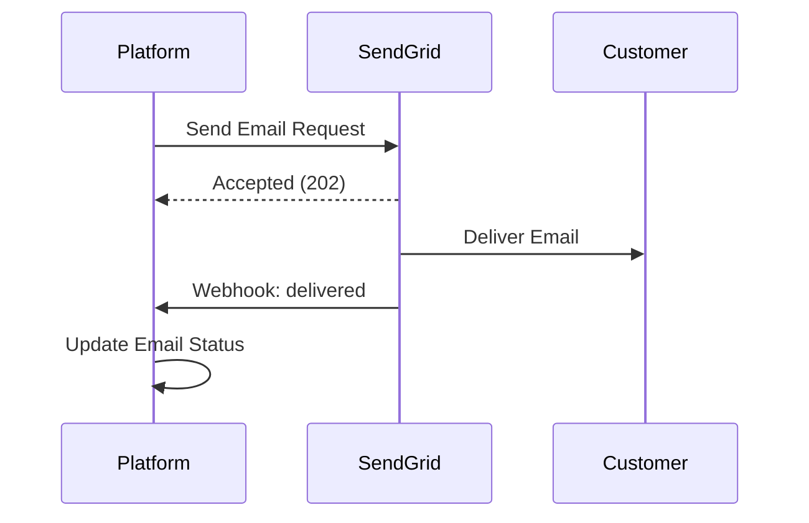
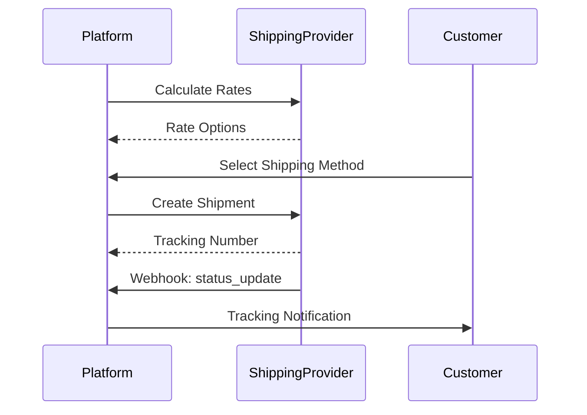
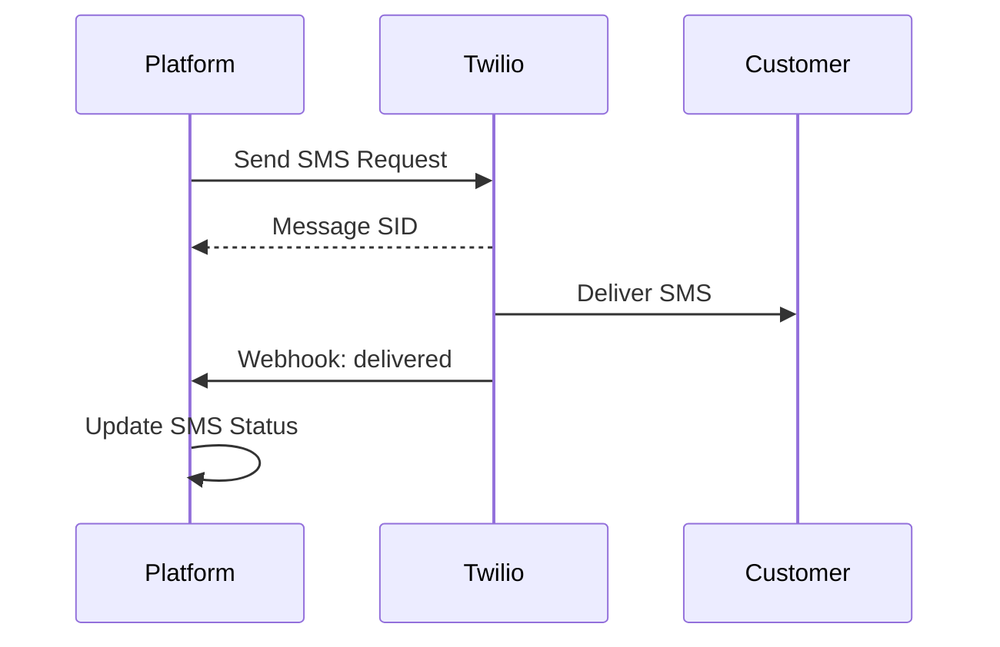

# External Systems Integration

> **Viewpoint**: Context  
> **Purpose**: Document all external system integrations and their interfaces  
> **Audience**: Architects, Developers, Operations Team, Integration Team

## Overview

This document describes all external systems that the E-Commerce Platform integrates with, including integration patterns, data flows, error handling, and operational considerations.

## External System Catalog

### Payment Gateway

**System**: Stripe Payment Gateway  
**Type**: Third-party SaaS  
**Criticality**: Critical  
**Integration Pattern**: Synchronous API + Webhooks

#### Purpose

Process customer payments, manage payment methods, handle refunds, and ensure PCI-DSS compliance.

#### Integration Details

**API Endpoints Used**

- `POST /v1/payment_intents` - Create payment intent
- `POST /v1/payment_intents/{id}/confirm` - Confirm payment
- `POST /v1/refunds` - Process refund
- `GET /v1/payment_methods` - List payment methods
- `POST /v1/customers` - Create customer in Stripe

**Authentication**

- API Key authentication (Bearer token)
- Separate keys for test and production environments
- Keys stored in AWS Secrets Manager
- Key rotation every 90 days

**Data Flow**

**Webhook Events Consumed**

- `payment_intent.succeeded` - Payment successful
- `payment_intent.payment_failed` - Payment failed
- `charge.refunded` - Refund processed
- `customer.updated` - Customer information updated

**Error Handling**

- Retry logic: 3 attempts with exponential backoff
- Circuit breaker: Open after 5 consecutive failures
- Fallback: Queue payment for manual processing
- Timeout: 30 seconds for API calls

**Rate Limits**

- 100 requests per second per API key
- Burst capacity: 200 requests
- Monitoring: Alert when usage exceeds 80%

**SLA**

- Availability: 99.99%
- Response time: < 500ms (95th percentile)
- Support: 24/7 email and phone support

**Cost Model**

- 2.9% + $0.30 per successful transaction
- No monthly fees
- Refund fees: $0.30 per refund

**Security Considerations**

- PCI-DSS Level 1 certified
- All payment data encrypted in transit (TLS 1.3)
- No card data stored in our system
- Tokenization for recurring payments

**Monitoring**

- Payment success rate
- Payment processing time
- Failed payment reasons
- Webhook delivery success rate

---

### Email Service

**System**: SendGrid  
**Type**: Third-party SaaS  
**Criticality**: High  
**Integration Pattern**: Asynchronous API + Webhooks

#### Purpose

Send transactional emails (order confirmations, shipping notifications) and marketing emails to customers.

#### Integration Details

**API Endpoints Used**

- `POST /v3/mail/send` - Send email
- `POST /v3/mail/batch` - Send batch emails
- `GET /v3/stats` - Get email statistics
- `POST /v3/templates` - Manage email templates

**Authentication**

- API Key authentication
- Keys stored in AWS Secrets Manager
- Separate keys for transactional and marketing emails

**Data Flow**

**Email Types**

- Order confirmation
- Shipping notification
- Password reset
- Welcome email
- Promotional campaigns
- Account notifications

**Webhook Events Consumed**

- `delivered` - Email delivered successfully
- `open` - Email opened by recipient
- `click` - Link clicked in email
- `bounce` - Email bounced
- `spam_report` - Marked as spam
- `unsubscribe` - User unsubscribed

**Error Handling**

- Retry logic: 5 attempts with exponential backoff
- Dead letter queue for failed emails
- Fallback: Log error and alert operations team
- Timeout: 10 seconds for API calls

**Rate Limits**

- 10,000 emails per hour (transactional)
- 100,000 emails per day (marketing)
- Monitoring: Alert when usage exceeds 80%

**SLA**

- Availability: 99.95%
- Delivery rate: > 98%
- Support: 24/7 email support, phone for enterprise

**Cost Model**

- $14.95/month for 40,000 emails
- $0.00085 per additional email
- Free tier: 100 emails/day

**Security Considerations**

- DKIM and SPF configured
- TLS encryption for email transmission
- Unsubscribe link in all marketing emails
- GDPR compliant data handling

**Monitoring**

- Email delivery rate
- Bounce rate
- Open rate
- Click-through rate
- Spam complaint rate

---

### Shipping Providers

**Systems**: FedEx, UPS, DHL  
**Type**: Third-party APIs  
**Criticality**: High  
**Integration Pattern**: Synchronous API + Webhooks

#### Purpose

Calculate shipping costs, create shipping labels, track shipments, and manage delivery logistics.

#### Integration Details

**Common API Operations**

- Rate calculation
- Label generation
- Shipment tracking
- Address validation
- Pickup scheduling

**Authentication**

- OAuth 2.0 for FedEx and UPS
- API Key for DHL
- Credentials stored in AWS Secrets Manager
- Token refresh automated

**Data Flow**

**FedEx Integration**

**API Endpoints**

- `POST /rate/v1/rates/quotes` - Get shipping rates
- `POST /ship/v1/shipments` - Create shipment
- `POST /track/v1/trackingnumbers` - Track shipment

**Rate Limits**: 1,000 requests per hour  
**SLA**: 99.9% availability  
**Cost**: Volume-based pricing

**UPS Integration**

**API Endpoints**

- `POST /api/rating/v1/Rate` - Get shipping rates
- `POST /api/shipments/v1/ship` - Create shipment
- `GET /api/track/v1/details/{trackingNumber}` - Track shipment

**Rate Limits**: 500 requests per hour  
**SLA**: 99.9% availability  
**Cost**: Volume-based pricing

**DHL Integration**

**API Endpoints**

- `POST /rates` - Get shipping rates
- `POST /shipments` - Create shipment
- `GET /tracking/{trackingNumber}` - Track shipment

**Rate Limits**: 2,000 requests per hour  
**SLA**: 99.5% availability  
**Cost**: Volume-based pricing

**Error Handling**

- Retry logic: 3 attempts with exponential backoff
- Fallback: Try alternative shipping provider
- Circuit breaker: Open after 5 consecutive failures
- Timeout: 15 seconds for API calls

**Monitoring**

- API response time
- Success rate per provider
- Shipping cost accuracy
- Tracking update frequency

---

### SMS Notification Service

**System**: Twilio  
**Type**: Third-party SaaS  
**Criticality**: Medium  
**Integration Pattern**: Asynchronous API + Webhooks

#### Purpose

Send SMS notifications for order updates, delivery alerts, and verification codes.

#### Integration Details

**API Endpoints Used**

- `POST /2010-04-01/Accounts/{AccountSid}/Messages.json` - Send SMS
- `GET /2010-04-01/Accounts/{AccountSid}/Messages/{MessageSid}.json` - Get message status

**Authentication**

- Account SID and Auth Token
- Credentials stored in AWS Secrets Manager

**Data Flow**

**SMS Types**

- Order status updates
- Delivery notifications
- Two-factor authentication codes
- Promotional messages (with opt-in)

**Webhook Events Consumed**

- `delivered` - SMS delivered
- `failed` - SMS delivery failed
- `undelivered` - SMS undelivered

**Error Handling**

- Retry logic: 3 attempts
- Fallback: Send email notification instead
- Timeout: 10 seconds

**Rate Limits**

- 1,000 messages per second
- Monitoring: Alert when usage exceeds 80%

**SLA**

- Availability: 99.95%
- Delivery rate: > 95%
- Support: 24/7 email and phone

**Cost Model**

- $0.0075 per SMS (US)
- $0.02 - $0.10 per SMS (international)
- No monthly fees

**Security Considerations**

- End-to-end encryption
- Opt-in required for marketing messages
- Opt-out mechanism provided
- TCPA compliance

**Monitoring**

- SMS delivery rate
- Failed delivery reasons
- Response time
- Cost per message

---

### Cloud Infrastructure

**System**: Amazon Web Services (AWS)  
**Type**: Cloud Platform  
**Criticality**: Critical  
**Integration Pattern**: SDK + Infrastructure as Code

#### Purpose

Provide cloud infrastructure for compute, storage, networking, and managed services.

#### Services Used

**Compute**

- EKS (Elastic Kubernetes Service) - Container orchestration
- Lambda - Serverless functions
- EC2 - Virtual machines (bastion hosts)

**Storage**

- RDS PostgreSQL - Primary database
- ElastiCache Redis - Caching layer
- S3 - Object storage for images and files

**Messaging**

- MSK (Managed Streaming for Apache Kafka) - Event streaming
- SQS - Message queuing
- SNS - Pub/sub notifications

**Networking**

- VPC - Virtual private cloud
- ALB - Application load balancer
- Route 53 - DNS management
- CloudFront - CDN

**Security**

- IAM - Identity and access management
- Secrets Manager - Secrets storage
- KMS - Key management
- WAF - Web application firewall

**Observability**

- CloudWatch - Logging and monitoring
- X-Ray - Distributed tracing
- CloudTrail - Audit logging

**Authentication**

- IAM roles for service-to-service
- IAM users for human access
- MFA required for production access

**Infrastructure as Code**

- AWS CDK (TypeScript)
- Version controlled in Git
- Automated deployment via CI/CD

**Cost Management**

- Budget alerts configured
- Cost allocation tags
- Reserved instances for predictable workloads
- Spot instances for batch processing

**Security Considerations**

- Least privilege IAM policies
- Encryption at rest and in transit
- VPC security groups and NACLs
- Regular security audits

**Monitoring**

- Service health dashboards
- Cost monitoring
- Security alerts
- Performance metrics

---

## Integration Patterns

### Synchronous Integration

**When to Use**

- Real-time data required
- Immediate response needed
- Transactional operations

**Implementation**

- REST API calls
- Timeout configuration
- Retry logic with exponential backoff
- Circuit breaker pattern

**Example**: Payment processing, shipping rate calculation

### Asynchronous Integration

**When to Use**

- Non-critical operations
- Batch processing
- Event-driven workflows

**Implementation**

- Message queues (SQS)
- Event streaming (Kafka)
- Webhook callbacks
- Dead letter queues

**Example**: Email notifications, SMS alerts

### Webhook Integration

**When to Use**

- External system needs to notify us
- Event-driven updates
- Asynchronous callbacks

**Implementation**

- Webhook endpoint exposed
- Signature verification
- Idempotency handling
- Retry mechanism

**Example**: Payment status updates, shipping tracking updates

## Error Handling Strategy

### Retry Logic

**Transient Errors**

- Network timeouts
- Rate limit exceeded
- Temporary service unavailability

**Retry Configuration**

- Max attempts: 3-5 depending on criticality
- Backoff strategy: Exponential with jitter
- Timeout: Service-specific (10-30 seconds)

### Circuit Breaker

**Purpose**: Prevent cascading failures

**States**

- Closed: Normal operation
- Open: Failures exceed threshold, stop calling
- Half-Open: Test if service recovered

**Configuration**

- Failure threshold: 5 consecutive failures
- Timeout: 60 seconds
- Success threshold: 2 successful calls to close

### Fallback Strategies

**Payment Gateway Failure**

- Queue payment for manual processing
- Notify operations team
- Display user-friendly error message

**Email Service Failure**

- Store email in dead letter queue
- Retry after service recovery
- Log for manual follow-up

**Shipping Provider Failure**

- Try alternative provider
- Use cached rates if available
- Notify operations team

## Security Considerations

### API Key Management

**Storage**

- AWS Secrets Manager for all API keys
- Automatic rotation every 90 days
- Separate keys for dev/staging/production

**Access Control**

- IAM roles for service access
- Least privilege principle
- Audit logging enabled

### Data Protection

**In Transit**

- TLS 1.3 for all external communications
- Certificate pinning for critical services
- Mutual TLS for high-security integrations

**At Rest**

- Encryption for sensitive data
- No storage of payment card data
- Tokenization for recurring payments

### Compliance

**PCI-DSS**

- Payment gateway handles card data
- No card data in our systems
- Annual compliance audit

**GDPR**

- Data processing agreements with vendors
- Right to erasure implemented
- Data portability supported

## Monitoring and Alerting

### Key Metrics

**Availability**

- External service uptime
- API response time
- Error rate

**Performance**

- Request latency (p50, p95, p99)
- Throughput (requests per second)
- Queue depth

**Business**

- Payment success rate
- Email delivery rate
- Shipping cost accuracy

### Alerts

**Critical Alerts** (Page on-call)

- Payment gateway unavailable
- Database connection failure
- High error rate (> 5%)

**Warning Alerts** (Email/Slack)

- Elevated error rate (> 1%)
- Slow response time (> 2s)
- Rate limit approaching (> 80%)

**Info Alerts** (Dashboard)

- Cost threshold exceeded
- Unusual traffic patterns
- Service degradation

## Operational Procedures

### Service Outage Response

**Detection**

- Automated monitoring alerts
- Customer reports
- External status pages

**Response**

1. Acknowledge alert
2. Check service status page
3. Activate fallback if available
4. Notify stakeholders
5. Monitor recovery
6. Post-mortem after resolution

### Vendor Communication

**Regular Reviews**

- Quarterly business reviews
- Monthly operational sync
- Weekly incident reviews (if needed)

**Escalation Contacts**

- Technical support: 24/7 email/phone
- Account manager: Business hours
- Emergency escalation: Critical issues

### Cost Optimization

**Regular Reviews**

- Monthly cost analysis
- Quarterly vendor negotiation
- Annual contract renewal

**Optimization Strategies**

- Volume discounts negotiation
- Reserved capacity for predictable load
- Alternative vendor evaluation

## Related Documentation

- [Context Viewpoint Overview](overview.md) - System context
- [System Scope and Boundaries](scope-and-boundaries.md) - What's in/out of scope
- [Stakeholders](stakeholders.md) - Stakeholder concerns
- [Security Perspective](../../perspectives/security/README.md) - Security requirements
- [Operational Viewpoint](../operational/overview.md) - Operations procedures

---

**Document Status**: Active  
**Last Review**: 2025-10-23  
**Next Review**: 2025-11-23  
**Owner**: Integration Team
