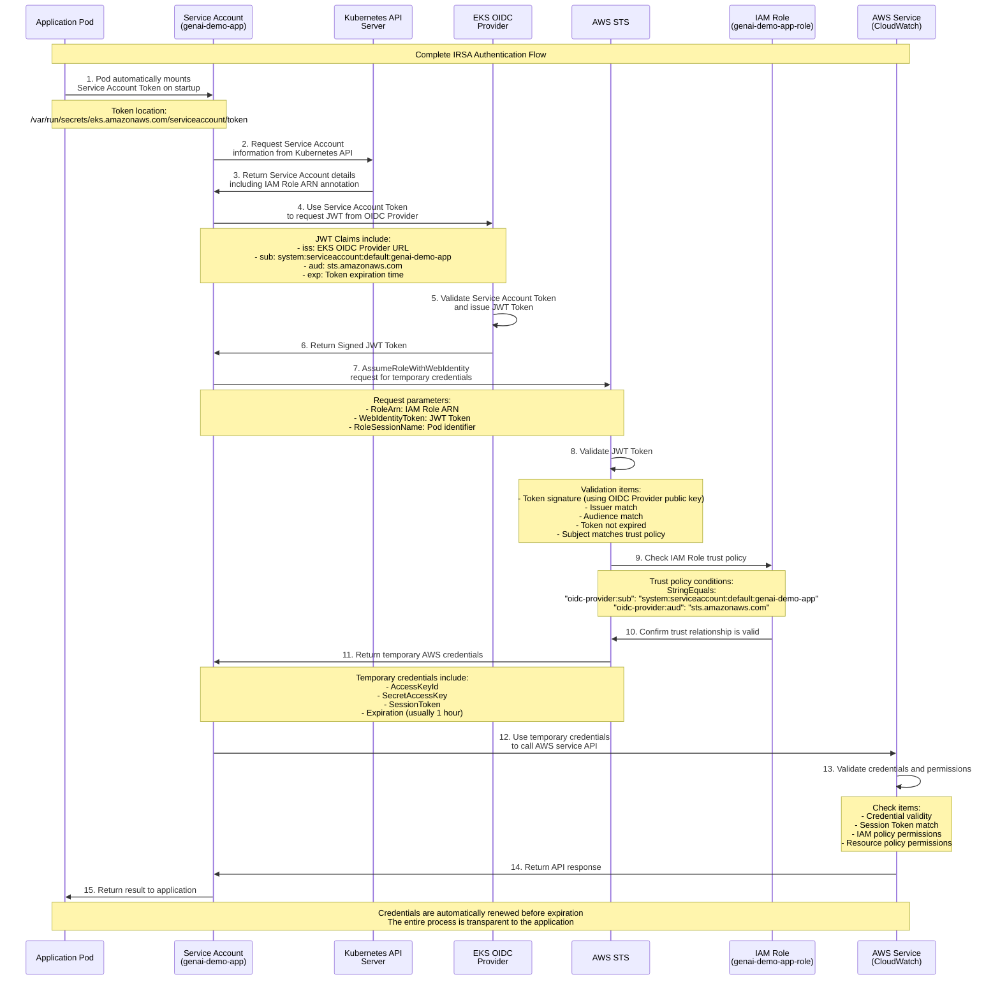

# IAM Permissions Relationships and System Integration - Context Viewpoint

**Document Version**: 1.0  
**Last Updated**: September 28, 2025 11:12 PM (Taipei Time)  
**Author**: Security & Architecture Team  
**Status**: Active

## 📋 Table of Contents

- Overview
- System Boundary Definition
- IAM Permissions Relationship Architecture
- Service Account Permission Mapping
- External System Integration
- Cross-Service Communication
- Compliance and Governance
- Permission Auditing and Monitoring

## Overview

This document describes the boundaries, external dependencies, and IAM permission roles and relationships within the GenAI Demo system ecosystem. The system adopts a zero-trust security model where all inter-component communications require explicit authentication and authorization, following the principle of least privilege.

### Context Scope

- **System Boundary**: Applications within Kubernetes cluster and AWS cloud services
- **External Dependencies**: AWS managed services, third-party APIs, monitoring systems
- **Stakeholders**: Development team, operations team, security team, compliance team
- **Governance Framework**: AWS Well-Architected Framework, SOC 2, ISO 27001

## System Boundary Definition

### System Boundary Diagram

```mermaid
graph TB
    subgraph "External Actors"
        Users[End Users<br/>Web/Mobile]
        Developers[Development Team<br/>CI/CD Pipeline]
        Operators[Operations Team<br/>Management Console]
        Auditors[Auditors<br/>Compliance Tools]
    end
    
    subgraph "System Boundary - GenAI Demo"
        subgraph "Application Layer"
            WebApp[Web Application<br/>React/Angular]
            API[REST API<br/>Spring Boot]
            Background[Background Jobs<br/>Async Processing]
        end
        
        subgraph "Platform Layer"
            K8s[Kubernetes Platform<br/>EKS Cluster]
            ServiceMesh[Service Mesh<br/>Istio/Linkerd]
            Monitoring[Monitoring Stack<br/>Prometheus/Grafana]
        end
        
        subgraph "Data Layer"
            Database[Primary Database<br/>Aurora PostgreSQL]
            Cache[Cache Layer<br/>ElastiCache Redis]
            MessageQueue[Message Queue<br/>MSK Kafka]
        end
    end
    
    subgraph "AWS Managed Services"
        subgraph "Identity & Access"
            IAM[AWS IAM<br/>Roles & Policies]
            STS[AWS STS<br/>Token Service]
            OIDC[EKS OIDC Provider<br/>Identity Federation]
        end
        
        subgraph "Security Services"
            KMS[AWS KMS<br/>Key Management]
            Secrets[AWS Secrets Manager<br/>Secret Storage]
            WAF[AWS WAF<br/>Web Application Firewall]
            Shield[AWS Shield<br/>DDoS Protection]
        end
        
        subgraph "Observability Services"
            CloudWatch[AWS CloudWatch<br/>Metrics & Logs]
            XRay[AWS X-Ray<br/>Distributed Tracing]
            Config[AWS Config<br/>Configuration Tracking]
            CloudTrail[AWS CloudTrail<br/>API Audit Logs]
        end
        
        subgraph "Network Services"
            Route53[AWS Route 53<br/>DNS Management]
            CloudFront[AWS CloudFront<br/>CDN]
            VPC[AWS VPC<br/>Network Isolation]
            ALB[Application Load Balancer<br/>Traffic Distribution]
        end
    end
    
    subgraph "External Dependencies"
        subgraph "Third-party Services"
            PaymentGW[Payment Gateway<br/>Stripe/PayPal]
            EmailService[Email Service<br/>SendGrid/SES]
            Analytics[Analytics Service<br/>Google Analytics]
        end
        
        subgraph "Development Tools"
            GitHub[GitHub<br/>Source Control]
            DockerHub[Docker Hub<br/>Container Registry]
            Slack[Slack<br/>Notifications]
        end
    end
    
    %% User Interactions
    Users --> WebApp
    Users --> API
    
    %% Developer Interactions
    Developers --> GitHub
    Developers --> K8s
    
    %% Operator Interactions
    Operators --> CloudWatch
    Operators --> K8s
    
    %% Auditor Interactions
    Auditors --> CloudTrail
    Auditors --> Config
    
    %% Internal System Flows
    WebApp --> API
    API --> Database
    API --> Cache
    API --> MessageQueue
    Background --> MessageQueue
    
    %% Platform Integration
    API --> K8s
    K8s --> Monitoring
    
    %% AWS Service Integration
    K8s --> IAM
    IAM --> STS
    STS --> OIDC
    
    API --> KMS
    API --> Secrets
    API --> CloudWatch
    API --> XRay
    
    WebApp --> CloudFront
    CloudFront --> WAF
    WAF --> ALB
    ALB --> API
    
    %% External Service Integration
    API --> PaymentGW
    API --> EmailService
    WebApp --> Analytics
    
    K8s --> DockerHub
    Monitoring --> Slack
    
    style Users fill:#e1f5fe
    style API fill:#c8e6c9
    style K8s fill:#e8f5e8
    style IAM fill:#fce4ec
    style CloudWatch fill:#fff3e0
```



### Trust Boundaries

```yaml
Trust Boundaries:

Level 1 - Public Internet:
  Actors: End users, anonymous visitors
  Trust Level: Zero trust
  Security Controls:
    - AWS WAF rules
    - DDoS protection (AWS Shield)
    - Rate limiting
    - IP whitelist/blacklist

Level 2 - CDN/Edge:
  Actors: CloudFront, edge locations
  Trust Level: AWS managed service trust
  Security Controls:
    - SSL/TLS termination
    - Geographic blocking
    - Caching policies
    - Origin verification

Level 3 - Load Balancer:
  Actors: Application Load Balancer
  Trust Level: AWS VPC internal trust
  Security Controls:
    - Security group rules
    - SSL certificate validation
    - Health checks
    - Access logs

Level 4 - Kubernetes Cluster:
  Actors: EKS control plane, worker nodes
  Trust Level: Platform layer trust
  Security Controls:
    - RBAC permission control
    - Network Policies
    - Pod Security Standards
    - Service Account permissions

Level 5 - Application Pods:
  Actors: Application containers
  Trust Level: Application layer trust
  Security Controls:
    - IRSA (IAM Roles for Service Accounts)
    - Least privilege principle
    - Resource limits
    - Security context

Level 6 - AWS Services:
  Actors: RDS, ElastiCache, MSK, etc.
  Trust Level: AWS managed service trust
  Security Controls:
    - VPC endpoints
    - Encryption in transit and at rest
    - IAM resource policies
    - Service-specific security settings
```

## IAM Permissions Relationship Architecture

### Complete IAM Permission Flow Diagram

```mermaid
graph TB
    subgraph "Identity Providers"
        subgraph "EKS OIDC Provider"
            OIDC[EKS OIDC Identity Provider<br/>https://oidc.eks.region.amazonaws.com/id/cluster-id]
            JWTToken[JWT Token<br/>Service Account Identity]
        end
        
        subgraph "AWS STS"
            STS[AWS Security Token Service<br/>AssumeRoleWithWebIdentity]
            TempCreds[Temporary Credentials<br/>Access Key + Secret + Token]
        end
    end
    
    subgraph "IAM Roles & Policies"
        subgraph "Service Roles"
            AppRole[Application Service Role<br/>genai-demo-{env}-app-role]
            AutoscalerRole[Cluster Autoscaler Role<br/>genai-demo-{env}-autoscaler-role]
            EKSClusterRole[EKS Cluster Service Role<br/>genai-demo-{env}-eks-cluster-role]
            EKSNodeRole[EKS Node Group Role<br/>genai-demo-{env}-eks-node-role]
        end
        
        subgraph "IAM Policies"
            subgraph "AWS Managed Policies"
                EKSClusterPolicy[AmazonEKSClusterPolicy]
                EKSNodePolicy[AmazonEKSWorkerNodePolicy]
                EKSCNIPolicy[AmazonEKS_CNI_Policy]
                ECRReadPolicy[AmazonEC2ContainerRegistryReadOnly]
            end
            
            subgraph "Custom Policies"
                AppCustomPolicy[Application Custom Policy<br/>CloudWatch + X-Ray + SSM + Secrets + KMS]
                AutoscalerCustomPolicy[Autoscaler Custom Policy<br/>EC2 + AutoScaling + EKS]
                CrossAccountPolicy[Cross-Account Access Policy<br/>Multi-Region Resources]
            end
        end
    end
    
    subgraph "Kubernetes RBAC"
        subgraph "Service Accounts"
            AppSA[genai-demo-app<br/>namespace: default]
            AutoscalerSA[cluster-autoscaler<br/>namespace: kube-system]
            MonitoringSA[monitoring-sa<br/>namespace: monitoring]
        end
        
        subgraph "RBAC Resources"
            AppRole_K8s[Application Role<br/>Pod Management]
            AutoscalerClusterRole[Cluster Autoscaler ClusterRole<br/>Node Management]
            MonitoringClusterRole[Monitoring ClusterRole<br/>Metrics Collection]
            
            AppRoleBinding[Application RoleBinding<br/>default namespace]
            AutoscalerClusterRoleBinding[Autoscaler ClusterRoleBinding<br/>cluster-wide]
            MonitoringClusterRoleBinding[Monitoring ClusterRoleBinding<br/>cluster-wide]
        end
    end
    
    subgraph "AWS Resources"
        subgraph "Compute & Storage"
            EC2[EC2 Instances<br/>EKS Worker Nodes]
            EBS[EBS Volumes<br/>Persistent Storage]
            ECR[ECR Repositories<br/>Container Images]
        end
        
        subgraph "Data Services"
            RDS[RDS Aurora<br/>PostgreSQL Database]
            ElastiCache[ElastiCache<br/>Redis Cluster]
            MSK[MSK<br/>Kafka Cluster]
        end
        
        subgraph "Security & Monitoring"
            KMS[KMS Keys<br/>Encryption]
            SecretsManager[Secrets Manager<br/>Sensitive Data]
            CloudWatch[CloudWatch<br/>Metrics & Logs]
            XRay[X-Ray<br/>Distributed Tracing]
            SSM[Systems Manager<br/>Parameter Store]
        end
    end
    
    subgraph "Application Workloads"
        AppPod1[genai-demo-app-1<br/>Pod Instance]
        AppPod2[genai-demo-app-2<br/>Pod Instance]
        AutoscalerPod[cluster-autoscaler<br/>Pod Instance]
        MonitoringPod[prometheus<br/>Pod Instance]
    end
    
    %% OIDC Flow
    AppSA --> OIDC
    AutoscalerSA --> OIDC
    OIDC --> JWTToken
    JWTToken --> STS
    STS --> TempCreds
    
    %% IAM Role Associations
    TempCreds --> AppRole
    TempCreds --> AutoscalerRole
    
    %% Policy Attachments
    AppRole --> AppCustomPolicy
    AutoscalerRole --> AutoscalerCustomPolicy
    EKSClusterRole --> EKSClusterPolicy
    EKSNodeRole --> EKSNodePolicy
    EKSNodeRole --> EKSCNIPolicy
    EKSNodeRole --> ECRReadPolicy
    
    %% Kubernetes RBAC
    AppSA --> AppRole_K8s
    AutoscalerSA --> AutoscalerClusterRole
    MonitoringSA --> MonitoringClusterRole
    
    AppRole_K8s --> AppRoleBinding
    AutoscalerClusterRole --> AutoscalerClusterRoleBinding
    MonitoringClusterRole --> MonitoringClusterRoleBinding
    
    %% Pod Assignments
    AppPod1 --> AppSA
    AppPod2 --> AppSA
    AutoscalerPod --> AutoscalerSA
    MonitoringPod --> MonitoringSA
    
    %% AWS Resource Access
    AppRole --> CloudWatch
    AppRole --> XRay
    AppRole --> SSM
    AppRole --> SecretsManager
    AppRole --> KMS
    
    AutoscalerRole --> EC2
    AutoscalerRole --> EBS
    
    EKSNodeRole --> ECR
    EKSNodeRole --> EC2
    
    %% Data Access (through application)
    AppPod1 -.-> RDS
    AppPod2 -.-> ElastiCache
    AppPod1 -.-> MSK
    
    style OIDC fill:#fce4ec
    style AppRole fill:#e8f5e8
    style AppSA fill:#c8e6c9
    style TempCreds fill:#fff3e0
    style AppCustomPolicy fill:#e3f2fd
```

### IAM Trust Relationship Details



## Service Account Permission Mapping

### Application Service Account Permission Details

```yaml
Application Service Account: genai-demo-app
Namespace: default
IAM Role: genai-demo-{environment}-app-role

Trust Policy:
  Version: '2012-10-17'
  Statement:
    - Effect: Allow
      Principal:
        Federated: arn:aws:iam::{account-id}:oidc-provider/oidc.eks.{region}.amazonaws.com/id/{cluster-id}
      Action: sts:AssumeRoleWithWebIdentity
      Condition:
        StringEquals:
          "oidc.eks.{region}.amazonaws.com/id/{cluster-id}:sub": "system:serviceaccount:default:genai-demo-app"
          "oidc.eks.{region}.amazonaws.com/id/{cluster-id}:aud": "sts.amazonaws.com"

Permission Policies:

CloudWatch Metrics Policy:
  Version: '2012-10-17'
  Statement:
    - Sid: CloudWatchMetricsAccess
      Effect: Allow
      Action:
        - cloudwatch:PutMetricData
        - cloudwatch:GetMetricStatistics
        - cloudwatch:ListMetrics
      Resource: "*"
      Condition:
        StringEquals:
          "aws:RequestedRegion": 
            - "ap-east-2"
            - "ap-northeast-1"

CloudWatch Logs Policy:
  Version: '2012-10-17'
  Statement:
    - Sid: CloudWatchLogsAccess
      Effect: Allow
      Action:
        - logs:CreateLogGroup
        - logs:CreateLogStream
        - logs:PutLogEvents
        - logs:DescribeLogStreams
        - logs:DescribeLogGroups
      Resource: 
        - "arn:aws:logs:{region}:{account}:log-group:/aws/genai-demo/*"
        - "arn:aws:logs:{region}:{account}:log-group:/aws/genai-demo/*:log-stream:*"

X-Ray Tracing Policy:
  Version: '2012-10-17'
  Statement:
    - Sid: XRayTracingAccess
      Effect: Allow
      Action:
        - xray:PutTraceSegments
        - xray:PutTelemetryRecords
        - xray:GetSamplingRules
        - xray:GetSamplingTargets
        - xray:GetSamplingStatisticSummaries
      Resource: "*"
      Condition:
        StringEquals:
          "aws:RequestedRegion": 
            - "ap-east-2"
            - "ap-northeast-1"

Parameter Store Policy:
  Version: '2012-10-17'
  Statement:
    - Sid: ParameterStoreAccess
      Effect: Allow
      Action:
        - ssm:GetParameter
        - ssm:GetParameters
        - ssm:GetParametersByPath
        - ssm:DescribeParameters
      Resource:
        - "arn:aws:ssm:{region}:{account}:parameter/genai-demo/{environment}/*"
        - "arn:aws:ssm:{region}:{account}:parameter/genai-demo/common/*"

Secrets Manager Policy:
  Version: '2012-10-17'
  Statement:
    - Sid: SecretsManagerAccess
      Effect: Allow
      Action:
        - secretsmanager:GetSecretValue
        - secretsmanager:DescribeSecret
      Resource:
        - "arn:aws:secretsmanager:{region}:{account}:secret:genai-demo/{environment}/*"
        - "arn:aws:secretsmanager:{region}:{account}:secret:genai-demo/database/*"

KMS Decryption Policy:
  Version: '2012-10-17'
  Statement:
    - Sid: KMSDecryptionAccess
      Effect: Allow
      Action:
        - kms:Decrypt
        - kms:GenerateDataKey
        - kms:DescribeKey
      Resource: 
        - "arn:aws:kms:{region}:{account}:key/*"
      Condition:
        StringEquals:
          "kms:ViaService":
            - "secretsmanager.{region}.amazonaws.com"
            - "ssm.{region}.amazonaws.com"
            - "logs.{region}.amazonaws.com"
            - "s3.{region}.amazonaws.com"

S3 Access Policy (Optional):
  Version: '2012-10-17'
  Statement:
    - Sid: S3BucketAccess
      Effect: Allow
      Action:
        - s3:GetObject
        - s3:PutObject
        - s3:DeleteObject
        - s3:ListBucket
        - s3:GetBucketLocation
      Resource:
        - "arn:aws:s3:::genai-demo-{environment}-*"
        - "arn:aws:s3:::genai-demo-{environment}-*/*"
```

### Cluster Autoscaler Service Account Permissions

```yaml
Cluster Autoscaler Service Account: cluster-autoscaler
Namespace: kube-system
IAM Role: genai-demo-{environment}-autoscaler-role

Trust Policy:
  Version: '2012-10-17'
  Statement:
    - Effect: Allow
      Principal:
        Federated: arn:aws:iam::{account-id}:oidc-provider/oidc.eks.{region}.amazonaws.com/id/{cluster-id}
      Action: sts:AssumeRoleWithWebIdentity
      Condition:
        StringEquals:
          "oidc.eks.{region}.amazonaws.com/id/{cluster-id}:sub": "system:serviceaccount:kube-system:cluster-autoscaler"
          "oidc.eks.{region}.amazonaws.com/id/{cluster-id}:aud": "sts.amazonaws.com"

Permission Policies:

Auto Scaling Policy:
  Version: '2012-10-17'
  Statement:
    - Sid: AutoScalingAccess
      Effect: Allow
      Action:
        - autoscaling:DescribeAutoScalingGroups
        - autoscaling:DescribeAutoScalingInstances
        - autoscaling:DescribeLaunchConfigurations
        - autoscaling:DescribeTags
        - autoscaling:SetDesiredCapacity
        - autoscaling:TerminateInstanceInAutoScalingGroup
      Resource: "*"
      Condition:
        StringEquals:
          "autoscaling:ResourceTag/k8s.io/cluster-autoscaler/enabled": "true"
          "autoscaling:ResourceTag/k8s.io/cluster-autoscaler/{cluster-name}": "owned"

EC2 Policy:
  Version: '2012-10-17'
  Statement:
    - Sid: EC2Access
      Effect: Allow
      Action:
        - ec2:DescribeLaunchTemplateVersions
        - ec2:DescribeInstanceTypes
        - ec2:DescribeInstances
        - ec2:DescribeImages
        - ec2:DescribeSecurityGroups
        - ec2:DescribeSubnets
        - ec2:DescribeVpcs
      Resource: "*"

EKS Policy:
  Version: '2012-10-17'
  Statement:
    - Sid: EKSAccess
      Effect: Allow
      Action:
        - eks:DescribeCluster
        - eks:DescribeNodegroup
        - eks:ListNodegroups
      Resource: 
        - "arn:aws:eks:{region}:{account}:cluster/{cluster-name}"
        - "arn:aws:eks:{region}:{account}:nodegroup/{cluster-name}/*/*"
```

### Permission Matrix Overview

```yaml
Service Account Permission Matrix:

genai-demo-app (Application):
  AWS Services:
    CloudWatch Metrics: ✅ PutMetricData, GetMetricStatistics
    CloudWatch Logs: ✅ CreateLogGroup, PutLogEvents
    X-Ray: ✅ PutTraceSegments, GetSamplingRules
    Parameter Store: ✅ GetParameter (restricted paths)
    Secrets Manager: ✅ GetSecretValue (restricted resources)
    KMS: ✅ Decrypt (conditional restrictions)
    S3: ✅ GetObject, PutObject (restricted buckets)
    RDS: ❌ (via application connection)
    ElastiCache: ❌ (via application connection)
    MSK: ❌ (via application connection)
  
  Kubernetes Resources:
    Pods: ✅ Get, List (own namespace)
    Services: ✅ Get, List (own namespace)
    ConfigMaps: ✅ Get, List (own namespace)
    Secrets: ✅ Get, List (own namespace)
    Nodes: ❌
    Namespaces: ❌

cluster-autoscaler (Infrastructure):
  AWS Services:
    Auto Scaling: ✅ DescribeAutoScalingGroups, SetDesiredCapacity
    EC2: ✅ DescribeInstances, DescribeLaunchTemplates
    EKS: ✅ DescribeCluster, DescribeNodegroup
    CloudWatch: ❌
    S3: ❌
  
  Kubernetes Resources:
    Nodes: ✅ Get, List, Watch, Update
    Pods: ✅ Get, List, Watch (cluster-wide)
    Events: ✅ Create, Update
    ConfigMaps: ✅ Get, Create, Update (kube-system namespace)
    Secrets: ❌
    Deployments: ❌

monitoring (Observability):
  AWS Services:
    CloudWatch: ✅ PutMetricData (restricted namespace)
    X-Ray: ❌
    S3: ❌
  
  Kubernetes Resources:
    Pods: ✅ Get, List, Watch (cluster-wide)
    Nodes: ✅ Get, List, Watch
    Services: ✅ Get, List, Watch (cluster-wide)
    Endpoints: ✅ Get, List, Watch (cluster-wide)
    ConfigMaps: ✅ Get, List (monitoring namespace)
    Secrets: ✅ Get, List (monitoring namespace)
```

## External System Integration

### External Dependency Relationship Diagram

```mermaid
graph TB
    subgraph "GenAI Demo System"
        API[REST API<br/>Spring Boot Application]
        WebApp[Web Application<br/>Frontend]
        Background[Background Jobs<br/>Async Processing]
    end
    
    subgraph "AWS Managed Services"
        subgraph "Core Services"
            RDS[RDS Aurora<br/>Primary Database]
            ElastiCache[ElastiCache Redis<br/>Cache & Sessions]
            MSK[MSK Kafka<br/>Event Streaming]
        end
        
        subgraph "Security Services"
            IAM[AWS IAM<br/>Identity & Access]
            KMS[AWS KMS<br/>Encryption Keys]
            Secrets[AWS Secrets Manager<br/>Sensitive Data]
            WAF[AWS WAF<br/>Web Protection]
        end
        
        subgraph "Observability"
            CloudWatch[AWS CloudWatch<br/>Metrics & Logs]
            XRay[AWS X-Ray<br/>Distributed Tracing]
            Config[AWS Config<br/>Compliance Tracking]
        end
        
        subgraph "Network & CDN"
            Route53[AWS Route 53<br/>DNS Management]
            CloudFront[AWS CloudFront<br/>Global CDN]
            ALB[Application Load Balancer<br/>Traffic Distribution]
        end
    end
    
    subgraph "Third-party Services"
        subgraph "Payment Processing"
            Stripe[Stripe API<br/>Payment Gateway]
            PayPal[PayPal API<br/>Alternative Payment]
        end
        
        subgraph "Communication"
            SendGrid[SendGrid API<br/>Email Service]
            Twilio[Twilio API<br/>SMS Service]
            Slack[Slack API<br/>Team Notifications]
        end
        
        subgraph "Analytics & Monitoring"
            GoogleAnalytics[Google Analytics<br/>Web Analytics]
            Datadog[Datadog<br/>APM & Infrastructure]
            PagerDuty[PagerDuty<br/>Incident Management]
        end
        
        subgraph "External Data"
            WeatherAPI[Weather API<br/>External Data Source]
            CurrencyAPI[Currency Exchange API<br/>Rate Information]
        end
    end
    
    subgraph "Development & CI/CD"
        GitHub[GitHub<br/>Source Control]
        DockerHub[Docker Hub<br/>Container Registry]
        SonarQube[SonarQube<br/>Code Quality]
        JIRA[JIRA<br/>Project Management]
    end
    
    %% Internal System Connections
    API --> RDS
    API --> ElastiCache
    API --> MSK
    Background --> MSK
    WebApp --> API
    
    %% AWS Service Integrations
    API --> IAM
    API --> KMS
    API --> Secrets
    API --> CloudWatch
    API --> XRay
    
    WebApp --> CloudFront
    CloudFront --> WAF
    WAF --> ALB
    ALB --> API
    
    Route53 --> CloudFront
    Config --> CloudWatch
    
    %% Third-party Integrations
    API --> Stripe
    API --> PayPal
    API --> SendGrid
    API --> Twilio
    
    Background --> Slack
    API --> WeatherAPI
    API --> CurrencyAPI
    
    WebApp --> GoogleAnalytics
    CloudWatch --> Datadog
    CloudWatch --> PagerDuty
    
    %% Development Tool Integrations
    API --> GitHub
    Background --> DockerHub
    CloudWatch --> SonarQube
    PagerDuty --> JIRA
    
    style API fill:#c8e6c9
    style IAM fill:#fce4ec
    style Stripe fill:#e3f2fd
    style CloudWatch fill:#fff3e0
    style GitHub fill:#e8f5e8
```



### External Service Integration Configuration

```yaml
Third-party Service Integrations:

Payment Gateway (Stripe):
  Authentication: API Key (stored in AWS Secrets Manager)
  Endpoint: https://api.stripe.com/v1/
  Security:
    - TLS 1.2+ required
    - Webhook signature verification
    - IP whitelist for webhooks
  Configuration:
    Secret Path: /genai-demo/{environment}/stripe/api-key
    Webhook URL: https://api.genai-demo.kimkao.io/webhooks/stripe
    Supported Events: payment_intent.succeeded, payment_intent.payment_failed
  
Email Service (SendGrid):
  Authentication: API Key (stored in AWS Secrets Manager)
  Endpoint: https://api.sendgrid.com/v3/
  Security:
    - API key rotation (monthly)
    - Rate limiting (100 emails/minute)
    - Domain authentication (DKIM/SPF)
  Configuration:
    Secret Path: /genai-demo/{environment}/sendgrid/api-key
    From Email: noreply@genai-demo.kimkao.io
    Templates: Welcome, Password Reset, Order Confirmation

Analytics (Google Analytics):
  Authentication: Service Account Key (stored in AWS Secrets Manager)
  Endpoint: https://analyticsreporting.googleapis.com/v4/
  Security:
    - Service account with minimal permissions
    - IP restrictions
    - Data retention policies
  Configuration:
    Secret Path: /genai-demo/{environment}/google-analytics/service-account
    Property ID: GA4 Property ID
    Measurement ID: G-XXXXXXXXXX

Monitoring (Datadog):
  Authentication: API Key + Application Key
  Endpoint: https://api.datadoghq.com/api/v1/
  Security:
    - Key rotation (quarterly)
    - Scope-limited permissions
    - Network access restrictions
  Configuration:
    Secret Path: /genai-demo/{environment}/datadog/keys
    Dashboard: Custom dashboard for GenAI Demo
    Alerts: Integration with PagerDuty

External APIs:
  Weather Service:
    Provider: OpenWeatherMap
    Authentication: API Key
    Rate Limit: 1000 calls/day
    Fallback: Cached data (24 hours)
    
  Currency Exchange:
    Provider: ExchangeRate-API
    Authentication: API Key
    Rate Limit: 1500 calls/month
    Fallback: Static rates
    
  Geolocation:
    Provider: IP2Location
    Authentication: API Key
    Rate Limit: 500 calls/day
    Fallback: Default location (Taiwan)
```

## Cross-Service Communication

### Inter-Service Communication Patterns

```mermaid
graph TB
    subgraph "Communication Patterns"
        subgraph "Synchronous Communication"
            HTTP[HTTP/HTTPS REST API<br/>Request-Response]
            GraphQL[GraphQL API<br/>Flexible Queries]
            gRPC[gRPC<br/>High Performance RPC]
        end
        
        subgraph "Asynchronous Communication"
            EventDriven[Event-Driven<br/>Kafka Messages]
            PubSub[Pub/Sub Pattern<br/>SNS/SQS]
            Webhook[Webhooks<br/>HTTP Callbacks]
        end
        
        subgraph "Data Access Patterns"
            DirectDB[Direct Database Access<br/>Application → RDS]
            CacheAside[Cache-Aside Pattern<br/>Application → Redis]
            CQRS[CQRS Pattern<br/>Command/Query Separation]
        end
    end
    
    subgraph "Security Mechanisms"
        subgraph "Authentication"
            JWT[JWT Tokens<br/>Stateless Auth]
            OAuth2[OAuth 2.0<br/>Delegated Access]
            IRSA[IRSA<br/>AWS Service Access]
        end
        
        subgraph "Authorization"
            RBAC[Role-Based Access Control<br/>Kubernetes RBAC]
            ABAC[Attribute-Based Access Control<br/>IAM Policies]
            ResourcePolicy[Resource-Based Policies<br/>AWS Services]
        end
        
        subgraph "Transport Security"
            TLS[TLS 1.2+<br/>Encryption in Transit]
            mTLS[Mutual TLS<br/>Service-to-Service Auth]
            VPN[VPN/Private Link<br/>Network Isolation]
        end
    end
    
    subgraph "Service Discovery"
        K8sService[Kubernetes Services<br/>Internal Discovery]
        Route53[Route 53<br/>External Discovery]
        ServiceMesh[Service Mesh<br/>Istio/Linkerd]
    end
    
    %% Pattern Relationships
    HTTP --> JWT
    GraphQL --> OAuth2
    gRPC --> mTLS
    
    EventDriven --> IRSA
    PubSub --> ResourcePolicy
    Webhook --> TLS
    
    DirectDB --> RBAC
    CacheAside --> ABAC
    CQRS --> ResourcePolicy
    
    %% Discovery Integration
    K8sService --> HTTP
    K8sService --> gRPC
    Route53 --> HTTP
    ServiceMesh --> mTLS
    
    style HTTP fill:#e3f2fd
    style EventDriven fill:#e8f5e8
    style JWT fill:#fce4ec
    style IRSA fill:#fff3e0
    style K8sService fill:#c8e6c9
```



### Communication Security Configuration

```yaml
Service-to-Service Communication Security:

Internal Kubernetes Communication:
  Network Policies:
    Default Deny: All ingress traffic denied by default
    Application Pods:
      Ingress:
        - From: ALB (port 8080)
        - From: Monitoring namespace (port 8080, 8081)
      Egress:
        - To: Database subnets (port 5432, 6379)
        - To: Internet (port 443) # AWS APIs
        - To: MSK subnets (port 9092, 9094)
    
  Service Mesh (Optional):
    mTLS: Automatic between all services
    Certificate Rotation: Every 24 hours
    Policy Enforcement: Deny by default
    Observability: Full traffic telemetry

External Service Communication:
  HTTPS Requirements:
    TLS Version: 1.2 minimum, 1.3 preferred
    Certificate Validation: Strict
    Cipher Suites: Modern cipher suites only
    HSTS: Enabled with 1 year max-age
    
  API Authentication:
    Method: Bearer Token (JWT) or API Key
    Token Storage: AWS Secrets Manager
    Token Rotation: Automated (monthly)
    Fallback: Circuit breaker pattern
    
  Rate Limiting:
    Application Level: 100 requests/minute per client
    Infrastructure Level: AWS WAF rules
    Third-party APIs: Respect provider limits
    Retry Strategy: Exponential backoff

AWS Service Communication:
  IAM Authentication:
    Method: IRSA (IAM Roles for Service Accounts)
    Token Refresh: Automatic (every hour)
    Permissions: Least privilege principle
    Audit: CloudTrail logging
    
  VPC Endpoints:
    S3: Gateway endpoint
    DynamoDB: Gateway endpoint
    Other Services: Interface endpoints
    DNS Resolution: Private DNS enabled
    
  Encryption:
    In Transit: TLS 1.2+ for all AWS API calls
    At Rest: KMS encryption for all data
    Key Management: Automatic key rotation
    Access Logging: All API calls logged
```

## Compliance and Governance

### Compliance Framework Mapping

```yaml
Compliance Framework Mapping:

SOC 2 Type II:
  CC6.1 - Logical and Physical Access Controls:
    Implementation:
      - IAM roles with least privilege
      - MFA for administrative access
      - VPC network isolation
      - Security groups and NACLs
    Evidence:
      - IAM policy documents
      - Access review reports
      - Network configuration audit
      - CloudTrail access logs

  CC6.2 - System Access Monitoring:
    Implementation:
      - CloudTrail API logging
      - VPC Flow Logs
      - Application access logs
      - Failed authentication monitoring
    Evidence:
      - Log retention policies
      - Monitoring dashboards
      - Alert configurations
      - Incident response logs

ISO 27001:
  A.9.1 - Access Control Policy:
    Implementation:
      - Documented IAM policies
      - Regular access reviews
      - Segregation of duties
      - Privileged access management
    Evidence:
      - Access control procedures
      - User access matrices
      - Review reports
      - Policy documents

  A.12.4 - Logging and Monitoring:
    Implementation:
      - Comprehensive audit logging
      - Real-time monitoring
      - Log integrity protection
      - Incident detection
    Evidence:
      - Log management procedures
      - Monitoring configurations
      - Incident reports
      - Audit trails

GDPR:
  Article 25 - Data Protection by Design:
    Implementation:
      - Privacy-preserving architecture
      - Data minimization
      - Purpose limitation
      - Storage limitation
    Evidence:
      - Privacy impact assessments
      - Data flow diagrams
      - Retention policies
      - Processing records

  Article 32 - Security of Processing:
    Implementation:
      - Encryption at rest and in transit
      - Access controls
      - Regular security testing
      - Incident response procedures
    Evidence:
      - Security assessments
      - Encryption policies
      - Test reports
      - Incident logs
```

## Permission Auditing and Monitoring

### Automated Permission Auditing

```yaml
Permission Audit Framework:

Daily Automated Checks:
  IAM Policy Drift Detection:
    - Compare current policies with baseline
    - Detect unauthorized policy changes
    - Alert on privilege escalation
    - Generate compliance reports
    
  Service Account Usage Analysis:
    - Monitor unused service accounts
    - Track permission usage patterns
    - Identify over-privileged accounts
    - Recommend permission optimization
    
  Cross-Account Access Review:
    - Audit external trust relationships
    - Validate cross-account permissions
    - Monitor federated access patterns
    - Check for unauthorized access

Weekly Compliance Reports:
  Access Review Reports:
    - User access matrix
    - Permission changes summary
    - Compliance status dashboard
    - Risk assessment scores
    
  Security Posture Assessment:
    - Policy compliance metrics
    - Security control effectiveness
    - Vulnerability assessment results
    - Remediation recommendations

Monthly Governance Reviews:
  Executive Dashboard:
    - Overall security posture
    - Compliance status summary
    - Risk trend analysis
    - Cost optimization opportunities
    
  Stakeholder Reports:
    - Business impact assessment
    - Regulatory compliance status
    - Security investment ROI
    - Strategic recommendations
```

### Real-time Monitoring and Alerting

```yaml
Real-time Security Monitoring:

CloudTrail Event Monitoring:
  High-Risk Events:
    - Root account usage
    - IAM policy modifications
    - Cross-account role assumptions
    - Failed authentication attempts
    
  Automated Responses:
    - Immediate alert notifications
    - Temporary access suspension
    - Incident ticket creation
    - Stakeholder notifications

CloudWatch Metrics and Alarms:
  Permission Usage Metrics:
    - API call patterns by service account
    - Failed authorization attempts
    - Unusual access patterns
    - Resource access frequency
    
  Threshold-based Alerts:
    - Excessive failed logins
    - Unusual API call volumes
    - Off-hours administrative access
    - Geographic anomalies

Security Information and Event Management (SIEM):
  Log Aggregation:
    - CloudTrail API logs
    - VPC Flow Logs
    - Application access logs
    - Kubernetes audit logs
    
  Correlation Rules:
    - Multi-stage attack detection
    - Privilege escalation patterns
    - Data exfiltration indicators
    - Insider threat detection
```

---

**Document Version**: 1.0  
**Last Updated**: September 28, 2025 11:12 PM (Taipei Time)  
**Author**: Security & Architecture Team  
**Status**: Active  
**Next Review**: December 28, 2025