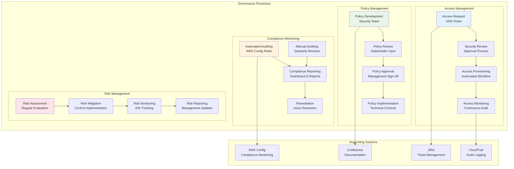
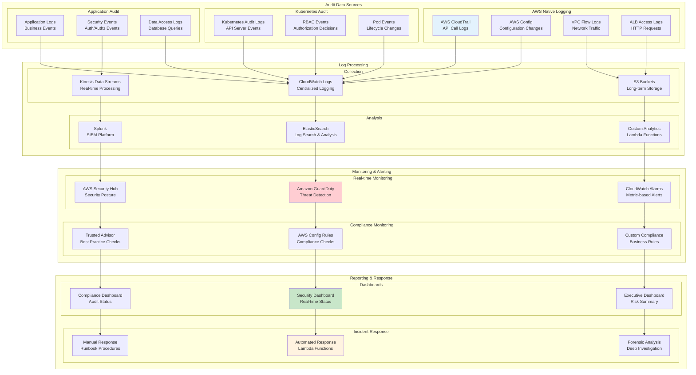

# IAM 權限關係與系統整合 - Context Viewpoint

**文件版本**: 1.0  
**最後更新**: 2025年9月24日 下午6:02 (台北時間)  
**作者**: Security & Architecture Team  
**狀態**: Active

## 📋 目錄

- [概覽](#概覽)
- [系統邊界定義](#系統邊界定義)
- [IAM 權限關係架構](#iam-權限關係架構)
- [Service Account 權限映射](#service-account-權限映射)
- [外部系統整合](#外部系統整合)
- [跨服務通訊](#跨服務通訊)
- [合規性和治理](#合規性和治理)
- [權限審計和監控](#權限審計和監控)

## 概覽

本文件描述 GenAI Demo 系統的邊界、外部依賴關係，以及 IAM 權限在整個生態系統中的角色和關係。系統採用零信任安全模型，所有組件間的通訊都需要明確的身份驗證和授權，遵循最小權限原則。

### Context 範圍

- **系統邊界**: Kubernetes 集群內的應用程式和 AWS 雲端服務
- **外部依賴**: AWS 託管服務、第三方 API、監控系統
- **利害關係人**: 開發團隊、運維團隊、安全團隊、合規團隊
- **治理框架**: AWS Well-Architected Framework、SOC 2、ISO 27001

## 系統邊界定義

### 系統邊界圖

```mermaid
graph TB
    subgraph "External Actors"
        Users[終端用戶<br/>Web/Mobile]
        Developers[開發團隊<br/>CI/CD Pipeline]
        Operators[運維團隊<br/>Management Console]
        Auditors[稽核人員<br/>Compliance Tools]
    end
    
    subgraph "System Boundary - GenAI Demo"
        subgraph "Application Layer"
            WebApp[Web Application<br/>React/Angular]
            API[REST API<br/>Spring Boot]
            Background[Background Jobs<br/>Async Processing]
        end
        
        subgraph "Platform Layer"
            K8s[Kubernetes Platform<br/>EKS Cluster]
            ServiceMesh[Service Mesh<br/>Istio/Linkerd]
            Monitoring[Monitoring Stack<br/>Prometheus/Grafana]
        end
        
        subgraph "Data Layer"
            Database[Primary Database<br/>Aurora PostgreSQL]
            Cache[Cache Layer<br/>ElastiCache Redis]
            MessageQueue[Message Queue<br/>MSK Kafka]
        end
    end
    
    subgraph "AWS Managed Services"
        subgraph "Identity & Access"
            IAM[AWS IAM<br/>Roles & Policies]
            STS[AWS STS<br/>Token Service]
            OIDC[EKS OIDC Provider<br/>Identity Federation]
        end
        
        subgraph "Security Services"
            KMS[AWS KMS<br/>Key Management]
            Secrets[AWS Secrets Manager<br/>Secret Storage]
            WAF[AWS WAF<br/>Web Application Firewall]
            Shield[AWS Shield<br/>DDoS Protection]
        end
        
        subgraph "Observability Services"
            CloudWatch[AWS CloudWatch<br/>Metrics & Logs]
            XRay[AWS X-Ray<br/>Distributed Tracing]
            Config[AWS Config<br/>Configuration Tracking]
            CloudTrail[AWS CloudTrail<br/>API Audit Logs]
        end
        
        subgraph "Network Services"
            Route53[AWS Route 53<br/>DNS Management]
            CloudFront[AWS CloudFront<br/>CDN]
            VPC[AWS VPC<br/>Network Isolation]
            ALB[Application Load Balancer<br/>Traffic Distribution]
        end
    end
    
    subgraph "External Dependencies"
        subgraph "Third-party Services"
            PaymentGW[Payment Gateway<br/>Stripe/PayPal]
            EmailService[Email Service<br/>SendGrid/SES]
            Analytics[Analytics Service<br/>Google Analytics]
        end
        
        subgraph "Development Tools"
            GitHub[GitHub<br/>Source Control]
            DockerHub[Docker Hub<br/>Container Registry]
            Slack[Slack<br/>Notifications]
        end
    end
    
    %% User Interactions
    Users --> WebApp
    Users --> API
    
    %% Developer Interactions
    Developers --> GitHub
    Developers --> K8s
    
    %% Operator Interactions
    Operators --> CloudWatch
    Operators --> K8s
    
    %% Auditor Interactions
    Auditors --> CloudTrail
    Auditors --> Config
    
    %% Internal System Flows
    WebApp --> API
    API --> Database
    API --> Cache
    API --> MessageQueue
    Background --> MessageQueue
    
    %% Platform Integration
    API --> K8s
    K8s --> Monitoring
    
    %% AWS Service Integration
    K8s --> IAM
    IAM --> STS
    STS --> OIDC
    
    API --> KMS
    API --> Secrets
    API --> CloudWatch
    API --> XRay
    
    WebApp --> CloudFront
    CloudFront --> WAF
    WAF --> ALB
    ALB --> API
    
    %% External Service Integration
    API --> PaymentGW
    API --> EmailService
    WebApp --> Analytics
    
    K8s --> DockerHub
    Monitoring --> Slack
    
    style Users fill:#e1f5fe
    style API fill:#c8e6c9
    style K8s fill:#e8f5e8
    style IAM fill:#fce4ec
    style CloudWatch fill:#fff3e0
```



### 信任邊界

```yaml
Trust Boundaries:

Level 1 - Public Internet:
  Actors: 終端用戶、匿名訪問者
  Trust Level: 零信任
  Security Controls:
    - AWS WAF 規則
    - DDoS 保護 (AWS Shield)
    - Rate limiting
    - IP 白名單/黑名單

Level 2 - CDN/Edge:
  Actors: CloudFront、邊緣位置
  Trust Level: AWS 託管服務信任
  Security Controls:
    - SSL/TLS 終止
    - 地理封鎖
    - 快取策略
    - Origin 驗證

Level 3 - Load Balancer:
  Actors: Application Load Balancer
  Trust Level: AWS VPC 內部信任
  Security Controls:
    - 安全群組規則
    - SSL 憑證驗證
    - 健康檢查
    - 存取日誌

Level 4 - Kubernetes Cluster:
  Actors: EKS 控制平面、Worker 節點
  Trust Level: 平台層信任
  Security Controls:
    - RBAC 權限控制
    - Network Policies
    - Pod Security Standards
    - Service Account 權限

Level 5 - Application Pods:
  Actors: 應用程式容器
  Trust Level: 應用程式層信任
  Security Controls:
    - IRSA (IAM Roles for Service Accounts)
    - 最小權限原則
    - 資源限制
    - 安全上下文

Level 6 - AWS Services:
  Actors: RDS、ElastiCache、MSK 等
  Trust Level: AWS 託管服務信任
  Security Controls:
    - VPC 端點
    - 加密傳輸和靜態
    - IAM 資源政策
    - 服務特定安全設定
```

## IAM 權限關係架構

### 完整 IAM 權限流程圖

```mermaid
graph TB
    subgraph "Identity Providers"
        subgraph "EKS OIDC Provider"
            OIDC[EKS OIDC Identity Provider<br/>https://oidc.eks.region.amazonaws.com/id/cluster-id]
            JWTToken[JWT Token<br/>Service Account Identity]
        end
        
        subgraph "AWS STS"
            STS[AWS Security Token Service<br/>AssumeRoleWithWebIdentity]
            TempCreds[Temporary Credentials<br/>Access Key + Secret + Token]
        end
    end
    
    subgraph "IAM Roles & Policies"
        subgraph "Service Roles"
            AppRole[Application Service Role<br/>genai-demo-{env}-app-role]
            AutoscalerRole[Cluster Autoscaler Role<br/>genai-demo-{env}-autoscaler-role]
            EKSClusterRole[EKS Cluster Service Role<br/>genai-demo-{env}-eks-cluster-role]
            EKSNodeRole[EKS Node Group Role<br/>genai-demo-{env}-eks-node-role]
        end
        
        subgraph "IAM Policies"
            subgraph "AWS Managed Policies"
                EKSClusterPolicy[AmazonEKSClusterPolicy]
                EKSNodePolicy[AmazonEKSWorkerNodePolicy]
                EKSCNIPolicy[AmazonEKS_CNI_Policy]
                ECRReadPolicy[AmazonEC2ContainerRegistryReadOnly]
            end
            
            subgraph "Custom Policies"
                AppCustomPolicy[Application Custom Policy<br/>CloudWatch + X-Ray + SSM + Secrets + KMS]
                AutoscalerCustomPolicy[Autoscaler Custom Policy<br/>EC2 + AutoScaling + EKS]
                CrossAccountPolicy[Cross-Account Access Policy<br/>Multi-Region Resources]
            end
        end
    end
    
    subgraph "Kubernetes RBAC"
        subgraph "Service Accounts"
            AppSA[genai-demo-app<br/>namespace: default]
            AutoscalerSA[cluster-autoscaler<br/>namespace: kube-system]
            MonitoringSA[monitoring-sa<br/>namespace: monitoring]
        end
        
        subgraph "RBAC Resources"
            AppRole_K8s[Application Role<br/>Pod Management]
            AutoscalerClusterRole[Cluster Autoscaler ClusterRole<br/>Node Management]
            MonitoringClusterRole[Monitoring ClusterRole<br/>Metrics Collection]
            
            AppRoleBinding[Application RoleBinding<br/>default namespace]
            AutoscalerClusterRoleBinding[Autoscaler ClusterRoleBinding<br/>cluster-wide]
            MonitoringClusterRoleBinding[Monitoring ClusterRoleBinding<br/>cluster-wide]
        end
    end
    
    subgraph "AWS Resources"
        subgraph "Compute & Storage"
            EC2[EC2 Instances<br/>EKS Worker Nodes]
            EBS[EBS Volumes<br/>Persistent Storage]
            ECR[ECR Repositories<br/>Container Images]
        end
        
        subgraph "Data Services"
            RDS[RDS Aurora<br/>PostgreSQL Database]
            ElastiCache[ElastiCache<br/>Redis Cluster]
            MSK[MSK<br/>Kafka Cluster]
        end
        
        subgraph "Security & Monitoring"
            KMS[KMS Keys<br/>Encryption]
            SecretsManager[Secrets Manager<br/>Sensitive Data]
            CloudWatch[CloudWatch<br/>Metrics & Logs]
            XRay[X-Ray<br/>Distributed Tracing]
            SSM[Systems Manager<br/>Parameter Store]
        end
    end
    
    subgraph "Application Workloads"
        AppPod1[genai-demo-app-1<br/>Pod Instance]
        AppPod2[genai-demo-app-2<br/>Pod Instance]
        AutoscalerPod[cluster-autoscaler<br/>Pod Instance]
        MonitoringPod[prometheus<br/>Pod Instance]
    end
    
    %% OIDC Flow
    AppSA --> OIDC
    AutoscalerSA --> OIDC
    OIDC --> JWTToken
    JWTToken --> STS
    STS --> TempCreds
    
    %% IAM Role Associations
    TempCreds --> AppRole
    TempCreds --> AutoscalerRole
    
    %% Policy Attachments
    AppRole --> AppCustomPolicy
    AutoscalerRole --> AutoscalerCustomPolicy
    EKSClusterRole --> EKSClusterPolicy
    EKSNodeRole --> EKSNodePolicy
    EKSNodeRole --> EKSCNIPolicy
    EKSNodeRole --> ECRReadPolicy
    
    %% Kubernetes RBAC
    AppSA --> AppRole_K8s
    AutoscalerSA --> AutoscalerClusterRole
    MonitoringSA --> MonitoringClusterRole
    
    AppRole_K8s --> AppRoleBinding
    AutoscalerClusterRole --> AutoscalerClusterRoleBinding
    MonitoringClusterRole --> MonitoringClusterRoleBinding
    
    %% Pod Assignments
    AppPod1 --> AppSA
    AppPod2 --> AppSA
    AutoscalerPod --> AutoscalerSA
    MonitoringPod --> MonitoringSA
    
    %% AWS Resource Access
    AppRole --> CloudWatch
    AppRole --> XRay
    AppRole --> SSM
    AppRole --> SecretsManager
    AppRole --> KMS
    
    AutoscalerRole --> EC2
    AutoscalerRole --> EBS
    
    EKSNodeRole --> ECR
    EKSNodeRole --> EC2
    
    %% Data Access (through application)
    AppPod1 -.-> RDS
    AppPod2 -.-> ElastiCache
    AppPod1 -.-> MSK
    
    style OIDC fill:#fce4ec
    style AppRole fill:#e8f5e8
    style AppSA fill:#c8e6c9
    style TempCreds fill:#fff3e0
    style AppCustomPolicy fill:#e3f2fd
```

### IAM 信任關係詳解

```mermaid
sequenceDiagram
    participant Pod as Application Pod
    participant SA as Service Account<br/>(genai-demo-app)
    participant K8s as Kubernetes API<br/>Server
    participant OIDC as EKS OIDC<br/>Provider
    participant STS as AWS STS
    participant IAM as IAM Role<br/>(genai-demo-app-role)
    participant AWS as AWS Service<br/>(CloudWatch)
    
    Note over Pod,AWS: Complete IRSA Authentication Flow
    
    Pod->>SA: 1. Pod 啟動時自動掛載<br/>Service Account Token
    Note over Pod,SA: Token 位置:<br/>/var/run/secrets/eks.amazonaws.com/serviceaccount/token
    
    SA->>K8s: 2. 向 Kubernetes API 請求<br/>Service Account 資訊
    K8s->>SA: 3. 返回 Service Account 詳細資訊<br/>包含 IAM Role ARN annotation
    
    SA->>OIDC: 4. 使用 Service Account Token<br/>向 OIDC Provider 請求 JWT
    Note over SA,OIDC: JWT Claims 包含:<br/>- iss: EKS OIDC Provider URL<br/>- sub: system:serviceaccount:default:genai-demo-app<br/>- aud: sts.amazonaws.com<br/>- exp: Token 過期時間
    
    OIDC->>OIDC: 5. 驗證 Service Account Token<br/>並簽發 JWT Token
    OIDC->>SA: 6. 返回 Signed JWT Token
    
    SA->>STS: 7. AssumeRoleWithWebIdentity<br/>請求臨時憑證
    Note over SA,STS: 請求參數:<br/>- RoleArn: IAM Role ARN<br/>- WebIdentityToken: JWT Token<br/>- RoleSessionName: Pod 識別名稱
    
    STS->>STS: 8. 驗證 JWT Token
    Note over STS: 驗證項目:<br/>- Token 簽名 (使用 OIDC Provider 公鑰)<br/>- Issuer 匹配<br/>- Audience 匹配<br/>- Token 未過期<br/>- Subject 匹配信任政策
    
    STS->>IAM: 9. 檢查 IAM Role 信任政策
    Note over STS,IAM: 信任政策條件:<br/>StringEquals:<br/>  "oidc-provider:sub": "system:serviceaccount:default:genai-demo-app"<br/>  "oidc-provider:aud": "sts.amazonaws.com"
    
    IAM->>STS: 10. 確認信任關係有效
    STS->>SA: 11. 返回臨時 AWS 憑證
    Note over STS,SA: 臨時憑證包含:<br/>- AccessKeyId<br/>- SecretAccessKey<br/>- SessionToken<br/>- Expiration (通常 1 小時)
    
    SA->>AWS: 12. 使用臨時憑證<br/>調用 AWS 服務 API
    AWS->>AWS: 13. 驗證憑證和權限
    Note over AWS: 檢查項目:<br/>- 憑證有效性<br/>- Session Token 匹配<br/>- IAM 政策權限<br/>- 資源政策權限
    
    AWS->>SA: 14. 返回 API 回應
    SA->>Pod: 15. 返回結果給應用程式
    
    Note over Pod,AWS: 憑證會在過期前自動更新<br/>整個流程對應用程式透明
```



## Service Account 權限映射

### 應用程式 Service Account 權限詳解

```yaml
Application Service Account: genai-demo-app
Namespace: default
IAM Role: genai-demo-{environment}-app-role

Trust Policy:
  Version: '2012-10-17'
  Statement:
    - Effect: Allow
      Principal:
        Federated: arn:aws:iam::{account-id}:oidc-provider/oidc.eks.{region}.amazonaws.com/id/{cluster-id}
      Action: sts:AssumeRoleWithWebIdentity
      Condition:
        StringEquals:
          "oidc.eks.{region}.amazonaws.com/id/{cluster-id}:sub": "system:serviceaccount:default:genai-demo-app"
          "oidc.eks.{region}.amazonaws.com/id/{cluster-id}:aud": "sts.amazonaws.com"

Permission Policies:

CloudWatch Metrics Policy:
  Version: '2012-10-17'
  Statement:
    - Sid: CloudWatchMetricsAccess
      Effect: Allow
      Action:
        - cloudwatch:PutMetricData
        - cloudwatch:GetMetricStatistics
        - cloudwatch:ListMetrics
      Resource: "*"
      Condition:
        StringEquals:
          "aws:RequestedRegion": 
            - "ap-east-2"
            - "ap-northeast-1"

CloudWatch Logs Policy:
  Version: '2012-10-17'
  Statement:
    - Sid: CloudWatchLogsAccess
      Effect: Allow
      Action:
        - logs:CreateLogGroup
        - logs:CreateLogStream
        - logs:PutLogEvents
        - logs:DescribeLogStreams
        - logs:DescribeLogGroups
      Resource: 
        - "arn:aws:logs:{region}:{account}:log-group:/aws/genai-demo/*"
        - "arn:aws:logs:{region}:{account}:log-group:/aws/genai-demo/*:log-stream:*"

X-Ray Tracing Policy:
  Version: '2012-10-17'
  Statement:
    - Sid: XRayTracingAccess
      Effect: Allow
      Action:
        - xray:PutTraceSegments
        - xray:PutTelemetryRecords
        - xray:GetSamplingRules
        - xray:GetSamplingTargets
        - xray:GetSamplingStatisticSummaries
      Resource: "*"
      Condition:
        StringEquals:
          "aws:RequestedRegion": 
            - "ap-east-2"
            - "ap-northeast-1"

Parameter Store Policy:
  Version: '2012-10-17'
  Statement:
    - Sid: ParameterStoreAccess
      Effect: Allow
      Action:
        - ssm:GetParameter
        - ssm:GetParameters
        - ssm:GetParametersByPath
        - ssm:DescribeParameters
      Resource:
        - "arn:aws:ssm:{region}:{account}:parameter/genai-demo/{environment}/*"
        - "arn:aws:ssm:{region}:{account}:parameter/genai-demo/common/*"

Secrets Manager Policy:
  Version: '2012-10-17'
  Statement:
    - Sid: SecretsManagerAccess
      Effect: Allow
      Action:
        - secretsmanager:GetSecretValue
        - secretsmanager:DescribeSecret
      Resource:
        - "arn:aws:secretsmanager:{region}:{account}:secret:genai-demo/{environment}/*"
        - "arn:aws:secretsmanager:{region}:{account}:secret:genai-demo/database/*"

KMS Decryption Policy:
  Version: '2012-10-17'
  Statement:
    - Sid: KMSDecryptionAccess
      Effect: Allow
      Action:
        - kms:Decrypt
        - kms:GenerateDataKey
        - kms:DescribeKey
      Resource: 
        - "arn:aws:kms:{region}:{account}:key/*"
      Condition:
        StringEquals:
          "kms:ViaService":
            - "secretsmanager.{region}.amazonaws.com"
            - "ssm.{region}.amazonaws.com"
            - "logs.{region}.amazonaws.com"
            - "s3.{region}.amazonaws.com"

S3 Access Policy (Optional):
  Version: '2012-10-17'
  Statement:
    - Sid: S3BucketAccess
      Effect: Allow
      Action:
        - s3:GetObject
        - s3:PutObject
        - s3:DeleteObject
        - s3:ListBucket
        - s3:GetBucketLocation
      Resource:
        - "arn:aws:s3:::genai-demo-{environment}-*"
        - "arn:aws:s3:::genai-demo-{environment}-*/*"
```

### Cluster Autoscaler Service Account 權限

```yaml
Cluster Autoscaler Service Account: cluster-autoscaler
Namespace: kube-system
IAM Role: genai-demo-{environment}-autoscaler-role

Trust Policy:
  Version: '2012-10-17'
  Statement:
    - Effect: Allow
      Principal:
        Federated: arn:aws:iam::{account-id}:oidc-provider/oidc.eks.{region}.amazonaws.com/id/{cluster-id}
      Action: sts:AssumeRoleWithWebIdentity
      Condition:
        StringEquals:
          "oidc.eks.{region}.amazonaws.com/id/{cluster-id}:sub": "system:serviceaccount:kube-system:cluster-autoscaler"
          "oidc.eks.{region}.amazonaws.com/id/{cluster-id}:aud": "sts.amazonaws.com"

Permission Policies:

Auto Scaling Policy:
  Version: '2012-10-17'
  Statement:
    - Sid: AutoScalingAccess
      Effect: Allow
      Action:
        - autoscaling:DescribeAutoScalingGroups
        - autoscaling:DescribeAutoScalingInstances
        - autoscaling:DescribeLaunchConfigurations
        - autoscaling:DescribeTags
        - autoscaling:SetDesiredCapacity
        - autoscaling:TerminateInstanceInAutoScalingGroup
      Resource: "*"
      Condition:
        StringEquals:
          "autoscaling:ResourceTag/k8s.io/cluster-autoscaler/enabled": "true"
          "autoscaling:ResourceTag/k8s.io/cluster-autoscaler/{cluster-name}": "owned"

EC2 Policy:
  Version: '2012-10-17'
  Statement:
    - Sid: EC2Access
      Effect: Allow
      Action:
        - ec2:DescribeLaunchTemplateVersions
        - ec2:DescribeInstanceTypes
        - ec2:DescribeInstances
        - ec2:DescribeImages
        - ec2:DescribeSecurityGroups
        - ec2:DescribeSubnets
        - ec2:DescribeVpcs
      Resource: "*"

EKS Policy:
  Version: '2012-10-17'
  Statement:
    - Sid: EKSAccess
      Effect: Allow
      Action:
        - eks:DescribeCluster
        - eks:DescribeNodegroup
        - eks:ListNodegroups
      Resource: 
        - "arn:aws:eks:{region}:{account}:cluster/{cluster-name}"
        - "arn:aws:eks:{region}:{account}:nodegroup/{cluster-name}/*/*"
```

### 權限矩陣總覽

```yaml
Service Account Permission Matrix:

genai-demo-app (Application):
  AWS Services:
    CloudWatch Metrics: ✅ PutMetricData, GetMetricStatistics
    CloudWatch Logs: ✅ CreateLogGroup, PutLogEvents
    X-Ray: ✅ PutTraceSegments, GetSamplingRules
    Parameter Store: ✅ GetParameter (限定路徑)
    Secrets Manager: ✅ GetSecretValue (限定資源)
    KMS: ✅ Decrypt (條件限制)
    S3: ✅ GetObject, PutObject (限定 bucket)
    RDS: ❌ (透過應用程式連線)
    ElastiCache: ❌ (透過應用程式連線)
    MSK: ❌ (透過應用程式連線)
  
  Kubernetes Resources:
    Pods: ✅ Get, List (自己的 namespace)
    Services: ✅ Get, List (自己的 namespace)
    ConfigMaps: ✅ Get, List (自己的 namespace)
    Secrets: ✅ Get, List (自己的 namespace)
    Nodes: ❌
    Namespaces: ❌

cluster-autoscaler (Infrastructure):
  AWS Services:
    Auto Scaling: ✅ DescribeAutoScalingGroups, SetDesiredCapacity
    EC2: ✅ DescribeInstances, DescribeLaunchTemplates
    EKS: ✅ DescribeCluster, DescribeNodegroup
    CloudWatch: ❌
    S3: ❌
  
  Kubernetes Resources:
    Nodes: ✅ Get, List, Watch, Update
    Pods: ✅ Get, List, Watch (cluster-wide)
    Events: ✅ Create, Update
    ConfigMaps: ✅ Get, Create, Update (kube-system namespace)
    Secrets: ❌
    Deployments: ❌

monitoring (Observability):
  AWS Services:
    CloudWatch: ✅ PutMetricData (限定 namespace)
    X-Ray: ❌
    S3: ❌
  
  Kubernetes Resources:
    Pods: ✅ Get, List, Watch (cluster-wide)
    Nodes: ✅ Get, List, Watch
    Services: ✅ Get, List, Watch (cluster-wide)
    Endpoints: ✅ Get, List, Watch (cluster-wide)
    ConfigMaps: ✅ Get, List (monitoring namespace)
    Secrets: ✅ Get, List (monitoring namespace)
```

## 外部系統整合

### 外部依賴關係圖


### 外部服務整合配置

```yaml
Third-party Service Integrations:

Payment Gateway (Stripe):
  Authentication: API Key (stored in AWS Secrets Manager)
  Endpoint: https://api.stripe.com/v1/
  Security:
    - TLS 1.2+ required
    - Webhook signature verification
    - IP whitelist for webhooks
  Configuration:
    Secret Path: /genai-demo/{environment}/stripe/api-key
    Webhook URL: https://api.genai-demo.kimkao.io/webhooks/stripe
    Supported Events: payment_intent.succeeded, payment_intent.payment_failed
  
Email Service (SendGrid):
  Authentication: API Key (stored in AWS Secrets Manager)
  Endpoint: https://api.sendgrid.com/v3/
  Security:
    - API key rotation (monthly)
    - Rate limiting (100 emails/minute)
    - Domain authentication (DKIM/SPF)
  Configuration:
    Secret Path: /genai-demo/{environment}/sendgrid/api-key
    From Email: noreply@genai-demo.kimkao.io
    Templates: Welcome, Password Reset, Order Confirmation

Analytics (Google Analytics):
  Authentication: Service Account Key (stored in AWS Secrets Manager)
  Endpoint: https://analyticsreporting.googleapis.com/v4/
  Security:
    - Service account with minimal permissions
    - IP restrictions
    - Data retention policies
  Configuration:
    Secret Path: /genai-demo/{environment}/google-analytics/service-account
    Property ID: GA4 Property ID
    Measurement ID: G-XXXXXXXXXX

Monitoring (Datadog):
  Authentication: API Key + Application Key
  Endpoint: https://api.datadoghq.com/api/v1/
  Security:
    - Key rotation (quarterly)
    - Scope-limited permissions
    - Network access restrictions
  Configuration:
    Secret Path: /genai-demo/{environment}/datadog/keys
    Dashboard: Custom dashboard for GenAI Demo
    Alerts: Integration with PagerDuty

External APIs:
  Weather Service:
    Provider: OpenWeatherMap
    Authentication: API Key
    Rate Limit: 1000 calls/day
    Fallback: Cached data (24 hours)
    
  Currency Exchange:
    Provider: ExchangeRate-API
    Authentication: API Key
    Rate Limit: 1500 calls/month
    Fallback: Static rates
    
  Geolocation:
    Provider: IP2Location
    Authentication: API Key
    Rate Limit: 500 calls/day
    Fallback: Default location (Taiwan)
```

## 跨服務通訊

### 服務間通訊模式


### 通訊安全配置

```yaml
Service-to-Service Communication Security:

Internal Kubernetes Communication:
  Network Policies:
    Default Deny: All ingress traffic denied by default
    Application Pods:
      Ingress:
        - From: ALB (port 8080)
        - From: Monitoring namespace (port 8080, 8081)
      Egress:
        - To: Database subnets (port 5432, 6379)
        - To: Internet (port 443) # AWS APIs
        - To: MSK subnets (port 9092, 9094)
    
  Service Mesh (Optional):
    mTLS: Automatic between all services
    Certificate Rotation: Every 24 hours
    Policy Enforcement: Deny by default
    Observability: Full traffic telemetry

External Service Communication:
  HTTPS Requirements:
    TLS Version: 1.2 minimum, 1.3 preferred
    Certificate Validation: Strict
    Cipher Suites: Modern cipher suites only
    HSTS: Enabled with 1 year max-age
    
  API Authentication:
    Method: Bearer Token (JWT) or API Key
    Token Storage: AWS Secrets Manager
    Token Rotation: Automated (monthly)
    Fallback: Circuit breaker pattern
    
  Rate Limiting:
    Application Level: 100 requests/minute per client
    Infrastructure Level: AWS WAF rules
    Third-party APIs: Respect provider limits
    Retry Strategy: Exponential backoff

AWS Service Communication:
  IAM Authentication:
    Method: IRSA (IAM Roles for Service Accounts)
    Token Refresh: Automatic (every hour)
    Permissions: Least privilege principle
    Audit: CloudTrail logging
    
  VPC Endpoints:
    S3: Gateway endpoint
    DynamoDB: Gateway endpoint
    Other Services: Interface endpoints
    DNS Resolution: Private DNS enabled
    
  Encryption:
    In Transit: TLS 1.2+ for all AWS API calls
    At Rest: KMS encryption for all data
    Key Management: Automatic key rotation
    Access Logging: All API calls logged
```

## 合規性和治理

### 合規框架對應

```yaml
Compliance Framework Mapping:

SOC 2 Type II:
  CC6.1 - Logical and Physical Access Controls:
    Implementation:
      - IAM roles with least privilege
      - MFA for administrative access
      - VPC network isolation
      - Security groups and NACLs
    Evidence:
      - IAM policy documents
      - Access review reports
      - Network configuration audit
      - CloudTrail access logs

  CC6.2 - System Access Monitoring:
    Implementation:
      - CloudTrail API logging
      - VPC Flow Logs
      - Application access logs
      - Failed authentication monitoring
    Evidence:
      - Log retention policies
      - Monitoring dashboards
      - Alert configurations
      - Incident response logs

  CC6.3 - Access Revocation:
    Implementation:
      - Automated user lifecycle management
      - Regular access reviews
      - Immediate revocation procedures
      - Service account rotation
    Evidence:
      - Access review reports
      - Revocation procedures
      - Audit trail of changes
      - Compliance reports

ISO 27001:
  A.9.1 - Access Control Policy:
    Implementation:
      - Documented IAM policies
      - Role-based access control
      - Regular policy reviews
      - Exception handling procedures
    Evidence:
      - Policy documents
      - Review meeting minutes
      - Exception approvals
      - Training records

  A.9.2 - User Access Management:
    Implementation:
      - User provisioning workflows
      - Access request procedures
      - Regular access certifications
      - Privileged access management
    Evidence:
      - Provisioning records
      - Access request tickets
      - Certification reports
      - PAM audit logs

GDPR:
  Article 25 - Data Protection by Design:
    Implementation:
      - Encryption at rest and in transit
      - Data minimization principles
      - Privacy impact assessments
      - Consent management
    Evidence:
      - Encryption configurations
      - Data flow diagrams
      - PIA documents
      - Consent records

  Article 32 - Security of Processing:
    Implementation:
      - Technical security measures
      - Organizational security measures
      - Regular security testing
      - Incident response procedures
    Evidence:
      - Security architecture documents
      - Penetration test reports
      - Incident response plans
      - Security training records
```

### 治理流程



## 權限審計和監控

### 審計架構



### 關鍵審計指標

```yaml
Key Audit Metrics:

Access Control Metrics:
  Failed Authentication Attempts:
    Threshold: > 10 failures per user per hour
    Action: Account lockout + Security alert
    Data Source: CloudTrail, Application logs
    
  Privileged Access Usage:
    Threshold: Any admin role usage outside business hours
    Action: Immediate notification to security team
    Data Source: CloudTrail AssumeRole events
    
  Permission Escalation:
    Threshold: Any role assumption with higher privileges
    Action: Automatic review + Approval required
    Data Source: IAM policy changes, Role assumptions
    
  Cross-Account Access:
    Threshold: Any cross-account role assumption
    Action: Immediate security review
    Data Source: CloudTrail cross-account events

Data Access Metrics:
  Sensitive Data Access:
    Threshold: Access to PII/financial data outside normal patterns
    Action: Data access review + User notification
    Data Source: Database audit logs, Application logs
    
  Bulk Data Export:
    Threshold: > 1000 records exported in single session
    Action: Manager approval required
    Data Source: Application audit logs
    
  After-Hours Data Access:
    Threshold: Any sensitive data access outside 09:00-18:00 UTC+8
    Action: Security notification + Access review
    Data Source: Database logs, Application logs

System Configuration Metrics:
  Security Group Changes:
    Threshold: Any inbound rule allowing 0.0.0.0/0
    Action: Immediate review + Revert if unauthorized
    Data Source: AWS Config, CloudTrail
    
  IAM Policy Changes:
    Threshold: Any policy modification
    Action: Automated review + Approval workflow
    Data Source: CloudTrail IAM events
    
  Network Configuration Changes:
    Threshold: Any VPC, subnet, or routing changes
    Action: Network team review + Change approval
    Data Source: AWS Config, CloudTrail

Compliance Metrics:
  Encryption Compliance:
    Threshold: Any unencrypted data store
    Action: Immediate encryption + Compliance report
    Data Source: AWS Config rules
    
  Backup Compliance:
    Threshold: Any missed backup window
    Action: Immediate backup + Root cause analysis
    Data Source: AWS Backup, RDS events
    
  Patch Compliance:
    Threshold: Any system > 30 days without patches
    Action: Emergency patching + Security review
    Data Source: Systems Manager, Container scanning
```

### 審計報告範本

```yaml
Monthly Security Audit Report Template:

Executive Summary:
  - Overall security posture score
  - Critical findings count
  - Remediation status
  - Compliance status summary
  - Risk trend analysis

Access Control Review:
  - New user accounts created
  - Privileged access usage statistics
  - Failed authentication analysis
  - Permission changes summary
  - Cross-account access review

Data Protection Review:
  - Data classification compliance
  - Encryption status report
  - Data access pattern analysis
  - Backup and recovery testing
  - Data retention compliance

Infrastructure Security:
  - Security group configuration review
  - Network access control analysis
  - Vulnerability assessment results
  - Patch management status
  - Configuration drift analysis

Compliance Status:
  - SOC 2 control effectiveness
  - ISO 27001 compliance status
  - GDPR compliance review
  - Regulatory requirement updates
  - Third-party audit findings

Incident Response:
  - Security incidents summary
  - Response time analysis
  - Lessons learned
  - Process improvements
  - Training recommendations

Risk Assessment:
  - New risks identified
  - Risk mitigation progress
  - Risk appetite alignment
  - Third-party risk assessment
  - Business impact analysis

Action Items:
  - Critical remediation tasks
  - Process improvement initiatives
  - Policy update requirements
  - Training needs assessment
  - Technology upgrade recommendations
```

---

**文件狀態**: ✅ 完成  
**相關文件**: 
- [Deployment Viewpoint - AWS 基礎設施架構](../deployment/aws-infrastructure-architecture.md)
- [Operational Viewpoint - DNS 解析與災難恢復](../operational/dns-resolution-disaster-recovery.md)
- [Security Perspective](../../perspectives/security/aws-security-implementation.md)
- [Development Standards - Security Standards](../../../.kiro/steering/security-standards.md)