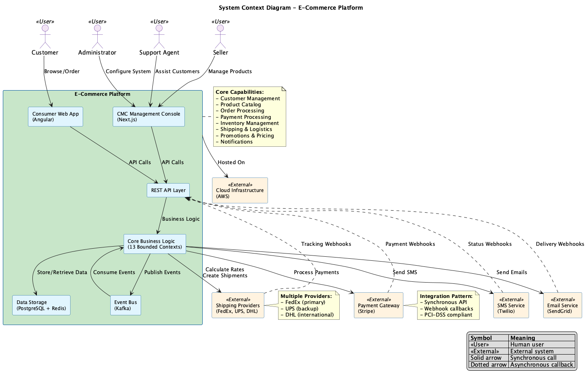
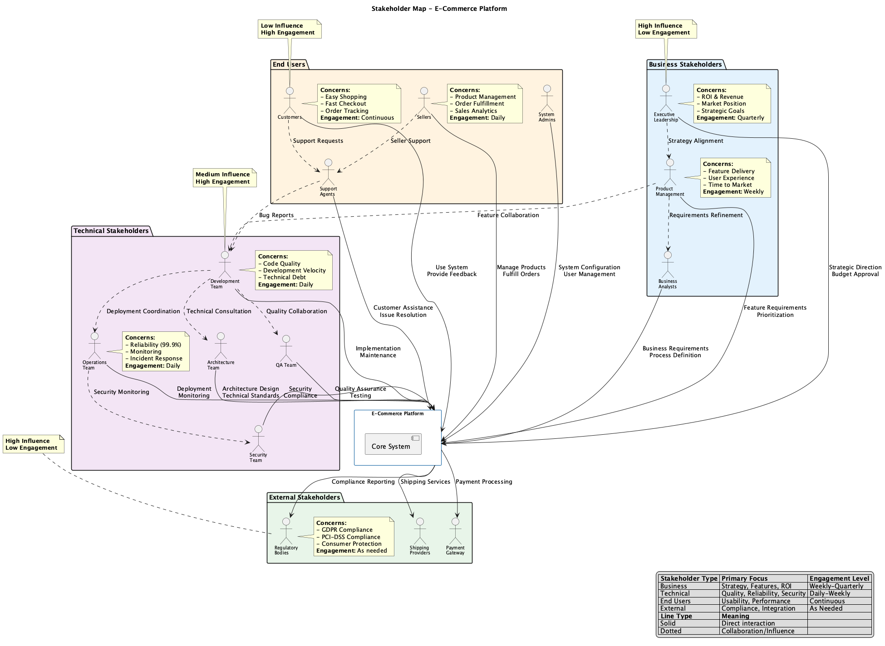
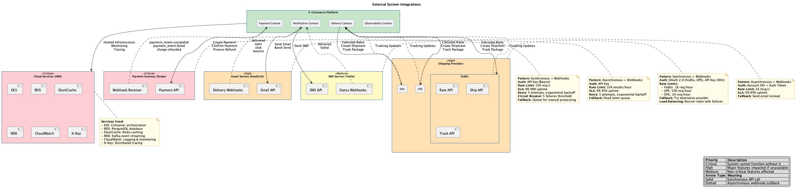

# Context Viewpoint Overview

> **Last Updated**: 2025-10-23  
> **Status**: Active  
> **Stakeholders**: Business Analysts, Architects, Product Managers

## Purpose

The Context Viewpoint describes the Enterprise E-Commerce Platform's relationships with its environment. It defines the system boundaries, identifies external systems and actors that interact with the platform, and clarifies what is within and outside the system's scope.

This viewpoint helps stakeholders understand:

- **System Boundaries**: What is part of the system and what is external
- **External Interactions**: How the system communicates with external entities
- **Stakeholder Concerns**: Who has interest in the system and their concerns
- **Environmental Constraints**: External factors that influence the system

## Key Concerns

This viewpoint addresses the following concerns:

1. **Scope Definition**: Clear boundaries between the system and its environment
2. **External Dependencies**: Third-party systems and services the platform relies on
3. **Integration Points**: How the system connects with external entities
4. **Stakeholder Identification**: Who interacts with or has interest in the system
5. **Regulatory Constraints**: External compliance and regulatory requirements
6. **Geographic Constraints**: Regional and location-based limitations

## System Context

### High-Level Context

The Enterprise E-Commerce Platform is a comprehensive online retail system that enables customers to browse products, place orders, and manage their accounts. The system integrates with multiple external services to provide complete e-commerce functionality.

#### System Context Diagram

The diagram above shows the E-Commerce Platform at the center, with all external actors (users and systems) and their interactions. Key elements include:

- **Users**: Customers, Sellers, Administrators, Support Agents
- **External Systems**: Payment Gateway, Email Service, SMS Service, Shipping Providers
- **Cloud Infrastructure**: AWS hosting and managed services
- **Integration Patterns**: Synchronous API calls (solid arrows) and asynchronous webhooks (dotted arrows)

### System Boundaries

#### What is Inside the System

The Enterprise E-Commerce Platform includes:

1. **Customer Management**
   - Customer registration and authentication
   - Profile management
   - Customer preferences and settings
   - Membership levels and loyalty programs

2. **Product Catalog**
   - Product information management
   - Category and taxonomy management
   - Product search and filtering
   - Product reviews and ratings

3. **Order Management**
   - Shopping cart functionality
   - Order creation and submission
   - Order tracking and history
   - Order cancellation and returns

4. **Payment Processing**
   - Payment method management
   - Payment transaction coordination
   - Payment status tracking
   - Refund processing

5. **Inventory Management**
   - Stock level tracking
   - Inventory reservation
   - Stock replenishment notifications
   - Multi-warehouse support

6. **Promotion Engine**
   - Discount rules management
   - Coupon code handling
   - Promotional campaigns
   - Dynamic pricing

7. **Pricing Engine**
   - Price calculation
   - Tax calculation
   - Shipping cost calculation
   - Currency conversion

8. **Notification System**
   - Email notification coordination
   - SMS notification coordination
   - In-app notification management
   - Notification preferences

#### What is Outside the System

The following are external to the platform:

1. **Payment Gateway** (Stripe)
   - Credit card processing
   - Payment authorization
   - Fraud detection
   - PCI compliance

2. **Shipping Providers** (FedEx, UPS, DHL)
   - Package pickup
   - Delivery tracking
   - Shipping label generation
   - Delivery confirmation

3. **Email Service** (SendGrid)
   - Email delivery
   - Email template rendering
   - Bounce handling
   - Email analytics

4. **SMS Service** (Twilio)
   - SMS message delivery
   - Phone number validation
   - Delivery receipts

5. **Analytics Platform** (Google Analytics)
   - User behavior tracking
   - Conversion tracking
   - Traffic analysis
   - Marketing attribution

6. **Warehouse Management System**
   - Physical inventory management
   - Warehouse operations
   - Picking and packing
   - Shipping preparation

7. **Accounting System**
   - Financial reporting
   - Revenue recognition
   - Tax filing
   - Accounts payable/receivable

8. **Customer Support System** (Zendesk)
   - Ticket management
   - Customer service interactions
   - Knowledge base
   - Live chat

## External Actors

### Primary Actors

#### 1. Customers (End Users)

**Description**: Individuals who browse products, place orders, and manage their accounts.

**Interactions**:
- Browse product catalog
- Search for products
- Add items to shopping cart
- Place and track orders
- Manage account and preferences
- Write product reviews

**Access Method**: Web browser, mobile app

**Authentication**: Username/password, OAuth (Google, Facebook)

#### 2. Sellers/Merchants

**Description**: Third-party sellers who list and sell products on the platform.

**Interactions**:
- Manage product listings
- View sales reports
- Process orders
- Manage inventory
- Handle customer inquiries

**Access Method**: Seller portal (web)

**Authentication**: Username/password, 2FA

#### 3. Administrators

**Description**: Internal staff who manage the platform and support operations.

**Interactions**:
- Manage users and permissions
- Configure system settings
- Monitor system health
- Handle customer support escalations
- Generate reports

**Access Method**: Admin console (web)

**Authentication**: Username/password, 2FA, SSO

### Secondary Actors

#### 4. Payment Gateway (Stripe)

**Description**: External service that processes payment transactions.

**Interactions**:
- Process credit card payments
- Handle payment authorization
- Manage payment methods
- Process refunds
- Provide fraud detection

**Integration Method**: REST API, Webhooks

**Authentication**: API keys, OAuth

#### 5. Shipping Providers (FedEx, UPS, DHL)

**Description**: Third-party logistics companies that handle package delivery.

**Interactions**:
- Generate shipping labels
- Calculate shipping costs
- Track package delivery
- Provide delivery confirmation
- Handle returns

**Integration Method**: REST API, SOAP API

**Authentication**: API keys, OAuth

#### 6. Email Service (SendGrid)

**Description**: Email delivery service for transactional and marketing emails.

**Interactions**:
- Send transactional emails (order confirmations, password resets)
- Send marketing emails (promotions, newsletters)
- Track email delivery and opens
- Handle bounces and unsubscribes

**Integration Method**: REST API, SMTP

**Authentication**: API keys

#### 7. SMS Service (Twilio)

**Description**: SMS delivery service for notifications and alerts.

**Interactions**:
- Send order status updates
- Send delivery notifications
- Send verification codes
- Provide customer support

**Integration Method**: REST API

**Authentication**: API keys

#### 8. Analytics Platform (Google Analytics)

**Description**: Web analytics service for tracking user behavior and conversions.

**Interactions**:
- Track page views and user sessions
- Track e-commerce transactions
- Track conversion funnels
- Provide marketing attribution

**Integration Method**: JavaScript SDK, Measurement Protocol API

**Authentication**: Tracking ID

## Stakeholder Groups

### Stakeholder Map

The stakeholder map above visualizes all stakeholder groups and their relationships with the E-Commerce Platform. It shows:

- **Stakeholder Categories**: Business, Technical, End Users, External
- **Engagement Levels**: Daily, Weekly, Quarterly, As Needed
- **Influence Levels**: High, Medium, Low
- **Relationships**: Direct interactions (solid lines) and collaborations (dotted lines)

### Business Stakeholders

#### Product Owners
**Concerns**:
- Feature prioritization
- User experience
- Business value delivery
- Market competitiveness

**Information Needs**:
- Product roadmap
- Feature specifications
- User feedback
- Business metrics

#### Marketing Team
**Concerns**:
- Customer acquisition
- Conversion optimization
- Campaign effectiveness
- Brand consistency

**Information Needs**:
- Analytics data
- Campaign performance
- Customer segmentation
- A/B test results

#### Finance Team
**Concerns**:
- Revenue tracking
- Cost management
- Financial reporting
- Compliance

**Information Needs**:
- Transaction data
- Revenue reports
- Cost analysis
- Audit trails

#### Customer Support Team
**Concerns**:
- Customer satisfaction
- Issue resolution
- Support efficiency
- Knowledge management

**Information Needs**:
- Customer data
- Order history
- Issue tracking
- Support metrics

### Technical Stakeholders

#### Development Team
**Concerns**:
- Code quality
- Technical debt
- Development velocity
- System maintainability

**Information Needs**:
- Architecture documentation
- API specifications
- Development guidelines
- Technical roadmap

#### Operations Team (SRE/DevOps)
**Concerns**:
- System reliability
- Performance
- Scalability
- Incident management

**Information Needs**:
- Infrastructure documentation
- Monitoring dashboards
- Runbooks
- Deployment procedures

#### Security Team
**Concerns**:
- Data protection
- Vulnerability management
- Compliance
- Incident response

**Information Needs**:
- Security architecture
- Threat models
- Compliance reports
- Security policies

#### Quality Assurance Team
**Concerns**:
- Software quality
- Test coverage
- Bug tracking
- Release readiness

**Information Needs**:
- Test plans
- Test results
- Bug reports
- Quality metrics

### External Stakeholders

#### Customers
**Concerns**:
- Product availability
- Order fulfillment
- Payment security
- Customer service

**Information Needs**:
- Product information
- Order status
- Delivery tracking
- Support contact

#### Partners/Sellers
**Concerns**:
- Sales performance
- Commission structure
- Platform reliability
- Support quality

**Information Needs**:
- Sales reports
- Commission statements
- Platform status
- Integration documentation

#### Regulators
**Concerns**:
- Data privacy (GDPR, CCPA)
- Consumer protection
- Tax compliance
- Accessibility

**Information Needs**:
- Compliance reports
- Privacy policies
- Audit trails
- Accessibility statements

## Environmental Constraints

### Regulatory Constraints

#### Data Privacy Regulations

**GDPR (General Data Protection Regulation)**
- Applies to: EU customers
- Requirements:
  - Right to access personal data
  - Right to erasure ("right to be forgotten")
  - Data portability
  - Consent management
  - Data breach notification

**CCPA (California Consumer Privacy Act)**
- Applies to: California residents
- Requirements:
  - Right to know what data is collected
  - Right to delete personal data
  - Right to opt-out of data sale
  - Non-discrimination

#### Payment Card Industry (PCI DSS)
- Applies to: All payment processing
- Requirements:
  - Secure network infrastructure
  - Protect cardholder data
  - Vulnerability management
  - Access control
  - Regular monitoring and testing

#### Accessibility Standards

**WCAG 2.1 (Web Content Accessibility Guidelines)**
- Level: AA compliance required
- Requirements:
  - Perceivable content
  - Operable interface
  - Understandable information
  - Robust implementation

### Geographic Constraints

#### Regional Availability
- **Primary Markets**: North America, Europe, Asia-Pacific
- **Language Support**: English, Spanish, French, German, Chinese, Japanese
- **Currency Support**: USD, EUR, GBP, JPY, CNY

#### Data Residency Requirements
- **EU**: Customer data must be stored within EU
- **China**: Customer data must be stored within China
- **Other Regions**: No specific requirements

#### Regional Restrictions
- **Shipping**: Some products cannot be shipped to certain countries
- **Payment Methods**: Availability varies by region
- **Content**: Some content may be restricted in certain regions

### Technical Constraints

#### External Service Dependencies
- **Payment Gateway**: 99.9% uptime SLA
- **Email Service**: Rate limits apply
- **SMS Service**: Cost per message
- **Shipping APIs**: Rate limits and quotas

#### Integration Protocols
- **REST APIs**: Primary integration method
- **Webhooks**: For asynchronous notifications
- **Message Queues**: For internal event processing
- **Batch Processing**: For bulk data transfers

#### Performance Requirements
- **API Response Time**: < 2 seconds (95th percentile)
- **Page Load Time**: < 3 seconds
- **Concurrent Users**: Support 10,000+ concurrent users
- **Transaction Volume**: Handle 1,000+ orders per hour

## Integration Patterns

### External Integrations Overview

The diagram above shows all external system integrations with their criticality levels, integration patterns, and key characteristics. Each integration includes:

- **Criticality Level**: Critical (red), High (orange), Medium (yellow)
- **Integration Pattern**: Synchronous API, Asynchronous webhooks, or both
- **Key Details**: Authentication, rate limits, SLA, retry logic, fallback strategies

### Synchronous Integration

Used for:
- Payment processing
- Real-time inventory checks
- Shipping cost calculation
- Address validation

**Pattern**: Request-Response via REST API

**Characteristics**:
- Immediate response required
- Strong consistency
- Timeout handling
- Retry logic

### Asynchronous Integration

Used for:
- Email notifications
- SMS notifications
- Analytics tracking
- Warehouse updates

**Pattern**: Event-driven via Message Queue (Kafka)

**Characteristics**:
- Eventual consistency
- Decoupled systems
- Resilient to failures
- Scalable

### Batch Integration

Used for:
- Daily sales reports
- Inventory synchronization
- Financial reconciliation
- Data warehouse updates

**Pattern**: Scheduled batch jobs

**Characteristics**:
- Periodic execution
- Large data volumes
- Off-peak processing
- Error recovery

## System Interfaces

### Inbound Interfaces

1. **Web Application** (HTTPS)
   - Customer-facing website
   - Seller portal
   - Admin console

2. **Mobile Application** (HTTPS/REST API)
   - iOS app
   - Android app

3. **Partner APIs** (REST API)
   - Third-party integrations
   - Marketplace integrations

### Outbound Interfaces

1. **Payment Gateway API** (REST)
   - Payment processing
   - Refund processing

2. **Shipping Provider APIs** (REST/SOAP)
   - Label generation
   - Tracking updates

3. **Email Service API** (REST/SMTP)
   - Transactional emails
   - Marketing emails

4. **SMS Service API** (REST)
   - Notification messages
   - Verification codes

5. **Analytics API** (JavaScript/REST)
   - Event tracking
   - Conversion tracking

## Navigation

### Related Documents

- [Scope & Boundaries](scope-and-boundaries.md) - Detailed scope definition →
- [External Systems](external-systems.md) - Integration details →
- [Stakeholders](stakeholders.md) - Stakeholder analysis →

### Related Viewpoints

- [Functional Viewpoint](../functional/README.md) - Internal capabilities
- [Deployment Viewpoint](../deployment/README.md) - Infrastructure
- [Operational Viewpoint](../operational/README.md) - Operations

### Related Perspectives

- [Security Perspective](../../perspectives/security/README.md) - External security
- [Location Perspective](../../perspectives/location/README.md) - Geographic distribution

---

**Next**: [Scope & Boundaries →](scope-and-boundaries.md)

