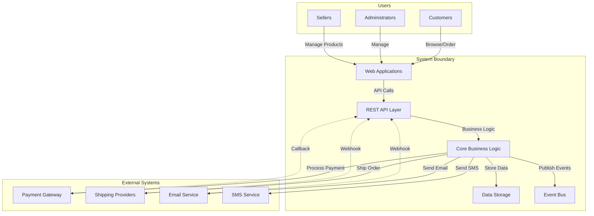

# System Scope and Boundaries

> **Viewpoint**: Context  
> **Purpose**: Define what is within the system's scope and what is outside its boundaries  
> **Audience**: Product Managers, Business Analysts, Architects, Developers

## Overview

This document defines the scope and boundaries of the E-Commerce Platform, clearly delineating what functionality is provided by the system versus what is handled by external systems or out of scope entirely.

## System Scope

### In Scope

The E-Commerce Platform provides the following capabilities:

#### Core E-Commerce Functions

**Customer Management**

- Customer registration and profile management
- Customer authentication and authorization
- Customer preference management
- Customer segmentation and membership levels

**Product Catalog**

- Product information management
- Product categorization and taxonomy
- Product search and filtering
- Product recommendations
- Inventory tracking and availability

**Shopping Experience**

- Shopping cart management
- Product browsing and search
- Wishlist functionality
- Product reviews and ratings
- Price comparison and promotions

**Order Management**

- Order creation and submission
- Order status tracking
- Order history and reordering
- Order cancellation and modification
- Return and refund processing

**Payment Processing**

- Payment method management
- Payment transaction processing
- Payment status tracking
- Refund processing
- Payment security and PCI compliance

**Logistics and Delivery**

- Shipping address management
- Delivery method selection
- Shipping cost calculation
- Order tracking and notifications
- Delivery status updates

**Promotions and Pricing**

- Promotional campaign management
- Discount code application
- Dynamic pricing rules
- Bundle and package deals
- Loyalty program integration

**Seller Management** (Multi-vendor support)

- Seller registration and onboarding
- Seller product management
- Seller order fulfillment
- Seller performance tracking
- Commission and payment management

**Notifications**

- Order confirmation emails
- Shipping notifications
- Promotional communications
- System alerts and reminders
- Customer service notifications

#### Platform Capabilities

**API Services**

- RESTful API for all core functions
- API authentication and rate limiting
- API versioning and documentation
- Webhook support for event notifications

**Event-Driven Architecture**

- Domain event publishing and consumption
- Asynchronous processing
- Event sourcing for audit trails
- Cross-context communication

**Data Management**

- Transactional data storage
- Data consistency and integrity
- Data backup and recovery
- Data archival and retention

**Security**

- User authentication (JWT-based)
- Role-based access control (RBAC)
- Data encryption (at rest and in transit)
- Security audit logging
- GDPR compliance features

**Observability**

- Application performance monitoring
- Distributed tracing
- Business metrics and analytics
- Error tracking and alerting
- Log aggregation and analysis

### Out of Scope

The following capabilities are explicitly **not** provided by the E-Commerce Platform:

#### External Services

**Payment Gateway Operations**

- Credit card processing infrastructure
- Payment fraud detection algorithms
- PCI-DSS certification and compliance infrastructure
- Bank account verification
- Cryptocurrency payment processing

**Shipping and Logistics Operations**

- Physical warehouse management
- Shipping carrier operations
- Last-mile delivery services
- International customs processing
- Package tracking infrastructure

**Email Delivery Infrastructure**

- Email server operations
- Email deliverability management
- Spam filtering and reputation management
- Email template rendering (basic templates provided)

**Content Delivery Network (CDN)**

- Static asset hosting and distribution
- Image optimization and transformation
- Video streaming infrastructure
- Geographic content distribution

#### Business Operations

**Inventory Management**

- Physical inventory counting
- Warehouse operations
- Stock replenishment decisions
- Supplier relationship management

**Customer Service Operations**

- Live chat support (integration provided)
- Phone support operations
- Social media customer service
- Customer service training and management

**Marketing Campaign Execution**

- Email marketing campaign management (integration provided)
- Social media advertising
- Search engine marketing
- Affiliate marketing management

**Financial Operations**

- Accounting and bookkeeping
- Tax calculation and filing
- Financial reporting and compliance
- Payroll processing

**Legal and Compliance**

- Legal document preparation
- Regulatory compliance monitoring
- Intellectual property management
- Contract negotiation and management

#### Technical Infrastructure

**Cloud Infrastructure Management**

- AWS account management
- Infrastructure capacity planning
- Cost optimization strategies
- Disaster recovery site management

**Network Operations**

- DNS management
- SSL certificate management
- DDoS protection
- Network security monitoring

**Development Tools**

- Source code repository hosting
- CI/CD pipeline infrastructure
- Development environment provisioning
- Code quality analysis tools

## System Boundaries

### Boundary Definition

The system boundary is defined by the following interfaces:

#### Inbound Interfaces

**User Interfaces**

- Consumer Web Application (Angular)
- CMC Management Console (Next.js)
- Mobile Applications (future, via API)

**API Interfaces**

- REST API endpoints
- Webhook receivers
- Event consumers (Kafka)

**Integration Interfaces**

- Payment gateway callbacks
- Shipping provider webhooks
- Email service webhooks

#### Outbound Interfaces

**External Service Integrations**

- Payment gateway API calls
- Shipping provider API calls
- Email service API calls
- SMS notification service calls

**Event Publishing**

- Domain events to Kafka topics
- Webhook notifications to external systems

**Data Export**

- Analytics data export
- Reporting data export
- Audit log export

### Boundary Diagram

## Bounded Context Boundaries

### Context Map

The system is organized into 13 bounded contexts, each with clear boundaries:

#### Core Contexts

**Customer Context**

- **Scope**: Customer identity, profile, preferences, authentication
- **Boundary**: Does not handle orders, payments, or products
- **Integration**: Publishes customer events, consumes no events

**Order Context**

- **Scope**: Order lifecycle, order items, order status
- **Boundary**: Does not handle payment processing or shipping
- **Integration**: Publishes order events, consumes customer and product events

**Product Context**

- **Scope**: Product catalog, categories, attributes
- **Boundary**: Does not handle inventory or pricing
- **Integration**: Publishes product events, consumes no events

**Inventory Context**

- **Scope**: Stock levels, reservations, availability
- **Boundary**: Does not handle product details or orders
- **Integration**: Publishes inventory events, consumes order and product events

**Payment Context**

- **Scope**: Payment transactions, payment methods, refunds
- **Boundary**: Does not handle order details or customer information
- **Integration**: Publishes payment events, consumes order events

#### Supporting Contexts

**Shopping Cart Context**

- **Scope**: Cart items, cart management, checkout preparation
- **Boundary**: Does not create orders or process payments
- **Integration**: Publishes cart events, consumes product and customer events

**Pricing Context**

- **Scope**: Price calculation, pricing rules, discounts
- **Boundary**: Does not handle promotions or orders
- **Integration**: Publishes pricing events, consumes product events

**Promotion Context**

- **Scope**: Promotional campaigns, discount codes, rules
- **Boundary**: Does not handle pricing or orders
- **Integration**: Publishes promotion events, consumes order events

**Delivery Context**

- **Scope**: Shipping addresses, delivery methods, tracking
- **Boundary**: Does not handle order details or inventory
- **Integration**: Publishes delivery events, consumes order events

**Seller Context**

- **Scope**: Seller profiles, seller products, seller performance
- **Boundary**: Does not handle orders or payments
- **Integration**: Publishes seller events, consumes product and order events

**Review Context**

- **Scope**: Product reviews, ratings, review moderation
- **Boundary**: Does not handle products or customers
- **Integration**: Publishes review events, consumes product and customer events

**Notification Context**

- **Scope**: Notification templates, delivery, preferences
- **Boundary**: Does not handle business logic or data
- **Integration**: Consumes events from all contexts, publishes notification events

**Observability Context**

- **Scope**: Metrics, logs, traces, monitoring
- **Boundary**: Does not handle business logic or data
- **Integration**: Consumes events from all contexts for monitoring

### Context Integration Rules

**Integration Patterns**

- Contexts communicate via domain events only
- No direct database access between contexts
- No direct API calls between contexts
- Shared kernel limited to common value objects

**Data Ownership**

- Each context owns its data exclusively
- No shared database tables between contexts
- Eventual consistency between contexts
- Event sourcing for audit trails

## Scope Evolution

### Future Scope Considerations

The following capabilities may be added to the system scope in future releases:

**Phase 2 Enhancements**

- Advanced recommendation engine
- Real-time inventory synchronization
- Multi-currency support
- Advanced analytics and reporting

**Phase 3 Enhancements**

- Mobile application support
- Social commerce integration
- Subscription and recurring orders
- Advanced seller analytics

**Phase 4 Enhancements**

- AI-powered customer service
- Augmented reality product preview
- Blockchain-based supply chain tracking
- Voice commerce integration

### Scope Change Process

**Scope Change Request**

1. Submit scope change proposal
2. Impact analysis (technical, business, resources)
3. Stakeholder review and approval
4. Architecture review and design
5. Implementation planning
6. Documentation update

**Approval Authority**

- Minor scope changes: Tech Lead approval
- Major scope changes: Architecture Board approval
- Strategic scope changes: Executive approval

## Related Documentation

- [Context Viewpoint Overview](overview.md) - System context and relationships
- [External Systems](external-systems.md) - External system integrations
- [Stakeholders](stakeholders.md) - Stakeholder concerns and requirements
- [Functional Viewpoint](../functional/overview.md) - System capabilities
- [Bounded Contexts](../functional/bounded-contexts.md) - Context details

---

**Document Status**: Active  
**Last Review**: 2025-10-23  
**Next Review**: 2025-11-23  
**Owner**: Architecture Team
