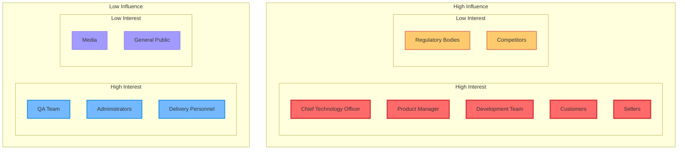
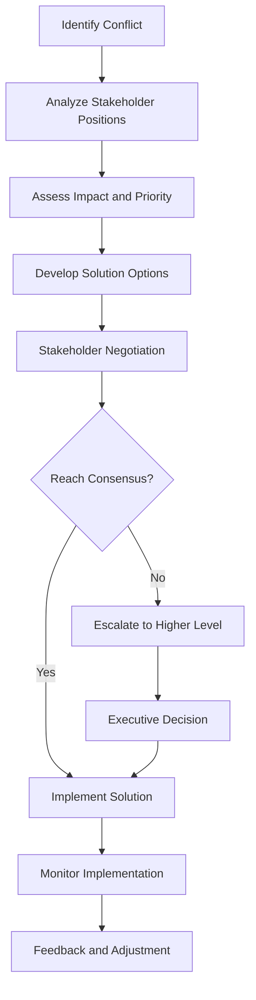

# Stakeholder Analysis

## Overview

This document provides a detailed stakeholder analysis for the GenAI Demo system, including their needs, expectations, influence levels, and engagement strategies.

## Stakeholder Classification

### Primary Stakeholders

#### 1. End Users

##### Customers
- **Role Description**: Consumers who use the platform to purchase products
- **Primary Needs**:
  - Intuitive and user-friendly shopping interface
  - Secure and reliable payment experience
  - Fast and accurate product search
  - Transparent order tracking
  - Quality customer service
- **Expectations**:
  - 24/7 system availability
  - Personalized recommendations
  - Multiple payment options
  - Fast delivery service
- **Interaction Methods**: Web App, Mobile App
- **Influence Level**: 🔴 Extremely High
- **Engagement Strategy**: User experience research, A/B testing, customer feedback collection

##### Sellers
- **Role Description**: Merchants and suppliers selling products on the platform
- **Primary Needs**:
  - Efficient product management tools
  - Real-time order processing system
  - Detailed sales analytics reports
  - Flexible promotional campaign settings
  - Stable payment collection mechanism
- **Expectations**:
  - Low transaction fees
  - Fast fund settlement
  - Rich marketing tools
  - Professional technical support
- **Interaction Methods**: Seller Portal, API Integration
- **Influence Level**: 🔴 Extremely High
- **Engagement Strategy**: Seller training, regular communication meetings, feature requirement collection

##### Administrators
- **Role Description**: Internal personnel responsible for system management and operations
- **Primary Needs**:
  - Comprehensive system monitoring dashboard
  - Flexible user management functions
  - Detailed operational data analysis
  - Efficient problem handling tools
  - Secure system access control
- **Expectations**:
  - Automated operational processes
  - Real-time alert notifications
  - Intuitive data visualization
  - Complete operation logs
- **Interaction Methods**: Management Panel, CLI Tools
- **Influence Level**: 🟡 High
- **Engagement Strategy**: Internal training, tool optimization, process improvement

##### Delivery Personnel
- **Role Description**: Logistics personnel responsible for product delivery
- **Primary Needs**:
  - Clear delivery task list
  - Accurate address and contact information
  - Simple status update interface
  - Route optimization suggestions
  - Exception handling procedures
- **Expectations**:
  - Mobile-friendly interface
  - Offline functionality support
  - Real-time communication features
  - Performance tracking system
- **Interaction Methods**: Mobile App, SMS Notifications
- **Influence Level**: 🟡 Medium
- **Engagement Strategy**: User experience optimization, training support, feedback collection

#### 2. Business Stakeholders

##### Product Manager
- **Role Description**: Responsible for product strategy and feature planning
- **Primary Focus Areas**:
  - Market demand analysis
  - Feature priority ranking
  - User experience optimization
  - Competitive analysis
  - ROI evaluation
- **Decision Influence**: 🔴 Extremely High
- **Participation Methods**: Product planning meetings, requirement reviews, user research
- **Success Metrics**: User satisfaction, feature adoption rate, market share

##### Chief Technology Officer (CTO)
- **Role Description**: Technical strategy and architecture decision maker
- **Primary Focus Areas**:
  - Technology architecture selection
  - System scalability
  - Security and compliance
  - Technical debt management
  - Team technical capabilities
- **Decision Influence**: 🔴 Extremely High
- **Participation Methods**: Architecture reviews, technology selection, risk assessment
- **Success Metrics**: System stability, development efficiency, technical innovation

##### Operations Director
- **Role Description**: Responsible for daily operations and business processes
- **Primary Focus Areas**:
  - Operational efficiency optimization
  - Cost control
  - Service quality management
  - Process standardization
  - Performance monitoring
- **Decision Influence**: 🟡 High
- **Participation Methods**: Operations meetings, process optimization, performance evaluation
- **Success Metrics**: Operational efficiency, cost control, service quality

##### Chief Financial Officer (CFO)
- **Role Description**: Financial strategy and cost control leader
- **Primary Focus Areas**:
  - Budget planning and control
  - ROI analysis
  - Cost-benefit evaluation
  - Financial risk management
  - Investment return tracking
- **Decision Influence**: 🟡 High
- **Participation Methods**: Budget meetings, cost reviews, investment evaluation
- **Success Metrics**: Cost control, investment returns, financial health

#### 3. Technical Stakeholders

##### Development Team
- **Role Description**: Technical personnel responsible for system development and maintenance
- **Primary Needs**:
  - Clear technical specifications
  - Efficient development tools
  - Stable development environment
  - Complete technical documentation
  - Continuous learning opportunities
- **Focus Areas**:
  - Code quality
  - Development efficiency
  - Technical debt
  - Tools and processes
- **Influence Level**: 🔴 Extremely High
- **Engagement Strategy**: Technical sharing, code reviews, tool improvement

##### DevOps Team
- **Role Description**: Responsible for deployment, monitoring, and infrastructure management
- **Primary Needs**:
  - Automated deployment processes
  - Comprehensive monitoring systems
  - Efficient incident handling
  - Reliable backup and recovery
  - Secure access control
- **Focus Areas**:
  - System stability
  - Deployment efficiency
  - Monitoring coverage
  - Security compliance
- **Influence Level**: 🔴 Extremely High
- **Engagement Strategy**: Automation improvement, monitoring optimization, incident reviews

##### QA Team
- **Role Description**: Responsible for software quality assurance and testing
- **Primary Needs**:
  - Complete testing environment
  - Automated testing tools
  - Clear testing specifications
  - Efficient defect tracking
  - Continuous integration support
- **Focus Areas**:
  - Software quality
  - Test coverage
  - Defect density
  - Release quality
- **Influence Level**: 🟡 High
- **Engagement Strategy**: Test automation, quality metrics, process improvement

### Secondary Stakeholders

#### 1. External Partners

##### Payment Providers
- **Representatives**: Stripe, PayPal
- **Relationship Type**: Service Provider
- **Primary Focus Areas**:
  - API usage compliance
  - Transaction volume and revenue
  - Security standard adherence
  - Technical support needs
- **Impact Scope**: Payment processing, fund security
- **Management Strategy**: 
  - Regular technical coordination
  - SLA monitoring and evaluation
  - Backup plan preparation
  - Contract term optimization

##### Logistics Partners
- **Representatives**: Third-party logistics companies
- **Relationship Type**: Business Partner
- **Primary Focus Areas**:
  - Delivery volume and revenue
  - Service quality standards
  - System integration stability
  - Cost-benefit optimization
- **Impact Scope**: Delivery service, customer satisfaction
- **Management Strategy**:
  - Performance monitoring and evaluation
  - Service quality improvement
  - Cost negotiation and optimization
  - Multi-supplier strategy

##### Cloud Service Providers
- **Representatives**: Amazon Web Services (AWS)
- **Relationship Type**: Infrastructure Provider
- **Primary Focus Areas**:
  - Service usage volume
  - Technical support needs
  - Security compliance requirements
  - Cost optimization opportunities
- **Impact Scope**: System availability, data security
- **Management Strategy**:
  - Multi-cloud strategy planning
  - Cost monitoring and optimization
  - Disaster recovery preparation
  - Technology roadmap alignment

#### 2. Regulatory Bodies

##### Data Protection Authorities
- **Representatives**: National data protection committees
- **Relationship Type**: Regulatory Oversight
- **Primary Focus Areas**:
  - GDPR compliance
  - Data processing transparency
  - User rights protection
  - Data breach handling
- **Impact Scope**: Data processing, privacy protection
- **Management Strategy**:
  - Proactive compliance measures
  - Regular compliance audits
  - Privacy by design principles
  - Incident response plans

##### Financial Regulatory Bodies
- **Representatives**: National financial regulatory committees
- **Relationship Type**: Regulatory Oversight
- **Primary Focus Areas**:
  - Payment security standards
  - Anti-money laundering compliance
  - Consumer protection
  - Fund security assurance
- **Impact Scope**: Payment processing, fund management
- **Management Strategy**:
  - PCI DSS compliance
  - AML policy implementation
  - Regular security audits
  - Regulatory report submission

#### 3. Competitors

##### Direct Competitors
- **Representatives**: Other e-commerce platforms
- **Relationship Type**: Market Competition
- **Primary Focus Areas**:
  - Market share
  - Feature differentiation
  - Price competitiveness
  - User experience
- **Impact Scope**: Market positioning, feature requirements
- **Management Strategy**:
  - Competitive analysis monitoring
  - Differentiation strategy
  - Innovative feature development
  - User loyalty building

##### Indirect Competitors
- **Representatives**: Traditional retail, other online services
- **Relationship Type**: Ecosystem Competition
- **Primary Focus Areas**:
  - User time competition
  - Consumer habit influence
  - Technology trend following
  - Business model innovation
- **Impact Scope**: User acquisition, market trends
- **Management Strategy**:
  - Market trend analysis
  - User behavior research
  - Cross-industry collaboration opportunities
  - Ecosystem building

## Stakeholder Influence Analysis

### Influence-Interest Matrix



### Engagement Strategies

#### High Influence + High Interest (Manage Closely)
- **Stakeholders**: CTO, Product Manager, Development Team, Customers, Sellers
- **Strategy**: 
  - Regular communication and negotiation
  - Deep involvement in decision-making process
  - Continuous requirement collection and feedback
  - Build long-term cooperative relationships

#### High Influence + Low Interest (Keep Satisfied)
- **Stakeholders**: Regulatory Bodies, Competitors
- **Strategy**:
  - Proactive compliance and transparent communication
  - Monitor their dynamics and policy changes
  - Build positive public relations
  - Preventive risk management

#### Low Influence + High Interest (Keep Informed)
- **Stakeholders**: QA Team, Administrators, Delivery Personnel
- **Strategy**:
  - Regular information updates
  - Provide necessary support and tools
  - Collect feedback and suggestions
  - Moderate participation in decision-making process

#### Low Influence + Low Interest (Monitor)
- **Stakeholders**: Media, General Public
- **Strategy**:
  - Basic information transparency
  - Monitor public opinion and reactions
  - Communicate when necessary
  - Maintain brand image

## Communication Plan

### Communication Frequency and Methods

| Stakeholder | Communication Frequency | Communication Methods | Main Content |
|-------------|------------------------|----------------------|--------------|
| **Customers** | Real-time | App notifications, Email, SMS | Order status, promotions, system announcements |
| **Sellers** | Daily | Seller portal, Email | Order notifications, sales reports, policy updates |
| **Development Team** | Daily | Slack, Meetings | Technical discussions, progress updates, problem solving |
| **Product Manager** | Weekly | Meetings, Reports | Feature planning, market analysis, user feedback |
| **CTO** | Monthly | Meetings, Reports | Architecture decisions, technology roadmap, risk assessment |
| **Regulatory Bodies** | As needed | Formal reports, Meetings | Compliance reports, incident notifications, policy consultation |

### Communication Content Templates

#### Technical Stakeholder Communication
```markdown
# Technical Weekly Report Template

## System Status
- Availability: 99.9%
- Average Response Time: 1.2s
- Error Rate: 0.1%

## Development Progress
- Completed Features: [Feature List]
- In Progress Features: [Feature List]
- Next Week Plan: [Plan List]

## Technical Debt
- New Debt: [Description]
- Resolved Debt: [Description]
- Priority Items: [List]

## Risks and Issues
- New Risks: [Description]
- Resolved Issues: [Description]
- Support Needed: [List]
```

#### Business Stakeholder Communication
```markdown
# Business Monthly Report Template

## Key Metrics
- Active Users: [Number]
- Transaction Volume: [Number]
- Revenue: [Number]
- Customer Satisfaction: [Score]

## Feature Updates
- New Features Released: [List]
- Feature Usage: [Statistics]
- User Feedback: [Summary]

## Market Analysis
- Competitor Activities: [Analysis]
- Market Trends: [Observations]
- Opportunities and Threats: [Assessment]

## Next Month Plan
- Feature Development: [Plan]
- Market Activities: [Plan]
- Improvement Measures: [Plan]
```

## Conflict Management

### Common Stakeholder Conflicts

#### 1. Feature Requirement Conflicts
- **Conflicting Parties**: Product Manager vs Development Team
- **Cause**: Feature complexity vs Development timeline
- **Resolution Strategy**:
  - Technical feasibility assessment
  - Feature priority ranking
  - Phased implementation plan
  - Regular progress reviews

#### 2. Cost Control Conflicts
- **Conflicting Parties**: CFO vs CTO
- **Cause**: Cost control vs Technical investment
- **Resolution Strategy**:
  - ROI analysis and justification
  - Phased investment plan
  - Cost-benefit evaluation
  - Risk cost consideration

#### 3. User Experience Conflicts
- **Conflicting Parties**: Customers vs Sellers
- **Cause**: Different user group requirement differences
- **Resolution Strategy**:
  - User research and analysis
  - Personalized feature design
  - A/B testing validation
  - Balanced solutions

### Conflict Resolution Process



## Success Metrics

### Stakeholder Satisfaction Metrics

| Stakeholder | Key Metric | Target Value | Measurement Method |
|-------------|------------|--------------|-------------------|
| **Customers** | Customer Satisfaction Score | ≥ 4.5/5.0 | Regular surveys |
| **Sellers** | Seller Retention Rate | ≥ 90% | Monthly statistics |
| **Development Team** | Developer Satisfaction | ≥ 4.0/5.0 | Quarterly surveys |
| **Management** | Business Goal Achievement Rate | ≥ 95% | Monthly evaluation |
| **Regulatory Bodies** | Compliance Check Pass Rate | 100% | Annual audits |

### Engagement Effectiveness Metrics

- **Communication Efficiency**: Response time < 24 hours
- **Decision Speed**: Important decisions < 1 week
- **Conflict Resolution**: Conflict resolution time < 2 weeks
- **Requirement Fulfillment**: Requirement implementation rate ≥ 80%
- **Relationship Quality**: Stakeholder trust level ≥ 4.0/5.0

---

**Last Updated**: January 22, 2025  
**Maintainer**: Product Management Team  
**Reviewer**: Business Team, Technical Team