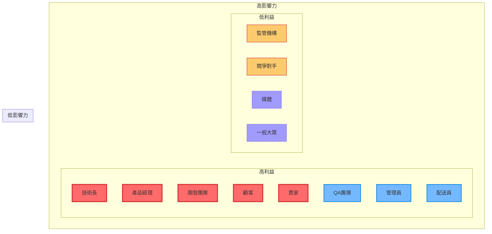
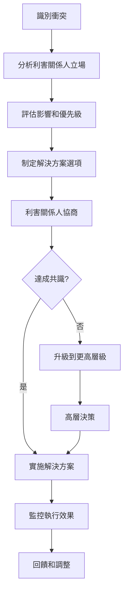

# 利害關係人分析

## 概覽

本文件詳細分析 GenAI Demo 系統的所有利害關係人，包括他們的需求、期望、影響力和參與策略。

## 利害關係人分類

### 主要利害關係人 (Primary Stakeholders)

#### 1. 終端使用者

##### 顧客 (Customers)
- **角色描述**: 使用平台購買商品的消費者
- **主要需求**:
  - 直觀易用的購物介面
  - 安全可靠的支付體驗
  - 快速準確的商品搜尋
  - 透明的訂單追蹤
  - 優質的客戶服務
- **期望**:
  - 24/7 系統可用性
  - 個人化推薦
  - 多元支付選擇
  - 快速配送服務
- **互動方式**: Web App, Mobile App
- **影響程度**: 🔴 極高
- **參與策略**: 使用者體驗研究、A/B 測試、客戶回饋收集

##### 賣家 (Sellers)
- **角色描述**: 在平台上銷售商品的商家和供應商
- **主要需求**:
  - 高效的商品管理工具
  - 即時的訂單處理系統
  - 詳細的銷售分析報表
  - 靈活的促銷活動設定
  - 穩定的收款機制
- **期望**:
  - 低交易手續費
  - 快速的資金結算
  - 豐富的行銷工具
  - 專業的技術支援
- **互動方式**: 賣家門戶, API 整合
- **影響程度**: 🔴 極高
- **參與策略**: 賣家培訓、定期溝通會議、功能需求收集

##### 管理員 (Administrators)
- **角色描述**: 負責系統管理和運營的內部人員
- **主要需求**:
  - 全面的系統監控面板
  - 靈活的使用者管理功能
  - 詳細的營運數據分析
  - 高效的問題處理工具
  - 安全的系統存取控制
- **期望**:
  - 自動化運營流程
  - 即時告警通知
  - 直觀的資料視覺化
  - 完整的操作日誌
- **互動方式**: 管理面板, CLI 工具
- **影響程度**: 🟡 高
- **參與策略**: 內部培訓、工具優化、流程改善

##### 配送員 (Delivery Personnel)
- **角色描述**: 負責商品配送的物流人員
- **主要需求**:
  - 清晰的配送任務列表
  - 準確的地址和聯絡資訊
  - 簡單的狀態更新介面
  - 路線優化建議
  - 異常情況處理流程
- **期望**:
  - 行動裝置友好介面
  - 離線功能支援
  - 即時通訊功能
  - 績效追蹤系統
- **互動方式**: Mobile App, 簡訊通知
- **影響程度**: 🟡 中
- **參與策略**: 使用者體驗優化、培訓支援、回饋收集

#### 2. 業務利害關係人

##### 產品經理 (Product Manager)
- **角色描述**: 負責產品策略和功能規劃
- **主要關注點**:
  - 市場需求分析
  - 功能優先級排序
  - 使用者體驗優化
  - 競爭力分析
  - ROI 評估
- **決策影響**: 🔴 極高
- **參與方式**: 產品規劃會議、需求評審、使用者研究
- **成功指標**: 使用者滿意度、功能採用率、市場佔有率

##### 技術長 (CTO)
- **角色描述**: 技術策略和架構決策負責人
- **主要關注點**:
  - 技術架構選擇
  - 系統可擴展性
  - 安全性和合規性
  - 技術債務管理
  - 團隊技術能力
- **決策影響**: 🔴 極高
- **參與方式**: 架構評審、技術選型、風險評估
- **成功指標**: 系統穩定性、開發效率、技術創新

##### 營運總監 (Operations Director)
- **角色描述**: 負責日常營運和業務流程
- **主要關注點**:
  - 營運效率優化
  - 成本控制
  - 服務品質管理
  - 流程標準化
  - 績效監控
- **決策影響**: 🟡 高
- **參與方式**: 營運會議、流程優化、績效評估
- **成功指標**: 營運效率、成本控制、服務品質

##### 財務長 (CFO)
- **角色描述**: 財務策略和成本控制負責人
- **主要關注點**:
  - 預算規劃和控制
  - ROI 分析
  - 成本效益評估
  - 財務風險管理
  - 投資回報追蹤
- **決策影響**: 🟡 高
- **參與方式**: 預算會議、成本審核、投資評估
- **成功指標**: 成本控制、投資回報、財務健康度

#### 3. 技術利害關係人

##### 開發團隊 (Development Team)
- **角色描述**: 負責系統開發和維護的技術人員
- **主要需求**:
  - 清晰的技術規範
  - 高效的開發工具
  - 穩定的開發環境
  - 完整的技術文件
  - 持續學習機會
- **關注點**:
  - 程式碼品質
  - 開發效率
  - 技術債務
  - 工具和流程
- **影響程度**: 🔴 極高
- **參與策略**: 技術分享、程式碼審查、工具改善

##### DevOps 團隊 (DevOps Team)
- **角色描述**: 負責部署、監控和基礎設施管理
- **主要需求**:
  - 自動化部署流程
  - 全面的監控系統
  - 高效的故障處理
  - 可靠的備份恢復
  - 安全的存取控制
- **關注點**:
  - 系統穩定性
  - 部署效率
  - 監控覆蓋率
  - 安全合規
- **影響程度**: 🔴 極高
- **參與策略**: 自動化改善、監控優化、事件回顧

##### QA 團隊 (Quality Assurance Team)
- **角色描述**: 負責軟體品質保證和測試
- **主要需求**:
  - 完整的測試環境
  - 自動化測試工具
  - 清晰的測試規範
  - 高效的缺陷追蹤
  - 持續整合支援
- **關注點**:
  - 軟體品質
  - 測試覆蓋率
  - 缺陷密度
  - 發布品質
- **影響程度**: 🟡 高
- **參與策略**: 測試自動化、品質指標、流程改善

### 次要利害關係人 (Secondary Stakeholders)

#### 1. 外部合作夥伴

##### 支付服務商 (Payment Providers)
- **代表**: Stripe, PayPal
- **關係類型**: 服務提供者
- **主要關注點**:
  - API 使用合規性
  - 交易量和收入
  - 安全標準遵循
  - 技術支援需求
- **影響範圍**: 支付處理、資金安全
- **管理策略**: 
  - 定期技術對接
  - SLA 監控和評估
  - 備援方案準備
  - 合約條款優化

##### 物流合作夥伴 (Logistics Partners)
- **代表**: 第三方物流公司
- **關係類型**: 業務夥伴
- **主要關注點**:
  - 配送量和收入
  - 服務品質標準
  - 系統整合穩定性
  - 成本效益優化
- **影響範圍**: 配送服務、客戶滿意度
- **管理策略**:
  - 績效監控和評估
  - 服務品質改善
  - 成本談判和優化
  - 多供應商策略

##### 雲端服務商 (Cloud Service Providers)
- **代表**: Amazon Web Services (AWS)
- **關係類型**: 基礎設施提供者
- **主要關注點**:
  - 服務使用量
  - 技術支援需求
  - 安全合規要求
  - 成本優化機會
- **影響範圍**: 系統可用性、資料安全
- **管理策略**:
  - 多雲策略規劃
  - 成本監控和優化
  - 災難復原準備
  - 技術路線圖對齊

#### 2. 監管機構

##### 資料保護機構
- **代表**: 各國資料保護委員會
- **關係類型**: 法規監督
- **主要關注點**:
  - GDPR 合規性
  - 資料處理透明度
  - 使用者權利保護
  - 資料外洩處理
- **影響範圍**: 資料處理、隱私保護
- **管理策略**:
  - 主動合規措施
  - 定期合規審計
  - 隱私設計原則
  - 事件回應計劃

##### 金融監管機構
- **代表**: 各國金融監管委員會
- **關係類型**: 法規監督
- **主要關注點**:
  - 支付安全標準
  - 反洗錢合規
  - 消費者保護
  - 資金安全保障
- **影響範圍**: 支付處理、資金管理
- **管理策略**:
  - PCI DSS 合規
  - AML 政策實施
  - 定期安全審計
  - 監管報告提交

#### 3. 競爭對手

##### 直接競爭對手
- **代表**: 其他電商平台
- **關係類型**: 市場競爭
- **主要關注點**:
  - 市場佔有率
  - 功能差異化
  - 價格競爭力
  - 使用者體驗
- **影響範圍**: 市場定位、功能需求
- **管理策略**:
  - 競爭分析監控
  - 差異化策略
  - 創新功能開發
  - 使用者忠誠度建立

##### 間接競爭對手
- **代表**: 傳統零售、其他線上服務
- **關係類型**: 生態競爭
- **主要關注點**:
  - 使用者時間競爭
  - 消費習慣影響
  - 技術趨勢跟隨
  - 商業模式創新
- **影響範圍**: 使用者獲取、市場趨勢
- **管理策略**:
  - 市場趨勢分析
  - 使用者行為研究
  - 跨界合作機會
  - 生態系統建立

## 利害關係人影響力分析

### 影響力-利益矩陣



### 參與策略

#### 高影響力 + 高利益 (密切管理)
- **利害關係人**: 技術長、產品經理、開發團隊、顧客、賣家
- **策略**: 
  - 定期溝通和協商
  - 深度參與決策過程
  - 持續需求收集和回饋
  - 建立長期合作關係

#### 高影響力 + 低利益 (保持滿意)
- **利害關係人**: 監管機構、競爭對手
- **策略**:
  - 主動合規和透明溝通
  - 監控其動態和政策變化
  - 建立正面公共關係
  - 預防性風險管理

#### 低影響力 + 高利益 (保持知情)
- **利害關係人**: QA團隊、管理員、配送員
- **策略**:
  - 定期資訊更新
  - 提供必要的支援和工具
  - 收集回饋和建議
  - 適度參與決策過程

#### 低影響力 + 低利益 (監控)
- **利害關係人**: 媒體、一般大眾
- **策略**:
  - 基本資訊透明
  - 監控輿論和反應
  - 必要時進行溝通
  - 維護品牌形象

## 溝通計劃

### 溝通頻率和方式

| 利害關係人 | 溝通頻率 | 溝通方式 | 主要內容 |
|-----------|---------|---------|---------|
| **顧客** | 即時 | App 通知、Email、SMS | 訂單狀態、促銷活動、系統公告 |
| **賣家** | 每日 | 賣家門戶、Email | 訂單通知、銷售報表、政策更新 |
| **開發團隊** | 每日 | Slack、會議 | 技術討論、進度更新、問題解決 |
| **產品經理** | 每週 | 會議、報告 | 功能規劃、市場分析、使用者回饋 |
| **技術長** | 每月 | 會議、報告 | 架構決策、技術路線圖、風險評估 |
| **監管機構** | 按需 | 正式報告、會議 | 合規報告、事件通知、政策諮詢 |

### 溝通內容模板

#### 技術利害關係人溝通
```markdown
# 技術週報模板

## 系統狀態
- 可用性: 99.9%
- 平均響應時間: 1.2s
- 錯誤率: 0.1%

## 開發進度
- 已完成功能: [功能列表]
- 進行中功能: [功能列表]
- 下週計劃: [計劃列表]

## 技術債務
- 新增債務: [描述]
- 已解決債務: [描述]
- 優先處理項目: [列表]

## 風險和問題
- 新發現風險: [描述]
- 已解決問題: [描述]
- 需要支援項目: [列表]
```

#### 業務利害關係人溝通
```markdown
# 業務月報模板

## 關鍵指標
- 活躍使用者數: [數字]
- 交易量: [數字]
- 收入: [數字]
- 客戶滿意度: [分數]

## 功能更新
- 新功能發布: [列表]
- 功能使用情況: [統計]
- 使用者回饋: [摘要]

## 市場分析
- 競爭對手動態: [分析]
- 市場趨勢: [觀察]
- 機會和威脅: [評估]

## 下月計劃
- 功能開發: [計劃]
- 市場活動: [計劃]
- 改善措施: [計劃]
```

## 衝突管理

### 常見利害關係人衝突

#### 1. 功能需求衝突
- **衝突方**: 產品經理 vs 開發團隊
- **原因**: 功能複雜度 vs 開發時程
- **解決策略**:
  - 技術可行性評估
  - 功能優先級排序
  - 分階段實現計劃
  - 定期進度檢討

#### 2. 成本控制衝突
- **衝突方**: 財務長 vs 技術長
- **原因**: 成本控制 vs 技術投資
- **解決策略**:
  - ROI 分析和論證
  - 分階段投資計劃
  - 成本效益評估
  - 風險成本考量

#### 3. 使用者體驗衝突
- **衝突方**: 顧客 vs 賣家
- **原因**: 不同使用者群體需求差異
- **解決策略**:
  - 使用者研究和分析
  - 個人化功能設計
  - A/B 測試驗證
  - 平衡化解決方案

### 衝突解決流程



## 成功指標

### 利害關係人滿意度指標

| 利害關係人 | 關鍵指標 | 目標值 | 測量方式 |
|-----------|---------|-------|---------|
| **顧客** | 客戶滿意度分數 | ≥ 4.5/5.0 | 定期調查 |
| **賣家** | 賣家留存率 | ≥ 90% | 月度統計 |
| **開發團隊** | 開發者滿意度 | ≥ 4.0/5.0 | 季度調查 |
| **管理層** | 業務目標達成率 | ≥ 95% | 月度評估 |
| **監管機構** | 合規檢查通過率 | 100% | 年度審計 |

### 參與效果指標

- **溝通效率**: 回應時間 < 24小時
- **決策速度**: 重要決策 < 1週
- **衝突解決**: 衝突解決時間 < 2週
- **需求滿足**: 需求實現率 ≥ 80%
- **關係品質**: 利害關係人信任度 ≥ 4.0/5.0

---

**最後更新**: 2025年1月22日  
**維護者**: 產品管理團隊  
**審核者**: 業務團隊、技術團隊
