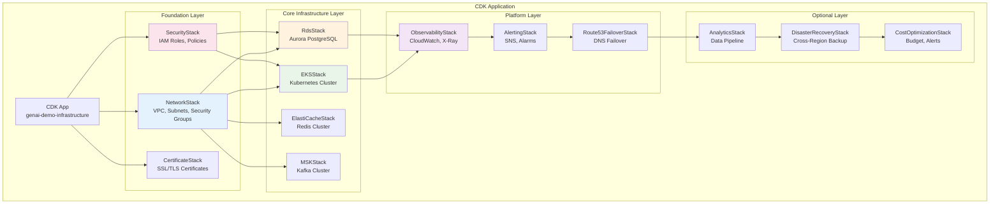
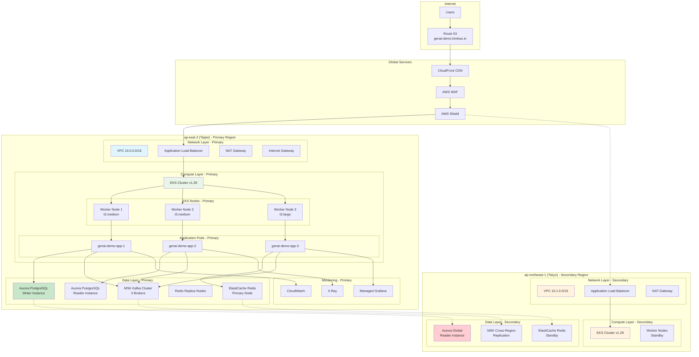
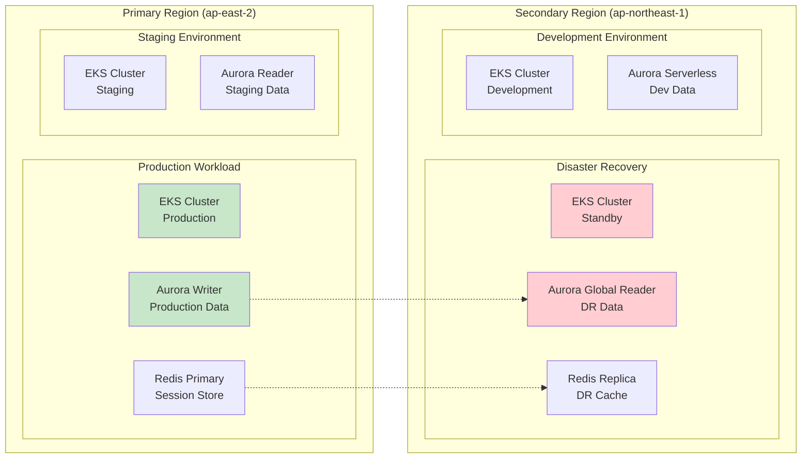
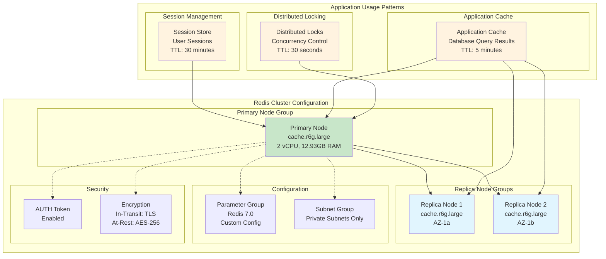
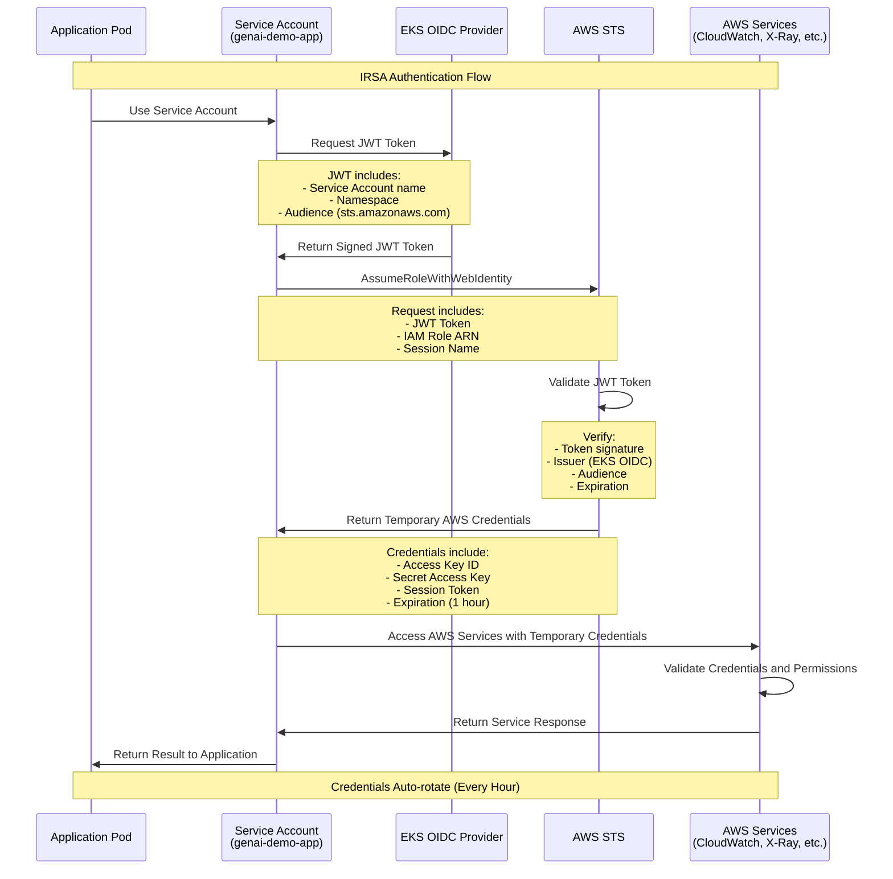
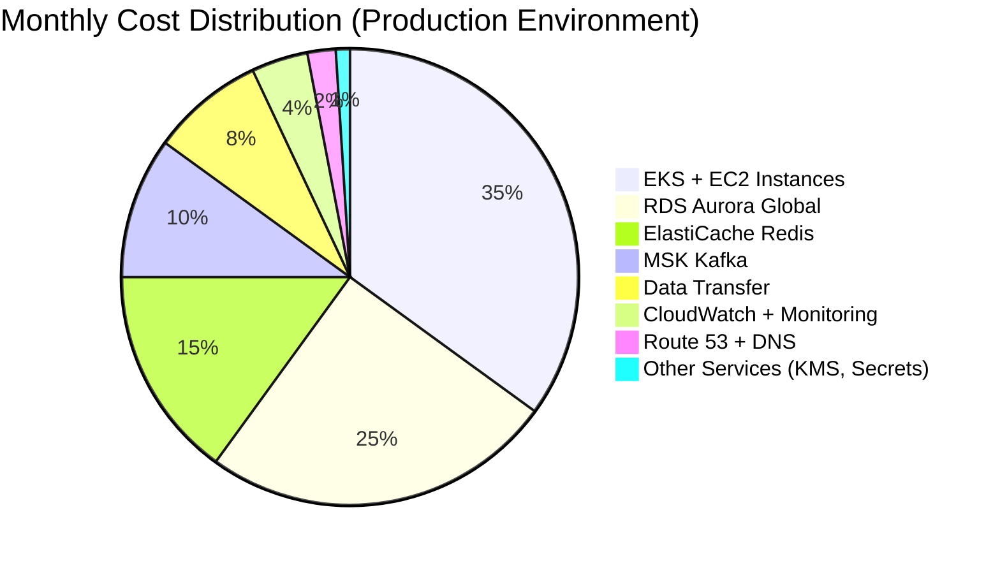

# AWS Infrastructure Architecture - Deployment Viewpoint

**Document Version**: 1.0  
**Last Updated**: September 24, 2025 6:02 PM (Taipei Time)  
**Author**: Architecture Team  
**Status**: Active

## 📋 Table of Contents

- [Overview](#overview)
- [CDK Architecture Design](#cdk-architecture-design)
- [AWS Resource Configuration](#aws-resource-configuration)
- [Multi-Region Deployment Architecture](#multi-region-deployment-architecture)
- [Network Architecture](#network-architecture)
- [Compute Resources](#compute-resources)
- [Data Storage](#data-storage)
- [IAM Permission Architecture](#iam-permission-architecture)
- [Deployment Process](#deployment-process)
- [Cost Optimization](#cost-optimization)

## Overview

GenAI Demo adopts AWS CDK (Cloud Development Kit) to implement Infrastructure as Code, deployed on a Multi-Region Active-Active architecture. The primary region is Taipei (ap-east-2), and the secondary region is Tokyo (ap-northeast-1), ensuring high availability and disaster recovery capabilities.

### Deployment Objectives

- **Infrastructure as Code**: Manage all resources using AWS CDK TypeScript
- **Multi-Region Architecture**: Primary region (Taipei) + Secondary region (Tokyo)
- **Automated Deployment**: CI/CD integration supporting multi-environment deployment
- **Cost Optimization**: On-demand scaling with resource tag management
- **Security Compliance**: IAM least privilege principle, encrypted data in transit and at rest

## CDK Architecture Design

### CDK Stack Organization Architecture



### CDK Stack Dependencies

```typescript
// Stack deployment order and dependencies
const deploymentOrder = {
  phase1: ['NetworkStack', 'SecurityStack', 'CertificateStack'],
  phase2: ['RdsStack', 'ElastiCacheStack', 'MSKStack'],
  phase3: ['EKSStack'],
  phase4: ['ObservabilityStack', 'AlertingStack'],
  phase5: ['Route53FailoverStack', 'AnalyticsStack'],
  phase6: ['DisasterRecoveryStack', 'CostOptimizationStack']
};
```

## AWS Resource Configuration

### Complete System Architecture Diagram



### Resource Configuration Details

#### Network Resources (NetworkStack)

```yaml
VPC Configuration:
  CIDR: 10.0.0.0/16 (Primary), 10.1.0.0/16 (Secondary)
  Availability Zones: 2 AZs per region
  
Subnet Configuration:
  Public Subnets:
    - 10.0.0.0/24 (AZ-1a)
    - 10.0.1.0/24 (AZ-1b)
    Purpose: ALB, NAT Gateway, Bastion Host
    
  Private Subnets:
    - 10.0.2.0/24 (AZ-1a)
    - 10.0.3.0/24 (AZ-1b)
    Purpose: EKS Worker Nodes, Application Pods
    
  Database Subnets:
    - 10.0.4.0/28 (AZ-1a)
    - 10.0.5.0/28 (AZ-1b)
    Purpose: RDS Aurora, ElastiCache

Security Groups:
  ALB Security Group:
    Inbound: Port 80/443 from 0.0.0.0/0
    Outbound: Port 8080 to App Security Group
    
  App Security Group:
    Inbound: Port 8080 from ALB Security Group
    Outbound: Port 443 to 0.0.0.0/0, Port 5432/6379 to DB Security Group
    
  Database Security Group:
    Inbound: Port 5432 from App Security Group (PostgreSQL)
    Inbound: Port 6379 from App Security Group (Redis)
    Outbound: None
```

#### Compute Resources (EKSStack)

```yaml
EKS Cluster:
  Version: Kubernetes 1.28
  Endpoint Access: Private
  Logging: API, Audit, Authenticator, ControllerManager, Scheduler
  
Managed Node Groups:
  Primary Node Group:
    Instance Types: [t3.medium, t3.large]
    Min Size: 2
    Max Size: 10
    Desired Size: 2 (dev), 3 (prod)
    AMI Type: AL2_X86_64
    Capacity Type: ON_DEMAND
    Disk Size: 20GB GP3
    
Auto Scaling:
  Horizontal Pod Autoscaler (HPA):
    CPU Target: 70%
    Memory Target: 80%
    Min Replicas: 2
    Max Replicas: 10
    
  KEDA ScaledObject:
    Trigger: Custom Metrics (Thread Pool)
    Min Replicas: 1
    Max Replicas: 8
    
  Cluster Autoscaler:
    Node Utilization Target: 70%
    Scale Down Delay: 10 minutes
```

## Multi-Region Deployment Architecture

### Regional Configuration Strategy



### Environment Configuration Matrix

| Environment | Region | EKS Nodes | RDS Configuration | Redis Configuration | Purpose |
|-------------|--------|-----------|-------------------|-------------------|---------|
| Production | ap-east-2 | 3 x t3.large | Aurora Writer + Reader | Primary + 2 Replicas | Production Service |
| Staging | ap-east-2 | 2 x t3.medium | Aurora Reader | Single Node | Testing Validation |
| DR | ap-northeast-1 | 2 x t3.medium (Standby) | Aurora Global Reader | Replica Cluster | Disaster Recovery |
| Development | ap-northeast-1 | 1 x t3.small | Aurora Serverless | Single Node | Development Testing |

## Network Architecture

### VPC Network Design

```mermaid
graph TB
    subgraph "Internet"
        Internet[Internet]
    end
    
    subgraph "VPC 10.0.0.0/16"
        subgraph "Availability Zone A"
            PubSubnetA[Public Subnet<br/>10.0.0.0/24]
            PrivSubnetA[Private Subnet<br/>10.0.2.0/24]
            DBSubnetA[DB Subnet<br/>10.0.4.0/28]
        end
        
        subgraph "Availability Zone B"
            PubSubnetB[Public Subnet<br/>10.0.1.0/24]
            PrivSubnetB[Private Subnet<br/>10.0.3.0/24]
            DBSubnetB[DB Subnet<br/>10.0.5.0/28]
        end
        
        subgraph "Network Components"
            IGW[Internet Gateway]
            NAT[NAT Gateway]
            ALB[Application Load Balancer]
            RT_Public[Public Route Table]
            RT_Private[Private Route Table]
        end
        
        subgraph "Security"
            NACL_Public[Public NACL]
            NACL_Private[Private NACL]
            NACL_DB[Database NACL]
        end
    end
    
    Internet --> IGW
    IGW --> PubSubnetA
    IGW --> PubSubnetB
    
    PubSubnetA --> NAT
    NAT --> PrivSubnetA
    NAT --> PrivSubnetB
    
    ALB --> PrivSubnetA
    ALB --> PrivSubnetB
    
    PrivSubnetA --> DBSubnetA
    PrivSubnetB --> DBSubnetB
    
    RT_Public -.-> PubSubnetA
    RT_Public -.-> PubSubnetB
    RT_Private -.-> PrivSubnetA
    RT_Private -.-> PrivSubnetB
    
    NACL_Public -.-> PubSubnetA
    NACL_Public -.-> PubSubnetB
    NACL_Private -.-> PrivSubnetA
    NACL_Private -.-> PrivSubnetB
    NACL_DB -.-> DBSubnetA
    NACL_DB -.-> DBSubnetB
    
    style PubSubnetA fill:#e1f5fe
    style PubSubnetB fill:#e1f5fe
    style PrivSubnetA fill:#e8f5e8
    style PrivSubnetB fill:#e8f5e8
    style DBSubnetA fill:#fff3e0
    style DBSubnetB fill:#fff3e0
```

### Traffic Routing Design

```yaml
Route Tables:
  Public Route Table:
    - 0.0.0.0/0 → Internet Gateway
    - 10.0.0.0/16 → Local
    
  Private Route Table:
    - 0.0.0.0/0 → NAT Gateway
    - 10.0.0.0/16 → Local
    
  Database Route Table:
    - 10.0.0.0/16 → Local
    - No Internet Access

Network ACLs:
  Public NACL:
    Inbound: HTTP/HTTPS (80, 443), SSH (22), Ephemeral Ports
    Outbound: All Traffic
    
  Private NACL:
    Inbound: From Public Subnets, Database Ports
    Outbound: HTTPS (443), Database Ports
    
  Database NACL:
    Inbound: PostgreSQL (5432), Redis (6379) from Private Subnets
    Outbound: Response Traffic Only
```

## Compute Resources

### EKS Cluster Architecture

```mermaid
graph TB
    subgraph "EKS Control Plane (AWS Managed)"
        API[Kubernetes API Server]
        ETCD[etcd Cluster]
        Scheduler[kube-scheduler]
        Controller[kube-controller-manager]
        CCM[cloud-controller-manager]
    end
    
    subgraph "EKS Data Plane (Customer Managed)"
        subgraph "Managed Node Group"
            Node1[Worker Node 1<br/>t3.medium<br/>2 vCPU, 4GB RAM]
            Node2[Worker Node 2<br/>t3.medium<br/>2 vCPU, 4GB RAM]
            Node3[Worker Node 3<br/>t3.large<br/>2 vCPU, 8GB RAM]
        end
        
        subgraph "System Pods"
            DNS[CoreDNS]
            Proxy[kube-proxy]
            CNI[AWS VPC CNI]
            CSI[EBS CSI Driver]
        end
        
        subgraph "Application Pods"
            App1[genai-demo-app-1<br/>CPU: 100m-500m<br/>Memory: 128Mi-512Mi]
            App2[genai-demo-app-2<br/>CPU: 100m-500m<br/>Memory: 128Mi-512Mi]
            App3[genai-demo-app-3<br/>CPU: 100m-500m<br/>Memory: 128Mi-512Mi]
        end
        
        subgraph "Monitoring Pods"
            CWAgent[CloudWatch Agent]
            XRayDaemon[X-Ray Daemon]
            Prometheus[Prometheus Node Exporter]
        end
        
        subgraph "Autoscaling Components"
            HPA[Horizontal Pod Autoscaler]
            KEDA[KEDA Operator]
            CA[Cluster Autoscaler]
        end
    end
    
    subgraph "AWS Services Integration"
        ECR[Elastic Container Registry]
        ELB[Elastic Load Balancer]
        EBS[Elastic Block Store]
        CloudWatch[CloudWatch Metrics]
        XRay[X-Ray Tracing]
    end
    
    API --> Node1
    API --> Node2
    API --> Node3
    
    Node1 --> App1
    Node1 --> DNS
    Node1 --> CWAgent
    
    Node2 --> App2
    Node2 --> Proxy
    Node2 --> XRayDaemon
    
    Node3 --> App3
    Node3 --> CNI
    Node3 --> Prometheus
    
    HPA --> App1
    HPA --> App2
    HPA --> App3
    
    KEDA --> App1
    KEDA --> App2
    KEDA --> App3
    
    CA --> Node1
    CA --> Node2
    CA --> Node3
    
    App1 --> ECR
    App2 --> ECR
    App3 --> ECR
    
    ELB --> App1
    ELB --> App2
    ELB --> App3
    
    Node1 --> EBS
    Node2 --> EBS
    Node3 --> EBS
    
    CWAgent --> CloudWatch
    XRayDaemon --> XRay
    Prometheus --> CloudWatch
    
    style API fill:#e3f2fd
    style Node1 fill:#e8f5e8
    style Node2 fill:#e8f5e8
    style Node3 fill:#e8f5e8
    style App1 fill:#fff3e0
    style App2 fill:#fff3e0
    style App3 fill:#fff3e0
```



### Pod Resource Configuration

```yaml
Application Pod Specification:
  Resources:
    Requests:
      CPU: 100m
      Memory: 128Mi
    Limits:
      CPU: 500m
      Memory: 512Mi
      
  Health Checks:
    Liveness Probe:
      Path: /actuator/health/liveness
      Initial Delay: 30s
      Period: 10s
      Timeout: 5s
      Failure Threshold: 3
      
    Readiness Probe:
      Path: /actuator/health/readiness
      Initial Delay: 10s
      Period: 5s
      Timeout: 3s
      Failure Threshold: 3
      
  Environment Variables:
    SPRING_PROFILES_ACTIVE: production
    JAVA_OPTS: "-Xms256m -Xmx512m -XX:+UseG1GC"
    AWS_REGION: ap-east-2
    
  Service Account: genai-demo-app
  Security Context:
    Run As Non Root: true
    Read Only Root Filesystem: true
    Allow Privilege Escalation: false
```

## Data Storage

### Aurora PostgreSQL Architecture

```mermaid
graph TB
    subgraph "Aurora Global Database"
        subgraph "Primary Region (ap-east-2)"
            subgraph "Primary Cluster"
                Writer[Writer Instance<br/>db.r6g.large<br/>2 vCPU, 16GB RAM]
                Reader1[Reader Instance 1<br/>db.r6g.large<br/>2 vCPU, 16GB RAM]
            end
            
            subgraph "Storage"
                Storage1[Aurora Storage<br/>Auto-scaling<br/>Encrypted (AES-256)]
            end
            
            subgraph "Backup"
                Backup1[Automated Backup<br/>30 days retention]
                Snapshot1[Manual Snapshots<br/>Weekly]
            end
        end
        
        subgraph "Secondary Region (ap-northeast-1)"
            subgraph "Secondary Cluster"
                Reader2[Reader Instance 2<br/>db.r6g.large<br/>2 vCPU, 16GB RAM]
                Reader3[Reader Instance 3<br/>db.r6g.medium<br/>1 vCPU, 8GB RAM]
            end
            
            subgraph "DR Storage"
                Storage2[Aurora Storage<br/>Cross-Region Replica]
            end
            
            subgraph "DR Backup"
                Backup2[Cross-Region Backup<br/>7 days retention]
            end
        end
    end
    
    subgraph "Application Access"
        AppPrimary[EKS Pods - Primary]
        AppSecondary[EKS Pods - Secondary]
    end
    
    AppPrimary --> Writer
    AppPrimary --> Reader1
    AppSecondary --> Reader2
    AppSecondary --> Reader3
    
    Writer --> Storage1
    Reader1 --> Storage1
    
    Writer -.-> Reader2
    Storage1 -.-> Storage2
    
    Writer --> Backup1
    Backup1 -.-> Backup2
    
    style Writer fill:#c8e6c9
    style Reader1 fill:#e1f5fe
    style Reader2 fill:#e1f5fe
    style Reader3 fill:#e1f5fe
    style Storage1 fill:#fff3e0
    style Storage2 fill:#ffcdd2
```

### ElastiCache Redis Architecture



### Database Configuration Details

```yaml
Aurora PostgreSQL Configuration:
  Engine Version: 15.4
  Instance Classes:
    Production: db.r6g.large (2 vCPU, 16GB RAM)
    Staging: db.r6g.medium (1 vCPU, 8GB RAM)
    Development: db.t3.medium (2 vCPU, 4GB RAM)
    
  Storage:
    Type: Aurora Storage (SSD)
    Encryption: AES-256 with KMS
    Auto Scaling: Enabled (10GB to 128TB)
    IOPS: Provisioned based on storage size
    
  Backup Strategy:
    Automated Backup Window: 03:00-04:00 UTC
    Backup Retention: 30 days (Production), 7 days (Development)
    Manual Snapshots: Weekly (Production), Monthly (Development)
    Cross-Region Backup: Enabled for Production
    
  Performance Monitoring:
    Performance Insights: Enabled (7 days retention)
    Enhanced Monitoring: Enabled (60 seconds granularity)
    CloudWatch Metrics: All metrics enabled
    
ElastiCache Redis Configuration:
  Engine Version: 7.0.7
  Node Types:
    Production: cache.r6g.large (2 vCPU, 12.93GB RAM)
    Staging: cache.r6g.medium (1 vCPU, 6.38GB RAM)
    Development: cache.t3.micro (2 vCPU, 0.5GB RAM)
    
  Cluster Configuration:
    Replication Groups: 1 Primary + 2 Replicas
    Multi-AZ: Enabled
    Automatic Failover: Enabled
    Backup Window: 04:00-05:00 UTC
    
  Security:
    Encryption in Transit: TLS 1.2
    Encryption at Rest: AES-256
    AUTH Token: Enabled
    VPC Security Groups: Restricted access
    
  Performance:
    Connection Pooling: Enabled
    Memory Policy: allkeys-lru
    Max Memory Policy: 80% of available memory
```

## IAM Permission Architecture

### IRSA (IAM Roles for Service Accounts) Architecture



### IAM Roles and Policies Architecture

```mermaid
graph TB
    subgraph "AWS Account"
        subgraph "IAM Roles"
            EKSClusterRole[EKS Cluster Service Role<br/>genai-demo-{env}-eks-cluster-role]
            EKSNodeRole[EKS Node Group Role<br/>genai-demo-{env}-eks-node-role]
            AppServiceRole[Application Service Role<br/>genai-demo-{env}-app-role]
            AutoscalerRole[Cluster Autoscaler Role<br/>genai-demo-{env}-autoscaler-role]
        end
        
        subgraph "IAM Policies - AWS Managed"
            EKSClusterPolicy[AmazonEKSClusterPolicy]
            EKSNodePolicy[AmazonEKSWorkerNodePolicy]
            EKSCNIPolicy[AmazonEKS_CNI_Policy]
            ECRReadPolicy[AmazonEC2ContainerRegistryReadOnly]
        end
        
        subgraph "IAM Policies - Custom"
            AppCustomPolicy[Application Custom Policy<br/>CloudWatch + X-Ray + SSM + Secrets]
            AutoscalerCustomPolicy[Autoscaler Custom Policy<br/>EC2 + AutoScaling]
        end
        
        subgraph "OIDC Provider"
            OIDCProvider[EKS OIDC Identity Provider<br/>https://oidc.eks.{region}.amazonaws.com/id/{cluster-id}]
        end
    end
    
    subgraph "Kubernetes Cluster"
        subgraph "Service Accounts"
            AppSA[genai-demo-app<br/>Namespace: default]
            AutoscalerSA[cluster-autoscaler<br/>Namespace: kube-system]
        end
        
        subgraph "Kubernetes RBAC"
            AppRole[Application Role<br/>Pod management permissions]
            AutoscalerClusterRole[Cluster Autoscaler ClusterRole<br/>Node management permissions]
        end
    end
    
    subgraph "Application Pods"
        AppPod1[genai-demo-app-1]
        AppPod2[genai-demo-app-2]
        AutoscalerPod[cluster-autoscaler]
    end
    
    %% Trust Relationships
    EKSClusterRole -.-> EKSClusterPolicy
    EKSNodeRole -.-> EKSNodePolicy
    EKSNodeRole -.-> EKSCNIPolicy
    EKSNodeRole -.-> ECRReadPolicy
    
    AppServiceRole -.-> AppCustomPolicy
    AutoscalerRole -.-> AutoscalerCustomPolicy
    
    %% OIDC Integration
    OIDCProvider --> AppServiceRole
    OIDCProvider --> AutoscalerRole
    
    %% Service Account Bindings
    AppSA --> AppServiceRole
    AutoscalerSA --> AutoscalerRole
    
    %% RBAC Bindings
    AppSA --> AppRole
    AutoscalerSA --> AutoscalerClusterRole
    
    %% Pod Usage
    AppPod1 --> AppSA
    AppPod2 --> AppSA
    AutoscalerPod --> AutoscalerSA
    
    style AppServiceRole fill:#e8f5e8
    style AutoscalerRole fill:#fff3e0
    style AppSA fill:#c8e6c9
    style OIDCProvider fill:#fce4ec
    style AppCustomPolicy fill:#e3f2fd
```

### Detailed Permission Configuration

#### Application Service Role Permissions

```yaml
Application Service Role (genai-demo-{environment}-app-role):
  Trust Policy:
    Principal: 
      Federated: arn:aws:iam::{account}:oidc-provider/oidc.eks.{region}.amazonaws.com/id/{cluster-id}
    Condition:
      StringEquals:
        "oidc.eks.{region}.amazonaws.com/id/{cluster-id}:sub": "system:serviceaccount:default:genai-demo-app"
        "oidc.eks.{region}.amazonaws.com/id/{cluster-id}:aud": "sts.amazonaws.com"
        
  Permissions:
    CloudWatch Metrics:
      - cloudwatch:PutMetricData
      - cloudwatch:GetMetricStatistics
      - cloudwatch:ListMetrics
      Resource: "*"
      Condition: aws:RequestedRegion = {region}
      
    CloudWatch Logs:
      - logs:CreateLogGroup
      - logs:CreateLogStream
      - logs:PutLogEvents
      - logs:DescribeLogStreams
      Resource: "arn:aws:logs:{region}:{account}:log-group:/aws/genai-demo/*"
      
    X-Ray Tracing:
      - xray:PutTraceSegments
      - xray:PutTelemetryRecords
      - xray:GetSamplingRules
      - xray:GetSamplingTargets
      Resource: "*"
      Condition: aws:RequestedRegion = {region}
      
    Parameter Store:
      - ssm:GetParameter
      - ssm:GetParameters
      - ssm:GetParametersByPath
      Resource: 
        - "arn:aws:ssm:{region}:{account}:parameter/genai-demo/{environment}/*"
        - "arn:aws:ssm:{region}:{account}:parameter/genai-demo/common/*"
        
    Secrets Manager:
      - secretsmanager:GetSecretValue
      - secretsmanager:DescribeSecret
      Resource: 
        - "arn:aws:secretsmanager:{region}:{account}:secret:genai-demo/{environment}/*"
        
    KMS Decryption:
      - kms:Decrypt
      - kms:GenerateDataKey
      - kms:DescribeKey
      Resource: "arn:aws:kms:{region}:{account}:key/*"
      Condition:
        StringEquals:
          "kms:ViaService": 
            - "secretsmanager.{region}.amazonaws.com"
            - "ssm.{region}.amazonaws.com"
            - "logs.{region}.amazonaws.com"
```

#### Cluster Autoscaler Role Permissions

```yaml
Cluster Autoscaler Role (genai-demo-{environment}-autoscaler-role):
  Trust Policy:
    Principal: 
      Federated: arn:aws:iam::{account}:oidc-provider/oidc.eks.{region}.amazonaws.com/id/{cluster-id}
    Condition:
      StringEquals:
        "oidc.eks.{region}.amazonaws.com/id/{cluster-id}:sub": "system:serviceaccount:kube-system:cluster-autoscaler"
        
  Permissions:
    Auto Scaling:
      - autoscaling:DescribeAutoScalingGroups
      - autoscaling:DescribeAutoScalingInstances
      - autoscaling:DescribeLaunchConfigurations
      - autoscaling:DescribeTags
      - autoscaling:SetDesiredCapacity
      - autoscaling:TerminateInstanceInAutoScalingGroup
      Resource: "*"
      
    EC2:
      - ec2:DescribeLaunchTemplateVersions
      - ec2:DescribeInstanceTypes
      - ec2:DescribeInstances
      Resource: "*"
      
    EKS:
      - eks:DescribeCluster
      - eks:DescribeNodegroup
      Resource: "arn:aws:eks:{region}:{account}:cluster/{cluster-name}"
```

## Deployment Process

### CI/CD Deployment Pipeline

```mermaid
graph LR
    subgraph "Source Control"
        Git[Git Repository<br/>infrastructure/]
    end
    
    subgraph "CI/CD Pipeline"
        subgraph "Build Stage"
            Lint[CDK Lint<br/>TypeScript Check]
            Test[Unit Tests<br/>CDK Constructs]
            Synth[CDK Synth<br/>CloudFormation Templates]
        end
        
        subgraph "Deploy Stages"
            DeployDev[Deploy Development<br/>ap-northeast-1]
            DeployStaging[Deploy Staging<br/>ap-east-2]
            DeployProd[Deploy Production<br/>ap-east-2 + ap-northeast-1]
        end
        
        subgraph "Validation"
            HealthCheck[Health Checks<br/>Service Validation]
            SmokeTest[Smoke Tests<br/>End-to-End Validation]
            Rollback[Rollback<br/>On Failure]
        end
    end
    
    Git --> Lint
    Lint --> Test
    Test --> Synth
    
    Synth --> DeployDev
    DeployDev --> DeployStaging
    DeployStaging --> DeployProd
    
    DeployDev --> HealthCheck
    DeployStaging --> HealthCheck
    DeployProd --> HealthCheck
    
    HealthCheck --> SmokeTest
    SmokeTest --> Rollback
    
    style DeployDev fill:#fff3e0
    style DeployStaging fill:#e1f5fe
    style DeployProd fill:#c8e6c9
    style Rollback fill:#ffcdd2
```



### Deployment Commands and Configuration

```bash
# Development environment deployment (ap-northeast-1)
npm run deploy:dev
# Equivalent to: cdk deploy --context environment=development --context region=ap-northeast-1

# Staging environment deployment (ap-east-2)
npm run deploy:staging
# Equivalent to: cdk deploy --context environment=staging --context region=ap-east-2

# Production environment deployment (Multi-Region)
npm run deploy:prod
# Equivalent to: 
# cdk deploy --context environment=production --context region=ap-east-2
# cdk deploy --context environment=production --context region=ap-northeast-1

# Specific Stack deployment
cdk deploy NetworkStack --context environment=production
cdk deploy EKSStack --context environment=production --require-approval never

# Deployment validation
npm run validate:deployment
# Includes: Health checks, Service discovery, Database connectivity
```

### Environment Configuration Management

```typescript
// deploy.config.ts - Environment configuration
export const deploymentConfig = {
  development: {
    region: 'ap-northeast-1',
    account: process.env.AWS_ACCOUNT_ID,
    stacks: ['NetworkStack', 'SecurityStack', 'EKSStack', 'RdsStack'],
    nodeCount: 1,
    instanceType: 't3.small',
    rdsInstanceType: 'db.t3.micro'
  },
  staging: {
    region: 'ap-east-2',
    account: process.env.AWS_ACCOUNT_ID,
    stacks: ['NetworkStack', 'SecurityStack', 'EKSStack', 'RdsStack', 'ObservabilityStack'],
    nodeCount: 2,
    instanceType: 't3.medium',
    rdsInstanceType: 'db.r6g.medium'
  },
  production: {
    regions: ['ap-east-2', 'ap-northeast-1'],
    account: process.env.AWS_ACCOUNT_ID,
    stacks: ['NetworkStack', 'SecurityStack', 'EKSStack', 'RdsStack', 'ElastiCacheStack', 
             'MSKStack', 'ObservabilityStack', 'AlertingStack', 'Route53FailoverStack'],
    nodeCount: 3,
    instanceType: 't3.large',
    rdsInstanceType: 'db.r6g.large',
    multiRegion: true,
    crossRegionBackup: true
  }
};
```

## Cost Optimization

### Cost Structure Analysis



### Cost Optimization Strategies

```yaml
Compute Resource Optimization:
  EKS Node Groups:
    Spot Instances: 30% nodes use Spot (non-production environments)
    Mixed Instance Types: [t3.medium, t3.large, m5.large]
    Auto Scaling: Scale down to 1 node during off-hours
    Reserved Instances: 1-year term for production workloads
    
  Resource Right-sizing:
    CPU Utilization Target: 70-80%
    Memory Utilization Target: 75-85%
    Regular Review: Monthly resource usage analysis
    
Data Storage Optimization:
  Aurora PostgreSQL:
    Aurora Serverless v2: For development environments
    Storage Auto-scaling: Automatic storage scaling
    Backup Optimization: 7 days for dev, 30 days for prod
    
  ElastiCache Redis:
    Reserved Nodes: 1-year term for production
    Memory Optimization: Use appropriate node sizes
    Multi-AZ: Only for production environments
    
Network Cost Optimization:
  VPC Endpoints: For S3, ECR, CloudWatch to reduce NAT costs
  CloudFront: Cache static content to reduce data transfer
  Regional Optimization: Keep traffic within regions when possible
  
Monitoring Cost Control:
  CloudWatch Logs: 7-day retention for non-critical logs
  Custom Metrics: Only essential business metrics
  X-Ray Sampling: 10% sampling rate for cost control
```

### Monthly Cost Estimates

| Environment | Monthly Cost | Primary Cost Drivers |
|-------------|--------------|---------------------|
| Development | ~$150 | EKS ($80), RDS Serverless ($30), Monitoring ($20), Network ($20) |
| Staging | ~$300 | EKS ($120), RDS ($80), ElastiCache ($40), Monitoring ($30), Network ($30) |
| Production | ~$800 | EKS ($280), RDS Aurora Global ($200), ElastiCache ($120), MSK ($80), Monitoring ($60), Network ($60) |

### Cost Monitoring and Alerts

```yaml
Budget Configuration:
  Development Budget:
    Limit: $200/month
    Alert Thresholds: [80%, 90%, 100%]
    
  Staging Budget:
    Limit: $400/month
    Alert Thresholds: [80%, 90%, 100%]
    
  Production Budget:
    Limit: $1000/month
    Alert Thresholds: [80%, 90%, 100%]
    
Cost Anomaly Detection:
  Enabled: true
  Threshold: 20% increase from baseline
  Notification: SNS topic for cost alerts
  
Resource Tagging:
  Required Tags:
    - Environment: [development, staging, production]
    - Project: genai-demo
    - Owner: platform-team
    - CostCenter: engineering
    - ManagedBy: cdk
```

---

**Document Status**: ✅ Complete  
**Related Documents**: 
- [Infrastructure as Code](infrastructure-as-code.md)
- [Deployment Architecture](deployment-architecture.md)
- [Operational Viewpoint](../operational/README.md)

---

**Document Version**: v1.0  
**Last Updated**: September 2025  
**Responsible Team**: Platform Team  
**Review Status**: Reviewed
