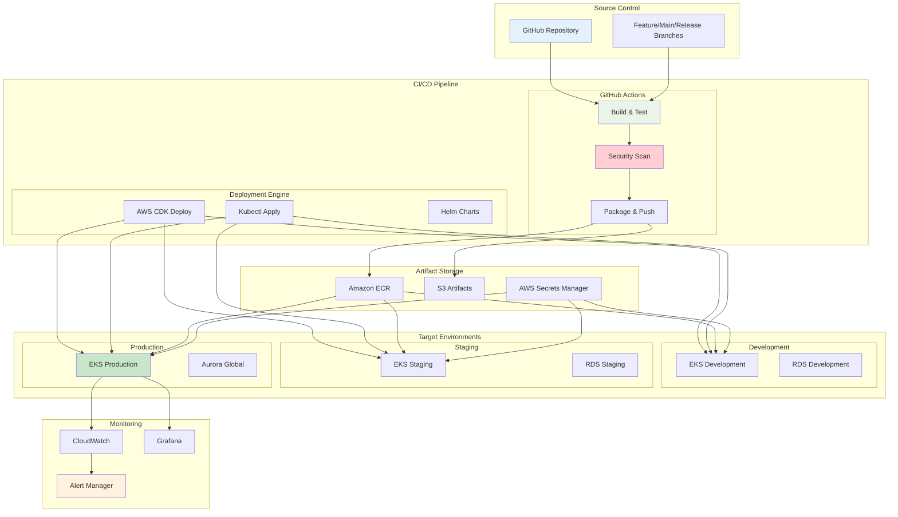
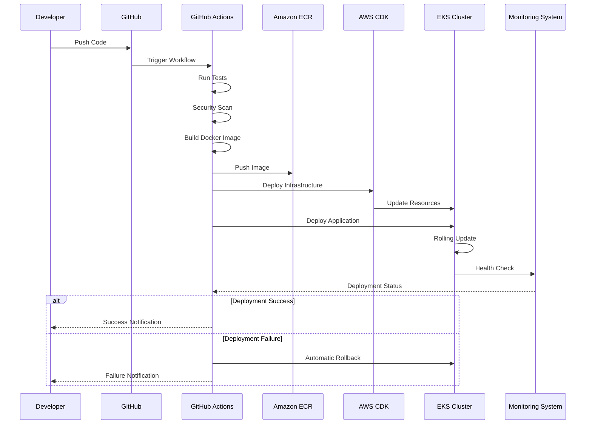
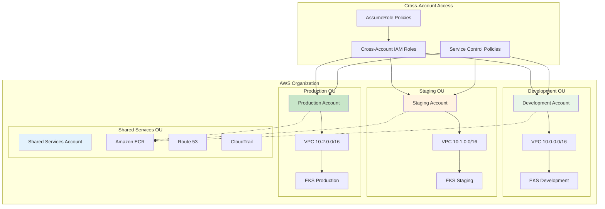

# Deployment Viewpoint - Deployment Architecture and Process

**Document Version**: 1.0  
**Last Updated**: December 25, 2024  
**Author**: DevOps Team  
**Status**: Active

## 📋 Table of Contents

- [Overview](#overview)
- [Deployment Architecture Design](#deployment-architecture-design)
- [CI/CD Pipeline](#cicd-pipeline)
- [Environment Management](#environment-management)
- [Containerized Deployment](#containerized-deployment)
- [Infrastructure Deployment](#infrastructure-deployment)
- [Deployment Strategies](#deployment-strategies)
- [Monitoring and Rollback](#monitoring-and-rollback)

## Overview

GenAI Demo adopts modern DevOps practices to implement fully automated CI/CD pipelines. The system supports multi-environment deployment, enabling seamless delivery from development to production environments while ensuring code quality and deployment reliability.

### Deployment Objectives

- **Automation**: Fully automated CI/CD processes
- **Reliability**: Zero-downtime deployment with automatic rollback
- **Traceability**: Complete deployment history and audit trails
- **Security**: Security scanning and compliance checks
- **Efficiency**: Fast delivery, reduced time to market

## Deployment Architecture Design

### Overall Deployment Architecture



### Deployment Process Overview



## CI/CD Pipeline

### GitHub Actions Workflow

```yaml
# .github/workflows/deploy.yml
name: Deploy GenAI Demo

on:
  push:
    branches: [main, develop]
  pull_request:
    branches: [main]

env:
  AWS_REGION: ap-east-2
  ECR_REPOSITORY: genai-demo
  EKS_CLUSTER_NAME: genai-demo-production

jobs:
  test:
    runs-on: ubuntu-latest
    steps:
      - uses: actions/checkout@v4
      
      - name: Set up JDK 21
        uses: actions/setup-java@v4
        with:
          java-version: '21'
          distribution: 'temurin'
      
      - name: Cache Gradle packages
        uses: actions/cache@v3
        with:
          path: |
            ~/.gradle/caches
            ~/.gradle/wrapper
          key: ${{ runner.os }}-gradle-${{ hashFiles('**/*.gradle*', '**/gradle-wrapper.properties') }}
      
      - name: Run Tests
        run: |
          ./gradlew clean test integrationTest
          ./gradlew jacocoTestReport
      
      - name: Upload Coverage Reports
        uses: codecov/codecov-action@v3
        with:
          file: ./build/reports/jacoco/test/jacocoTestReport.xml

  security-scan:
    runs-on: ubuntu-latest
    needs: test
    steps:
      - uses: actions/checkout@v4
      
      - name: Run Trivy vulnerability scanner
        uses: aquasecurity/trivy-action@master
        with:
          scan-type: 'fs'
          scan-ref: '.'
          format: 'sarif'
          output: 'trivy-results.sarif'
      
      - name: Upload Trivy scan results
        uses: github/codeql-action/upload-sarif@v2
        with:
          sarif_file: 'trivy-results.sarif'

  build-and-push:
    runs-on: ubuntu-latest
    needs: [test, security-scan]
    outputs:
      image-tag: ${{ steps.meta.outputs.tags }}
      image-digest: ${{ steps.build.outputs.digest }}
    steps:
      - uses: actions/checkout@v4
      
      - name: Configure AWS credentials
        uses: aws-actions/configure-aws-credentials@v4
        with:
          aws-access-key-id: ${{ secrets.AWS_ACCESS_KEY_ID }}
          aws-secret-access-key: ${{ secrets.AWS_SECRET_ACCESS_KEY }}
          aws-region: ${{ env.AWS_REGION }}
      
      - name: Login to Amazon ECR
        id: login-ecr
        uses: aws-actions/amazon-ecr-login@v2
      
      - name: Extract metadata
        id: meta
        uses: docker/metadata-action@v5
        with:
          images: ${{ steps.login-ecr.outputs.registry }}/${{ env.ECR_REPOSITORY }}
          tags: |
            type=ref,event=branch
            type=ref,event=pr
            type=sha,prefix={{branch}}-
            type=raw,value=latest,enable={{is_default_branch}}
      
      - name: Build and push Docker image
        id: build
        uses: docker/build-push-action@v5
        with:
          context: .
          push: true
          tags: ${{ steps.meta.outputs.tags }}
          labels: ${{ steps.meta.outputs.labels }}
          cache-from: type=gha
          cache-to: type=gha,mode=max

  deploy-infrastructure:
    runs-on: ubuntu-latest
    needs: build-and-push
    if: github.ref == 'refs/heads/main'
    steps:
      - uses: actions/checkout@v4
      
      - name: Setup Node.js
        uses: actions/setup-node@v4
        with:
          node-version: '18'
          cache: 'npm'
          cache-dependency-path: infrastructure/package-lock.json
      
      - name: Configure AWS credentials
        uses: aws-actions/configure-aws-credentials@v4
        with:
          aws-access-key-id: ${{ secrets.AWS_ACCESS_KEY_ID }}
          aws-secret-access-key: ${{ secrets.AWS_SECRET_ACCESS_KEY }}
          aws-region: ${{ env.AWS_REGION }}
      
      - name: Install CDK dependencies
        working-directory: infrastructure
        run: npm ci
      
      - name: Deploy Infrastructure
        working-directory: infrastructure
        run: |
          npm run build
          npx cdk deploy --all --require-approval never
        env:
          CDK_DEFAULT_ACCOUNT: ${{ secrets.AWS_ACCOUNT_ID }}
          CDK_DEFAULT_REGION: ${{ env.AWS_REGION }}

  deploy-application:
    runs-on: ubuntu-latest
    needs: [build-and-push, deploy-infrastructure]
    if: github.ref == 'refs/heads/main'
    steps:
      - uses: actions/checkout@v4
      
      - name: Configure AWS credentials
        uses: aws-actions/configure-aws-credentials@v4
        with:
          aws-access-key-id: ${{ secrets.AWS_ACCESS_KEY_ID }}
          aws-secret-access-key: ${{ secrets.AWS_SECRET_ACCESS_KEY }}
          aws-region: ${{ env.AWS_REGION }}
      
      - name: Update kubeconfig
        run: |
          aws eks update-kubeconfig --region ${{ env.AWS_REGION }} --name ${{ env.EKS_CLUSTER_NAME }}
      
      - name: Deploy to EKS
        run: |
          # Update deployment with new image
          kubectl set image deployment/genai-demo-app \
            genai-demo-app=${{ needs.build-and-push.outputs.image-tag }} \
            --namespace=default
          
          # Wait for rollout to complete
          kubectl rollout status deployment/genai-demo-app --namespace=default --timeout=600s
      
      - name: Verify deployment
        run: |
          # Check pod status
          kubectl get pods -l app=genai-demo-app --namespace=default
          
          # Check service endpoints
          kubectl get endpoints genai-demo-service --namespace=default
          
          # Run health check
          kubectl exec -it deployment/genai-demo-app -- curl -f http://localhost:8080/actuator/health

  notify:
    runs-on: ubuntu-latest
    needs: [deploy-application]
    if: always()
    steps:
      - name: Notify Slack
        uses: 8398a7/action-slack@v3
        with:
          status: ${{ job.status }}
          channel: '#deployments'
          webhook_url: ${{ secrets.SLACK_WEBHOOK }}
        env:
          SLACK_WEBHOOK_URL: ${{ secrets.SLACK_WEBHOOK }}
```

### Branch Strategy and Deployment Flow

```mermaid
gitgraph
    commit id: "Initial"
    
    branch develop
    checkout develop
    commit id: "Feature A"
    commit id: "Feature B"
    
    branch feature/new-api
    checkout feature/new-api
    commit id: "API Dev"
    commit id: "API Test"
    
    checkout develop
    merge feature/new-api
    commit id: "Integration"
    
    checkout main
    merge develop
    commit id: "Release v1.2.0"
    
    branch hotfix/critical-bug
    checkout hotfix/critical-bug
    commit id: "Bug Fix"
    
    checkout main
    merge hotfix/critical-bug
    commit id: "Hotfix v1.2.1"
    
    checkout develop
    merge main
```

### Deployment Trigger Conditions

```yaml
Deployment Trigger Rules:
  Development Environment:
    Trigger Conditions:
      - Push to develop branch
      - Pull request to develop
    Auto Deploy: Yes
    Approval Required: No
    
  Staging Environment:
    Trigger Conditions:
      - Push to main branch
      - Manual trigger
    Auto Deploy: Yes
    Approval Required: No
    
  Production Environment:
    Trigger Conditions:
      - Git tag (v*.*.*)
      - Manual trigger with approval
    Auto Deploy: No
    Approval Required: Yes
    Approvers: Tech Lead + DevOps Lead

Pre-deployment Checks:
  Must Pass:
    - All unit tests
    - Integration tests
    - Security scan
    - Code coverage > 80%
    - SonarQube quality gate
    
  Optional Checks:
    - Performance tests
    - E2E tests
    - Load tests
```

## Environment Management

### Environment Configuration Matrix

```yaml
Environment Configuration:
  Development:
    AWS Account: dev-account
    Region: ap-east-2
    EKS Cluster: genai-demo-dev
    Node Count: 1-2
    Instance Type: t3.small
    RDS Instance: t3.micro
    Auto Scaling: Disabled
    Monitoring: Basic
    Backup: None
    
  Staging:
    AWS Account: staging-account
    Region: ap-east-2
    EKS Cluster: genai-demo-staging
    Node Count: 2-4
    Instance Type: t3.medium
    RDS Instance: t3.small
    Auto Scaling: Enabled
    Monitoring: Full
    Backup: 7 days
    
  Production:
    AWS Account: prod-account
    Region: ap-east-2, ap-northeast-1
    EKS Cluster: genai-demo-prod
    Node Count: 3-10
    Instance Type: t3.large, m5.large
    RDS Instance: r6g.large (Aurora Global)
    Auto Scaling: Enabled
    Monitoring: Full + Alerting
    Backup: 30 days
```

### Environment Isolation Strategy



## Containerized Deployment

### Docker Image Build

```dockerfile
# Dockerfile
FROM openjdk:21-jdk-slim as builder

WORKDIR /app
COPY gradle/ gradle/
COPY gradlew build.gradle settings.gradle ./
COPY src/ src/

# Build application
RUN ./gradlew clean build -x test

# Runtime stage
FROM openjdk:21-jre-slim

# Install required packages
RUN apt-get update && apt-get install -y \
    curl \
    jq \
    && rm -rf /var/lib/apt/lists/*

# Create non-root user
RUN groupadd -r appuser && useradd -r -g appuser appuser

WORKDIR /app

# Copy application jar
COPY --from=builder /app/build/libs/*.jar app.jar

# Copy configuration files
COPY --from=builder /app/src/main/resources/application*.yml ./config/

# Set ownership
RUN chown -R appuser:appuser /app

USER appuser

# Health check
HEALTHCHECK --interval=30s --timeout=10s --start-period=60s --retries=3 \
    CMD curl -f http://localhost:8080/actuator/health || exit 1

EXPOSE 8080

ENTRYPOINT ["java", "-jar", "app.jar"]
```

### Kubernetes Deployment Configuration

```yaml
# k8s/deployment.yaml
apiVersion: apps/v1
kind: Deployment
metadata:
  name: genai-demo-app
  namespace: default
  labels:
    app: genai-demo-app
    version: v1
spec:
  replicas: 3
  strategy:
    type: RollingUpdate
    rollingUpdate:
      maxSurge: 1
      maxUnavailable: 0
  selector:
    matchLabels:
      app: genai-demo-app
  template:
    metadata:
      labels:
        app: genai-demo-app
        version: v1
      annotations:
        prometheus.io/scrape: "true"
        prometheus.io/port: "8080"
        prometheus.io/path: "/actuator/prometheus"
    spec:
      serviceAccountName: genai-demo-app
      securityContext:
        runAsNonRoot: true
        runAsUser: 1000
        fsGroup: 1000
      containers:
      - name: genai-demo-app
        image: ACCOUNT.dkr.ecr.ap-east-2.amazonaws.com/genai-demo:latest
        imagePullPolicy: Always
        ports:
        - containerPort: 8080
          name: http
        env:
        - name: SPRING_PROFILES_ACTIVE
          value: "production"
        - name: AWS_REGION
          value: "ap-east-2"
        - name: JAVA_OPTS
          value: "-Xmx512m -Xms256m -XX:+UseG1GC"
        resources:
          requests:
            memory: "256Mi"
            cpu: "100m"
          limits:
            memory: "512Mi"
            cpu: "500m"
        livenessProbe:
          httpGet:
            path: /actuator/health/liveness
            port: 8080
          initialDelaySeconds: 60
          periodSeconds: 30
          timeoutSeconds: 10
          failureThreshold: 3
        readinessProbe:
          httpGet:
            path: /actuator/health/readiness
            port: 8080
          initialDelaySeconds: 30
          periodSeconds: 10
          timeoutSeconds: 5
          failureThreshold: 3
        volumeMounts:
        - name: config
          mountPath: /app/config
          readOnly: true
        - name: tmp
          mountPath: /tmp
      volumes:
      - name: config
        configMap:
          name: genai-demo-config
      - name: tmp
        emptyDir: {}
      nodeSelector:
        kubernetes.io/arch: amd64
      tolerations:
      - key: "node.kubernetes.io/not-ready"
        operator: "Exists"
        effect: "NoExecute"
        tolerationSeconds: 300
      - key: "node.kubernetes.io/unreachable"
        operator: "Exists"
        effect: "NoExecute"
        tolerationSeconds: 300

---
apiVersion: v1
kind: Service
metadata:
  name: genai-demo-service
  namespace: default
  labels:
    app: genai-demo-app
spec:
  type: ClusterIP
  ports:
  - port: 80
    targetPort: 8080
    protocol: TCP
    name: http
  selector:
    app: genai-demo-app

---
apiVersion: v1
kind: ConfigMap
metadata:
  name: genai-demo-config
  namespace: default
data:
  application-production.yml: |
    server:
      port: 8080
    spring:
      datasource:
        url: jdbc:postgresql://genai-demo-prod.cluster-xxx.ap-east-2.rds.amazonaws.com:5432/genaidemo
        username: ${DB_USERNAME}
        password: ${DB_PASSWORD}
      redis:
        host: genai-demo-prod.xxx.cache.amazonaws.com
        port: 6379
    management:
      endpoints:
        web:
          exposure:
            include: health,info,metrics,prometheus
      endpoint:
        health:
          show-details: always
```

---

**Document Status**: ✅ Complete  
**Related Documents**: 
- [Infrastructure Viewpoint](../infrastructure/aws-resource-architecture.md)
- [Security Viewpoint](../security/iam-permissions-architecture.md)
- [Operational Viewpoint](../operational/dns-disaster-recovery.md)

---

**Document Version**: v1.0  
**Last Updated**: December 2024  
**Responsible Team**: DevOps Team  
**Review Status**: Reviewed
