# Deployment Viewpoint - 部署架構與流程

**文件版本**: 1.0  
**最後更新**: 2025年9月24日 下午5:15 (台北時間)  
**作者**: DevOps Team  
**狀態**: Active

## 📋 目錄

- [概覽](#概覽)
- [部署架構設計](#部署架構設計)
- [CI/CD 流水線](#cicd-流水線)
- [環境管理](#環境管理)
- [容器化部署](#容器化部署)
- [基礎設施部署](#基礎設施部署)
- [部署策略](#部署策略)
- [監控與回滾](#監控與回滾)

## 概覽

GenAI Demo 採用現代化的 DevOps 實踐，實現全自動化的 CI/CD 流水線。系統支援多環境部署，從開發環境到生產環境的無縫交付，確保代碼品質和部署可靠性。

### 部署目標

- **自動化**: 完全自動化的 CI/CD 流程
- **可靠性**: 零停機部署，自動回滾
- **可追溯性**: 完整的部署歷史和審計
- **安全性**: 安全掃描和合規檢查
- **效率**: 快速交付，縮短上市時間

## 部署架構設計

### 整體部署架構


### 部署流程概覽


## CI/CD 流水線

### GitHub Actions 工作流程

```yaml
# .github/workflows/deploy.yml
name: Deploy GenAI Demo

on:
  push:
    branches: [main, develop]
  pull_request:
    branches: [main]

env:
  AWS_REGION: ap-east-2
  ECR_REPOSITORY: genai-demo
  EKS_CLUSTER_NAME: genai-demo-production

jobs:
  test:
    runs-on: ubuntu-latest
    steps:
      - uses: actions/checkout@v4
      
      - name: Set up JDK 21
        uses: actions/setup-java@v4
        with:
          java-version: '21'
          distribution: 'temurin'
      
      - name: Cache Gradle packages
        uses: actions/cache@v3
        with:
          path: |
            ~/.gradle/caches
            ~/.gradle/wrapper
          key: ${{ runner.os }}-gradle-${{ hashFiles('**/*.gradle*', '**/gradle-wrapper.properties') }}
      
      - name: Run Tests
        run: |
          ./gradlew clean test integrationTest
          ./gradlew jacocoTestReport
      
      - name: Upload Coverage Reports
        uses: codecov/codecov-action@v3
        with:
          file: ./build/reports/jacoco/test/jacocoTestReport.xml

  security-scan:
    runs-on: ubuntu-latest
    needs: test
    steps:
      - uses: actions/checkout@v4
      
      - name: Run Trivy vulnerability scanner
        uses: aquasecurity/trivy-action@master
        with:
          scan-type: 'fs'
          scan-ref: '.'
          format: 'sarif'
          output: 'trivy-results.sarif'
      
      - name: Upload Trivy scan results
        uses: github/codeql-action/upload-sarif@v2
        with:
          sarif_file: 'trivy-results.sarif'

  build-and-push:
    runs-on: ubuntu-latest
    needs: [test, security-scan]
    outputs:
      image-tag: ${{ steps.meta.outputs.tags }}
      image-digest: ${{ steps.build.outputs.digest }}
    steps:
      - uses: actions/checkout@v4
      
      - name: Configure AWS credentials
        uses: aws-actions/configure-aws-credentials@v4
        with:
          aws-access-key-id: ${{ secrets.AWS_ACCESS_KEY_ID }}
          aws-secret-access-key: ${{ secrets.AWS_SECRET_ACCESS_KEY }}
          aws-region: ${{ env.AWS_REGION }}
      
      - name: Login to Amazon ECR
        id: login-ecr
        uses: aws-actions/amazon-ecr-login@v2
      
      - name: Extract metadata
        id: meta
        uses: docker/metadata-action@v5
        with:
          images: ${{ steps.login-ecr.outputs.registry }}/${{ env.ECR_REPOSITORY }}
          tags: |
            type=ref,event=branch
            type=ref,event=pr
            type=sha,prefix={{branch}}-
            type=raw,value=latest,enable={{is_default_branch}}
      
      - name: Build and push Docker image
        id: build
        uses: docker/build-push-action@v5
        with:
          context: .
          push: true
          tags: ${{ steps.meta.outputs.tags }}
          labels: ${{ steps.meta.outputs.labels }}
          cache-from: type=gha
          cache-to: type=gha,mode=max

  deploy-infrastructure:
    runs-on: ubuntu-latest
    needs: build-and-push
    if: github.ref == 'refs/heads/main'
    steps:
      - uses: actions/checkout@v4
      
      - name: Setup Node.js
        uses: actions/setup-node@v4
        with:
          node-version: '18'
          cache: 'npm'
          cache-dependency-path: infrastructure/package-lock.json
      
      - name: Configure AWS credentials
        uses: aws-actions/configure-aws-credentials@v4
        with:
          aws-access-key-id: ${{ secrets.AWS_ACCESS_KEY_ID }}
          aws-secret-access-key: ${{ secrets.AWS_SECRET_ACCESS_KEY }}
          aws-region: ${{ env.AWS_REGION }}
      
      - name: Install CDK dependencies
        working-directory: infrastructure
        run: npm ci
      
      - name: Deploy Infrastructure
        working-directory: infrastructure
        run: |
          npm run build
          npx cdk deploy --all --require-approval never
        env:
          CDK_DEFAULT_ACCOUNT: ${{ secrets.AWS_ACCOUNT_ID }}
          CDK_DEFAULT_REGION: ${{ env.AWS_REGION }}

  deploy-application:
    runs-on: ubuntu-latest
    needs: [build-and-push, deploy-infrastructure]
    if: github.ref == 'refs/heads/main'
    steps:
      - uses: actions/checkout@v4
      
      - name: Configure AWS credentials
        uses: aws-actions/configure-aws-credentials@v4
        with:
          aws-access-key-id: ${{ secrets.AWS_ACCESS_KEY_ID }}
          aws-secret-access-key: ${{ secrets.AWS_SECRET_ACCESS_KEY }}
          aws-region: ${{ env.AWS_REGION }}
      
      - name: Update kubeconfig
        run: |
          aws eks update-kubeconfig --region ${{ env.AWS_REGION }} --name ${{ env.EKS_CLUSTER_NAME }}
      
      - name: Deploy to EKS
        run: |
          # Update deployment with new image
          kubectl set image deployment/genai-demo-app \
            genai-demo-app=${{ needs.build-and-push.outputs.image-tag }} \
            --namespace=default
          
          # Wait for rollout to complete
          kubectl rollout status deployment/genai-demo-app --namespace=default --timeout=600s
      
      - name: Verify deployment
        run: |
          # Check pod status
          kubectl get pods -l app=genai-demo-app --namespace=default
          
          # Check service endpoints
          kubectl get endpoints genai-demo-service --namespace=default
          
          # Run health check
          kubectl exec -it deployment/genai-demo-app -- curl -f http://localhost:8080/actuator/health

  notify:
    runs-on: ubuntu-latest
    needs: [deploy-application]
    if: always()
    steps:
      - name: Notify Slack
        uses: 8398a7/action-slack@v3
        with:
          status: ${{ job.status }}
          channel: '#deployments'
          webhook_url: ${{ secrets.SLACK_WEBHOOK }}
        env:
          SLACK_WEBHOOK_URL: ${{ secrets.SLACK_WEBHOOK }}
```

### 分支策略與部署流程

```mermaid
gitgraph
    commit id: "Initial"
    
    branch develop
    checkout develop
    commit id: "Feature A"
    commit id: "Feature B"
    
    branch feature/new-api
    checkout feature/new-api
    commit id: "API Dev"
    commit id: "API Test"
    
    checkout develop
    merge feature/new-api
    commit id: "Integration"
    
    checkout main
    merge develop
    commit id: "Release v1.2.0"
    
    branch hotfix/critical-bug
    checkout hotfix/critical-bug
    commit id: "Bug Fix"
    
    checkout main
    merge hotfix/critical-bug
    commit id: "Hotfix v1.2.1"
    
    checkout develop
    merge main
```

### 部署觸發條件

```yaml
部署觸發規則:
  Development 環境:
    觸發條件:
      - Push to develop branch
      - Pull request to develop
    自動部署: 是
    需要審批: 否
    
  Staging 環境:
    觸發條件:
      - Push to main branch
      - Manual trigger
    自動部署: 是
    需要審批: 否
    
  Production 環境:
    觸發條件:
      - Git tag (v*.*.*)
      - Manual trigger with approval
    自動部署: 否
    需要審批: 是
    審批者: Tech Lead + DevOps Lead

部署前檢查:
  必須通過:
    - 所有單元測試
    - 整合測試
    - 安全掃描
    - 程式碼覆蓋率 > 80%
    - SonarQube 品質門檻
    
  可選檢查:
    - 效能測試
    - E2E 測試
    - 負載測試
```

## 環境管理

### 環境配置矩陣

```yaml
環境配置:
  Development:
    AWS Account: dev-account
    Region: ap-east-2
    EKS Cluster: genai-demo-dev
    Node Count: 1-2
    Instance Type: t3.small
    RDS Instance: t3.micro
    Auto Scaling: 關閉
    Monitoring: 基本
    Backup: 無
    
  Staging:
    AWS Account: staging-account
    Region: ap-east-2
    EKS Cluster: genai-demo-staging
    Node Count: 2-4
    Instance Type: t3.medium
    RDS Instance: t3.small
    Auto Scaling: 啟用
    Monitoring: 完整
    Backup: 7天
    
  Production:
    AWS Account: prod-account
    Region: ap-east-2, ap-northeast-1
    EKS Cluster: genai-demo-prod
    Node Count: 3-10
    Instance Type: t3.large, m5.large
    RDS Instance: r6g.large (Aurora Global)
    Auto Scaling: 啟用
    Monitoring: 完整 + 告警
    Backup: 30天
```

### 環境隔離策略


## 容器化部署

### Docker 映像建構

```dockerfile
# Dockerfile
FROM openjdk:21-jdk-slim as builder

WORKDIR /app
COPY gradle/ gradle/
COPY gradlew build.gradle settings.gradle ./
COPY src/ src/

# Build application
RUN ./gradlew clean build -x test

# Runtime stage
FROM openjdk:21-jre-slim

# Install required packages
RUN apt-get update && apt-get install -y \
    curl \
    jq \
    && rm -rf /var/lib/apt/lists/*

# Create non-root user
RUN groupadd -r appuser && useradd -r -g appuser appuser

WORKDIR /app

# Copy application jar
COPY --from=builder /app/build/libs/*.jar app.jar

# Copy configuration files
COPY --from=builder /app/src/main/resources/application*.yml ./config/

# Set ownership
RUN chown -R appuser:appuser /app

USER appuser

# Health check
HEALTHCHECK --interval=30s --timeout=10s --start-period=60s --retries=3 \
    CMD curl -f http://localhost:8080/actuator/health || exit 1

EXPOSE 8080

ENTRYPOINT ["java", "-jar", "app.jar"]
```

### Kubernetes 部署配置

```yaml
# k8s/deployment.yaml
apiVersion: apps/v1
kind: Deployment
metadata:
  name: genai-demo-app
  namespace: default
  labels:
    app: genai-demo-app
    version: v1
spec:
  replicas: 3
  strategy:
    type: RollingUpdate
    rollingUpdate:
      maxSurge: 1
      maxUnavailable: 0
  selector:
    matchLabels:
      app: genai-demo-app
  template:
    metadata:
      labels:
        app: genai-demo-app
        version: v1
      annotations:
        prometheus.io/scrape: "true"
        prometheus.io/port: "8080"
        prometheus.io/path: "/actuator/prometheus"
    spec:
      serviceAccountName: genai-demo-app
      securityContext:
        runAsNonRoot: true
        runAsUser: 1000
        fsGroup: 1000
      containers:
      - name: genai-demo-app
        image: ACCOUNT.dkr.ecr.ap-east-2.amazonaws.com/genai-demo:latest
        imagePullPolicy: Always
        ports:
        - containerPort: 8080
          name: http
        env:
        - name: SPRING_PROFILES_ACTIVE
          value: "production"
        - name: AWS_REGION
          value: "ap-east-2"
        - name: JAVA_OPTS
          value: "-Xmx512m -Xms256m -XX:+UseG1GC"
        resources:
          requests:
            memory: "256Mi"
            cpu: "100m"
          limits:
            memory: "512Mi"
            cpu: "500m"
        livenessProbe:
          httpGet:
            path: /actuator/health/liveness
            port: 8080
          initialDelaySeconds: 60
          periodSeconds: 30
          timeoutSeconds: 10
          failureThreshold: 3
        readinessProbe:
          httpGet:
            path: /actuator/health/readiness
            port: 8080
          initialDelaySeconds: 30
          periodSeconds: 10
          timeoutSeconds: 5
          failureThreshold: 3
        volumeMounts:
        - name: config
          mountPath: /app/config
          readOnly: true
        - name: tmp
          mountPath: /tmp
      volumes:
      - name: config
        configMap:
          name: genai-demo-config
      - name: tmp
        emptyDir: {}
      nodeSelector:
        kubernetes.io/arch: amd64
      tolerations:
      - key: "node.kubernetes.io/not-ready"
        operator: "Exists"
        effect: "NoExecute"
        tolerationSeconds: 300
      - key: "node.kubernetes.io/unreachable"
        operator: "Exists"
        effect: "NoExecute"
        tolerationSeconds: 300

---
apiVersion: v1
kind: Service
metadata:
  name: genai-demo-service
  namespace: default
  labels:
    app: genai-demo-app
spec:
  type: ClusterIP
  ports:
  - port: 80
    targetPort: 8080
    protocol: TCP
    name: http
  selector:
    app: genai-demo-app

---
apiVersion: v1
kind: ConfigMap
metadata:
  name: genai-demo-config
  namespace: default
data:
  application-production.yml: |
    server:
      port: 8080
    spring:
      datasource:
        url: jdbc:postgresql://genai-demo-prod.cluster-xxx.ap-east-2.rds.amazonaws.com:5432/genaidemo
        username: ${DB_USERNAME}
        password: ${DB_PASSWORD}
      redis:
        host: genai-demo-prod.xxx.cache.amazonaws.com
        port: 6379
    management:
      endpoints:
        web:
          exposure:
            include: health,info,metrics,prometheus
      endpoint:
        health:
          show-details: always
```

## 基礎設施部署

### CDK 部署流程

```typescript
// infrastructure/bin/app.ts
import * as cdk from 'aws-cdk-lib';
import { NetworkStack } from '../src/stacks/network-stack';
import { EKSStack } from '../src/stacks/eks-stack';
import { RdsStack } from '../src/stacks/rds-stack';
import { ObservabilityStack } from '../src/stacks/observability-stack';

const app = new cdk.App();

// Get environment configuration
const environment = app.node.tryGetContext('environment') || 'development';
const region = app.node.tryGetContext('region') || 'ap-east-2';
const account = app.node.tryGetContext('account');

const stackProps: cdk.StackProps = {
  env: {
    account: account,
    region: region,
  },
  tags: {
    Environment: environment,
    Project: 'genai-demo',
    ManagedBy: 'AWS-CDK',
  },
};

// Deploy stacks in dependency order
const networkStack = new NetworkStack(app, `GenAIDemo-Network-${environment}`, {
  ...stackProps,
  description: `Network infrastructure for GenAI Demo ${environment}`,
});

const eksStack = new EKSStack(app, `GenAIDemo-EKS-${environment}`, {
  ...stackProps,
  vpc: networkStack.vpc,
  environment: environment,
  projectName: 'genai-demo',
  description: `EKS cluster for GenAI Demo ${environment}`,
});

const rdsStack = new RdsStack(app, `GenAIDemo-RDS-${environment}`, {
  ...stackProps,
  vpc: networkStack.vpc,
  securityGroups: networkStack.securityGroups,
  environment: environment,
  description: `RDS database for GenAI Demo ${environment}`,
});

const observabilityStack = new ObservabilityStack(app, `GenAIDemo-Observability-${environment}`, {
  ...stackProps,
  vpc: networkStack.vpc,
  eksCluster: eksStack.cluster,
  environment: environment,
  description: `Observability stack for GenAI Demo ${environment}`,
});

// Add dependencies
eksStack.addDependency(networkStack);
rdsStack.addDependency(networkStack);
observabilityStack.addDependency(eksStack);
observabilityStack.addDependency(rdsStack);
```

### 基礎設施部署腳本

```bash
#!/bin/bash
# infrastructure/scripts/deploy.sh

set -e

ENVIRONMENT=${1:-development}
REGION=${2:-ap-east-2}
ACCOUNT=${3:-$(aws sts get-caller-identity --query Account --output text)}

echo "Deploying GenAI Demo infrastructure..."
echo "Environment: $ENVIRONMENT"
echo "Region: $REGION"
echo "Account: $ACCOUNT"

# Validate AWS credentials
aws sts get-caller-identity > /dev/null || {
  echo "Error: AWS credentials not configured"
  exit 1
}

# Install dependencies
echo "Installing CDK dependencies..."
npm ci

# Build TypeScript
echo "Building CDK application..."
npm run build

# Bootstrap CDK (if needed)
echo "Bootstrapping CDK..."
npx cdk bootstrap aws://$ACCOUNT/$REGION

# Deploy stacks
echo "Deploying infrastructure stacks..."
npx cdk deploy \
  --context environment=$ENVIRONMENT \
  --context region=$REGION \
  --context account=$ACCOUNT \
  --all \
  --require-approval never \
  --progress events

echo "Infrastructure deployment completed successfully!"

# Output important information
echo "Getting cluster information..."
aws eks describe-cluster \
  --region $REGION \
  --name genai-demo-$ENVIRONMENT \
  --query 'cluster.{Name:name,Status:status,Endpoint:endpoint,Version:version}' \
  --output table

echo "Updating kubeconfig..."
aws eks update-kubeconfig \
  --region $REGION \
  --name genai-demo-$ENVIRONMENT

echo "Verifying cluster access..."
kubectl get nodes
kubectl get namespaces

echo "Deployment completed successfully!"
```

## 部署策略

### 滾動更新策略

```mermaid
sequenceDiagram
    participant LB as Load Balancer
    participant Pod1 as Pod 1 (v1.0)
    participant Pod2 as Pod 2 (v1.0)
    participant Pod3 as Pod 3 (v1.0)
    participant NewPod as New Pod (v1.1)
    participant K8s as Kubernetes
    
    Note over LB,K8s: 滾動更新開始
    
    K8s->>NewPod: 創建新 Pod (v1.1)
    NewPod->>K8s: 就緒檢查通過
    K8s->>LB: 將新 Pod 加入負載均衡
    
    K8s->>Pod1: 停止接收新請求
    K8s->>Pod1: 等待現有請求完成
    K8s->>Pod1: 終止 Pod
    
    Note over LB,K8s: 重複過程直到所有 Pod 更新完成
    
    K8s->>NewPod: 創建第二個新 Pod
    K8s->>Pod2: 終止舊 Pod
    K8s->>NewPod: 創建第三個新 Pod
    K8s->>Pod3: 終止舊 Pod
    
    Note over LB,K8s: 滾動更新完成
```



### 藍綠部署策略

```yaml
藍綠部署配置:
  Blue Environment (當前生產):
    Namespace: production-blue
    Service: genai-demo-service-blue
    Ingress: api.genai-demo.kimkao.io → blue
    
  Green Environment (新版本):
    Namespace: production-green
    Service: genai-demo-service-green
    Ingress: api-green.genai-demo.kimkao.io → green
    
  切換流程:
    1. 部署新版本到 Green 環境
    2. 執行煙霧測試
    3. 執行完整測試套件
    4. 切換 DNS 記錄到 Green
    5. 監控 5 分鐘
    6. 如果正常，保留 Green，清理 Blue
    7. 如果異常，立即切換回 Blue
    
  回滾策略:
    - DNS 切換回滾: < 1 分鐘
    - 保留舊版本 24 小時
    - 自動健康檢查觸發回滾
```

### 金絲雀部署策略

```mermaid
graph TB
    subgraph "流量分配"
        Users[用戶流量 100%]
        
        subgraph "Stable Version"
            Stable[穩定版本 v1.0<br/>95% 流量]
        end
        
        subgraph "Canary Version"
            Canary[金絲雀版本 v1.1<br/>5% 流量]
        end
    end
    
    subgraph "監控指標"
        ErrorRate[錯誤率監控]
        Latency[延遲監控]
        BusinessMetrics[業務指標監控]
    end
    
    subgraph "自動決策"
        Success[成功: 增加流量到 50%]
        Failure[失敗: 立即回滾]
        Continue[繼續: 逐步增加到 100%]
    end
    
    Users --> Stable
    Users --> Canary
    Stable --> ErrorRate
    Canary --> ErrorRate
    Stable --> Latency
    Canary --> Latency
    Canary --> BusinessMetrics
    
    ErrorRate --> Success
    ErrorRate --> Failure
    Latency --> Success
    Latency --> Failure
    BusinessMetrics --> Continue
    
    style Stable fill:#c8e6c9
    style Canary fill:#fff3e0
    style Failure fill:#ffcdd2
    style Success fill:#e8f5e8
```



## 監控與回滾

### 部署監控指標

```yaml
部署健康檢查:
  技術指標:
    - Pod 就緒狀態: 100%
    - 健康檢查通過率: > 99%
    - 回應時間: < 2 秒 (95th percentile)
    - 錯誤率: < 1%
    - CPU 使用率: < 70%
    - 記憶體使用率: < 80%
    
  業務指標:
    - API 成功率: > 99.5%
    - 用戶登入成功率: > 98%
    - 訂單處理成功率: > 99%
    - 資料庫連線成功率: > 99.9%
    
  自動回滾觸發條件:
    - 錯誤率 > 5% (持續 2 分鐘)
    - 回應時間 > 10 秒 (持續 1 分鐘)
    - Pod 就緒率 < 50% (持續 3 分鐘)
    - 健康檢查失敗率 > 50% (持續 1 分鐘)
```

### 自動回滾機制

```mermaid
flowchart TD
    Deploy[部署開始] --> Monitor[監控指標]
    
    Monitor --> Check{健康檢查}
    Check -->|通過| Success[部署成功]
    Check -->|失敗| Evaluate[評估失敗原因]
    
    Evaluate --> Critical{關鍵指標失敗?}
    Critical -->|是| AutoRollback[自動回滾]
    Critical -->|否| ManualDecision[人工決策]
    
    AutoRollback --> RollbackSteps[執行回滾步驟]
    RollbackSteps --> Verify[驗證回滾]
    Verify --> Notify[通知團隊]
    
    ManualDecision --> ManualRollback[手動回滾]
    ManualDecision --> Continue[繼續監控]
    
    ManualRollback --> RollbackSteps
    Continue --> Monitor
    
    Success --> PostDeploy[部署後監控]
    PostDeploy --> Archive[歸檔舊版本]
    
    style Deploy fill:#e3f2fd
    style AutoRollback fill:#ffcdd2
    style Success fill:#c8e6c9
    style Verify fill:#e8f5e8
```



### 回滾執行腳本

```bash
#!/bin/bash
# scripts/rollback.sh

set -e

ENVIRONMENT=${1:-production}
PREVIOUS_VERSION=${2}
CLUSTER_NAME="genai-demo-${ENVIRONMENT}"

echo "Starting rollback for environment: $ENVIRONMENT"

if [ -z "$PREVIOUS_VERSION" ]; then
  echo "Getting previous version from deployment history..."
  PREVIOUS_VERSION=$(kubectl rollout history deployment/genai-demo-app \
    --namespace=default \
    | tail -2 | head -1 | awk '{print $1}')
fi

echo "Rolling back to version: $PREVIOUS_VERSION"

# Execute rollback
kubectl rollout undo deployment/genai-demo-app \
  --namespace=default \
  --to-revision=$PREVIOUS_VERSION

# Wait for rollback to complete
echo "Waiting for rollback to complete..."
kubectl rollout status deployment/genai-demo-app \
  --namespace=default \
  --timeout=300s

# Verify rollback
echo "Verifying rollback..."
kubectl get pods -l app=genai-demo-app --namespace=default

# Health check
echo "Performing health check..."
for i in {1..10}; do
  if kubectl exec deployment/genai-demo-app -- curl -f http://localhost:8080/actuator/health; then
    echo "Health check passed"
    break
  else
    echo "Health check failed, retrying in 10 seconds..."
    sleep 10
  fi
done

# Notify team
echo "Rollback completed successfully"
echo "Sending notification..."

# Send Slack notification
curl -X POST -H 'Content-type: application/json' \
  --data "{\"text\":\"🔄 Rollback completed for $ENVIRONMENT environment to version $PREVIOUS_VERSION\"}" \
  $SLACK_WEBHOOK_URL

echo "Rollback process completed!"
```

---

**文件狀態**: ✅ 完成  
**相關文件**: 
- [Infrastructure Viewpoint](../infrastructure/aws-resource-architecture.md)
- [Security Viewpoint](../security/iam-permissions-architecture.md)
- [Operational Viewpoint](../operational/dns-disaster-recovery.md)
