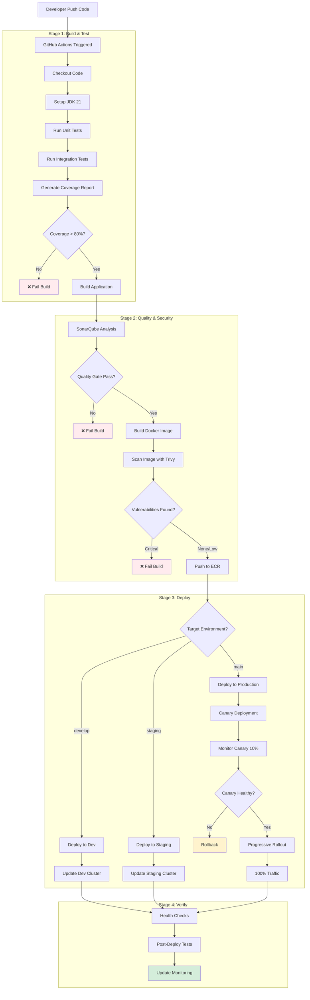

# Deployment Process

> **Viewpoint**: Deployment  
> **Purpose**: Document CI/CD pipeline and deployment strategies  
> **Audience**: Architects, DevOps Engineers, Developers, Operations Team

## Overview

This document describes the continuous integration and continuous deployment (CI/CD) pipeline for the E-Commerce Platform, including build processes, testing strategies, and deployment procedures.

## CI/CD Pipeline Architecture

### Pipeline Stages



### Pipeline Tools

| Stage | Tool | Purpose |
|-------|------|---------|
| **Source Control** | GitHub | Version control and collaboration |
| **CI/CD Orchestration** | GitHub Actions | Workflow automation |
| **Build** | Gradle | Java application build |
| **Containerization** | Docker | Container image creation |
| **Registry** | Amazon ECR | Container image storage |
| **Testing** | JUnit, Cucumber | Unit and integration testing |
| **Code Quality** | SonarQube | Static code analysis |
| **Security Scanning** | Trivy, Snyk | Vulnerability scanning |
| **Deployment** | Helm, kubectl | Kubernetes deployment |
| **GitOps** | ArgoCD (optional) | Declarative deployment |
| **Monitoring** | CloudWatch, Prometheus | Post-deployment monitoring |

## GitHub Actions Workflow

### Main Workflow File

**Location**: `.github/workflows/ci-cd.yml`

```yaml
name: CI/CD Pipeline

on:
  push:
    branches: [develop, staging, main]
  pull_request:
    branches: [develop, staging, main]

env:
  AWS_REGION: us-east-1
  ECR_REGISTRY: ${{ secrets.ECR_REGISTRY }}
  EKS_CLUSTER_NAME: ecommerce-platform-prod

jobs:
  # Stage 1: Build and Test
  build-and-test:
    runs-on: ubuntu-latest
    steps:

      - name: Checkout code

        uses: actions/checkout@v3
      
      - name: Set up JDK 21

        uses: actions/setup-java@v3
        with:
          java-version: '21'
          distribution: 'temurin'
          cache: 'gradle'
      
      - name: Run unit tests

        run: ./gradlew test
      
      - name: Run integration tests

        run: ./gradlew integrationTest
      
      - name: Generate test coverage report

        run: ./gradlew jacocoTestReport
      
      - name: Upload coverage to Codecov

        uses: codecov/codecov-action@v3
        with:
          files: ./build/reports/jacoco/test/jacocoTestReport.xml
      
      - name: Build application

        run: ./gradlew build -x test
      
      - name: Archive build artifacts

        uses: actions/upload-artifact@v3
        with:
          name: build-artifacts
          path: build/libs/*.jar

  # Stage 2: Code Quality and Security
  code-quality:
    runs-on: ubuntu-latest
    needs: build-and-test
    steps:

      - name: Checkout code

        uses: actions/checkout@v3
      
      - name: SonarQube Scan

        uses: sonarsource/sonarqube-scan-action@master
        env:
          SONAR_TOKEN: ${{ secrets.SONAR_TOKEN }}
          SONAR_HOST_URL: ${{ secrets.SONAR_HOST_URL }}
      
      - name: Check Quality Gate

        uses: sonarsource/sonarqube-quality-gate-action@master
        timeout-minutes: 5
        env:
          SONAR_TOKEN: ${{ secrets.SONAR_TOKEN }}

  security-scan:
    runs-on: ubuntu-latest
    needs: build-and-test
    steps:

      - name: Checkout code

        uses: actions/checkout@v3
      
      - name: Run Snyk security scan

        uses: snyk/actions/gradle@master
        env:
          SNYK_TOKEN: ${{ secrets.SNYK_TOKEN }}
      
      - name: Build Docker image

        run: docker build -t temp-image:${{ github.sha }} .
      
      - name: Run Trivy vulnerability scanner

        uses: aquasecurity/trivy-action@master
        with:
          image-ref: temp-image:${{ github.sha }}
          format: 'sarif'
          output: 'trivy-results.sarif'
      
      - name: Upload Trivy results to GitHub Security

        uses: github/codeql-action/upload-sarif@v2
        with:
          sarif_file: 'trivy-results.sarif'

  # Stage 3: Build and Push Docker Image
  build-image:
    runs-on: ubuntu-latest
    needs: [code-quality, security-scan]
    if: github.event_name == 'push'
    outputs:
      image-tag: ${{ steps.meta.outputs.tags }}
    steps:

      - name: Checkout code

        uses: actions/checkout@v3
      
      - name: Download build artifacts

        uses: actions/download-artifact@v3
        with:
          name: build-artifacts
          path: build/libs
      
      - name: Configure AWS credentials

        uses: aws-actions/configure-aws-credentials@v2
        with:
          aws-access-key-id: ${{ secrets.AWS_ACCESS_KEY_ID }}
          aws-secret-access-key: ${{ secrets.AWS_SECRET_ACCESS_KEY }}
          aws-region: ${{ env.AWS_REGION }}
      
      - name: Login to Amazon ECR

        id: login-ecr
        uses: aws-actions/amazon-ecr-login@v1
      
      - name: Extract metadata for Docker

        id: meta
        uses: docker/metadata-action@v4
        with:
          images: ${{ env.ECR_REGISTRY }}/ecommerce-platform
          tags: |
            type=ref,event=branch
            type=sha,prefix={{branch}}-
            type=semver,pattern={{version}}
      
      - name: Build and push Docker image

        uses: docker/build-push-action@v4
        with:
          context: .
          push: true
          tags: ${{ steps.meta.outputs.tags }}
          labels: ${{ steps.meta.outputs.labels }}
          cache-from: type=gha
          cache-to: type=gha,mode=max

  # Stage 4: Deploy to Development
  deploy-dev:
    runs-on: ubuntu-latest
    needs: build-image
    if: github.ref == 'refs/heads/develop'
    environment:
      name: development
      url: https://dev.ecommerce-platform.com
    steps:

      - name: Checkout code

        uses: actions/checkout@v3
      
      - name: Configure AWS credentials

        uses: aws-actions/configure-aws-credentials@v2
        with:
          aws-access-key-id: ${{ secrets.AWS_ACCESS_KEY_ID }}
          aws-secret-access-key: ${{ secrets.AWS_SECRET_ACCESS_KEY }}
          aws-region: ${{ env.AWS_REGION }}
      
      - name: Update kubeconfig

        run: |
          aws eks update-kubeconfig --name ecommerce-platform-dev --region ${{ env.AWS_REGION }}
      
      - name: Deploy to Development

        run: |
          helm upgrade --install ecommerce-platform ./helm/ecommerce-platform \
            --namespace development \
            --set image.tag=${{ needs.build-image.outputs.image-tag }} \
            --set environment=development \
            --values ./helm/values-dev.yaml \
            --wait --timeout 10m
      
      - name: Verify deployment

        run: |
          kubectl rollout status deployment/order-service -n development
          kubectl rollout status deployment/customer-service -n development

  # Stage 5: Deploy to Staging (Manual Approval)
  deploy-staging:
    runs-on: ubuntu-latest
    needs: build-image
    if: github.ref == 'refs/heads/staging'
    environment:
      name: staging
      url: https://staging.ecommerce-platform.com
    steps:

      - name: Checkout code

        uses: actions/checkout@v3
      
      - name: Configure AWS credentials

        uses: aws-actions/configure-aws-credentials@v2
        with:
          aws-access-key-id: ${{ secrets.AWS_ACCESS_KEY_ID }}
          aws-secret-access-key: ${{ secrets.AWS_SECRET_ACCESS_KEY }}
          aws-region: ${{ env.AWS_REGION }}
      
      - name: Update kubeconfig

        run: |
          aws eks update-kubeconfig --name ecommerce-platform-staging --region ${{ env.AWS_REGION }}
      
      - name: Deploy to Staging

        run: |
          helm upgrade --install ecommerce-platform ./helm/ecommerce-platform \
            --namespace staging \
            --set image.tag=${{ needs.build-image.outputs.image-tag }} \
            --set environment=staging \
            --values ./helm/values-staging.yaml \
            --wait --timeout 10m
      
      - name: Run smoke tests

        run: |
          ./scripts/smoke-tests.sh staging

  # Stage 6: Deploy to Production (Manual Approval + Canary)
  deploy-production:
    runs-on: ubuntu-latest
    needs: build-image
    if: github.ref == 'refs/heads/main'
    environment:
      name: production
      url: https://api.ecommerce-platform.com
    steps:

      - name: Checkout code

        uses: actions/checkout@v3
      
      - name: Configure AWS credentials

        uses: aws-actions/configure-aws-credentials@v2
        with:
          aws-access-key-id: ${{ secrets.AWS_ACCESS_KEY_ID }}
          aws-secret-access-key: ${{ secrets.AWS_SECRET_ACCESS_KEY }}
          aws-region: ${{ env.AWS_REGION }}
      
      - name: Update kubeconfig

        run: |
          aws eks update-kubeconfig --name ${{ env.EKS_CLUSTER_NAME }} --region ${{ env.AWS_REGION }}
      
      - name: Deploy Canary (10%)

        run: |
          helm upgrade --install ecommerce-platform-canary ./helm/ecommerce-platform \
            --namespace production \
            --set image.tag=${{ needs.build-image.outputs.image-tag }} \
            --set environment=production \
            --set canary.enabled=true \
            --set canary.weight=10 \
            --values ./helm/values-prod.yaml \
            --wait --timeout 10m
      
      - name: Monitor canary metrics

        run: |
          ./scripts/monitor-canary.sh 300  # Monitor for 5 minutes
      
      - name: Promote to full deployment

        run: |
          helm upgrade --install ecommerce-platform ./helm/ecommerce-platform \
            --namespace production \
            --set image.tag=${{ needs.build-image.outputs.image-tag }} \
            --set environment=production \
            --set canary.enabled=false \
            --values ./helm/values-prod.yaml \
            --wait --timeout 15m
      
      - name: Verify production deployment

        run: |
          kubectl rollout status deployment/order-service -n production
          kubectl rollout status deployment/customer-service -n production
      
      - name: Run production smoke tests

        run: |
          ./scripts/smoke-tests.sh production
      
      - name: Notify deployment success

        uses: 8398a7/action-slack@v3
        with:
          status: ${{ job.status }}
          text: 'Production deployment successful!'
          webhook_url: ${{ secrets.SLACK_WEBHOOK }}
```

## Deployment Strategies

### 1. Rolling Deployment (Default)

**Description**: Gradually replace old pods with new ones

**Use Case**: Standard deployments with low risk

**Configuration**:

```yaml
# Kubernetes Deployment
apiVersion: apps/v1
kind: Deployment
metadata:
  name: order-service
spec:
  replicas: 5
  strategy:
    type: RollingUpdate
    rollingUpdate:
      maxSurge: 1        # Max 1 extra pod during update
      maxUnavailable: 1  # Max 1 pod unavailable during update
  template:
    spec:
      containers:

      - name: order-service

        image: order-service:v2.0.0
        readinessProbe:
          httpGet:
            path: /actuator/health/readiness
            port: 8080
          initialDelaySeconds: 30
          periodSeconds: 5
```

**Process**:

1. Create 1 new pod with new version
2. Wait for new pod to be ready
3. Terminate 1 old pod
4. Repeat until all pods are updated

**Advantages**:

- Zero downtime
- Gradual rollout
- Automatic rollback on failure

**Disadvantages**:

- Slower deployment
- Mixed versions during rollout

### 2. Blue-Green Deployment

**Description**: Run two identical environments, switch traffic instantly

**Use Case**: Major updates requiring instant rollback capability

**Configuration**:

```yaml
# Blue Deployment (Current)
apiVersion: apps/v1
kind: Deployment
metadata:
  name: order-service-blue
  labels:
    version: blue
spec:
  replicas: 5
  selector:
    matchLabels:
      app: order-service
      version: blue

---
# Green Deployment (New)
apiVersion: apps/v1
kind: Deployment
metadata:
  name: order-service-green
  labels:
    version: green
spec:
  replicas: 5
  selector:
    matchLabels:
      app: order-service
      version: green

---
# Service (switch between blue and green)
apiVersion: v1
kind: Service
metadata:
  name: order-service
spec:
  selector:
    app: order-service
    version: blue  # Change to 'green' to switch
  ports:

  - port: 8080

```

**Process**:

1. Deploy new version to green environment
2. Test green environment thoroughly
3. Switch service selector from blue to green
4. Monitor for issues
5. Keep blue environment for quick rollback

**Advantages**:

- Instant traffic switch
- Easy rollback
- Full testing before switch

**Disadvantages**:

- Requires double resources
- Database migration complexity

### 3. Canary Deployment

**Description**: Gradually shift traffic to new version

**Use Case**: High-risk changes requiring gradual validation

**Configuration**:

```yaml
# Stable Deployment (90% traffic)
apiVersion: apps/v1
kind: Deployment
metadata:
  name: order-service-stable
spec:
  replicas: 9
  selector:
    matchLabels:
      app: order-service
      track: stable

---
# Canary Deployment (10% traffic)
apiVersion: apps/v1
kind: Deployment
metadata:
  name: order-service-canary
spec:
  replicas: 1
  selector:
    matchLabels:
      app: order-service
      track: canary

---
# Service (routes to both)
apiVersion: v1
kind: Service
metadata:
  name: order-service
spec:
  selector:
    app: order-service  # Matches both stable and canary
  ports:

  - port: 8080

```

**Process**:

1. Deploy canary with 10% traffic (1 pod)
2. Monitor metrics for 5-10 minutes
3. If successful, increase to 25% (3 pods)
4. Continue monitoring
5. Gradually increase to 100%
6. Remove stable deployment

**Advantages**:

- Gradual risk mitigation
- Real user validation
- Easy rollback at any stage

**Disadvantages**:

- Complex traffic management
- Longer deployment time
- Requires sophisticated monitoring

## Rollback Procedures

### Automatic Rollback

**Triggers**:

```yaml
# Kubernetes Deployment with automatic rollback
apiVersion: apps/v1
kind: Deployment
metadata:
  name: order-service
spec:
  progressDeadlineSeconds: 600  # 10 minutes
  minReadySeconds: 30
  strategy:
    rollingUpdate:
      maxUnavailable: 0  # No downtime
```

**Conditions**:

- Readiness probe fails for > 3 minutes
- Error rate > 5% for > 5 minutes
- Response time (p95) > 3s for > 5 minutes
- Pod crash loop detected

### Manual Rollback

**Using kubectl**:

```bash
# View deployment history
kubectl rollout history deployment/order-service -n production

# Rollback to previous version
kubectl rollout undo deployment/order-service -n production

# Rollback to specific revision
kubectl rollout undo deployment/order-service -n production --to-revision=3

# Check rollback status
kubectl rollout status deployment/order-service -n production
```

**Using Helm**:

```bash
# View release history
helm history ecommerce-platform -n production

# Rollback to previous release
helm rollback ecommerce-platform -n production

# Rollback to specific revision
helm rollback ecommerce-platform 5 -n production
```

**Rollback Time**: < 5 minutes

## Environment-Specific Configuration

### Development Environment

**Deployment Frequency**: Automatic on merge to `develop`

**Configuration**:

```yaml
# values-dev.yaml
replicaCount: 1
resources:
  requests:
    memory: "256Mi"
    cpu: "100m"
  limits:
    memory: "512Mi"
    cpu: "200m"

autoscaling:
  enabled: false

database:
  host: dev-rds.internal
  name: ecommerce_dev

redis:
  host: dev-redis.internal

kafka:
  bootstrapServers: dev-kafka.internal:9092
```

### Staging Environment

**Deployment Frequency**: Manual approval required

**Configuration**:

```yaml
# values-staging.yaml
replicaCount: 2
resources:
  requests:
    memory: "512Mi"
    cpu: "250m"
  limits:
    memory: "1Gi"
    cpu: "500m"

autoscaling:
  enabled: true
  minReplicas: 2
  maxReplicas: 5

database:
  host: staging-rds.internal
  name: ecommerce_staging

redis:
  host: staging-redis.internal

kafka:
  bootstrapServers: staging-kafka.internal:9092
```

### Production Environment

**Deployment Frequency**: Manual approval + canary deployment

**Configuration**:

```yaml
# values-prod.yaml
replicaCount: 5
resources:
  requests:
    memory: "512Mi"
    cpu: "250m"
  limits:
    memory: "1Gi"
    cpu: "500m"

autoscaling:
  enabled: true
  minReplicas: 3
  maxReplicas: 20

database:
  host: prod-rds.internal
  name: ecommerce_prod

redis:
  host: prod-redis.internal

kafka:
  bootstrapServers: prod-kafka.internal:9092

monitoring:
  enabled: true
  prometheus: true
  grafana: true

podDisruptionBudget:
  enabled: true
  minAvailable: 2
```

## Deployment Verification

### Health Checks

**Liveness Probe**:

```yaml
livenessProbe:
  httpGet:
    path: /actuator/health/liveness
    port: 8080
  initialDelaySeconds: 60
  periodSeconds: 10
  timeoutSeconds: 5
  failureThreshold: 3
```

**Readiness Probe**:

```yaml
readinessProbe:
  httpGet:
    path: /actuator/health/readiness
    port: 8080
  initialDelaySeconds: 30
  periodSeconds: 5
  timeoutSeconds: 3
  failureThreshold: 3
```

### Smoke Tests

**Script**: `scripts/smoke-tests.sh`

```bash
#!/bin/bash
ENVIRONMENT=$1
BASE_URL="https://${ENVIRONMENT}.ecommerce-platform.com"

# Test 1: Health check
echo "Testing health endpoint..."
curl -f "${BASE_URL}/actuator/health" || exit 1

# Test 2: Create order
echo "Testing order creation..."
ORDER_ID=$(curl -X POST "${BASE_URL}/api/v1/orders" \
  -H "Content-Type: application/json" \
  -d '{"customerId":"test","items":[{"productId":"p1","quantity":1}]}' \
  | jq -r '.id')

# Test 3: Retrieve order
echo "Testing order retrieval..."
curl -f "${BASE_URL}/api/v1/orders/${ORDER_ID}" || exit 1

echo "All smoke tests passed!"
```

## Monitoring Post-Deployment

### Key Metrics

**Application Metrics**:

- Request rate (requests/second)
- Error rate (%)
- Response time (p50, p95, p99)
- Active connections

**Infrastructure Metrics**:

- Pod CPU/memory usage
- Pod restart count
- Node resource utilization

**Business Metrics**:

- Order creation rate
- Payment success rate
- User login rate

### Alerts

**Critical Alerts** (immediate action):

- Error rate > 5%
- Response time (p95) > 3s
- Pod crash loop
- Database connection failures

**Warning Alerts** (investigate):

- Error rate > 1%
- Response time (p95) > 2s
- High memory usage (> 80%)
- High CPU usage (> 70%)

## Related Documentation

- [Deployment Overview](overview.md) - High-level deployment architecture
- [Physical Architecture](physical-architecture.md) - Infrastructure details
- [Operational Viewpoint](../../operational/overview.md) - Operations and monitoring

---

**Document Version**: 1.0  
**Last Updated**: 2025-10-23  
**Owner**: DevOps Team
