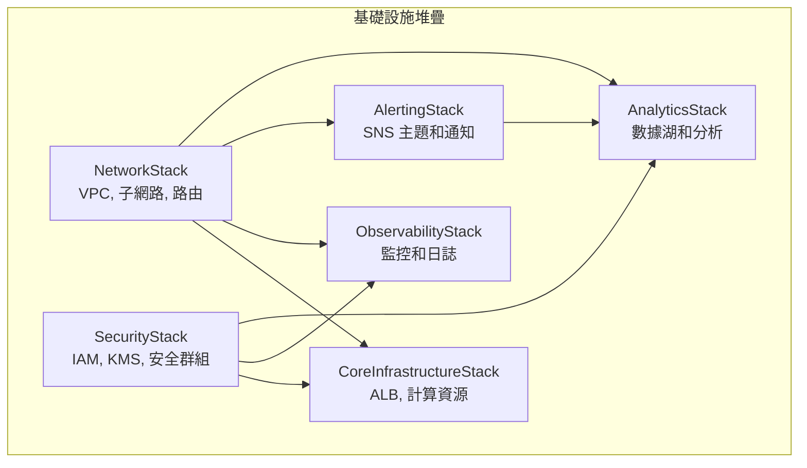

# 基礎設施即程式碼 (Infrastructure as Code)

## 概述

本專案使用 AWS CDK (Cloud Development Kit) 實現基礎設施即程式碼，提供可重複、可版本控制的基礎設施部署。

## 架構概覽

### 多堆疊架構



### 技術棧

- **CDK 版本**: 2.208.0+
- **語言**: TypeScript 5.6+
- **目標平台**: AWS
- **部署工具**: CDK CLI
- **版本控制**: Git
- **測試框架**: Jest (103 個測試)

## 堆疊詳細說明

### 1. NetworkStack - 網路基礎設施

**功能**:
- VPC 和子網路配置
- 路由表和 NAT 閘道器
- 網路 ACL 和安全群組

**資源**:
```typescript
// 主要 VPC 配置
const vpc = new ec2.Vpc(this, 'GenAIDemoVPC', {
  maxAzs: 3,
  natGateways: 1,
  subnetConfiguration: [
    {
      cidrMask: 24,
      name: 'Public',
      subnetType: ec2.SubnetType.PUBLIC,
    },
    {
      cidrMask: 24,
      name: 'Private',
      subnetType: ec2.SubnetType.PRIVATE_WITH_EGRESS,
    },
    {
      cidrMask: 28,
      name: 'Database',
      subnetType: ec2.SubnetType.PRIVATE_ISOLATED,
    },
  ],
});
```

### 2. SecurityStack - 安全配置

**功能**:
- IAM 角色和政策
- KMS 金鑰管理
- 安全群組規則

**關鍵安全配置**:
```typescript
// KMS 金鑰用於加密
const kmsKey = new kms.Key(this, 'GenAIDemoKMSKey', {
  description: 'KMS key for GenAI Demo encryption',
  enableKeyRotation: true,
});

// 應用程式服務角色
const applicationRole = new iam.Role(this, 'ApplicationRole', {
  assumedBy: new iam.ServicePrincipal('ecs-tasks.amazonaws.com'),
  managedPolicies: [
    iam.ManagedPolicy.fromAwsManagedPolicyName('service-role/AmazonECSTaskExecutionRolePolicy'),
  ],
});
```

### 3. AlertingStack - 告警基礎設施

**功能**:
- SNS 主題配置
- 多層級告警系統
- 電子郵件和 Slack 整合

**告警配置**:
```typescript
// 關鍵告警主題
const criticalAlerts = new sns.Topic(this, 'CriticalAlerts', {
  displayName: 'GenAI Demo Critical Alerts',
});

// 警告告警主題
const warningAlerts = new sns.Topic(this, 'WarningAlerts', {
  displayName: 'GenAI Demo Warning Alerts',
});

// 資訊告警主題
const infoAlerts = new sns.Topic(this, 'InfoAlerts', {
  displayName: 'GenAI Demo Info Alerts',
});
```

### 4. CoreInfrastructureStack - 核心基礎設施

**功能**:
- Application Load Balancer
- 目標群組配置
- HTTP/HTTPS 監聽器

**ALB 配置**:
```typescript
const alb = new elbv2.ApplicationLoadBalancer(this, 'ApplicationLoadBalancer', {
  vpc: vpc,
  internetFacing: true,
  vpcSubnets: {
    subnetType: ec2.SubnetType.PUBLIC,
  },
});

const targetGroup = new elbv2.ApplicationTargetGroup(this, 'TargetGroup', {
  vpc: vpc,
  port: 8080,
  protocol: elbv2.ApplicationProtocol.HTTP,
  targetType: elbv2.TargetType.IP,
  healthCheck: {
    enabled: true,
    path: '/actuator/health',
    healthyHttpCodes: '200',
  },
});
```

### 5. ObservabilityStack - 監控和可觀測性

**功能**:
- CloudWatch 儀表板
- 日誌群組配置
- 監控指標設定

**監控配置**:
```typescript
// CloudWatch 日誌群組
const logGroup = new logs.LogGroup(this, 'ApplicationLogGroup', {
  logGroupName: '/aws/genai-demo/application',
  retention: logs.RetentionDays.ONE_WEEK,
  encryptionKey: kmsKey,
});

// CloudWatch 儀表板
const dashboard = new cloudwatch.Dashboard(this, 'GenAIDemoDashboard', {
  dashboardName: `GenAI-Demo-${environment}`,
  widgets: [
    [new cloudwatch.GraphWidget({
      title: 'API 請求指標',
      left: [
        new cloudwatch.Metric({
          namespace: 'AWS/ApplicationELB',
          metricName: 'RequestCount',
          dimensionsMap: {
            LoadBalancer: alb.loadBalancerFullName,
          },
        }),
      ],
    })],
  ],
});
```

### 6. AnalyticsStack - 分析平台 (可選)

**功能**:
- S3 數據湖
- Kinesis Data Firehose
- AWS Glue 數據目錄
- QuickSight 整合

**分析配置**:
```typescript
// S3 數據湖
const dataLakeBucket = new s3.Bucket(this, 'DataLakeBucket', {
  bucketName: `genai-demo-${environment}-data-lake-${this.account}`,
  encryption: s3.BucketEncryption.KMS,
  encryptionKey: kmsKey,
  lifecycleRules: [{
    id: 'DataLifecycle',
    enabled: true,
    transitions: [{
      storageClass: s3.StorageClass.INFREQUENT_ACCESS,
      transitionAfter: cdk.Duration.days(30),
    }],
  }],
});

// Kinesis Data Firehose
const firehose = new kinesisfirehose.DeliveryStream(this, 'DomainEventsFirehose', {
  deliveryStreamName: `genai-demo-${environment}-domain-events-firehose`,
  destinations: [new destinations.S3Bucket(dataLakeBucket, {
    prefix: 'domain-events/year=!{timestamp:yyyy}/month=!{timestamp:MM}/day=!{timestamp:dd}/',
    errorOutputPrefix: 'errors/',
    bufferingInterval: cdk.Duration.minutes(1),
    bufferingSize: cdk.Size.mebibytes(5),
  })],
});
```

## 部署流程

### 1. 環境準備

```bash
# 安裝 CDK CLI
npm install -g aws-cdk

# 安裝專案依賴
cd infrastructure
npm install

# 配置 AWS 憑證
aws configure

# Bootstrap CDK (首次部署)
cdk bootstrap aws://ACCOUNT-NUMBER/REGION
```

### 2. 統一部署腳本

```bash
#!/bin/bash
# deploy-consolidated.sh

set -e

ENVIRONMENT=${1:-development}
REGION=${2:-us-east-1}
ENABLE_ANALYTICS=${3:-true}
ENABLE_CDK_NAG=${4:-false}

echo "部署 ${ENVIRONMENT} 環境基礎設施到 ${REGION}..."

# 設定環境變數
export CDK_DEFAULT_REGION=$REGION
export CDK_DEFAULT_ACCOUNT=$(aws sts get-caller-identity --query Account --output text)

# 統一部署所有堆疊
cdk deploy --all \
  --context environment=$ENVIRONMENT \
  --context region=$REGION \
  --context enableAnalytics=$ENABLE_ANALYTICS \
  --context enableCdkNag=$ENABLE_CDK_NAG \
  --require-approval never

echo "✅ 基礎設施部署完成"
```

### 3. 部署選項

```bash
# 開發環境 (基本配置)
./deploy-consolidated.sh development us-east-1 false false

# 預生產環境 (包含分析和合規檢查)
./deploy-consolidated.sh staging us-east-1 true true

# 生產環境 (完整配置)
./deploy-consolidated.sh production us-east-1 true true
```

### 4. 驗證部署

```bash
#!/bin/bash
# verify-infrastructure.sh

ENVIRONMENT=${1:-development}

echo "驗證 ${ENVIRONMENT} 環境基礎設施..."

# 檢查所有堆疊狀態
aws cloudformation list-stacks \
  --stack-status-filter CREATE_COMPLETE UPDATE_COMPLETE \
  --query 'StackSummaries[?contains(StackName, `genai-demo-'${ENVIRONMENT}'`)].{Name:StackName,Status:StackStatus}' \
  --output table

# 檢查 ALB 健康狀態
ALB_DNS=$(aws elbv2 describe-load-balancers \
  --names "genai-demo-${ENVIRONMENT}-alb" \
  --query 'LoadBalancers[0].DNSName' --output text 2>/dev/null || echo "None")

if [ "$ALB_DNS" != "None" ]; then
  echo "✅ ALB DNS: $ALB_DNS"
  # 測試健康檢查端點
  if curl -f "http://$ALB_DNS/health" > /dev/null 2>&1; then
    echo "✅ ALB 健康檢查通過"
  else
    echo "⚠️  ALB 健康檢查失敗 (應用程式可能尚未部署)"
  fi
else
  echo "❌ ALB 未找到"
fi

echo "✅ 基礎設施驗證完成"
```

## 配置管理

### 環境特定配置

```typescript
// cdk.json
{
  "context": {
    "environments": {
      "development": {
        "account": "123456789012",
        "region": "us-east-1",
        "enableAnalytics": false,
        "enableCdkNag": false,
        "natGateways": 1,
        "logRetention": "ONE_WEEK"
      },
      "staging": {
        "account": "123456789012",
        "region": "us-east-1",
        "enableAnalytics": true,
        "enableCdkNag": true,
        "natGateways": 2,
        "logRetention": "ONE_MONTH"
      },
      "production": {
        "account": "123456789012",
        "region": "us-east-1",
        "enableAnalytics": true,
        "enableCdkNag": true,
        "natGateways": 2,
        "logRetention": "SIX_MONTHS"
      }
    }
  }
}
```

### 參數化配置

```typescript
// 從 context 讀取配置
const environment = this.node.tryGetContext('environment') || 'development';
const config = this.node.tryGetContext('environments')[environment];

// 使用配置創建資源
const vpc = new ec2.Vpc(this, 'VPC', {
  maxAzs: 3,
  natGateways: config.natGateways,
  subnetConfiguration: [
    // 子網路配置
  ],
});
```

## 測試策略

### 測試分類

| 測試類型 | 數量 | 描述 |
|---------|------|------|
| 單元測試 | 26 | 個別組件測試 |
| 整合測試 | 8 | 跨堆疊驗證 |
| 統一測試 | 18 | 主要測試套件 |
| 合規測試 | 4 | CDK Nag 驗證 |
| 堆疊測試 | 47 | 個別堆疊驗證 |
| **總計** | **103** | **完整測試覆蓋** |

### 測試執行

```bash
# 執行所有測試
npm test

# 執行特定測試類型
npm run test:unit          # 單元測試
npm run test:integration   # 整合測試
npm run test:consolidated  # 統一測試
npm run test:compliance    # 合規測試

# 快速測試 (開發用)
npm run test:quick
```

## 成本優化

### 資源標記

```typescript
// 統一資源標記
const commonTags = {
  Project: 'GenAI-Demo',
  Environment: environment,
  ManagedBy: 'CDK',
  CostCenter: 'Engineering',
  Owner: 'Platform-Team',
};

// 應用標記到所有資源
cdk.Tags.of(this).add('Project', commonTags.Project);
cdk.Tags.of(this).add('Environment', commonTags.Environment);
```

### 成本估算

| 環境 | 月成本估算 | 主要成本項目 |
|------|-----------|-------------|
| Development | ~$60 | NAT Gateway ($45), 存儲 ($5), 監控 ($10) |
| Staging | ~$90 | NAT Gateway ($90), 存儲 ($10), 監控 ($15) |
| Production | ~$150 | NAT Gateway ($90), 存儲 ($30), 監控 ($30) |

### 成本監控

```typescript
// 預算警報
const budget = new budgets.CfnBudget(this, 'ProjectBudget', {
  budget: {
    budgetName: `genai-demo-${environment}-budget`,
    budgetLimit: {
      amount: environment === 'production' ? 200 : 100,
      unit: 'USD',
    },
    timeUnit: 'MONTHLY',
    budgetType: 'COST',
    costFilters: {
      TagKey: ['Project'],
      TagValue: ['GenAI-Demo'],
    },
  },
  notificationsWithSubscribers: [{
    notification: {
      notificationType: 'ACTUAL',
      comparisonOperator: 'GREATER_THAN',
      threshold: 80,
    },
    subscribers: [{
      subscriptionType: 'EMAIL',
      address: 'team@example.com',
    }],
  }],
});
```

## 安全最佳實踐

### 1. 最小權限原則

```typescript
// 服務特定 IAM 角色
const appServiceRole = new iam.Role(this, 'AppServiceRole', {
  assumedBy: new iam.ServicePrincipal('ecs-tasks.amazonaws.com'),
  inlinePolicies: {
    S3Access: new iam.PolicyDocument({
      statements: [
        new iam.PolicyStatement({
          effect: iam.Effect.ALLOW,
          actions: [
            's3:GetObject',
            's3:PutObject',
          ],
          resources: [`${dataLakeBucket.bucketArn}/*`],
        }),
      ],
    }),
  },
});
```

### 2. 網路安全

```typescript
// 限制性安全群組
const appSecurityGroup = new ec2.SecurityGroup(this, 'AppSecurityGroup', {
  vpc: vpc,
  description: 'Security group for application',
  allowAllOutbound: false,
});

// 只允許 ALB 存取
appSecurityGroup.addIngressRule(
  albSecurityGroup,
  ec2.Port.tcp(8080),
  'Allow HTTP access from ALB'
);
```

### 3. 加密配置

```typescript
// 全面加密配置
const encryptionConfig = {
  // S3 加密
  encryption: s3.BucketEncryption.KMS,
  encryptionKey: kmsKey,
  // CloudWatch Logs 加密
  encryptionKey: kmsKey,
  // RDS 加密 (如果使用)
  storageEncrypted: true,
  kmsKey: kmsKey,
};
```

## 災難恢復

### 備份策略

```typescript
// S3 跨區域複製
const replicationBucket = new s3.Bucket(this, 'ReplicationBucket', {
  bucketName: `genai-demo-${environment}-backup-${this.account}`,
  versioned: true,
});

dataLakeBucket.addCorsRule({
  allowedMethods: [s3.HttpMethods.GET, s3.HttpMethods.PUT],
  allowedOrigins: ['*'],
  allowedHeaders: ['*'],
});
```

### 多區域部署

```typescript
// 生產環境多區域配置
if (environment === 'production') {
  const drStack = new DisasterRecoveryStack(app, 'GenAIDemoDRStack', {
    env: {
      account: config.account,
      region: 'us-west-2', // DR 區域
    },
    primaryRegion: 'us-east-1',
    environment: environment,
  });
}
```

## 監控和告警

### 基礎設施監控

```typescript
// 資源使用率監控
const cpuAlarm = new cloudwatch.Alarm(this, 'HighCPUAlarm', {
  metric: new cloudwatch.Metric({
    namespace: 'AWS/ApplicationELB',
    metricName: 'TargetResponseTime',
    dimensionsMap: {
      LoadBalancer: alb.loadBalancerFullName,
    },
  }),
  threshold: 2, // 2 秒
  evaluationPeriods: 2,
});

// 成本異常檢測
const costAnomaly = new ce.CfnAnomalyDetector(this, 'CostAnomalyDetector', {
  monitorType: 'DIMENSIONAL',
  monitorSpecification: JSON.stringify({
    DimensionKey: 'SERVICE',
    MatchOptions: ['EQUALS'],
    Values: ['Amazon Elastic Load Balancing'],
  }),
});
```

## 故障排除

### 常見問題

#### 1. 部署失敗

```bash
# 檢查 CDK 版本
cdk --version

# 檢查 AWS 憑證
aws sts get-caller-identity

# 檢查 CDK bootstrap
cdk ls

# 查看詳細錯誤
cdk deploy --verbose
```

#### 2. 資源依賴問題

```bash
# 檢查堆疊依賴
cdk list

# 查看堆疊輸出
cdk outputs NetworkStack

# 強制重新部署
cdk deploy --force
```

#### 3. 權限問題

```bash
# 檢查 IAM 權限
aws iam get-user

# 檢查 CDK 執行角色
aws sts assume-role --role-arn arn:aws:iam::ACCOUNT:role/cdk-exec-role
```

## 開發工作流程

### 日常開發

```bash
# 1. 修改基礎設施程式碼
# 2. 執行測試驗證變更
npm run test:quick

# 3. 合成 CloudFormation 模板檢查
npm run synth

# 4. 部署到開發環境
npm run deploy:dev
```

### 預提交檢查清單

- [ ] 所有測試通過 (`npm test`)
- [ ] CDK 合成成功 (`npm run synth`)
- [ ] 程式碼符合 TypeScript 標準
- [ ] 文件已更新 (如需要)
- [ ] 安全配置已檢查

## 相關圖表

### AWS 基礎設施概覽
- **[AWS 基礎設施架構](../../diagrams/aws-infrastructure.md)** - 完整的 AWS CDK 基礎設施架構文檔
- **## AWS 基礎設施圖表

```mermaid
graph TB
    subgraph "AWS Infrastructure"
        EKS[EKS Cluster]
        RDS[RDS Database]
        S3[S3 Storage]
        CloudWatch[CloudWatch]
        ALB[Application Load Balancer]
    end
    
    ALB --> EKS
    EKS --> RDS
    EKS --> S3
    EKS --> CloudWatch
```** - 詳細的 AWS 服務架構圖

### CDK 實現細節
- \1
- \1
- \1

## 與其他視點的關聯

- **[運營視點](../operational/README.md)**: 監控和可觀測性基礎設施
- **[安全性觀點](../../perspectives/security/README.md)**: 安全配置和合規性
- **[成本觀點](../../perspectives/cost/README.md)**: 成本優化和預算管理

## 相關文檔

- [部署指南](../deployment/README.md)
- [可觀測性部署](observability-deployment.md)
- [生產部署檢查清單](production-deployment-checklist.md)
- [Docker 部署指南](docker-guide.md)