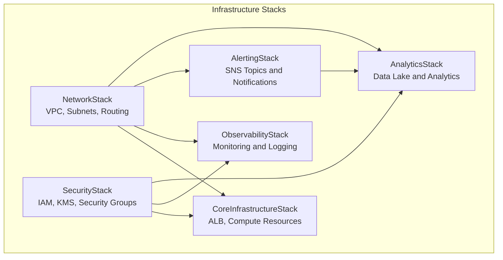

# Infrastructure as Code

## Overview

This project uses AWS CDK (Cloud Development Kit) to implement Infrastructure as Code, providing repeatable, version-controlled infrastructure deployment.

## Architecture Overview

### Multi-Stack Architecture



### Technology Stack

- **CDK Version**: 2.208.0+
- **Language**: TypeScript 5.6+
- **Target Platform**: AWS
- **Deployment Tool**: CDK CLI
- **Version Control**: Git
- **Testing Framework**: Jest (103 tests)

## Stack Details

### 1. NetworkStack - Network Infrastructure

**Features**:
- VPC and subnet configuration
- Route tables and NAT gateways
- Network ACLs and security groups

**Resources**:
```typescript
// Main VPC configuration
const vpc = new ec2.Vpc(this, 'GenAIDemoVPC', {
  maxAzs: 3,
  natGateways: 1,
  subnetConfiguration: [
    {
      cidrMask: 24,
      name: 'Public',
      subnetType: ec2.SubnetType.PUBLIC,
    },
    {
      cidrMask: 24,
      name: 'Private',
      subnetType: ec2.SubnetType.PRIVATE_WITH_EGRESS,
    },
    {
      cidrMask: 28,
      name: 'Database',
      subnetType: ec2.SubnetType.PRIVATE_ISOLATED,
    },
  ],
});
```

### 2. SecurityStack - Security Configuration

**Features**:
- IAM roles and policies
- KMS key management
- Security group rules

**Key Security Configuration**:
```typescript
// KMS key for encryption
const kmsKey = new kms.Key(this, 'GenAIDemoKMSKey', {
  description: 'KMS key for GenAI Demo encryption',
  enableKeyRotation: true,
});

// Application service role
const applicationRole = new iam.Role(this, 'ApplicationRole', {
  assumedBy: new iam.ServicePrincipal('ecs-tasks.amazonaws.com'),
  managedPolicies: [
    iam.ManagedPolicy.fromAwsManagedPolicyName('service-role/AmazonECSTaskExecutionRolePolicy'),
  ],
});
```

### 3. AlertingStack - Alerting Infrastructure

**Features**:
- SNS topic configuration
- Multi-level alerting system
- Email and Slack integration

**Alerting Configuration**:
```typescript
// Critical alerts topic
const criticalAlerts = new sns.Topic(this, 'CriticalAlerts', {
  displayName: 'GenAI Demo Critical Alerts',
});

// Warning alerts topic
const warningAlerts = new sns.Topic(this, 'WarningAlerts', {
  displayName: 'GenAI Demo Warning Alerts',
});

// Info alerts topic
const infoAlerts = new sns.Topic(this, 'InfoAlerts', {
  displayName: 'GenAI Demo Info Alerts',
});
```

### 4. CoreInfrastructureStack - Core Infrastructure

**Features**:
- Application Load Balancer
- Target group configuration
- HTTP/HTTPS listeners

**ALB Configuration**:
```typescript
const alb = new elbv2.ApplicationLoadBalancer(this, 'ApplicationLoadBalancer', {
  vpc: vpc,
  internetFacing: true,
  vpcSubnets: {
    subnetType: ec2.SubnetType.PUBLIC,
  },
});

const targetGroup = new elbv2.ApplicationTargetGroup(this, 'TargetGroup', {
  vpc: vpc,
  port: 8080,
  protocol: elbv2.ApplicationProtocol.HTTP,
  targetType: elbv2.TargetType.IP,
  healthCheck: {
    enabled: true,
    path: '/actuator/health',
    healthyHttpCodes: '200',
  },
});
```

### 5. ObservabilityStack - Monitoring and Observability

**Features**:
- CloudWatch dashboards
- Log group configuration
- Monitoring metrics setup

**Monitoring Configuration**:
```typescript
// CloudWatch log group
const logGroup = new logs.LogGroup(this, 'ApplicationLogGroup', {
  logGroupName: '/aws/genai-demo/application',
  retention: logs.RetentionDays.ONE_WEEK,
  encryptionKey: kmsKey,
});

// CloudWatch dashboard
const dashboard = new cloudwatch.Dashboard(this, 'GenAIDemoDashboard', {
  dashboardName: `GenAI-Demo-${environment}`,
  widgets: [
    [new cloudwatch.GraphWidget({
      title: 'API Request Metrics',
      left: [
        new cloudwatch.Metric({
          namespace: 'AWS/ApplicationELB',
          metricName: 'RequestCount',
          dimensionsMap: {
            LoadBalancer: alb.loadBalancerFullName,
          },
        }),
      ],
    })],
  ],
});
```

### 6. AnalyticsStack - Analytics Platform (Optional)

**Features**:
- S3 data lake
- Kinesis Data Firehose
- AWS Glue data catalog
- QuickSight integration

**Analytics Configuration**:
```typescript
// S3 data lake
const dataLakeBucket = new s3.Bucket(this, 'DataLakeBucket', {
  bucketName: `genai-demo-${environment}-data-lake-${this.account}`,
  encryption: s3.BucketEncryption.KMS,
  encryptionKey: kmsKey,
  lifecycleRules: [{
    id: 'DataLifecycle',
    enabled: true,
    transitions: [{
      storageClass: s3.StorageClass.INFREQUENT_ACCESS,
      transitionAfter: cdk.Duration.days(30),
    }],
  }],
});

// Kinesis Data Firehose
const firehose = new kinesisfirehose.DeliveryStream(this, 'DomainEventsFirehose', {
  deliveryStreamName: `genai-demo-${environment}-domain-events-firehose`,
  destinations: [new destinations.S3Bucket(dataLakeBucket, {
    prefix: 'domain-events/year=!{timestamp:yyyy}/month=!{timestamp:MM}/day=!{timestamp:dd}/',
    errorOutputPrefix: 'errors/',
    bufferingInterval: cdk.Duration.minutes(1),
    bufferingSize: cdk.Size.mebibytes(5),
  })],
});
```

## Deployment Process

### 1. Environment Setup

```bash
# Install CDK CLI
npm install -g aws-cdk

# Install project dependencies
cd infrastructure
npm install

# Configure AWS credentials
aws configure

# Bootstrap CDK (first-time deployment)
cdk bootstrap aws://ACCOUNT-NUMBER/REGION
```

### 2. Unified Deployment Script

```bash
#!/bin/bash
# deploy-consolidated.sh

set -e

ENVIRONMENT=${1:-development}
REGION=${2:-us-east-1}
ENABLE_ANALYTICS=${3:-true}
ENABLE_CDK_NAG=${4:-false}

echo "Deploying ${ENVIRONMENT} environment infrastructure to ${REGION}..."

# Set environment variables
export CDK_DEFAULT_REGION=$REGION
export CDK_DEFAULT_ACCOUNT=$(aws sts get-caller-identity --query Account --output text)

# Deploy all stacks unified
cdk deploy --all \
  --context environment=$ENVIRONMENT \
  --context region=$REGION \
  --context enableAnalytics=$ENABLE_ANALYTICS \
  --context enableCdkNag=$ENABLE_CDK_NAG \
  --require-approval never

echo "✅ Infrastructure deployment completed"
```

### 3. Deployment Options

```bash
# Development environment (basic configuration)
./deploy-consolidated.sh development us-east-1 false false

# Pre-production environment (includes analytics and compliance checks)
./deploy-consolidated.sh staging us-east-1 true true

# Production environment (full configuration)
./deploy-consolidated.sh production us-east-1 true true
```

### 4. Deployment Verification

```bash
#!/bin/bash
# verify-infrastructure.sh

ENVIRONMENT=${1:-development}

echo "Verifying ${ENVIRONMENT} environment infrastructure..."

# Check all stack statuses
aws cloudformation list-stacks \
  --stack-status-filter CREATE_COMPLETE UPDATE_COMPLETE \
  --query 'StackSummaries[?contains(StackName, `genai-demo-'${ENVIRONMENT}'`)].{Name:StackName,Status:StackStatus}' \
  --output table

# Check ALB health status
ALB_DNS=$(aws elbv2 describe-load-balancers \
  --names "genai-demo-${ENVIRONMENT}-alb" \
  --query 'LoadBalancers[0].DNSName' --output text 2>/dev/null || echo "None")

if [ "$ALB_DNS" != "None" ]; then
  echo "✅ ALB DNS: $ALB_DNS"
  # Test health check endpoint
  if curl -f "http://$ALB_DNS/health" > /dev/null 2>&1; then
    echo "✅ ALB health check passed"
  else
    echo "⚠️  ALB health check failed (application may not be deployed yet)"
  fi
else
  echo "❌ ALB not found"
fi

echo "✅ Infrastructure verification completed"
```

## Configuration Management

### Environment-Specific Configuration

```typescript
// cdk.json
{
  "context": {
    "environments": {
      "development": {
        "account": "123456789012",
        "region": "us-east-1",
        "enableAnalytics": false,
        "enableCdkNag": false,
        "natGateways": 1,
        "logRetention": "ONE_WEEK"
      },
      "staging": {
        "account": "123456789012",
        "region": "us-east-1",
        "enableAnalytics": true,
        "enableCdkNag": true,
        "natGateways": 2,
        "logRetention": "ONE_MONTH"
      },
      "production": {
        "account": "123456789012",
        "region": "us-east-1",
        "enableAnalytics": true,
        "enableCdkNag": true,
        "natGateways": 2,
        "logRetention": "SIX_MONTHS"
      }
    }
  }
}
```

### Parameterized Configuration

```typescript
// Read configuration from context
const environment = this.node.tryGetContext('environment') || 'development';
const config = this.node.tryGetContext('environments')[environment];

// Use configuration to create resources
const vpc = new ec2.Vpc(this, 'VPC', {
  maxAzs: 3,
  natGateways: config.natGateways,
  subnetConfiguration: [
    // Subnet configuration
  ],
});
```

## Testing Strategy

### Test Categories

| Test Type | Count | Description |
|-----------|-------|-------------|
| Unit Tests | 26 | Individual component tests |
| Integration Tests | 8 | Cross-stack validation |
| Consolidated Tests | 18 | Main test suite |
| Compliance Tests | 4 | CDK Nag validation |
| Stack Tests | 47 | Individual stack validation |
| **Total** | **103** | **Complete test coverage** |

### Test Execution

```bash
# Run all tests
npm test

# Run specific test types
npm run test:unit          # Unit tests
npm run test:integration   # Integration tests
npm run test:consolidated  # Consolidated tests
npm run test:compliance    # Compliance tests

# Quick test (for development)
npm run test:quick
```

## Cost Optimization

### Resource Tagging

```typescript
// Unified resource tagging
const commonTags = {
  Project: 'GenAI-Demo',
  Environment: environment,
  ManagedBy: 'CDK',
  CostCenter: 'Engineering',
  Owner: 'Platform-Team',
};

// Apply tags to all resources
cdk.Tags.of(this).add('Project', commonTags.Project);
cdk.Tags.of(this).add('Environment', commonTags.Environment);
```

### Cost Estimation

| Environment | Monthly Cost Estimate | Main Cost Items |
|-------------|----------------------|-----------------|
| Development | ~$60 | NAT Gateway ($45), Storage ($5), Monitoring ($10) |
| Staging | ~$90 | NAT Gateway ($90), Storage ($10), Monitoring ($15) |
| Production | ~$150 | NAT Gateway ($90), Storage ($30), Monitoring ($30) |

### Cost Monitoring

```typescript
// Budget alerts
const budget = new budgets.CfnBudget(this, 'ProjectBudget', {
  budget: {
    budgetName: `genai-demo-${environment}-budget`,
    budgetLimit: {
      amount: environment === 'production' ? 200 : 100,
      unit: 'USD',
    },
    timeUnit: 'MONTHLY',
    budgetType: 'COST',
    costFilters: {
      TagKey: ['Project'],
      TagValue: ['GenAI-Demo'],
    },
  },
  notificationsWithSubscribers: [{
    notification: {
      notificationType: 'ACTUAL',
      comparisonOperator: 'GREATER_THAN',
      threshold: 80,
    },
    subscribers: [{
      subscriptionType: 'EMAIL',
      address: 'team@example.com',
    }],
  }],
});
```

## Security Best Practices

### 1. Principle of Least Privilege

```typescript
// Service-specific IAM role
const appServiceRole = new iam.Role(this, 'AppServiceRole', {
  assumedBy: new iam.ServicePrincipal('ecs-tasks.amazonaws.com'),
  inlinePolicies: {
    S3Access: new iam.PolicyDocument({
      statements: [
        new iam.PolicyStatement({
          effect: iam.Effect.ALLOW,
          actions: [
            's3:GetObject',
            's3:PutObject',
          ],
          resources: [`${dataLakeBucket.bucketArn}/*`],
        }),
      ],
    }),
  },
});
```

### 2. Network Security

```typescript
// Restrictive security group
const appSecurityGroup = new ec2.SecurityGroup(this, 'AppSecurityGroup', {
  vpc: vpc,
  description: 'Security group for application',
  allowAllOutbound: false,
});

// Only allow ALB access
appSecurityGroup.addIngressRule(
  albSecurityGroup,
  ec2.Port.tcp(8080),
  'Allow HTTP access from ALB'
);
```

### 3. Encryption Configuration

```typescript
// Comprehensive encryption configuration
const encryptionConfig = {
  // S3 encryption
  encryption: s3.BucketEncryption.KMS,
  encryptionKey: kmsKey,
  // CloudWatch Logs encryption
  encryptionKey: kmsKey,
  // RDS encryption (if used)
  storageEncrypted: true,
  kmsKey: kmsKey,
};
```

## Disaster Recovery

### Backup Strategy

```typescript
// S3 cross-region replication
const replicationBucket = new s3.Bucket(this, 'ReplicationBucket', {
  bucketName: `genai-demo-${environment}-backup-${this.account}`,
  versioned: true,
});

dataLakeBucket.addCorsRule({
  allowedMethods: [s3.HttpMethods.GET, s3.HttpMethods.PUT],
  allowedOrigins: ['*'],
  allowedHeaders: ['*'],
});
```

### Multi-Region Deployment

```typescript
// Production multi-region configuration
if (environment === 'production') {
  const drStack = new DisasterRecoveryStack(app, 'GenAIDemoDRStack', {
    env: {
      account: config.account,
      region: 'us-west-2', // DR region
    },
    primaryRegion: 'us-east-1',
    environment: environment,
  });
}
```

## Monitoring and Alerting

### Infrastructure Monitoring

```typescript
// Resource utilization monitoring
const cpuAlarm = new cloudwatch.Alarm(this, 'HighCPUAlarm', {
  metric: new cloudwatch.Metric({
    namespace: 'AWS/ApplicationELB',
    metricName: 'TargetResponseTime',
    dimensionsMap: {
      LoadBalancer: alb.loadBalancerFullName,
    },
  }),
  threshold: 2, // 2 seconds
  evaluationPeriods: 2,
});

// Cost anomaly detection
const costAnomaly = new ce.CfnAnomalyDetector(this, 'CostAnomalyDetector', {
  monitorType: 'DIMENSIONAL',
  monitorSpecification: JSON.stringify({
    DimensionKey: 'SERVICE',
    MatchOptions: ['EQUALS'],
    Values: ['Amazon Elastic Load Balancing'],
  }),
});
```

## Troubleshooting

### Common Issues

#### 1. Deployment Failures

```bash
# Check CDK version
cdk --version

# Check AWS credentials
aws sts get-caller-identity

# Check CDK bootstrap
cdk ls

# View detailed errors
cdk deploy --verbose
```

#### 2. Resource Dependency Issues

```bash
# Check stack dependencies
cdk list

# View stack outputs
cdk outputs NetworkStack

# Force redeploy
cdk deploy --force
```

#### 3. Permission Issues

```bash
# Check IAM permissions
aws iam get-user

# Check CDK execution role
aws sts assume-role --role-arn arn:aws:iam::ACCOUNT:role/cdk-exec-role
```

## Development Workflow

### Daily Development

```bash
# 1. Modify infrastructure code
# 2. Run tests to verify changes
npm run test:quick

# 3. Synthesize CloudFormation templates for review
npm run synth

# 4. Deploy to development environment
npm run deploy:dev
```

### Pre-commit Checklist

- [ ] All tests pass (`npm test`)
- [ ] CDK synthesis successful (`npm run synth`)
- [ ] Code follows TypeScript standards
- [ ] Documentation updated (if needed)
- [ ] Security configuration reviewed

## Related Diagrams

### AWS Infrastructure Overview
- **[AWS Infrastructure Architecture](../../diagrams/aws-infrastructure.md)** - Complete AWS CDK infrastructure architecture documentation
- **AWS Infrastructure Diagram

```mermaid
graph TB
    subgraph "AWS Infrastructure"
        EKS[EKS Cluster]
        RDS[RDS Database]
        S3[S3 Storage]
        CloudWatch[CloudWatch]
        ALB[Application Load Balancer]
    end
    
    ALB --> EKS
    EKS --> RDS
    EKS --> S3
    EKS --> CloudWatch
```** - Detailed AWS services architecture diagram

### CDK Implementation Details
- [Network Stack Configuration](network-stack-details.md)
- [Security Stack Implementation](security-stack-details.md)
- [Observability Stack Setup](observability-stack-details.md)

## Relationships with Other Viewpoints

- **[Operational Viewpoint](../operational/README.md)**: Monitoring and observability infrastructure
- **[Security Perspective](../../perspectives/security/README.md)**: Security configuration and compliance
- **[Cost Perspective](../../perspectives/cost/README.md)**: Cost optimization and budget management

## Related Documentation

- [Deployment Guide](../deployment/README.md)
- [Observability Deployment](observability-deployment.md)
- [Production Deployment Checklist](production-deployment-checklist.md)
- [Docker Deployment Guide](docker-guide.md)

---

**Document Version**: v1.0  
**Last Updated**: December 2024  
**Responsible Team**: Platform Team  
**Review Status**: Reviewed