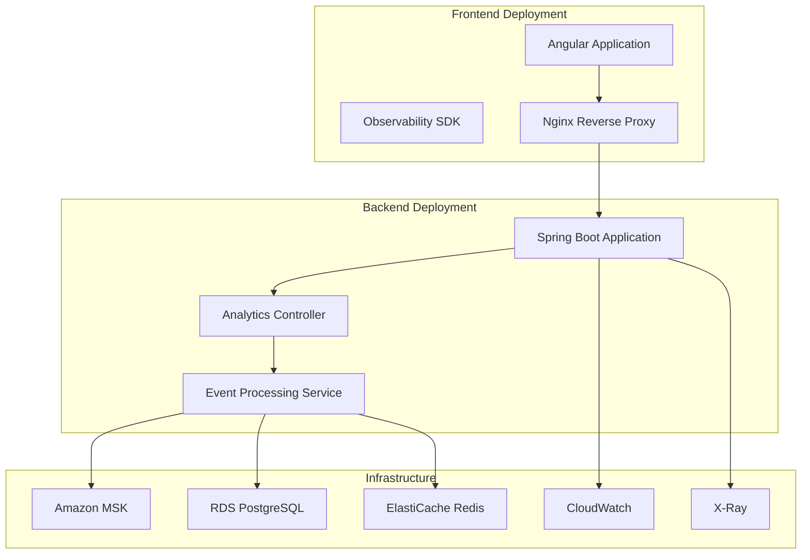

# Observability Deployment Guide

## Overview

This guide provides detailed instructions for deploying the frontend-backend observability integration system across different environments, including deployment steps and configurations for development, testing, and production environments.

## Deployment Architecture

### System Components



## Environment Setup

### Development Environment Deployment

#### 1. Local Development Environment Setup

**Prerequisites**:

- Node.js 18+
- Java 21
- Docker & Docker Compose
- Git

**Deployment Steps**:

```bash
# 1. Clone the project
git clone https://github.com/your-org/genai-demo.git
cd genai-demo

# 2. Start infrastructure services
docker-compose up -d redis postgresql

# 3. Start backend service
./gradlew bootRun --args='--spring.profiles.active=dev'

# 4. Start frontend service
cd consumer-frontend
npm install
npm run start

# 5. Verify deployment
curl http://localhost:8080/actuator/health
curl http://localhost:4200
```

**Docker Compose Configuration**:

```yaml
# docker-compose.dev.yml
version: '3.8'
services:
  redis:
    image: redis:7-alpine
    ports:
      - "6379:6379"
    command: redis-server --appendonly yes
    volumes:
      - redis-data:/data

  postgresql:
    image: postgres:15-alpine
    environment:
      POSTGRES_DB: genai_demo_dev
      POSTGRES_USER: genai_demo
      POSTGRES_PASSWORD: dev_password
    ports:
      - "5432:5432"
    volumes:
      - postgres-data:/var/lib/postgresql/data

  zookeeper:
    image: confluentinc/cp-zookeeper:7.4.0
    environment:
      ZOOKEEPER_CLIENT_PORT: 2181
      ZOOKEEPER_TICK_TIME: 2000

  kafka:
    image: confluentinc/cp-kafka:7.4.0
    depends_on:
      - zookeeper
    ports:
      - "9092:9092"
    environment:
      KAFKA_BROKER_ID: 1
      KAFKA_ZOOKEEPER_CONNECT: zookeeper:2181
      KAFKA_LISTENER_SECURITY_PROTOCOL_MAP: PLAINTEXT:PLAINTEXT,PLAINTEXT_HOST:PLAINTEXT
      KAFKA_ADVERTISED_LISTENERS: PLAINTEXT://kafka:29092,PLAINTEXT_HOST://localhost:9092
      KAFKA_OFFSETS_TOPIC_REPLICATION_FACTOR: 1
      KAFKA_AUTO_CREATE_TOPICS_ENABLE: true

volumes:
  redis-data:
  postgres-data:
```

#### 2. Development Environment Configuration Verification

```bash
#!/bin/bash
# verify-dev-deployment.sh

echo "=== Verifying Development Environment Deployment ==="

# Check backend health status
echo "1. Checking backend service..."
curl -f http://localhost:8080/actuator/health || exit 1

# Check frontend service
echo "2. Checking frontend service..."
curl -f http://localhost:4200 || exit 1

# Check database connection
echo "3. Checking database connection..."
curl -f http://localhost:8080/actuator/health/db || exit 1

# Check Redis connection
echo "4. Checking Redis connection..."
curl -f http://localhost:8080/actuator/health/redis || exit 1

# Test observability API
echo "5. Testing observability API..."
curl -X POST http://localhost:8080/api/analytics/events \
  -H "Content-Type: application/json" \
  -H "X-Trace-Id: dev-test-$(date +%s)" \
  -H "X-Session-Id: dev-session" \
  -d '[{"eventId":"dev-test","eventType":"page_view","sessionId":"dev-session","traceId":"dev-test-'$(date +%s)'","timestamp":'$(date +%s000)',"data":{"page":"/test"}}]' || exit 1

echo "✅ Development environment deployment verification completed"
```

### Test Environment Deployment

#### 1. CI/CD Pipeline Configuration

**GitHub Actions Workflow**:

```yaml
# .github/workflows/test-deployment.yml
name: Test Environment Deployment

on:
  pull_request:
    branches: [ main, develop ]
  push:
    branches: [ develop ]

jobs:
  test-deployment:
    runs-on: ubuntu-latest
    
    services:
      postgres:
        image: postgres:15
        env:
          POSTGRES_PASSWORD: test_password
          POSTGRES_DB: genai_demo_test
        options: >-
          --health-cmd pg_isready
          --health-interval 10s
          --health-timeout 5s
          --health-retries 5
        ports:
          - 5432:5432
      
      redis:
        image: redis:7
        options: >-
          --health-cmd "redis-cli ping"
          --health-interval 10s
          --health-timeout 5s
          --health-retries 5
        ports:
          - 6379:6379

    steps:
    - uses: actions/checkout@v3
    
    - name: Set up JDK 21
      uses: actions/setup-java@v3
      with:
        java-version: '21'
        distribution: 'temurin'
    
    - name: Set up Node.js
      uses: actions/setup-node@v3
      with:
        node-version: '18'
    
    - name: Cache Gradle packages
      uses: actions/cache@v3
      with:
        path: |
          ~/.gradle/caches
          ~/.gradle/wrapper
        key: ${{ runner.os }}-gradle-${{ hashFiles('**/*.gradle*', '**/gradle-wrapper.properties') }}
    
    - name: Run backend tests
      run: ./gradlew test --profile test
      env:
        SPRING_PROFILES_ACTIVE: test
        SPRING_DATASOURCE_URL: jdbc:postgresql://localhost:5432/genai_demo_test
        SPRING_DATASOURCE_USERNAME: postgres
        SPRING_DATASOURCE_PASSWORD: test_password
        SPRING_REDIS_HOST: localhost
        SPRING_REDIS_PORT: 6379
    
    - name: Build backend application
      run: ./gradlew build -x test
    
    - name: Install frontend dependencies
      run: |
        cd consumer-frontend
        npm ci
    
    - name: Run frontend tests
      run: |
        cd consumer-frontend
        npm run test:ci
    
    - name: Build frontend application
      run: |
        cd consumer-frontend
        npm run build:test
    
    - name: Run integration tests
      run: ./gradlew integrationTest
      env:
        SPRING_PROFILES_ACTIVE: test
    
    - name: Deploy to test environment
      if: github.ref == 'refs/heads/develop'
      run: |
        # Script to deploy to test environment
        ./scripts/deploy-test.sh
```

#### 2. Test Environment Infrastructure

**Kubernetes Configuration**:

```yaml
# k8s/test/namespace.yaml
apiVersion: v1
kind: Namespace
metadata:
  name: genai-demo-test
  labels:
    environment: test
    project: genai-demo

---
# k8s/test/configmap.yaml
apiVersion: v1
kind: ConfigMap
metadata:
  name: genai-demo-config
  namespace: genai-demo-test
data:
  application.yml: |
    spring:
      profiles:
        active: test
      datasource:
        url: jdbc:postgresql://postgres-service:5432/genai_demo_test
        username: genai_demo
        password: ${DB_PASSWORD}
      redis:
        host: redis-service
        port: 6379
    genai-demo:
      events:
        publisher: in-memory
      observability:
        analytics:
          enabled: true
          batch-size: 10
          flush-interval: 10s

---
# k8s/test/deployment.yaml
apiVersion: apps/v1
kind: Deployment
metadata:
  name: genai-demo-backend
  namespace: genai-demo-test
spec:
  replicas: 2
  selector:
    matchLabels:
      app: genai-demo-backend
  template:
    metadata:
      labels:
        app: genai-demo-backend
    spec:
      containers:
      - name: backend
        image: genai-demo/backend:test
        ports:
        - containerPort: 8080
        env:
        - name: SPRING_PROFILES_ACTIVE
          value: "test"
        - name: DB_PASSWORD
          valueFrom:
            secretKeyRef:
              name: db-secret
              key: password
        volumeMounts:
        - name: config
          mountPath: /app/config
        livenessProbe:
          httpGet:
            path: /actuator/health/liveness
            port: 8080
          initialDelaySeconds: 30
          periodSeconds: 10
        readinessProbe:
          httpGet:
            path: /actuator/health/readiness
            port: 8080
          initialDelaySeconds: 10
          periodSeconds: 5
      volumes:
      - name: config
        configMap:
          name: genai-demo-config
```

### Production Environment Deployment

#### 1. AWS Infrastructure Deployment

**CDK Deployment Script**:

```bash
#!/bin/bash
# deploy-production.sh

set -e

ENVIRONMENT="production"
PROJECT_NAME="genai-demo"
AWS_REGION="us-east-1"

echo "=== Deploying Production Environment Infrastructure ==="

# 1. Deploy network infrastructure
echo "1. Deploying VPC and network components..."
cd infrastructure
npm install
npx cdk deploy NetworkStack --require-approval never \
  --context environment=$ENVIRONMENT \
  --context projectName=$PROJECT_NAME

# 2. Deploy security components
echo "2. Deploying security and KMS..."
npx cdk deploy SecurityStack --require-approval never \
  --context environment=$ENVIRONMENT \
  --context projectName=$PROJECT_NAME

# 3. Deploy MSK cluster
echo "3. Deploying MSK cluster..."
npx cdk deploy MSKStack --require-approval never \
  --context environment=$ENVIRONMENT \
  --context projectName=$PROJECT_NAME

# 4. Deploy RDS database
echo "4. Deploying RDS database..."
npx cdk deploy RDSStack --require-approval never \
  --context environment=$ENVIRONMENT \
  --context projectName=$PROJECT_NAME

# 5. Deploy EKS cluster
echo "5. Deploying EKS cluster..."
npx cdk deploy EKSStack --require-approval never \
  --context environment=$ENVIRONMENT \
  --context projectName=$PROJECT_NAME

# 6. Deploy observability infrastructure
echo "6. Deploying observability components..."
npx cdk deploy ObservabilityStack --require-approval never \
  --context environment=$ENVIRONMENT \
  --context projectName=$PROJECT_NAME

echo "✅ Infrastructure deployment completed"

# 7. Create Kafka topics
echo "7. Creating Kafka topics..."
./scripts/create-kafka-topics.sh $ENVIRONMENT

# 8. Deploy application
echo "8. Deploying application..."
./scripts/deploy-application.sh $ENVIRONMENT

echo "✅ Production environment deployment completed"
```

## Deployment Verification

### Automated Deployment Verification

```bash
#!/bin/bash
# scripts/verify-production-deployment.sh

ENVIRONMENT="production"
API_BASE_URL="https://api.genai-demo.com"
FRONTEND_URL="https://genai-demo.com"

echo "=== Verifying Production Environment Deployment ==="

# 1. Check infrastructure health status
echo "1. Checking infrastructure..."

# Check MSK cluster
MSK_CLUSTER_ARN=$(aws cloudformation describe-stacks \
    --stack-name genai-demo-${ENVIRONMENT}-msk \
    --query 'Stacks[0].Outputs[?OutputKey==`MSKClusterArn`].OutputValue' \
    --output text)

MSK_STATUS=$(aws kafka describe-cluster --cluster-arn $MSK_CLUSTER_ARN \
    --query 'ClusterInfo.State' --output text)

if [ "$MSK_STATUS" != "ACTIVE" ]; then
    echo "❌ MSK cluster status abnormal: $MSK_STATUS"
    exit 1
fi
echo "✅ MSK cluster status normal"

# 2. Check application health status
echo "2. Checking application..."

# Check backend health status
BACKEND_HEALTH=$(curl -s -w "%{http_code}" -o /dev/null ${API_BASE_URL}/actuator/health)
if [ "$BACKEND_HEALTH" != "200" ]; then
    echo "❌ Backend health check failed: HTTP $BACKEND_HEALTH"
    exit 1
fi
echo "✅ Backend health status normal"

# 3. Check observability functionality
echo "3. Checking observability functionality..."

# Test analytics API
TRACE_ID="prod-verify-$(date +%s)"
SESSION_ID="prod-verify-session"

ANALYTICS_RESPONSE=$(curl -s -w "%{http_code}" -X POST ${API_BASE_URL}/api/analytics/events \
  -H "Content-Type: application/json" \
  -H "X-Trace-Id: $TRACE_ID" \
  -H "X-Session-Id: $SESSION_ID" \
  -d '[{"eventId":"prod-verify","eventType":"page_view","sessionId":"'$SESSION_ID'","traceId":"'$TRACE_ID'","timestamp":'$(date +%s000)',"data":{"page":"/verify"}}]')

if [[ "${ANALYTICS_RESPONSE: -3}" != "200" ]]; then
    echo "❌ Analytics API test failed: HTTP ${ANALYTICS_RESPONSE: -3}"
    exit 1
fi
echo "✅ Analytics API functionality normal"

echo "=== Production environment deployment verification completed ==="
```

## Monitoring and Alerting

### CloudWatch Dashboard Setup

```json
{
  "widgets": [
    {
      "type": "metric",
      "properties": {
        "metrics": [
          ["GenAI/Demo/production", "observability.events.received"],
          [".", "observability.events.processed"],
          [".", "observability.events.failed"]
        ],
        "period": 300,
        "stat": "Sum",
        "region": "us-east-1",
        "title": "Observability Event Processing"
      }
    },
    {
      "type": "metric",
      "properties": {
        "metrics": [
          ["AWS/ApplicationELB", "RequestCount", "LoadBalancer", "genai-demo-production-alb"],
          [".", "TargetResponseTime", ".", "."],
          [".", "HTTPCode_Target_2XX_Count", ".", "."]
        ],
        "period": 300,
        "stat": "Average",
        "region": "us-east-1",
        "title": "Application Load Balancer Metrics"
      }
    }
  ]
}
```

## Rollback Strategy

### Automatic Rollback Trigger Conditions

```yaml
# k8s/production/rollback-policy.yaml
apiVersion: argoproj.io/v1alpha1
kind: Rollout
metadata:
  name: genai-demo-backend-rollout
spec:
  replicas: 3
  strategy:
    canary:
      steps:
      - setWeight: 20
      - pause: {duration: 10m}
      - setWeight: 40
      - pause: {duration: 10m}
      - setWeight: 60
      - pause: {duration: 10m}
      - setWeight: 80
      - pause: {duration: 10m}
      analysis:
        templates:
        - templateName: success-rate
        args:
        - name: service-name
          value: genai-demo-backend-service
```

## Related Diagrams

### AWS Infrastructure Architecture
- **[AWS Infrastructure Architecture](../../diagrams/aws-infrastructure.md)** - Complete AWS architecture including observability services
- **AWS Observability Architecture

```mermaid
graph TB
    subgraph APP ["Spring Boot Application"]
        ACTUATOR[Spring Boot Actuator]
        OTEL[OpenTelemetry Agent]
        LOGBACK[Logback JSON Logging]
        MICROMETER[Micrometer Metrics]
    end
    
    subgraph K8S ["Kubernetes Cluster"]
        FLUENT[Fluent Bit DaemonSet]
        PROMETHEUS[Prometheus]
        GRAFANA[Grafana]
    end
    
    subgraph AWS ["AWS Services"]
        CW_LOGS[CloudWatch Logs]
        CW_METRICS[CloudWatch Metrics]
        XRAY[AWS X-Ray]
        OPENSEARCH[OpenSearch Service]
    end
    
    ACTUATOR --> PROMETHEUS
    LOGBACK --> FLUENT
    OTEL --> XRAY
    MICROMETER --> PROMETHEUS
    
    FLUENT --> CW_LOGS
    PROMETHEUS --> CW_METRICS
    GRAFANA --> PROMETHEUS
    
    CW_LOGS --> OPENSEARCH
    
    classDef application fill:#e1f5fe,stroke:#01579b,stroke-width:2px
    classDef kubernetes fill:#f3e5f5,stroke:#4a148c,stroke-width:2px
    classDef aws fill:#fff3e0,stroke:#e65100,stroke-width:2px
    
    class ACTUATOR,OTEL,LOGBACK,MICROMETER application
    class FLUENT,PROMETHEUS,GRAFANA kubernetes
    class CW_LOGS,CW_METRICS,XRAY,OPENSEARCH aws
```** - Observability services architecture diagram

### Deployment Details
- [Production Deployment Checklist](production-deployment-checklist.md)
- [Infrastructure as Code](infrastructure-as-code.md)

## Relationships with Other Viewpoints

- **[Operational Viewpoint](../operational/README.md)**: Monitoring and maintenance strategies
- **[Development Viewpoint](../development/README.md)**: CI/CD integration and testing
- **[Concurrency Viewpoint](../concurrency/README.md)**: Event processing and asynchronous architecture

## Related Documentation

- [Production Deployment Checklist](production-deployment-checklist.md)
- [Infrastructure as Code](infrastructure-as-code.md)
- [Docker Deployment Guide](docker-guide.md)

---

**Document Version**: v1.0  
**Last Updated**: December 2024  
**Responsible Team**: DevOps Team  
**Review Status**: Reviewed