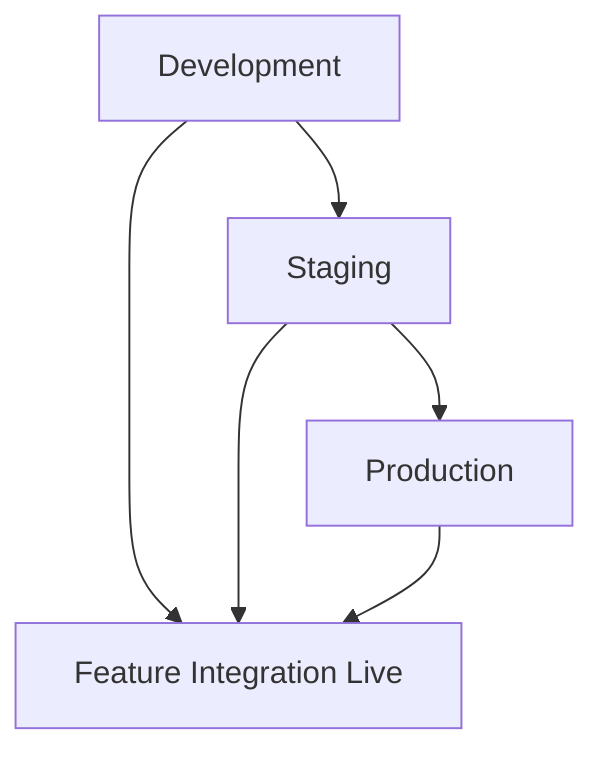
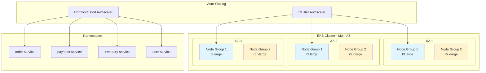
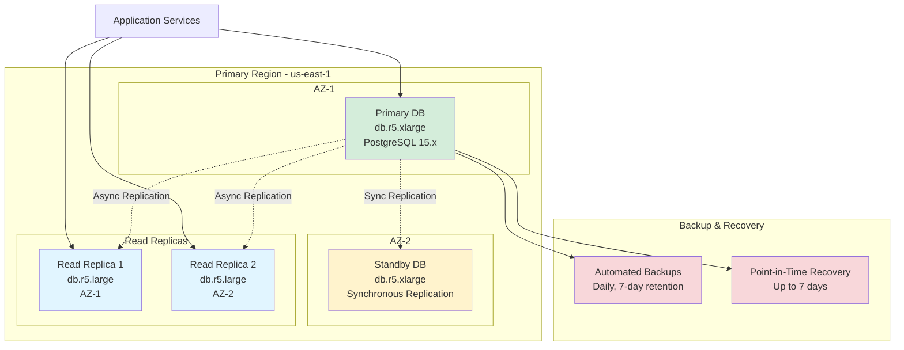

# Deployment Viewpoint Overview

> **Viewpoint**: Deployment  
> **Purpose**: Describe the physical infrastructure and deployment architecture of the E-Commerce Platform  
> **Audience**: Architects, DevOps Engineers, Operations Team, Security Team

## Purpose

The Deployment Viewpoint describes how the E-Commerce Platform is deployed on AWS infrastructure, including the physical architecture, network topology, and deployment processes. This viewpoint is essential for understanding system scalability, availability, security, and operational requirements.

## Key Concerns

This viewpoint addresses the following concerns:

1. **Infrastructure Architecture**: How AWS services are configured and integrated
2. **High Availability**: How the system achieves 99.9% uptime SLO
3. **Scalability**: How the system scales to handle varying loads
4. **Security**: How network security and access control are implemented
5. **Disaster Recovery**: How the system recovers from failures
6. **Deployment Process**: How code changes are deployed to production
7. **Cost Optimization**: How infrastructure costs are managed

## Deployment Model

### Cloud-Native Architecture

The E-Commerce Platform is deployed as a **cloud-native application** on AWS, leveraging managed services for scalability, reliability, and operational efficiency.

**Key Characteristics**:

- **Containerized Microservices**: Applications run in Docker containers on EKS
- **Managed Databases**: PostgreSQL on RDS for relational data
- **Managed Caching**: Redis on ElastiCache for distributed caching
- **Managed Messaging**: Kafka on MSK for event streaming
- **Infrastructure as Code**: AWS CDK for infrastructure provisioning
- **GitOps**: GitHub Actions for CI/CD automation

### Multi-Environment Strategy

The platform maintains three environments with progressive deployment:



**Environment Characteristics**:

| Environment | Purpose | Infrastructure | Data | Deployment |
|-------------|---------|----------------|------|------------|
| **Development** | Feature development and testing | Minimal resources, single AZ | Synthetic test data | Automatic on merge to `develop` |
| **Staging** | Integration testing and validation | Production-like, multi-AZ | Anonymized production data | Manual approval required |
| **Production** | Live customer traffic | Full redundancy, multi-AZ | Real customer data | Manual approval + canary deployment |

## Infrastructure Components

### 1. Compute Layer (Amazon EKS)

**Purpose**: Run containerized microservices with automatic scaling



**Configuration**:

- **Cluster**: Multi-AZ EKS cluster with managed node groups
- **Node Groups**:
  - General purpose (t3.large): 3-10 nodes (blue)
  - Memory optimized (r5.xlarge): 2-5 nodes for data-intensive services (yellow)
- **Auto-scaling**: Cluster Autoscaler + Horizontal Pod Autoscaler
- **Namespaces**: Logical separation by bounded context

**Key Features**:

- Rolling updates with zero downtime
- Pod disruption budgets for high availability
- Resource quotas and limits per namespace
- Network policies for pod-to-pod communication

### 2. Database Layer (Amazon RDS)

**Purpose**: Persistent storage for transactional data



**Configuration**:

- **Engine**: PostgreSQL 15.x
- **Instance**: db.r5.xlarge (primary), db.r5.large (replicas)
- **Deployment**: Multi-AZ with automatic failover
- **Read Replicas**: 2 replicas for read scaling
- **Storage**: 500GB GP3 SSD with auto-scaling up to 2TB
- **Backup**: Automated daily backups with 7-day retention

**Key Features**:

- Automatic failover in < 2 minutes
- Point-in-time recovery up to 7 days
- Encryption at rest (AES-256)
- Encryption in transit (TLS 1.2+)

### 3. Caching Layer (Amazon ElastiCache)

**Purpose**: Distributed caching and session storage

**Configuration**:

- **Engine**: Redis 7.x
- **Cluster Mode**: Enabled with 3 shards
- **Nodes**: cache.r5.large (3 primary + 3 replicas)
- **Deployment**: Multi-AZ with automatic failover
- **Persistence**: AOF (Append-Only File) enabled

**Key Features**:

- Sub-millisecond latency
- Automatic failover and recovery
- Data encryption at rest and in transit
- Backup and restore capabilities

### 4. Messaging Layer (Amazon MSK)

**Purpose**: Event streaming and asynchronous communication

**Configuration**:

- **Kafka Version**: 3.5.x
- **Brokers**: 3 brokers across 3 AZs
- **Instance**: kafka.m5.large
- **Storage**: 1TB EBS per broker
- **Replication**: Factor of 3 for durability

**Key Features**:

- High throughput (MB/s per broker)
- Automatic broker replacement
- Topic-level encryption
- Integration with CloudWatch for monitoring

### 5. Load Balancing (Application Load Balancer)

**Purpose**: Distribute traffic and provide SSL termination

**Configuration**:

- **Type**: Application Load Balancer (Layer 7)
- **Deployment**: Multi-AZ for high availability
- **SSL/TLS**: ACM-managed certificates with auto-renewal
- **Health Checks**: HTTP health checks every 30 seconds
- **Stickiness**: Session affinity for stateful operations

**Key Features**:

- Path-based routing to microservices
- Host-based routing for multi-tenant support
- WebSocket support for real-time features
- WAF integration for security

## High Availability Design

### Multi-AZ Deployment

All critical components are deployed across **3 Availability Zones** in the same region:

```text
┌─────────────────────────────────────────────────────────────┐
│                         Region: us-east-1                    │
├─────────────────────────────────────────────────────────────┤
│  AZ-1 (us-east-1a)  │  AZ-2 (us-east-1b)  │  AZ-3 (us-east-1c) │
├─────────────────────┼─────────────────────┼─────────────────┤
│  EKS Node Group     │  EKS Node Group     │  EKS Node Group  │
│  RDS Primary        │  RDS Standby        │  Read Replica    │
│  Redis Primary      │  Redis Replica      │  Redis Replica   │
│  Kafka Broker 1     │  Kafka Broker 2     │  Kafka Broker 3  │
│  ALB Target         │  ALB Target         │  ALB Target      │
└─────────────────────┴─────────────────────┴─────────────────┘
```

### Failure Scenarios and Recovery

| Component | Failure Scenario | Recovery Mechanism | RTO | RPO |
|-----------|------------------|-------------------|-----|-----|
| **EKS Node** | Node failure | Auto-scaling replaces node, pods rescheduled | < 5 min | 0 (stateless) |
| **RDS Primary** | Database failure | Automatic failover to standby | < 2 min | 0 (synchronous replication) |
| **Redis Primary** | Cache failure | Automatic failover to replica | < 1 min | < 1 min (AOF) |
| **Kafka Broker** | Broker failure | Automatic leader election | < 30 sec | 0 (replication factor 3) |
| **ALB** | Load balancer failure | AWS-managed automatic recovery | < 1 min | N/A |
| **AZ Failure** | Entire AZ down | Traffic routed to healthy AZs | < 5 min | 0 |

## Scalability Strategy

### Horizontal Scaling

**Application Layer (EKS)**:

- **Cluster Autoscaler**: Adds/removes nodes based on pending pods
- **Horizontal Pod Autoscaler (HPA)**: Scales pods based on CPU/memory/custom metrics
- **Target Metrics**:
  - CPU utilization: 70%
  - Memory utilization: 80%
  - Request rate: 1000 req/s per pod

**Database Layer (RDS)**:

- **Read Scaling**: Add read replicas (up to 5)
- **Write Scaling**: Vertical scaling of primary instance
- **Connection Pooling**: HikariCP with max 20 connections per service

**Caching Layer (ElastiCache)**:

- **Horizontal Scaling**: Add shards to cluster
- **Vertical Scaling**: Upgrade node types
- **Read Scaling**: Add replicas per shard

**Messaging Layer (MSK)**:

- **Broker Scaling**: Add brokers to cluster
- **Partition Scaling**: Increase partitions per topic
- **Consumer Scaling**: Add consumer instances

### Auto-Scaling Configuration

```yaml
# Example HPA configuration
apiVersion: autoscaling/v2
kind: HorizontalPodAutoscaler
metadata:
  name: order-service-hpa
spec:
  scaleTargetRef:
    apiVersion: apps/v1
    kind: Deployment
    name: order-service
  minReplicas: 3
  maxReplicas: 20
  metrics:

  - type: Resource

    resource:
      name: cpu
      target:
        type: Utilization
        averageUtilization: 70

  - type: Resource

    resource:
      name: memory
      target:
        type: Utilization
        averageUtilization: 80
  behavior:
    scaleUp:
      stabilizationWindowSeconds: 60
      policies:

      - type: Percent

        value: 50
        periodSeconds: 60
    scaleDown:
      stabilizationWindowSeconds: 300
      policies:

      - type: Percent

        value: 10
        periodSeconds: 60
```

## Security Architecture

### Network Security

**Defense in Depth**:

1. **Perimeter**: WAF on ALB for application-layer protection
2. **Network**: Security groups for fine-grained access control
3. **Application**: JWT authentication and RBAC authorization
4. **Data**: Encryption at rest and in transit

**Security Groups**:

- **ALB Security Group**: Allow HTTPS (443) from internet
- **EKS Node Security Group**: Allow traffic from ALB and within cluster
- **RDS Security Group**: Allow PostgreSQL (5432) from EKS nodes only
- **Redis Security Group**: Allow Redis (6379) from EKS nodes only
- **MSK Security Group**: Allow Kafka (9092) from EKS nodes only

### Data Encryption

**At Rest**:

- RDS: AWS KMS encryption with customer-managed keys
- ElastiCache: Encryption enabled with AWS-managed keys
- EBS Volumes: Encrypted with AWS-managed keys
- S3 Buckets: Server-side encryption (SSE-S3)

**In Transit**:

- ALB to Clients: TLS 1.2+ with ACM certificates
- ALB to EKS: TLS 1.2+ with internal certificates
- Application to RDS: TLS 1.2+ with RDS certificates
- Application to Redis: TLS 1.2+ enabled
- Application to Kafka: TLS 1.2+ with SASL authentication

## Disaster Recovery

### Backup Strategy

**RDS Backups**:

- **Automated Backups**: Daily snapshots with 7-day retention
- **Manual Snapshots**: Before major changes, retained indefinitely
- **Point-in-Time Recovery**: Up to 7 days
- **Cross-Region Replication**: Snapshots copied to secondary region

**ElastiCache Backups**:

- **Automated Backups**: Daily snapshots with 7-day retention
- **Manual Snapshots**: Before major changes

**MSK Backups**:

- **Topic Retention**: 7 days for all topics
- **Offset Backups**: Consumer group offsets backed up

**Application State**:

- **Configuration**: Stored in Git and AWS Systems Manager Parameter Store
- **Secrets**: Stored in AWS Secrets Manager with automatic rotation

### Recovery Procedures

**RTO/RPO Targets**:

- **RTO (Recovery Time Objective)**: < 1 hour
- **RPO (Recovery Point Objective)**: < 5 minutes

**Recovery Scenarios**:

1. **Service Failure**: Automatic pod restart and rescheduling
2. **Database Failure**: Automatic failover to standby
3. **AZ Failure**: Traffic routed to healthy AZs
4. **Region Failure**: Manual failover to DR region (not implemented in Phase 1)

## Cost Optimization

### Resource Optimization

**Compute**:

- Use Spot Instances for non-critical workloads (up to 70% savings)
- Right-size instances based on actual usage
- Use Savings Plans for predictable workloads

**Storage**:

- Use GP3 instead of GP2 for EBS volumes (20% savings)
- Enable S3 Intelligent-Tiering for infrequently accessed data
- Clean up old snapshots and unused volumes

**Networking**:

- Use VPC endpoints to avoid NAT Gateway costs
- Optimize data transfer between AZs
- Use CloudFront CDN for static content

### Cost Monitoring

**Tools**:

- AWS Cost Explorer for cost analysis
- AWS Budgets for cost alerts
- Custom CloudWatch dashboards for resource utilization

**Monthly Cost Estimate** (Production):

- EKS Cluster: $150 (control plane) + $800 (nodes) = $950
- RDS: $600 (primary) + $400 (replicas) = $1,000
- ElastiCache: $450
- MSK: $600
- ALB: $50
- Data Transfer: $200
- **Total**: ~$3,250/month

## Deployment Process

### CI/CD Pipeline

**Stages**:

1. **Build**: Compile code, run unit tests, build Docker images
2. **Test**: Run integration tests, security scans
3. **Deploy to Dev**: Automatic deployment on merge to `develop`
4. **Deploy to Staging**: Manual approval required
5. **Deploy to Production**: Manual approval + canary deployment

**Deployment Strategies**:

- **Rolling Deployment**: Default for most services (zero downtime)
- **Blue-Green Deployment**: For major updates (instant rollback)
- **Canary Deployment**: For high-risk changes (gradual rollout)

### Rollback Procedures

**Automatic Rollback Triggers**:

- Error rate > 5% for 5 minutes
- Response time > 3s (p95) for 5 minutes
- Health check failures > 50%

**Manual Rollback**:

- One-click rollback to previous version
- Rollback time: < 5 minutes

## Monitoring and Observability

### Key Metrics

**Infrastructure Metrics**:

- EKS: Node CPU/memory, pod count, cluster health
- RDS: CPU/memory, connections, replication lag
- ElastiCache: CPU/memory, cache hit rate, evictions
- MSK: Broker CPU/memory, partition count, consumer lag

**Application Metrics**:

- Request rate, error rate, response time
- Business metrics (orders, revenue, conversions)
- Custom metrics via Prometheus

**Dashboards**:

- CloudWatch dashboards for AWS resources
- Grafana dashboards for application metrics
- Custom dashboards for business metrics

## Related Documentation

- [Physical Architecture](physical-architecture.md) - Detailed component configurations
- [Network Architecture](network-architecture.md) - VPC and security group details
- [Deployment Process](deployment-process.md) - CI/CD pipeline and deployment strategies
- [Operational Viewpoint](../operational/overview.md) - Monitoring and operations

---

**Document Version**: 1.0  
**Last Updated**: 2025-10-23  
**Owner**: DevOps Team
